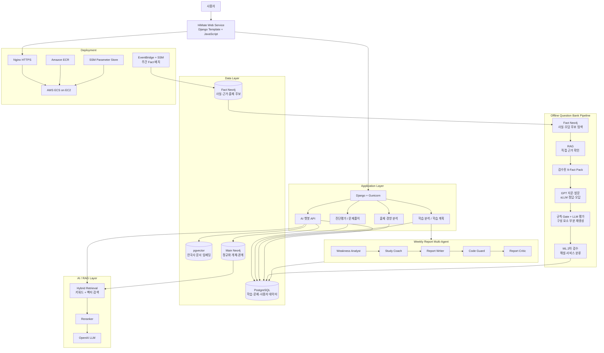
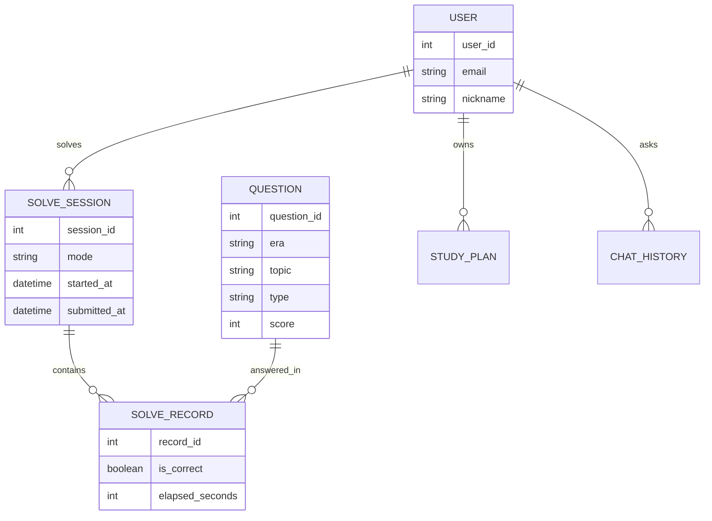
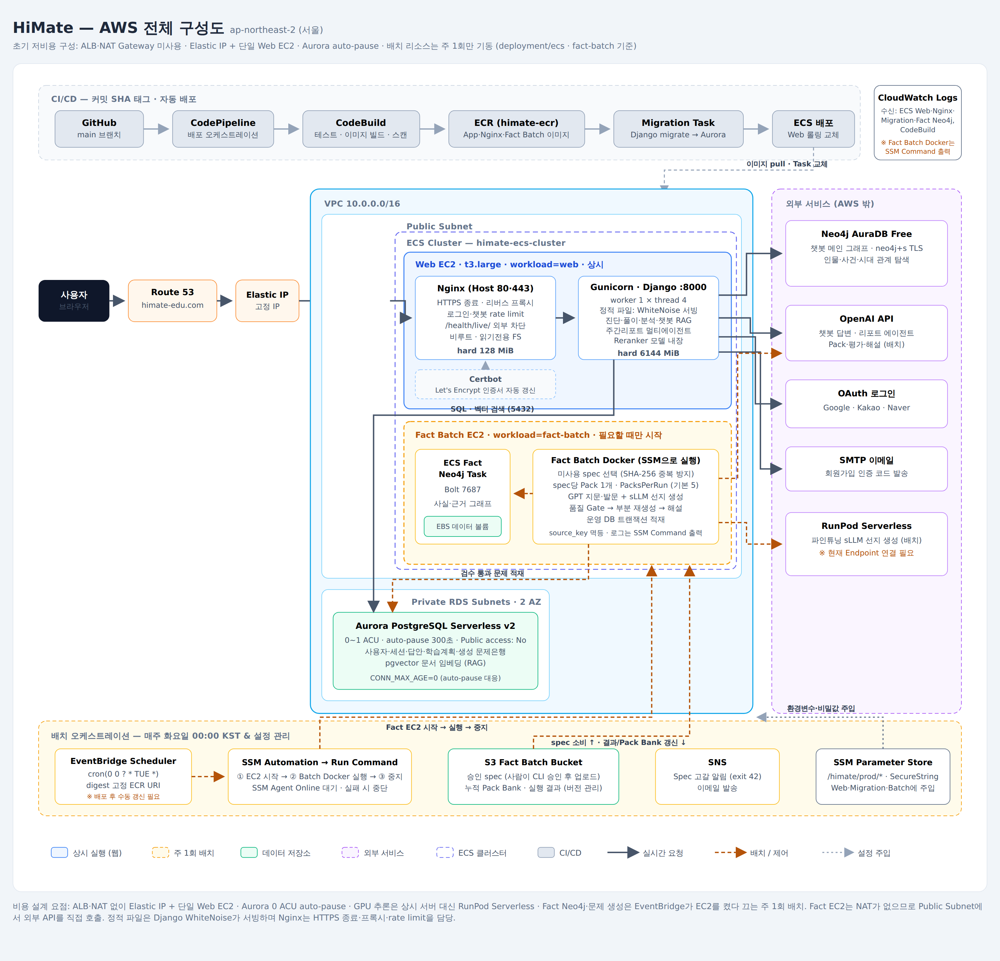

# SKN27-FINAL-2Team HiMate

## AI 기반 맞춤형 한국사 학습 메이트

> 진단평가부터 맞춤 문제풀이, 오답 분석, 학습 계획, 출제 경향 분석,  
> 근거 기반 AI 챗봇까지 연결하는 한국사 학습 서비스입니다.

## 팀 소개

**SKN27기 Final Project 2팀**

| 이름 | 역할 | 담당 |
| --- | --- | --- |
| 김&#8288;민&#8288;경 | PM · Infra · AI · Full-stack | GraphDB 설계·구현, 학습 계획 및 주간 리포트 Multi-Agent, 대시보드·분석 API/화면, AWS 배포 인프라 및 환경 설정 |
| 박&#8288;창&#8288;제 | APM · AI/ML · Full-stack | 한능검 기출 수집·통계 데이터 구축, 출제 경향 분석 ML 모델링, 생성 문제 검수 ML 모델링, 맞춤 문제 추천·진단·문제풀이 API 및 화면, 오답노트 |
| 권&#8288;환&#8288;성 | AI/RAG · Data · Full-stack | PostgreSQL·pgvector 임베딩, 한국사 학습자료 수집·전처리, RAG 검색·챗봇 답변·GraphDB 연동, 챗봇·진단 화면 및 연동 검증 |
| 주&#8288;연&#8288;중 | sLLM · AI · Backend · Frontend | 파인튜닝 데이터셋 구성 및 sLLM 학습·검증, 근거 기반 문제 Pack 설계, 문항 생성·평가·부분 재생성 파이프라인, 생성 문제은행 DB 적재, 회원가입·로그인·인증 API 및 화면 |

> 공동 수행: MVP 범위 확정, 와이어프레임·테이블 스키마 설계, 업무 스터디, 중간·최종 발표

---

## 프로젝트 개요

HiMate는 한국사 학습자가 자신의 실력을 진단하고, 취약 영역을 보완하며, 모르는 개념을 신뢰할 수 있는 근거와 함께 확인할 수 있도록 돕는 AI 학습 서비스입니다.

진단평가로 현재 실력과 취약 개념을 확인한 뒤, 시대·주제·유형·난이도에 맞는 문제를 풀이합니다. 학습 결과는 오답률과 성장 지표로 축적되며, AI 챗봇은 한국사 자료를 검색해 개념과 문제 해설을 제공합니다.

- 프로젝트명: **HiMate**
- 한 줄 소개: **진단부터 맞춤 문제풀이와 AI 질의응답까지 연결하는 한국사 학습 메이트**
- 개발 기간: **2026.06.14 ~ 2026.08.04**
- 대상 사용자: **한국사 학습자 및 한국사능력검정시험 준비생**

---

## 시장 조사

한국사능력검정시험은 공무원 시험 활용 확대와 함께 지속적인 학습 수요가 있는 분야입니다. 또한 한국사 교재와 강의 중심의 기존 학습 지출이 존재하므로, HIMATE는 새로운 학습 수요를 만들기보다 이를 **개인화된 AI 학습 경험**으로 전환하는 것을 목표로 합니다.

기존 서비스는 문제은행, 강의, 단순 해설에 집중하는 경향이 있습니다. HIMATE는 진단평가부터 맞춤 문제 생성, 근거 기반 해설, 오답 복습, 학습 계획까지 연결된 학습 흐름을 제공합니다.

## 문제 정의

한국사 학습자는 문제 풀이, 개념 검색, 오답 정리, 학습 계획을 각각 분리된 방식으로 관리해야 합니다. 또한 기존 서비스에는 다음과 같은 한계가 있습니다.

- 사용자별 취약 영역을 진단하고 학습 순서를 제안하는 기능이 부족합니다.
- 최신 출제 경향을 반영한 맞춤형 문제를 제공하기 어렵습니다.
- 생성형 AI 해설은 근거 부족과 사실 오류 가능성이 있습니다.
- 오답을 반복 학습과 다음 학습 계획으로 연결하기 어렵습니다.

HIMATE는 취약점 분석을 중심으로 문제 생성·근거 기반 해설·오답 복습을 연결해 이러한 학습 흐름의 단절을 해결합니다.

---
## 핵심 학습 흐름

HIMATE는 **진단평가 → 취약점 분석 → 맞춤 문제 생성 → 근거 기반 해설 → 오답 복습 → 학습 계획**을 하나로 연결한 한국사 AI 학습 플랫폼입니다.

- 진단평가 결과를 바탕으로 사용자별 취약 시대·주제·유형을 분석합니다.
- 취약점과 사용자가 선택한 조건을 반영해 맞춤형 문제를 생성합니다.
- AI 챗봇은 검색 근거를 바탕으로 개념 설명과 문제 해설을 제공합니다.
- 오답 노트와 학습 계획을 통해 취약 영역을 반복 학습할 수 있습니다.
---

## 개발 배경

한국사 학습에서는 많은 문제를 푸는 것뿐 아니라, 현재 실력과 취약 영역을 파악하고 반복 보완하는 과정이 중요합니다.

하지만 기존 학습 방식에는 다음과 같은 한계가 있습니다.

- 현재 실력과 취약 시대·주제를 객관적으로 확인하기 어렵습니다.
- 원하는 조건의 문제를 찾고 반복 풀이하기 번거롭습니다.
- 오답을 축적하고 복습하는 학습 흐름이 끊기기 쉽습니다.
- 역사 개념과 선지의 근거를 즉시 확인하기 어렵습니다.
- 목표 시험일까지의 학습 계획을 지속적으로 관리하기 어렵습니다.

HiMate는 진단, 맞춤 문제풀이, 오답 분석, 출제 경향 분석, 학습 계획, RAG 챗봇을 하나의 학습 흐름으로 연결했습니다.

---

## 핵심 기능

| 기능 | 설명 | 핵심 기술 |
| --- | --- | --- |
| 진&#8288;단&#8288;평&#8288;가 | 시대와 난이도를 균형 있게 구성한 진단 문제를 통해 현재 수준과 취약 영역을 분석합니다. | Django, PostgreSQL |
| 맞&#8288;춤 문&#8288;제&#8288;풀&#8288;이 | 시대·주제·유형·난이도를 선택해 원하는 조건의 문제를 풀이합니다. | Django, PostgreSQL |
| 오&#8288;답&#8288;노&#8288;트 | 풀이 이력과 오답을 저장하고, 오답 문제 중심의 복습을 지원합니다. | PostgreSQL |
| 학&#8288;습 분&#8288;석 | 시대·주제·유형별 오답률, 정답률, 평균 풀이 시간, 연속 학습일을 제공합니다. | Django, PostgreSQL |
| 학&#8288;습 계&#8288;획 | 목표 시험일과 진단 결과를 바탕으로 7일 학습 계획과 주간평가 흐름을 관리합니다. | Django, PostgreSQL |
| 주&#8288;간 리&#8288;포&#8288;트 | 학습 근거를 분석·코칭·작성·비평하는 멀티에이전트가 검증된 피드백을 생성합니다. | LangGraph, LangChain, OpenAI |
| 출&#8288;제 경&#8288;향 분&#8288;석 | 회차별 기출 통계와 ML 모델을 활용해 출제 경향을 분석합니다. | KLUE/RoBERTa-base, Python, ML |
| A&#8288;I 한&#8288;국&#8288;사 챗&#8288;봇 | 개념 및 문제 해설 질문에 대해 검색 근거 기반의 답변을 제공합니다. | OpenAI, LangChain, pgvector |
| 그&#8288;래&#8288;프 문&#8288;맥 보&#8288;강 | 역사 인물·사건·시대의 관계를 탐색해 챗봇 검색 품질을 보강합니다. | Neo4j |
| 문&#8288;제 생&#8288;성 파&#8288;이&#8288;프&#8288;라&#8288;인 | 검증된 역사 근거로 문제 Pack을 구성하고 문항·선지·해설을 생성한 뒤, 실패한 구성 요소만 부분 재생성합니다. | OpenAI LLM, Fine-tuned sLLM, RAG, Neo4j |
| 생&#8288;성 문&#8288;제 검&#8288;수 | 생성된 문항을 선지 단위로 검수해 오류 가능성이 높은 선지를 우선 확인하고, 형식·정답 유일성·역사 사실성 검사를 통해 품질을 관리합니다. | KLUE/RoBERTa-base, Python, ML |
---

## 기술 스택

| 구분 | 기술 |
| --- | --- |
| Backend | Python 3.12, Django 6.0.7, Django REST Framework 3.17.1, Gunicorn 26.0.0, WhiteNoise 6.12.0 |
| Frontend | Django Template, HTML5, CSS3, JavaScript |
| Database | PostgreSQL 16, pgvector, Neo4j 5 Community, Neo4j AuraDB |
| AI · Agent | OpenAI API 2.43.0, LangChain 1.3.12, LangGraph 1.2.5, `langchain-openai` 1.3.2 |
| RAG · NLP | Hybrid Retrieval, Sentence Transformers 5.6.0 CrossEncoder, MeCab-ko 1.0.2 |
| ML · 생성 | KLUE/RoBERTa-base, PyTorch CPU, Fine-tuned sLLM, RunPod Serverless |
| Web · Container | Docker, Nginx, Certbot, Ubuntu 24.04 기반 비루트 컨테이너 |
| AWS | Route 53, EC2, ECS on EC2, ECR, Aurora Serverless v2, S3, Systems Manager, EventBridge Scheduler, SNS, CloudWatch, Parameter Store |
| CI/CD | GitHub Actions, CodePipeline, CodeBuild, ECR image scan |

---

## 시스템 아키텍처



---

## 핵심 기술

### 1. 근거 기반 한국사 RAG 챗봇

챗봇은 사용자의 질문을 분석한 뒤 PostgreSQL의 pgvector 문서 검색과 키워드 검색을 결합해 관련 자료를 탐색합니다. 이후 재랭킹을 통해 관련도가 높은 근거를 선별하고, LLM이 이를 바탕으로 답변을 생성합니다.

```text
사용자 질문
 → 의도 분류
 → 검색 질의 보강
 → Hybrid Retrieval
 → Reranking
 → 근거 충분성 검증
 → OpenAI 기반 답변 생성
 → 출처와 함께 응답
```

- 개념 질문과 문제 해설 질문을 구분해 응답 형식을 구성합니다.
- 문제 질문에서는 선택지와 해설 문맥을 함께 활용합니다.
- 검색 근거가 부족하면 확정적 답변 대신 근거 부족 상태를 안내합니다.
- 스트리밍 응답을 지원합니다.

### 2. 역할을 분리한 Neo4j 이중 그래프

서비스 검색용 그래프와 문제 생성용 사실 그래프를 서로 다른 데이터베이스로 분리했습니다.

| 그래프 | 운영 위치 | 코드상 역할 |
| --- | --- | --- |
| Main Neo4j | Neo4j AuraDB | 정규화된 용어·인물·사건·시대 관계를 조회해 챗봇의 검색어와 관계 문맥을 보강합니다. |
| Fact Neo4j | Fact EC2의 ECS Task + EBS | 근거가 연결된 사실과 출제 후보를 탐색해 Pack과 오답 후보를 구성합니다. |

Main 그래프는 질문에서 핵심 토큰을 추출하고 `Term`, `Person`, `Event`와 주변 관계를 조회합니다. 결과는 답을 직접 결정하지 않고 PostgreSQL·pgvector 검색을 보강하는 키워드와 관계 요약으로만 사용합니다. 설정이 없거나 조회에 실패하면 그래프 문맥만 비활성화하고 기본 RAG 검색은 계속 동작합니다.

Fact 그래프는 승인된 `CanonicalEntity`와 `ResolvedSearchTerm`만 검색 시작점으로 사용하며, 임시 개체는 자동 다중 홉 탐색에서 제외합니다. 각 관계의 Fact ID와 Evidence를 보존해 문제 생성 단계에서 근거를 다시 확인할 수 있게 했습니다.

```text
사용자 질문 → Main Neo4j 관계 문맥 → pgvector·키워드 검색 → 답변
승인 spec → Fact Neo4j 후보 탐색 → 직접 근거 확인 → Pack → 문제 생성
```

적재 건수는 실행 시점마다 달라지므로 README에 고정하지 않습니다. Main 그래프는 `neo4j_load_manifest.json`, Fact 그래프는 release `manifest.json`으로 실제 적재 대상을 검증합니다. 상세 내용은 [`storage/neo4j/README.md`](storage/neo4j/README.md)와 [`storage/fact_neo4j/README.md`](storage/fact_neo4j/README.md)를 참고합니다.

### 3. LangGraph 주간 리포트 멀티에이전트

주간평가를 제출하면 결정론적 코드가 평가·계획 이행률·취약 영역·풀이 시간·혼동 관계·최근 출제 경향을 근거 데이터로 수집합니다. 이후 워커가 다음 LangGraph를 실행합니다.

```text
Weakness Analyst
 → Study Coach
 → Report Writer
 → Code Guard
 → Report Critic
 → 최종 리포트
```

- **Analyst**: 전달받은 근거 범위 안에서 강점과 개선점을 해석합니다.
- **Coach**: 새 학습 계획을 임의로 만들지 않고 실행 가능한 학습 행동을 제안합니다.
- **Writer**: 사용자에게 표시할 총평과 팁을 구조화된 스키마로 작성합니다.
- **Code Guard**: 근거에 없는 숫자, 존재하지 않는 evidence ID, 금지 표현을 코드로 차단합니다.
- **Critic**: 근거성·표현·실행 가능성을 재검토하고 실패하면 Writer로 되돌립니다.

스키마 오류, 모델 호출 실패 또는 최대 수정 횟수 초과 시에는 저장된 학습 지표로 만든 기본 문구를 사용합니다. 리포트는 `pending` 상태로 예약되고 별도 `run_weekly_report_worker`가 생성·재시도·복구하므로 평가 제출 요청과 LLM 호출을 분리했습니다. 상세 실행 방법은 [`app/analytics/README.md`](app/analytics/README.md)에 있습니다.

### 4. 마이페이지와 취약점 분석

마이페이지는 현재 로그인 사용자의 완료된 풀이 기록만 조회해 다음 정보를 구성합니다.

- 이번 주 정답률·풀이 수·평균 문제/세션 시간과 오늘을 포함한 연속 학습일
- 첫 주에는 직전 진단평가와 주간평가, 이후에는 직전 주간평가와 현재 주간평가 비교
- 최근 7일 기준 유형·주제·시대별 오답률과 세션·문항 상세 내역
- 목표 시험일 D-day, 활성 7일 학습 계획, 완료 계획 이력과 주간 리포트

취약점은 단순히 오답률이 높은 항목 하나를 표시하는 방식이 아닙니다. 최근 28일 기록에 14일 반감기 가중치를 적용하고, 표본이 적을 때 과대 판정하지 않도록 Wilson 하한을 취약 점수로 사용합니다.

| 판정 | 코드 기준 |
| --- | --- |
| 데이터 부족 | 유효 표본이 3 미만 |
| 취약 `WEAK` | 취약 점수 0.50 이상 |
| 안정 `STABLE` | 취약 점수 0.20 이하 |
| 중립 `NEUTRAL` | 취약과 안정 사이 |

마이페이지의 취약점 카드는 `WEAK`인 시대·주제 조합만 점수순으로 최대 10개 표시합니다. 최근 14일과 이전 14일의 표본이 각각 6개 이상이고 표본 수 균형이 맞을 때만 개선·악화 추세를 판정하며, 조건이 부족하면 추세를 단정하지 않습니다. 진단평가나 주간평가가 아직 없을 때는 0으로 오해할 수 있는 수치 대신 다음 행동을 안내합니다.

### 5. 문제 생성 및 검수 파이프라인

서비스가 문제 풀이 요청마다 실시간으로 문항을 생성하는 방식이 아니라, 검증된 역사 근거로 문제은행을 미리 구축하고 사용자의 시대·주제·유형·난이도 조건에 맞춰 문항을 구성하는 방식입니다.

```text
Fact Neo4j에서 관련 후보 탐색
 → RAG에서 후보별 직접 근거 확인
 → 검수된 사실 9개로 문제 Pack 구성
 → GPT 지문·발문 생성
 → 파인튜닝 sLLM 정답·오답 생성
 → 규칙 기반 구조 Gate
 → v1.8.6 LLM 품질 평가
 → 실패한 구성 요소만 부분 재생성
 → ML 선지 품질 2차 검수
 → 선지별 해설·서비스 분류 생성
 → 서비스 문제 DB 적재
```

- **근거 우선 생성**: GraphDB는 관계가 있는 후보를 찾는 데 사용하고, 문항에 사용할 역사 사실은 RAG에서 직접 근거를 다시 확인합니다.
- **Closed Pack**: 한 Pack에 서로 정답과 오답으로 회전할 수 있는 검수된 사실 9개를 저장하며, 같은 Pack에서 중복되지 않는 여러 문항을 생성할 수 있습니다.
- **역할 분리**: GPT는 근거 기반 지문·발문을, 파인튜닝 sLLM은 반복 비용이 큰 정답·오답 선지 생성을 담당합니다.
- **이중 평가**: 형식, 발문 성립성, 정답 유일성, 역사 사실성, 정답 노출 여부를 필수 Gate로 검사한 뒤 난이도와 선택지 품질을 10점 기준으로 평가합니다. Gate를 통과하고 8점 이상인 문항만 자동 승인합니다.
- **부분 재생성**: 평가기가 지문·발문·정답·오답 중 실패 위치와 수정 이유를 지정하면 해당 구성 요소만 다시 생성합니다. SLLM 수정이 반복 실패하면 직전 출력과 평가 피드백을 전달해 LLM이 같은 구성 요소만 수리합니다.
- **재개 가능한 실행**: 문항별 입력·출력·평가·수리 이력을 체크포인트에 저장하여 중단되더라도 완료 문항을 다시 호출하지 않고 실패 지점부터 재개합니다.
- **지원 문항 유형**: 일반 선택형, 연대기형, 이미지 자료형, 이미지 선지형을 지원하며 유형·시대·난이도 비율에 맞춘 혼합 모의고사를 구성할 수 있습니다.

문항당 선택지 5개·정답 1개 구조, `source_key` 중복, 선지 해설과 서비스 분류의 일치 여부를 적재 전에 검증합니다. 실제 운영 적재 건수는 배치 실행 결과와 DB에서 확인합니다.

### 6. 생성 문제 검수 ML

생성 문제 검수 ML은 문제의 정답을 예측하는 모델이 아니라, **검수자가 우선 확인해야 할 오류 가능성이 높은 선지**를 추천하는 모델입니다.

- 문항 전체가 아닌 선지 단위 이진 분류로 오류 위치를 세밀하게 탐지합니다.
- 형식, 정답 유일성, 역사 사실성 등 필수 검사를 통과한 문항만 품질 평가를 진행합니다.
- 문제가 발생한 지문·발문·정답·오답 선지만 부분 수정하여 재생성 비용과 시간을 줄입니다.

### 7. 최신 트렌드 분석 ML

기출문제의 `지문·질문·키워드`를 입력으로 사용해 문항의 **시대(`era`)**, **통합 주제(`topic_train`)**, **세부 주제(`topic`)**를 각각 분류하는 KLUE/RoBERTa-base 모델을 구축했습니다.

```text
기출 문항 text
 → 시대·통합 주제·세부 주제 분류
 → 시대 + 통합 주제 조합 집계
 → 최근 5회차 TOP5 트렌드 제공
 → 학습 계획 및 문제 생성 우선순위에 활용

```
- **라벨 체계 개선**: 규칙 기반 라벨을 재검토해 시대 520건(32.5%), 세부 주제 652건(40.8%), 통합 주제 667건(41.7%)을 수정했습니다. 성능 개선의 핵심은 모델 교체보다 문항 문맥에 맞게 라벨 기준을 정비한 데 있습니다.
- **신뢰도 검증**: 데이터 분포를 유지하는 3-fold Stratified Cross Validation으로 파라미터를 선택하고, 최신 회차를 분리한 시간 순서 평가로 일반화 성능을 확인했습니다.
- **최신 회차 평가 성능**: 시대 분류는 Macro F1 0.9187, 통합 주제 분류는 Macro F1 0.8050을 기록했습니다.
- **트렌드 산출 기준**: 학습 계획과 문제 생성 우선순위에는 직전 5회차의 실제 기출 분포를 집계한 TOP5를 사용합니다. ML 분류 결과는 신규 생성 문제의 시대·주제 메타데이터를 보완하고, 기출 분류 결과와 비교·검증하는 용도로 활용합니다.
- **서비스 연동**: 시대·통합 주제·세부 주제별 TOP5 결과를 ml_trend_top5 테이블에 적재하여 학습 계획과 문제 생성 모듈에서 공통으로 조회할 수 있도록 구성했습니다.

---

## 데이터 설계

### 한국사 데이터

다음 자료를 수집·전처리하여 문제 생성과 RAG 챗봇에 활용합니다.

- 국사편찬위원회 「신편 한국사」
- 국사편찬위원회 「사료로 본 한국사」
- 한국민족문화대백과사전
- 한국고전종합DB 관계망 데이터
- 한국사 연대기·연표
- 한국역사용어시소러스
- 한국사 이미지 자료
- 교과서 용어 해설
- 한국사능력검정시험 기출문제

### 데이터 저장소 구성

| 저장소 | 역할 |
| --- | --- |
| PostgreSQL | 사용자, 진단·문제풀이 세션, 답안, 오답노트, 학습 계획, 분석 지표 저장 |
| pgvector | 한국사 문서 임베딩 저장 및 벡터 유사도 검색 |
| Main Neo4j | 정규화된 용어·인물·사건 관계 탐색 및 챗봇 RAG 문맥 보강 |
| Fact Neo4j | Evidence가 연결된 사실·관계 탐색 및 문제 Pack 후보 구성 |



---

## 화면 구성

| 화면 | 설명 |
| --- | --- |
| 메인 | 서비스 기능과 학습 흐름 안내 |
| 진단평가 | 진단 시험 시작, 풀이, 결과 및 취약 영역 확인 |
| 문제풀이 | 조건 선택 기반의 맞춤 문제 풀이 |
| 문제 결과 | 정답, 해설, 풀이 결과 확인 |
| 오답노트 | 오답 문제 저장 및 재풀이 |
| AI 챗봇 | 한국사 개념·문제 질문 및 근거 기반 답변 |
| 나의 학습실 | 성장 지표, 오답률, 학습 계획, 주간 리포트 확인 |


| 화면 | 미리보기 |
| --- | --- |
| 진&#8288;단평&#8288;가 |  |
| 취&#8288;약&#8288;점 분&#8288;석 |  |
| 학&#8288;습 플&#8288;래&#8288;너 |  |
| 맞&#8288;춤 문&#8288;제 설&#8288;정 |  |
| A&#8288;I 챗&#8288;봇 |  |
| 오&#8288;답 노&#8288;트 |  |

---

## 프로젝트 구조

```text
SKN27-FINAL-2Team/
├─ app/                        # Django 서비스 애플리케이션
│  ├─ analytics/               # 학습 분석, 학습 계획, 주간 리포트
│  ├─ chatbot/                 # RAG 챗봇, 검색·재랭킹·그래프 문맥
│  ├─ config/                  # Django 설정, 보안, 헬스체크
│  ├─ diagnosis/               # 진단평가 및 결과 분석
│  ├─ pages/                   # 메인 페이지
│  ├─ question/                # 문제풀이, 세션, 오답노트
│  ├─ user/                    # 회원·로그인·소셜 로그인
│  ├─ static/                  # CSS, JavaScript, 이미지
│  └─ templates/               # HTML 템플릿
├─ ai/
│  ├─ question_generation/     # 문제 생성·평가·후처리 파이프라인
│  ├─ ml/                      # ML 실험 및 출제 경향 분석
│  ├─ llm/                     # LLM 파인튜닝 작업
│  └─ pack_generation/         # 문제 생성용 Pack 구축
├─ etl/                        # 한국사·기출 데이터 수집 및 전처리
├─ storage/
│  ├─ postgresql/              # 로컬 PostgreSQL 구성·스키마
│  ├─ neo4j/                   # Main Neo4j 구성·스키마
│  └─ fact_neo4j/              # 문제 생성용 Fact Neo4j
├─ deployment/
│  ├─ ecs/                     # Web·migration·Fact Neo4j ECS 설정
│  ├─ fact-batch/              # S3·SSM·EventBridge 기반 주간 문제 생성 배치
│  └─ nginx/                   # HTTPS reverse proxy·Certbot 설정
├─ requirements/               # Python 의존성
├─ test/                       # 실험, 평가, 회귀·통합 테스트
├─ Dockerfile
├─ buildspec.yml               # AWS CodeBuild 파이프라인
└─ README.md
```

---

## 실행 방법

### 1. 저장소 복제 및 가상환경 구성

```powershell
git clone https://github.com/SKNETWORKS-FAMILY-AICAMP/SKN27-FINAL-2Team.git
cd SKN27-FINAL-2Team

python -m venv .venv
.\.venv\Scripts\Activate.ps1
pip install -r requirements\base.txt
```

### 2. 환경 변수 설정

루트 경로에 `.env` 파일을 생성하고 아래 항목을 설정합니다.

```env
DJANGO_SECRET_KEY=change-me
DJANGO_DEBUG=true
DJANGO_ALLOWED_HOSTS=localhost,127.0.0.1

POSTGRES_DB=history_rag
POSTGRES_USER=himate
POSTGRES_PASSWORD=change-me
POSTGRES_HOST=localhost
POSTGRES_PORT=5432

NEO4J_URI=bolt://localhost:7687
NEO4J_USER=neo4j
NEO4J_PASSWORD=change-me
NEO4J_DATABASE=neo4j

# 문제 생성용 Fact Neo4j를 로컬에서 실행할 때 사용
FACT_NEO4J_URI=bolt://localhost:7688
FACT_NEO4J_USER=neo4j
FACT_NEO4J_PASSWORD=change-me

OPENAI_API_KEY=your-openai-api-key
OPENAI_CHAT_MODEL=your-model-name
```

### 3. 로컬 데이터베이스 실행

```powershell
docker compose --env-file .env -f storage\postgresql\docker-compose.yml up -d
docker compose --env-file .env -f storage\neo4j\docker-compose.yml up -d
# 문제 생성 파이프라인을 실행할 때만 추가
docker compose --env-file .env -f storage\fact_neo4j\docker-compose.yml up -d
```

### 4. Django 실행

```powershell
.\.venv\Scripts\python.exe app\manage.py check
.\.venv\Scripts\python.exe app\manage.py runserver
```

브라우저에서 `http://127.0.0.1:8000`으로 접속합니다.

### 5. 문제 Pack 생성 및 출제

```powershell
.\.venv\Scripts\python.exe -m ai.question_generation.interactive_cli
```

통합 CLI에서 GraphDB와 RAG를 이용한 신규 Pack 생성, 기존 검수 Pack 출제, 방금 생성한 Pack의 회전 출제, 생성 Pack 수와 문항 수 설정을 선택할 수 있습니다. 실제 생성·평가·DB 적재 명령과 데이터 경로는 [`ai/question_generation/README.md`](ai/question_generation/README.md)에 정리되어 있습니다.

---

## 테스트 및 배포

### 테스트

```powershell
.\.venv\Scripts\python.exe app\manage.py test
```

CI에서는 다음 항목을 검증합니다.

- PostgreSQL 기반 Django 테스트
- Neo4j mock 회귀 테스트
- Neo4j 서비스 통합 테스트
- 운영 Docker 이미지 빌드

### 배포

#### AWS 전체 구성도



```text
사용자 → Route 53 → Elastic IP → Web EC2의 ECS Service
                               ├─ Nginx 80/443
                               └─ Gunicorn/Django 8000
                                      ├─ Private Aurora PostgreSQL + pgvector
                                      └─ Main Neo4j AuraDB

GitHub main → CodePipeline → CodeBuild → ECR
             → Django migration Task → Web ECS Service 배포

EventBridge Scheduler → SSM Automation → Fact EC2 시작
 → Fact Neo4j + digest 고정 Fact 배치 이미지
 → OpenAI/RunPod 문제 생성 → Aurora 적재·S3 산출물 저장 → Fact EC2 중지
```

- **저비용 네트워크**: 서울 리전의 단일 Public Web EC2와 Elastic IP를 사용하며 ALB와 NAT Gateway는 두지 않습니다. Aurora는 2개 AZ의 Private DB Subnet에 두고 Public Access를 차단합니다.
- **상시 웹**: `himate.workload=web` 속성의 ECS Container Instance에서 Nginx와 Django를 한 Task로 실행합니다. Nginx가 HTTPS와 reverse proxy를 담당하고 정적 파일은 Django의 WhiteNoise가 제공합니다.
- **데이터베이스**: Aurora PostgreSQL Serverless v2는 pgvector와 서비스 데이터를 저장하고, Main Neo4j AuraDB는 챗봇 관계 검색을 담당합니다. 자동 일시 중지에 대응하기 위해 DB 연결을 장기 유지하지 않습니다.
- **CI/CD**: Git commit SHA로 App·Nginx·Fact 배치 이미지를 태깅합니다. ECR은 태그 불변성과 push 스캔을 사용하며 CodeBuild가 이미지·취약점 기준을 검사한 뒤 migration Task와 ECS 배포 산출물을 만듭니다.
- **주간 문제 생성**: 매주 화요일 00:00 KST에 Scheduler가 SSM Runbook을 호출합니다. 사람이 CLI에서 승인한 spec만 소비하고, Pack·문제 생성과 품질 검증이 모두 성공해야 운영 DB와 누적 S3 Pack Bank를 갱신합니다.
- **실패 안전성**: 미사용 spec이 부족하면 재사용하지 않고 종료 코드 42로 중단해 SNS 알림을 보냅니다. Automation은 성공·실패·취소 경로에서 Fact EC2를 중지하도록 구성합니다.
- **보안**: 운영 값은 `/himate/prod/*` Parameter Store 경로에서 주입하며 비밀번호와 API Key는 `SecureString`으로 관리합니다. App·Nginx 컨테이너는 비루트, read-only root filesystem, Linux capability 제거 설정을 사용합니다.
- **관측**: ECS와 CodeBuild 로그는 CloudWatch에서 확인하고, Fact 배치 실행 결과와 manifest는 S3에 버전별로 보관합니다.

상세 절차와 현재 운영 제약은 [`deployment/ecs/README.md`](deployment/ecs/README.md)와 [`deployment/fact-batch/README.md`](deployment/fact-batch/README.md)를 참고합니다. 저장소에는 실제 비밀번호, API Key, 개인 키를 기록하지 않습니다.

---

## 향후 계획

- 사용자별 취약 개념 기반 문제 추천 고도화
- 학습 이력 기반 개인화 난이도 조절
- RAG 평가셋 확장 및 챗봇 답변 품질 개선
- 문제 생성 평가 골든셋 확대 및 평가 비용 최적화
- 출제 경향 예측 결과 시각화 고도화
- 한국사 이미지·연표 자료를 활용한 멀티모달 학습 기능 확장
