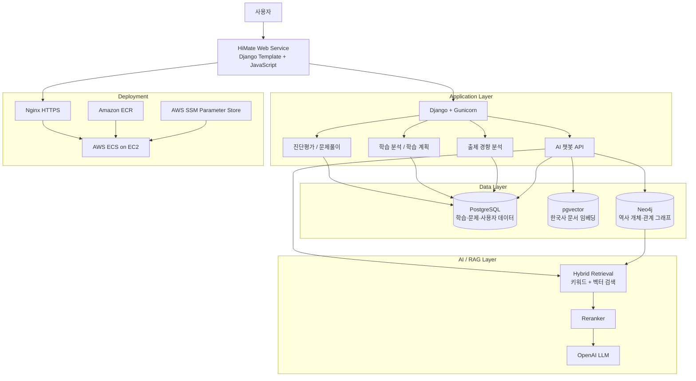
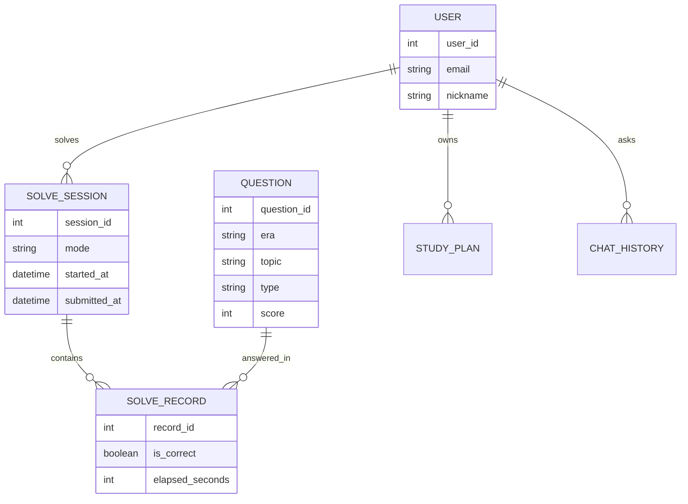
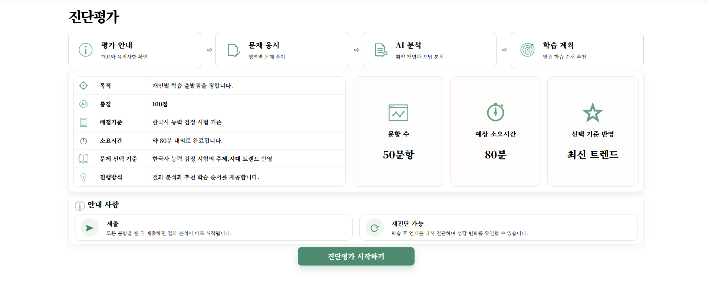
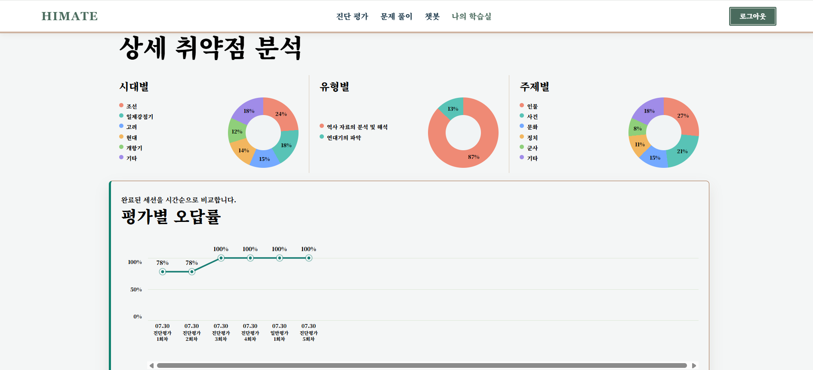
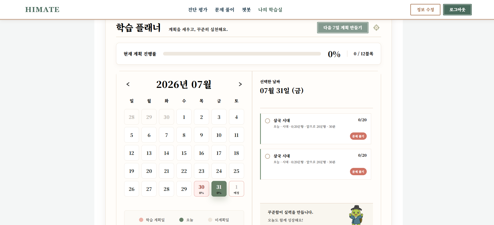
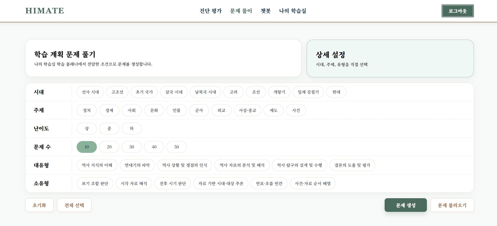
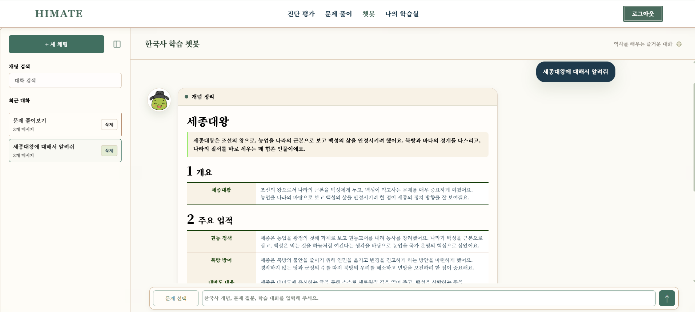
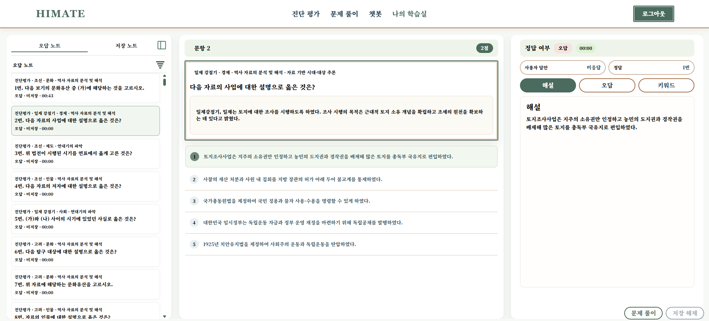

# SKN27-FINAL-2Team HiMate

## AI 기반 맞춤형 한국사 학습 메이트

> 진단평가부터 맞춤 문제풀이, 오답 분석, 학습 계획, 출제 경향 분석,  
> 근거 기반 AI 챗봇까지 연결하는 한국사 학습 서비스입니다.

## 팀 소개

**SKN27기 Final Project 2팀**

| 이름 | 역할 | 담당 |
| --- | --- | --- |
| 김&#8288;민&#8288;경 | PM · Backend · Infra | GraphDB 설계·구현, 학습 계획 및 주간 리포트 Multi-Agent, 대시보드·분석 API/화면, AWS 배포 인프라 및 환경 설정 |
| 박&#8288;창&#8288;제 | APM · AI/ML · Full-stack | 한능검 기출 수집·통계 데이터 구축, 출제 경향 예측 ML 모델링, 맞춤 문제 추천·진단·문제풀이 API 및 화면, 오답노트, 추천·학습계획 통합 |
| 권&#8288;환&#8288;성 | AI/RAG · Data · Full-stack | PostgreSQL·pgvector 임베딩, 한국사 학습자료 수집·전처리, RAG 검색·챗봇 답변·GraphDB 연동, 챗봇·진단 화면 및 연동 검증 |
| 주&#8288;연&#8288;중 | sLLM · Backend · Frontend | 파인튜닝 데이터셋 구성 및 LLM 모델 학습·검증, 회원가입·로그인·인증 API, 로그인 화면, 사용자 데이터 연동 |

> 공동 수행: MVP 범위 확정, 와이어프레임·테이블 스키마 설계, 업무 스터디, 중간·최종 발표

---

## 프로젝트 개요

HiMate는 한국사 학습자가 자신의 실력을 진단하고, 취약 영역을 보완하며, 모르는 개념을 신뢰할 수 있는 근거와 함께 확인할 수 있도록 돕는 AI 학습 서비스입니다.

진단평가로 현재 실력과 취약 개념을 확인한 뒤, 시대·주제·유형·난이도에 맞는 문제를 풀이합니다. 학습 결과는 오답률과 성장 지표로 축적되며, AI 챗봇은 한국사 자료를 검색해 개념과 문제 해설을 제공합니다.

- 프로젝트명: **HiMate**
- 한 줄 소개: **진단부터 맞춤 문제풀이와 AI 질의응답까지 연결하는 한국사 학습 메이트**
- 개발 기간: **2026.06.14 ~ 2026.08.04**
- 대상 사용자: **한국사 학습자 및 한국사능력검정시험 준비생**

---

## 시장 조사

한국사능력검정시험은 공무원 시험 활용 확대와 함께 지속적인 학습 수요가 있는 분야입니다. 또한 한국사 교재와 강의 중심의 기존 학습 지출이 존재하므로, HIMATE는 새로운 학습 수요를 만들기보다 이를 **개인화된 AI 학습 경험**으로 전환하는 것을 목표로 합니다.

기존 서비스는 문제은행, 강의, 단순 해설에 집중하는 경향이 있습니다. HIMATE는 진단평가부터 맞춤 문제 생성, 근거 기반 해설, 오답 복습, 학습 계획까지 연결된 학습 흐름을 제공합니다.

## 문제 정의

한국사 학습자는 문제 풀이, 개념 검색, 오답 정리, 학습 계획을 각각 분리된 방식으로 관리해야 합니다. 또한 기존 서비스에는 다음과 같은 한계가 있습니다.

- 사용자별 취약 영역을 진단하고 학습 순서를 제안하는 기능이 부족합니다.
- 최신 출제 경향을 반영한 맞춤형 문제를 제공하기 어렵습니다.
- 생성형 AI 해설은 근거 부족과 사실 오류 가능성이 있습니다.
- 오답을 반복 학습과 다음 학습 계획으로 연결하기 어렵습니다.

HIMATE는 취약점 분석을 중심으로 문제 생성·근거 기반 해설·오답 복습을 연결해 이러한 학습 흐름의 단절을 해결합니다.

---
## 핵심 학습 흐름

HIMATE는 **진단평가 → 취약점 분석 → 맞춤 문제 생성 → 근거 기반 해설 → 오답 복습 → 학습 계획**을 하나로 연결한 한국사 AI 학습 플랫폼입니다.

- 진단평가 결과를 바탕으로 사용자별 취약 시대·주제·유형을 분석합니다.
- 취약점과 사용자가 선택한 조건을 반영해 맞춤형 문제를 생성합니다.
- AI 챗봇은 검색 근거를 바탕으로 개념 설명과 문제 해설을 제공합니다.
- 오답 노트와 학습 계획을 통해 취약 영역을 반복 학습할 수 있습니다.
---

## 개발 배경

한국사 학습에서는 많은 문제를 푸는 것뿐 아니라, 현재 실력과 취약 영역을 파악하고 반복 보완하는 과정이 중요합니다.

하지만 기존 학습 방식에는 다음과 같은 한계가 있습니다.

- 현재 실력과 취약 시대·주제를 객관적으로 확인하기 어렵습니다.
- 원하는 조건의 문제를 찾고 반복 풀이하기 번거롭습니다.
- 오답을 축적하고 복습하는 학습 흐름이 끊기기 쉽습니다.
- 역사 개념과 선지의 근거를 즉시 확인하기 어렵습니다.
- 목표 시험일까지의 학습 계획을 지속적으로 관리하기 어렵습니다.

HiMate는 진단, 맞춤 문제풀이, 오답 분석, 출제 경향 분석, 학습 계획, RAG 챗봇을 하나의 학습 흐름으로 연결했습니다.

---

## 핵심 기능

| 기능 | 설명 | 핵심 기술 |
| --- | --- | --- |
| 진단평가 | 시대와 난이도를 균형 있게 구성한 진단 문제를 통해 현재 수준과 취약 영역을 분석합니다. | Django, PostgreSQL |
| 맞춤 문제풀이 | 시대·주제·유형·난이도를 선택해 원하는 조건의 문제를 풀이합니다. | Django, PostgreSQL |
| 오답노트 | 풀이 이력과 오답을 저장하고, 오답 문제 중심의 복습을 지원합니다. | PostgreSQL |
| 학습 분석 | 시대·주제·유형별 오답률, 정답률, 평균 풀이 시간, 연속 학습일을 제공합니다. | Django, PostgreSQL |
| 학습 계획 | 목표 시험일과 진단 결과를 바탕으로 학습 계획과 복습 흐름을 관리합니다. | Multi-Agent, PostgreSQL |
| 출제 경향 분석 | 회차별 기출 통계와 ML 모델을 활용해 출제 경향을 분석합니다. | KLUE/RoBERTa-base, Python, ML |
| AI 한국사 챗봇 | 개념 및 문제 해설 질문에 대해 검색 근거 기반의 답변을 제공합니다. | OpenAI, LangChain, LangGraph |
| 그래프 문맥 보강 | 역사 인물·사건·시대의 관계를 탐색해 챗봇 검색 품질을 보강합니다. | Neo4j |
| 문제 생성 파이프라인 | 한국사 데이터와 생성 규칙을 바탕으로 문제·선지·해설을 생성하고 검증합니다. | LLM, ML,Python |
| 생성 문제 검수 | 생성된 문항을 선지 단위로 검수해 오류 가능성이 높은 선지를 우선 확인하고, 형식·정답 유일성·역사 사실성 검사를 통해 품질을 관리합니다. | KLUE/RoBERTa-base, Python, ML |
---

## 기술 스택

**Backend**  


**Frontend**  


**Database**  


**AI · RAG · ML**  


**Infrastructure · CI/CD**  


---

## 시스템 아키텍처



---

## 핵심 기술

### 1. 근거 기반 한국사 RAG 챗봇

챗봇은 사용자의 질문을 분석한 뒤 PostgreSQL의 pgvector 문서 검색과 키워드 검색을 결합해 관련 자료를 탐색합니다. 이후 재랭킹을 통해 관련도가 높은 근거를 선별하고, LLM이 이를 바탕으로 답변을 생성합니다.

```text
사용자 질문
 → 의도 분류
 → 검색 질의 보강
 → Hybrid Retrieval
 → Reranking
 → 근거 충분성 검증
 → OpenAI 기반 답변 생성
 → 출처와 함께 응답
```

- 개념 질문과 문제 해설 질문을 구분해 응답 형식을 구성합니다.
- 문제 질문에서는 선택지와 해설 문맥을 함께 활용합니다.
- 검색 근거가 부족하면 확정적 답변 대신 근거 부족 상태를 안내합니다.
- 스트리밍 응답을 지원합니다.

### 2. Neo4j 그래프 기반 문맥 보강

역사 인물, 사건, 시대, 주제 사이의 관계를 Neo4j에 저장하고 질문의 핵심 용어와 연관된 개체를 탐색합니다. 이 결과를 RAG 검색 질의에 반영해 더 적절한 역사 자료를 찾도록 구성했습니다.

```text
질문: "세종의 업적 알려줘"
 → 핵심 용어 추출: 세종
 → Neo4j 관계 탐색: 인물 · 정책 · 문화 · 제도
 → 검색 질의 보강
 → 관련 한국사 자료 검색
 → 근거 기반 답변 생성
```

한국사 개체는 같은 이름이 서로 다른 대상을 가리키거나, 같은 대상이 여러 표기로 나타나는 문제가 있습니다.  
예를 들어 `고종`은 고려 고종과 조선 고종을 모두 의미할 수 있으며, `류성룡`과 `유성룡`은 같은 인물의 다른 표기입니다.

이름이 같다는 이유만으로 개체를 자동 병합하지 않고, 여러 근거를 통과한 경우에만 동일 개체로 확정합니다.

- **다신호 병합 게이트**: 한자 표기, 생몰년, 시대, 서로 다른 출처의 지지가 동시에 충족될 때만 병합합니다.
- **충돌 시 보류**: 근거가 하나라도 충돌하면 자동 병합하지 않고 분리된 개체로 유지합니다.
- **Complete-link 군집화**: `A=B`, `B=C` 관계만으로 `A=C`를 추론하지 않으며, 모든 개체 간 직접 근거가 있을 때만 군집화합니다.
- **LLM 제안 + 코드 검증**: LLM의 동일 개체 판정은 제안으로만 사용하고, 최종 확정은 코드 규칙이 담당합니다.

정제된 개체와 관계는 Neo4j에 적재합니다. 이를 통해 챗봇은 질문의 인물·사건·시대 관계를 보조 검색하고, 문제 생성 과정에서는 정답과 같은 시대·유형·관계 경로를 공유하는 대상을 오답 후보로 활용합니다.

또한 정답 개체와 오답 후보 사이의 그래프 거리(홉 수)를 활용해 난이도를 조절합니다.  
가까운 관계의 대상은 높은 혼동 가능성을 가진 오답 후보가 되고, 더 먼 관계의 대상은 난이도 조절에 활용됩니다.

- 적재 규모: 엔티티 **19,186개**, 사실 데이터 **39,836개**
- 관계 추출: 공식 역사 자료의 인물·사건 관계, 시소러스 분류, 설명문 근거
- 검수 원칙: `VERIFIED` 상태와 검색 가능 조건을 통과한 관계만 활용
- 그래프 관계 검수 결과: 오병합 **0건**, 관계 커버리지 **89.2%**


### 3. 학습 이력 기반 진단·분석

진단평가 및 문제풀이 세션을 저장하고 학습자의 결과를 다음과 같이 분석합니다.

- 시대별 오답률
- 주제별 오답률
- 문제 유형별 오답률
- 정답률 및 평균 풀이 시간
- 풀이 문제 수와 연속 학습일
- 진단 결과 변화
- 학습 계획 이행 현황

### 4. 문제 생성 및 검수 파이프라인

문제 생성은 단순한 LLM 호출이 아니라 데이터팩 구성, 문항·선지·해설 생성, 규칙 기반 검증, 품질 평가 및 후처리 과정을 거칩니다.

```text
한국사 데이터 수집
 → 전처리·정규화
 → 문제 생성용 Pack 구성
 → 문항·선지·해설 생성
 → 규칙 기반 검증
 → 평가·후처리
 → 서비스 문제 DB 적재
```
### 5. 생성 문제 검수 ML

생성 문제 검수 ML은 문제의 정답을 예측하는 모델이 아니라, **검수자가 우선 확인해야 할 오류 가능성이 높은 선지**를 추천하는 모델입니다.

- 문항 전체가 아닌 선지 단위 이진 분류로 오류 위치를 세밀하게 탐지합니다.
- 출제 경향 분석 결과는 문제 생성과 학습 계획의 기초 데이터로 활용합니다.
- 형식, 정답 유일성, 역사 사실성 등 필수 검사를 통과한 문항만 품질 평가를 진행합니다.
- 문제가 발생한 지문·발문·정답·오답 선지만 부분 수정하여 재생성 비용과 시간을 줄입니다.

---

## 데이터 설계

### 한국사 데이터

다음 자료를 수집·전처리하여 문제 생성과 RAG 챗봇에 활용합니다.

- 국사편찬위원회 「신편 한국사」
- 국사편찬위원회 「사료로 본 한국사」
- 한국민족문화대백과사전
- 한국고전종합DB 관계망 데이터
- 한국사 연대기·연표
- 한국역사용어시소러스
- 한국사 이미지 자료
- 교과서 용어 해설
- 한국사능력검정시험 기출문제

### 이중 데이터베이스 구조

| 저장소 | 역할 |
| --- | --- |
| PostgreSQL | 사용자, 진단·문제풀이 세션, 답안, 오답노트, 학습 계획, 분석 지표 저장 |
| pgvector | 한국사 문서 임베딩 저장 및 벡터 유사도 검색 |
| Neo4j | 인물·사건·시대·주제 등 한국사 개체의 관계 탐색 및 RAG 문맥 보강 |



---

## 화면 구성

| 화면 | 설명 |
| --- | --- |
| 메인 | 서비스 기능과 학습 흐름 안내 |
| 진단평가 | 진단 시험 시작, 풀이, 결과 및 취약 영역 확인 |
| 문제풀이 | 조건 선택 기반의 맞춤 문제 풀이 |
| 문제 결과 | 정답, 해설, 풀이 결과 확인 |
| 오답노트 | 오답 문제 저장 및 재풀이 |
| AI 챗봇 | 한국사 개념·문제 질문 및 근거 기반 답변 |
| 나의 학습실 | 성장 지표, 오답률, 학습 계획, 주간 리포트 확인 |


| 화면 | 미리보기 |
| --- | --- |
| 진&#8288;단평&#8288;가 |  |
| 취&#8288;약&#8288;점 분&#8288;석 |  |
| 학&#8288;습 플&#8288;래&#8288;너 |  |
| 맞&#8288;춤 문&#8288;제 설&#8288;정 |  |
| A&#8288;I 챗&#8288;봇 |  |
| 오&#8288;답 노&#8288;트 |  |

---

## 프로젝트 구조

```text
SKN27-FINAL-2Team/
├─ app/                        # Django 서비스 애플리케이션
│  ├─ analytics/               # 학습 분석, 학습 계획, 주간 리포트
│  ├─ chatbot/                 # RAG 챗봇, 검색·재랭킹·그래프 문맥
│  ├─ config/                  # Django 설정, 보안, 헬스체크
│  ├─ diagnosis/               # 진단평가 및 결과 분석
│  ├─ pages/                   # 메인 페이지
│  ├─ question/                # 문제풀이, 세션, 오답노트
│  ├─ user/                    # 회원·로그인·소셜 로그인
│  ├─ static/                  # CSS, JavaScript, 이미지
│  └─ templates/               # HTML 템플릿
├─ ai/
│  ├─ question_generation/     # 문제 생성·평가·후처리 파이프라인
│  ├─ ml/                      # ML 실험 및 출제 경향 분석
│  ├─ llm/                     # LLM 파인튜닝 작업
│  └─ pack_generation/         # 문제 생성용 Pack 구축
├─ etl/                        # 한국사·기출 데이터 수집 및 전처리
├─ storage/
│  ├─ postgresql/              # 로컬 PostgreSQL 구성·스키마
│  ├─ neo4j/                   # Main Neo4j 구성·스키마
│  └─ fact_neo4j/              # 문제 생성용 Fact Neo4j
├─ deployment/
│  └─ ecs/                     # AWS ECS·Nginx 배포 설정
├─ requirements/               # Python 의존성
├─ test/                       # 실험, 평가, 회귀·통합 테스트
├─ Dockerfile
├─ buildspec.yml               # AWS CodeBuild 파이프라인
└─ README.md
```

---

## 실행 방법

### 1. 저장소 복제 및 가상환경 구성

```powershell
git clone https://github.com/SKNETWORKS-FAMILY-AICAMP/SKN27-FINAL-2Team.git
cd SKN27-FINAL-2Team

python -m venv .venv
.\.venv\Scripts\Activate.ps1
pip install -r requirements\base.txt
```

### 2. 환경 변수 설정

루트 경로에 `.env` 파일을 생성하고 아래 항목을 설정합니다.

```env
DJANGO_SECRET_KEY=change-me
DJANGO_DEBUG=true
DJANGO_ALLOWED_HOSTS=localhost,127.0.0.1

POSTGRES_DB=history_rag
POSTGRES_USER=himate
POSTGRES_PASSWORD=change-me
POSTGRES_HOST=localhost
POSTGRES_PORT=5432

NEO4J_URI=bolt://localhost:7687
NEO4J_USER=neo4j
NEO4J_PASSWORD=change-me

OPENAI_API_KEY=your-openai-api-key
OPENAI_CHAT_MODEL=your-model-name
```

### 3. 로컬 데이터베이스 실행

```powershell
docker compose --env-file .env -f storage\postgresql\docker-compose.yml up -d
docker compose --env-file .env -f storage\neo4j\docker-compose.yml up -d
```

### 4. Django 실행

```powershell
.\.venv\Scripts\python.exe app\manage.py check
.\.venv\Scripts\python.exe app\manage.py runserver
```

브라우저에서 `http://127.0.0.1:8000`으로 접속합니다.

---

## 테스트 및 배포

### 테스트

```powershell
.\.venv\Scripts\python.exe app\manage.py test
```

CI에서는 다음 항목을 검증합니다.

- PostgreSQL 기반 Django 테스트
- Neo4j mock 회귀 테스트
- Neo4j 서비스 통합 테스트
- 운영 Docker 이미지 빌드

### 배포

```text
Route53
 → Elastic IP
 → Public EC2 / ECS on EC2
 → Nginx HTTPS
 → Gunicorn / Django
 → Aurora PostgreSQL Serverless v2 + Neo4j AuraDB

CodePipeline
 → CodeBuild
 → Amazon ECR
 → ECS 배포
```

- Docker 이미지는 Git Commit SHA 기반 태그로 관리합니다.
- ECR 이미지 스캔 결과를 배포 검증에 사용합니다.
- 민감한 환경 변수는 AWS SSM Parameter Store에서 주입합니다.
- Nginx와 Django 컨테이너는 비루트 및 Read-only Root Filesystem으로 실행합니다.

---

## 향후 계획

- 사용자별 취약 개념 기반 문제 추천 고도화
- 학습 이력 기반 개인화 난이도 조절
- RAG 평가셋 확장 및 챗봇 답변 품질 개선
- 문제 생성 품질 자동 평가 및 재생성 강화
- 출제 경향 예측 결과 시각화 고도화
- 한국사 이미지·연표 자료를 활용한 멀티모달 학습 기능 확장
