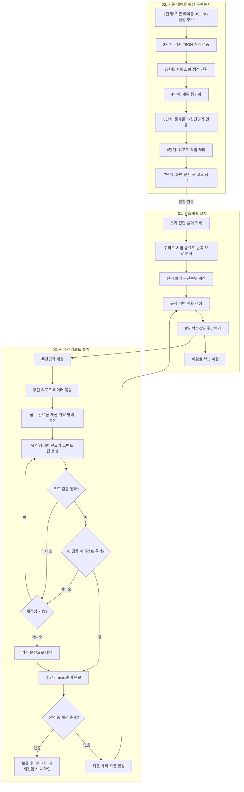
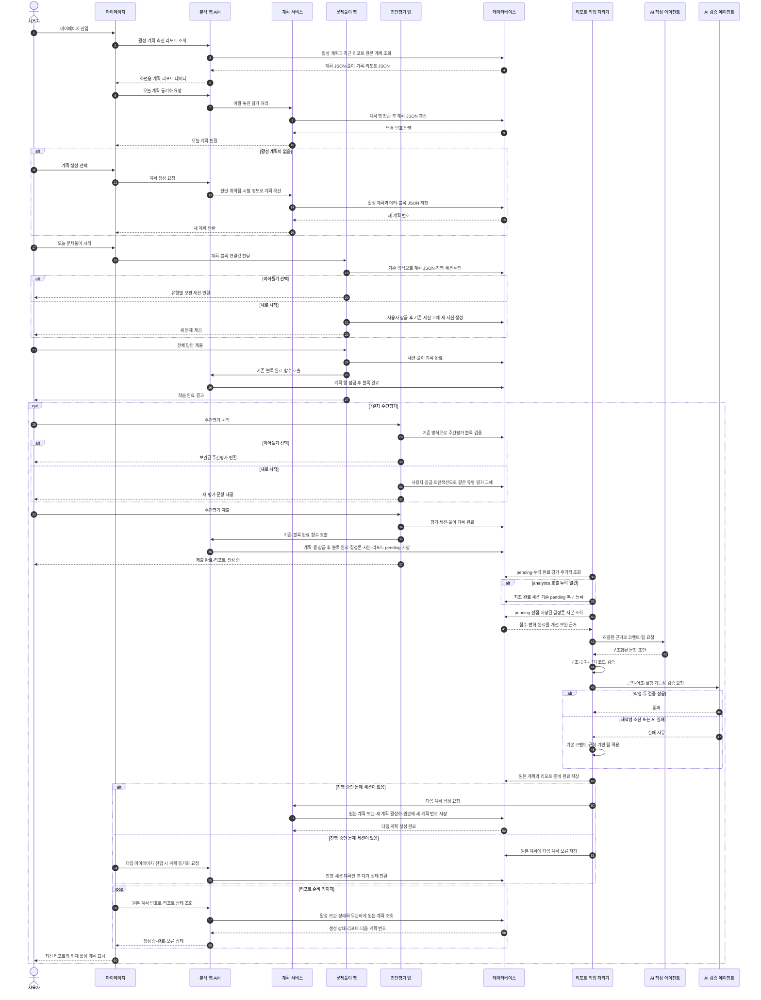
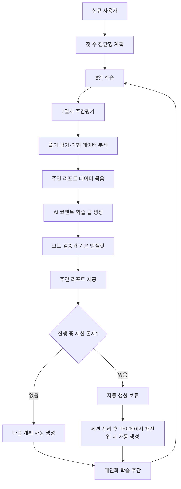

# 단기 합격형 개인화 학습 운영 설계

- 상태: DRAFT — 승인 전
- 작성일: 2026-07-19
- 담당 범위: 분석 앱(`analytics`), 마이페이지, 취약점 상세분석 화면
- 이전 문서: [`legacy/`](legacy/)에 보관하며 더 이상 기준 문서로 사용하지 않는다.

이 문서는 학습계획, 취약점 분석, AI 주간 리포트의 제품 규칙과 구현 방향을 한곳에 모은 단일 기준 문서다. 구현 중 해석이 갈리면 이 문서의 **확정 규칙**, **담당 범위**, **미결정 항목** 순서로 판단한다.

기술 식별자는 의미를 먼저 쓰고 실제 이름을 괄호에 표시한다. 예: 하루 학습 가능 시간(`daily_available_minutes`), 계획 생성 함수(`create_study_plan`).

### 전체 통합 구조



### 서비스 실행 순서



---

## 01. 학습계획 설계

### 1.1 서비스 정의

이 서비스는 단순히 문제를 추천하는 기능이 아니다.

> 사용자의 풀이 기록, 초기 진단, 주간평가, 학습 이행 데이터를 바탕으로 단기간 내 합격 가능성을 높이는 개인화 학습 운영 서비스다.

학습 우선순위는 단순히 가장 낮은 정답률로 정하지 않는다. 다음 요소를 함께 본다.

- 시험에서 중요한 영역인가
- 최근에도 오답이 반복되는가
- 제한 시간 안에 풀 수 있는가
- 시험 전까지 보완할 수 있는가
- 사용자가 실제로 수행할 수 있는 학습량인가

서비스가 답해야 하는 질문은 다음과 같다.

> 이번 주에 무엇을 공부해야 합격 가능성을 가장 많이 높일 수 있는가?

---

### 1.2 설계 원칙

#### 1.2.1 코드와 AI의 책임을 분리한다

| 구분 | 담당 |
|---|---|
| 취약도 계산 | 결정적 코드 |
| 시험 중요도·반복 오답 계산 | 결정적 코드 |
| 학습 우선순위 계산 | 결정적 코드 |
| 계획 기간·블록·문항 수 계산 | 결정적 코드 |
| 진행률·점수·변화량 계산 | 결정적 코드 |
| 다음 계획 생성 여부 | 결정적 코드 |
| AI 코멘트·학습 팁 초안 | AI 작성 에이전트(report writer) |
| 구조·숫자·근거 범위 검증 | 결정적 코드 검증 장치(guard) |
| 의미·표현·실행 가능성 검증 | AI 검증 에이전트(report validator) |

같은 입력, 설정 버전, 기준일로 계획을 만들면 ID와 생성 시각을 제외한 결과가 같아야 한다.

#### 1.2.2 데이터의 진실 원천을 하나로 둔다

- 계획 메타데이터는 기존 계획 요약 텍스트(`study_plans`)에 저장한 버전 JSON을 기준으로 한다. 기존 일반 문자열은 레거시 요약으로 읽기 호환한다.
- 날짜별 블록은 기존 계획 항목 JSON(`study_plan_items`)을 기준으로 하며 최상위 배열 구조를 유지한다.
- 주간 리포트와 단일 작업 처리기 상태는 같은 계획 행의 주간 리포트 JSON(`weekly_report_data`)을 기준으로 한다.
- 화면용 camelCase 응답 데이터(DTO)는 두 JSON과 풀이 기록을 검증해 조립한 결과다.
- 블록의 진행 중·완료 상태는 연결된 문제 세션과 풀이 기록을 우선해 판단하고, 놓침·취소 같은 계획 상태는 계획 항목 JSON에서 판단한다.
- 클라이언트의 기존 완료 여부(`isCompleted`), 필터, 문항 수, 블록 유형은 신뢰하지 않는다.
- 풀이 기록의 계획 번호(`solve_records.studyplan_id`)와 블록 번호(`solve_records.study_plan_block_id`)는 마이그레이션과 재계획 과정에서 수정하지 않는다.

#### 1.2.3 조회 요청은 상태를 바꾸지 않는다

- 마이페이지 조회 요청(GET)은 조회만 수행한다.
- 날짜 변경에 따른 이월과 놓친 주간평가 처리는 계획 동기화 명령(`sync`)에서 수행한다.
- 모든 상태 변경은 트랜잭션과 계획 행 잠금으로 보호한다. 계획 동기화와 리포트 등록처럼 중복 실행 가능성이 큰 명령은 현재 저장 상태를 다시 검사해 자연 멱등하게 만든다.

#### 1.2.4 설정을 버전으로 관리한다

가중치, 임계값, 기본 학습 시간, 블록 수, 문항 수, 과부하 기준, 평가 출제 기준(blueprint)을 코드 여러 곳에 하드코딩하지 않는다. 계획과 리포트에는 사용한 설정 버전과 결과 재현에 필요한 생성 입력 사본(snapshot)을 저장한다. 설정 전체는 버전 설정 파일을 기준으로 하며 JSON에 중복 저장하지 않는다.

---

### 1.3 담당 범위

#### 1.3.1 분석 앱(analytics)에서 구현할 범위

- 취약점·추세 분석과 풀이 시간 요약
- 시험 합격 기여도 기반 우선순위 계산
- 결정론적 학습계획 생성
- 계획 조회 데이터(DTO)와 진행률 계산
- 계획 동기화(`sync`) 서비스
- 주간 리포트 데이터 묶음(Weekly Report Pack) 수집·분석
- AI 코멘트·학습 팁 생성, 검증 장치(guard), 기본 템플릿(fallback)
- 주간 리포트 JSON(`weekly_report_data`) 상태 저장과 단일 작업 처리기(worker)
- 마이페이지와 취약점 상세분석 화면
- 기존 question·diagnosis 완료 호출과 풀이 기록 연결을 유지하면서 analytics 내부 검증·복구 강화

#### 1.3.2 직접 수정하지 않는 범위

다음은 담당 팀에 변경을 요청한다.

- 문제풀이 앱(question)의 새 세션 교체 트랜잭션에 사용자 행 잠금 추가
- 진단평가 앱(diagnosis)의 진행 중 목록 GET 삭제 제거
- 진단평가 앱의 같은 유형 기존 세션 삭제와 새 세션·문항 생성을 사용자 잠금이 포함된 트랜잭션으로 처리
- 운영 데이터베이스(DB) 정의문(DDL) 적용

문제풀이 앱(question)의 현재 시작·제출 구조는 유지한다. 다만 시작 트랜잭션만으로 동시 요청을 직렬화할 수 없으므로 동일 사용자의 두 시작 요청이 세션을 각각 만들지 않도록 사용자 행 잠금 한 건을 요청한다.

리포트 화면은 우선 마이페이지 카드로 제공한다. 별도 페이지가 필요하면 분석 앱(analytics) 소유 범위인지 확인한 뒤 추가한다.

---

### 1.4 전체 사용자 흐름



시험이 7일 안에 있으면 시험일을 제외한 기간만 압축 계획으로 만들며 주간평가는 넣지 않는다.

---

### 1.5 신규 사용자와 분석 상태

#### 1.5.1 첫 주 진단형 계획

풀이 표본이 없는 신규 사용자는 일반 개인화 계획이 아니라 빠른 진단형 계획으로 시작한다.

- 첫 주 학습 프레임은 고정한다.
- 실제 문항은 동등한 문항 풀에서 선택한다.
- 시대·주제·유형을 의도적으로 넓게 확인한다.
- 첫 주 안에서는 오답에 따라 계획을 바꾸지 않는다. 초반 오답 영역 보완은 첫 진단평가와 리포트 이후의 개인화 계획에서 반영한다.
- 첫 주간평가 이후부터 강한 개인화를 적용한다.

| 일차 | 목적 | 구성 |
|---|---|---|
| 1일차 | 현재 수준 파악 | 핵심 시대·기본 유형 |
| 2일차 | 시대별 이해 확인 | 빈출 시대 중심 |
| 3일차 | 주제별 이해 확인 | 정치·경제·사회·문화 |
| 4일차 | 유형별 처리 확인 | 사료·순서·개념 판별 |
| 5일차 | 빈출 영역 보강 | 시험 비중 높은 시대·주제 |
| 6일차 | 혼합 적용 확인 | 시대·주제·유형 혼합 |
| 7일차 | 진단평가 | 고정 비율 출제 기준(blueprint), 승인 전에는 기존 출제 로직 |

시험이 임박해 7일 계획을 만들 수 없으면 남은 기간만 진단·빈출 중심으로 압축하고 주간평가는 생략한다.

#### 1.5.2 사용자·영역 상태

계획 모드와 영역 판정은 서로 다른 축이다.

| 구분 | 내부 값 | 사용자 표현 | 계획 전략 |
|---|---|---|---|
| 사용자 계획 모드 | 초기 진단(`diagnostic`) | 학습 패턴 확인 중 | 균형 진단 |
| 영역 기본 판정 | 후보 신호(`candidate_signal`) | 추가 확인이 필요한 영역 | 짧은 보완·재확인 |
| 영역 기본 판정 | 우선 보완(`confirmed_priority`) | 이번 주 우선 보완 영역 | 집중 학습 |
| 영역 기본 판정 | 안정(`stable`) | 안정적으로 수행 중인 영역 | 평가 중심 유지 |

통계 판정과 화면 판정은 다음처럼 연결한다.

| 통계 판정 | 추가 조건 | 화면 기본 판정 |
|---|---|---|
| 취약(`WEAK`) | 없음 | 우선 보완(`confirmed_priority`) |
| 중립(`NEUTRAL`) | 없음 | 후보 신호(`candidate_signal`) |
| 표본 부족(`INSUFFICIENT`) | 실제 오답 1개 이상 | 후보 신호(`candidate_signal`) |
| 표본 부족(`INSUFFICIENT`) | 실제 오답 0개 | 판정 보류·목록 제외 |
| 안정(`STABLE`) | 없음 | 안정(`stable`) |

개선 중(`improving`)은 독립 상태가 아니라 최근 추세 배지다. 후보 신호·우선 보완·안정 같은 기본 판정에 함께 붙을 수 있다. 같은 방식으로 악화(`worsening`), 유지(`flat`), 추세 불명(`unknown`)도 별도 추세 값으로 관리한다.

표본이 부족한 사용자에게는 “취약하다”라고 단정하지 않는다.

---

### 1.6 취약점과 단기 합격 우선순위

#### 1.6.1 분석 단위

문항은 시대 10개, 주제 10개, 유형 6개의 세 축으로 분류한다. 최대 600개 조합을 처음부터 모두 평가하지 않고 데이터 양에 따라 계층적으로 내려간다.

1. 시대
2. 주제
3. 유형
4. 시대 + 주제
5. 시대 + 주제 + 유형

분석 그룹 번호(`group_key_id`)로 분석 결과와 계획 대상을 연결하며 표시 이름을 식별자로 사용하지 않는다.

#### 1.6.2 성취도 보정

표본이 적은 정답률을 과신하지 않도록 윌슨 하한(Wilson lower bound)을 사용한다. 오래된 기록보다 최근 기록을 더 크게 반영하도록 지수 감쇠를 적용한다.

```text
시간 가중치(time_weight)
= exp(-감쇠율(decay_rate) × 경과 일수(elapsed_days))

감쇠율(decay_rate)
= ln(2) / 반감기 일수(half_life_days)
```

따라서 이 식은 1.6.5의 `0.5 ^ (경과 일수 / 반감기 일수)`와 같은 계산이다. 화면에는 사용자가 이해하기 쉬운 실제 정답률과 근거 문항 수를 표시하고, 보정 점수는 판정과 정렬에 사용한다.

#### 1.6.3 우선순위

```text
단기 합격 우선순위(ShortTermPriority)
= clamp(
    취약 가중치(strategy_weakness_weight) × 취약 점수(weakness_score)
    + 출제 가중치(strategy_exam_weight) × 시험 중요도(exam_weight)
    + 반복 가중치(repeated_error_weight) × 반복 오답 신호(repeated_error)
    + 추세 보정값(trend_bonus),
    0,
    1
  )
```

보정 성취도(`PerformanceScore`)라는 별도 값은 사용하지 않는다. 기존 식의 `1 - PerformanceScore`는 취약 점수(`weakness_score`)와 같은 의도로 쓰였으므로 취약 점수 하나로 통일한다.

시험 중요도:

```text
시험 중요도(exam_weight)
= 해당 분석 그룹의 문제은행 문항 수(group_question_count)
  / 가장 많은 분석 그룹의 문항 수(max_group_question_count)
```

- 현재 구현은 시대·주제·유형 조합별 문제은행 문항 비중을 `0~1`로 정규화한 **임시 휴리스틱**이다.
- 최대 문항 수는 시대, 주제, 유형, 시대+주제, 시대+주제+유형처럼 같은 분석 구조 안에서만 계산한다. 서로 깊이가 다른 그룹을 같은 최대값으로 나누지 않는다.
- 현재 버전에서 사용자 표현인 “출제 예상”과 내부 시험 중요도(`exam_weight`)는 같은 값이다. 별도 출제 예상 점수(`prediction_score`)를 만들지 않는다.
- 현재 값은 실제 시험 출제 확률이나 ML 예측값이 아니다.
- 공식 출제 비율·배점 데이터 또는 예측 모델을 도입하면 출처 버전(`exam_weight_source_version`)을 바꾸고, 기존 휴리스틱과 조용히 혼합하지 않는다.

반복 오답 신호:

```text
대상 세션 = 최근 반복 관찰 개수(repeat_window_sessions) 안에서
           해당 분석 그룹의 답안이 하나 이상 있는 완료 세션

반복 오답 신호(repeated_error)
= 오답이 하나 이상 있었던 대상 세션 수(wrong_session_count)
  / 대상 세션 수(eligible_session_count)
```

- 대상 세션 수가 최소 반복 표본(`repeat_min_sessions`)보다 작으면 `0`으로 두고 취약 점수만 사용한다.
- 초기값은 최근 5개 세션(`repeat_window_sessions=5`), 최소 3개 세션(`repeat_min_sessions=3`)이며 버전 설정으로 관리한다.
- 원천은 해당 사용자의 정상 완료 일반 문제풀이·일반 진단·주간평가 세션에 연결된 제출 답안이다. 미제출 답안과 진행 중·삭제 세션은 제외한다.
- 분석 기준일 이전 세션을 기록일 내림차순, 세션 번호 내림차순으로 정렬하고 분석 그룹별 최근 관찰 개수만 사용한다.
- 같은 세션에서 여러 문항을 틀려도 반복 횟수는 한 번으로 센다. 문항 오답량은 취약 점수, 세션을 가로지른 지속성은 반복 오답 신호가 담당한다.

시험 임박도:

```text
시험까지 남은 일수(days_remaining) = 시험일(exam_date) - 계획 기준일(anchor_date)

7일 이하  → 단기 전략(short)
8~21일    → 중기 전략(medium)
22일 이상 → 장기 전략(long)
```

시험 임박도(`urgency`)는 모든 분석 그룹에 같은 상수를 더하지 않는다. 같은 값을 가산하면 그룹 정렬이 달라지지 않기 때문이다. 대신 남은 일수에 따라 취약·출제 예상 가중치를 선택한다. 시험일이 없으면 버전 설정의 기본 남은 일수 14일로 중기 전략을 선택하고 기본값 사용 사실을 기록한다.

초기 전략 가중치는 기존 계획 로직의 기간별 비율을 살리되 사용하지 않는 시간 부담 `0.15`를 반복 오답 항으로 대체한다.

| 전략 | 취약 가중치 | 출제 가중치 | 반복 가중치 |
|---|---:|---:|---:|
| 단기(`short`) | 0.40 | 0.45 | 0.15 |
| 중기(`medium`) | 0.45 | 0.40 | 0.15 |
| 장기(`long`) | 0.55 | 0.30 | 0.15 |

세 가중치 합은 1이며 추세 보정 전 점수에 적용한다.

추세 보정값은 악화 `+0.08`, 개선 `-0.04`, 그 외 `0`의 초기값을 사용한다.

풀이 시간은 우선순위에 넣지 않는다. 리포트에서 참고로만 언급한다(1.6.4).

가중치와 동률 정렬 규칙은 버전 설정(versioned config)에 둔다. 이 점수는 “가장 못하는 영역”이 아니라 “남은 기간에 보완하면 합격에 가장 크게 기여할 영역”을 찾기 위한 값이다.

현재 기존 계획 모듈(`studyplan.py`)은 취약 점수·문제은행 비중·시간 부담·추세 보정을 결합하며 반복 오답 신호를 독립 항으로 계산하지 않는다. 신규 식은 시간 부담 항을 사용하지 않는다. 따라서 위 식은 신규 계획 계산기(`planner.py`)의 목표 계약이고, 기존 결과는 기존 엔진 버전(`legacy`)으로 구분한다.

#### 1.6.4 풀이 시간 요약

풀이 시간은 취약 판정과 우선순위 계산에 사용하지 않는다. 문항별 기준 시간 메타데이터도 도입하지 않는다.

대신 주간 리포트에서 짧게 언급할 참고 지표만 계산한다.

```text
유형별 시간 비율(time_ratio)
= 사용자의 유형별 중앙 풀이 초(user_median_seconds)
  / 전체 사용자의 유형별 평균 풀이 초(type_average_seconds)
```

비율이 기준값(버전 설정, 예: 1.3) 이상인 유형이 있으면 리포트에서 “이 유형은 평균보다 시간이 걸리는 편”이라고 한 줄로만 안내한다. 표본이 적으면 언급하지 않는다.

#### 1.6.5 취약 점수 계산

취약 점수는 합성 우선순위가 아니라 **표본 수와 최근성을 보정한 오답률**이다. 풀이 시간과 시험 중요도는 취약 점수에 섞지 않고 다음 단계의 학습 우선순위에서만 결합한다.

1. 완료된 풀이 기록만 가져온다.
2. 분석 기준일과 풀이일의 차이로 최근성 가중치를 계산한다.
3. 가중 전체 표본과 가중 오답 표본을 합산한다.
4. 가중 표본에 윌슨 하한을 적용한다.
5. 유효 표본 수와 보정 오답률로 내부 상태를 판정한다.

최근성 가중치:

```text
최근성 가중치(decay_weight)
= 0.5 ^ (경과 일수(days_ago) / 반감기 일수(half_life_days))

가중 전체 표본(effective_total)
= Σ 최근성 가중치(decay_weight)

가중 오답 표본(effective_wrong)
= Σ 최근성 가중치(decay_weight) × 오답 여부(is_wrong)
```

초기 설정 후보는 반감기 14일, 최대 조회 범위 90일이다. 오늘 기록의 가중치는 1, 14일 전은 0.5, 28일 전은 0.25다. 값은 실데이터 분포를 확인한 뒤 버전 설정으로 확정한다.

윌슨 하한:

```text
가중 오답 비율(p_hat) = 가중 오답 표본(effective_wrong) / 가중 전체 표본(effective_total)
유효 표본 수(n) = 가중 전체 표본(effective_total)
신뢰 수준 계수(z) = 1.28

취약 점수(weakness_score)
= (
    p_hat
    + z² / (2 × n)
    - z × sqrt((p_hat × (1 - p_hat) / n) + (z² / (4 × n²)))
  ) / (1 + z² / n)
```

신뢰 수준 계수 1.28은 80% 신뢰 수준의 초기 후보다. 95% 계수는 소표본을 지나치게 낮춰 취약 신호 발견이 늦어질 수 있으므로 캘리브레이션 전제값으로 두지 않는다.

가중 전체 표본을 윌슨 식의 표본 수로 넣는 방식은 최근성 감쇠를 적용하기 위한 운영상 근사다. 엄밀한 가중 표본 신뢰구간으로 단정하지 않으며, 실제 분포·판정률·기간별 안정성을 확인해 반감기와 임계값을 함께 보정한다.

내부 통계 상태의 초기 후보:

| 의미 | 판정 |
|---|---|
| 표본 부족(`INSUFFICIENT`) | 가중 전체 표본이 최소 표본(`min_sample`) 3.0 미만 |
| 취약(`WEAK`) | 취약 점수가 취약 임계값(`weak_threshold`) 0.50 이상 |
| 안정(`STABLE`) | 취약 점수가 안정 임계값(`stable_threshold`) 0.20 이하 |
| 중립(`NEUTRAL`) | 위 조건에 해당하지 않음 |

예시:

| 풀이 기록 | 실제 오답률 | 보정 오답률 | 내부 판정 |
|---|---:|---:|---|
| 1문제 중 1오답 | 100% | 약 37.9% | 표본 부족 |
| 3문제 중 2오답 | 66.7% | 약 32.1% | 중립 |
| 20문제 중 14오답 | 70% | 약 55.8% | 취약 |
| 20문제 중 4오답 | 20% | 약 11.0% | 안정 |

따라서 한 문제를 풀어 틀린 사용자가 충분한 표본에서 반복해서 틀린 사용자보다 높은 취약 순위에 놓이지 않는다.

#### 1.6.6 추세 계산

현재 상태를 계산하는 지수 감쇠와 변화 방향을 계산하는 추세는 분리한다.

```text
현재 구간 = 최근 14일
비교 구간 = 그 이전 14일

추세 차이(trend_delta)
= 현재 구간 보정 오답률(current_adjusted_rate)
  - 비교 구간 보정 오답률(previous_adjusted_rate)
```

| 의미 | 판정 |
|---|---|
| 추세 불명(`UNKNOWN`) | 한 구간이라도 최소 표본 미달 |
| 악화(`WORSENING`) | 추세 차이가 +0.10 이상 |
| 개선(`IMPROVING`) | 추세 차이가 -0.10 이하 |
| 유지(`FLAT`) | 그 외 |

추세 구간 안에서는 감쇠를 다시 적용하지 않는다. 두 기간을 같은 조건으로 비교하기 위해 구간 내 기록은 같은 가중치로 계산하되 오답률 보정에는 윌슨 하한을 적용한다.

내부 통계 상태는 사용자 표현으로 다음처럼 투영한다.

- 표본 부족이면서 오답 신호가 있으면 확인 필요(`candidate_signal`)
- 표본 부족이면서 오답이 없으면 판정을 보류하고 목록에서 제외한다.
- 충분한 표본에서 취약이면 우선 보완(`confirmed_priority`)
- 충분한 표본에서 중립이면 후보 신호(`candidate_signal`)로 두되 마이페이지 취약 목록에는 노출하지 않는다.
- 취약 여부와 별개로 추세가 개선이면 독립된 개선 중 배지(`improving`)를 함께 표시한다.
- 안정 판정이면 안정적(`stable`)

#### 1.6.7 취약점 산출 데이터와 화면 원칙

취약점 분석 행에는 다음 정보를 함께 둔다.

| 의미 | 실제 이름 |
|---|---|
| 분석 그룹 번호 | `groupKeyId` |
| 분석 그룹 구조 | `groupKey` |
| 실제 풀이 수·오답 수·오답률·평균 시간 | `raw` |
| 가중 전체 표본·가중 오답 표본 | `effective` |
| 취약 점수 | `weaknessScore` |
| 내부 통계 상태 | `status` |
| 추세 값·차이·비교 근거 | `trend` |
| 표본 부족 사유 | `insufficientReason` |

분석 그룹 번호(`groupKeyId`)는 `필드=정규화값`을 `|`로 연결한 문자열이다. 값 안의 구분 문자는 그룹 번호 생성 함수(`build_group_key_id`) 한 곳에서만 이스케이프한다. 표시 이름은 분류 표시 모듈(`taxonomy.py`)에서 만들며 화면과 서비스가 각자 문자열을 조립하지 않는다.

표시와 판정을 구분한다.

- 사용자에게는 실제 사실인 “10문제 중 9오답”을 보여 준다.
- 보정 오답률은 판정과 정렬에만 사용하고 백분율로 직접 노출하지 않는다.
- 마이페이지 취약 목록은 취약 판정만 보여 주고, 취약 점수 내림차순으로 정렬한다.
- 마이페이지에는 순위, 상태 배지, 실제 오답 개수, 숫자 없는 강도 막대를 표시한다.
- 오답률 상세 화면의 수치와 정렬은 실제 오답률을 유지하고, 보정 판정과 추세는 배지로만 표시한다.
- 표본 부족 항목은 취약 목록에서 숨기되 “풀이 수가 적어 아직 판단하지 않아요”를 안내한다.
- 저장된 과거 분석 화면은 당시 사실을 보여 주는 용도이므로 실제 오답률을 유지한다.

---

### 1.7 학습계획 규칙

#### 1.7.1 계획 기간

- 기본 계획은 7일이다.
- 1~6일차는 학습, 7일차는 주간평가 전용일이다.
- 시험일까지 남은 일수가 1~7일이면 기준일부터 시험 전날까지 1~7일의 압축 학습계획을 만든다.
- 압축 계획에는 주간평가를 넣지 않는다.
- 시험일이 기준일과 같거나 이미 지났으면 학습 가능일이 없으므로 새 계획을 만들지 않고 사용자 설정 확인을 안내한다.
- 시험일이 없거나 8일 이상 남았으면 기본 7일 계획을 만든다.
- 사용자당 진행 중인 활성 계획(active plan)은 최대 1개다.

#### 1.7.2 계획 입력

- 사용자 시간대와 기준일
- 시험일과 하루 학습 가능 시간
- 취약점·상태·추세·근거 수
- 출제 예상으로 표시하는 시험 중요도
- 반복 오답 신호
- 이전 계획의 미완료 대상
- 생성 이유와 설정 버전

계획 진행 중 시험일이나 학습 시간을 바꿔도 현재 계획을 몰래 변경하지 않는다. 마이페이지에 “새 설정은 계획 재생성 시 반영됩니다”를 표시한다.

계획 생성 당시 입력과 동시성 메타데이터는 기존 계획 요약 텍스트(`study_plans`)에 다음 버전 JSON으로 저장한다.

```json
{
  "schemaVersion": "2",
  "summary": "하루 60분 기준 7일 학습계획",
  "revision": 1,
  "engineVersion": "planner-v2",
  "configVersion": "study-plan-v2",
  "timezone": "Asia/Seoul",
  "anchorDate": "2026-07-19",
  "requestedDailyAvailableMinutes": 60,
  "dailyAvailableMinutes": 60,
  "examDate": null,
  "planMode": "diagnostic",
  "planSource": "fallback_prediction_only",
  "generationReason": "initial",
  "sourceStudyPlanId": null,
  "lastSyncedDate": null
}
```

- 계획 버전(`plan_version`)은 사용자별 계획 생성 순번이며 변경 번호가 아니다.
- 변경 번호(`revision`)는 계획 일정·블록·계획 상태가 성공적으로 바뀔 때마다 1 증가한다. 블록 완료와 리포트 대기 등록을 함께 처리하면 한 번만 증가한다.
- 리포트 작업 처리기의 실행 중·재시도 같은 `weekly_report_data` 전용 상태 변경은 계획 변경 번호를 올리지 않고 작업 처리기 번호와 JSON 상태로 경합을 막는다.
- 변경 요청은 기대 변경 번호(`expectedRevision`)를 받고 불일치하면 `409 STALE_REVISION`을 반환한다.
- 생성 이유(`generationReason`)는 초기 생성, 사용자 재생성, 주간평가 미응시 후 사용자 재생성, 리포트 기반 다음 계획처럼 버전 설정에 정의한 값만 허용한다. 대체 계획은 원본 계획 번호(`sourceStudyPlanId`)를 함께 저장한다.
- 같은 원본 계획 번호와 생성 이유의 요청이 중복되면 이미 생성된 활성 계획을 반환하고 다시 보관·생성하지 않는다.
- 사용자 설정 학습시간(`requestedDailyAvailableMinutes`)은 원값을 저장하고 계획에 적용하는 학습시간(`dailyAvailableMinutes`)은 `min(사용자 설정 학습시간, 300분)`으로 계산한다.
- 300분 상한은 버전 설정(`max_daily_plan_minutes`)으로 관리한다. 사용자 설정이 5시간을 넘으면 마이페이지에 자동 계획에는 최대 5시간까지만 반영됐다고 알린다.
- 마지막 동기화 날짜(`lastSyncedDate`)는 계획 메타 JSON에 `Asia/Seoul` 달력 날짜로 저장한다.
- 시간대(`timezone`)는 버전 설정에서 선택한 유효 IANA 시간대를 계획마다 사본으로 저장한다. 초기 계획 시간대는 `Asia/Seoul`이며 전역 Django `TIME_ZONE=UTC`는 이번 범위에서 바꾸지 않는다.
- 풀이 기록의 학습일(`solve_sessions.recorded_date`)은 세션 생성 시각을 `Asia/Seoul`로 변환한 현지 날짜로 저장하고 제출 시 바꾸지 않는다. question·diagnosis의 모든 신규 세션에 같은 규칙을 적용한다.
- 서버의 현지 날짜나 UTC 날짜를 직접 사용하지 않는다. 시각형 필드는 기존처럼 UTC로 저장하고 학습일만 `Asia/Seoul` 달력 날짜로 계산한다.
- 기존 `recorded_date`는 정확한 원시 시각을 복원할 수 없으므로 일괄 보정하지 않는다. 전환 이후 신규 세션부터 적용하고 전환 시각을 운영 기록에 남긴다.
- 기존 일반 문자열인 계획 요약(`study_plans`)은 읽을 때 `schemaVersion=legacy`, `summary=원문`, `revision=1`인 메타데이터로 해석한다.
- 레거시 계획 GET은 원문을 바꾸지 않는다. 첫 번째 성공한 명시적 변경에서 현재 메타데이터를 버전 JSON으로 저장하고 변경 번호를 2로 올린다.

#### 1.7.3 일일 블록

- 자동 계획에 적용하는 하루 학습시간은 최대 300분이다.
- 하루 일반 문제풀이 블록 수는 `clamp(ceil(적용 학습시간 / 30분), 1, 10)`으로 계산한다. 따라서 60분은 2개, 90분은 3개, 300분은 10개다.
- 블록 하나는 “이 범위 문제 N개 풀기”다.
- 신규 학습·이월 학습 문제풀이 블록 하나의 예상 시간은 최대 30분이다.
- 주간평가는 진단평가 앱의 별도 제한시간과 출제 기준을 사용하므로 30분 제한의 예외다.
- 일반 문제풀이 블록의 예상 시간 합은 계획에 적용한 하루 학습시간을 넘지 않는다.
- 별도의 수동 완료 작업은 두지 않는다.
- 문제 수는 학습 가능 시간과 예상 풀이 시간을 사용해 최소·최대 설정값(min/max) 범위에서 계산한다.
- 같은 범위를 같은 날 중복 배치하지 않는다.
- 선택된 필터와 문항 수는 서버가 저장하며 클라이언트가 바꿀 수 없다.

블록 유형은 실행 경로만 나타낸다.

| 실행 구분(`block_type`) | 실행 경로 |
|---|---|
| 문제풀이(`practice`) | 문제풀이 앱(question) |
| 주간평가(`weekly_review`) | 진단평가 앱(diagnosis) |

배치 이유(`focus_kind`)는 다음 값으로 구분한다.

```text
취약점(weakness) / 출제 예상(prediction) / 이월(carryover)
/ 초기 진단(diagnostic)
```

계획 항목 JSON 저장 계약:

```json
[
  {
    "date": "2026-07-19",
    "blocks": [
      {
        "blockId": "4a830a67-27df-4ad8-931e-70b5ed78358f",
        "blockType": "practice",
        "focusKind": "weakness",
        "groupKeyId": "era=조선|topic=정치",
        "classification": "시대+주제",
        "label": "조선 정치",
        "era": "조선",
        "topic": "정치",
        "qType": "",
        "activity": "조선 정치 문제 8개 풀기",
        "questionCount": 8,
        "estimatedMinutes": 20,
        "priorityScore": 0.74,
        "reason": "우선 보완 영역",
        "carryoverCount": 0,
        "initialPlanDate": "2026-07-19",
        "status": "scheduled",
        "isCompleted": false,
        "completedAt": null
      }
    ]
  }
]
```

레거시 블록 읽기 변환:

| 기존 실행 구분(`blockType`) | 실행 구분(`blockType`) | 배치 이유(`focusKind`) |
|---|---|---|
| `newWeakness`, `weaknessFocus` | `practice` | `weakness` |
| `predictionFocus` | `practice` | `prediction` |
| `review` | `practice` | `review`(레거시 호환 전용) |
| `weekly_review` | `weekly_review` | `diagnostic` |

- 기존 블록 번호(`blockId`)는 형식과 값이 유효하면 그대로 사용한다.
- 기존 블록 번호가 없거나 중복·비UUID이면 GET에서 새 번호를 만들지 않고 데이터 무결성 오류와 계획 번호를 기록한다. 해당 계획의 변경 기능은 차단한다.
- 순수 계획 계산기는 블록 번호 없는 결정적 초안을 반환한다. 새 계획 최종 저장 서비스만 저장 직전에 신규 블록 번호를 UUID로 발급한다.
- 레거시 필드의 기본값 보강은 읽기 메모리에서만 수행하고 GET에서 저장하지 않는다.
- 명시적 변경 시 유효한 기존 블록 번호를 유지한 채 정규 필드로 저장할 수 있다.
- 상태(`status`)는 연결된 진행 세션이 있으면 진행 중, 완료 세션과 제출 기록이 있으면 완료, 과거 미응시 주간평가이면 놓침, 이월 한도·재계획으로 제외됐으면 취소, 그 외에는 예정으로 조립한다.
- 기존 완료 여부(`isCompleted`)와 완료 시각(`completedAt`)은 화면 호환 출력으로 유지한다. 연결 풀이 기록이 있으면 풀이 기록을 우선하고, 레거시 계획에 연결 기록이 전혀 없으면 기존 서버 저장 완료값을 호환 근거로 사용할 수 있다. 신규 `planner-v2` 블록은 반드시 연결된 정상 제출로만 완료한다.
- 기존 완료율 열(`completion_rate`)은 호환 캐시로만 유지하고 화면 진행률은 풀이 기록과 위 상태 규칙으로 다시 계산한다.
- 기존 `review` 블록은 데이터 유실을 막기 위해 일반 문제풀이로 읽기 호환하지만 새 계획에서는 생성하지 않는다.

신규 계획은 필수·중요 같은 별도 블록 등급을 만들지 않는다. 모든 일반 문제풀이(`practice`) 블록은 같은 학습 단위이며, 이월·재생성 순서가 필요할 때는 이미 저장된 우선순위 점수(`priorityScore`)만 사용한다. 레거시 추가 학습(`extra`) 블록은 신규 완료율과 이월 대상에서 제외하고 취소 처리한 뒤 다음 계획 후보로 넘긴다.

#### 1.7.4 독립 복습 블록 제외

- 새 계획은 독립 복습 블록을 생성하지 않는다.
- 계획 용량은 신규 학습과 이월 학습에 사용하고 학습 성과는 주간평가에서 확인한다.
- 기존 `review` 블록은 레거시 읽기 호환 대상으로만 유지한다.

#### 1.7.5 주간평가

- 7일 계획의 마지막 날에 정확히 1개 둔다.
- 평가는 승인된 버전별 출제 기준(versioned blueprint)으로 출제한다.
- 출제 기준이 승인·반영되기 전에는 기존 진단평가 출제 로직을 사용한다. 이 기간에는 출제 기준 미충족 오류(`422 ASSESSMENT_BLUEPRINT_UNAVAILABLE`)를 발생시키지 않는다.
- 평가 전에는 일반 학습 블록을 섞지 않는다.
- 날짜가 지난 미응시 평가는 이월하지 않고 놓침 상태(`missed`)로 처리한다.
- 미응시 시 리포트와 자동 다음 계획은 만들지 않는다. 마이페이지에 안내와 수동 계획 생성 버튼을 표시하고, 이 버튼은 리포트 기반 다음 계획 주소가 아니라 생성 이유가 주간평가 미응시인 일반 계획 생성 주소를 호출한다.

#### 1.7.6 완료와 진행률

- 일반 문제풀이(`practice`)는 연결된 문제 세션의 정상 제출로만 완료한다.
- 주간평가(`weekly_review`)는 연결된 진단 세션의 정상 제출로만 완료한다.
- 별도의 수동 완료 버튼은 두지 않는다.
- 진행률은 연결된 풀이 기록(records)과 블록 상태(block status)를 기준으로 계산한다.
- 로그인 사용자 본인의 완료 세션(`session.status=completed`)에서 답안이 제출된 기록만 집계한다.
- 계획 번호와 블록 번호(`studyplan_id`, `study_plan_block_id`)가 모두 일치하는 기록만 해당 블록에 반영한다. 날짜나 분류가 같다는 이유로 추정 연결하지 않는다.
- 화면 진행률(`progressRate`)은 완료한 일반 문제풀이 블록 수를 계획에 생성된 전체 일반 문제풀이 블록 수로 나눈 값이다. 진행 중 세션의 응답 개수는 별도 부분 진행률로 표시하지 않는다.
- 계획 완료율(`completionRate`)은 완료한 일반 문제풀이 블록 수를 계획에 생성된 전체 일반 문제풀이 블록 수로 나눈 값이다. 취소된 일반 문제풀이 블록도 원래 계획한 학습이므로 분모에 남고 완료로 세지 않는다.
- 주간평가와 레거시 추가 학습 블록은 화면 진행률과 계획 완료율에서 제외한다. 주간평가 결과는 별도 평가 점수로 표시한다.

취소된 일반 문제풀이 블록을 완료율 분모에 유지하는 것은 의도된 정책이다. 일반 블록 취소는 이월 한도까지 학습하지 못한 해당 계획의 최종 이행 결과이므로, 취소된 블록을 분모에서 제외해 미완료 블록이 많을수록 완료율이 오르는 왜곡을 만들지 않는다. 이 때문에 해당 계획은 최종 완료율이 100%에 이르지 못할 수 있다. 다음 계획의 완료율은 새 계획 블록만으로 다시 계산하므로 취소 이력이 영구 누적 불이익이 되지 않는다. 레거시 추가 학습 블록만 원래 필수 계획에 포함되지 않은 보너스 학습이므로 분자와 분모에서 모두 제외한다.

기존 버전은 삭제된 블록이 계획 항목 JSON에서 사라져 완료율 분모도 줄었지만, 이번 버전은 삭제 기능을 제거하고 계획 이력을 보존하므로 의도적으로 다른 기준을 사용한다.
- 중복 제출은 효과가 한 번만 발생해야 한다.

#### 1.7.7 이월과 과부하

마이페이지 진입 후 프런트가 계획 동기화 요청(`POST sync`)을 호출한다. 이월은 단순 순연이 아니라 **오늘 용량 안의 재배치**다.

재배치 순서:

1. 과거 미완료 일반 문제풀이 블록을 우선순위 점수(`priorityScore`) 내림차순으로 정렬한다. 동률이면 최초 계획일, 블록 번호 오름차순으로 고정한다.
2. 오늘의 남은 용량(일일 용량 − 오늘 기존 일반 문제풀이 블록 예상 시간)을 계산한다.
3. 정렬된 블록을 블록 번호(`blockId`)와 문제 수·예상 시간을 유지한 채 남은 용량에 차례로 옮기고 이월 횟수(`carryoverCount`)를 1 올린다. 용량에 맞춘 문항 축소는 하지 않는다.
4. 레거시 추가 학습 블록은 옮기지 않고 취소(`cancelled`) 처리한 뒤 다음 계획 후보로 기록한다.
5. 이월 횟수가 한도(`carryover_limit`, 초기 2회)에 도달한 블록은 더 옮기지 않고 취소 처리한 뒤 다음 계획의 재평가 대상으로 넘긴다.
6. 오늘 용량이 차서 옮기지 못한 일반 문제풀이 블록은 삭제하지 않고 과거 날짜에 그대로 남긴다. 이렇게 남은 블록들의 예상 시간 합이 “밀린 학습량”이며, 재생성 권장 배너의 3일치 판정에 사용한다.
7. 현재 보관 중인 진행 세션이 연결된 블록은 용량과 무관하게 오늘로 옮겨 이어풀기 대상으로 제공한다. 다만 사용자가 같은 풀이 유형의 새 세션 시작을 선택하면 기존 세션과 임시 답안은 교체 정책에 따라 삭제될 수 있다.
8. 완료·취소·놓침 상태는 옮기지 않는다.
9. 주간평가는 옮기지 않고 날짜가 지나면 놓침 상태(`missed`)로 처리한다.
10. 주간평가 전날에는 우선순위 점수가 가장 높은 일반 문제풀이 블록 1개까지만 재배치하고 나머지는 다음 계획 후보로 넘긴다. 평가일에는 신규 학습 블록을 배치하지 않는다.
11. 같은 날짜의 계획 동기화(`sync`)를 여러 번 호출해도 결과가 같아야 한다.
12. 계획 종료일 이후에는 자동 이월하지 않는다.

재생성 권장 배너 규칙은 하나만 둔다.

> 밀린 일반 문제풀이의 예상 시간이 3일치(하루 학습 가능 시간 × `regeneration_backlog_days`, 초기 3) 이상 쌓이면 재생성을 권장한다.

- 하루이틀 밀림은 배너 없이 재배치로 조용히 흡수한다.
- 같은 블록의 반복 밀림은 이월 한도(`carryover_limit` 2)가 자동 취소·다음 계획 이관으로 처리하므로 별도 배너 조건을 두지 않는다.
- 지속적인 미이행도 결국 잔량이 3일치에 도달하므로 별도 이행률 조건을 두지 않는다.
- 사용자 문구: "밀린 학습이 3일치를 넘었어요. 남은 기간에 맞춰 계획을 다시 만드는 걸 추천해요."
- 기준값은 버전 설정 초기값이며 운영하며 조정한다.

기존 v1 로직의 과부하 배수 2(`regeneration_overload_multiplier`)는 전부 순연하던 구 이월 정책의 값이므로 전환 전까지 구 엔진에서만 유지하고 신규 설정에 승계하지 않는다.

재생성은 밀린 블록 복원이 아니라 남은 기간 기준 재최적화다. 완료 블록은 제외하고 남은 후보의 우선순위 점수를 다시 계산해 새 계획을 만든다. 최근 이행률이 낮으면 하루 배치량 자체를 줄인다(버전 설정 비율). 계획을 자동으로 재생성하지 않고 항상 사용자 버튼으로 실행한다.

#### 1.7.8 사용자 블록 조작 제외

블록 삭제·교체·날짜 이동·추가 학습 기능은 이번 버전에서 제공하지 않는다. 마이페이지 버튼과 관련 API도 만들지 않으며 추후 별도 설계와 승인 후 추가한다.

#### 1.7.9 계획 계산 세부 순서

대상 선택:

1. 분석 그룹 번호(`groupKeyId`)로 취약점과 시험 중요도 데이터를 합친다.
2. 표본 부족이 아니고 취약 점수가 안정 임계값보다 큰 항목을 기본 후보로 사용한다. 이 단계에 후보가 하나라도 있으면 오답 폴백 단계로 내려가지 않는다.
3. 기본 후보가 0개일 때만 실제 오답이 하나 이상인 표본 부족 항목을 낮은 확신도의 오답 폴백 후보로 사용한다.
4. 기본 후보와 오답 폴백 후보가 모두 0개일 때만 시험 중요도가 0보다 큰 항목을 출제 예상 폴백 후보로 사용한다.
5. 후보가 없거나 문제 후보군이 부족하면 생성을 실패시키고 기존 활성 계획을 유지한다.
6. 선택한 후보 단계는 계획 출처(`planSource`)에 정상(`normal`), 오답 폴백(`fallback_any_wrong`), 출제 예상 폴백(`fallback_prediction_only`)으로 기록한다.
7. 출제 예상 폴백 계획은 “학습 기록이 부족해 출제 예상 중심으로 구성했어요”라고 화면에 알린다.

계층 중복 제거:

- 같은 분류 경로에서 충분한 표본을 가진 더 세부 그룹이 후보이면 그 그룹을 우선하고 같은 범위를 포함하는 상위 그룹은 후보에서 제외한다.
- 세부 그룹이 표본 부족이면 신뢰 가능한 가장 가까운 상위 그룹을 유지한다.
- 서로 겹치지 않는 하위 그룹은 각각 후보가 될 수 있다.
- 후보 제거 후 문제 선택 조건이 완전히 같은 항목이 남으면 최종 우선순위가 높은 하나만 유지하고 제거 사유를 계산 결과에 기록한다.

계획 모드와 계획 출처의 경계:

- 계획 기준일 전에 집계 가능한 완료 답안 기록이 0건이면 초기 진단 모드(`planMode=diagnostic`)다.
- 기록이 1건이라도 있으면 개인화 모드(`planMode=personalized`)이며, 표본이 적으면 영역 판정만 후보 신호가 된다.
- 출제 예상 폴백(`planSource=fallback_prediction_only`)은 사용자 상태가 아니라 후보 선택 경로다. 초기 진단 사용자뿐 아니라, 기존 기록이 모두 정답이어서 기본·오답 후보가 없는 사용자에게도 발생할 수 있다.
- 초기 진단 모드에서 출제 예상 폴백을 쓰더라도 문항 수가 많은 조합만 몰아주지 않는다. 1.5.1의 균형 진단 출제 기준을 먼저 적용하고 시험 중요도는 동률 정렬과 세부 배분에 사용한다.

후보 단계를 확정한 뒤 각 후보의 취약 점수·시험 중요도·반복 오답·추세를 1.6.3 공식에 넣어 최종 우선순위를 계산한다. 따라서 후보 포함 여부는 통계 신뢰도와 폴백 규칙이 결정하고, 포함된 후보 사이의 순서는 단기 합격 우선순위가 결정한다.

정렬:

```text
1순위: 최종 우선순위 내림차순
2순위: 취약 점수 내림차순
3순위: 시험 중요도 내림차순
4순위: 분석 그룹 번호 오름차순
```

남은 시험 기간에 따른 전략:

| 남은 기간 | 우선 전략 |
|---|---|
| 7일 이하 | 출제 가능성이 높은 취약점과 반복 오답을 압축 배치 |
| 8~21일 | 취약점 보완과 실전 문제풀이를 균형 있게 배치 |
| 22일 이상 | 취약도 비중을 높이고 여러 취약 범위를 순환 배치해 기초를 안정화 |

계획 한 건의 길이는 항상 최대 7일이며, 위 기간 구분은 해당 7일 계획 안에서 가중치와 블록 구성을 조절하는 전략이다.

일일 배치:

- 하루 학습 용량은 계획 생성 당시 적용 학습시간(`dailyAvailableMinutes`)의 사본이며 최대 300분이다.
- 사용자 설정이 없으면 버전 설정의 기본 시간을 사용하고 화면에 기본값 사용 사실을 알린다.
- 후보를 결정론적으로 정렬한 뒤 순환 배치(round-robin)한다.
- 같은 분석 그룹은 같은 날 한 번만 배치한다.
- 하루 블록 수는 `clamp(ceil(적용 학습시간 / 30분), 1, 10)`으로 고정한다. 블록별 예상 시간은 적용 학습시간을 블록 수로 나누고 분 단위 나머지는 앞 블록부터 1분씩 배정한다.
- 각 일반 문제풀이 블록은 30분을 넘지 않고 일반 문제풀이 블록 예상 시간 합은 일일 용량을 넘지 않는다.
- 분 단위 나눗셈의 나머지는 앞 블록부터 1분씩 배정한다.
- 문제 후보군 검증에 실패하면 필터를 몰래 완화하거나 무관한 문제를 섞지 않는다.

문제 수:

```text
문제당 예상 초(unit_seconds)
= 제한된 평균 풀이 초(clamped_average_solve_seconds)
  + 해설·오답 확인 초(review_seconds)

목표 문제 수(question_count)
= clamp(
    floor(블록 예상 분(estimated_minutes) × 60 / 문제당 예상 초(unit_seconds)),
    최소 문제 수(min_questions),
    최대 문제 수(max_questions)
  )
```

평균 풀이 시간이 없을 때 문제 수 계산에는 설정된 기본 시간을 사용한다.

진행률·완료율:

```text
화면 진행률·계획 완료율(progress_rate, completion_rate)
= 완료 상태인 일반 문제풀이 블록 수(completed_learning_blocks)
  / 계획에 생성된 일반 문제풀이 블록 수(total_learning_blocks)
```

화면 진행률은 현재 계획 상태에서 계산하고, 주간 리포트 완료율은 리포트 기준 시점의 같은 계산 결과를 저장한다. 취소된 일반 문제풀이 블록은 분모에 남기고 완료로 세지 않는다. 주간평가와 레거시 추가 학습 블록은 분자·분모에서 제외한다.

#### 1.7.10 상태 전이와 동시성

진행 중 세션 보관 정책:

- 진행 중인 풀이는 풀이 유형별로 최대 1개만 보관한다.
- 풀이 유형은 일반 문제풀이(`practice`), 일반 진단평가(`diagnostic`), 주간평가(`weekly_review`)로 구분한다.
- 이어풀기를 선택하면 현재 보관된 세션·문제·임시 답안을 그대로 사용한다.
- 새로 시작하면 같은 풀이 유형의 기존 진행 세션과 임시 답안을 삭제하고 새 세션으로 교체한다.
- 삭제와 새 세션·문항 생성은 한 트랜잭션으로 처리해 새 세션 생성 실패 시 기존 세션 삭제도 되돌린다.
- 진행 중 목록 조회(GET)는 읽기만 하며 세션을 삭제하지 않는다.
- 사용자 안내 문구는 “진행 중인 풀이는 유형별로 최대 1개만 보관됩니다. 새 풀이를 시작하면 같은 유형의 기존 풀이가 삭제됩니다.”로 통일한다.

계획 상태:

| 현재 | 명령 | 다음 | 조건 |
|---|---|---|---|
| 없음 | 최초 계획 최종 저장 | 활성(`active`) | 유효한 계산 결과 |
| 활성 | 새 계획 최종 저장 | 기존 계획 보관(`archived`) | 새 활성 계획 등록과 같은 트랜잭션 |
| 활성 | 직접 삭제 | 금지 | 대체 계획 또는 별도 보존 정책 필요 |
| 기존 삭제 상태 | 기존 값 읽기 | 삭제(`deleted`) | 기존 삭제 시각과 연결 기록 보존 |

삭제 상태(`deleted`)는 기존 v1 soft delete 이력을 보존하기 위한 종료 상태다. 신규 계획 운영에서는 직접 삭제 전이를 만들지 않고 보관 상태(`archived`)를 사용한다.

블록 상태:

| 현재 | 사건 | 다음 |
|---|---|---|
| 예정(`scheduled`) | 문제풀이·주간평가 시작 | 진행 중(`in_progress`) |
| 진행 중 | 전체 답안 정상 제출 | 완료(`completed`) |
| 진행 중 | 같은 유형의 새 풀이로 교체 | 예정(`scheduled`) 또는 새 세션의 진행 중(`in_progress`) |
| 예정 | 날짜가 지난 주간평가 확정 | 놓침(`missed`) |
| 예정 | 이월 한도 도달·재계획 제외 | 취소(`cancelled`) |

같은 블록을 새 세션으로 다시 시작하면 블록은 진행 중을 유지한다. 다른 블록의 새 세션으로 교체하면 이전 블록은 예정 상태로 돌아가 이후 동기화·이월 대상이 된다. 완료·놓침·취소는 종료 상태이며 일반 사용자 요청으로 되돌리지 않는다.

보관(`archived`) 상태 계획의 블록에 연결된 진행 중 세션을 이어풀어 제출하면, 풀이 기록은 그대로 저장하고 블록 완료는 그 보관 계획에 반영한다. 현재 활성 계획의 블록·진행률에는 영향을 주지 않는다.

계획 최종 저장:

1. 계획 계산기는 데이터베이스 잠금 없이 계획 초안을 계산하고 검증한다.
2. 최종 저장 시 사용자와 원본 활성 계획을 잠근다.
3. 원본 계획 번호, 변경 번호, 기준일, 사용자 설정 사본을 다시 확인한다.
4. 리포트 기반 다음 계획 작업 처리기는 진행 중 세션이 있으면 생성하지 않고 다음 계획 상태를 보류(`nextPlan.status=blocked`)로 기록한다. 사용자 수동 재생성은 진행 중 세션이 있어도 허용하며, 화면에 “진행 중인 풀이는 이어풀 수 있지만 새 계획 진행률에는 반영되지 않아요”를 안내한 뒤 진행한다.
5. 원본이 바뀌었으면 최신 계획을 임의로 보관하지 않고 오래된 계산 결과를 폐기한다.
6. 기존 계획 보관과 새 활성 계획 등록을 한 트랜잭션에서 수행한다.
7. 활성 계획 고유 인덱스(`study_plan_mypage_user_active_uidx`)가 중복 생성을 최종 차단한다.

analytics의 계획·블록·리포트 변경은 사용자 → 계획 행 순서로 잠근다. 블록과 리포트는 별도 행이 아니라 계획 행의 JSON이므로 계획 행 잠금 안에서 변경한다. 완료된 세션과 풀이 기록은 연결 검증을 위해 조회하며 기존 연결값을 수정하지 않는다.

---

## 02. AI 주간리포트 설계

### 2.1 생성 시점과 상태

주간평가 제출 뒤 기존 analytics 블록 완료 호출이 실행되면, analytics가 완료된 평가 세션과 계획·블록 연결을 확인하고 결정론적 사실·분석 사본을 확정해 원본 계획의 주간 리포트 JSON을 대기 상태로 멱등 등록한다. 제출 완료와 analytics 호출 사이에 장애가 발생한 경우 단일 작업 처리기가 누락된 등록을 찾아 복구한다.

원본 평가 세션은 다음 규칙으로 확정한다.

1. 리포트 JSON에 원본 평가 세션 번호(`sourceSessionId`)가 이미 있으면 그 값을 유지한다.
2. 값이 없으면 사용자·계획·블록 연결이 모두 일치하고 `session_type=diagnostic`, `review_type=weekly_review`, `status=completed`인 세션만 후보로 조회한다.
3. 한 세션의 풀이 기록에서 계획·블록 연결 조합이 둘 이상이면 데이터 무결성 오류로 제외한다.
4. 후보가 여러 개면 세션 번호 오름차순의 첫 완료 후보를 원본으로 확정한다. 이후 완료 세션은 리포트를 교체하지 않는다.
5. 정상 호출과 누락 복구가 같은 선택 함수를 사용해 언제 실행해도 같은 세션을 고른다.

```text
제출 완료 → 생성 중 → 리포트 준비 완료
```

화면은 상태를 주기적으로 조회(polling)한다. 일반적인 생성 시간은 수십 초를 예상하지만 사용자 화면(UI)에 고정 완료 시간을 보장하지 않는다.

리포트 유형(`report_type`, 화면 전달값 `reportType`)은 다음처럼 저장한다.

- 현재 주간평가보다 이전에 완료된 주간평가 세션이 없으면 첫 주(`first_week`)
- 이전에 완료된 주간평가 세션이 있으면 일반 주간 비교(`weekly_comparison`)

리포트 유형과 점수 비교 기준은 별개다. 첫 주 리포트라도 이전 일반 진단평가가 있으면 점수 비교는 제공할 수 있고, 비교 기준이 전혀 없으면 기준 부족(`INSUFFICIENT_BASELINE`)으로 표시한다.

### 2.2 결정적 분석 결과

다음 값은 코드가 계산하며 AI가 수정하지 않는다.

- 이번 주 점수와 지난주 대비 변화
- 목표 점수와의 차이
- 계획 완료율과 완료 블록 수
- 개선된 영역과 근거
- 우선 보완 영역과 근거
- 반복 오답 신호와 유형별 풀이 시간 요약
- 다음 계획의 핵심 대상

첫 주 진단 리포트는 확정 취약점 대신 “추가 확인이 필요한 영역”으로 표현한다.

### 2.3 주간 리포트 데이터 묶음

AI에 원본 풀이 로그 전체를 전달하지 않는다. 데이터 수집기(collector)와 분석기(analyzer)가 허용된 사실만 구조화한다.

| 의미 | 전달 항목 이름 |
|---|---|
| 리포트 유형 | `reportType` |
| 사용자 상태 | `userState` |
| 이번 주 요약 | `weeklySummary` |
| 주간평가 점수 | `assessmentScore` |
| 이전 주 점수 | `previousScore` |
| 점수 변화 | `scoreChange` |
| 계획 완료율 | `completionRate` |
| 개선된 영역 | `strengths` |
| 우선 보완 영역 | `priorityImprovements` |
| 풀이 시간 요약 | `timeSummary` |
| 다음 계획 요약 | `nextPlanSummary` |
| 표현 정책 | `wordingPolicy` |
| 사용할 수 있는 근거 번호 | `allowedEvidenceIds` |
| 금지 표현 | `forbiddenExpressions` |

각 분석 항목에는 근거 번호(evidence ID)와 표본 수를 포함한다. 언어 모델(LLM)이 말할 수 있는 범위는 이 데이터 묶음 안으로 제한한다.

계획 완료율(`completionRate`)은 기존 시스템과 동일하게 `0~1` 사이의 비율로 저장한다. 화면에서는 `completionRate × 100`을 소수점 첫째 자리까지 표시한다. 예를 들어 저장값 `0.833`은 화면에서 `83.3%`로 표시한다.

완료율은 완료한 일반 문제풀이 블록 수(`completedLearningBlocks`)를 계획에 생성된 전체 일반 문제풀이 블록 수(`totalLearningBlocks`)로 나눈 값이다. 화면 진행률도 같은 블록 단위 공식을 사용하며 진행 중 세션의 응답 개수는 계산하지 않는다.

#### 2.3.1 주간 리포트 JSON 구조

계획당 주간평가는 최대 1개이므로 별도 리포트·작업 테이블을 만들지 않는다. 기존 계획 테이블(`study_plan_mypage`)의 주간 리포트 데이터(`weekly_report_data`) 한 컬럼에 리포트 결과와 단일 작업 처리기 상태를 함께 저장한다. 컬럼 형식은 문자열이 아닌 PostgreSQL `JSONB`, Django `JSONField`다.

```json
{
  "schemaVersion": "1",
  "status": "pending",
  "reportType": "first_week",
  "sourceSessionId": 123,
  "facts": {
    "snapshotAt": "2026-07-19T12:00:00Z",
    "recoveredSnapshot": false,
    "assessment": {
      "score": 82,
      "totalScore": 100,
      "correctCount": 41,
      "totalCount": 50
    },
    "comparison": {
      "status": "AVAILABLE",
      "baselineType": "weekly_review",
      "baselineSessionId": 98,
      "previousScore": 76,
      "scoreChange": 6
    },
    "planProgress": {
      "completedLearningBlocks": 10,
      "totalLearningBlocks": 12,
      "completionRate": 0.833
    }
  },
  "analysis": {
    "strengths": [],
    "priorityImprovements": [],
    "timeSummary": [],
    "nextPlanTargets": []
  },
  "ai": {
    "content": null,
    "validation": null,
    "fallbackUsed": false
  },
  "renderedReport": null,
  "worker": {
    "attemptCount": 0,
    "availableAt": "2026-07-19T12:00:00Z",
    "lockedBy": null,
    "lockedUntil": null,
    "lastError": null
  },
  "nextPlan": {
    "status": "pending",
    "studyPlanId": null,
    "blockedReason": null
  },
  "versions": {
    "config": "weekly-report-v1",
    "prompt": "writer-v1",
    "validatorPrompt": "validator-v1",
    "model": "configured-model",
    "taxonomy": "taxonomy-v1"
  },
  "createdAt": "2026-07-19T12:00:00Z",
  "readyAt": null
}
```

결정론적 사실(`facts`)과 분석(`analysis`)은 대기 등록 시 확정하고 이후 재시도에서 바꾸지 않는다. 준비 완료 상태의 AI 결과와 화면용 리포트를 포함한 전체 형태는 다음과 같다. 배열의 최대 개수와 문장 길이는 버전 설정으로 제한한다.

```json
{
  "facts": {
    "snapshotAt": "2026-07-19T12:00:00Z",
    "recoveredSnapshot": false,
    "assessment": {
      "score": 82,
      "totalScore": 100,
      "correctCount": 41,
      "totalCount": 50
    },
    "comparison": {
      "status": "AVAILABLE",
      "baselineType": "weekly_review",
      "baselineSessionId": 98,
      "previousScore": 76,
      "scoreChange": 6
    },
    "planProgress": {
      "completedLearningBlocks": 10,
      "totalLearningBlocks": 12,
      "completionRate": 0.833
    }
  },
  "analysis": {
    "strengths": [
      {
        "groupKeyId": "era=조선|topic=정치",
        "label": "조선 정치",
        "evidenceId": "strength-1",
        "sampleCount": 8,
        "trend": "improving"
      }
    ],
    "priorityImprovements": [
      {
        "groupKeyId": "era=근현대|topic=사회",
        "label": "근현대 사회",
        "evidenceId": "priority-1",
        "sampleCount": 7,
        "weaknessScore": 0.58,
        "repeatedError": 0.67
      }
    ],
    "timeSummary": [
      {
        "questionType": "사료",
        "evidenceId": "time-1",
        "sampleCount": 6,
        "timeRatio": 1.34
      }
    ],
    "nextPlanTargets": [
      {
        "groupKeyId": "era=근현대|topic=사회",
        "priorityScore": 0.79
      }
    ]
  },
  "ai": {
    "content": {
      "comment": {
        "text": "이번 주에는 조선 정치 영역이 좋아졌어요.",
        "evidenceIds": ["strength-1"]
      },
      "tips": [
        {
          "text": "근현대 사회 문제를 짧게 나누어 반복해 보세요.",
          "evidenceIds": ["priority-1"]
        }
      ]
    },
    "validation": {
      "guard": "passed",
      "validator": "passed",
      "rewriteCount": 0
    },
    "fallbackUsed": false
  },
  "renderedReport": {
    "headline": "이번 주 점수 82점, 지난 비교 기준보다 6점 상승",
    "scoreSummary": "82 / 100",
    "progressSummary": "학습 블록 12개 중 10개 완료",
    "strengths": ["조선 정치"],
    "priorityImprovements": ["근현대 사회"],
    "comment": "이번 주에는 조선 정치 영역이 좋아졌어요.",
    "tips": ["근현대 사회 문제를 짧게 나누어 반복해 보세요."]
  }
}
```

비교 기준이 없으면 `comparison.status`는 `INSUFFICIENT_BASELINE`, 기준 세션·이전 점수·변화량은 `null`로 저장한다. 기본 문장을 사용하면 `ai.content`에 기본 코멘트와 팁을 넣고 `validation.guard`, `validation.validator`에는 실제 마지막 판정값을 보존하며 `fallbackUsed=true`로 저장한다.

상태 값:

- 리포트 상태(`status`): 대기(`pending`), 실행 중(`running`), 재시도(`retry`), 준비 완료(`ready`), 실패(`failed`)
- 다음 계획 상태(`nextPlan.status`): 대기(`pending`), 보류(`blocked`), 성공(`succeeded`), 실패(`failed`), 취소(`cancelled`)
- 주간평가를 제출하지 않은 계획은 주간 리포트 데이터(`weekly_report_data`)가 SQL `NULL`이다.

JSON 저장 주의사항:

- JSON 최상위는 항상 객체여야 하며 JSON 배열·문자열·JSON `null`을 저장하지 않는다.
- analytics 저장 계층은 DB 저장 전에 값이 Python 사전(`dict`) 또는 `None`인지 검사한다. `None`은 SQL `NULL`로 저장한다. 정상 애플리케이션 경로의 검증만으로 직접 SQL과 다른 코드 경로를 막을 수 없으므로 DB는 객체 판정 결과를 `COALESCE(..., FALSE)`로 감싼 최상위 객체 제약을 함께 적용한다.
- 주간평가 세션 번호(`sourceSessionId`)는 최초 등록 후 바꾸지 않는다. 이미 다른 세션 번호가 있으면 데이터 무결성 오류로 처리한다.
- 원본 답안, 전체 프롬프트, 비밀키, 불필요한 개인정보는 저장하지 않는다.
- 작업 오류(`worker.lastError`)는 원본 예외나 외부 응답이 아니라 허용된 오류 코드·안전한 안내 문구·발생 시각만 저장한다.
- 시각은 UTC ISO 8601 문자열로 저장하고 애플리케이션에서 파싱·검증한다.
- 저장 전 스키마 버전별 검증기를 통과해야 하며 알 수 없는 필드는 무조건 신뢰하지 않는다.
- 갱신 전 계획 행을 `SELECT FOR UPDATE`로 잠그고, 오래 읽어 둔 계획 JSON 전체를 함께 덮어쓰지 않도록 주간 리포트 데이터 컬럼만 갱신한다.
- 중복 제출은 같은 계획 행의 기존 세션 번호와 상태를 확인해 기존 JSON을 반환하고 새 작업을 만들지 않는다.
- 단일 작업 처리기는 JSON 내부 상태·실행 가능 시각·잠금 만료 시각을 조회한다. 초기에는 별도 인덱스를 만들지 않고, 운영 조회가 느려질 때 JSON 표현식 인덱스를 별도 승인한다.
- 한 계획에 리포트가 여러 개 필요해지는 요구가 생기면 그때 별도 테이블 분리를 재검토한다.

### 2.4 AI 역할과 검증 장치

초기 버전부터 AI 작성 에이전트와 AI 검증 에이전트를 분리해 사용한다. 멀티에이전트의 범위는 리포트 문장 작성·검증으로 제한하며 취약 판정이나 계획 계산에는 참여하지 않는다.

AI 작성 에이전트는 두 종류의 텍스트만 만든다.

- 학생이 이해하기 쉬운 주간 코멘트
- 다음 주에 실행할 구체적인 학습 팁

작성 결과는 구조화된 JSON으로 받고 먼저 코드 검증 장치가 다음을 검사한다.

- 필수 필드 존재
- 허용된 근거 ID만 사용
- 입력에 없는 숫자나 원인 추측 금지
- 후보 신호를 확정 취약점처럼 표현하지 않음
- 비난·낙인·합격 보장 표현 금지
- 화면 문자 치환(HTML escaping)과 길이 제한

코드 검증을 통과한 결과만 AI 검증 에이전트로 보낸다. AI 검증 에이전트는 다음 항목을 구조화된 판정과 사유로 반환한다.

- 코멘트와 팁이 제공된 근거에서 의미적으로 벗어나지 않았는가
- 첫 주·표본 부족·개선 중 상태를 과장하지 않았는가
- 사용자를 비난하거나 합격을 보장하지 않는가
- 팁이 다음 주에 실제로 수행할 수 있을 만큼 구체적인가

검증 실패 시 판정 사유를 작성 에이전트에 한 번 돌려 재작성하고 코드 검증과 AI 검증을 다시 수행한다. 재작성 허용 횟수(`max_ai_rewrite_count`)는 버전 설정으로 관리한다. 횟수 소진, 작성 실패, 검증 실패 시 결정론적 기본 문장으로 전환한다. 두 AI 에이전트 모두 점수, 변화량, 취약 상태, 다음 계획을 만들거나 수정할 수 없다.

### 2.5 실패와 기본 리포트

- 언어 모델 호출(LLM call)이나 검증 장치(guard)가 실패해도 계산 결과는 버리지 않는다.
- 기본 코멘트와 규칙 기반 팁으로 리포트를 준비 완료 상태(`ready`)로 처리한다.
- 전체 처리 흐름(pipeline)이 복구 불가능하게 실패한 경우에만 실패 상태(`failed`)로 표시하고 재시도 버튼을 제공한다.
- 재시도 횟수, 재시도 간격(backoff), 실행 중 멈춘 처리 복구 기준은 버전 설정(versioned config)으로 관리한다.

### 2.6 다음 계획

- 리포트가 준비되면 같은 분석 결과를 입력으로 다음 계획을 자동 생성한다.
- 다음 계획 계산에는 언어 모델(LLM)을 사용하지 않는다.
- 다음 계획 입력에는 리포트 분석 결과, 출제 예상, 이월 대상, 최신 사용자 설정을 포함한다.
- 진행 중인 문제 세션이 있으면 자동 생성을 보류 상태(`blocked`)로 처리한다.
- 별도 수동 “다음 계획 생성” 버튼과 주소는 두지 않는다. 보류 상태는 작업 처리기가 주기적으로 조회하지 않는다. 사용자가 마이페이지에 진입한 직후 호출되는 계획 동기화 요청(`POST sync`)에서 진행 중 세션을 다시 확인한다.
- 동기화 시 진행 중 세션이 사라졌으면 다음 계획 상태를 보류(`blocked`)에서 대기(`pending`)로 바꾸고 작업 실행 가능 시각(`worker.availableAt`)을 데이터베이스 현재 시각으로 저장한다. 작업 처리기는 이후 대기 상태를 선점해 다음 계획을 자동 생성한다.
- 진행 중 세션이 남아 있으면 보류 상태를 유지하고 리포트 JSON과 계획 변경 번호를 바꾸지 않는다. 따라서 사용자가 다시 마이페이지에 들어오기 전에는 보류 상태가 자동 해제되지 않는다.
- 다음 계획 자동 생성은 사용자 → 원본 계획 순서로 잠근 뒤 원본 계획이 여전히 활성(`active`)인지, 진행 중 세션이 없는지 재확인한다. 원본이 활성이 아니면 생성하지 않고 다음 계획 상태를 취소(`cancelled`)로 저장한다.
- 생성 성공 시 원본 계획의 다음 계획 상태(`weekly_report_data.nextPlan.status`)를 성공(`succeeded`)으로 바꾸고 생성된 계획 번호를 저장한다. 계획 행 잠금과 이미 저장된 다음 계획 번호가 중복 생성을 차단한다.
- 재시도 시 이전 계산 초안을 재사용하지 않고 최신 활성 계획·변경 번호와 사용자 설정으로 다시 계산한다.
- 원본 계획의 보관 전환(archive)과 새 계획 등록(insert)은 한 트랜잭션으로 처리한다.
- 사용자가 보류 중에 새 계획이 필요하면 기존 “계획 다시 만들기” 버튼을 사용할 수 있다. 진행 중 세션은 삭제하지 않고 옛 계획에 연결된 채 이어풀기를 허용하며 새 계획 진행률에는 반영하지 않는다.

---

### 2.7 화면 구성

#### 2.7.1 마이페이지

- 활성 계획(active plan)과 날짜별 블록
- 오늘 이월 적용을 위한 계획 동기화(`sync`) 호출
- 풀이 기록(records) 기반 진행률
- 이어풀기 상태
- 계획 과부하·설정 변경·평가 미응시 안내
- 주간 리포트 생성 상태와 카드
- 다음 계획 자동 생성 보류 상태와 마이페이지 재진입 시 재확인 안내

마이페이지는 활성 계획과 최신 주간 리포트를 별도로 조회한다. 최신 리포트는 계획 상태가 활성·보관인지와 무관하게 주간 리포트 JSON이 있는 사용자 소유 계획을 계획 버전 내림차순, 계획 번호 내림차순으로 선택한다. 다음 계획이 생성되어 원본 계획이 보관 상태가 되어도 리포트 카드를 계속 표시한다.

#### 2.7.2 취약점 상세분석

- 시대·주제·유형의 계층별 결과
- 실제 정답률, 근거 문항 수, 최근 추세
- 후보 신호(`candidate_signal`), 우선 보완(`confirmed_priority`), 안정적(`stable`) 기본 판정
- 개선 중(`improving`), 악화(`worsening`), 유지(`flat`), 추세 불명(`unknown`) 추세 배지
- 반복 오답 근거
- 보정 점수 원값은 사용자에게 불필요하게 노출하지 않는다.

### 2.8 리포트 처리 단계

diagnosis의 기존 제출 구조와 analytics 완료 함수 호출 형식은 유지한다. 두 앱을 하나의 신규 통합 트랜잭션으로 바꾸지 않고 즉시 등록 경로와 복구 경로를 함께 둔다.

1. diagnosis가 답안과 풀이 기록을 저장하고 평가 세션을 완료한 뒤 기존 analytics 블록 완료 함수를 호출한다.
2. analytics 완료 함수가 계획 행을 잠그고 계획·블록 소유권, 실행 경로와 2.1의 규칙으로 선택한 완료 주간평가 세션의 풀이 기록 연결을 검증한다.
3. 같은 계획 행 잠금 안에서 데이터 수집기와 분석기가 데이터베이스 현재 시각을 기준 시각(`facts.snapshotAt`)으로 잡아 점수·비교 기준·계획 완료율·취약점 근거를 계산한다.
4. 주간평가 블록 완료, 고정된 사실·분석 사본과 주간 리포트 데이터(`weekly_report_data`) 대기 상태(`pending`)를 멱등 저장한다.
5. 동일 계획·블록에 다른 완료 세션이 이미 원본 세션으로 등록되어 있으면 덮어쓰지 않고 충돌로 기록한다.
6. diagnosis의 세션 완료 후 analytics 호출 전에 장애가 발생하면 작업 처리기가 완료된 주간평가 세션과 비어 있는 리포트 JSON을 찾아 같은 등록 함수를 실행한다.
7. 대기 등록이 끝나면 단일 작업 처리기(worker)가 해당 계획 행을 선점한다.

따라서 정상 경로에서는 제출 직후 생성이 시작되고, 호출 누락이 생겨도 완료 세션과 풀이 기록을 원천으로 복구할 수 있다.

정상 경로의 기준 시각은 주간평가 제출 직후 analytics가 대기 JSON을 등록한 시각이다. 수집기는 계획 블록의 완료 시각과 analytics 세션 사본의 생성 시각이 기준 시각 이하인 데이터만 사용한다. 완료 사건 시각이 없는 원천은 기준 시각 이후 다시 조회해 추정하지 않고 대기 등록 트랜잭션 안에서 집계값으로 확정한다. `recorded_date`만으로 기준 시점을 추정하지 않는다.

호출 누락 복구는 과거 제출 시각을 정확히 복원할 열이 없으므로 복구 등록 시각을 기준으로 사용하고 `facts.recoveredSnapshot=true`를 남긴다. 어느 경로든 한 번 저장한 사실·분석 사본은 재시도 중 새 풀이 기록이 추가되어도 바꾸지 않는다.

결정론적 수집·분석 순서:

1. 대기 등록 함수 안에서 데이터 수집기(`collector`)가 평가 결과, 계획 블록, 풀이 기록, 취약점 분석 결과를 기준 기간과 사용자 시간대로 조회한다.
2. 비교 기준은 현재 세션보다 이전에 완료된 주간평가 중 최신 1건, 가장 최근 일반 진단평가 순으로 찾는다. 최신 기준은 기록일 내림차순, 세션 번호 내림차순(`recorded_date DESC, session_id DESC`)이다. 둘 다 없으면 비교 상태를 기준 부족(`INSUFFICIENT_BASELINE`)으로 남기고 변화량을 만들지 않는다.
3. 분석기(`analyzer`)가 점수, 변화량, 완료율, 반복 오답, 유형별 풀이 시간 요약을 계산하고 사실·분석 사본을 대기 JSON에 저장한다.
4. 개선·보완 영역은 1장의 윌슨 보정 취약 점수와 추세 계산을 재사용한다. 리포트 전용으로 다른 취약 판정을 만들지 않으며, 신뢰할 수 있는 가장 세부 조합을 우선하고 상위 표시 개수는 버전 설정으로 제한한다.
5. 작업 처리기는 저장된 사본만 AI 작성 에이전트에 전달해 코멘트·팁 초안을 만든다.
6. 코드 검증 장치(`guard`)가 구조·숫자·근거 참조·금지 표현을 검사한다.
7. 코드 검증을 통과한 초안을 AI 검증 에이전트가 의미·어조·실행 가능성 관점에서 검사한다.
8. 검증 실패 시 제한된 횟수만 재작성하고 두 검증을 다시 수행한다.
9. 최종 통과한 문장만 출력기(`renderer`)가 화면용 리포트로 조립한다. 작성·검증이 실패하면 같은 결정론 결과에 기본 문장을 결합한다.

### 2.9 작업 선점·재시도·복구

AI 작업은 웹 요청 내부의 임시 스레드가 아니라 주간 리포트 JSON과 관리 명령 작업 처리기(`run_ai_worker`)로 실행한다. 별도 작업 큐 테이블은 만들지 않으며 초기 운영은 **단일 작업 처리기 프로세스**를 전제로 한다.

Compose 운영에서는 웹 서비스와 같은 애플리케이션 이미지를 사용하는 별도 서비스가 `python manage.py run_ai_worker` 명령을 실행한다. 웹 프로세스 안에서 작업 처리기를 함께 실행하지 않는다.

- 작업 처리기 서비스는 초기 운영에서 복제 수를 `1`로 고정한다.
- 웹 서비스와 동일한 데이터베이스·모델 설정과 리포트 생성에 필요한 환경 변수를 사용한다.
- 데이터베이스 준비 이후 시작하고 비정상 종료 시 재시작하도록 배포 설정을 구성한다.
- 배포 전 작업 선점, 정상 종료, 실패 재시도, 잠금 만료 회수와 로그 확인 절차를 운영 점검표에 포함한다.
- 관리 명령과 Compose 서비스가 모두 준비되기 전에는 AI 리포트 기능을 운영에서 활성화하지 않는다.

- 작업 처리기 시작 시 데이터베이스 자문 잠금(advisory lock)을 얻어 두 번째 작업 처리기 실행을 차단한다.
- 리포트 생성 선점 대상은 계획 상태가 활성(`active`) 또는 보관(`archived`)이면서 JSON 상태가 대기(`pending`), 실행 가능 시각이 지난 재시도(`retry`), 잠금 시각이 만료된 실행 중(`running`)인 계획 행이다.
- 다음 계획 선점 대상은 리포트가 준비 완료(`ready`)이고 다음 계획 상태가 대기(`pending`), 작업 실행 가능 시각이 지났으며 기존 작업 잠금이 없거나 만료된 계획 행이다. 보류(`blocked`) 상태는 작업 처리기의 주기 조회 대상이 아니다.
- 리포트 생성 선점은 리포트 상태를 실행 중(`running`)으로 바꾼다. 다음 계획 선점은 리포트 준비 완료 상태와 다음 계획 대기 상태를 유지하고 작업 처리기 번호(`worker.lockedBy`), 잠금 만료 시각(`worker.lockedUntil`), 시도 횟수(`worker.attemptCount`)만 갱신한다.
- 임대 번호(`lease_token`)와 심박(`heartbeat`)은 사용하지 않는다.
- 각 외부 호출 시간 제한은 JSON에 저장한 작업 잠금 시간보다 짧아야 한다. 결과 저장 전 계획 행을 다시 잠그고, 리포트 생성은 실행 중 상태를 확인하며 다음 계획 생성은 리포트 준비 완료·다음 계획 대기 상태를 확인한다. 두 경로 모두 작업 처리기 번호와 잠금 유효 여부가 일치하지 않으면 늦게 끝난 결과를 반영하지 않는다.
- 작업 처리기가 종료되면 새 단일 작업 처리기가 잠금 만료 후 해당 계획 행을 회수한다.
- 시간 비교에는 애플리케이션 시계 대신 데이터베이스 현재 시각(`NOW()`)을 사용한다.
- 향후 여러 작업 처리기를 동시에 운영하거나 리포트가 계획당 여러 개가 되면 별도 작업·리포트 테이블과 오래된 실행 차단(fencing)을 다시 설계한다.

실패 분류:

| 실패 종류 | 처리 |
|---|---|
| 네트워크·언어 모델 시간 초과 등 일시 오류 | JSON 상태를 재시도(`retry`)로 바꾸고 실행 가능 시각 저장 |
| 언어 모델 출력·검증 실패 | 기본 문장으로 리포트 준비 완료(`ready`) |
| 필수 원천 데이터 누락 등 복구 불가 오류 | JSON 상태를 실패(`failed`)로 저장 |
| 진행 중 세션이 있는 경우 | 다음 계획 상태를 보류(`nextPlan.status=blocked`)로 저장하고 풀이 종료 후 마이페이지 재진입 시 자동 생성됨을 안내 |
| 원본 계획이 최신 상태에 의해 대체된 경우 | 다음 계획 상태를 취소(`nextPlan.status=cancelled`)로 저장 |

리포트 준비 완료와 다음 계획 대기 상태 저장은 주간 리포트 JSON 한 번의 갱신으로 처리한다. 다음 계획 생성 전에는 원본 계획 번호, 원본 계획 상태, 저장된 주간평가 세션 번호를 다시 확인한다.

복구 명령은 다음 불일치를 찾고 안전한 상태로 되돌릴 수 있어야 한다.

- 실행 중인데 JSON 잠금이 만료된 계획
- 대기·재시도인데 실행 가능 시각이 잘못된 계획
- 준비 완료인데 화면용 리포트가 없는 계획
- 준비 완료인데 다음 계획 상태가 없는 계획

### 2.10 보안·비용·관측

- 언어 모델 입력은 허용 목록(allowlist)으로 구성하고 원본 답안·개인정보 전체를 전달하지 않는다.
- 로그에 비밀키, 원본 답안, 전체 프롬프트를 남기지 않는다.
- AI 문장은 길이 제한과 화면 문자 치환(HTML escaping)을 거친다.
- 모델, 최대 입력·출력 토큰, 호출 시간 제한, 재시도 횟수, 사용자별 호출 제한은 버전 설정으로 관리한다.
- 작업 처리 시간, 재시도율, 기본 문장 사용률, 작업 실패율, 다음 계획 보류율을 관측 지표로 남긴다.

### 2.11 리포트 화면 상태

| 상태 | 화면 처리 |
|---|---|
| 생성 대기·생성 중 | “리포트를 만들고 있어요”와 상태 조회 유지 |
| 준비 완료 | 계산 결과, AI 코멘트·팁, 기본 문장 사용 여부, 다음 계획 상태 표시 |
| 처리 실패 | 계산 가능한 결과와 실패 안내, 재시도 버튼 표시 |
| 다음 계획 보류 | 이어풀기 안내와 “진행 중인 풀이를 끝내고 마이페이지에 들어오면 다음 계획이 자동으로 만들어져요” 표시 |
| 주간평가 놓침 | 리포트 없음 안내와 수동 계획 생성 버튼 표시 |

---

## 03. 기존 테이블 확장·구현순서

### 3.1 데이터 모델

이번 개편은 계획·리포트용 신규 테이블을 만들지 않는다. 기존 계획 1개에 주간 리포트가 최대 1개라는 규칙을 사용해 기존 계획 행에 리포트를 함께 보관한다.

| 기존 테이블 | 역할 |
|---|---|
| `study_plan_mypage` | 계획 기본정보, 메타 JSON(`study_plans`), 계획 항목 JSON(`study_plan_items`), 주간 리포트 JSON(`weekly_report_data`) |
| `analytics` | 결정론 분석에 사용하는 세션·주간·월간·누적·계획 단위 지표 |
| `solve_sessions` | 문제풀이·주간평가 세션과 평가 구분(`review_type`) |
| `solve_records` | 계획 번호(`studyplan_id`)·블록 번호(`study_plan_block_id`)와 풀이 기록 연결 |

`study_plan_mypage`에 다음 열 하나만 추가한다.

- 주간 리포트 데이터(`weekly_report_data`): `JSONB NULL`
- 주간평가 제출 전에는 SQL `NULL`
- 제출 후에는 최상위 JSON 객체만 허용
- 계획 1개와 리포트의 관계는 `1 : 0..1`
- 계획 번호(`studyplan_id`)가 리포트 식별자 역할을 하므로 별도 리포트 번호(`report_id`)를 만들지 않음
- 별도 작업 번호(`job_id`)·중복 방지 키(`dedupe_key`)·작업 테이블을 만들지 않음

현재 활성 계획을 사용자당 1개로 제한하는 기존 부분 고유 인덱스(`study_plan_mypage_user_active_uidx`)는 그대로 사용한다. 기존 계획 JSON과 블록 번호, 풀이 기록 연결값은 이관하거나 변경하지 않는다.

기존 요약 텍스트(`study_plans`)는 SQL 형식을 바꾸지 않고 버전 JSON 저장소로 사용한다. 레거시 일반 문자열은 읽기 어댑터가 요약으로 해석하고, GET에서는 저장하지 않으며 첫 명시적 변경 때만 버전 JSON으로 전환한다. 계획 생성 순번(`plan_version`)과 계획 내부 변경 번호(`study_plans.revision`)는 서로 다른 값이다.

기존 시작일(`start_date`)·종료일(`end_date`) 열은 다음 규칙으로 유지한다.

- 신규 계획 최종 저장 시 시작일은 계획 항목 JSON의 최소 날짜, 종료일은 최대 날짜로 함께 저장한다. 이월은 계획 기간을 바꾸거나 종료일을 늘리지 않으므로 두 열을 갱신하지 않는다.
- 두 열은 완료율 열(`completion_rate`)과 같은 호환 캐시다. 계획 항목 JSON과 불일치하면 계획 항목 JSON을 진실로 본다.

주간 리포트 JSON의 필드·상태·예시는 [2.3.1 주간 리포트 JSON 구조](#231-주간-리포트-json-구조)를 기준으로 한다.

---

### 3.2 목표 모듈 구조

```text
app/analytics/service/
  study_plan/
    config.py       # 버전이 있는 계획 규칙
    metadata.py     # study_plans 메타 JSON·레거시 요약·변경 번호
    planner.py      # DB 저장이 없는 순수 계획 계산
    service.py      # 계획 행 잠금, 생성·동기화·완료 반영
    progress.py     # 풀이 기록 기반 진행률
    resolver.py     # analytics 내부 계획·블록·풀이 연결 검증
    dto.py          # 기존 camelCase 응답 조립
  weekly_report/
    config.py
    collector.py    # 결정론 데이터 수집
    analyzer.py     # 결정론 분석, 취약점 모듈 재사용
    llm.py          # AI 작성·검증 호출과 보호 장치
    renderer.py     # 템플릿·치환·화면 문자 처리
    repository.py   # weekly_report_data 선점·상태 변경·재시도
    service.py      # 리포트 단계 오케스트레이션
app/analytics/management/commands/
  run_ai_worker.py
```

기존 학습계획 모듈(`studyplan.py`)은 question·diagnosis가 현재 완료 함수를 import하는 호환 창구(façade)로 유지하고 내부 구현만 새 모듈에 위임한다. 이번 범위에서는 삭제하지 않으며, 향후 두 앱이 새 공개 모듈로 import를 전환하는 별도 협의가 끝난 뒤 제거한다. 함수는 기능 단위로 작성하고, 의미 없는 한두 줄 보조 함수는 늘리지 않으며 새 매개변수에는 타입을 명시한다.

---

### 3.3 서비스 계약

#### 3.3.1 조회 데이터

기존 계획 JSON(`study_plan_items`), 풀이 기록, 주간 리포트 JSON(`weekly_report_data`)을 기존 화면이 사용하는 camelCase 응답으로 조립한다.

- 계획 번호(`studyPlanId`), 계획 생성 순번(`planVersion`), 변경 번호(`revision`), 계획 상태(`status`), 요약(`summary`)
- 시작일(`startDate`), 종료일(`endDate`), 시간대(`timezone`)
- 하루 학습 가능 시간(`dailyAvailableMinutes`), 계획 진행률(`progressRate`)
- 날짜별 블록 목록(`blocks`)
- 블록 번호(`blockId`), 실행 구분(`blockType`), 배치 이유(`focusKind`), 블록 상태(`status`)
- 주간 리포트 상태(`reportStatus`)와 완성된 리포트(`weeklyReport`)
- 다음 계획 상태(`nextPlanStatus`)와 생성된 계획 번호(`nextStudyPlanId`)

요약·변경 번호·시간대·하루 학습 가능 시간은 계획 메타 JSON에서 읽는다. 레거시 일반 문자열이면 요약은 원문, 변경 번호는 1로 조립하며 GET에서 원문을 다시 저장하지 않는다.

마이페이지 응답은 현재 활성 계획(`activeStudyPlan`)과 최신 리포트 원본 계획 번호(`latestReportStudyPlanId`), 최신 주간 리포트(`latestWeeklyReport`)를 분리한다. 리포트 상태 조회·재시도는 이 원본 계획 번호를 사용한다.

#### 3.3.2 변경 요청 공통 규칙

1. 사용자 소유권과 대상 계획을 확인한다.
2. 변경 직전에 계획 행을 `SELECT ... FOR UPDATE`로 잠근다.
3. 잠금 뒤 계획 JSON과 리포트 JSON을 다시 읽고 상태·날짜·경로를 검증한다.
4. 계획 일정 변경은 기대 변경 번호(`expectedRevision`)를 기준으로 처리하고, 특정 블록 변경은 기존 블록 번호(`blockId`)도 함께 검증한다.
5. 리포트 변경은 주간 리포트 열(`weekly_report_data`)만 갱신하고 다른 계획 열을 덮어쓰지 않는다.
6. 동기화는 이미 이월·놓침 처리된 상태를 다시 변경하지 않는 자연 멱등 방식으로 처리한다.
7. 주간평가 중복 제출은 최초 평가 세션 번호(`sourceSessionId`)가 같으면 기존 결과를 반환하고 효과를 추가하지 않는다.
8. 같은 계획에 다른 평가 세션 번호가 들어오면 데이터 불일치로 중단하고 자동 덮어쓰지 않는다.
9. 리포트 작업 처리기 전용 상태 변경은 계획 변경 번호를 올리지 않고 리포트 JSON의 상태·작업 처리기 번호·잠금 만료 시각으로 충돌을 검사한다.

#### 3.3.3 analytics 주소

```text
GET  /analytics/mypage/
POST /analytics/study-plan/create/              { reason, sourceStudyPlanId?, expectedRevision? }
POST /analytics/study-plan/sync/
GET  /analytics/study-plan/report/status/?studyPlanId={sourceStudyPlanId}
POST /analytics/study-plan/report/retry/       { studyPlanId }
```

계획 동기화 요청:

```json
{
  "studyPlanId": 123,
  "expectedRevision": 4
}
```

- 마이페이지 진입 후 analytics 화면이 호출하며 사용자에게 별도 동기화 버튼을 노출하지 않는다.
- 과거 미완료 블록 이월과 지난 미응시 주간평가의 놓침 처리를 한 트랜잭션에서 수행한다.
- 잠금 뒤 마지막 동기화 날짜(`lastSyncedDate`)가 오늘이면 기대 변경 번호가 오래됐더라도 이미 처리된 요청으로 보고 변경 번호를 올리지 않은 채 `changed=false`와 현재 계획 DTO를 반환한다.
- 오늘 처리가 끝나지 않았는데 기대 변경 번호가 다르면 `409 STALE_REVISION`을 반환한다.
- 실제 이월·놓침 변경이 있으면 마지막 동기화 날짜를 오늘로 저장하고 변경 번호를 한 번 올린 뒤 `changed=true`와 최신 계획 DTO를 반환한다.
- 변경 대상이 없으면 변경 번호와 마지막 동기화 날짜를 바꾸지 않고 `changed=false`와 현재 계획 DTO를 반환한다.
- 같은 요청에서 리포트의 다음 계획 상태가 보류(`blocked`)인지 별도로 확인한다. 이 확인은 오늘 일정 동기화가 이미 끝났더라도 생략하지 않는다.
- 진행 중 세션이 없으면 다음 계획 상태를 대기(`pending`)로 바꾸고 작업 실행 가능 시각(`worker.availableAt`)을 데이터베이스 현재 시각으로 저장한다. 진행 중 세션이 남아 있으면 아무 값도 바꾸지 않는다.
- 보류 해제는 리포트 JSON 전용 변경이므로 계획 변경 번호와 일정 변경 여부(`changed`)를 바꾸지 않는다. 응답의 다음 계획 상태(`nextPlanStatus`)로 결과를 전달한다.

동기화는 analytics 앱의 URL·뷰·서비스·마이페이지 화면 안에서 구현한다. question·diagnosis 앱의 새 API는 필요하지 않다.

- 리포트 상태·재시도 주소는 사용자 소유권을 확인한 뒤 활성·보관 계획 모두 조회할 수 있다.
- 리포트 재시도는 계획 일정과 무관한 리포트 전용 변경이므로 기대 변경 번호(`expectedRevision`)를 받지 않는다. 계획 행 잠금 뒤 리포트 JSON 상태가 실패(`failed`)인지 확인해 중복·경합을 막는다.
- 최초 계획 생성은 원본 계획 번호와 기대 변경 번호를 생략한다. 기존 계획의 재생성이나 주간평가 미응시 후 사용자 재생성은 원본 계획 번호와 기대 변경 번호가 필수다.
- 주간평가 미응시 후 사용자 재생성은 원본 계획의 평가 블록이 놓침 상태인지 잠금 뒤 확인한다. 같은 원본 계획 번호·생성 이유로 이미 만든 활성 계획이 있으면 그 계획을 반환한다.
- 리포트 준비 직후 진행 중 세션이 없으면 작업 처리기가 다음 계획을 자동 생성한다. 진행 중 세션 때문에 보류되면 다음 마이페이지 진입의 계획 동기화 요청이 세션을 재확인하고, 세션이 사라졌을 때 대기 상태로 전환해 자동 생성을 시작한다.
- 기존 “계획 다시 만들기” 요청은 진행 중 세션이 있어도 허용한다. 확인 화면에 “진행 중인 풀이는 이어풀 수 있지만 새 계획 진행률에는 반영되지 않아요”를 표시하고, 세션은 옛 계획에 연결된 상태로 보존한다.
- “계획 다시 만들기” 요청은 사용자 → 원본 계획 순서로 잠그고 원본 계획 소유권·활성 상태·기대 변경 번호를 확인한다. 진행 중 세션 부재는 생성 조건으로 검사하지 않는다.
- 자동 생성과 사용자 재생성은 원본 계획 보관과 새 계획 등록을 한 트랜잭션으로 커밋한다. 리포트의 다음 계획이 보류 중이었다면 같은 트랜잭션에서 성공 상태와 새 계획 번호를 저장해 작업 처리기의 중복 생성을 막는다. 원본이 활성이 아니면 작업 처리기는 생성하지 않고 다음 계획 상태를 취소로 저장한다.
- 이미 다음 계획 번호가 저장되어 있으면 기존 결과를 유지하고 새 계획을 만들지 않는다.

마이페이지의 기존 블록 삭제 버튼과 호출은 제거한다. 기존 블록 삭제 주소(`block/delete/`)도 구 호출이 없음을 확인한 뒤 제거하며 다른 기능의 호환 창구로 재사용하지 않는다. 수동 블록 완료 주소(`block/complete/`)는 문제 제출 완료 정책으로 전환한 뒤 사용을 중단한다.

#### 3.3.4 공통 오류

| 조건 | 응답 |
|---|---|
| 대상 없음 또는 다른 사용자 소유 | `404` |
| 입력 구조 오류 | `400` |
| 오래된 변경 번호 | `409 STALE_REVISION` |
| 예정일이 아닌 새 세션 시작 | `409 BLOCK_NOT_DUE` |
| 실행 경로 불일치 | `409 BLOCK_ROUTE_MISMATCH` |
| 완료·놓침 블록 변경 | `409 BLOCK_TERMINAL` |
| 문제 후보 부족 | `422 QUESTION_POOL_INSUFFICIENT` |
| 평가 출제 기준 부족 | `422 ASSESSMENT_BLUEPRINT_UNAVAILABLE` |
| 제출 답안 미완료 | `422 SESSION_INCOMPLETE` |
| 리포트 JSON·평가 세션·계획 연결 불일치 | `500 DATA_INTEGRITY_ERROR` |

오류 상세에는 개인정보, 정답, 전체 프롬프트, 비밀키를 넣지 않는다.

---

### 3.4 외부 협조 요청

#### 3.4.1 문제풀이 담당 — 잠금 1건

- 현재 일반 문제풀이 진행 세션 최대 1개 정책 유지
- 기존 세션 삭제·새 세션 생성 트랜잭션 시작 직후 사용자 행을 `SELECT ... FOR UPDATE`로 잠금
- 같은 사용자의 모든 일반 문제풀이 시작 경로에서 동일 잠금 순서 사용
- 현재 진행 중 목록 GET의 읽기 전용 동작 유지
- 현재 전체 제출 트랜잭션과 analytics 블록 완료 호출 유지
- analytics는 기존 함수 호출 형식을 바꾸지 않고 내부 검증·리포트 연계를 확장

#### 3.4.2 진단평가 담당

- 진행 중 목록 GET에서 세션 삭제 제거
- 목록은 평가 구분(`review_type`)별 최신 진행 세션을 최대 1개씩 반환하고 응답에 평가 구분을 포함하며 조회 중 데이터는 변경하지 않음
- 같은 평가 유형의 기존 세션 삭제와 새 세션·풀이 기록 생성을 사용자 행 잠금이 포함된 한 트랜잭션으로 처리
- 새 세션 생성 실패 시 기존 세션·임시 답안 삭제 롤백
- 기존 평가 구분 필드, 계획·블록 연결, analytics 완료 함수 호출은 그대로 유지

question·diagnosis 담당에게 전달할 최소 변경은 [학습계획 연동 최소 협조 요청서](./question_diagnosis_연동_협조_요청서.md)에 정리한다.

analytics의 계획·JSON·동기화 개발과 리포트 작업 처리기 자체 개발은 외부 협조와 병행할 수 있다. 다만 다음 조건을 모두 충족하기 전에는 연동 E2E를 완료 처리하거나 학습계획·주간리포트 기능을 운영에서 활성화하지 않는다.

- question의 시작 사용자 잠금 적용
- diagnosis 진행 중 목록 GET의 삭제 제거
- diagnosis의 같은 평가 유형 교체 트랜잭션 적용
- question·diagnosis 신규 세션의 `Asia/Seoul` 기준 학습일 적용
- 주간 리포트 JSONB 열과 애플리케이션 모델 반영
- 실제 연동 환경에서 세션·풀이 기록 유실 0건 확인

특히 diagnosis 진행 중 목록 GET의 삭제가 남아 있는 동안에는 화면 조회만으로 세션이 사라질 수 있으므로 운영 활성화를 금지한다.

#### 3.4.3 DB 담당

- `study_plan_mypage.weekly_report_data JSONB NULL` 열 추가
- 값이 SQL `NULL`이거나 최상위 JSON 객체인지 확인하는 제약 추가. 객체 판정 결과는 `COALESCE(..., FALSE)`로 처리해 JSON `null`과 알 수 없는 판정을 통과시키지 않음
- 신규 환경 SQL(`init.sql`)과 기존 환경 변경 SQL(`alter_apply_latest.sql`)에 동시 반영
- Django 자동 관리 제외 모델(`managed=False`)에 JSON 필드 선언
- 기본값·기존 행 백필·신규 테이블·초기 JSON 인덱스는 추가하지 않음

상세 SQL과 검증 절차는 [DB 주간리포트 JSONB 컬럼 추가 요청서](./DB_주간리포트_JSONB_컬럼_추가_요청서.md)에 작성한다.

#### 3.4.4 추후 선택 협의

- 일반 학습의 최근 문제 재출제 제한
- 주간평가 고정 비율 출제 기준
- 다른 앱 결과 화면의 취약점 표현과 analytics 공용 판정 결과 통일

이 항목은 현재 전환의 필수 협조 요청에 포함하지 않는다.

---

### 3.5 단계별 구현 순서

shadow·canary 없이 직접 전환한다. 이번 변경은 계획 데이터를 다른 테이블로 옮기는 마이그레이션이 아니라 기존 테이블에 nullable 열 하나를 추가하는 방식이다. 데이터 안전은 적용 전 백업, 추가형 DDL, 단계별 테스트로 확보한다.

#### 전환 전 점검

- `study_plan_mypage` 백업본과 복원 절차 확인
- 기존 계획 JSON 파싱 실패, 중복·비UUID 블록 번호, 날짜 오류 현황 조사. 자동 보정하지 않고 보고만 함
- 풀이 기록의 계획·블록 연결 고아 건수 기준값 저장. 연결값은 수정하지 않음
- 기존 화면 응답의 기준 스냅샷 확보
- analytics 밖에서 계획 JSON을 직접 읽는 위치 목록화
- 데이터베이스·Django의 시간대 처리 확인

#### 1단계 — DB 열 추가

- `init.sql`, `alter_apply_latest.sql`, Django 모델에 주간 리포트 열 반영
- 최상위 객체 제약 추가
- 변경 SQL 재실행 가능성 검증
- 기존 행이 모두 SQL `NULL`이고 다른 열이 바뀌지 않았는지 확인

통과 조건: 신규·기존 환경 적용 성공, 기존 계획 행 수·ID·JSON 변화 0건, 제약 존재 확인.

#### 2단계 — JSON 계약·저장소

- 계획 메타 JSON 스키마와 레거시 일반 문자열 읽기 어댑터 구현
- 계획 변경 번호 증가와 기대 변경 번호 충돌 검증
- JSON 스키마 버전과 애플리케이션 검증기 구현
- 대기 상태 JSON 생성, 계획 행 잠금, 상태 전이, 재시도 저장 구현
- 같은 평가 세션의 중복 등록과 다른 평가 세션 충돌 검증
- 민감정보 저장 금지 테스트
- analytics의 모든 계획 메타 읽기 경로가 레거시 어댑터를 사용하기 전에는 메타 JSON 쓰기를 활성화하지 않음

통과 조건: 레거시 요약 GET 변경 0건, 첫 명시적 변경 때만 메타 JSON 전환, 오래된 변경 번호 거부, 동일 리포트 요청은 같은 결과, 다른 평가 세션은 거부, 잘못된 JSON은 저장 전 차단.

#### 3단계 — 계획 조회·생성

- 버전 설정과 순수 계획 계산기 구현
- 기존 블록 유형의 읽기 변환과 신규 정규 블록 쓰기 계약 구현
- 기존 블록 번호 누락·중복·비UUID를 자동 발급하지 않고 변경 차단
- 순수 계산 초안에는 블록 번호를 넣지 않고 신규 계획 최종 저장 서비스에서만 UUID 발급
- 마이페이지 GET을 읽기 전용으로 전환
- 어제 미완료 블록 처리는 명시적 동기화 요청으로 분리
- 풀이 기록 기반 진행률 적용
- 계획 행 잠금 기반 생성 최종 저장

통과 조건: 기존 화면 정상, 조회 시 변경 0건, 같은 입력의 순수 계산 초안 동일, 최종 저장 시 신규 UUID 발급, 동시 생성 시 활성 계획 1개.

#### 4단계 — 동기화

- 명시적 동기화 구현
- 계획 변경 번호 검증
- 마이페이지의 기존 블록 삭제 버튼·호출 제거
- 기존 호환 주소 정리 준비

통과 조건: 동기화 멱등, 이월 후 블록 번호 불변, 오래된 변경 번호 `409`.

#### 5단계 — 문제풀이·진단평가 전환

- analytics의 기존 블록 완료 함수를 호출 형식 변경 없이 내부 검증·멱등 처리로 확장
- 완료된 주간평가 세션을 풀이 기록의 계획·블록 연결에서 확인해 대기 상태 리포트 JSON 등록
- 누락된 리포트 등록을 작업 처리기가 복구
- question은 기존 시작·목록·제출 흐름을 유지하고 새 세션 교체 트랜잭션에 사용자 행 잠금만 추가
- diagnosis는 진행 중 목록 GET의 삭제 부작용 제거
- diagnosis는 같은 평가 유형의 기존 세션 삭제와 새 세션·풀이 기록 생성을 사용자 행 잠금이 포함된 한 트랜잭션으로 처리

이 단계의 외부 코드 변경은 question 잠금 1건과 diagnosis 2건만 협조가 필요하다.

통과 조건: question 동시 시작에도 진행 세션 1개, diagnosis 목록 조회 변경 0건, 평가 유형별 안전한 새로 시작 교체, 주간평가 제출 뒤 리포트 대기 등록, 중복 효과 1회를 연동 환경에서 검증.

#### 6단계 — 리포트 파이프라인

- 단일 워커의 advisory lock과 JSON 상태 선점·재시도·잠금 만료 회수 구현
- 같은 애플리케이션 이미지에서 `python manage.py run_ai_worker`를 실행하는 단일 Compose 서비스 추가
- 대기 등록 트랜잭션의 수집·결정론 분석 사본 저장 → 작업 처리기의 템플릿 렌더링 순서로 AI 없는 리포트부터 완성
- AI 작성·AI 검증·코드 검증·기본 문장 대체 연결
- 다음 계획 자동 생성·보류·마이페이지 동기화 재확인 연결

통과 조건: 템플릿만으로 항상 리포트 완성, 워커 중복 실행 차단, 실패 복구, 다음 계획 중복 생성 방지.

#### 7단계 — 화면·정리

- 마이페이지 리포트 상태 폴링과 리포트 카드
- 풀다 만 세션이 있을 때 다음 계획 보류 안내 (세션 정리 후 마이페이지 재진입 시 자동 생성)
- 주간평가를 놓친 경우 안내와 기존 “계획 다시 만들기” 버튼
- 오래 미접속해 밀린 일반 문제풀이가 3일치 이상이면 재생성 추천 표시
- analytics 내부 미사용 주소만 제거하고 외부 앱이 import하는 `studyplan.py` 호환 창구는 유지

통과 조건: 생성 중·완료·실패 재시도·다음 계획 보류 상태를 analytics 화면에서 확인.

---

### 3.6 주의사항·불변조건

1. 기존 계획 번호(`studyplan_id`)와 블록 번호(`blockId`)를 재발급하거나 수정하지 않는다.
2. 풀이 기록의 계획 연결값(`solve_records.studyplan_id`)과 블록 연결값(`solve_records.study_plan_block_id`)을 수정하지 않는다.
3. 기존 계획 JSON을 새 구조로 백필·분해·이관하지 않는다. 이 변경에는 truncate나 구 테이블 drop이 없다.
4. 기존 행의 주간 리포트 데이터는 SQL `NULL`로 둔다. 빈 객체 `{}`나 문자열 `"null"`을 기본값으로 넣지 않는다.
5. 한 계획에는 리포트를 최대 하나만 저장한다. 최초 평가 세션 번호(`sourceSessionId`)는 생성 뒤 바꾸지 않는다.
6. 원본 답안, 전체 프롬프트, 비밀키, 불필요한 개인정보를 JSON에 저장하지 않는다.
7. JSON의 날짜·시각은 ISO 8601 UTC 문자열로 저장하고, 계획 날짜 계산은 계획에 저장된 시간대를 기준으로 한다.
8. JSON을 갱신하기 전에 계획 행을 잠그며, 부분 읽기 후 애플리케이션에서 합친 값을 잠금 없이 덮어쓰지 않는다.
9. 리포트 JSON에는 스키마 버전(`schemaVersion`)을 반드시 넣고 읽기·쓰기 때 검증한다.
10. 리포트가 있는 원본 계획이 보관 상태로 바뀌어도 그 행과 리포트 JSON을 유지한다.
11. 초기에는 JSON 경로 인덱스를 만들지 않는다. 실제 조회 지연과 실행 계획을 확인한 뒤 필요한 경로만 별도 승인으로 추가한다.
12. 단일 워커만 허용하고 PostgreSQL advisory lock으로 이중 실행을 막는다. 다중 워커가 필요해지면 작업 테이블 분리를 다시 설계한다.
13. 계획당 여러 리포트, 리포트 이력 검색, 대규모 독립 재처리가 필요해지면 JSON 열 유지가 아니라 별도 테이블 전환을 재검토한다.
14. JSONB를 갱신하면 행의 새 버전이 생기므로 심박처럼 잦은 상태 쓰기를 하지 않는다. 화면 폴링은 읽기만 수행한다.
15. 전체 풀이 이력·원본 답안처럼 커지는 배열을 넣지 않고, 직렬화 크기 제한을 버전 설정으로 관리한다. 운영에서는 `pg_column_size` 분포와 테이블 팽창을 관찰한다.
16. 레거시 계획을 읽을 때 누락된 블록 번호를 자동 생성하지 않는다. 신규 계획 생성과 기존 계획 읽기의 정규화 함수를 분리한다.
17. 계획 생성 순번(`plan_version`)을 상태 변경 번호로 재사용하지 않는다. 변경 번호는 메타 JSON의 `revision`만 사용한다.

---

### 3.7 필수 검증 시나리오

#### 취약점 분석

- 1문제 1오답의 표본 부족과 20문제 14오답의 취약 판정 구분
- Wilson score, 최소 표본 `3.0`, 취약 `0.50`, 안정 `0.20`, 추세 `±0.10` 경계값
- 오늘·14일·28일 전 기록 가중치 `1·0.5·0.25`
- 동일 입력 순서가 달라도 동일 분석 그룹·점수·정렬 결과
- 실제 데이터 점수 분포와 취약 판정 비율 관찰

#### 계획

- 동일 입력·설정이면 블록 번호·생성 시각을 제외한 순수 계산 초안이 동일함
- 같은 초안을 각각 최종 저장하면 내용은 같고 신규 블록 번호는 서로 다른 유효 UUID임
- 레거시 일반 요약 문자열 GET 시 데이터 변경 0건, 첫 명시적 변경 때 메타 JSON 전환
- 계획 생성 순번과 변경 번호 분리, 오래된 기대 변경 번호 `409`
- 레거시 블록 유형 읽기 변환과 기존 블록 번호 보존
- 누락·중복·비UUID 기존 블록 번호 자동 발급 금지와 변경 차단
- 시험 없음, 시험 당일, 시험 `+1일·+7일·+8일`, 날짜 경계
- 하루 블록 수가 `clamp(ceil(적용 학습시간/30분), 1, 10)`과 일치하고 60분은 2개, 90분은 3개, 300분은 10개임
- 일반 문제풀이 블록 예상 시간 30분 상한과 일일 용량 준수
- 사용자 설정 6시간 입력 시 적용 학습시간 300분 상한과 안내 표시
- 독립 복습 블록이 생성되지 않는지 확인
- 신규 사용자·진단 데이터 부족·출제 예상만 있는 대체 경로
- 동시 생성 시 활성 계획 1개
- 문제 후보 부족 시 기존 활성 계획 유지
- 주간평가 미응시 후 수동 계획 생성과 같은 원본·생성 이유 중복 요청의 결과 1개

#### 진행·조작

- 전체 제출 전에는 완료되지 않고 전체 제출 뒤 한 번만 완료
- 풀이 유형별 진행 세션 최대 1개, 이어풀기 시 기존 답안 유지
- question 동시 시작 요청에도 사용자당 진행 중 일반 문제풀이 1개
- 새로 시작 시 같은 유형만 교체하고 새 세션 생성 실패 시 기존 세션 유지
- 진행 중 목록 조회 시 세션·답안 변화 0건
- diagnosis 목록 응답에서 일반 진단과 주간평가의 평가 구분 확인
- 중복 제출 효과 1회
- 동기화 재실행 멱등과 이월 블록 번호 불변
- 오늘의 남은 학습 용량보다 밀린 일반 문제풀이 블록이 많으면 우선순위 점수 내림차순으로 용량 안의 블록만 이월하고, 동률은 최초 계획일·블록 번호 오름차순으로 결정함
- 이월 횟수가 0회·1회인 블록은 각각 이월 후 1회·2회가 되고, 이미 2회 이월된 블록이 다시 밀리면 세 번째 이월 없이 취소되며 다음 계획의 재평가 후보로 전달됨
- 레거시 추가 학습 블록은 이월하지 않고 취소하며 화면 진행률과 계획 완료율의 분자·분모에서 모두 제외됨
- 오늘 동기화가 끝난 계획에 오래된 변경 번호로 동기화를 재요청하면 `409` 없이 `changed=false` 반환
- 하루이틀 밀림에는 재생성 권장이 노출되지 않고, 밀린 일반 문제풀이 잔량이 3일치에 도달하면 노출
- 지난 주간평가 놓침 처리와 이월 금지
- 블록 삭제·교체·이동·추가 학습 API가 노출되지 않음
- 오래된 변경 번호 `409`
- 다른 사용자·다른 경로의 조작 차단

#### 리포트 JSON·워커

- 주간평가 최초 제출 시 대기 객체가 한 번만 생성됨
- 제출 전 SQL `NULL`, 제출 후 최상위 객체 제약 충족
- 같은 평가 세션 중복 제출은 기존 객체 반환, 다른 평가 세션은 저장 거부
- 같은 계획·블록의 완료 주간평가 세션이 여러 개여도 세션 번호 오름차순의 최초 후보를 항상 선택
- 원본 점수·변화량·완료율은 결정론 계산 결과와 일치
- 화면 진행률과 리포트 완료율이 일반 문제풀이 완료 블록 수 기준으로 계산되고 진행 중 응답 개수는 반영되지 않음
- 첫 주와 일반 주간 비교의 리포트 유형 차이
- AI 시간초과·구조 오류·금지 표현 때 기본 문장으로 준비 완료
- 작성 AI → 코드 검증 → 필수 검증 AI 순서와 제한 재시도
- 워커 이중 실행 차단, 만료된 실행 잠금 회수, 늦게 끝난 작업의 결과 덮어쓰기 차단
- 다음 계획 생성·보류·마이페이지 동기화에 의한 보류 해제가 각각 한 번만 적용
- 보류 중 사용자가 재생성하면 같은 트랜잭션에서 다음 계획 상태가 성공과 새 계획 번호로 저장되고, 이후 작업 처리기가 중복 생성하지 않음
- 보류가 아닌 상태에서 원본이 재생성으로 대체되면 작업 처리기는 생성하지 않고 다음 계획 상태를 취소로 저장하며 새 활성 계획을 덮어쓰지 않음
- 원본 계획이 보관 상태가 되어도 원본 계획 번호로 상태 조회·재시도 가능
- 마이페이지가 새 활성 계획과 최신 보관 계획 리포트를 함께 반환
- JSON에 원본 답안·전체 프롬프트·비밀키·불필요한 개인정보가 없음

#### DB 변경

- 신규 환경 `init.sql` 적용 성공
- 기존 환경 `alter_apply_latest.sql` 2회 실행 성공
- 열 형식이 nullable `JSONB`인지 확인
- 최상위 객체 제약 존재와 배열·문자열·숫자·불리언·JSON `null` 저장 거부 확인
- 변경 전후 계획 행 수, 계획 번호, 계획 JSON, 풀이 연결값 변화 0건

---

### 3.8 롤백

- 리포트 문제: 리포트 기능 설정을 끄고 워커를 중지한다. 문제 제출·평가·기존 계획 조회는 유지한다.
- 계획 로직 문제: analytics 화면 처리를 기존 호환 창구 경로로 되돌린다. 기존 계획 행과 JSON은 그대로 유지된다.
- 추가한 JSONB 열은 즉시 삭제하지 않는다. nullable 열을 남겨도 기존 기능에는 영향이 없고, 삭제하면 생성된 리포트가 유실된다.
- 열 삭제가 꼭 필요하면 리포트 JSON을 별도 보관하고 미사용을 확인한 뒤 DB 담당과 별도 승인으로 제약과 열을 제거한다.
- 이 변경에는 신규 테이블 truncate, 계획 백필 재실행, 구 테이블 drop 롤백 절차가 없다.

---

### 3.9 미결정 항목

| 항목 | 현재 제안 | 협의 대상 |
|---|---|---|
| 일반 학습의 최근 문제 재출제 제한 | 최근 풀이 제외 여부 | question 담당 |
| 주간평가 교차 비율 출제 기준 | 고정 비율과 무작위 기준값 버전 관리 | diagnosis 담당 |
| 별도 리포트 페이지 | 우선 마이페이지 카드로 제공 | analytics 화면 범위 확인 |

미결정 항목은 임의로 하드코딩하지 않는다. 결정 전에도 핵심 계획과 템플릿 리포트가 동작하도록 기본 경로를 분리한다.

---

### 3.10 한 문장 요약

> 기존 취약점 분석과 계획 JSON·풀이 연결을 유지하면서 `study_plan_mypage`에 계획당 하나의 주간 리포트 JSON만 추가하고, 계산 코드는 사실을 만들고 AI는 설명과 팁만 작성하는 구조로 단계적으로 전환한다.
