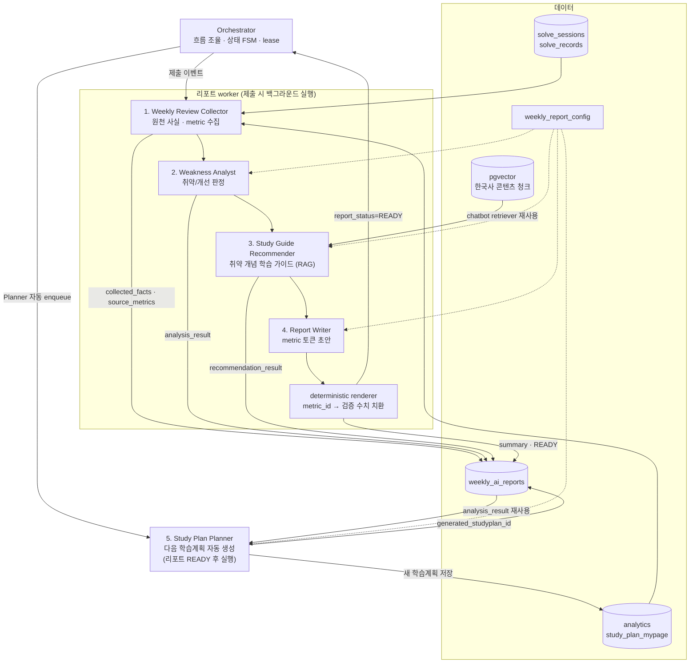
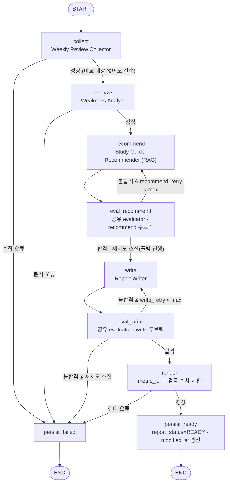
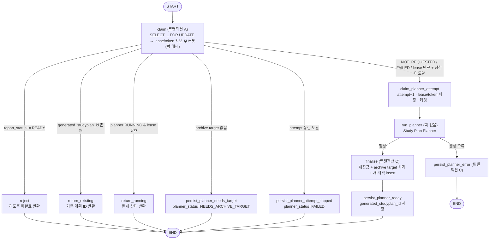
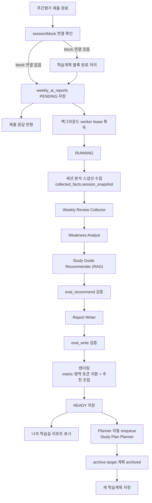

# 주간평가 완료 후 AI 주간 리포트 및 학습계획 생성 설계

> 문서 상태: SUPERSEDED DESIGN
> 초기 설계의 배경 참고용이다. queue·worker·lease·Planner 경계의 v2 기준은 [study_plan/AI_WORKFLOW.md](study_plan/AI_WORKFLOW.md)를 따른다.

## 목적

주간평가는 단순히 점수를 보여 주는 종료 화면이 아니라, 한 주 동안의 학습 결과를 요약하고 다음 주 학습계획을 만드는 트리거가 되어야 한다.

현재 학습계획은 `analytics` 앱의 `study_plan_mypage.study_plan_items` JSON과 `analytics` 집계 결과를 중심으로 동작한다. 따라서 주간평가 완료 후 흐름도 `analytics` 앱이 오케스트레이션을 담당하고, 문제 풀이/진단평가 앱은 완료 이벤트와 연결 식별자를 정확히 넘기는 역할로 제한하는 것이 좋다.

## 목표 동작

1. 사용자가 학습플래너의 주간평가 블록을 시작한다.
2. 진단평가 API가 주간평가 세션을 생성한다.
3. 사용자가 주간평가를 제출한다.
4. 제출 완료 시 해당 세션의 `solve_records`에 `studyplan_id`, `study_plan_block_id`가 있으면 리포트 원천 계획과 블록 연결값으로 남는다.
5. `analytics` 앱이 주간평가 블록을 완료 처리한다.
6. `analytics` 앱이 주간평가 결과와 최근 학습 기록을 바탕으로 AI 주간 리포트 생성 작업을 백그라운드 큐에 등록한다.
7. 제출 응답은 리포트 생성 완료를 기다리지 않고 즉시 반환하며, 나의 학습실은 리포트 상태(`PENDING`, `RUNNING`, `READY`, `FAILED`)를 표시한다.
8. 리포트가 `READY`가 되면 Orchestrator가 저장된 분석 결과로 Planner를 자동 실행한다.
9. Planner finalize 트랜잭션에서 원천 active 계획을 archived 처리하고 다음 계획을 active로 저장한다. 사용자가 AI 리포트를 보고 나의 학습실로 돌아오면 새 계획이 이미 준비되어 있어야 한다.

## 멀티에이전트 역할 분리

### 구성도



제출 시점에는 Orchestrator가 Collector → Weakness Analyst → Study Guide Recommender → Report Writer → deterministic renderer를 리포트 worker에서 실행한다. 리포트가 `READY`가 되면 별도 Planner 작업을 자동 enqueue한다. 구성도는 에이전트 수준 개요라 생략했지만 recommend·write 뒤에는 공유 evaluator 검증 노드가 있다 ("리포트 생성 그래프"·"공유 evaluator" 참조). 모든 산출물은 `weekly_ai_reports`에 분리 저장되어 실패 단계 구분과 Planner의 `analysis_result` 재사용, 다음 계획 생성 멱등성을 보장한다.

### 1. Weekly Review Collector

주간평가 완료 세션을 수집한다.

- 입력: `user_id`, `session_id`, `review_type`, `source_studyplan_id`, `study_plan_block_id`
- 조회 대상:
  - `solve_sessions`
  - `solve_records`
  - `analytics`
  - `study_plan_mypage`
- 산출:
  - `metric_id`가 부여된 주간평가 총 문항 수
  - `metric_id`가 부여된 정답률/오답률
  - `metric_id`가 부여된 평균 풀이 시간
  - `metric_id`가 부여된 시대/주제/유형별 오답률
  - `metric_id`가 부여된 기존 진단평가 대비 변화량
  - 비교 기준 세션 존재 여부와 선택 근거
  - 리포트 작성에 사용할 원천 사실 묶음(`collected_facts`)

### 2. Weakness Analyst

취약점을 판단한다.

- 취약 기준: 공통 취약점 판정 결과를 사용한다 (`docs/mypage/취약점_분석_개선_설계.md`의
  weakness_score/status. 자체 임계값을 두지 않는다)
- 단일 분류뿐 아니라 `era + topic + q_type` 복합 취약점을 우선 사용한다.
- 표본 수가 부족한 항목(status=INSUFFICIENT)은 리포트에서 "관찰 필요"로 낮은 확신도를 붙인다.
- 산출:
  - 핵심 취약 `weekly_report_config.top_weak_limit`개
  - 개선된 항목 `weekly_report_config.top_improved_limit`개
  - 다음 주 우선 학습 대상
  - 근거 수치
  - 비교 대상이 없을 때 `analysis_result.comparison.status='INSUFFICIENT_BASELINE'` 신호

### 3. Study Guide Recommender

취약 개념에 대해 "무엇을 어떻게 공부할지"를 한국사 콘텐츠 기반으로 추천한다. LLM + RAG 에이전트다.

- 입력: `analysis_result`의 핵심 취약 항목 top N (`groupKeyId`, `era`, `topic`, `q_type`, 근거 수치)
- 동작:
  1. 취약 조합을 개념 검색 쿼리로 변환한다 (LLM 판단 지점 — 예: "조선·정치·사료형" → "붕당정치", "탕평책")
  2. chatbot의 `PgVectorHybridRetriever`(`app/chatbot/rag/pgvector_retriever.py`)로 콘텐츠 청크를 검색한다. retriever 계층만 단방향 import하며 chatbot 코드는 수정하지 않는다
  3. 검색된 청크를 근거로 항목별 학습 포인트를 생성한다. 각 추천에 출처 청크 참조를 필수로 포함한다
- 품질 게이트:
  - 검색 결합 스코어가 임계값(`weekly_report_config.recommend_min_score`) 미달인 항목은 추천을 생성하지 않는다. 나쁜 추천이 무추천보다 해롭다
  - 게이트 탈락 항목은 추천 문장 대신 챗봇 질문 연결 링크(취약 조합으로 질문 프리필)로 폴백한다
  - 임계값 캘리브레이션은 기존 RAGAS 평가 파이프라인을 재사용한다
- 저장 전 검증 (공유 evaluator의 `eval_recommend` 노드가 수행 — "공유 evaluator" 절 참조):
  - 출처 청크 참조가 없는 추천은 드롭한다
  - 출제 예측·수치 서술을 금지한다 (수치는 Collector metric 경로만 허용)
- 산출: `recommendation_result` — 항목별 학습 포인트, 출처 참조, 게이트 탈락 항목의 폴백 정보
- 실패 정책 (soft-fail): 노드 예외·검색 실패 시 `recommendation_result`를 빈 값으로 두고 write로 진행한다. 리포트 섹션만 생략되며 `failed_stage` 대상이 아니다

### 4. Report Writer

학생에게 보여 줄 주간 리포트 문장을 생성한다.

- 입력: Collector/Weakness Analyst 산출물
- 출력 형식:
  - 이번 주 요약
  - 진단평가 대비 변화
  - 가장 취약한 영역
  - 가장 개선된 영역
  - 다음 주 학습 전략
- 추천 학습 가이드 섹션은 Writer 산출이 아니다. render 단계에서 `recommendation_result`로 별도 조립한다
  (metric 기반 수치 서술과 콘텐츠 기반 추천 서술의 검증 규칙을 분리하기 위함)
- 주의:
  - 점수만 말하지 않고 원인과 행동 제안을 함께 적는다.
  - 데이터가 부족하면 `analysis_result.comparison.status`를 읽어 단정하지 않고 "추가 풀이 필요"로 표시한다.
  - 숫자를 자유 서술로 직접 생성하지 않는다.
  - Writer는 `{metric:weekly_wrong_rate}` 같은 metric 참조 토큰만 사용하고, 렌더링 단계에서 Collector의 검증된 수치로 치환한다.
  - 취약/개선 영역명도 자유 서술하지 않고 `{target:groupKeyId}` 참조 토큰으로 출력한다. 렌더링 단계에서 표시명으로 치환하며(표시명은 taxonomy 상수 모듈 조회 — `취약점_분석_개선_설계.md` 5장), 이 덕분에 "없는 영역 지어내기" 검사가 결정론으로 가능해진다.
  - 저장 전 검증은 "참조한 metric_id가 모두 존재하는지"와 "허용되지 않은 숫자 literal이 문장에 섞였는지"를 확인한다. 검증 주체는 공유 evaluator의 `eval_write` 노드다 ("공유 evaluator" 절 참조).

### 5. Study Plan Planner

리포트 결과를 다음 학습계획으로 변환한다.

- 입력:
  - 원천 학습계획 ID(`sourceStudyPlanId`, fallback 리포트에서는 `null` 가능)
  - archive 대상 학습계획 ID(`planner_archive_target_studyplan_id`, 기본값은 active 상태의 `sourceStudyPlanId`)
  - 공통 취약점 판정 행 목록(`groupKeyId`, `weaknessScore`, `status`, `trend` 포함)
  - 개선 항목 목록(`trend == "IMPROVING"`)
  - 출제 예상 목록
  - 사용자 남은 시험일
  - 하루 학습 가능 시간
  - 최근 미완료 학습 블록
- 출력:
  - 6일 학습 + 1일 주간평가 구조
  - 각 일자별 학습 블록
  - 블록별 `era`, `topic`, `qType`, `questionCount`, `reason`
- 반영 규칙:
  - 취약 항목은 다음 계획의 우선 학습 블록으로 배치한다.
  - 개선 항목은 완전히 제외하지 않고 유지 복습 후보로 낮은 가중치를 둔다.
  - 개선 항목의 복습 비중은 `weekly_report_config.improved_review_ratio`로 조절한다.
  - 같은 `groupKeyId`가 취약 항목과 개선 항목에 동시에 있으면 최신 `trend/status`를 기준으로 한 번만 배치한다.

### 6. Orchestrator

전체 흐름을 조율한다.

- 주간평가 완료 이벤트를 받는다.
- 제출 시점에는 Collector, Weakness Analyst, Study Guide Recommender, Report Writer까지만 백그라운드로 실행한다.
- 리포트가 `READY`가 되면 Planner 작업을 자동 enqueue한다.
- 실패 시 `collected_facts`, `analysis_result`, `recommendation_result`, `writer_draft`를 분리 저장하고 재시도 가능하게 한다.
- 백그라운드 작업은 상태 FSM과 lease로 제어한다.
  - 상태: `PENDING`, `RUNNING`, `READY`, `FAILED`
  - lease 필드: `locked_until`, `lease_token`, `attempt_count`, `last_error`
  - Planner lease 필드: `planner_locked_until`, `planner_lease_token`, `planner_attempt_count`, `planner_last_error`
- 새 학습계획 생성 전 기존 active 계획을 archived 처리하는 작업은 Planner finalize 트랜잭션에서만 수행한다.
- 자동 Planner 요청은 멱등하게 처리하되, 락을 잡은 채 Planner를 실행하지 않는다. Planner가 LLM/계산을 포함하면 락 대기가 길어지므로 claim → 실행 → finalize 세 단계로 나눈다.
  - claim 트랜잭션: `weekly_ai_reports` row를 `SELECT ... FOR UPDATE`로 잠그고 재실행 여부를 판정한 뒤 lease만 확보하고 즉시 커밋해 락을 푼다.
  - Planner 실행: 락 없이 수행한다. 계산이 길어져도 다른 요청을 막지 않는다.
  - finalize 트랜잭션: 같은 row를 다시 잠그고, archive target 계획 archive와 새 계획 insert를 한 트랜잭션에서 수행한다.
  - 이미 `generated_studyplan_id`가 있으면 claim 단계에서 기존 계획 ID를 반환한다.
  - active 계획 archive는 `planner_archive_target_studyplan_id`와 `status='active'` 조건을 함께 걸어 한 번만 적용한다.

## LangGraph 그래프 설계

에이전트는 두 개의 독립된 LangGraph 그래프로 나눈다. 리포트 생성 그래프는 제출 시점에 worker가 실행하고, Planner 그래프는 리포트 `READY` 전이 후 자동으로 실행한다. 두 그래프를 분리하는 이유는 lease 필드(`locked_until` vs `planner_locked_until`)와 재시도 단위가 다르고, 리포트는 유지한 채 Planner만 다시 실행할 수 있어야 하기 때문이다.

lease 획득·`attempt_count` 증가·`RUNNING`/`FAILED` 전이 같은 FSM 제어는 그래프 바깥의 worker가 담당한다. 그래프 노드는 한 번의 실행 안에서 단계별 산출물을 만들고, 실패 시 어느 단계에서 멈췄는지만 상태에 남긴다.

### 공유 상태

두 그래프가 공유하지 않는 별도 상태를 쓰되, 리포트 그래프 상태는 다음 필드를 갖는다.

```python
class WeeklyReviewState(TypedDict):
    # 식별자
    user_id: int
    session_id: int
    review_type: str
    source_studyplan_id: int | None
    study_plan_block_id: str | None
    # 단계별 산출물 (weekly_ai_reports 컬럼과 1:1 대응)
    collected_facts: dict
    source_metrics: dict
    analysis_result: dict
    recommendation_result: dict
    writer_draft: dict
    rendered_report: dict
    # 제어
    write_retry: int
    recommend_retry: int
    eval_results: dict         # {"recommend": {"passed": bool, ...}, "write": {"passed": bool, ...}}
    failed_stage: str | None   # "collect" | "analyze" | "write" | "render" (recommend는 soft-fail이라 제외)
    last_error: str | None
```

각 노드는 자기 산출물 필드만 채운다. `failed_stage`가 채워지면 그 값으로 "수집 오류/분석 오류/서술 오류/렌더 오류"를 구분해 `weekly_ai_reports`에 저장한다.

### 리포트 생성 그래프



조건부 엣지 라우팅 규칙:

- `collect` 이후: 예외가 있으면 `persist_failed`. 비교 대상 세션이 없는 것은 오류가 아니라 `collected_facts.comparison.baseline_session_id=NULL`로 남긴 뒤 정상 진행한다.
- `analyze` 이후: 예외가 있으면 `persist_failed`, 아니면 `recommend`.
- `recommend` 이후: 항상 `eval_recommend`로 간다. 노드 예외·검색 실패 시 `recommendation_result`를 빈 값으로 두고 `eval_recommend`가 소진 처리한다.
- `eval_recommend` 이후: 불합격이고 `recommend_retry`가 남았으면 `recommend`로 되돌린다. 합격이거나 재시도를 소진하면 `write`로 진행한다 (soft-fail — 소진 시 게이트 탈락 항목은 챗봇 연결 폴백 정보만 남긴다). `persist_failed`로 가지 않고 `failed_stage`에도 기록하지 않는다.
- `write` 이후: 항상 `eval_write`로 간다. 단 write 노드 예외로 `failed_stage='write'`가 이미 설정됐으면 `eval_write`는 판정을 수행하지 않고 통과시키며, 라우팅 가드(failed_stage 검사)가 `persist_failed`로 보낸다 — 깨진 초안을 LLM으로 판정하지 않는다.
- `eval_write` 이후: 불합격이고 `write_retry`가 남았으면 `write`로 되돌린다. 합격이면 `render`, 재시도를 소진하면 `persist_failed`로 간다.
- `render` 이후: 예외가 있으면 `persist_failed`, 아니면 `persist_ready`.
- **eval 노드 자체의 예외** (LLM 판정 호출 실패 등): eval 노드는 예외를 삼키고 `eval_results[대상]`에 `evaluator_error=True`와 사유를 남긴다. `eval_recommend`의 evaluator_error는 불합격 소진과 동일하게 처리한다 — 폴백을 두고 `write`로 진행(soft-fail). `eval_write`의 evaluator_error는 검증 불가 상태이므로 합격으로 간주하지 않고 `failed_stage='write'`로 `persist_failed`로 간다. 전체 재실행은 worker의 `attempt_count`가 커버한다.
- **재시도 카운터 증가 주체**: 라우팅 함수는 비교만 하고 증가시키지 않는다. 재시도로 재진입한 생성 노드(`write`/`recommend`)가 실행 시작 시 자기 카운터를 1 증가시킨다. 최초 진입(카운터 0)과 재진입은 `eval_results`에 해당 대상의 판정 기록이 있는지로 구분한다.

### 공유 evaluator

evaluator는 함수 하나로 만들고, 그래프에는 대상별 루브릭(판정 기준 목록)만 바꿔 노드 두 개로 등록한다. 판정·라우팅 로직은 한 곳에만 존재한다.

```python
graph.add_node("eval_recommend", make_evaluator_node("recommend"))
graph.add_node("eval_write", make_evaluator_node("write"))
```

recommend 루브릭:

| 구분 | 항목 |
|---|---|
| 결정론 | 출처 청크 참조 존재 + 참조 chunk id가 이번 검색 결과 집합에 실제 존재 (참조 위조 검사) |
| 결정론 | 추천이 전부 실제 취약 항목(`groupKeyId`)에 매핑 — 판정에 없는 항목 추천 금지 |
| 결정론 | 같은 개념의 중복 추천 금지 |
| 결정론 | 게이트 탈락 항목의 챗봇 프리필 질문 유효성 |
| 결정론(근사) | 출제 예측·수치 서술 금지 — 숫자 패턴·예측 표현 목록 기반 |
| 결정론 | 항목당 학습 포인트 분량 상한 |
| LLM | 추천-검색 청크 사실 일치 (faithfulness) |
| LLM | 실행 가능성 — 구체적 행동인가 |

write 루브릭:

| 구분 | 항목 |
|---|---|
| 결정론 | 참조 `metric_id`가 `source_metrics`에 모두 존재 |
| 결정론 | 허용되지 않은 숫자 literal 없음 |
| 결정론 | 필수 metric 커버리지 — 총 문항 수·전체 오답률이 실제로 참조됨 (빈껍데기 서술 방지) |
| 결정론 | 영역 참조 토큰(`{target:groupKeyId}`)이 `analysis_result` 판정 목록에 존재 — 없는 영역 지어내기 방지 |
| 결정론 | 섹션 완결성 — 5개 섹션 존재, 빈 섹션 금지. 단 취약 판정 0개(전부 INSUFFICIENT)면 취약 섹션은 "판단 보류" 유형만 허용 (억지 서술 유도 방지) |
| 결정론 | 길이·언어 — 한국어, 섹션별 분량 상한 |
| LLM | 데이터 부족 단정 금지 — `comparison.status`와 서술 톤 일치 |
| LLM | 어조 — 학생 대상, 비난·낙담 조 금지 |

- 내부는 2단이다: 결정론 검사(코드로 정확히 판정 가능한 항목)를 먼저 수행하고, 전부 통과한 경우에만 LLM 판정을 수행한다. 결정론으로 걸러질 것을 LLM에 묻지 않는다.
- 불합격 시 사유를 `eval_results`에 항목 단위로 남기고, 재시도 시 생성 노드의 프롬프트에 피드백으로 주입한다 (evaluator-optimizer). 사유 없는 불합격은 없다.
- `eval_results`는 `weekly_ai_reports`에도 저장한다. 실행 내 재시도는 그래프 상태의 값을 쓰고, 수동 재시도·재생성으로 시작하는 **새 실행**은 저장된 직전 `eval_results`를 첫 생성 프롬프트의 초기 피드백으로 사용한 뒤 자기 결과로 덮어쓴다.
- 실패 정책은 대상별로 비대칭이다: recommend는 소진 시 폴백을 두고 진행(soft-fail), write는 소진 시 리포트 전체 FAILED.

`write_retry`는 최초 Writer 호출 이후의 추가 재작성 횟수다. `weekly_report_config.max_write_retry=2`이면 최초 1회 + 재작성 2회까지 허용한다. `recommend_retry`도 같은 방식이며 상한은 `weekly_report_config.max_recommend_retry`로 관리한다. 재시도 루프는 그래프 안(eval 노드 경유)에서 발생하고, `persist_failed`로 끝난 뒤의 전체 재실행은 worker가 lease와 `attempt_count`로 제어한다. 두 재시도 계층을 섞지 않는다.

라우팅 함수는 `else` 없이 가드 방식으로 작성한다.

```python
def route_after_eval_write(state: WeeklyReviewState, config: WeeklyReportConfig) -> str:
    if state["failed_stage"] == "write":
        return "persist_failed"
    if state["eval_results"]["write"]["passed"]:
        return "render"
    if state["write_retry"] < config.max_write_retry:
        return "write"
    return "persist_failed"


def route_after_eval_recommend(state: WeeklyReviewState, config: WeeklyReportConfig) -> str:
    if state["eval_results"]["recommend"].get("evaluator_error"):
        return "write"  # 판정 불가 — 재시도 없이 soft-fail
    if state["eval_results"]["recommend"]["passed"]:
        return "write"
    if state["recommend_retry"] < config.max_recommend_retry:
        return "recommend"
    return "write"  # soft-fail: 폴백 정보만 남기고 진행
```

### Planner 그래프

Planner는 락을 잡은 채 실행하지 않는다. claim(짧은 트랜잭션) → run_planner(락 없음) → finalize(짧은 트랜잭션) 순서다.



claim 트랜잭션의 라우팅이 새 계획 생성 멱등성의 핵심이다. `SELECT ... FOR UPDATE`로 row를 잠근 뒤 우선순위대로 분기하고, `claim_planner_attempt`로 갈 때만 lease를 잡고 커밋한다.

```python
def route_after_claim(state: PlannerState, config: WeeklyReportConfig, now) -> str:
    if state["report_status"] != "READY":
        return "reject"
    if state["generated_studyplan_id"] is not None:
        return "return_existing"
    if (
        state["planner_status"] == "RUNNING"
        and state["planner_locked_until"] is not None
        and state["planner_locked_until"] > now
    ):
        return "return_running"
    if state["resolved_archive_target_studyplan_id"] is None:
        return "persist_planner_needs_target"
    if state["planner_attempt_count"] >= config.planner_max_attempts:
        return "persist_planner_attempt_capped"
    return "claim_planner_attempt"
```

`resolved_archive_target_studyplan_id`는 claim 트랜잭션 안에서 기존 `planner_archive_target_studyplan_id`, active 상태의 `source_studyplan_id` 순서로 해석한 값이다. 값이 없으면 `planner_status='NEEDS_ARCHIVE_TARGET'`, `planner_last_error=NULL`, `planner_locked_until=NULL`, `planner_lease_token=NULL`, `modified_at=NOW()`를 저장하고 Planner를 실행하지 않는다. 이 상태는 실패 시도 횟수에 포함하지 않으며 마이페이지 예외 복구 대상으로 남긴다. `claim_planner_attempt`에서만 `planner_attempt_count`를 1 증가시키고 `planner_archive_target_studyplan_id=:resolved_archive_target_studyplan_id`, `planner_locked_until=NOW()+weekly_report_config.planner_lease_minutes`, `planner_lease_token=:planner_lease_token`, `planner_status='RUNNING'`을 저장한다. `run_planner`는 트랜잭션 밖에서 실행되므로 계산이 길어도 락을 잡지 않는다. finalize 트랜잭션은 같은 row를 다시 잠그고, 이 요청의 `planner_lease_token`이 아직 유효한지 확인한 뒤(만료·교체됐으면 결과를 버린다) archive target 처리와 새 계획 insert, `generated_studyplan_id`·`planner_status='READY'` 저장을 한 트랜잭션에서 커밋한다. 실패 처리(`persist_planner_error`)는 `WHERE planner_status='RUNNING' AND planner_lease_token=:planner_lease_token AND planner_locked_until > NOW()` 조건이 맞을 때만 수행하고, 조건이 맞지 않으면 stale 실행 결과로 보고 버린다. 조건이 맞으면 `planner_attempt_count`를 다시 증가시키지 않고 `planner_last_error`, `planner_locked_until=NULL`, `planner_lease_token=NULL`, `modified_at`만 갱신한다.

## analytics 앱 내 구현 범위

analytics 앱에서 직접 구현 가능한 일:

- 주간평가 완료 후 비교 데이터 조회
- 주간평가 블록 완료 처리
- 취약 개념 학습 가이드 추천 (chatbot의 `PgVectorHybridRetriever`를 단방향 import로 재사용, chatbot 코드 수정 없음)
- AI 리포트 저장 모델 또는 JSON 저장 정책 설계
- 리포트 `READY` 후 다음 학습계획 자동 생성
- 나의 학습실 표시
- 공통 취약점 판정 결과 적용
- 오늘 학습계획 자동 보정
- 전날 미완료 블록 오늘 이월
- 백그라운드 리포트 작업 상태 관리
- 리포트 생성 재시도와 lease 관리

analytics 앱에서 직접 하기 어려운 일:

- 진단평가 시작 API가 `review_type`, `studyplan_id`, `study_plan_block_id`를 세션/레코드에 저장하는 것
- 진단평가 제출 API가 주간평가 완료 이벤트를 직접 호출하는 것
- 문제풀이 앱의 세션 생성/제출 payload 변경

이 부분은 아래 "외부 앱 변경 요청서"로 분리한다.

## 저장 구조 제안

### 주간 리포트 저장

새 테이블을 추가할 수 있다면 다음 구조를 권장한다.

```sql
weekly_ai_reports (
    report_id BIGSERIAL PRIMARY KEY,
    user_id BIGINT NOT NULL,
    source_studyplan_id BIGINT NULL,
    session_id BIGINT NOT NULL,
    report_status VARCHAR(20) NOT NULL DEFAULT 'PENDING',
    summary TEXT NOT NULL DEFAULT '',
    strengths JSONB NOT NULL DEFAULT '[]',
    weaknesses JSONB NOT NULL DEFAULT '[]',
    recommendations JSONB NOT NULL DEFAULT '[]',
    source_metrics JSONB NOT NULL DEFAULT '{}',
    collected_facts JSONB NOT NULL DEFAULT '{}',
    analysis_result JSONB NOT NULL DEFAULT '{}',
    recommendation_result JSONB NOT NULL DEFAULT '{}',
    eval_results JSONB NOT NULL DEFAULT '{}',
    writer_draft JSONB NOT NULL DEFAULT '{}',
    rendered_report JSONB NOT NULL DEFAULT '{}',
    failed_stage VARCHAR(20) NULL,
    planner_status VARCHAR(20) NOT NULL DEFAULT 'NOT_REQUESTED',
    generated_studyplan_id BIGINT NULL,
    planner_archive_target_studyplan_id BIGINT NULL,
    planner_locked_until TIMESTAMPTZ NULL,
    planner_lease_token UUID NULL,
    planner_attempt_count INT NOT NULL DEFAULT 0,
    planner_last_error TEXT NULL,
    locked_until TIMESTAMPTZ NULL,
    lease_token UUID NULL,
    attempt_count INT NOT NULL DEFAULT 0,
    last_error TEXT NULL,
    created_at TIMESTAMPTZ NOT NULL,
    modified_at TIMESTAMPTZ NOT NULL,
    CONSTRAINT weekly_ai_reports_user_session_uidx UNIQUE (user_id, session_id),
    CONSTRAINT weekly_ai_reports_status_check CHECK (
        report_status IN ('PENDING', 'RUNNING', 'READY', 'FAILED')
    ),
    CONSTRAINT weekly_ai_reports_planner_status_check CHECK (
        planner_status IN (
            'NOT_REQUESTED',
            'NEEDS_ARCHIVE_TARGET',
            'RUNNING',
            'READY',
            'FAILED'
        )
    ),
    CONSTRAINT weekly_ai_reports_failed_stage_check CHECK (
        failed_stage IS NULL
        OR failed_stage IN ('collect', 'analyze', 'write', 'render')
    )
);

CREATE INDEX weekly_ai_reports_worker_claim_idx
    ON weekly_ai_reports(report_status, locked_until, report_id)
    WHERE report_status IN ('PENDING', 'RUNNING');
```

리포트 worker는 위 인덱스로 claim 대상을 폴링한다. Planner 경로는 `READY` 저장 후 `report_id`/`(user_id, session_id)`를 포함한 알림으로 자동 enqueue하므로 PK·unique 제약으로 단건 조회할 수 있고, 별도 claim 인덱스를 두지 않는다.

백그라운드 worker(lease, `ON CONFLICT`, `SELECT ... FOR UPDATE`)를 쓰는 이상 DB 테이블은 필수다. JSON 파일 임시 저장은 이 동시성 제어와 맞지 않으므로, worker·lease 없이 단일 프로세스에서 동기 실행하는 로컬 데모용으로만 허용한다. worker를 붙이는 순간 unique 제약이 있는 별도 DB 테이블로 전환한다.

`source_metrics`, `collected_facts`, `analysis_result`는 의도를 분리한다.

- `source_metrics`: 렌더링 치환용 metric_id와 검증된 숫자 값
- `collected_facts`: Collector가 DB에서 수집한 원천 사실
- `analysis_result`: Weakness Analyst의 판정 결과와 Planner 재사용 입력
- `recommendation_result`: Study Guide Recommender의 RAG 기반 학습 가이드 산출물(출처 청크 참조, 게이트 탈락 항목의 챗봇 폴백 정보 포함). 화면용 `recommendations`(Writer의 학습 전략)와는 별개 필드다.
- `eval_results`: 마지막 실행의 공유 evaluator 판정 결과(대상별 합격 여부와 불합격 사유). 수동 재시도·재생성 시 새 실행이 직전 불합격 사유를 생성 프롬프트의 초기 피드백으로 참조해 같은 실패를 반복하지 않게 한다.
- `writer_draft`: Report Writer가 생성한 metric 참조 토큰 기반 초안
- `rendered_report`: deterministic renderer가 만든 최종 구조화 리포트. Writer 초안의 metric 토큰·영역 토큰(`{target:groupKeyId}` → 표시명, taxonomy 상수 모듈 조회) 치환에 더해 `recommendation_result`를 "추천 학습 가이드" 별도 섹션으로 조립한다. 화면용 `summary`, `strengths`, `weaknesses`, `recommendations`는 이 값에서 분리 저장한다.
- `failed_stage`: 실패가 발생한 리포트 그래프 단계
- `source_studyplan_id`: 이 리포트의 원천이 된 기존(주간평가 대상) 학습계획 ID
- `planner_status`: 자동 다음 계획 생성 상태. `NEEDS_ARCHIVE_TARGET`은 원천 active 계획을 결정할 수 없어 자동 생성을 중단한 예외 상태다.
- `generated_studyplan_id`: Planner가 새로 만든 계획 ID. 중복 enqueue 시 이 값을 반환한다.
- `planner_archive_target_studyplan_id`: 새 계획 저장 시 archived 처리할 active 계획 ID. 정상 주간평가는 active 상태의 `source_studyplan_id`를 사용한다.
- `lease_token`, `planner_lease_token`: lease 만료 후 다른 worker/request가 같은 row를 다시 잡았을 때 이전 실행 결과가 덮어쓰지 못하게 하는 실행별 UUID

참조 무결성은 다음 정책으로 둔다.

- `user_id`, `session_id`는 원천 사용자가 사라지거나 세션이 사라지면 리포트도 의미가 없으므로 DB 구현 시 FK를 걸고 삭제 정책은 서비스 정책에 맞춰 `CASCADE` 또는 사용자 삭제 배치에서 함께 제거한다.
- `source_studyplan_id`, `generated_studyplan_id`, `planner_archive_target_studyplan_id`는 과거 리포트 조회를 위해 물리 삭제보다 soft delete/상태 변경을 우선한다. 물리 삭제를 허용해야 한다면 FK는 `SET NULL`로 두고 리포트에는 당시의 `collected_facts`와 `analysis_result`를 보존한다.

이 분리가 있어야 실패 시 "수집 오류", "분석 오류", "서술 오류", "렌더 오류"를 구분할 수 있고, 리포트 `READY` 후 자동 Planner가 분석 결과를 재사용할 수 있다. 추천(recommend)은 soft-fail이라 실패 단계 구분에 포함되지 않는다.

### enqueue 멱등성

`diagnosis_submit`에서 주간 리포트 작업을 enqueue할 때는 `(user_id, session_id)` unique 제약을 전제로 upsert한다.

```sql
INSERT INTO weekly_ai_reports (
    user_id,
    source_studyplan_id,
    session_id,
    report_status,
    created_at,
    modified_at
)
VALUES (
    :user_id,
    :source_studyplan_id,
    :session_id,
    'PENDING',
    NOW(),
    NOW()
)
ON CONFLICT (user_id, session_id) DO NOTHING;
```

중복 제출 또는 네트워크 재시도로 같은 세션이 다시 들어오면 새 row를 만들지 않고 기존 row를 그대로 사용한다. API 응답에서 리포트 상태가 필요하면 upsert 이후 `(user_id, session_id)`로 다시 조회한다.

이미 `READY` 또는 `RUNNING`인 row를 `PENDING`으로 되돌리지 않는다.

worker는 반드시 제출 트랜잭션이 **커밋된 뒤에** 깨운다. enqueue INSERT 자체는 제출 트랜잭션 안에서 수행하되, worker 알림/스케줄링은 Django `transaction.on_commit()` 콜백에 등록한다. 그렇지 않으면 worker가 아직 커밋되지 않은 row나 session/records를 못 보거나, 롤백된 작업을 잡으려 할 수 있다.

```python
def enqueue_weekly_report(user_id, source_studyplan_id, session_id):
    upsert_pending_report(user_id, source_studyplan_id, session_id)  # ON CONFLICT DO NOTHING
    transaction.on_commit(lambda: notify_report_worker(user_id, session_id))
```

### 리포트 worker claim 절차

리포트 생성도 Planner와 같은 시도 횟수 규칙을 쓴다. `attempt_count`는 실행 직전 claim에서만 증가하고, 실패 저장 단계에서는 다시 증가시키지 않는다. `weekly_report_config.max_attempts=3`이면 실제 실행은 최대 3회다.

1. worker가 트랜잭션을 시작한다.
2. `report_status='PENDING'` 또는 lease가 만료된 `RUNNING` row를 `SELECT ... FOR UPDATE SKIP LOCKED`로 잡는다.
3. `attempt_count >= weekly_report_config.max_attempts`이면 실행하지 않고 `report_status='FAILED'`, `last_error='attempt_limit_exceeded'`, `locked_until=NULL`, `lease_token=NULL`, `modified_at=NOW()`로 저장한다.
4. 상한 미도달이면 실행별 `lease_token`을 생성하고 `report_status='RUNNING'`, `locked_until=NOW()+weekly_report_config.lease_minutes`, `lease_token=:lease_token`, `attempt_count=attempt_count+1`, `last_error=NULL`, `modified_at=NOW()`를 저장하고 커밋한다.
5. 커밋 후 Collector → Weakness Analyst → Study Guide Recommender → Report Writer → renderer를 실행한다(recommend·write 뒤에는 공유 evaluator 검증과 재시도 루프가 있다 — "리포트 생성 그래프" 참조). 실행 중에는 DB row 락을 잡지 않는다.
6. 성공하면 `WHERE report_status='RUNNING' AND lease_token=:lease_token AND locked_until > NOW()` 조건으로 다시 잠그고, 토큰과 lease가 유효할 때만 `rendered_report`, `summary`, `strengths`, `weaknesses`, `recommendations`, `source_metrics`, `collected_facts`, `analysis_result`, `recommendation_result`, `eval_results`, `writer_draft`, `report_status='READY'`, `failed_stage=NULL`, `locked_until=NULL`, `lease_token=NULL`, `last_error=NULL`, `modified_at=NOW()`를 저장한다. 커밋 후 `transaction.on_commit()`에서 Planner 작업을 자동 enqueue한다.
7. 실패하면 같은 `lease_token`과 `locked_until > NOW()` 조건으로 마지막 중간 산출물(`eval_results` 포함)과 `failed_stage`, `last_error`, `locked_until=NULL`, `lease_token=NULL`, `modified_at=NOW()`를 저장한다. 이 실행으로 `attempt_count >= weekly_report_config.max_attempts`가 됐으면 `FAILED`, 아직 남았으면 `PENDING`으로 되돌려 다음 worker가 재시도할 수 있게 한다. 토큰이나 lease가 일치하지 않으면 이미 다른 실행이 이어받은 것으로 보고 결과를 버린다.

### 새 계획 생성 멱등성

리포트 `READY` 후 자동 enqueue되는 Planner는 리포트 생성 worker와 별도 lease를 사용한다. Planner 실행이 길어질 수 있으므로 락을 잡은 채 실행하지 않고 세 단계로 나눈다.

**claim 트랜잭션 (짧게, 락 확보용)**

1. 트랜잭션을 시작한다.
2. 대상 `weekly_ai_reports` row를 `SELECT ... FOR UPDATE`로 잠근다.
3. `report_status='READY'`가 아니면 아무것도 하지 않고 현재 상태를 반환한다.
4. `generated_studyplan_id`가 이미 있으면 archive/create 없이 해당 ID를 반환한다.
5. `planner_status='RUNNING'`이고 `planner_locked_until > NOW()`이면 중복 요청으로 보고 현재 상태를 반환한다.
6. `resolved_archive_target_studyplan_id`를 정한다.
   - 기존 `planner_archive_target_studyplan_id`가 있고 아직 active이면 그 값을 유지한다.
   - `source_studyplan_id`가 있고 아직 active이면 그 값을 사용한다.
   - `source_studyplan_id`가 없거나 이미 active가 아니면 `planner_status='NEEDS_ARCHIVE_TARGET'`으로 저장하고 Planner를 실행하지 않는다.
7. 그 외(`NOT_REQUESTED`, `NEEDS_ARCHIVE_TARGET`, `FAILED`, lease 만료 `RUNNING`)이면 재실행 대상이다.
   - `planner_attempt_count >= weekly_report_config.planner_max_attempts`이면 실행하지 않고 `planner_status='FAILED'`, `planner_last_error='attempt_limit_exceeded'`, `planner_locked_until=NULL`, `planner_lease_token=NULL`, `modified_at=NOW()`로 저장한다.
   - 상한 미도달이면 실행별 `planner_lease_token`을 생성하고 이 claim에서만 `planner_attempt_count=planner_attempt_count+1`, `planner_archive_target_studyplan_id=:resolved_archive_target_studyplan_id`, `planner_status='RUNNING'`, `planner_locked_until=NOW()+weekly_report_config.planner_lease_minutes`, `planner_lease_token=:planner_lease_token`, `modified_at=NOW()`를 저장한다.
8. 트랜잭션을 커밋해 락을 즉시 푼다. claim이 성공한 요청은 이후 Planner 실행 단계로 진행한다.

**Planner 실행 (락 없음)**

- claim에 성공한 요청만 Planner를 실행한다. 이 단계에서는 어떤 row도 잠그지 않는다.
- LLM/계산이 오래 걸려도 다른 요청이나 worker를 막지 않는다.

**finalize 트랜잭션 (짧게, 반영용)**

1. 트랜잭션을 시작한다.
2. 같은 row를 다시 `SELECT ... FOR UPDATE`로 잠근다.
3. `planner_status='RUNNING'`이고 `planner_lease_token`이 이 요청의 토큰과 일치하며 `planner_locked_until > NOW()`인지 확인한다. 만료·교체됐으면 이 요청 결과를 버린다(다른 실행이 이어받았다고 본다).
4. `planner_archive_target_studyplan_id`의 계획만 `WHERE id=:planner_archive_target_studyplan_id AND user_id=:user_id AND status='active'` 조건으로 archive한다. 대상이 더 이상 active가 아니면 stale 요청으로 보고 새 계획 insert를 중단한 뒤 최신 계획 상태를 다시 확인한다.
5. 새 학습계획을 insert한다.
6. `generated_studyplan_id`, `planner_status='READY'`, `planner_locked_until=NULL`, `planner_lease_token=NULL`, `modified_at`을 저장한다.
7. 커밋한다.

archive와 새 계획 insert는 반드시 finalize 트랜잭션 안에서 함께 처리한다. Planner 계산 자체는 트랜잭션 밖이다.

### 학습계획 생성 입력

AI 리포트가 Planner에 넘기는 최소 입력:

```json
{
  "userId": 1,
  "sourceStudyPlanId": 10,
  "archiveTargetStudyPlanId": 10,
  "weeklyReviewSessionId": 100,
  "weakTargets": [
    {
      "groupKeyId": "era=조선|topic=정치|q_type=사료 해석",
      "era": "조선",
      "topic": "정치",
      "qType": "사료 해석",
      "weaknessScore": 0.72,
      "status": "WEAK",
      "trend": "WORSENING",
      "wrongRate": 0.42,
      "wrongCount": 5,
      "totalCount": 12,
      "reason": "최근 주간평가에서 오답률이 높음"
    }
  ],
  "improvedTargets": [
    {
      "groupKeyId": "era=고려|topic=문화|q_type=개념",
      "era": "고려",
      "topic": "문화",
      "qType": "개념",
      "weaknessScore": 0.24,
      "status": "STABLE",
      "trend": "IMPROVING",
      "wrongRate": 0.18,
      "wrongCount": 2,
      "totalCount": 11,
      "reason": "이전 진단 대비 오답률이 낮아짐"
    }
  ],
  "predictionTargets": [
    {
      "era": "조선",
      "topic": "정치",
      "qType": "사료 해석",
      "expectedWeight": 0.35,
      "reason": "최근 오답률과 출제 빈도가 모두 높음"
    }
  ],
  "incompleteBlocks": [
    {
      "studyPlanBlockId": "block-uuid",
      "scheduledDate": "2026-07-07",
      "era": "고려",
      "topic": "문화",
      "qType": "개념",
      "remainingQuestionCount": 8
    }
  ],
  "availableMinutesPerDay": 60,
  "remainingDays": 14
}
```

`improvedTargets`는 별도 로직으로 다시 계산하지 않고, 공통 취약점 판정 행 중 `trend == "IMPROVING"`인 항목으로 정의한다.
`groupKeyId`는 취약점 설계 5장의 canonical string(`"field=정규화값"`을 `|`로 연결, `build_group_key_id` 생성)을 그대로 쓴다 — 다른 포맷으로 재조립하지 않는다.
`weakTargets`·`improvedTargets`는 리포트의 `analysis_result`를 재사용한다. 반면 `predictionTargets`(출제 예상)와 `incompleteBlocks`(최근 미완료 블록)는 Weakness Analyst 산출이 아니므로 `analysis_result`에 없다. 이 둘은 자동 Planner claim 시점에 각각 analytics의 출제 예상 집계와 `study_plan_mypage` 현재 상태에서 새로 수집해 채운다.
`sourceStudyPlanId`는 리포트의 원천 계획 ID라서 fallback 리포트에서는 `null`일 수 있다. `archiveTargetStudyPlanId`는 정상 주간평가에서 active 상태의 `sourceStudyPlanId`로 결정한다. 이 값이 없으면 Planner를 실행하지 않고 `NEEDS_ARCHIVE_TARGET`을 반환한다.

## 주간평가 완료 이벤트 처리 순서



제출 API 안에서 LLM 호출을 직접 수행하지 않는다. Collector, Analyst, Recommender, Writer(와 공유 evaluator 검증)는 리포트 worker에서 실행하고, Planner는 `READY` 커밋 후 별도 작업으로 자동 실행한다. 위 flowchart는 정상 경로 개요이며 재시도 루프·soft-fail 분기는 "리포트 생성 그래프"가 기준이다.

여기서 세션 분석 스냅샷은 별도 테이블이 아니라 worker가 claim에 성공한 뒤 읽은 `solve_sessions`, `solve_records`, `analytics` 집계 결과의 고정 복사본이다. Collector가 이를 `collected_facts.session_snapshot`에 저장하고, 비교 대상 없음/표본 부족 같은 신호는 Analyst가 `analysis_result.comparison`에 저장한다. Report Writer는 이 필드만 읽어 "추가 풀이 필요" 표시 여부를 결정한다.

## 실패 처리

- 주간평가 세션은 완료됐지만 `study_plan_block_id`가 없으면:
  - 리포트 원천은 현재 제출된 `session_id`로 고정한다.
  - `source_studyplan_id=NULL`, `study_plan_block_id=NULL`로 저장한다.
  - 단, 학습계획 블록 자동 완료는 하지 않는다.
  - 원천 계획이 없으므로 자동 Planner는 `NEEDS_ARCHIVE_TARGET`으로 중단하고 예외 복구 흐름으로 넘긴다.
- Recommender 실패는 리포트 실패가 아니다 (soft-fail):
  - 검색 실패·게이트 전원 탈락·재시도 소진 모두 `recommendation_result`를 빈 값 또는 챗봇 폴백 정보만으로 두고 write로 진행한다.
  - `failed_stage`·`attempt_count`에 영향을 주지 않으며, 리포트에는 추천 섹션만 생략되거나 폴백 링크로 표시된다.
- AI 리포트 생성 실패:
  - `attempt_count`는 claim 단계에서 이미 증가했으므로 실패 처리에서는 다시 증가시키지 않는다.
  - `attempt_count >= weekly_report_config.max_attempts`이면 `report_status='FAILED'`로 고정한다.
  - 상한 미도달이면 `report_status='PENDING'`으로 되돌려 다음 worker가 다시 claim할 수 있게 한다.
  - `last_error`, 마지막 중간 산출물, `failed_stage`를 보존한다.
  - lease가 만료된 `RUNNING` 작업은 재시도 대상으로 본다.
  - 제출 응답 자체는 실패시키지 않는다.
  - 수동 재시도 버튼은 `report_status`를 `FAILED → PENDING`으로 되돌리고 `attempt_count=0`, `last_error=NULL`, `locked_until=NULL`, `lease_token=NULL`로 초기화한다. 이후 worker가 다시 집는다. 보존된 중간 산출물은 새 실행이 덮어쓰되, 저장된 직전 `eval_results`(불합격 사유)는 새 실행의 첫 생성 프롬프트에 초기 피드백으로 주입한 뒤 덮어쓴다 ("공유 evaluator" 절 참조).
- 새 계획 생성 대상이 없으면:
  - `planner_status='NEEDS_ARCHIVE_TARGET'`로 저장한다.
  - Planner를 실행하지 않으므로 `planner_attempt_count`는 증가시키지 않는다.
  - 마이페이지는 자동 계획 생성에 필요한 원천 계획을 확인할 수 없는 예외 상태를 표시한다.
- 다음 학습계획 생성 실패:
  - 기존 계획을 archived 처리하지 않는다.
  - `planner_attempt_count`는 claim 단계에서 이미 증가했으므로 실패 처리에서는 다시 증가시키지 않는다.
  - `planner_last_error`, `planner_locked_until=NULL`, `planner_lease_token=NULL`, `modified_at`을 갱신한다.
  - 생성 오류 저장은 `planner_status='RUNNING' AND planner_lease_token=:planner_lease_token AND planner_locked_until > NOW()` 조건이 맞을 때만 수행하고, 조건이 맞지 않으면 stale 실행 결과로 버린다.
  - finalize에서 archive target이 더 이상 active가 아니면 새 계획을 insert하지 않고 `planner_last_error='stale_archive_target'`로 저장한 뒤 사용자에게 리포트/계획 상태 새로고침을 요구한다.
  - `planner_attempt_count >= weekly_report_config.planner_max_attempts`이면 `planner_status='FAILED'`로 고정한다.
  - 상한 이내이면 `planner_status='NOT_REQUESTED'`로 되돌리고 Planner 작업을 다시 enqueue한다.
  - `FAILED`로 고정된 뒤 수동 재시도 버튼은 `planner_status`를 `FAILED → NOT_REQUESTED`로 되돌리고 `planner_attempt_count=0`, `planner_last_error=NULL`, `planner_locked_until=NULL`, `planner_lease_token=NULL`로 초기화한다.
  - 사용자에게 "리포트는 생성됐지만 새 계획 생성이 필요합니다" 상태를 보여 준다.

## 구현 스택과 실행 정책

- Orchestrator는 LangGraph 기반 상태 그래프로 구현할 수 있다. `requirements.txt`에 이미 `langgraph`가 있으므로 별도 런타임 도입 없이 시작할 수 있다.
- worker는 DB lease와 실행별 token을 잡은 작업만 실행한다.
- `locked_until < now()`인 `RUNNING` 작업은 worker 장애로 간주해 재시도 가능하다.
- 저장 단계는 항상 실행별 token 일치와 lease 만료 시각 조건을 함께 건다. 리포트는 `lease_token` + `locked_until > NOW()`, Planner는 `planner_lease_token` + `planner_locked_until > NOW()` 조건으로 만료된 이전 실행 결과가 새 실행 결과를 덮어쓰지 못하게 한다.
- `attempt_count >= weekly_report_config.max_attempts`이면 새 실행을 시작하지 않고 `FAILED`로 고정한다. 수동 재시도는 `FAILED → PENDING` 전이와 `attempt_count=0` 초기화로 정의한다(Planner는 `FAILED → NOT_REQUESTED`, `planner_attempt_count=0`).
- Planner 경로는 리포트 worker와 별도이므로 `planner_attempt_count`와 `weekly_report_config.planner_max_attempts`를 사용한다.
- Report Writer는 metric 참조 토큰만 생성하고, 숫자 렌더링은 deterministic renderer가 수행한다.

### 실행 방식 — 상시 worker 없는 이벤트 트리거 (v1 확정)

"worker"는 별도 상시 프로세스가 아니라 **요청 프로세스의 백그라운드 스레드**다.
상시 폴링 프로세스를 두지 않는다. lease·token·claim 코드는 실행 주체와 무관하게 동일하므로,
운영 확장이 필요해지면 같은 코드를 management command 폴링 프로세스로 옮기기만 하면 된다.

- **주 트리거 (제출)**: `diagnosis_submit`이 enqueue 후 `transaction.on_commit()`으로
  스레드를 띄워 claim을 1회 시도한다. 리포트 그래프 완료(`persist_ready`) 후 같은 스레드가
  Planner claim → 실행 → finalize로 이어 간다 (자동 체이닝).
- **회수 트리거 1 (나의 학습실 진입)**: 내 리포트가 `PENDING`이거나 lease 만료 `RUNNING`,
  또는 `planner_status`가 재실행 대상(`NOT_REQUESTED`·lease 만료 `RUNNING`)이면
  스레드로 claim을 1회 시도한다. 사용자가 결과를 보러 온 시점이 곧 재시도가 필요한 시점이다.
  이월(`ensure_today_study_plan`)과 같은 사상 — 배치 없이 사용자 행동이 트리거다.
- **회수 트리거 2 (수동 재시도 버튼)**: `FAILED → PENDING`(리포트) 또는
  `FAILED → NOT_REQUESTED`(Planner) 전이 직후 같은 방식으로 claim을 1회 시도한다.
- 동시 트리거 경합은 claim의 `SELECT ... FOR UPDATE SKIP LOCKED`가 직렬화한다.
  집을 작업이 없는 claim은 빈손 no-op라 마이페이지 진입 비용에 영향이 없다.
- `notify_report_worker()`는 v1에서 no-op다 (트리거 스레드가 직접 실행하므로 알림 대상이 없다).
  상시 worker 전환 시에만 의미를 갖는다.
- 스레드는 종료 전 DB 커넥션을 정리한다 (`connection.close()`).
  runserver autoreload 등으로 스레드가 중단돼도 lease 만료 후 회수 트리거가 복구한다.
- 수용하는 한계: 실패한 작업은 사용자가 나의 학습실에 들어와야 재시도된다.
  리포트·다음 계획은 사용자가 볼 때 필요한 산출물이므로 v1에서 허용한다.

### 나의 학습실 표시 규칙 (학습 플래너 패널 헤딩)

리포트·Planner 상태는 학습 플래너 패널 헤딩 영역(기존 `planner-header-actions` 자리)에 표시한다.

| 상태 | 표시 |
|---|---|
| 주간평가 미제출 | 표시 없음 (현행 유지) |
| report `PENDING`/`RUNNING` | "AI 리포트 생성 중" 배지 (버튼 없음 — 진입 자체가 회수 트리거) |
| report `READY` + planner `RUNNING` | "리포트 보기" + "다음 주 계획 생성 중" 배지 |
| report `READY` + planner `READY` | "리포트 보기" + "다음 주 계획이 준비됐어요" (새 계획으로 전환됨) |
| planner `NEEDS_ARCHIVE_TARGET` | "리포트 보기" + 교체할 active 계획 선택 UI + 생성 버튼 |
| report/planner `FAILED` | 실패 배지 + **[다시 생성]** 버튼 |
| 주간평가 미응시 | "평가 미응시" 배지 (버튼 없음) |

- 재시도 API는 analytics 관할이다: `POST /analytics/api/weekly-report/retry/` —
  실패 처리 절의 수동 재시도 전이를 수행하고 claim 스레드를 1회 띄운다.
  이미 `PENDING`/`RUNNING`이면 상태 변경 없이 현재 상태를 반환한다 (멱등).
- mypage view는 최신 리포트 row의 `report_status`/`planner_status`를 context로 내려주고,
  view는 호출 순서만 담당한다 (상태 계산은 서비스 함수).

## 설정값

하드코딩을 피하기 위해 다음 값은 설정으로 둔다.

```json
{
  "weekly_report_config": {
    "top_weak_limit": 3,
    "top_improved_limit": 3,
    "max_attempts": 3,
    "planner_max_attempts": 2,
    "max_write_retry": 2,
    "max_recommend_retry": 1,
    "recommend_min_score": 0.70,
    "lease_minutes": 10,
    "planner_lease_minutes": 10,
    "improved_review_ratio": 0.2
  }
}
```

- `max_recommend_retry` 초기값 1: RAG 검색 + LLM 생성이라 재시도 비용이 write보다 크고, 소진 시 챗봇 폴백이 있어 공격적으로 재시도할 이유가 없다.
- `recommend_min_score` 초기값 0.70: 챗봇 `MIN_COMBINED_SCORE`와 동일 출발값이며 RAGAS 평가로 캘리브레이션한다.
- `lease_minutes`는 evaluator LLM 판정과 재시도 루프가 추가된 만큼 실측 후 캘리브레이션 대상이다.

## 확정 결정 사항

- Planner 자동 실행:
  - 리포트 `READY` 저장 후 사용자 확정 없이 Planner를 자동 실행해 다음 계획을 생성·교체한다.
  - 근거: 주간평가는 계획의 마지막 날 블록이므로 제출 = 해당 주 계획 소진. 다음 계획 자동 준비가 사이클상 자연스럽다.
  - 사용자 개입 예외는 `NEEDS_ARCHIVE_TARGET`(교체 대상 선택)과 `FAILED`(수동 재시도) 두 가지뿐이다.
  - 실행 주체는 상시 프로세스가 아니라 이벤트 트리거 스레드다 ("실행 방식" 절 참조).
- 주간평가 세션 식별 방식:
  - `solve_sessions`에 `review_type` 필드를 추가한다.
  - 기존 `session_type='diagnostic'`은 유지한다.
  - 주간평가 세션은 `session_type='diagnostic'`, `review_type='weekly_review'`로 식별한다.
  - 일반 진단평가는 `session_type='diagnostic'`, `review_type IS NULL`로 둔다.
  - record의 `studyplan_id`, `study_plan_block_id`는 블록 연결과 진행률 계산에 사용하고, 세션 식별의 1차 기준으로 쓰지 않는다.
  - 이유: 기존 진단평가 집계 호환성을 유지하면서도 "이 세션이 주간평가인가"를 record 조인 없이 판단할 수 있다.
- 블록 자동 완료와 수동 완료 버튼 경합:
  - `complete_study_plan_block_by_id()`는 이미 완료된 블록에 다시 호출돼도 같은 완료 상태를 유지해야 한다.
  - 완료 시각 갱신 여부는 정책으로 고정한다. 권장값은 최초 완료 시각 보존이다.
- 스키마 세부 사항:
  - 리포트 원천은 주간평가 세션이므로 `session_id`는 `NOT NULL`을 권장한다.
  - 시간 필드는 worker lease와 장애 복구 기준이 되므로 `TIMESTAMPTZ`를 사용한다.
  - JSON 임시 저장은 worker·lease 없이 동기 실행하는 단일 프로세스에서만 쓰고, worker를 붙이면 unique 제약이 있는 별도 DB 테이블로 전환한다.

### solve_sessions 변경

```sql
ALTER TABLE solve_sessions
    ADD COLUMN IF NOT EXISTS review_type VARCHAR(20) NULL;

ALTER TABLE solve_sessions
    ADD CONSTRAINT solve_sessions_review_type_check
    CHECK (review_type IS NULL OR review_type IN ('weekly_review'));

CREATE INDEX solve_sessions_weekly_review_idx
    ON solve_sessions(user_id, recorded_date, session_id)
    WHERE session_type = 'diagnostic'
      AND review_type = 'weekly_review'
      AND status = 'completed';
```

## 외부 앱 변경 요청서

### diagnosis 앱 요청

주간평가 시작 요청에서 `studyplan_id`, `study_plan_block_id`를 받아야 한다.

현재 나의 학습실은 주간평가 시작 시 `/diagnosis/api/start/`로 다음 값을 보낸다.

```json
{
  "studyplan_id": 1,
  "study_plan_block_id": "block-uuid"
}
```

요청사항:

- `DiagnosisStartRequestSerializer`에 두 필드를 추가한다.
- `diagnosis_start`에서 `studyplan_id`, `study_plan_block_id`가 들어온 요청은 주간평가로 판단한다.
- 주간평가 세션은 `SolveSessions.session_type='diagnostic'`, `SolveSessions.review_type='weekly_review'`로 저장한다.
- 일반 진단평가 세션은 `SolveSessions.session_type='diagnostic'`, `SolveSessions.review_type=NULL`로 저장한다.
- 세션 생성 후 생성되는 `SolveRecords`에는 `studyplan_id`, `study_plan_block_id`를 저장한다.
- 주간평가 여부 판단은 세션의 `review_type`을 1차 기준으로 사용하고, record 연결값은 블록 연결/진행률 계산에 사용한다.

### diagnosis 제출 API 요청

요청사항:

- `diagnosis_submit` 완료 후 같은 트랜잭션에서 주간 리포트 작업을 `PENDING`으로 enqueue한다.
- enqueue 조건:
  - 해당 세션의 `review_type='weekly_review'`
  - 세션 상태가 `completed`
- 해당 세션의 record 중 `studyplan_id`, `study_plan_block_id`가 둘 다 있으면 `analytics.service.studyplan.complete_study_plan_block_by_id()`를 호출한다.
- record 연결값이 없으면 enqueue는 유지하되 `source_studyplan_id=NULL`로 저장하고 블록 완료 처리는 건너뛴다.
- 이후 AI 리포트 생성은 analytics 백그라운드 오케스트레이터가 담당한다.
- 제출 API는 Collector, Analyst, Writer, Planner를 직접 실행하지 않는다.
- 제출 API는 기존 active 계획을 archived 처리하지 않는다.
- enqueue는 `(user_id, session_id)` 기준 `ON CONFLICT DO NOTHING`으로 처리한다.
- worker 알림은 제출 트랜잭션 커밋 후에만 발생하도록 `transaction.on_commit()`에 등록한다. 커밋 전 알림은 worker가 미커밋/롤백 데이터를 잡게 만든다.

### question 앱 요청

일반 학습계획 문제풀이 쪽은 이미 `studyplan_id`, `study_plan_block_id`를 저장하는 흐름이 있으므로 유지한다.

추가 요청:

- 학습계획 문제풀이 완료 후 analytics 이벤트 훅을 하나로 정리한다.
- 주간평가와 일반 학습 블록 완료 처리 로직이 같은 서비스 함수를 타도록 맞춘다.
- 완료 처리 함수는 멱등성을 보장한다. 이미 완료된 블록을 다시 완료 처리해도 중복 기록이나 잘못된 진행률 변화가 없어야 한다.

## 현재 analytics 내부 보완 정책

외부 앱 변경 전까지는 analytics에서 다음 fallback을 유지한다.

- 주간평가 비교 대상은 완료된 `review_type='weekly_review'` 세션 중 최신 1건을 사용한다.
- 최신 기준은 `recorded_date DESC, session_id DESC`이다.
- `review_type` 도입 전 데이터는 완료된 diagnostic 세션 중 `studyplan_id`, `study_plan_block_id`가 연결된 record가 있는 최신 1건을 임시 fallback으로 사용한다.
- 비교 기준은 해당 주간평가보다 이전에 완료된 주간평가 중 최신 1건을 우선 사용한다.
- 이전 주간평가가 없으면 일반 진단평가(`session_type='diagnostic'`, `review_type IS NULL`) 중 가장 최근 1건을 첫 주기 기준으로 사용한다.
- 이전 주간평가와 일반 진단평가가 모두 없으면 기준 세션을 임의로 고르지 않고 `analysis_result.comparison.status='INSUFFICIENT_BASELINE'`으로 남긴다.
- 기준 진단평가와 주간평가 후보가 여러 개일 때는 항상 `recorded_date`, `session_id` 정렬로 하나만 선택한다.
- 과거 미완료 일반 학습 블록은 나의 학습실 진입 시 오늘 날짜로 이월한다. 주간평가 블록은 이월하지 않으며, 오늘이 `end_date` 이후면 이월하지 않는다 (`study_plan_policy.md`의 "미완료 블록 이월 정책" 참조).
- 오늘 학습계획 공백 복구는 active 계획의 기간 안에서만 수행한다. 오늘이 `end_date` 이후면 자동 이월·생성하지 않고 기간 만료 상태와 새 계획 생성 유도를 표시한다.

## 주간평가 미응시 처리

주간평가 블록은 이월 대상이 아니므로, 날짜가 지나도록 응시하지 않으면 다음 정책을 적용한다 (`study_plan_policy.md`의 "지나간 주간평가 블록 처리 (확정)"과 동일 기준).

- 날짜가 지난 미완료 주간평가 블록은 미응시 상태로 확정하고 시작을 차단한다. 버튼 라벨은 `미응시`로 표시한다.
- 리포트 생성 트리거는 주간평가 제출이므로, 미응시 주기에는 `weekly_ai_reports` row가 생성되지 않는다. 별도 `FAILED` 처리도 하지 않는다.
- 나의 학습실은 해당 주기를 "평가 미응시"와 "기간 만료" 상태로 표시한다. 리포트 상태(`PENDING`/`RUNNING`/`READY`/`FAILED`) 표시와 혼용하지 않는다.
- 미응시 계획의 남은 일반 블록은 원래 날짜에 유지하고 `end_date` 이후로 이월하지 않는다.
- AI 리포트가 없으므로 사용자가 새 계획 생성을 확정하면 기존 계획을 보관하고 새 계획을 생성한다.
