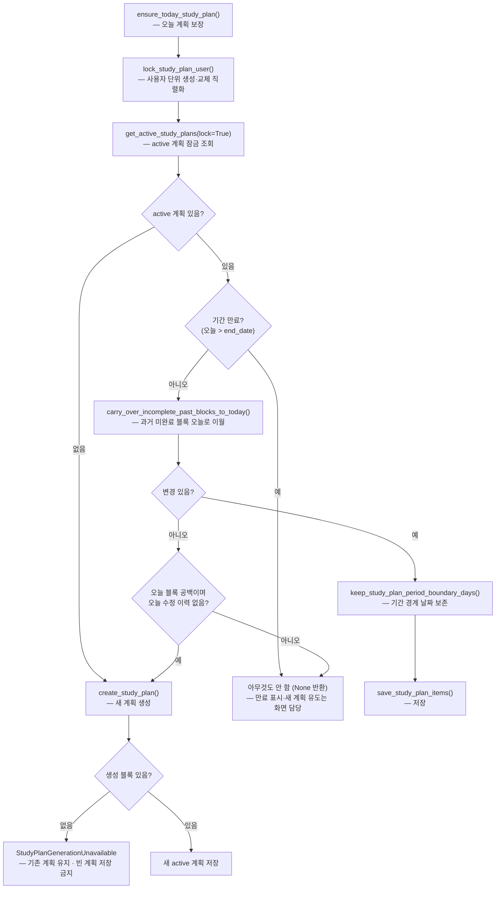
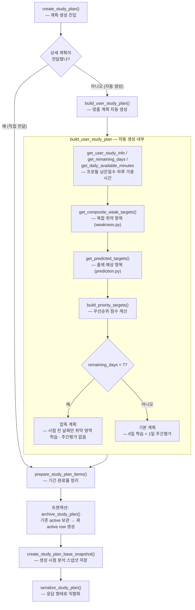
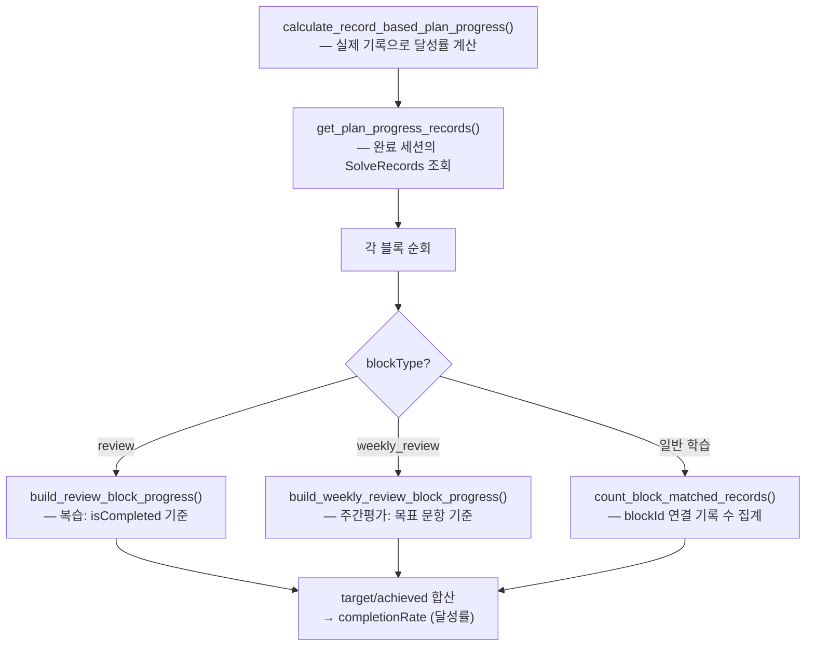
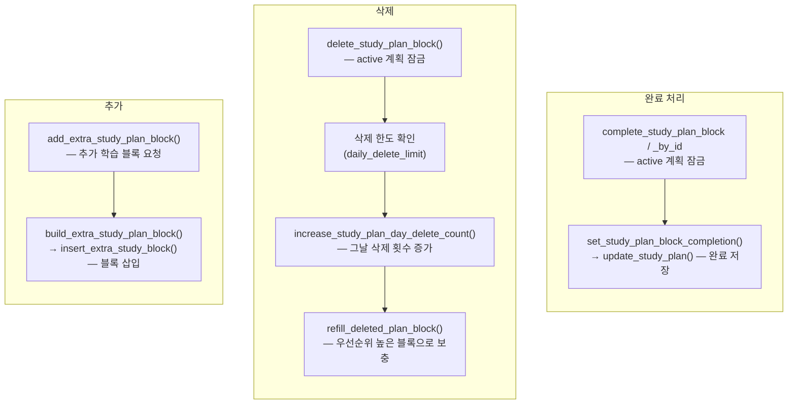
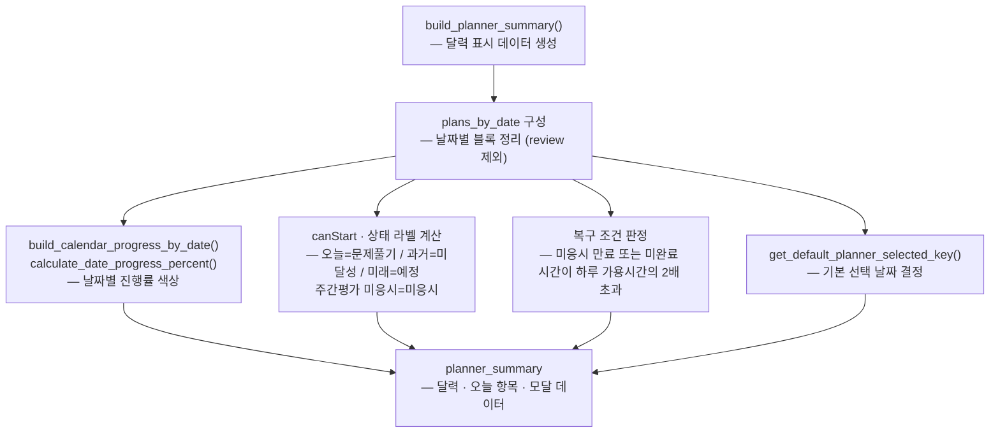

# 학습계획 상세 흐름도

`app/analytics/service/studyplan.py`의 학습계획 생성·보장·진행률·블록 조작과 `display.py`의 표시 가공을 세부 함수 단위로 정리했다. 각 노드는 `함수명 — 한글 설명` 형식으로 표기했다. 마이페이지 전체 흐름은 `mypage_service_flow.md`를 참조한다.

## 1. 오늘 계획 보장 (마이페이지 진입 시)

> 이월 규칙: 완료·주간평가 블록 제외, 복습 블록은 같은 대상의 다음 복습 블록 도달 전까지만, blockId 유지. 오늘 블록 공백은 같은 날 반복 생성을 막으면서 새 계획으로 복구한다. 상세는 `study_plan_policy.md`의 "미완료 블록 이월 정책"·"오늘 계획 동기화 상태 분기" 참조. 주간평가 완료/미응시 구분은 `SolveSessions.review_type` 도입 후 추가한다.

## 2. 학습계획 생성

## 3. 진행률 계산 (기록 기반)

진행률은 날짜·분류 추정이 아니라 `SolveRecords.studyplan_id + study_plan_block_id`로 해당 blockId에 직접 연결된 완료 기록만 센다.

## 4. 블록 조작

- 완료 처리는 멱등: 이미 완료된 블록을 다시 완료해도 같은 상태를 유지한다.
- 삭제·완료는 트랜잭션 안에서 active 계획 행을 잠그며 archived 계획 요청은 거부한다.
- 주간평가 블록은 삭제 대상에서 제외한다.
- 자동 이월은 삭제 횟수에 포함하지 않는다.

## 5. 표시용 가공 (display.py)

주간평가 블록은 시작 라벨이 "주간 평가 시작"이며 `/diagnosis/api/start/` 흐름으로 연결된다(일반 학습 블록은 "문제 풀기" → 문제풀이 API).

정상 주간평가 완료는 수동 재생성 버튼 조건이 아니다. 주간 리포트가 `READY`가 되면 analytics worker가 Planner를 자동 실행하고, Planner finalize 트랜잭션에서 기존 active 계획을 archived 처리한 뒤 다음 계획을 active로 저장한다.
