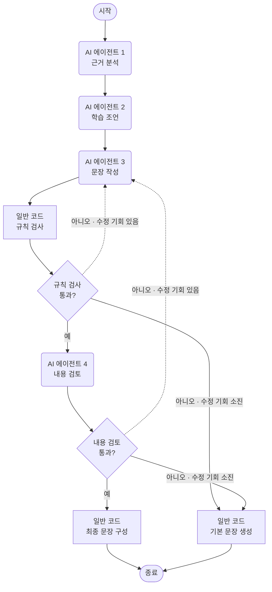
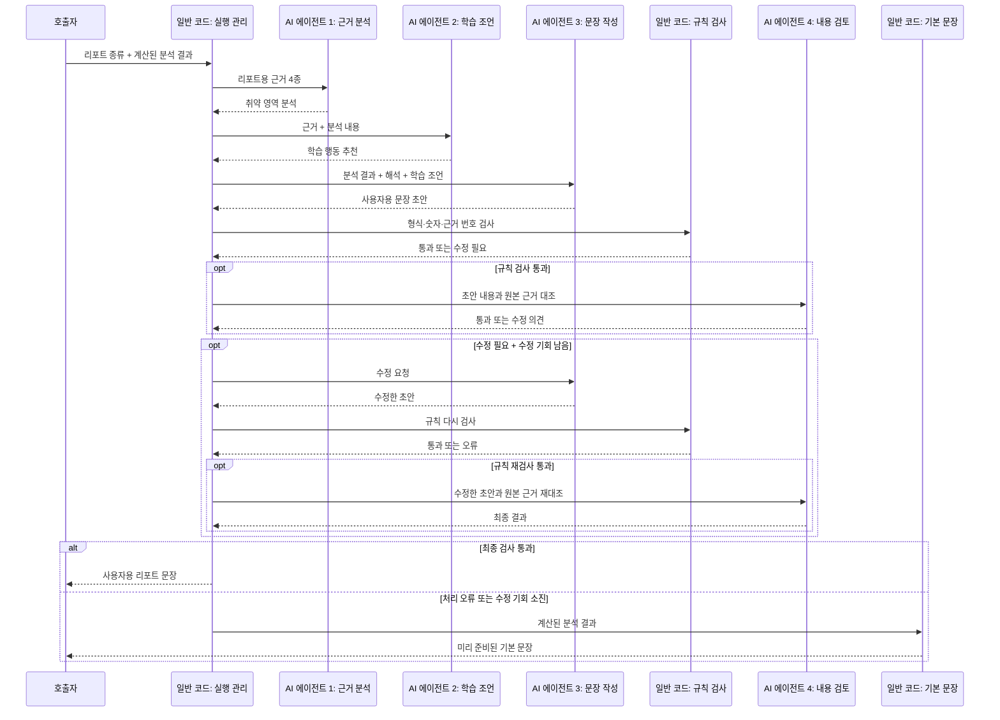
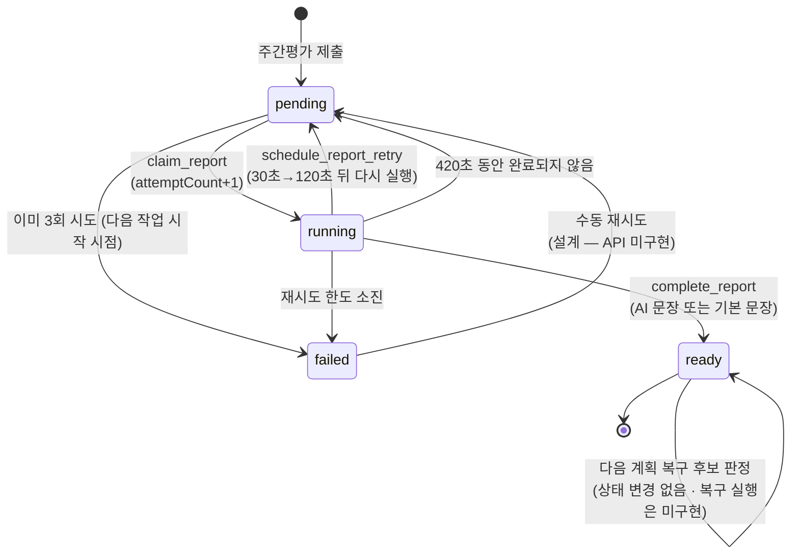

# 주간리포트 멀티에이전트 구조 상세

- 상태: **멀티에이전트 모듈 구현 완료 · 서비스 연결 미완료** (코드 대조일: 2026-07-21)
- 대상 코드: `app/analytics/service/weekly_report/`
- 관련 설계: [통합설계 §3](./학습계획_AI주간리포트_통합설계.md), [구현 상세 부록](./학습계획_AI주간리포트_구현상세부록.md)

이 문서는 AI 주간리포트에서 여러 AI가 역할을 나누어 문장을 만드는 부분만
실제 코드에 맞춰 설명한다. 학습계획 계산·작업 잠금·API는 통합설계 문서를 따른다.

> **서비스 연결 현황**: 아래 흐름은 모듈 함수와 테스트 코드로 작성되어 있으나,
> 아직 실제 서비스 흐름에 연결되지 않았다. 마이페이지 응답은 `weeklyReport: None`이고
> (`views.py`), `generate_graph_report_content()`의 운영 호출처가 없으며, 수동 재시도
> API 주소와 `weekly_report_data` 저장 모델·DB 변경 파일(마이그레이션)도 미구현이다. 따라서
> "사용자는 항상 리포트를 받는다", `fallback → ready`, `failed → pending 수동 재시도`
> 같은 흐름은 현재 **설계상 기대 동작**이며, 모듈이나 서비스가 자동으로 보장하지 않는다.

---

## 1. 설계 원칙

점수·통계·취약 영역·다음 학습 대상은 일반 코드가 먼저 계산해 분석 결과(`result`)에
고정한다. AI는 이 결과를 읽기 쉬운 문장으로 바꾸는 역할만 하며, 다음 행동을 하지
않도록 지시문과 두 단계 검사를 함께 사용한다. 다만 AI의 의미 오류를 완전히 막는
구조는 아니다.

- 새로운 점수·사실·취약 판정·원인 생성
- 학습 계획 생성·변경
- 입력에 없는 evidenceId 인용

사용자에게 보여줄 문장은 모두 근거가 연결된 문장(`GroundedStatement`) 형식이다.
문장 내용(`text`)과 근거 번호(`evidenceIds`)를 함께 저장하며, 근거 번호가 입력 자료에
실제로 있는지 코드가 확인한다. 검사를 통과하지 못한 AI 문장은 사용자에게 보여주지
않고 미리 준비된 기본 문장을 사용한다.

---

## 2. 파일 구성

| 파일 | 역할 |
|---|---|
| `agents.py` | AI 역할 4종의 지시문과 응답 형식 정의, AI 호출 처리 |
| `graph.py` | 역할별 실행 순서, 실패 분기, 시작 함수 정의 |
| `llm.py` | 문장 검사 함수 + 그래프 도입 전의 단일 작성·검토 흐름이 함께 남아 있음. `__init__.py`에서도 공개 중이므로 호환용인지 제거 대상인지 결정 필요 |
| `config.py` | AI 모델·응답 길이·재작성 횟수·금지 표현 등 공통 설정 (`WeeklyReportConfig`) |
| `worker.py` | 리포트 작업 상태 변경 (시작 / 완료 / 재시도 / 복구 후보 판정) |
| `relation_evidence.py` | 그래프 관계 기반 반복 혼동 근거(confusionPatterns) 준비 |
| `service.py` | 분석 결과 구성, 미리 준비된 기본 문장 생성, 화면 응답 변환 |

테스트: `app/analytics/test_weekly_report_graph.py`,
`test_weekly_report.py`, `test_weekly_report_relation_evidence.py`

---

## 3. AI 역할 4종 (`agents.py`)

네 역할 모두 외부 도구를 사용하지 않고 정해진 형식으로만 답한다
(`create_agent(tools=[])`). Pydantic 응답 형식에 `extra="forbid"`를 적용해 약속하지
않은 항목을 추가하거나 필수 항목을 빠뜨리면 오류로 처리한다.

| AI 역할 | 코드 이름 / 메서드 | 받는 정보 (모두 reportType 포함) | 응답 형식 |
|---|---|---|---|
| 근거 분석 | `weekly_report_evidence_analyst` / `analyze` | 선별한 근거 4종 | `WeaknessAnalysis` (요약 + 발견 내용) |
| 학습 조언 | `weekly_report_study_coach` / `coach` | 근거 4종 + 분석 내용 | `StudyCoaching` (추천 행동) |
| 문장 작성 | `weekly_report_writer` / `write` | 전체 분석 결과 + 분석 내용 + 학습 조언 + 수정 요청 | `ReportDraft` (총평 1개 + 학습 팁) |
| 내용 검토 | `weekly_report_critic` / `critique` | 전체 분석 결과 + 분석 내용 + 학습 조언 + 초안 | `ReportCritique` (통과 여부 + 오류 + 수정 의견) |

근거 4종은 `_select_narrative_evidence`가 분석 결과에서 추리는
`strengths`, `priorityImprovements`, `timeSummary`, `confusionPatterns`다.
근거 분석 역할과 학습 조언 역할은 전체 분석 결과가 아니라 이 네 종류만 본다.

내용 검토 결과(`ReportCritique`)는 판정과 설명이 서로 맞아야 한다. `passed=true`인데
오류나 수정 의견이 있거나, `passed=false`인데 둘 다 비어 있으면 응답 형식 검사에서
오류로 처리한다.

### 3.1 모든 AI 역할에 적용하는 금지 규칙

각 역할의 지시문에 포함된 핵심 제한은 다음과 같다.

- 입력에 존재하는 evidenceId만 인용, 근거 없으면 단정 금지
- 숫자·목록 개수·순위·내부 데이터 항목 이름을 사용자 문장에 노출 금지
- "개선 근거"를 안정적 성취·높은 정답률로 과장 금지 (개선 흐름만 의미)
- 보완 근거만으로 오답 원인(암기 부족·실수 습관) 추측 금지
- confusionPatterns의 `correctFact`/`selectedFact`로 직접 확인되는 관계만 언급,
  `comparisonDimensions`에 없는 비교 기준 생성 금지
- 계획·달력·학습 기간 생성·변경 금지 (학습 조언 역할)
- 합격 보장·비난 표현 금지 (문장 작성 역할)

내용 검토 역할은 같은 규칙으로 문장 작성 결과를 다시 확인한다. 작성 역할과 검토
역할을 분리해 작성 결과를 그대로 통과시키지 않도록 한 구조다.

---

## 4. 실행 흐름 (`graph.py`)

### 4.1 실행 중 저장하는 정보

실행 중 필요한 값은 `WeeklyReportGraphState`에 보관한다.

| 구분 | 코드 항목 | 의미 |
|---|---|---|
| 입력 | `report_type`, `result` | 리포트 종류와 일반 코드가 계산한 분석 결과 |
| 중간 결과 | `weakness_analysis`, `coaching_recommendations`, `draft` | 근거 분석, 학습 조언, 사용자용 문장 초안 |
| 검사·수정 | `guard_errors`, `critic_result`, `revision_feedback`, `revision_count` | 발견한 문제, 내용 검토 결과, 수정 요청, 고쳐 쓴 횟수 |
| 실패 기록 | `failed_stage` | 어느 단계에서 처리하지 못했는지 기록 |
| 최종 결과 | `content` | 사용자에게 돌려줄 총평과 학습 팁 |

### 4.2 역할과 흐름

#### 그래프 구조

번호가 붙은 둥근 상자는 **AI 에이전트**, 네모는 **일반 코드 처리**, 마름모는
**통과 여부를 판단하는 분기**, 양 끝의 캡슐 모양은 **시작·종료**를 뜻한다.

#### 작업 실행 순서

근거 분석·학습 조언 단계에서 AI 호출, 응답 형식 또는 근거 연결에 문제가 생기면 즉시
기본 문장으로 종료한다. 문장 작성 이후에 발견된 문제만 최대 한 번 고쳐 쓰며, 수정
기회를 다 쓰거나 다시 검사해도 실패하면 기본 문장을 사용한다. 세부 조건은 아래 표를
따른다.

| 단계(코드 이름) | 종류 | 하는 일 | 실패 시 |
|---|---|---|---|
| `weakness_analyst` | AI | 선별 근거 해석 | 호출·응답 형식·근거 연결 오류 → 기본 문장 |
| `study_coach` | AI | 실행할 수 있는 복습 행동 추천 | 위와 동일 |
| `report_writer` | AI | 총평과 학습 팁 초안 작성, 수정 요청 반영 | 호출·응답 형식 오류 → 기본 문장 |
| `code_guard` | 일반 코드 | 형식·숫자·근거 번호·금지 표현 검사 | 문제가 있으면 한도 안에서 수정 요청 |
| `report_critic` | AI | 초안 내용이 원본 근거와 맞는지 검토 | 통과하지 못하면 한도 안에서 수정 요청 |
| `finalize` | 일반 코드 | 사용자에게 돌려줄 최종 문장 구성 (`fallbackUsed: false`) | — |
| `fallback` | 일반 코드 | `build_fallback_content`로 미리 준비된 기본 문장 생성 | — |

근거 분석과 학습 조언의 응답도 `validate_grounded_statements`로 즉시 검사한다.
이 두 단계에서 문제가 발견되면 다시 작성하지 않고 기본 문장을 사용한다. 고쳐 쓰기는
문장 작성 단계 이후에만 허용한다.

### 4.3 규칙 검사(Code Guard)와 수정 요청

`validate_ai_content`는 같은 입력에는 항상 같은 결과를 내는 일반 코드 검사다.
확인하는 항목은 다음과 같다.

| 오류 코드 | 쉬운 설명 | 문장 작성 역할에 보내는 수정 요청 |
|---|---|---|
| `*_UNSUPPORTED_NUMBER` | 인용한 근거에서 찾을 수 없는 숫자를 사용함 | 숫자를 빼거나 그 숫자가 실제로 있는 근거 번호를 연결 |
| `*_UNKNOWN_EVIDENCE` | 입력 자료에 없는 근거 번호를 사용함 | 문장을 실제로 뒷받침하는 근거 번호로 교체 |
| `*_FORBIDDEN_PHRASE` | 금지 표현이나 내부 코드용 이름을 문장에 노출함 | 해당 표현 제거 |
| `UNKNOWN_FIELD`·필수 필드 오류 | 허용하지 않은 항목을 넣거나 필요한 항목을 빠뜨림 | 오류 코드를 그대로 전달 |
| 개수·길이·자료형 오류 | 학습 팁 개수, 문장 길이 또는 값 형식이 기준을 벗어남 | 오류 코드를 그대로 전달 |

수정 요청은 `revision_feedback`에 담아 문장 작성 역할에 전달한다.

**규칙 검사의 한계**: 이 검사는 문장의 형식과 문자열만 확인한다. 실제로 존재하는
근거 번호를 붙였더라도 문장 내용이 그 근거와 다르면 통과할 수 있다. 이런 의미 오류는
내용 검토 역할이 원본 근거와 다시 대조한다. 두 검사를 함께 사용해 AI가 근거 없는
내용을 만들 가능성을 줄이지만 완전히 차단하지는 못한다.

### 4.4 고쳐 쓰기와 AI 호출 횟수

- `maximum_revision_count = 1`: 규칙 검사 실패와 내용 검토 거절을 합쳐 한 번만 고쳐 쓴다.
- 정상 흐름에서는 AI를 4회 호출한다. 고쳐 쓰면 문장 작성과 내용 검토를 한 번씩 더
  호출할 수 있어 최대 6회다.
- 한 번 고친 뒤에도 통과하지 못하면 미리 준비된 기본 문장을 사용한다.

### 4.5 기본 문장 사용

`generate_graph_report_content`는 실행 중 오류가 발생하면
`build_fallback_content`로 미리 준비된 기본 문장을 만든다. 다만 입력된 분석 결과가
약속된 형식을 지킨다는 전제에서만 보장된다. 분석 결과 자체의 형식이 잘못되면 기본
문장 생성도 실패할 수 있다. 기본 문장 사용 여부는 `content.fallbackUsed`로 구분한다.

---

## 5. 작업 상태 변화 (`worker.py`)

리포트 한 건이 생성되고 완료될 때까지 대기(`pending`), 작업 중(`running`), 완료
(`ready`), 실패(`failed`) 상태를 관리한다. 설계상 AI 문장 생성에
실패하면 작업을 `failed`로 끝내지 않고 기본 문장을 넣어 `ready`로 만든다. `failed`는
작업 자체의 재시도 횟수를 모두 쓴 경우에만 사용한다. 현재는 그래프가 기본 문장을
반환하는 부분까지만 구현되어 있다. 이 문장을 `complete_report`에 전달해 실제로
`ready` 상태를 만드는 서비스 연결 로직은 아직 없다.

| 함수·판정 | 상태 변화 | 설명 |
|---|---|---|
| `claim_report` | pending → running | 시도 횟수(`attemptCount`) 증가. 재실행 가능 시각(`availableAt`) 전이면 시작하지 않음. 이미 3회 시도했으면 다음 시작 시점에 failed 처리 |
| 장시간 미완료 감지 | running 상태가 420초를 넘으면 재시도 예약 | 오류 코드 `WORKER_STUCK` 기록 |
| `complete_report` | running → ready | 현재 시도 횟수가 일치할 때만 완료해, 이전 작업 결과가 새 작업을 덮어쓰지 못하게 함 |
| `schedule_report_retry` | running → pending | 30초, 120초 순서로 기다린 뒤 다시 실행. 시도 한도에 도달하면 failed |
| `is_next_plan_recovery_candidate` | ready 상태이고 다음 계획이 pending인지 **후보 여부만 확인** | 중단된 다음 계획 작업을 찾기 위한 신호. 실제 복구는 서비스 연결 단계에서 구현 예정 |

---

## 6. 주요 설정 (`config.py`)

| 설정 | 값 | 의미 |
|---|---:|---|
| `maximum_revision_count` | 1 | AI 문장을 고쳐 쓸 수 있는 횟수 |
| `maximum_attempt_count` | 3 | 전체 작업 시도 횟수. 3회 도달 후 다음 시작·재시도 시점에 failed |
| `retry_delays_seconds` | (30, 120) | 실패 후 다시 실행하기까지 기다리는 시간(초) |
| `stuck_after_seconds` | 420 | running 작업을 장시간 미완료로 판단하는 시간(초) |
| `maximum_tip_count` | 3 | 사용자에게 보여줄 학습 팁 최대 개수 |
| `maximum_confusion_pattern_count` | 3 | 리포트에 사용할 반복 혼동 근거 최대 개수 |
| `minimum_confusion_repeat_count` | 2 | 같은 혼동이 두 번 이상일 때만 반복으로 인정 |
| `analyst/coach/writer/validator_maximum_tokens` | 400/400/600/300 | 역할별 AI 응답 길이 상한 |
| `llm_timeout_seconds` | 60 | AI 응답을 기다리는 최대 시간(초) |
| `forbidden_phrases` | 합격 보장, 비난 표현 등 | 사용자 문장에 쓸 수 없는 표현 |
| `forbidden_output_tokens` | strengths, evidenceId 등 | 사용자에게 보여주지 않을 내부 코드용 이름 |

모델명은 `WEEKLY_REPORT_LLM_MODEL` → `OPENAI_CHAT_MODEL` 환경변수 순으로 결정하며,
둘 다 없으면 임시 기본값 `"configured-model"`이 들어간다. 실제 AI 모델 이름이 아니므로
배포 환경에서는 환경변수를 반드시 설정해야 한다.

---

## 7. 왜 이 구조인가

1. **작성과 검토를 분리**: 문장을 쓴 AI가 스스로 통과 여부까지 결정하지 않는다.
   별도의 내용 검토 역할이 원본 근거와 다시 비교한다.
2. **일반 코드 검사를 먼저 실행**: 숫자·근거 번호·금지 표현처럼 규칙이 분명한 문제는
   AI를 추가 호출하기 전에 코드로 찾아 비용과 시간을 줄인다.
3. **근거 번호와 두 단계 검사 사용**: 존재하지 않는 근거 번호와 근거 없는 숫자는
   일반 코드가 찾고, 문장 의미가 원본과 맞는지는 내용 검토 역할이 확인한다. 완벽한
   차단은 아니지만 AI가 근거 없는 내용을 만들 가능성을 줄인다.
4. **AI 실패와 작업 실패를 구분**: 정상 형식의 분석 결과가 들어오면 AI 호출이
   실패해도 기본 문장을 반환한다. 작업 재시도 횟수를 모두 쓴 경우만 `failed`로
   구분한다. 이 결과를 사용자에게 전달하는 부분은 서비스 연결 이후에 동작한다.

## 8. 코드 대조 결과 (2026-07-21)

**현재 코드와 일치하는 부분**: AI 역할 4종과 정해진 응답 형식, 근거 4종 제한,
실행 순서와 조건별 이동, 중간 응답의 근거 검사 실패 시 기본 문장 사용, 한 번만 고쳐
쓰기, 정상 4회·최대 6회 AI 호출, 기본 문장 형식, 주요 설정값, 파일별 역할 분리.

**아직 서비스에 연결되지 않은 부분**:

- 마이페이지 응답이 `weeklyReport: None`으로 고정 — 리포트 생성 함수의 운영 호출처 없음
- 수동 재시도 API 주소 미구현
- `weekly_report_data` JSONB 저장 모델·마이그레이션 미확인
- `llm.py`에 이전 단일 작성·검토 흐름이 남아 있음 (호환용 유지 또는 제거 여부 미결정)

단일 작업 실행을 보장하는 PostgreSQL 잠금과 학습계획 계산 부분은 이 문서의 범위가
아니다. 별도 확인이 필요하며 서비스 연결이 완료되면 이 절과 문서 상태를 갱신한다.
