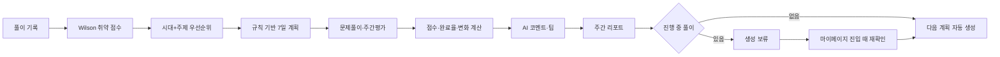
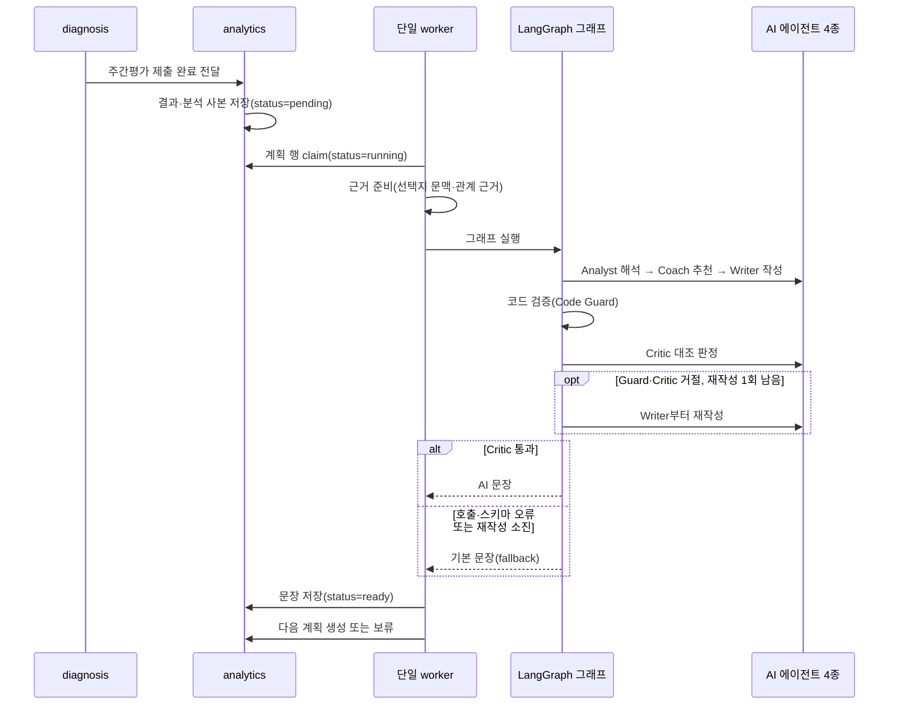

# 학습계획·AI 주간리포트 통합설계

- 상태: DRAFT — 승인 전
- 작성일: 2026-07-20
- 담당 범위: 분석 앱(`analytics`), 마이페이지, 취약점 상세분석 화면
- 구현 상세: [학습계획·AI 주간리포트 구현 상세 부록](./학습계획_AI주간리포트_구현상세부록.md)

이 문서는 현재 구현할 설계만 설명한다. 레거시 문서의 복잡한 정규화 테이블·작업 테이블·블록 편집 기능은 채택하지 않는다.

---

## 1. 한눈에 보는 흐름



핵심 원칙은 다음과 같다.

1. 취약점·점수·계획은 정해진 코드가 계산한다.
2. AI는 계산 결과를 바꾸지 않고 코멘트와 팁만 작성한다.
3. 기존 계획 번호·블록 번호·풀이 기록 연결값은 바꾸지 않는다.
4. 계획 편집 기능이 없으므로 별도 변경 번호 없이 행 잠금으로 동시성을 처리한다.

---

## 2. 학습계획

### 2.1 기간과 첫 주

- 계획은 최대 7일이다.
- 보통 1~6일차는 학습, 7일차는 주간평가다.
- 시험이 7일 안에 있으면 시험 전날까지만 만들고 주간평가는 만들지 않는다.
- 진행 중인 계획은 사용자당 한 개다.
- 시험일·학습시간 변경은 기존 계획을 자동 수정하지 않고 다음 재생성부터 반영한다.

풀이 기록이 부족한 첫 주는 개인 취약점을 단정하지 않고 진단형으로 구성한다.

| 일차 | 범위 |
|---|---|
| 1~2일차 | 설정에서 정한 우선 시대 |
| 3일차 | 주제 |
| 4일차 | 유형 후보 6종 중 하루 블록 수만큼 서로 다른 유형 |
| 5일차 | 설정에서 정한 우선 시대+주제 |
| 6일차 | 필터 없는 혼합 |
| 7일차 | 주간평가 |

정확한 일차별 비율과 문항 수는 문제은행 분포 조사 후 버전 설정으로 확정한다. 첫 주에는 후보가 적은 시대+주제+유형 3중 필터를 사용하지 않는다. 현재 question은 블록당 유형 하나만 받을 수 있으므로 4일차에 6종 전체를 강제하지 않고, 유형 후보 6종을 설정 순서로 순환하며 그날의 블록마다 서로 다른 유형 하나를 배정한다.

### 2.2 취약점과 계획 대상

취약점 상세분석 화면은 시대·주제·유형과 그 조합을 보여줄 수 있다. 그러나 계획 계산은 복잡도를 줄이기 위해 다음 두 단계만 사용한다.

1. 기본 계획 대상: 시대+주제
2. 문항이 부족할 때 대체 대상: 시대

문제 유형은 첫 주 유형 확인과 리포트 풀이시간 요약에 사용한다. 3중 조합은 취약점 상세 화면에서만 제공한다. 둘 다 개인화 계획의 우선순위 후보로 사용하지 않는다.

취약점 분석 자체는 단순화하지 않는다. 화면별 원시 오답률과 현재 취약 판정의 분리, 분석 결과 계약, 영역 식별자, 표시 규칙과 캘리브레이션은 [상세 부록의 취약점 분석](./학습계획_AI주간리포트_구현상세부록.md#1-취약점-분석과-계획-계산)을 따른다.

취약 점수는 최근성과 표본 수를 반영한 Wilson 보정 오답률이다.

- 최근 90일의 완료 답안만 사용한다.
- 기록 가중치는 14일마다 절반으로 줄인다.
- 신뢰 계수는 `1.28`, 최소 유효 표본은 `3.0`이다.
- 취약 점수 `0.50` 이상은 취약, `0.20` 이하는 안정, 그 사이는 중립이다.
- 표본이 부족하면 후보 신호로만 표시한다.
- 최근 14일과 직전 14일 차이 `±0.10`으로 개선·악화 추세를 표시한다.
- 추세는 화면 배지와 동률 정렬에만 사용하며 우선순위 점수에 가감하지 않는다.

### 2.3 우선순위

```text
학습 우선순위
= 취약 점수 × 기간별 취약 가중치
  + 시험 중요도 × 기간별 출제 가중치
  + 반복 오답 신호 × 0.15
```

| 시험까지 남은 기간 | 취약 가중치 | 출제 가중치 | 반복 오답 가중치 |
|---|---:|---:|---:|
| 7일 이하 | 0.40 | 0.45 | 0.15 |
| 8~21일 | 0.45 | 0.40 | 0.15 |
| 22일 이상 | 0.55 | 0.30 | 0.15 |

- 시험 중요도는 같은 계획 후보 안에서 문제은행 문항 비중을 `0~1`로 정규화한 임시 값이다. 실제 출제 확률이나 AI 예측이 아니다.
- 반복 오답 신호는 최근 5개 완료 세션 중 해당 영역에서 오답이 나온 세션 비율이다. 유효 세션이 3개 미만이면 `0`이다.
- 시험일까지 남은 일수는 점수에 직접 더하지 않고 위 가중치 표를 선택하는 데만 사용한다.
- 동률이면 악화 → 유지 → 개선, 근거 문항 수, 영역 식별자 순으로 정한다.

### 2.4 블록 구성과 후보 부족

- 블록 하나는 “이 범위 문제를 정해진 수만큼 푼다”는 단위다.
- 하루 학습시간은 최대 300분까지만 반영한다.
- 블록 하나는 최대 30분이다.
- 하루 블록 수는 `ceil(적용 학습시간 ÷ 30분)`을 1~10개로 제한한다. 60분은 2개다.
- 30분 배수가 아닌 시간은 앞 블록부터 30분씩 배정하고 마지막 블록에 나머지 시간을 배정한다. 예: 45분은 30분+15분이다.
- 문제 수는 각 블록 시간과 사용자의 평균 풀이시간으로 계산한다.
- 독립 복습 블록은 만들지 않는다. 복습은 오답노트의 오늘의 복습에서 담당한다.
- 삭제·이동·교체·추가 학습 기능은 제공하지 않는다.

문항이 부족하면 계획 전체를 바로 실패시키지 않는다.

1. 다음 시대+주제 우선순위 후보로 해당 블록만 바꾼다.
2. 그래도 부족하면 같은 시대 범위로 완화한다.
3. 실제 대체 범위와 이유를 블록 설명에 기록한다.
4. 일부 블록이 부족하면 만들 수 있는 블록으로 계획을 저장한다.
5. 일반 학습 블록을 하나도 만들 수 없을 때만 기존 활성 계획을 유지하고 생성 실패로 처리한다.

### 2.5 완료율과 이월

- 모든 문제를 제출하면 블록이 완료된다. 별도 완료 버튼은 없다.
- 완료율은 완료한 일반 학습 블록 수 ÷ 전체 일반 학습 블록 수다.
- 진행 중 답안 수를 부분 진행률로 표시하지 않는다.
- 이월 한도 때문에 취소된 일반 블록은 완료율 분모에 남는다.
- 주간평가와 레거시 추가 학습 블록은 완료율에서 제외한다.
- 완료율은 `0~1`로 저장하고 화면에서 백분율로 표시한다. 예: `0.833` → `83.3%`.

마이페이지 조회는 읽기 전용이다. 조회 뒤 화면이 동기화 요청을 한 번 호출한다.

- 과거 미완료 일반 블록은 우선순위가 높은 것부터 오늘 남은 용량 안에 옮긴다.
- 동률이면 최초 계획일, 블록 번호 순으로 정한다.
- 이월 횟수 0회는 1회, 1회는 2회로 옮긴다.
- 이미 2회인 블록은 세 번째로 옮기지 않고 취소한 뒤 다음 계획에서 다시 평가한다.
- 주간평가는 이월하지 않고 날짜가 지나면 놓침으로 처리한다.
- 같은 동기화가 반복되어도 이미 오늘로 옮긴 블록은 다시 대상이 되지 않는다.
- 밀린 일반 학습이 3일치 이상이면 재생성을 권장한다.

### 2.6 이어풀기와 재생성

- 풀이 유형별 진행 세션은 최대 한 개만 유지한다.
- 계획을 다시 만들어 원본 계획이 보관되어도 기존 세션은 이어풀 수 있다.
- 보관 계획 세션을 제출하면 원본 보관 계획 블록만 완료되고 새 계획 완료율에는 반영되지 않는다.
- 새 세션은 서울 기준 오늘 예정된 활성 계획 블록에서만 시작한다.
- 진행 중 세션이 있어도 사용자가 계획을 다시 만들 수 있다. 기존 세션이 새 계획에 반영되지 않는다는 안내를 표시한다.

---

## 3. AI 주간리포트

### 3.1 내용

코드가 계산하고 고정하는 내용:

- 이번 주 점수와 이전 평가 대비 변화
- 계획 완료율과 완료 블록 수
- 좋아진 영역과 아직 약한 영역
- 반복 오답과 유형별 풀이시간 요약
- 정답·선택 관계가 하나로 확정된 반복 혼동 근거(최대 3개, 관계 resolver 연결 후)
- 다음 계획 대상

AI가 작성하는 내용:

- 학생용 주간 코멘트
- 다음 주 학습 팁

이전 완료 주간평가가 없으면 최신 일반 진단평가와 비교한다. 둘 다 없으면 비교 기준 부족으로 표시한다. 목표 점수와 합격 기준 점수는 원천 정책이 확정되기 전까지 표시하지 않는다.

### 3.2 생성 과정



- 정상 경로는 Evidence Analyst → Study Coach → Report Writer → 코드 검증(Code Guard) → Report Critic이며 LLM 호출은 4회다.
- Analyst·Coach의 중간 출력도 코드가 근거 번호·근거별 숫자·금지 표현 기준으로 검증한다.
- Code Guard 위반 또는 Critic 거절이면 수정 피드백과 함께 Writer부터 재작성한다. 재작성은 최대 1회이며 리포트 한 건의 LLM 호출은 최대 6회다.
- 에이전트 호출·구조화 출력 오류 또는 재작성 소진 시 즉시 규칙 기반 기본 문장으로 전환한다.
- 점수·취약점·다음 계획 대상은 AI가 만들거나 수정하지 못한다.

### 3.3 저장과 상태

- 계획당 리포트는 하나다.
- 별도 리포트·작업 테이블을 만들지 않고 계획 행의 주간 리포트 JSON(`weekly_report_data`) 하나에 저장한다.
- JSON에는 계산 결과(`result`), 최종 문장(`content`), 작업 상태(`worker`), 다음 계획 상태(`nextPlan`)만 저장한다.
- 화면 DTO는 조회할 때 버전별 출력기가 조립한다. 화면 문구 전체(`renderedReport`)는 중복 저장하지 않는다.
- 리포트 상태는 대기(`pending`), 실행 중(`running`), 준비 완료(`ready`), 실패(`failed`) 네 개다.
- 자동 재시도는 별도 상태를 만들지 않고 실행 가능 시각을 바꾼 뒤 다시 `pending`으로 둔다.
- AI 실패는 `failed`가 아니라 기본 문장으로 `ready`가 된다. 원천 데이터 오류나 처리 한도 소진만 `failed`다.
- 화면은 별도 상태 주소를 만들지 않고 기존 마이페이지 주소의 JSON 응답(`?format=json`)을 반복해 상태를 확인한다.

### 3.4 다음 계획

- 리포트가 준비되면 같은 작업에서 다음 계획을 자동 생성한다.
- 진행 중 풀이가 있으면 보류한다.
- 별도 다음 계획 생성 버튼은 만들지 않는다.
- 풀이가 끝난 뒤 마이페이지에 들어오면 동기화 요청이 다시 확인해 계획을 생성한다.
- 원본 계획 보관과 새 계획 활성화는 한 트랜잭션에서 처리한다.

---

## 4. 데이터와 API

### 4.1 저장 위치

| 데이터 | 저장 위치 |
|---|---|
| 계획 기간·블록·이월 횟수·우선순위 | 계획 항목 JSON(`study_plan_items`) |
| 계획 설정 버전·생성 이유·원본 계획 번호 | 계획 요약 열의 버전 JSON(`study_plans`) |
| 리포트 결과·문장·작업 상태 | 주간 리포트 JSON(`weekly_report_data`) |
| 풀이 완료·정답·시간 | 풀이 세션·기록 |

계획 편집 API가 없으므로 변경 번호(`revision`)와 기대 변경 번호(`expectedRevision`), 마지막 동기화 날짜(`lastSyncedDate`)는 저장하지 않는다.

### 4.2 analytics API

```text
GET  /analytics/mypage/
GET  /analytics/mypage/?format=json
POST /analytics/study-plan/create/       { reason, sourceStudyPlanId? }
POST /analytics/study-plan/sync/         { studyPlanId }
POST /analytics/study-plan/report/retry/ { studyPlanId }
```

- 생성은 사용자 행을 잠근 뒤 현재 활성 계획과 원본 계획 번호를 다시 확인한다.
- 동기화는 사용자·계획 행 잠금 안에서 처리한다. 이미 처리된 상태는 자연스럽게 변경 대상에서 제외된다.
- 리포트 재시도는 `failed` 상태만 `pending`으로 되돌린다.
- 삭제·완료·이동·교체·추가 학습 API는 제공하지 않는다.

### 4.3 상태

| 대상 | 상태 |
|---|---|
| 계획 | 활성, 보관, 레거시 삭제 |
| 블록 | 예정, 진행 중, 완료, 놓침, 취소 |
| 리포트 | 대기, 실행 중, 준비 완료, 실패 |
| 다음 계획 | 대기, 보류, 성공, 실패 |

---

## 5. 동시성과 담당 범위

- 계획 생성·재생성·동기화는 사용자 행 → 계획 행 순으로 잠근다.
- 문제 제출 중 블록 완료는 전달받은 계획 번호의 계획 행만 잠근다. question·diagnosis가 이미 세션을 잠근 상태에서 사용자 행을 다시 잠그지 않아 교착을 피한다.
- 활성 계획 한 개는 기존 부분 고유 인덱스로 최종 보장한다.
- 단일 리포트 worker만 운영하며 PostgreSQL 자문 잠금으로 중복 실행을 막는다.
- 리포트가 준비된 직후 worker가 종료되어도 `ready + 다음 계획 pending` 상태를 다시 찾아 AI를 재호출하지 않고 다음 계획 단계만 복구한다.

| 담당 | 필요한 변경 |
|---|---|
| analytics | 취약 분석, 계획 생성·동기화, 시작 검증 함수, 완료 반영, 리포트 worker, 마이페이지 화면 |
| question | 시작 잠금, analytics 시작 검증 호출, 보관 계획 세션의 완료 전달, 서울 기준 학습일 |
| diagnosis | 조회 중 삭제 제거, 평가 유형별 안전한 교체, 시작·제출 세션 잠금, 전체 답안 집합 검증, 시작 검증 호출, 보관 계획 완료 전달, 서울 기준 학습일 |
| DB | nullable JSONB 열 하나와 최상위 객체 제약 |

상세 요청서:

- [question·diagnosis 연동 협조 요청서](./question_diagnosis_연동_협조_요청서.md)
- [DB 주간리포트 JSONB 열 추가 요청서](./DB_주간리포트_JSONB_컬럼_추가_요청서.md)

analytics 개발은 먼저 할 수 있지만, question·diagnosis 연동 E2E와 운영 활성화는 협조 적용 뒤 진행한다.

---

## 6. 구현 순서

### 1단계 — 조사·DB

- 문제은행 분포와 첫 주 설정값 확정
- 주간 리포트 JSONB 열·제약·Django 모델 반영
- 적용 전 계획 테이블 백업

### 2단계 — 계획

- Wilson 분석과 시대+주제 우선순위 계산
- 첫 주·개인화 계획 계산기
- 읽기 전용 마이페이지, 완료율, 동기화, 재생성

### 3단계 — question·diagnosis 연동

- 오늘 블록 시작 검증
- 이어풀기와 보관 계획 완료
- 주간평가 제출 시 리포트 `pending` 등록

### 4단계 — 리포트

- 계산 결과 고정, 단일 worker, 정지 작업 복구
- Analyst·Coach·Writer·Critic 그래프 연결, 코드 검증, 재작성 최대 1회, 기본 문장
- 다음 계획 자동 생성·보류·재확인

### 5단계 — 화면·전환

- 리포트 카드·상태 조회·안내 문구
- 레거시 활성 계획 E2E
- 미사용 analytics 주소 정리
- 관찰 기간 후 별도 승인 전까지 기존 데이터 유지

---

## 7. 완료 기준

- 같은 입력과 설정이면 같은 계획 초안이 나온다.
- 동시 생성에도 사용자당 활성 계획은 한 개다.
- 조회만으로 계획·세션·답안이 바뀌지 않는다.
- 동기화를 반복해도 이월 횟수와 블록 날짜가 중복 변경되지 않는다.
- 0→1회, 1→2회 이월을 허용하고 이미 2회면 취소한다.
- 예정일이 아니거나 종료된 블록은 새로 시작할 수 없다.
- 전체 제출 뒤 블록 완료 효과는 한 번만 발생한다.
- 보관 계획의 이어풀기 제출은 원본 계획에만 반영된다.
- 주간평가 중복 제출에도 리포트는 하나다.
- AI 호출·검증 실패에도 기본 문장 리포트가 준비 완료된다.
- 다음 계획은 중복 생성되지 않는다.
- 전환 당시 활성인 레거시 계획도 주간평가 → 리포트 → 다음 계획 흐름이 동작한다.
- DB 변경 전후 기존 계획 번호·블록 번호·풀이 연결값 변화가 없다.

전체 계산식·JSON·오류·테스트는 [구현 상세 부록](./학습계획_AI주간리포트_구현상세부록.md)을 기준으로 한다.

---

## 8. 미결정 항목

| 항목 | 결정 방법 | 담당 |
|---|---|---|
| 첫 주 일차별 비율·문항 수 | 문제은행 분포 조사 뒤 버전 설정 확정 | analytics·기획 |
| 일반 학습의 최근 문제 제외 | 출제 정책 결정 | question |
| 주간평가 고정 출제 비율 | 평가 기준 확정 | diagnosis |
| 합격 기준 점수 표시 | 시험 급수 기준 확정 뒤 추가 | 기획·diagnosis |
| 별도 리포트 페이지 | 마이페이지 카드 운영 뒤 결정 | analytics |

미결정값은 코드에 임의로 하드코딩하지 않는다.
