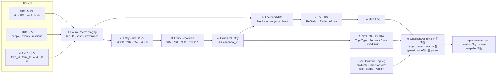

# 04. Raw 3종에서 문제 생성 Graph까지의 ETL

> 상태: `TARGET-ETL`
> 기준일: 2026-07-16
> 구현 상태: 설계만 갱신. 현재 전처리 코드는 변경하지 않음.

## 1. 실제 입력과 처리 위치

```text
원천: etl/raw_data
처리 코드: etl/preprocessing/neo4j
Neo4j import 산출물: storage/neo4j/neo4j_import
```

`preprocessing/raw_data`는 존재하지 않는다. 문제 생성 Graph는 다음 3개 데이터군만
기본 원천으로 사용한다.

1. 한국민족문화대백과사전 JSONL
2. 한국고전종합DB 인물·사건·관계 CSV
3. 한국역사용어시소러스 CSV

## 2. 전체 ETL



raw 행을 바로 production 노드로 적재하지 않는다. 각 단계는 원본 ID와 변환 정책
버전을 보존하고, 승인되지 않은 후보는 production 조회에서 제외한다. 한 배포에 쓰는
모든 revision과 관계는 같은 `graph_snapshot_id`에 고정한다.

## 3. 원천별 추출 계약

### 3.1 한국민족문화대백과사전

주요 키는 `eid`다.

| 원천 값 | ETL 산출물 |
|---|---|
| `eid`, `headword` | AKS `SourceRecord`, canonical 후보 |
| `articleAliases`, `origin` | provenance가 있는 `EntityName` 후보 |
| `primaryType`, `field`, `era` | TopicType·분류·시대 후보 |
| `articleAttributes` | Predicate 매핑 전 `FactCandidate` |
| `body`, `definition`, `reference` | RAG 문서·EvidenceSpan 후보 |

`relatedArticles`는 의미가 없는 관련 문서 링크다. `FOUNDED`, `LED`, `CAUSED` 같은
역사 Fact로 직접 변환하지 않는다.

### 3.2 한국고전종합DB 관계망

다음 파일을 모두 입력으로 사용해야 한다.

```text
itkc_people.csv
itkc_events.csv
itkc_person_relations.csv
itkc_event_relations.csv
```

`itkc_people.csv`의 인물 마스터는 자·호·생몰년·본관과 관계가 없는 인물까지 제공한다.
현재 `normalize_raw_data.py`는 이 파일을 직접 입력으로 사용하지 않고, 현재 Person 조립도
관계 endpoint에 의존한다. 목표 ETL에서는 반드시 다음 경로를 추가한다.

```text
itkc_people.csv
  -> ITKCPerson SourceRecord
  -> Person CanonicalEntity 후보
  -> AKS·시소러스 레코드와 entity resolution
```

인물 관계 16종은 방향과 역관계 사전이 승인된 경우 가족·사제·교유 FactCandidate로
변환할 수 있다. 사건-인물 관계의 원천 관계명은 전부 `사건인물`이므로 실제 역할을
알 수 없다.

```text
ASSOCIATED_WITH_EVENT
status=needs_role_enrichment
answer_eligible=false
```

AKS 본문 등에서 참여·지휘·명령 역할과 근거를 확인한 뒤에만 구체 Predicate로 승격한다.

사건군·조직군·개별 구성원의 관계가 검증되면 `EntityGroup` membership 또는 직접
`PART_OF`·`INSTANCE_OF` 후보로 승격할 수 있다. 이는 일반 donor 자격 확장용 edge가
아니다. 정확한 parent 2홉으로 donor 자격을 얻은 뒤 동일 역사 복합체를 제외하거나,
membership 자체를 묻는 별도 Facet에 사용한다.

### 3.3 한국역사용어시소러스

`term_id`가 원천 고유 키다.

```text
term_lk = 복수 경로를 >>로 분리
각 경로 = >로 계층 분리
```

`topterm_id`를 직접 부모 ID로 사용하지 않는다. `term_lk`는 원천 분류이며, donor 검색용
`조선 국왕`, `조선 후기 국왕` 같은 `SemanticClass`가 아니다. 별도 매핑 정책과 검토를
거쳐야 한다.

`term_name`만 같다는 이유로 AKS·ITKC와 병합하지 않는다. 동명이인은 한자, 시대,
유형, 설명, 관계 이웃으로 분리한다. `term_desc`는 RAG 보조 문서가 될 수 있지만 상세
역사 Fact의 단독 승인 근거로 사용하지 않는다.

## 4. SourceRecord, EntityName과 CanonicalEntity

Neo4j의 SourceRecord는 원시 행 하나가 아니라 파일 역할별 dedup 논리 레코드다. 원시
중복 행과 행별 hash는 staging manifest에 보존한다. 합성 키는 파일 역할, 논리 ID,
source version을 모두 포함한다.

```text
AKS_LIST:E0050867:<source_version>
AKS_DETAIL:E0050867:<source_version>
ITKC_PERSON:<person_id>:<source_version>
ITKC_EVENT:<event_id>:<source_version>
ITKC_PERSON_REL:<hash(from_id, raw_type, to_id)>:<source_version>
ITKC_EVENT_REL:<hash(event_id, person_id)>:<source_version>
THESAURUS:<term_id>:<source_version>
```

```text
(SourceRecord)-[:HAS_NAME]->(EntityName)
(EntityName)-[:REFERS_TO {match_status, method, resolution_version, graph_snapshot_id}]
            ->(CanonicalEntity)
(SourceRecord)-[:RESOLVES_TO {match_status, method, resolution_version, graph_snapshot_id}]
              ->(CanonicalEntity)
```

list와 detail이 같은 AKS EID를 가져도 서로 다른 SourceRecord로 구분한 뒤 같은
CanonicalEntity로 해소할 수 있다. 동일 ITKC ID의 중복 행은 논리 레코드 하나로 합치고
`raw_row_count`와 aggregate record hash를 남긴다. 엔터티를 설명하는 SourceRecord만
`RESOLVES_TO`를 사용하고, 관계 SourceRecord는 verified Fact의 `DERIVED_FROM` provenance로
연결한다.

`SourceRecord.record_status`는 레코드 자체의 파싱·사용 가능 상태이고,
`RESOLVES_TO.match_status`와 `REFERS_TO.match_status`는 canonical 매칭 판정이다. 두 값을
같은 `resolution_status`로 중복 저장하지 않는다. `match_status=accepted`인 엔터티
레코드와 이름만 production 검색에 사용한다.

`SourceRecord.aggregate_record_hash`는 dedup한 논리 레코드의 정규화 payload hash다.
개별 raw 행 hash는 staging manifest에 남긴다. 둘을 모두 `record_hash`라고 부르지 않는다.

이름이 같아도 canonical ID는 공유하지 않을 수 있고, 이름이 달라도 별칭·한자·시대·관계
근거가 충분하면 같은 canonical entity로 해소할 수 있다.

```text
EntityName
  entity_name_id
  display_name
  normalized_name
  normalization_version
  name_kind = canonical | alias | birth_name | hanja | ja | ho | former_name | source_variant
  script
  review_status = verified | pending | rejected
  provenance = SourceRecord-[:HAS_NAME]->EntityName
```

하나의 실체에 여러 이름이 연결될 수 있고, 동명이인 때문에 같은 normalized string이
여러 canonical 대상의 해소 후보가 될 수도 있다. 따라서 문자열에 UNIQUE 제약을 두거나
이름 하나만으로 자동 병합하지 않는다.

`normalization_version`은 Unicode 정규화, 공백·구두점, 한자·라틴 표기 처리 규칙의
버전이다. `normalized_name`을 다시 계산할 때 이 버전을 함께 고정하며, 변경되면 영향받은
EntityName occurrence를 새 snapshot에서 다시 materialize한다.

합성 target은 별칭과 다르다. 여러 canonical 대상의 조합 자체를 출제해야 할 때만 안정
synthetic `canonical_id`, `COMPOSED_OF` 구성 관계, construction rule/version, provenance,
review status와 `graph_snapshot_id`를 만들고 승인 후 `QuestionTarget` 라벨을 붙인다.

## 5. TopicType과 SemanticClass 생성

원천 분류를 그대로 Graph donor 분류로 복사하지 않는다.

```text
raw type/category
  -> versioned mapping candidate
  -> type compatibility 검사
  -> reviewer 또는 승인 규칙
  -> TopicType / SemanticClass
```

- `TopicType`은 target의 기술적 종류다.
- `SemanticClass parent`는 2홉 donor 자격을 정한다.
- `SemanticClass subgroup`은 후보 근접도와 난이도에 사용한다.
- parent와 subgroup은 서로 다른 노드이며 subgroup만 parent에 `SUBCLASS_OF`로 연결한다.
- 후보 검색을 2홉으로 고정하기 위해 target은 승인 parent에도 직접 `CLASSIFIED_AS`된다.
- `Era`, `정치`, `문화`처럼 너무 넓은 원천 분류는 `donor_eligible=false`다.
- `CLASSIFIED_AS`는 일반 분류 provenance만 소유하며 “primary donor parent”를
  표시하지 않는다. `GENERIC_DONOR` 출제의 donor parent 단일 진실원은
  `QuestionUse-[:USES_PARENT_CLASS]`이고 다른 route에는 이 관계가 없다.

`HAS_TOPIC_TYPE`에는 `graph_snapshot_id`, `is_primary`, `review_status`,
`mapping_revision_id`를 적재한다. production target의 primary 관계는 정확히 하나이고
`review_status=verified`여야 한다.

## 6. FactCandidate에서 verified Fact까지

FactCandidate는 다음 튜플을 가져야 한다.

```text
candidate_id
subject_canonical_id
predicate_id
object_canonical_id 또는 typed value
normalized qualifiers
source_record_key
evidence_span_candidate
extractor_or_rule_version
```

승격 조건은 다음과 같다.

1. subject와 entity object는 canonical ID로 해소됐다. literal object는 허용 타입으로
   정규화되고 값 검증을 통과했다.
2. Predicate의 허용 subject/object TopicType을 만족한다.
3. 원문 span이 관계의 두 endpoint와 Predicate 의미를 지지한다.
4. 중복·방향·역관계가 정규화됐다.
5. 충돌 Fact가 검토됐다.
6. `Fact.status=verified`, `SUPPORTED_BY.review_status=verified`, verified EvidenceSpan을
   함께 적재한다.
7. `canonical_hash`가 같은 snapshot 안에서 중복되지 않는다.

`historical_era_ids`와 `historical_polity_ids`는 난이도용 역사 qualifier다. 각각
TopicType이 `period`, `polity`인 canonical ID만 허용하며 취약점 분석의
`curriculum_era_id`와 섞지 않는다.

관계가 raw에 존재한다는 사실과 역사 Fact가 검증됐다는 사실은 다르다.

## 7. QuestionUse revision과 분류 binding 컴파일

`QuestionUse`는 raw에서 직접 추출하지 않는다. verified Fact와 버전 있는 Facet 규칙을
결합해 생성하는 출제 projection이다.

```text
verified Fact
  + target endpoint
  + QuestionFacet revision의 허용 Predicate signature
  + answer_shape / answer_role
  + answer domain
  + GENERIC_DONOR route일 때만 donor parent SemanticClass
  + evidence coverage
  -> QuestionUse candidate
  -> 검토
  -> active + verified QuestionUse revision
```

예를 들어 `FOUNDED(Person, Organization)` Fact는 target endpoint에 따라 둘 이상의
QuestionUse가 될 수 있다. 전역 Predicate-Facet 매핑만으로 자동 승인하지 않는다.

Facet revision은 최소한 다음을 고정한다.

```text
target_topic_type_revision_id
allowed_predicate_signatures
target_role
answer_role
answer_shape
answer_domain_id
allowed_mismatch_rule_ids
surface_template_ids
status = active | inactive | retired
```

컴파일러는 `answer_route=GENERIC_DONOR`일 때만 직접 분류된 donor parent 하나를 선택해
`USES_PARENT_CLASS`를 만든다. `RELATIONAL_GROUP_MEMBERSHIP`에는 parent를 만들지 않으며
dummy parent로 cardinality를 맞추지 않는다.

`ENTITY`는 `subject|object`, `FACT_STATEMENT`는 `whole_fact`, 시간 shape는 `time`과만
호환된다. entity answer endpoint는 answer domain과도 일치해야 한다.

취약점 분석 분류는 Neo4j v1에 전체 taxonomy를 복제하지 않는다. 대신 정책 레지스트리에
`QuestionClassificationBinding(question_use_revision_id, taxonomy_version, primary,
secondary, detail topic/era IDs)`를 별도로 컴파일한다. Orchestrator는 생성 요청의 filter와
생성 문항 저장에 같은 binding revision을 쓴다. primary/secondary와 상위/세부 계층은
서로 다른 의미다.

## 8. production 적재 경계

| 산출물 | production Neo4j |
|---|---:|
| raw row, parsing error, unresolved match | 적재하지 않음 또는 별도 staging DB |
| accepted SourceRecord provenance | 적재 |
| accepted EntityName와 canonical 연결 | 적재 |
| accepted CanonicalEntity | 적재 |
| 승인 TopicType·SemanticClass | 적재 |
| 승인 EntityGroup membership·직접 포함 관계 | 적재 |
| FactCandidate | 적재하지 않음 |
| verified Fact·EvidenceSpan reference | 적재 |
| active·verified QuestionUse | 적재 |
| GraphSnapshot과 immutable revision metadata | 적재 |
| RAG 본문·임베딩 | 적재하지 않음 |
| 문제 유형·난이도·프롬프트 | 적재하지 않음 |
| 교육과정 taxonomy 전체와 사용자 취약점 통계 | 적재하지 않음 |

## 9. 재실행과 버전

다음 버전이 바뀌면 영향받은 산출물을 다시 계산한다.

```text
source file hash
entity_resolution_policy_version
semantic_class_mapping_version
predicate_catalog_version
fact_extractor_version
evidence_corpus_version
facet_contract_version
question_use_compiler_version
classification_binding_version
mismatch_rule_registry_version
```

기존 ID를 실행 순서로 만들지 않는다. 원천 합성 키와 정규화된 endpoint·Predicate·역할
튜플을 이용해 안정적으로 생성한다. 논리 ID는 버전 간 의미를 추적하고,
`topic_type_revision_id`, `semantic_class_revision_id`, `predicate_revision_id`,
`facet_revision_id`, `question_use_revision_id`는 한 snapshot의 immutable payload를
식별한다. 서로 다른 snapshot의 revision을 한 edge로 연결하면 배포를 실패시킨다.
