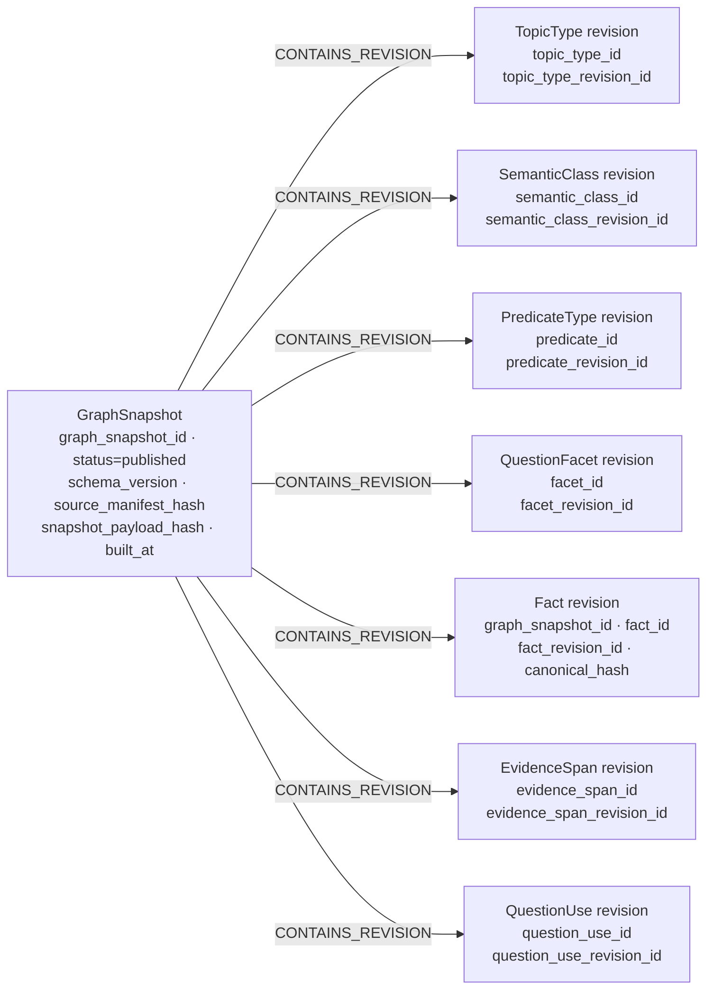
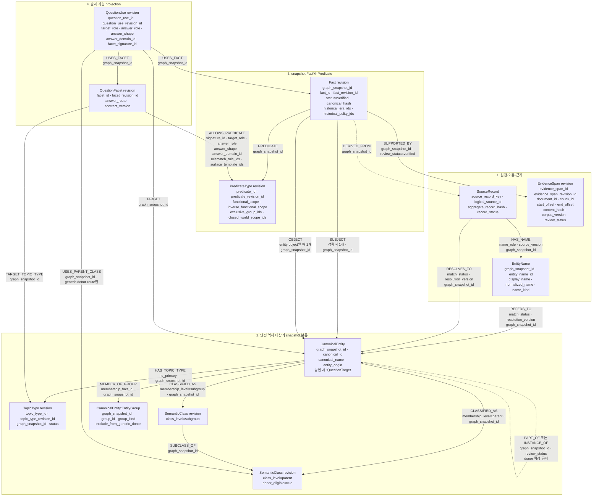
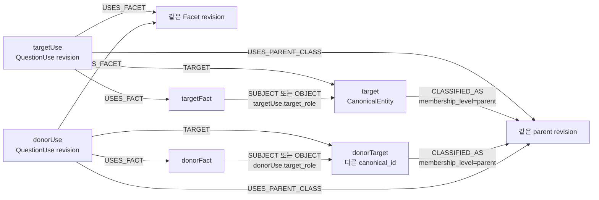

# 05. 문제 생성용 Neo4j 상세 스키마

> 스키마 버전: `QG-GRAPH-V1-DRAFT`
> 기준일: 2026-07-16
> 구현 상태: 목표 스키마. 현재 import CSV와 라이브 DB에는 미적용.

## 1. 설계 결론

Neo4j v1에는 다음 네 영역을 저장한다.

1. 원천 레코드·이름·canonical 역사 대상의 추적
2. 정확한 2홉 donor 조회를 위한 TopicType·SemanticClass revision
3. 검증된 원자 Fact·Predicate revision·RAG 근거 참조
4. target-Facet-Fact를 묶고 `GENERIC_DONOR` route에서만 parent를 추가하는
   출제 projection인 QuestionUse revision

문제 패턴, 문제 유형 랜덤 가중치, 난이도 점수식, 프롬프트, 생성 문항, 채점 결과는
Neo4j에 저장하지 않는다. `PathPattern`, `PathInstance`, `OptionCategory`,
`QuestionContext`도 v1 필수 노드가 아니다.

`QuestionTarget`과 `EntityGroup`은 독립된 원천 복제본이 아니다. 승인된
`CanonicalEntity`에 붙는 역할 라벨이다. `Candidate`라는 노드는 만들지 않는다. 오답
재료를 제공하는 다른 대상과 projection은 쿼리 안에서 각각 `donorTarget`,
`donorUse`, `donorFact` 변수로 부른다.

## 2. GraphSnapshot과 immutable revision

문제 생성 호출은 항상 하나의 `graph_snapshot_id`를 먼저 고정한다. 논리 ID와 revision
ID의 의미는 다르다.

| 대상 | 안정 논리 ID | snapshot 안의 불변 revision ID |
|---|---|---|
| TopicType | `topic_type_id` | `topic_type_revision_id` |
| SemanticClass | `semantic_class_id` | `semantic_class_revision_id` |
| PredicateType | `predicate_id` | `predicate_revision_id` |
| QuestionFacet | `facet_id` | `facet_revision_id` |
| QuestionUse | `question_use_id` | `question_use_revision_id` |
| Fact | `fact_id` | `fact_revision_id` |
| EvidenceSpan | `evidence_span_id` | `evidence_span_revision_id` |

논리 ID는 같은 개념의 이력을 묶는 검색 키다. 같은 논리 ID의 여러 revision이 존재할 수
있으므로 논리 ID에는 일반 index를 두고, revision ID만 전역 UNIQUE로 둔다.

`Fact`와 `EvidenceSpan`도 snapshot마다 별도 revision으로 materialize한다. 외부 DTO는
opaque revision ID를 전달하고, QA는 `graph_snapshot_id + logical ID`의 유일성도 함께
확인한다. 동일 snapshot 안에서는 Fact의 `canonical_hash`도 유일해야 한다.



published snapshot의 revision 내용과 관계는 수정하지 않는다. 계약·분류·Fact가 바뀌면 새
snapshot과 새 revision을 만든다. 다음 규칙은 필수다.

1. 모든 revision 노드는 `graph_snapshot_id`를 가진다.
2. revision 간 관계에는 같은 `graph_snapshot_id`를 기록한다.
3. 관계 양 끝의 revision은 같은 GraphSnapshot에 속해야 한다.
4. 서로 다른 snapshot의 revision을 연결하는 edge는 금지한다.
5. 생성 문항은 `graph_snapshot_id`와 사용한 revision ID를 함께 저장한다.
6. runtime 배포 설정이 새 문제 생성에 사용할 published snapshot 하나를 선택한다.
7. CanonicalEntity, EntityName과 EntityGroup 역할·상태도 snapshot-scoped copy이며 published
   snapshot 안에서는 수정하지 않는다.

## 3. 전체 저장 스키마



subject와 entity object는 같은 `CanonicalEntity` 라벨을 사용한다. 숫자·짧은 문자열처럼
그래프 탐색이 필요 없는 object는 `Fact.object_value`와 `Fact.object_value_type`으로
저장하며 entity `OBJECT` 관계와 동시에 사용하지 않는다.

## 4. 원천·이름·canonical target 계약

### 4.1 `SourceRecord`

raw 3종을 dedup한 논리 레코드의 provenance다. 원시 중복 행과 행별 hash는 staging
manifest에 보존한다.

| 속성 | 의미 |
|---|---|
| `source_record_key` | `source_type:logical_source_id:source_version` 합성 키 |
| `source_type` | `aks_list`, `aks_detail`, `itkc_person`, `itkc_event`, `itkc_person_relation`, `itkc_event_relation`, `thesaurus_term` |
| `logical_source_id` | 원천 ID 또는 정규화 endpoint·관계 유형의 안정 hash |
| `display_name` | 원문 대표명 |
| `aggregate_record_hash` | dedup 대상 행을 안정 정렬해 계산한 aggregate hash |
| `raw_row_count` | dedup 전 원시 행 수 |
| `record_status` | accepted, rejected, quarantined |
| `source_version` | 원천 snapshot 버전 |

해소 상태는 SourceRecord 노드가 아니라 `REFERS_TO.match_status`와
`RESOLVES_TO.match_status`가 소유한다. 두 관계와 `HAS_NAME`은
`graph_snapshot_id`를 가지며 snapshot 안에서 불변이다. 관계 assertion SourceRecord는 Fact의
`DERIVED_FROM` provenance로 사용한다.

### 4.2 `EntityName`과 동명이인

canonical name, 별칭, 한자명, 자·호, 이전 명칭을 검색 가능한 이름 노드로 저장한다.

| 속성 | 의미 |
|---|---|
| `graph_snapshot_id` | 이름 해소 상태가 고정된 snapshot |
| `entity_name_id` | snapshot 간 이름 occurrence의 안정 논리 ID |
| `display_name` | 원문 표기 |
| `normalized_name` | NFKC·공백·구두점 정책을 적용한 검색값 |
| `normalization_version` | normalized_name을 만든 정규화 정책 버전 |
| `name_kind` | canonical, alias, birth_name, hanja, ja, ho, former_name, source_variant |
| `script` | hangul, hanja, latin, mixed |
| `review_status` | verified, pending, rejected |

`SourceRecord-[:HAS_NAME]->EntityName-[:REFERS_TO]->CanonicalEntity`가 이름 provenance와
해소 결과를 연결한다. 엔터티를 설명하는 SourceRecord는 같은 판정으로
`RESOLVES_TO`에도 연결해 원천 레코드 단위 crosswalk를 제공한다. 두 관계의 accepted
대상이 다르면 적재를 중단한다. alias는 `QuestionTarget`이 아니며 별도 canonical
target을 만들지 않는다.

같은 `normalized_name`이 여러 CanonicalEntity를 가리킬 수 있다. 이 경우 이름 검색은
복수 target을 반환하고 TopicType·한자·시대·관계 이웃으로 해소한다. 증거가 부족하면
자동 선택하지 않는다.

### 4.3 `CanonicalEntity:QuestionTarget`

`CanonicalEntity`는 여러 원천 레코드가 가리키는 독립 역사 대상이다.
`QuestionTarget`은 출제 승인을 통과한 엔터티에 붙이는 역할 라벨이다.

| 속성 | 의미 |
|---|---|
| `canonical_id` | 이름과 무관한 안정 ID |
| `graph_snapshot_id` | entity·QuestionTarget 상태가 고정된 snapshot |
| `canonical_name` | 표시 대표명 |
| `entity_origin` | source 또는 synthetic |
| `entity_status` | active, merged, disputed, retired |
| `question_target_status` | active, inactive |
| `resolution_version` | entity resolution 정책 버전 |
| `review_status` | verified, pending, rejected |

merged entity는 새 문제 생성에서 제외한다. 기존 ID의 이동 경로는
`MERGED_INTO {resolution_version, graph_snapshot_id}`로 하나만 남긴다.

### 4.4 승인 합성 target

raw에 단일 원천 EID가 없지만 출제상 독립된 대상으로 승인된 경우에만 synthetic
CanonicalEntity를 만든다.

```text
canonical_id =
  SYN:<synthesis_rule_id>:<hash(rule_version, component_role, ordinal, component_canonical_id)>
```

합성 target은 다음 조건을 모두 만족해야 한다.

1. `entity_origin=synthetic`이다.
2. `synthesis_rule_id`, `synthesis_rule_version`, `review_status=verified`를 가진다.
3. 모든 `COMPOSED_OF` 관계에 component role, ordinal, rule version,
   `source_record_keys`, `graph_snapshot_id`가 있다.
4. 구성요소는 accepted CanonicalEntity다.
5. 구성요소나 rule version이 바뀌면 기존 ID를 수정하지 않고 새 synthetic ID를 만든다.
6. 단순 이름 결합이나 LLM 추론만으로 만들지 않는다.

합성 target은 alias나 EntityGroup과 다르다. 합성 target은 자체 Fact와 QuestionUse를 가질
수 있는 출제 대상이고, EntityGroup은 donor 중복 제거 또는 관계형 membership 질문을 위한
검증 그룹이다.

## 5. snapshot 분류 계약

### 5.1 `TopicType` revision

target의 기술적 종류다. 취약점 분석 topic과 다르다.

```text
person, event, polity, policy_system, organization,
period, place, heritage, document, concept
```

active QuestionTarget은 하나의 snapshot 안에서 `is_primary=true`인 TopicType revision을
정확히 하나 가진다. `HAS_TOPIC_TYPE` 관계 속성은 다음으로 고정한다.

```text
graph_snapshot_id
is_primary
review_status
mapping_revision_id
```

production 조회는 `review_status=verified`인 관계만 사용한다.
`HAS_TOPIC_TYPE.graph_snapshot_id`와 TopicType의 `graph_snapshot_id`가 같아야 한다.

### 5.2 `SemanticClass` revision

generic donor pool을 정하는 승인 의미 분류다.

| 속성 | 의미 |
|---|---|
| `semantic_class_id` | 버전 간 안정 논리 ID |
| `semantic_class_revision_id` | snapshot revision 고유 ID |
| `graph_snapshot_id` | 소속 snapshot |
| `name` | 예: 조선 국왕, 조선 후기 국왕 |
| `class_level` | parent 또는 subgroup |
| `donor_eligible` | 정확한 2홉 donor 공유 노드로 사용 가능한지 |
| `scope_kind` | specific 또는 broad |
| `taxonomy_version` | 분류 정책 버전 |
| `status` | active, inactive |

`Era`, `정치`, `문화` 같은 범용 분류는 `donor_eligible=false`다. 시소러스
`term_lk` leaf도 승인 매핑 없이 donor parent가 되지 않는다.

`CLASSIFIED_AS`에는 `is_primary`를 두지 않는다.

```text
membership_level = parent | subgroup
review_status
classification_basis
source_record_keys
mapping_revision_id
graph_snapshot_id
```

target이 여러 parent에 속할 수 있으므로 `answer_route=GENERIC_DONOR`인
`QuestionUse-[:USES_PARENT_CLASS]`가 해당 projection의 donor parent 하나를 선택한다.
이 관계만이 그 route의 출제별 primary donor parent 단일 진실원이다. 선택한 parent는
target이 같은 snapshot에서 직접 `CLASSIFIED_AS`된 `class_level=parent` revision이어야
한다. 다른 route는 이 관계를 만들지 않는다.

### 5.3 `EntityGroup`과 직접 상하위 관계

`EntityGroup`은 승인된 `CanonicalEntity`에 `EntityGroup` 라벨을 추가한 노드다.

| 속성 | 의미 |
|---|---|
| `group_id` | 안정 그룹 ID |
| `group_kind` | event_series, event_family, organization_family, concept_family, equivalence_set |
| `exclude_from_generic_donor` | 같은 그룹 member를 generic donor에서 제외할지 |
| `review_status` | verified, pending, rejected |
| `group_version` | membership 정책 버전 |

`MEMBER_OF_GROUP` 관계에는 `membership_fact_id`, `graph_snapshot_id`,
`review_status`, `group_version`을 둔다. target과 donorTarget이
`exclude_from_generic_donor=true`인 같은 그룹을 직접 공유하면 donor를 사후 제외한다.

CanonicalEntity 사이의 직접 `PART_OF`·`INSTANCE_OF`도 검증된 1홉 관계일 때 사후
제외에만 사용한다. 두 관계에는 `graph_snapshot_id`, `review_status`,
`relation_fact_id`를 기록한다. 이 관계나 EntityGroup을 따라 donor 자격을 확장하지
않는다.

## 6. Fact·Predicate·Evidence 계약

### 6.1 `PredicateType` revision

| 속성 | 의미 |
|---|---|
| `predicate_id` | 안정 논리 ID |
| `predicate_revision_id` | snapshot revision ID |
| `graph_snapshot_id` | 소속 snapshot |
| `predicate_family` | 난이도·표현 호환 상위 관계군 |
| `subject_topic_type_revision_ids` | 허용 subject TopicType revision |
| `object_domain_ids` | 허용 entity TopicType revision 또는 literal domain |
| `inverse_predicate_revision_id` | 선택적 역관계 revision |
| `is_symmetric` | 대칭 관계 여부 |
| `functional_scope` | NONE, SUBJECT, OBJECT, SUBJECT_WITH_QUALIFIERS |
| `inverse_functional_scope` | NONE, SUBJECT, OBJECT, OBJECT_WITH_QUALIFIERS |
| `exclusive_group_ids` | 상호배타 Predicate/role 그룹 |
| `closed_world_scope_ids` | 승인된 폐쇄 목록 scope ID |
| `proof_contract_version` | mismatch proof 메타데이터 버전 |
| `answer_eligible` | 출제 Fact에 사용할 수 있는지 |
| `status` | active, inactive, retired |

이 메타데이터만으로 Graph에 없는 사실을 거짓으로 판단하지 않는다. functional,
exclusive, closed-world 판정은 Facet이 허용한 mismatch rule과 해당 scope의 권위 근거가
모두 있을 때만 사용할 수 있다.

### 6.2 `Fact`

| 속성 | 의미 |
|---|---|
| `graph_snapshot_id` | 소속 GraphSnapshot |
| `fact_id` | snapshot 간 안정 논리 ID |
| `fact_revision_id` | 특정 snapshot의 불변 Fact revision ID |
| `canonical_hash` | predicate logical ID + endpoint + qualifier의 정규화 hash |
| `status` | verified, disputed, retired |
| `object_value`, `object_value_type`, `object_unit` | literal object일 때만 사용. unit은 계약상 필요할 때 필수 |
| `start_year`, `end_year` | 선택적 정규화 시간 범위 |
| `historical_era_ids` | 역사 시기 CanonicalEntity ID 배열 |
| `historical_polity_ids` | 역사 국가·정권 CanonicalEntity ID 배열 |
| `review_version` | Fact 검토 정책 버전 |

`historical_era_ids`는 TopicType revision이 `period`인 CanonicalEntity ID,
`historical_polity_ids`는 TopicType revision이 `polity`인 CanonicalEntity ID만 허용한다.
취약점 분석의 `CurriculumEra` ID를 이 필드에 넣지 않는다.

Fact는 subject 하나, Predicate revision 하나, 정확히 하나의 object binding을 가진다.
object binding은 entity `OBJECT` 하나 또는 `object_value + object_value_type` 한 쌍이며
둘을 동시에 사용하지 않는다.

동일 snapshot에서 `canonical_hash`는 유일하다. `canonical_hash` 충돌인데 payload가
다르면 적재를 중단하고, payload가 같으면 중복 Fact를 하나로 합친다.

### 6.3 `EvidenceSpan`

| 속성 | 의미 |
|---|---|
| `evidence_span_id` | snapshot 간 동일 구간을 추적하는 안정 논리 ID |
| `evidence_span_revision_id` | 특정 snapshot·corpus 검토 상태의 불변 revision ID |
| `graph_snapshot_id` | 소속 GraphSnapshot |
| `document_id`, `chunk_id` | RAG 저장소 ID |
| `start_offset`, `end_offset` | 청크 내부 구간 |
| `content_hash` | 승인 당시 근거 hash |
| `corpus_version`, `chunker_version` | 검색 재현 버전 |
| `source_grade` | 원천 신뢰 등급 |
| `review_status` | verified, stale, rejected |

`SUPPORTED_BY` 관계에는 `graph_snapshot_id`와 `review_status`를 둔다. edge의
`graph_snapshot_id`는 Fact와 같고 `review_status=verified`여야 한다. span만
verified여도 관계의 support scope가 승인되지 않았다면 출제 근거로 사용할 수 없다.

## 7. QuestionFacet 계약

### 7.1 Facet revision

QuestionFacet revision은 “무엇을 묻는가”뿐 아니라 어떤 Fact binding을 어떤 답 형태로
사용할 수 있는지 정의한다.

| 노드 속성 | 의미 |
|---|---|
| `facet_id` | 안정 논리 ID |
| `facet_revision_id` | snapshot revision 고유 ID |
| `graph_snapshot_id` | 소속 GraphSnapshot |
| `answer_route` | GENERIC_DONOR 또는 RELATIONAL_GROUP_MEMBERSHIP |
| `contract_version` | Facet compiler 계약 버전 |
| `status` | active, inactive, retired |

| 항목 | 저장 위치 |
|---|---|
| target TopicType | `TARGET_TOPIC_TYPE` → TopicType revision |
| allowed Predicate signatures | `ALLOWS_PREDICATE` → PredicateType revision |
| target/answer role·shape | `ALLOWS_PREDICATE` 관계 속성 |
| answer domain | `ALLOWS_PREDICATE.answer_domain_id` |
| mismatch rule IDs | `ALLOWS_PREDICATE.mismatch_rule_ids` |
| surface template IDs | `ALLOWS_PREDICATE.surface_template_ids` |
| runtime route | `QuestionFacet.answer_route` |

`ALLOWS_PREDICATE` 관계는 다음 속성을 가진다.

```text
graph_snapshot_id
signature_id
target_role
answer_role
answer_shape
answer_domain_id
mismatch_rule_ids
surface_template_ids
review_status
```

같은 Predicate라도 역할이나 answer shape가 다르면 별도 `signature_id`를 사용한다.
prompt 전문은 Neo4j에 저장하지 않고 surface template의 versioned ID만 저장한다.

`answer_route`는 v1에서 다음 둘 중 하나다.

```text
GENERIC_DONOR
RELATIONAL_GROUP_MEMBERSHIP
```

### 7.2 role-shape 양방향 호환표

active QuestionUse는 아래 표에 있는 조합만 허용한다.

| answer_role | 허용 answer_shape | 필수 binding과 domain |
|---|---|---|
| subject | ENTITY | Fact SUBJECT가 CanonicalEntity이고 `answer_domain_id` TopicType revision과 일치 |
| object | ENTITY | Fact OBJECT가 CanonicalEntity이고 `answer_domain_id` TopicType revision과 일치 |
| whole_fact | FACT_STATEMENT | Fact 전체가 binding, `answer_domain_id=DOMAIN:fact_statement` |
| time | TIME_POINT | 검증된 단일 시점, `answer_domain_id=DOMAIN:time_point` |
| time | TIME_RANGE | 검증된 시작·종료 범위, `answer_domain_id=DOMAIN:time_range` |

역방향도 강제한다. 즉 `answer_shape=ENTITY`이면 answer_role은 subject 또는 object여야
하고, `FACT_STATEMENT`이면 whole_fact, 시간 shape이면 time이어야 한다. literal object는
v1에서 ENTITY 답으로 사용할 수 없으며 whole_fact의 일부로만 표현할 수 있다.

## 8. QuestionUse revision

QuestionUse revision은 다음을 한 번에 묶는 최소 출제 projection이다.

```text
어느 target을
어느 Facet revision과 signature로
어느 snapshot Fact를 사용해
어떤 역할·형태·answer domain으로
GENERIC_DONOR route라면 어느 donor parent에서 출제할 수 있는가
```

| 속성 | 의미 |
|---|---|
| `question_use_id` | 버전 간 안정 논리 ID |
| `question_use_revision_id` | snapshot revision 고유 ID |
| `graph_snapshot_id` | 소속 snapshot |
| `status` | active, inactive, retired |
| `review_status` | verified, pending, rejected, stale |
| `target_role` | subject 또는 object |
| `answer_role` | subject, object, whole_fact, time |
| `answer_shape` | ENTITY, FACT_STATEMENT, TIME_POINT, TIME_RANGE |
| `answer_domain_id` | Facet signature와 같은 domain |
| `facet_signature_id` | 사용한 `ALLOWS_PREDICATE.signature_id` |
| `answer_route` | Facet revision의 route와 같아야 함 |
| `compiler_version` | projection compiler 버전 |
| `contract_version` | Facet 계약 버전 |

revision ID는 최소한 snapshot, target canonical ID, facet revision, signature, fact revision,
target/answer role, answer shape, answer domain, answer route를 포함한 안정 hash로 만든다.
`answer_route=GENERIC_DONOR`일 때만 parent revision을 추가한다. 관계형 membership route는
parent가 없다는 사실을 포함해 hash하며 dummy parent를 만들지 않는다.

### 8.1 active·verified 불변식

1. `TARGET`, `USES_FACET`, `USES_FACT`가 각각 정확히 하나다.
2. `answer_route=GENERIC_DONOR`이면 `USES_PARENT_CLASS`가 정확히 하나다.
3. 모든 revision과 versioned edge의 `graph_snapshot_id`가 같다.
4. target은 active `CanonicalEntity:QuestionTarget`이며 EntityName alias 노드가 아니다.
5. Fact는 verified이고 verified `SUPPORTED_BY` edge와 verified EvidenceSpan이 최소 하나다.
6. Facet revision은 active이고 `TARGET_TOPIC_TYPE`이 target의 primary TopicType revision과 같다.
7. `facet_signature_id`가 실제 `ALLOWS_PREDICATE` signature와 일치한다.
8. signature의 Predicate revision이 Fact의 Predicate revision과 같다.
9. target_role·answer_role·answer_shape·answer_domain이 signature와 모두 같다.
10. `target_role=subject`이면 Fact SUBJECT가 target이다.
11. `target_role=object`이면 Fact OBJECT가 target이다.
12. role-shape 양방향 호환표와 answer domain을 만족한다.
13. generic donor parent는 `donor_eligible=true`인 parent revision이다.
14. generic donor parent는 target이 같은 snapshot에서 직접 분류된 parent다.
15. synthetic target은 승인된 synthesis rule과 verified `COMPOSED_OF` provenance를 가진다.
16. group membership route는 10장의 별도 관계형 계약을 따른다.

## 9. donor 조회의 Graph 의미

donor는 별도 노드 타입이 아니다. 아래 `donorTarget`, `donorUse`, `donorFact`는 기존
노드에 붙인 쿼리 변수명이다.



자격 경로는 정확히 다음 2홉이다.

```text
target -[:CLASSIFIED_AS]-> parentRevision
       <-[:CLASSIFIED_AS]- donorTarget
```

`SUBCLASS_OF*`, `RELATED_TO*`, `MEMBER_OF_GROUP*`, `PART_OF*`,
`INSTANCE_OF*`로 donor를 확장하지 않는다. subgroup은 순위 특징이고, 같은 exclusion
group이나 직접 PART_OF/INSTANCE_OF 관계는 2홉 자격 통과 후 donor를 제거하는 데만 쓴다.

## 10. 관계형 group membership 질문

`answer_route=RELATIONAL_GROUP_MEMBERSHIP`인 Facet은 generic donor 쿼리를 사용하지 않는다.

```text
member CanonicalEntity
  -[:MEMBER_OF_GROUP {membership_fact_id, review_status=verified}]->
EntityGroup:CanonicalEntity
```

해당 QuestionUse는 검증된 membership Fact를 사용하고 일반적으로 다음 binding을 가진다.

```text
target_role=object
answer_role=subject
answer_shape=ENTITY
```

오답은 같은 SemanticClass donor를 다른 group에서 임의로 가져오지 않는다. Facet의
`RELATIONAL_GROUP_MEMBERSHIP` mismatch rule이 승인한 폐쇄 membership, 상호배타 group,
명시적 반증으로 비회원임을 증명한 entity만 사용한다. proof가 없으면 `UNKNOWN`으로
폐기한다.

## 11. 제약·인덱스 초안

실제 적용 전 Neo4j 5.26 문법으로 dry-run한다.

```cypher
CREATE CONSTRAINT graph_snapshot_id IF NOT EXISTS
FOR (n:GraphSnapshot) REQUIRE n.graph_snapshot_id IS UNIQUE;

CREATE CONSTRAINT source_record_key IF NOT EXISTS
FOR (n:SourceRecord) REQUIRE n.source_record_key IS UNIQUE;

CREATE CONSTRAINT entity_name_snapshot_id IF NOT EXISTS
FOR (n:EntityName) REQUIRE (n.graph_snapshot_id, n.entity_name_id) IS UNIQUE;

CREATE CONSTRAINT canonical_entity_snapshot_id IF NOT EXISTS
FOR (n:CanonicalEntity) REQUIRE (n.graph_snapshot_id, n.canonical_id) IS UNIQUE;

CREATE CONSTRAINT topic_type_revision_id IF NOT EXISTS
FOR (n:TopicType) REQUIRE n.topic_type_revision_id IS UNIQUE;

CREATE CONSTRAINT semantic_class_revision_id IF NOT EXISTS
FOR (n:SemanticClass) REQUIRE n.semantic_class_revision_id IS UNIQUE;

CREATE CONSTRAINT predicate_revision_id IF NOT EXISTS
FOR (n:PredicateType) REQUIRE n.predicate_revision_id IS UNIQUE;

CREATE CONSTRAINT facet_revision_id IF NOT EXISTS
FOR (n:QuestionFacet) REQUIRE n.facet_revision_id IS UNIQUE;

CREATE CONSTRAINT question_use_revision_id IF NOT EXISTS
FOR (n:QuestionUse) REQUIRE n.question_use_revision_id IS UNIQUE;

CREATE CONSTRAINT fact_revision_id IF NOT EXISTS
FOR (n:Fact) REQUIRE n.fact_revision_id IS UNIQUE;

CREATE CONSTRAINT fact_snapshot_id IF NOT EXISTS
FOR (n:Fact) REQUIRE (n.graph_snapshot_id, n.fact_id) IS UNIQUE;

CREATE CONSTRAINT fact_snapshot_canonical_hash IF NOT EXISTS
FOR (n:Fact) REQUIRE (n.graph_snapshot_id, n.canonical_hash) IS UNIQUE;

CREATE CONSTRAINT evidence_span_revision_id IF NOT EXISTS
FOR (n:EvidenceSpan) REQUIRE n.evidence_span_revision_id IS UNIQUE;

CREATE CONSTRAINT evidence_span_snapshot_id IF NOT EXISTS
FOR (n:EvidenceSpan) REQUIRE (n.graph_snapshot_id, n.evidence_span_id) IS UNIQUE;

CREATE INDEX topic_type_logical_id IF NOT EXISTS
FOR (n:TopicType) ON (n.topic_type_id);

CREATE INDEX semantic_class_logical_id IF NOT EXISTS
FOR (n:SemanticClass) ON (n.semantic_class_id);

CREATE INDEX predicate_logical_id IF NOT EXISTS
FOR (n:PredicateType) ON (n.predicate_id);

CREATE INDEX facet_logical_id IF NOT EXISTS
FOR (n:QuestionFacet) ON (n.facet_id);

CREATE INDEX question_use_logical_id IF NOT EXISTS
FOR (n:QuestionUse) ON (n.question_use_id);

CREATE INDEX fact_logical_id IF NOT EXISTS
FOR (n:Fact) ON (n.fact_id);

CREATE INDEX evidence_span_logical_id IF NOT EXISTS
FOR (n:EvidenceSpan) ON (n.evidence_span_id);

CREATE INDEX entity_name_normalized IF NOT EXISTS
FOR (n:EntityName) ON (n.graph_snapshot_id, n.normalized_name);

CREATE FULLTEXT INDEX entity_name_fulltext IF NOT EXISTS
FOR (n:EntityName) ON EACH [n.display_name, n.normalized_name];

CREATE INDEX question_use_lookup IF NOT EXISTS
FOR (n:QuestionUse)
ON (n.graph_snapshot_id, n.status, n.review_status, n.answer_shape, n.answer_role);
```

Neo4j 제약만으로 관계 cardinality, same-snapshot edge, Facet signature 일치 전체를 보장할
수 없으므로 ETL QA와 배포 전 검증 Cypher를 함께 실행한다.
fulltext 결과도 `graph_snapshot_id=$graph_snapshot_id`와 `review_status=verified`로 후필터한다.

## 12. 배포 전 snapshot QA

1. published GraphSnapshot의 `snapshot_payload_hash`와 포함 node·edge payload가 배포 후
   바뀌지 않았다.
2. revision ID 중복이 0이다.
3. 모든 revision-to-revision edge의 양 끝과 edge `graph_snapshot_id`가 같다.
4. Fact·EvidenceSpan revision ID와 `graph_snapshot_id + logical ID` 중복이 0이다.
5. `graph_snapshot_id + canonical_hash` 중복이 0이다.
6. EntityName·CanonicalEntity·EntityGroup 역할과 모든 해소·membership edge가 같은
   snapshot에 속한다. accepted `REFERS_TO`가 없는 이름은 runtime 검색에서 제외된다.
7. 같은 normalized name이 여러 active target을 가리키면 자동 선택되지 않는다.
8. synthetic target의 component·rule·provenance 누락이 0이다.
9. active QuestionUse의 Facet signature·Predicate·role·shape·domain 불일치가 0이다.
10. generic donor parent가 target의 직접 parent revision이 아닌 경우가 0이다.
11. verified Fact마다 verified `SUPPORTED_BY` edge와 verified EvidenceSpan이 있다.
12. cross-snapshot edge가 0이다.

## 13. Neo4j 적재 금지

- 대백과사전 전체 본문과 임베딩
- 생성된 지문·발문·선지·해설 전문
- 사용자 답·정답률·풀이 시간
- 문제 유형 랜덤 가중치와 프롬프트 전문
- raw `relatedArticles`를 의미 관계로 바꾼 edge
- 이름만 보고 병합한 canonical entity
- 근거 없는 Fact와 active QuestionUse
- alias에 `QuestionTarget` 라벨을 붙인 노드
- donor를 복제한 `Candidate` 노드
- 모든 target-donor 쌍을 미리 저장한 pair edge
- broad class나 EntityGroup을 generic donor parent로 사용한 연결
- 서로 다른 GraphSnapshot revision을 연결한 edge

## 14. 현재 구현과의 마이그레이션

현재 `Term`, `Person`, `Event`, `CanonicalEntity`, `CanonicalCategory` 구조를 즉시
삭제하지 않는다. 새 snapshot용 CSV를 별도로 생성해 다음을 대조한다.

```text
현재 source names/aliases -> EntityName -> CanonicalEntity
현재 canonical IDs -> 새 CanonicalEntity crosswalk
현재 category paths -> SemanticClass revision mapping
현재 EventGroup -> EntityGroup membership candidate
현재 typed relations -> FactCandidate -> snapshot verified Fact
현재 source URLs/text refs -> EvidenceSpan/RAG document IDs
```

QA를 통과하기 전에는 현재 라이브 Graph 조회를 새 문제 생성 계약으로 간주하지 않는다.
