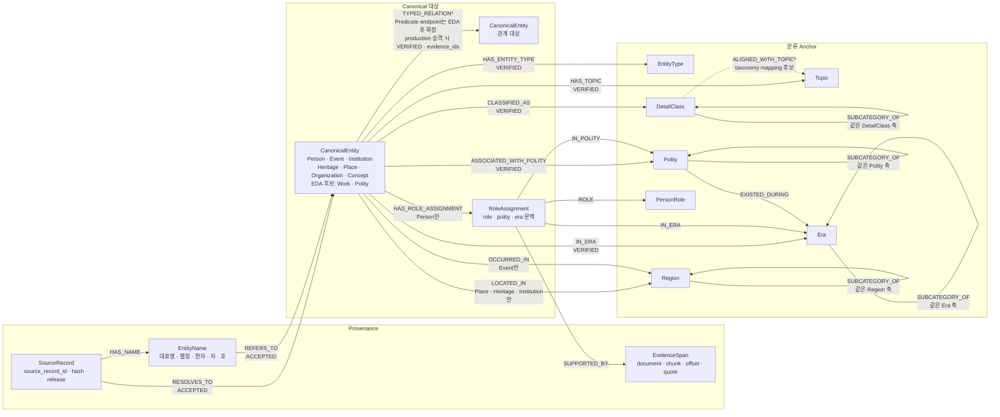

# 05. 범용 Neo4j 목표 스키마

> 상태: `TARGET-SCHEMA`
> 이 문서는 현재 import 결과가 아니라 다음 ETL 개편의 목표다.
> 적용 범위: 문제 생성 후보 검색과 챗봇 지식 조회가 함께 사용하는 공통 Graph다.
> 확정 수준: 핵심 골격은 고정하고, EntityType·Predicate·축 간 매핑 카탈로그는 EDA 후 재확정한다.

## 1. 설계 원칙

1. 모든 검색 대상은 안정된 `CanonicalEntity`로 통일한다.
2. 이름·원천 ID·canonical ID를 분리한다.
3. topic, era, entity type, role, polity, region을 서로 다른 축으로 둔다.
4. 한 대상은 여러 축과 topic에 연결될 수 있다.
5. 원문보다 상세하거나 강한 관계를 만들지 않는다.
6. 문제 생성 검색과 챗봇 조회에는 `ACCEPTED` 대상과 `VERIFIED` 관계만 사용한다.
7. 후보 반환 시 어떤 공통 anchor를 탔는지 설명할 수 있어야 한다.
8. EDA가 끝나기 전 관계 예시를 production Predicate allowlist로 간주하지 않는다.

## 2. 전체 구조



`*` 표시는 스키마의 고정 관계가 아니라 EDA 후 채택 여부와 정확한 계약을 다시 결정할
항목이다. `ALIGNED_WITH_TOPIC`을 채택하더라도 Topic 검색의 production 기준은
`CanonicalEntity-[:HAS_TOPIC]->Topic`으로 단일화하고, 이 관계는 taxonomy 매핑 검증에만
사용한다.

### 2.1 확정된 골격과 EDA 후 결정할 카탈로그

| 구분 | 내용 |
|---|---|
| 확정 골격 | `SourceRecord`, `EntityName`, `CanonicalEntity`, `EvidenceSpan`, 7개 Anchor 축, `RoleAssignment` |
| 확정 원칙 | 동일 축만 `SUBCATEGORY_OF`, 관계 근거·상태·버전 저장, `ACCEPTED/VERIFIED`만 production 조회 |
| EDA 후 재확정 | `Work`·`Polity`의 EntityType 채택, Place–Region 표현, DetailClass–Topic 매핑 방식 |
| EDA 후 재확정 | Person–Person, Person–Organization, Event·Institution·Heritage·Work 관계 Predicate와 endpoint allowlist |

EDA 전 관계명은 `RelationCandidate`의 후보 어휘일 뿐이다. production direct edge는 EDA와
근거 검증을 거쳐 승인된 Predicate만 사용한다.

## 3. 대상과 provenance 노드

### 3.1 `CanonicalEntity`

```text
canonical_id       안정 ID, UNIQUE
display_name       승인 대표명
entity_type_id     조회 편의를 위한 단일 주 type 캐시
resolution_status  ACCEPTED
created_at
updated_at
```

`CanonicalEntity`에 `Person`, `Event`, `Institution`, `Heritage`, `Place`, `Organization`,
`Concept` 같은 보조 label을 붙일 수 있다. `DOCUMENT / WORK`, `POLITY` mention의 EDA 결과에
따라 `Work`, `Polity`를 검색 대상 EntityType으로 승격할 수 있지만 현재는 후보 상태다.
특히 `Polity`를 검색 대상과 Anchor로 동시에 둘 경우 두 표현의 안정 ID와 매핑 규칙을
먼저 확정해야 한다. 모든 검색 대상은 보조 label과 별개로 공통 `CanonicalEntity` label을
가져야 한다.

### 3.2 `SourceRecord`

```text
source_record_id   UNIQUE
source             AKS | ITKC | THESAURUS
record_type        article | person | event | person_relation | ...
source_key         eid | person_id | event_id | term_id | relation composite key
source_release
record_hash
source_url
record_status      ACCEPTED  # production 정규화 상태
```

원천 수집·파싱 단계의 raw 상태값은 staging에 원문 그대로 보존한다. production
`SourceRecord`에는 대문자로 정규화한 `ACCEPTED`만 투영한다.

예시 ID:

```text
AKS:ARTICLE:E0050867:<release>
ITKC:PERSON:<person_id>:<release>
ITKC:EVENT:<event_id>:<release>
THESAURUS:TERM:<term_id>:<release>
```

### 3.3 `EntityName`

```text
entity_name_id
display_name
normalized_name
name_kind          canonical | alias | hanja | ja | ho | source_variant
script
normalization_version
review_status      VERIFIED | PENDING | REJECTED
```

`normalized_name`에는 UNIQUE를 걸지 않는다. 같은 문자열이 여러 동명이인을 가리킬 수 있다.

```text
(SourceRecord)-[:HAS_NAME]->(EntityName)
(EntityName)-[:REFERS_TO {match_status, method, version}]->(CanonicalEntity)
(SourceRecord)-[:RESOLVES_TO {match_status, method, version}]->(CanonicalEntity)
```

## 4. anchor 노드

모든 검색 anchor에는 공통 `Anchor` label과 축을 둔다.

```text
anchor_id          UNIQUE
axis               entity_type | topic | era | polity | person_role | region | detail_class
name
normalized_name
depth
specificity_level   검색 정책에서 사용하는 구체성 등급
search_eligible
max_degree_policy   broad node 과다 확장 방어 정책
review_status       VERIFIED | PENDING | REJECTED
taxonomy_version
```

축별 보조 label은 다음과 같다.

```text
EntityType:Anchor
Topic:Anchor
Era:Anchor
Polity:Anchor
PersonRole:Anchor
Region:Anchor
DetailClass:Anchor
```

같은 축의 계층만 `SUBCATEGORY_OF`로 연결한다.

```text
(조선 후기:Era)-[:SUBCATEGORY_OF]->(조선:Era)
(정변:DetailClass)-[:SUBCATEGORY_OF]->(정치 사건:DetailClass)
(마한:Polity)-[:SUBCATEGORY_OF]->(삼한:Polity)
```

`DetailClass`와 `Topic`은 서로 다른 축이므로 둘 사이에 `SUBCATEGORY_OF`를 사용하지 않는다.
`ALIGNED_WITH_TOPIC`은 시소러스 경로와 실제 분류 분포를 EDA한 뒤 채택 여부를 정하는
taxonomy mapping 후보다. 채택 전까지 Topic 조회의 단일 기준은 대상의 직접 `HAS_TOPIC`이다.

서로 다른 축은 의미가 명확한 관계를 사용한다.

```text
(부여:Polity)-[:EXISTED_DURING]->(초기국가:Era)
(조선:Polity)-[:EXISTED_DURING]->(조선:Era)
```

이름이 같아도 `Polity(조선)`과 `Era(조선)`은 다른 노드와 ID다.

### 4.1 문제 생성 `SemanticClass` 대응

문제 생성 문서의 `SemanticClass`는 별도 노드 종류가 아니라 범용 Graph의
`DetailClass`로 대응한다.

```text
(정조:CanonicalEntity)-[:CLASSIFIED_AS]->(조선 후기 국왕:DetailClass)
(조선 후기 국왕)-[:SUBCATEGORY_OF]->(조선 국왕:DetailClass)
```

기본 적재에서는 원천 또는 승인된 분류 규칙이 직접 지지하는 가장 구체적인 DetailClass만
`CLASSIFIED_AS`로 저장한다. 상위 DetailClass는 `SUBCATEGORY_OF` 계층을 따라 조회하며,
검색 속도를 높이기 위한 상위 분류 지름길 edge는 첫 구현에서 만들지 않는다.

```text
저장: 정조 -[:CLASSIFIED_AS]-> 조선 후기 국왕
계층: 조선 후기 국왕 -[:SUBCATEGORY_OF]-> 조선 국왕
미생성: 정조 -[:CLASSIFIED_AS]-> 조선 국왕  # 검색용 지름길
```

향후 성능 때문에 지름길을 추가한다면 `CLASSIFIED_AS.membership_kind`를
`DERIVED_ANCESTOR`로 표시하고, 원래 검증 분류는 `ASSERTED`로 구분한다. 후보 의미와
`taxonomy_distance`는 항상 `ASSERTED` 분류와 `SUBCATEGORY_OF` 계층에서 계산하며 지름길
edge 유무에 따라 바뀌지 않는다.

이 대응은 Mermaid의 노드·edge 종류를 바꾸지 않는다. 문제 생성의 `TopicType`과
`QuestionFacet`은 요청 단계에서 EntityType·DetailClass·발문의도·허용 경로로 변환하며,
취약점 분석용 Topic/Era 축과 합치지 않는다.

## 5. 대상-분류 관계

### 5.1 공통 속성

검색 가능한 관계는 최소한 다음 속성을 가진다.

```text
relation_id
status              VERIFIED
method              structured_rule | mapping | llm_extract | manual
evidence_ids         근거 ID 배열, 결정 규칙이면 rule evidence ID
source_record_ids
policy_version
graph_release_id
```

분류 관계는 `predicate_catalog_version`의 대상이 아니다. `HAS_ENTITY_TYPE`에는
`entity_type_catalog_version`을 기록하고, Topic·Era·Polity·Region·PersonRole·DetailClass
Anchor를 참조하는 분류 관계에는 대상 Anchor의 `taxonomy_version`을 기록한다.

### 5.2 기본 관계

| 관계 | 시작 | 끝 | 의미 |
|---|---|---|---|
| `HAS_ENTITY_TYPE` | CanonicalEntity | EntityType | 기술적 대상 종류 |
| `HAS_TOPIC` | CanonicalEntity | Topic | 내용상 주제, 복수 허용 |
| `IN_ERA` | CanonicalEntity/RoleAssignment | Era | 활동·발생 시대 |
| `ASSOCIATED_WITH_POLITY` | CanonicalEntity | Polity | 해당 정치체와의 검증된 맥락 |
| `LOCATED_IN` | Place/Heritage/Institution | Region | 소재지 |
| `OCCURRED_IN` | Event | Region | 사건 발생지 |
| `CLASSIFIED_AS` | CanonicalEntity | DetailClass | 승인 세부 분류 |

`CLASSIFIED_AS`에는 다음 분류 전용 속성을 추가한다.

```text
membership_kind      ASSERTED | DERIVED_ANCESTOR
classification_basis source_taxonomy | structured_rule | manual
```

- `ASSERTED`: 원천 분류, 승인된 구조화 규칙 또는 수동 검토가 직접 지지하고 관계 상태가
  `VERIFIED`인 원본 분류다. `ASSERTED`는 검증 상태가 아니라 분류 생성 방식이다.
- `DERIVED_ANCESTOR`: `ASSERTED` 분류와 `SUBCATEGORY_OF` 계층에서 파생한 조회용 상위
  분류 지름길이다. 독립된 사실 근거나 원본 분류로 취급하지 않는다.

첫 구현에서는 `ASSERTED`만 적재한다. `DERIVED_ANCESTOR`는 향후 성능 검증 후 도입한다.

`정치-국가`를 표현하기 위해 `(정치:Topic)-[:RELATED_TO]->(조선:Polity)` 같은 전역 edge를
일괄 생성하지 않는다. 대신 구체 인물·사건·제도가 두 노드에 각각 연결된다.

```text
(과거제)-[:HAS_TOPIC]->(정치)
(과거제)-[:HAS_TOPIC]->(제도)
(과거제)-[:ASSOCIATED_WITH_POLITY]->(조선)
```

이 구조에서 검색 팀은 `정치 + 조선 + 제도`를 공유하는 구체 후보를 찾을 수 있다.

## 6. 역할 맥락

역할은 같은 인물이 국가·시대에 따라 달라질 수 있으므로 `RoleAssignment`를 기본으로 한다.

```text
assignment_id       UNIQUE
status              VERIFIED
start_date/end_date 선택 사항
source_record_ids
evidence_ids
policy_version
graph_release_id
```

```text
(person)-[:HAS_ROLE_ASSIGNMENT]->(assignment)
(assignment)-[:ROLE]->(role:PersonRole)
(assignment)-[:IN_POLITY]->(polity:Polity)
(assignment)-[:IN_ERA]->(era:Era)
(assignment)-[:SUPPORTED_BY]->(evidence:EvidenceSpan)
```

`왕`이라는 역할만 확인되고 국가를 확인하지 못했다면 `ROLE -> 왕`까지만 만든다.
국가를 추측해 `IN_POLITY`를 추가하지 않는다. 오답 검색이 `왕+국가`를 요구하면 해당
assignment는 그 경로에 사용할 수 없다.

## 7. 역사 관계와 EDA 재확정

### 7.1 고정 저장 계약

검색과 챗봇 조회에 필요한 구체 사실은 `CanonicalEntity` 사이의 typed relationship로
저장한다. Predicate 이름과 무관하게 production 관계는 다음 조건을 지킨다.

- Predicate별 subject/object EntityType allowlist가 있다.
- `relation_id`, `status`, `method`, `evidence_ids`, `source_record_ids`, `policy_version`,
  `predicate_catalog_version`, `graph_release_id`를 가진다.
- 원천의 낮은 의미 관계를 더 강한 의미 관계로 자동 승격하지 않는다.
- `VERIFIED` 관계만 검색과 챗봇 응답 근거로 사용한다.

관계 자체에 여러 근거·검토 이력을 연결해야 하는 경우 `RelationAssertion`을 별도 감사
노드로 두고, production direct edge는 VERIFIED assertion을 조회용으로 materialize할 수
있다. 두 표현을 쓸 경우 `relation_id`가 같아야 한다.

### 7.2 EDA용 Predicate 후보

다음은 첨부 Mermaid와 기존 문서에서 출발한 **EDA seed**이며 최종 allowlist가 아니다.

```text
Person -> Person
  가족 · 사제 · 임명 · 복무 · 교유 관계 후보

Person -> Event/Institution/Heritage/Organization/Work
  PARTICIPATED_IN · COMMANDED · FOUNDED · BUILT · REBUILT 등 후보

Event/Institution/Heritage/Work -> CanonicalEntity
  PART_OF · PRECEDED · RESULTED_IN · DAMAGED · DESTROYED · REPLACED
  DEPICTS · DOCUMENTS · DEDICATED_TO 등 후보
```

`MEMBER_OF`, `LED_ORGANIZATION`, `AFFILIATED_WITH`를 포함한 Person–Organization 관계와
각 관계의 방향·역관계·대칭성·시간 범위는 아직 확정하지 않는다.

### 7.3 EDA 종료 후 관계 계약 재정의

NER만으로 관계를 확정하지 않는다. `NER -> Entity Linking -> RelationCandidate 추출` 후
다음 결과를 기준으로 EntityType과 Predicate 카탈로그를 다시 승인한다.

1. `subject EntityType × raw relation 표현 × object EntityType` 빈도
2. 원천별 coverage와 실제 EvidenceSpan 회수율
3. 같은 표현의 의미 중의성, 관계 방향과 역관계 안정성
4. Person–Person/Organization 및 Event·Institution·Heritage·Work 관계 분포
5. `Work`·`Polity`를 독립 검색 대상으로 둘 필요성과 안정 ID 확보 가능성
6. Place와 Region의 동일 대상·상하 공간 관계 구분 가능성

EDA 산출물과 표본 검수가 끝나기 전에는 새 Predicate를 production edge로 만들지 않는다.
EDA 후 승인된 `predicate_catalog_version`과 endpoint allowlist로 이 절과 Mermaid를 다시
갱신해야 한다.

## 8. EvidenceSpan

```text
evidence_id         UNIQUE
document_id
chunk_id
source_record_id
start_offset
end_offset
quote
content_hash
source_release
```

`quote`는 검증에 필요한 짧은 span이다. RAG 본문 전체와 embedding은 Neo4j에 복제하지
않는다. offset과 quote는 원문에서 재검증할 수 있어야 한다.

## 9. 검증 상태와 검색 가시성

| 대상 | 허용 상태 | 검색 사용 |
|---|---|---:|
| SourceRecord | ACCEPTED | provenance만 |
| Entity link | ACCEPTED | 가능 |
| Entity link | AMBIGUOUS/UNRESOLVED/REJECTED | 불가 |
| 분류·관계 | VERIFIED | 가능 |
| 분류·관계 | PENDING/CONFLICT/REJECTED | 불가 |
| Anchor | search_eligible=true, VERIFIED | 가능 |

검색 query에 상태 필터를 매번 누락하지 않도록 production Graph에는 승인 projection만
적재하거나, 공통 query layer에서 강제한다.

## 10. 제약·인덱스 초안

```cypher
CREATE CONSTRAINT canonical_entity_id IF NOT EXISTS
FOR (n:CanonicalEntity) REQUIRE n.canonical_id IS UNIQUE;

CREATE CONSTRAINT source_record_id IF NOT EXISTS
FOR (n:SourceRecord) REQUIRE n.source_record_id IS UNIQUE;

CREATE CONSTRAINT entity_name_id IF NOT EXISTS
FOR (n:EntityName) REQUIRE n.entity_name_id IS UNIQUE;

CREATE CONSTRAINT anchor_id IF NOT EXISTS
FOR (n:Anchor) REQUIRE n.anchor_id IS UNIQUE;

CREATE CONSTRAINT role_assignment_id IF NOT EXISTS
FOR (n:RoleAssignment) REQUIRE n.assignment_id IS UNIQUE;

CREATE CONSTRAINT evidence_id IF NOT EXISTS
FOR (n:EvidenceSpan) REQUIRE n.evidence_id IS UNIQUE;

CREATE INDEX entity_name_normalized IF NOT EXISTS
FOR (n:EntityName) ON (n.normalized_name);

CREATE INDEX canonical_entity_type IF NOT EXISTS
FOR (n:CanonicalEntity) ON (n.entity_type_id);

CREATE INDEX anchor_axis IF NOT EXISTS
FOR (n:Anchor) ON (n.axis, n.search_eligible);
```

relationship `relation_id`의 유일성은 import 전 QA로 검증한다.

## 11. 현재 구현에서의 마이그레이션

현재 import에는 `Term`, `Person`, `Event`, `CanonicalEntity`, `Theme`, `Era`, `Country`,
`Region`, `EntityType` 등이 따로 존재하며 `HAS_ENTITY_TYPE`도 주로 Term에만 적용된다.
목표 변경은 다음 순서로 진행한다.

1. 기존 ID를 버리지 않고 각 검색 대상에 공통 `CanonicalEntity` ID를 부여한다.
2. `Theme`를 승인된 `Topic/DetailClass`로 crosswalk한다.
3. `Country`를 역사 문맥에 맞는 `Polity`로 crosswalk한다.
4. 모든 대상에 `HAS_ENTITY_TYPE`을 일관되게 materialize한다.
5. 기존 `IN_ERA`, `HAS_THEME` 관계에 검증 상태·근거·버전을 보강한다.
6. 역할·국가·시대 맥락이 필요한 인물 관계를 `RoleAssignment`로 변환한다.
7. 검색 allowlist를 통과한 VERIFIED 관계만 production query에 노출한다.

현재 컬럼이나 edge 이름이 목표 의미와 우연히 같더라도 자동 승인하지 않는다. crosswalk와
품질 검사를 거친다.

## 12. 적재 금지

- 이름만 일치한 원천 간 자동 병합
- LLM이 만든 임의 taxonomy ID와 Predicate
- evidence span이 원문에 없는 관계
- ITKC `사건인물`을 근거 없이 지휘·참여 역할로 바꾼 관계
- AKS `relatedArticles`를 역사 Fact로 바꾼 관계
- `조선`, `정치`, `Person` 같은 broad anchor만으로 검색 자격을 과도하게 확장하는 edge
- 시대와 국가를 같은 taxonomy 계층으로 합친 노드
