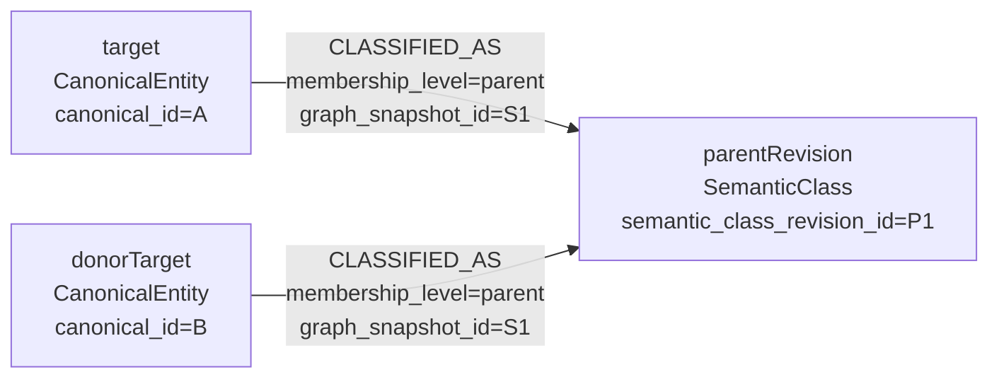
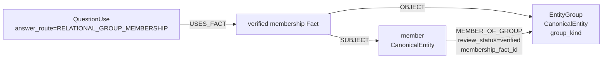

# 06. 오답 donor 조회와 난이도 계약

> 계약 버전: `QG-DONOR-V1-DRAFT`
> 기준일: 2026-07-16
> 구현 상태: 목표 계약. 현재 라이브 조회 코드에는 미적용.

## 1. 용어와 조회 경계

`Candidate`라는 노드나 영속 역할은 만들지 않는다. 오답 재료를 제공하는 대상은 기존
`CanonicalEntity:QuestionTarget`, 출제 projection은 기존 `QuestionUse`, 사실은 기존
`Fact`다. 이 문서와 Cypher에서는 각각 다음 변수명만 사용한다.

```text
donorTarget = 자신에게 참인 다른 역사 대상
donorUse    = donorTarget의 검증된 출제 projection
donorFact   = donorTarget에게 참인 검증 Fact
```

generic donor의 자격 경로는 하나의 parent revision을 직접 공유하는 정확한 2홉이다.



```text
target -[:CLASSIFIED_AS]-> parentRevision
       <-[:CLASSIFIED_AS]- donorTarget
```

`SUBCLASS_OF*`, `RELATED_TO*`, `MEMBER_OF_GROUP*`, `PART_OF*`,
`INSTANCE_OF*`를 따라 donor 자격을 확장하지 않는다. subgroup과 시대·국가 qualifier는
자격 통과 뒤의 난이도 특징이고, group과 직접 상하위 관계는 자격 통과 뒤의 제외
조건이다.

## 2. 생성 요청의 snapshot pin

문제 생성기는 조회 전에 published `GraphSnapshot` 하나를 고정한다. generic donor 조회
요청은 최소한 다음 값을 가진다.

```json
{
  "graph_snapshot_id": "GRAPH:2026-07-16:v1",
  "target_question_use_revision_id": "QUR:<TARGET>",
  "target_fact_id": "FACT:<TARGET>",
  "target_fact_revision_id": "FR:<TARGET>",
  "topic_type_revision_id": "TTR:person:<REV>",
  "facet_revision_id": "QFR:person.activity_achievement:<REV>",
  "target_predicate_revision_id": "PR:<TARGET>",
  "parent_semantic_class_revision_id": "SCR:joseon_monarch:<REV>",
  "semantic_class_taxonomy_version": "semantic-taxonomy-v1",
  "rag_corpus_version": "corpus-2026-07-16"
}
```

논리 ID는 표시와 이력 추적용이다. runtime join은 위 revision ID와
`graph_snapshot_id`로 수행한다. 요청 revision 중 하나라도 해당 snapshot에 없거나 서로
다른 snapshot edge로 이어지면 조회 전체를 실패시킨다. 새 snapshot으로 자동 대체하거나
다른 revision을 추정하지 않는다.

## 3. generic donor 자격

`donorTarget`, `donorUse`, `donorFact`는 다음 조건을 모두 만족해야 한다.

1. target과 동일한 `graph_snapshot_id` 안에 있다.
2. target의 `QuestionUse-[:USES_PARENT_CLASS]`가 선택한 동일 parent
   `semantic_class_revision_id`를 직접 공유한다.
3. target과 동일한 primary `topic_type_revision_id`를 직접 공유한다.
4. target과 동일한 `facet_revision_id`를 사용한다.
5. `target_role`, `answer_role`, `answer_shape`, `answer_domain_id`가 targetUse와 같다.
6. donorUse가 Facet의 승인 `ALLOWS_PREDICATE.signature_id`를 사용한다.
7. target과 다른 `canonical_id`의 active·verified `QuestionTarget`이다.
8. donorUse가 active·verified이고 `answer_route=GENERIC_DONOR`다.
9. donorFact가 verified이며 active·answer-eligible Predicate revision을 사용한다.
10. donorFact에 verified `SUPPORTED_BY` edge와 요청 corpus version의 verified
    `EvidenceSpan`이 최소 하나 있다.
11. donorUse의 `target_role`이 가리키는 donorFact endpoint가 donorTarget이다.
12. answer role·shape의 실제 Fact binding이 `answer_domain_id`와 일치한다.
13. parent가 같은 snapshot의 active `class_level=parent`,
    `donor_eligible=true`, `scope_kind=specific` revision이다.
14. alias 노드가 아니라 canonical target이다. merged·retired·disputed target은 제외한다.
15. 동일 exclusion group이나 직접 `PART_OF`·`INSTANCE_OF` 관계가 아니다.

`CLASSIFIED_AS.is_primary`는 사용하지 않는다. 출제별 donor parent의 단일 진실원은
`QuestionUse-[:USES_PARENT_CLASS]->SemanticClass`다. `CLASSIFIED_AS`는 해당 target이 그
parent에 직접 속한다는 membership만 증명한다.

동명이인은 이름이 아니라 서로 다른 `canonical_id`로 구분한다. 별칭은
`EntityName-[:REFERS_TO]->CanonicalEntity` 검색에만 쓰며 donorTarget이 될 수 없다. 같은
canonical target으로 해소된 이름들은 7번 조건에서 한 번에 제거된다.

## 4. Facet signature와 answer binding 검증

같은 Facet 노드만 공유한다고 충분하지 않다. targetUse와 donorUse가 참조한
`ALLOWS_PREDICATE` signature가 각각 실제 Predicate와 binding을 승인해야 한다.

| signature 계약 | 검증 |
|---|---|
| target TopicType | `Facet-[:TARGET_TOPIC_TYPE]->target primary TopicType revision` |
| allowed Predicate | `Facet-[:ALLOWS_PREDICATE]->Fact Predicate revision` |
| target role | signature, QuestionUse, Fact target endpoint가 동일 |
| answer role·shape | signature와 QuestionUse가 동일하고 아래 양방향 표를 만족 |
| answer domain | signature, QuestionUse, 실제 answer endpoint 또는 literal domain이 동일 |
| mismatch rule | signature의 versioned `mismatch_rule_ids`만 후속 proof에 사용 |
| surface template | signature의 versioned `surface_template_ids`만 표현 단계에 전달 |

| answer_role | answer_shape | 필수 answer binding |
|---|---|---|
| subject | ENTITY | Fact SUBJECT가 CanonicalEntity이고 그 primary TopicType revision이 `answer_domain_id` |
| object | ENTITY | Fact OBJECT가 CanonicalEntity이고 그 primary TopicType revision이 `answer_domain_id` |
| whole_fact | FACT_STATEMENT | Fact 전체, `answer_domain_id=DOMAIN:fact_statement` |
| time | TIME_POINT | 검증된 단일 시점, `answer_domain_id=DOMAIN:time_point` |
| time | TIME_RANGE | 검증된 시작·종료 범위, `answer_domain_id=DOMAIN:time_range` |

역방향도 강제한다. `ENTITY`면 answer_role은 subject 또는 object,
`FACT_STATEMENT`면 whole_fact, 시간 shape면 time이어야 한다. literal object를 ENTITY
답으로 승격하지 않는다.

## 5. 기준 Cypher

다음 쿼리는 Neo4j 5.26 적용 전 dry-run할 기준안이다. query builder가 모든 `$parameter`를
주입하며, 가변 길이 경로를 만들지 않는다.

```cypher
MATCH (snapshot:GraphSnapshot {
        graph_snapshot_id: $graph_snapshot_id,
        status: 'published'
      })

MATCH (snapshot)-[:CONTAINS_REVISION]->(targetUse:QuestionUse {
        question_use_revision_id: $target_question_use_revision_id,
        graph_snapshot_id: $graph_snapshot_id,
        status: 'active',
        review_status: 'verified',
        answer_route: 'GENERIC_DONOR'
      })
MATCH (targetUse)-[:TARGET {
        graph_snapshot_id: $graph_snapshot_id
      }]->(target:CanonicalEntity:QuestionTarget {
        graph_snapshot_id: $graph_snapshot_id,
        entity_status: 'active',
        question_target_status: 'active',
        review_status: 'verified'
      })
MATCH (targetUse)-[:USES_FACET {
        graph_snapshot_id: $graph_snapshot_id
      }]->(facet:QuestionFacet {
        facet_revision_id: $facet_revision_id,
        graph_snapshot_id: $graph_snapshot_id,
        status: 'active',
        answer_route: 'GENERIC_DONOR'
      })
MATCH (snapshot)-[:CONTAINS_REVISION]->(facet)
MATCH (targetUse)-[:USES_FACT {
        graph_snapshot_id: $graph_snapshot_id
      }]->(targetFact:Fact {
        graph_snapshot_id: $graph_snapshot_id,
        fact_id: $target_fact_id,
        fact_revision_id: $target_fact_revision_id,
        status: 'verified'
      })
MATCH (snapshot)-[:CONTAINS_REVISION]->(targetFact)
MATCH (targetUse)-[:USES_PARENT_CLASS {
        graph_snapshot_id: $graph_snapshot_id
      }]->(parent:SemanticClass {
        semantic_class_revision_id: $parent_semantic_class_revision_id,
        graph_snapshot_id: $graph_snapshot_id,
        taxonomy_version: $semantic_class_taxonomy_version,
        class_level: 'parent',
        donor_eligible: true,
        scope_kind: 'specific',
        status: 'active'
      })
MATCH (snapshot)-[:CONTAINS_REVISION]->(parent)

MATCH (target)-[:HAS_TOPIC_TYPE {
        graph_snapshot_id: $graph_snapshot_id,
        is_primary: true,
        review_status: 'verified'
      }]->(topicType:TopicType {
        topic_type_revision_id: $topic_type_revision_id,
        graph_snapshot_id: $graph_snapshot_id,
        status: 'active'
      })
MATCH (snapshot)-[:CONTAINS_REVISION]->(topicType)
MATCH (facet)-[:TARGET_TOPIC_TYPE {
        graph_snapshot_id: $graph_snapshot_id
      }]->(topicType)
MATCH (target)-[:CLASSIFIED_AS {
        graph_snapshot_id: $graph_snapshot_id,
        membership_level: 'parent',
        review_status: 'verified'
      }]->(parent)

MATCH (targetFact)-[:PREDICATE {
        graph_snapshot_id: $graph_snapshot_id
      }]->(targetPredicate:PredicateType {
        predicate_revision_id: $target_predicate_revision_id,
        graph_snapshot_id: $graph_snapshot_id,
        answer_eligible: true,
        status: 'active'
      })
MATCH (snapshot)-[:CONTAINS_REVISION]->(targetPredicate)
MATCH (facet)-[targetSignature:ALLOWS_PREDICATE {
        graph_snapshot_id: $graph_snapshot_id,
        review_status: 'verified'
      }]->(targetPredicate)
MATCH (targetFact)-[:SUBJECT {
        graph_snapshot_id: $graph_snapshot_id
      }]->(targetSubject:CanonicalEntity {
        graph_snapshot_id: $graph_snapshot_id
      })
OPTIONAL MATCH (targetFact)-[:OBJECT {
        graph_snapshot_id: $graph_snapshot_id
      }]->(targetObject:CanonicalEntity {
        graph_snapshot_id: $graph_snapshot_id
      })
MATCH (targetFact)-[targetSupport:SUPPORTED_BY {
        graph_snapshot_id: $graph_snapshot_id,
        review_status: 'verified'
      }]->(targetEvidence:EvidenceSpan {
        graph_snapshot_id: $graph_snapshot_id,
        corpus_version: $rag_corpus_version,
        review_status: 'verified'
      })
MATCH (snapshot)-[:CONTAINS_REVISION]->(targetEvidence)

MATCH (donorTarget:CanonicalEntity:QuestionTarget {
        graph_snapshot_id: $graph_snapshot_id,
        entity_status: 'active',
        question_target_status: 'active',
        review_status: 'verified'
      })-[:CLASSIFIED_AS {
        graph_snapshot_id: $graph_snapshot_id,
        membership_level: 'parent',
        review_status: 'verified'
      }]->(parent)
MATCH (donorTarget)-[:HAS_TOPIC_TYPE {
        graph_snapshot_id: $graph_snapshot_id,
        is_primary: true,
        review_status: 'verified'
      }]->(topicType)

MATCH (snapshot)-[:CONTAINS_REVISION]->(donorUse:QuestionUse {
        graph_snapshot_id: $graph_snapshot_id,
        status: 'active',
        review_status: 'verified',
        answer_route: 'GENERIC_DONOR'
      })
MATCH (donorUse)-[:TARGET {
        graph_snapshot_id: $graph_snapshot_id
      }]->(donorTarget)
MATCH (donorUse)-[:USES_FACET {
        graph_snapshot_id: $graph_snapshot_id
      }]->(facet)
MATCH (donorUse)-[:USES_PARENT_CLASS {
        graph_snapshot_id: $graph_snapshot_id
      }]->(parent)
MATCH (donorUse)-[:USES_FACT {
        graph_snapshot_id: $graph_snapshot_id
      }]->(donorFact:Fact {
        graph_snapshot_id: $graph_snapshot_id,
        status: 'verified'
      })
MATCH (snapshot)-[:CONTAINS_REVISION]->(donorFact)
MATCH (donorFact)-[:PREDICATE {
        graph_snapshot_id: $graph_snapshot_id
      }]->(donorPredicate:PredicateType {
        graph_snapshot_id: $graph_snapshot_id,
        answer_eligible: true,
        status: 'active'
      })
MATCH (snapshot)-[:CONTAINS_REVISION]->(donorPredicate)
MATCH (facet)-[donorSignature:ALLOWS_PREDICATE {
        graph_snapshot_id: $graph_snapshot_id,
        review_status: 'verified'
      }]->(donorPredicate)
MATCH (donorFact)-[:SUBJECT {
        graph_snapshot_id: $graph_snapshot_id
      }]->(donorSubject:CanonicalEntity {
        graph_snapshot_id: $graph_snapshot_id
      })
OPTIONAL MATCH (donorFact)-[:OBJECT {
        graph_snapshot_id: $graph_snapshot_id
      }]->(donorObject:CanonicalEntity {
        graph_snapshot_id: $graph_snapshot_id
      })
MATCH (donorFact)-[donorSupport:SUPPORTED_BY {
        graph_snapshot_id: $graph_snapshot_id,
        review_status: 'verified'
      }]->(donorEvidence:EvidenceSpan {
        graph_snapshot_id: $graph_snapshot_id,
        corpus_version: $rag_corpus_version,
        review_status: 'verified'
      })
MATCH (snapshot)-[:CONTAINS_REVISION]->(donorEvidence)

WHERE donorTarget.canonical_id <> target.canonical_id
  AND targetUse.contract_version = facet.contract_version
  AND donorUse.contract_version = facet.contract_version
  AND targetUse.target_role = donorUse.target_role
  AND targetUse.answer_role = donorUse.answer_role
  AND targetUse.answer_shape = donorUse.answer_shape
  AND targetUse.answer_domain_id = donorUse.answer_domain_id

  AND targetSignature.signature_id = targetUse.facet_signature_id
  AND targetSignature.target_role = targetUse.target_role
  AND targetSignature.answer_role = targetUse.answer_role
  AND targetSignature.answer_shape = targetUse.answer_shape
  AND targetSignature.answer_domain_id = targetUse.answer_domain_id

  AND donorSignature.signature_id = donorUse.facet_signature_id
  AND donorSignature.target_role = donorUse.target_role
  AND donorSignature.answer_role = donorUse.answer_role
  AND donorSignature.answer_shape = donorUse.answer_shape
  AND donorSignature.answer_domain_id = donorUse.answer_domain_id

  AND (
    (targetUse.target_role = 'subject' AND targetSubject = target)
    OR
    (targetUse.target_role = 'object' AND targetObject = target)
  )
  AND (
    (donorUse.target_role = 'subject' AND donorSubject = donorTarget)
    OR
    (donorUse.target_role = 'object' AND donorObject = donorTarget)
  )

  AND (
    (
      targetUse.answer_shape = 'ENTITY'
      AND (
        (
          targetUse.answer_role = 'subject'
          AND EXISTS {
            MATCH (targetSubject)-[targetAnswerType:HAS_TOPIC_TYPE {
                    graph_snapshot_id: $graph_snapshot_id,
                    is_primary: true,
                    review_status: 'verified'
                  }]->(targetAnswerTopic:TopicType {
                    graph_snapshot_id: $graph_snapshot_id,
                    status: 'active'
                  })
            WHERE targetAnswerTopic.topic_type_revision_id =
                  targetUse.answer_domain_id
          }
        )
        OR
        (
          targetUse.answer_role = 'object'
          AND EXISTS {
            MATCH (targetObject)-[targetAnswerType:HAS_TOPIC_TYPE {
                    graph_snapshot_id: $graph_snapshot_id,
                    is_primary: true,
                    review_status: 'verified'
                  }]->(targetAnswerTopic:TopicType {
                    graph_snapshot_id: $graph_snapshot_id,
                    status: 'active'
                  })
            WHERE targetAnswerTopic.topic_type_revision_id =
                  targetUse.answer_domain_id
          }
        )
      )
    )
    OR
    (
      targetUse.answer_role = 'whole_fact'
      AND targetUse.answer_shape = 'FACT_STATEMENT'
      AND targetUse.answer_domain_id = 'DOMAIN:fact_statement'
    )
    OR
    (
      targetUse.answer_role = 'time'
      AND targetUse.answer_shape = 'TIME_POINT'
      AND targetUse.answer_domain_id = 'DOMAIN:time_point'
      AND targetFact.start_year IS NOT NULL
      AND (
        targetFact.end_year IS NULL
        OR targetFact.end_year = targetFact.start_year
      )
    )
    OR
    (
      targetUse.answer_role = 'time'
      AND targetUse.answer_shape = 'TIME_RANGE'
      AND targetUse.answer_domain_id = 'DOMAIN:time_range'
      AND targetFact.start_year IS NOT NULL
      AND targetFact.end_year IS NOT NULL
      AND targetFact.start_year <= targetFact.end_year
    )
  )

  AND (
    (
      donorUse.answer_shape = 'ENTITY'
      AND (
        (
          donorUse.answer_role = 'subject'
          AND EXISTS {
            MATCH (donorSubject)-[donorAnswerType:HAS_TOPIC_TYPE {
                    graph_snapshot_id: $graph_snapshot_id,
                    is_primary: true,
                    review_status: 'verified'
                  }]->(donorAnswerTopic:TopicType {
                    graph_snapshot_id: $graph_snapshot_id,
                    status: 'active'
                  })
            WHERE donorAnswerTopic.topic_type_revision_id =
                  donorUse.answer_domain_id
          }
        )
        OR
        (
          donorUse.answer_role = 'object'
          AND EXISTS {
            MATCH (donorObject)-[donorAnswerType:HAS_TOPIC_TYPE {
                    graph_snapshot_id: $graph_snapshot_id,
                    is_primary: true,
                    review_status: 'verified'
                  }]->(donorAnswerTopic:TopicType {
                    graph_snapshot_id: $graph_snapshot_id,
                    status: 'active'
                  })
            WHERE donorAnswerTopic.topic_type_revision_id =
                  donorUse.answer_domain_id
          }
        )
      )
    )
    OR
    (
      donorUse.answer_role = 'whole_fact'
      AND donorUse.answer_shape = 'FACT_STATEMENT'
      AND donorUse.answer_domain_id = 'DOMAIN:fact_statement'
    )
    OR
    (
      donorUse.answer_role = 'time'
      AND donorUse.answer_shape = 'TIME_POINT'
      AND donorUse.answer_domain_id = 'DOMAIN:time_point'
      AND donorFact.start_year IS NOT NULL
      AND (
        donorFact.end_year IS NULL
        OR donorFact.end_year = donorFact.start_year
      )
    )
    OR
    (
      donorUse.answer_role = 'time'
      AND donorUse.answer_shape = 'TIME_RANGE'
      AND donorUse.answer_domain_id = 'DOMAIN:time_range'
      AND donorFact.start_year IS NOT NULL
      AND donorFact.end_year IS NOT NULL
      AND donorFact.start_year <= donorFact.end_year
    )
  )

  AND NOT EXISTS {
    MATCH (target)-[targetMembership:MEMBER_OF_GROUP {
            graph_snapshot_id: $graph_snapshot_id,
            review_status: 'verified'
          }]->(group:CanonicalEntity:EntityGroup {
            graph_snapshot_id: $graph_snapshot_id,
            exclude_from_generic_donor: true,
            review_status: 'verified'
          })<-[donorMembership:MEMBER_OF_GROUP {
            graph_snapshot_id: $graph_snapshot_id,
            review_status: 'verified'
          }]-(donorTarget)
  }
  AND NOT EXISTS {
    MATCH (target)-[directHierarchy]-(donorTarget)
    WHERE type(directHierarchy) IN ['PART_OF', 'INSTANCE_OF']
      AND directHierarchy.graph_snapshot_id = $graph_snapshot_id
      AND directHierarchy.review_status = 'verified'
  }

OPTIONAL MATCH (target)-[:CLASSIFIED_AS {
        graph_snapshot_id: $graph_snapshot_id,
        membership_level: 'subgroup',
        review_status: 'verified'
      }]->(sharedSubgroup:SemanticClass {
        graph_snapshot_id: $graph_snapshot_id,
        taxonomy_version: $semantic_class_taxonomy_version,
        class_level: 'subgroup',
        status: 'active'
      })<-[:CLASSIFIED_AS {
        graph_snapshot_id: $graph_snapshot_id,
        membership_level: 'subgroup',
        review_status: 'verified'
      }]-(donorTarget)
WHERE EXISTS {
        MATCH (snapshot)-[:CONTAINS_REVISION]->(sharedSubgroup)
      }
  AND EXISTS {
        MATCH (sharedSubgroup)-[:SUBCLASS_OF {
                graph_snapshot_id: $graph_snapshot_id
              }]->(parent)
      }

RETURN DISTINCT
  snapshot.graph_snapshot_id AS graph_snapshot_id,
  target.canonical_id AS question_target_entity_id,
  target.canonical_name AS question_target_name,
  targetUse.question_use_id AS target_question_use_id,
  targetUse.question_use_revision_id AS target_question_use_revision_id,
  facet.facet_id AS facet_id,
  facet.facet_revision_id AS facet_revision_id,
  topicType.topic_type_id AS topic_type_id,
  topicType.topic_type_revision_id AS topic_type_revision_id,
  parent.semantic_class_id AS parent_semantic_class_id,
  parent.semantic_class_revision_id AS parent_semantic_class_revision_id,
  parent.taxonomy_version AS semantic_class_taxonomy_version,

  donorTarget.canonical_id AS donor_entity_id,
  donorTarget.canonical_name AS donor_name,
  donorUse.question_use_id AS donor_question_use_id,
  donorUse.question_use_revision_id AS donor_question_use_revision_id,
  donorUse.facet_signature_id AS donor_facet_signature_id,
  donorUse.target_role AS target_role,
  donorUse.answer_role AS answer_role,
  donorUse.answer_shape AS answer_shape,
  donorUse.answer_domain_id AS answer_domain_id,
  donorFact.fact_id AS donor_fact_id,
  donorFact.fact_revision_id AS donor_fact_revision_id,
  donorFact.canonical_hash AS donor_fact_canonical_hash,
  donorTarget.canonical_id AS source_fact_target_entity_id,
  donorPredicate.predicate_id AS donor_predicate_id,
  donorPredicate.predicate_revision_id AS donor_predicate_revision_id,
  donorPredicate.predicate_family AS donor_predicate_family,
  donorPredicate.functional_scope AS functional_scope,
  donorPredicate.inverse_functional_scope AS inverse_functional_scope,
  donorPredicate.exclusive_group_ids AS exclusive_group_ids,
  donorPredicate.closed_world_scope_ids AS closed_world_scope_ids,
  donorPredicate.proof_contract_version AS proof_contract_version,
  donorSignature.mismatch_rule_ids AS mismatch_rule_ids,
  donorSignature.surface_template_ids AS surface_template_ids,

  donorSubject.canonical_id AS fact_subject_entity_id,
  donorObject.canonical_id AS fact_object_entity_id,
  donorFact.object_value AS fact_object_value,
  donorFact.object_value_type AS fact_object_value_type,
  donorFact.object_unit AS fact_object_unit,
  CASE donorUse.target_role
    WHEN 'subject' THEN donorSubject.canonical_id
    WHEN 'object' THEN donorObject.canonical_id
  END AS fact_target_endpoint_id,
  donorFact.start_year AS start_year,
  donorFact.end_year AS end_year,
  donorFact.historical_era_ids AS historical_era_ids,
  donorFact.historical_polity_ids AS historical_polity_ids,
  collect(DISTINCT sharedSubgroup.semantic_class_revision_id)
    AS shared_subgroup_revision_ids,
  collect(DISTINCT sharedSubgroup.semantic_class_id)
    AS shared_subgroup_logical_ids,
  collect(DISTINCT {
    evidence_span_id: donorEvidence.evidence_span_id,
    evidence_span_revision_id: donorEvidence.evidence_span_revision_id,
    content_hash: donorEvidence.content_hash,
    document_id: donorEvidence.document_id,
    chunk_id: donorEvidence.chunk_id,
    corpus_version: donorEvidence.corpus_version
  }) AS donor_authoritative_evidence_spans
```

`targetSupport`와 `targetEvidence`도 mandatory match이므로 target Fact의 근거가 검증되지
않으면 결과가 없다. donor 쪽도 edge와 span을 각각 검증한다. `OPTIONAL MATCH` 뒤 두 번째
`WHERE`는 subgroup 특징만 제한하며, subgroup이 없어도 앞선 donor 자격 행은 유지된다.

운영에서는 이 쿼리 결과에 대해 다음 cardinality를 별도 validator가 다시 검사한다.

- targetUse·donorUse의 `TARGET`, `USES_FACET`, `USES_FACT`,
  `USES_PARENT_CLASS`가 각각 정확히 하나
- Fact의 `SUBJECT`, `PREDICATE`, object binding이 각각 계약 cardinality를 만족
- 한 target의 primary TopicType revision이 snapshot 안에서 정확히 하나
- `graph_snapshot_id + Fact.canonical_hash` 중복이 0
- 결과의 모든 revision ID가 요청 GraphSnapshot에 속함

위 Cypher는 canonical binding의 원재료를 반환한다. Graph repository adapter는 이 값을
3장의 `source-fact-binding-v1` 고정 schema로 조립하고
`source_fact_binding_hash=sha256(canonical-json-v1(payload))`를 계산한다. Neo4j에 별도
hash 속성을 추정해서 읽거나 다른 직렬화로 다시 계산하지 않는다.

## 6. 조회 결과 계약

GraphDB는 donor target만 반환하지 않고 donorUse, donorFact, Predicate proof 메타데이터,
허용 근거 범위를 함께 확정한다.

```json
{
  "graph_snapshot_id": "GRAPH:2026-07-16:v1",
  "question_target_entity_id": "AKS_ENTITY:E0050867",
  "question_target_name": "정조",
  "target_question_use_revision_id": "QUR:<TARGET>",
  "topic_type_revision_id": "TTR:person:<REV>",
  "facet_revision_id": "QFR:person.activity_achievement:<REV>",
  "parent_semantic_class_revision_id": "SCR:joseon_monarch:<REV>",
  "semantic_class_taxonomy_version": "semantic-taxonomy-v1",
  "donors": [
    {
      "donor_entity_id": "AKS_ENTITY:<EID>",
      "donor_name": "영조",
      "donor_question_use_id": "QU:person:<EID>:activity:001",
      "donor_question_use_revision_id": "QUR:<DONOR>",
      "donor_fact_id": "FACT:<ID>",
      "donor_fact_revision_id": "FR:<REV>",
      "donor_fact_canonical_hash": "sha256:<HASH>",
      "source_fact_target_entity_id": "AKS_ENTITY:<EID>",
      "donor_predicate_id": "PRED:<ID>",
      "donor_predicate_revision_id": "PR:<REV>",
      "donor_facet_signature_id": "SIG:<ID>",
      "target_role": "subject",
      "answer_role": "whole_fact",
      "answer_shape": "FACT_STATEMENT",
      "answer_domain_id": "DOMAIN:fact_statement",
      "fact_target_endpoint_id": "AKS_ENTITY:<EID>",
      "source_fact_binding": {
        "binding_schema_version": "source-fact-binding-v1",
        "subject_entity_id": "AKS_ENTITY:<EID>",
        "predicate_revision_id": "PR:<REV>",
        "object": {
          "kind": "ENTITY",
          "entity_id": "AKS_ENTITY:<OBJECT_EID>",
          "value": null,
          "value_type": null,
          "unit": null
        },
        "historical_qualifiers": {
          "historical_era_ids": ["AKS_ENTITY:<PERIOD_EID>"],
          "historical_polity_ids": ["AKS_ENTITY:<POLITY_EID>"],
          "start_year": null,
          "end_year": null
        }
      },
      "source_fact_binding_hash": "sha256:<BINDING_HASH>",
      "predicate_proof_contract": {
        "functional_scope": "SUBJECT_WITH_QUALIFIERS",
        "inverse_functional_scope": "NONE",
        "exclusive_group_ids": [],
        "closed_world_scope_ids": [],
        "proof_contract_version": "predicate-proof-v1"
      },
      "mismatch_rule_ids": ["MR:<ID>:v1"],
      "surface_template_ids": ["ST:<ID>:v1"],
      "donor_authoritative_evidence_spans": [
        {
          "evidence_span_id": "EV:<ID>",
          "evidence_span_revision_id": "EVR:<REV>",
          "content_hash": "sha256:<SPAN_HASH>",
          "document_id": "aks:<EID>",
          "chunk_id": "chunk:<ID>",
          "corpus_version": "<VERSION>"
        }
      ],
      "shared_subgroup_revision_ids": ["SCR:late_joseon_monarch:<REV>"],
      "difficulty_features": {
        "shared_subgroup_count": 1,
        "historical_era_overlap": true,
        "historical_polity_overlap": true,
        "time_distance": null,
        "same_predicate_family": true,
        "name_or_expression_similarity": null
      },
      "relative_rank": 1,
      "fallback_used": false
    }
  ]
}
```

`historical_era_ids`는 primary TopicType revision이 `period`인
`CanonicalEntity.canonical_id` 배열이다. `historical_polity_ids`는 primary TopicType
revision이 `polity`인 CanonicalEntity ID 배열이다. `ERA:joseon`,
`POLITY:joseon`, 취약점 분석용 `CurriculumEra` ID처럼 별도 ID 공간을 섞지 않는다.

`fact_target_endpoint_id`가 `donor_entity_id`와 다르면 즉시 폐기한다. 이름 문자열이
일치하는지는 owner 검증이 아니다.

## 7. 제외 순서

검증 순서는 다음과 같이 고정한다.

1. 동일 snapshot·revision pin 확인
2. 정확한 parent 2홉과 동일 primary TopicType·Facet 확인
3. donorUse·donorFact·Predicate·근거 상태 확인
4. target endpoint와 role-shape-domain binding 확인
5. 같은 exclusion group과 직접 `PART_OF`·`INSTANCE_OF` 제거
6. mismatch proof 가능성 평가
7. 난이도 특징 계산과 순위화

EntityGroup이나 직접 관계를 먼저 따라가 새 donor를 찾지 않는다. 둘은 1~4단계 자격을
통과한 donor를 5단계에서 제거하는 필터다.

## 8. 관계형 group membership 질문

`answer_route=RELATIONAL_GROUP_MEMBERSHIP`인 Facet은 5장의 generic donor Cypher를
호출하지 않는다.



대표 binding은 `target_role=object`, `answer_role=subject`,
`answer_shape=ENTITY`다. 그러나 실제 허용 조합은 해당 Facet signature가 결정한다.

오답은 다른 SemanticClass나 다른 group의 member를 일반 donor처럼 가져오지 않는다.
Facet signature의 mismatch rule이 다음 중 하나를 권위 근거로 증명한 entity만 오답으로
사용한다.

- 승인된 closed membership scope에서의 비회원
- 상호배타 group의 검증 member
- 해당 target group에 속하지 않는다는 명시적 반증

proof가 없으면 `FALSE`가 아니라 `UNKNOWN`이며 폐기한다.

## 9. 난이도

donor 자격은 모든 난이도에서 같다. 난이도는 자격 통과 집합 안에서 다음 versioned
특징으로만 상대 순위를 정한다.

```text
shared_subgroup_revision_ids
historical_era_ids overlap
historical_polity_ids overlap
normalized time_distance
same_predicate_family
name_or_expression_similarity
```

subgroup 비교에는 `semantic_class_revision_id`와
`semantic_class_taxonomy_version`을 함께 사용한다. 논리 subgroup ID가 같아도 revision
또는 taxonomy version이 다르면 같은 생성 작업에서 비교하지 않는다.

| 난이도 | 선택 원칙 |
|---|---|
| 쉬움 | 공유 subgroup이 없고 시대·국가·시간 거리가 상대적으로 먼 donor 4개 |
| 보통 | 가까운 donor 2개와 중간 거리 donor 2개 |
| 어려움 | 동일 subgroup revision과 시대·국가를 최대한 공유하고 시간 거리가 가까운 donor 4개 |

가중치·tie-break·표현 유사도 모델은 Neo4j 속성에 하드코딩하지 않고 versioned difficulty
policy가 소유한다. Neo4j는 ID와 qualifier만 반환한다. 같은 점수 안에서의 무작위 선택은
`random_seed`를 받은 생성 서비스가 수행한다.

어려움에서 동일 subgroup 조건을 만족하는 donor가 4개 미만이면 완화하지 않고 해당
target-Facet 조합을 skip한다. 쉬움의 먼 donor가 4개 미만이어도 가까운 donor로 채우지
않는다. `fallback_used`는 v1에서 항상 false다.

## 10. Predicate proof와 mismatch 판정

donorFact는 donorTarget에게 참이라는 근거이지, donor에서 가져온 문장을 target에
대입했을 때 거짓이라는 증명 자체는 아니다. Graph에 Fact가 없다는 이유만으로 거짓으로
판정하지 않는다.

후속 validator는 Facet signature가 허용한 `mismatch_rule_ids`와 Predicate revision의
다음 메타데이터를 함께 사용한다.

```text
functional_scope
inverse_functional_scope
exclusive_group_ids
closed_world_scope_ids
proof_contract_version
```

가능한 proof 예시는 다음과 같다.

- 동일 qualifier scope에서의 functional 또는 inverse-functional 충돌
- 권위 있는 상호배타 Predicate/role 그룹의 충돌
- versioned closed-world scope의 완전 목록과 불일치
- 권위 원천의 명시적 반증

qualifier scope나 권위 범위가 맞지 않으면 proof를 만들지 않는다. proof payload는 3장의
`MismatchProofV1`을 단일 계약으로 사용하며 최소한 다음을 불변 저장한다.

```text
proof_id, proof_kind, proof_hash, proof_hash_algorithm
graph_snapshot_id
question_target_entity_id, question_use_revision_id, target_fact_revision_id
donor_entity_id, donor_question_use_revision_id
source_fact_id, source_fact_revision_id, source_fact_canonical_hash
source_fact_binding_hash, rendered_claim_hash
predicate_revision_id
functional_scope, inverse_functional_scope
exclusive_group_ids, closed_world_scope_ids, proof_contract_version
mismatch_rule_id, mismatch_rule_version, validator_version
evidence[] = {role, evidence_span_id, evidence_span_revision_id, content_hash}
verdict = FALSE | UNKNOWN
```

evidence role은 `TARGET_TRUE`, `DONOR_TRUE`, `COUNTER_FALSE` 중 하나다. revision이나
content hash가 빠진 논리 EvidenceSpan ID만으로 proof를 만들지 않는다. verdict가
`FALSE`로 증명되지 않은 donor는 `UNKNOWN`으로 폐기한다.

## 11. donor별 RAG 계약

RAG는 GraphDB가 확정한 범위를 벗어나 새 donor나 새 Fact를 선택하지 않는다. donor 조회
결과를 3장의 공통 RAG 요청 DTO로 이름만 매핑한다. 논리 ID만 보내는 축약 요청은
허용하지 않는다.

```json
{
  "purpose": "DONOR_TRUE_EVIDENCE",
  "graph_snapshot_id": "GRAPH:2026-07-16:v1",
  "question_target_entity_id": "AKS_ENTITY:<TARGET_EID>",
  "source_fact_target_entity_id": "AKS_ENTITY:<DONOR_EID>",
  "question_use_revision_id": "QUR:<TARGET_REV>",
  "donor_question_use_revision_id": "QUR:<DONOR_REV>",
  "source_fact_id": "FACT:<DONOR_FACT_ID>",
  "source_fact_revision_id": "FR:<DONOR_REV>",
  "source_fact_canonical_hash": "sha256:<FACT_HASH>",
  "predicate_revision_id": "PR:<REV>",
  "source_fact_binding_hash": "sha256:<BINDING_HASH>",
  "allowed_authoritative_evidence_spans": [
    {
      "evidence_span_id": "EV:<ID>",
      "evidence_span_revision_id": "EVR:<REV>",
      "content_hash": "sha256:<SPAN_HASH>",
      "document_id": "aks:<EID>",
      "chunk_id": "chunk:<ID>"
    }
  ],
  "allowed_document_ids": ["aks:<EID>"],
  "corpus_version": "<VERSION>"
}
```

위 값으로 donorFact의 참 근거를 가져오고 표현에 필요한 문맥을 보완한다. 허용
EvidenceSpan 밖에서 발견한 새 span은 문맥 후보일 뿐 donor 자격이나 mismatch proof를
바꾸지 않는다. 근거 hash·offset·corpus version이 맞지 않거나 stale이면 donor를
폐기한다.

## 12. 배포 전 QA

1. generic donor 결과에 동일 `canonical_id`가 없다.
2. 모든 donor가 target과 동일 parent revision을 정확한 2홉으로 직접 공유한다.
3. 모든 donor가 동일 snapshot의 TopicType·Facet revision을 사용한다.
4. donorUse role·shape·domain과 실제 donorFact binding 불일치가 0이다.
5. donor Fact endpoint와 donor entity 불일치가 0이다.
6. verified edge와 verified EvidenceSpan이 없는 donor가 0이다.
7. cross-snapshot edge가 0이다.
8. 같은 exclusion group과 직접 PART_OF·INSTANCE_OF pair가 결과에 없다.
9. broad 또는 `donor_eligible=false` parent로 조회된 donor가 0이다.
10. subgroup revision·taxonomy version을 섞은 난이도 계산이 0이다.
11. `graph_snapshot_id + Fact.canonical_hash` 중복이 0이다.
12. generic donor 쿼리에 관계형 group membership Facet이 들어오지 않는다.
13. mismatch proof 없는 donor option이 최종 선지로 전달되지 않는다.
14. 부족한 난이도 pool을 자동 완화한 결과가 0이다.
