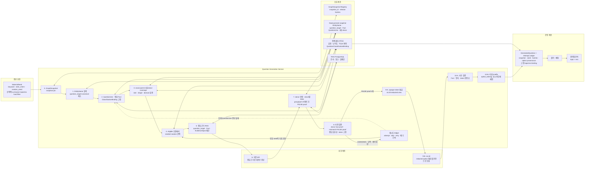
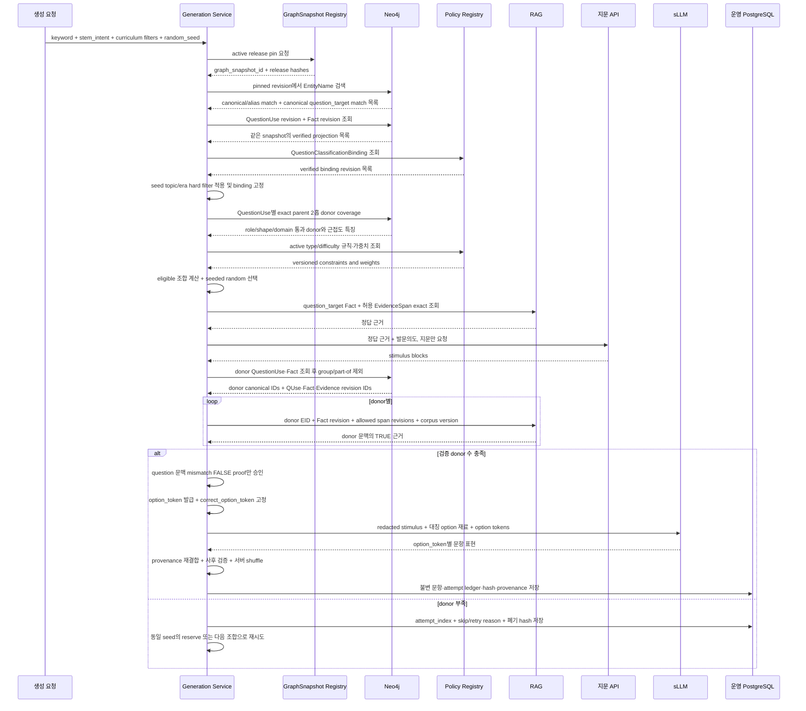

# 07. 문제 생성 전체 서비스 흐름

> 계약 버전: `QG-RUNTIME-V1-DRAFT`
> 기준일: 2026-07-16
> 구현 상태: 목표 흐름. 현재 `app/question`에는 미구현.

이 문서는 Neo4j, RAG, 모델, 운영 DB가 교환해야 하는 **경계 인터페이스 계약**을
정의한다. 특정 서비스의 내부 클래스, 배포 방식, 테이블 구현을 지시하지 않는다. 각
시스템은 아래 입력·출력·불변식과 버전 고정 규칙을 지키는 범위에서 독립적으로 구현할 수
있다.

## 0. 용어와 읽기 컨텍스트

| 용어 | 의미 |
|---|---|
| `question_target` | 발문과 정답 Fact가 설명하는 출제 대상 |
| `donor_target` | 자신의 문맥에서는 참인 Fact를 제공하지만, `question_target` 문맥에서는 승인된 mismatch proof로 거짓임이 증명된 다른 대상 |
| `EntityName` | canonical name, alias, 한자명, 역사적 명칭을 canonical entity로 해소하기 위한 이름 레코드. question/donor target 자체가 아님 |
| `GraphSnapshot` | 한 생성 작업이 읽는 immutable Graph release와 revision manifest |
| `QuestionClassificationBinding` | QuestionUse를 교육과정 topic·era에 버전 있게 귀속한 검증 바인딩 |
| `option_token` | job-scoped opaque token. 정답 여부·순번·question/donor 역할을 암시하지 않음 |

생성 작업은 첫 Graph 조회 전에 다음 읽기 컨텍스트를 고정한다.

```text
graph_snapshot_id
schema_version
source_manifest_hash
snapshot_payload_hash
entity_resolution_version
policy_bundle_revision_id
taxonomy_version
rag_corpus_version
```

이후 alias 해소, QuestionUse, Fact, 분류, donor, EvidenceSpan 조회는 모두 같은
`graph_snapshot_id`와 그 안의 명시적 revision ID를 사용한다. 실행 도중 최신 revision으로 따라가거나
서로 다른 snapshot의 ID를 조인하지 않는다. pinned snapshot을 더 이상 읽을 수 없으면 같은
작업 안에서 새 snapshot으로 넘어가지 않고 작업을 실패 또는 skip 처리한다.

## 1. 전체 서비스 구조



RAG와 모델은 pinned Graph가 확정한 question target·Fact·authoritative Evidence 범위를
변경하지 못한다.
RAG가 같은 문서에서 보강한 context-only 청크는 표현에만 사용하고 proof로 승격하지 않는다.

## 2. 실행 순서



## 3. 0~1단계: snapshot pin과 이름 해소

입력 문자열은 최종 question target ID가 아니다.

```text
keyword
  -> pinned snapshot의 EntityName normalized name/alias 검색
  -> TopicType·시대·한자·관계 이웃으로 disambiguation
  -> accepted question_target canonical_id
```

`EntityName`은 다음 최소 필드를 반환하는 이름 해소용 레코드다.

```text
entity_name_id
display_name
normalized_name
name_kind = canonical | alias | birth_name | hanja | ja | ho | former_name | source_variant
canonical_id
normalization_version
review_status = verified | pending | rejected
source_record_keys
graph_snapshot_id
```

alias 노드를 QuestionTarget이나 donor target으로 직접 사용하지 않는다. canonical name과
alias가 같은 canonical ID로 해소되는지만 확인한다. canonical match가 둘 이상이면 자동 선택하지
않고 disambiguation 응답을 반환한다.

승인된 합성 target은 별도 canonical ID와 provenance를 가진 `QuestionTarget`이어야 한다.
런타임이 이름 문자열을 보고 합성 target을 즉석 생성하거나 여러 실체를 임의로 묶는 것은
금지한다.

## 4. 2단계: 정답 Fact와 교육과정 분류 고정

question target의 active·verified QuestionUse 중 발문의도와 호환되는 것을 조회한다.

```text
QuestionUse
  -> TARGET
  -> USES_FACET
  -> USES_FACT
  -> QuestionClassificationBinding

answer_route=GENERIC_DONOR일 때만
  -> USES_PARENT_CLASS
```

이때 이미 `question_target_entity_id`, `question_use_revision_id`, `fact_revision_id`,
`answer_shape`, `answer_role`이 확정된다. RAG나
모델이 정답을 추측하지 않는다.

`QuestionClassificationBinding`의 최소 계약은 다음과 같다.

```text
question_classification_binding_revision_id
question_use_revision_id
taxonomy_version
primary_topic = {topic_id, detail_topic_ids}
secondary_topics[] = {topic_id, detail_topic_ids}
primary_era = {era_id, detail_era_ids}
secondary_eras[] = {era_id, detail_era_ids}
binding_hash
review_status = verified
graph_snapshot_id
```

정확한 JSON 구조와 생성 문항의 평탄화 필드는
[저장소 책임과 문제 생성 계약](./03_storage_and_material_contract.md)의
`QuestionClassificationBinding`을 따른다.

MaterialSeed의 `requested_curriculum_topic_ids`와 `requested_curriculum_era_ids`가 비어
있지 않으면 **추천 힌트가 아니라 hard filter**다. 각 non-empty 축은 같은
`requested_taxonomy_version`의 binding에 요청 ID가 하나 이상 포함된 QuestionUse만 남긴다.
바인딩이 없거나 taxonomy version이 다르면 추론으로 보충하지 않고 그 조합을 제외한다.

QuestionUse가 선택되는 순간 하나의 binding을 고정한다. 이후 donor 변경, 재시도, 모델
출력이 primary/secondary topic·era를 바꾸지 못하며, 최종 문항 버전은 선택된 binding ID와
hash를 그대로 저장한다.

## 5. 3~4단계: 가능한 조합과 랜덤 선택

문제 유형과 난이도는 무작위지만 순서는 다음과 같다.

```text
verified Fact 존재
  -> 같은 direct parent·Facet donor 수 확인
  -> target_role · answer_role · answer_shape 호환 확인
  -> Predicate domain/range · endpoint kind · typed value 검증
  -> QuestionClassificationBinding hard filter 통과
  -> 이미지·시간 등 유형 필수 자원 확인
  -> 난이도별 donor 4개 충족 여부 확인
  -> eligible 조합만 남김
  -> random_seed로 가중 추첨
```

이 순서를 지키면 donor가 없는데 어려움 문제를 먼저 뽑거나, 이미지가 없는데 이미지형을
뽑는 실패를 줄일 수 있다.

## 6. 5단계: 정답 근거 RAG

정답 검색은 다음 값으로 제한한다.

```text
purpose = REFERENCE_TRUE_EVIDENCE
graph_snapshot_id
question_target_entity_id
source_fact_target_entity_id = question_target_entity_id
question_use_revision_id
donor_question_use_revision_id = null
source_fact_id
source_fact_revision_id
source_fact_canonical_hash
predicate_revision_id
source_fact_binding_hash
allowed_authoritative_evidence_spans[]
  = {evidence_span_id, evidence_span_revision_id, content_hash, document_id, chunk_id}
allowed_document_ids
corpus_version
```

근거가 없거나 stale이면 다른 문서를 자유 검색해 정답을 보충하지 않는다. 해당
QuestionUse를 실패 처리하고 다음 eligible 조합을 검토한다.

같은 document에서 찾은 추가 청크는 `context_chunk_ids`로 분리하며 지문 표현에만 쓴다.
Fact와 mismatch proof의 판정에는 Neo4j가 가리킨 verified
`authoritative_evidence_span_ids`만 사용한다.

## 7. 6단계: 지문 API

지문 API는 정답 근거와 발문의도를 표현한다.

허용:

- 지문 문체 변환
- 단서의 배치와 길이 조정
- 지정된 유형의 stimulus block 작성

금지:

- 정답·오답 생성
- 정답 번호 결정
- 근거에 없는 사실 추가
- donor Fact를 지문에 섞기
- answer leak 유발

지문 API 호출 전에는 최소한 선택한 조합의 donor coverage가 충족됐는지 preflight한다.
기준 흐름은 사용자가 정의한 계약대로 정답 근거로 지문을 만든 뒤 최종 donor와 donor
근거를 확정한다. donor RAG 실패 가능성을 줄이기 위해 preflight 단계에서는 verified
donor Fact와 EvidenceSpan 수까지 확인한다.

## 8. 7단계: donor 조회와 donor RAG

일반 오답 donor의 자격 경로는 pinned snapshot 안의 exact parent 2홉 하나뿐이다.

```text
question_target -[:CLASSIFIED_AS {membership_level:'parent'}]-> ParentClass
donor_target    -[:CLASSIFIED_AS {membership_level:'parent'}]-> ParentClass
```

먼저 이 경로로 canonical ID가 다른 donor pool을 만든 뒤 같은 TopicType·Facet·target_role·
answer_role·answer_shape·domain 조건과 active QuestionUse·verified Fact 조건을 적용한다. 그
다음 alias/merged canonical, 상하위 개념, 사건과 사건군, group membership,
`PART_OF` 중복을 **제외 필터**로 제거한다. group·part-of 관계는 donor를 추가하는 탐색
경로가 아니며, v1 제외 판정은 같은 `EntityGroup`의 직접 membership 공유와 question
target-donor target 사이의 검증된 직접 1홉 `PART_OF`·`INSTANCE_OF`만 사용한다.
`SUBCLASS_OF*`, `RELATED_TO*`, `PART_OF*`를 따라 일반 donor를 확장하지 않는다.

발문 자체가 “어느 집단의 구성원인가”처럼 membership을 묻는 Facet이면 일반 donor
repository를 사용하지 않는다. Facet Registry에 별도로 선언된
`RELATIONAL_GROUP_MEMBERSHIP` route, Predicate domain/range, answer shape, 전용 proof 규칙을 사용하는
별도 생성 경로로 처리한다. 이 경로를 donor 부족 fallback으로 사용해서는 안 된다.

donor RAG는 반환된 canonical EID와 Fact ID 밖으로 나가지 않는다. 3장과 6장의 공통 RAG
요청 DTO를 그대로 사용하고 다음처럼 donor 조회 필드를 source 필드에 매핑한다.

```text
purpose = DONOR_TRUE_EVIDENCE
source_fact_target_entity_id <- donor_entity_id
donor_question_use_revision_id <- donor_question_use_revision_id
source_fact_id <- donor_fact_id
source_fact_revision_id <- donor_fact_revision_id
source_fact_canonical_hash <- donor_fact_canonical_hash
predicate_revision_id <- donor_predicate_revision_id
source_fact_binding, source_fact_binding_hash
allowed_authoritative_evidence_spans[] <- donor_authoritative_evidence_spans[]
question_target_entity_id, question_use_revision_id, graph_snapshot_id
allowed_document_ids, corpus_version
donor-context TRUE evidence text
difficulty features
```

donor Fact가 donor 문맥에서 참이라는 근거가 없거나 question target 문맥의 verdict가
`FALSE`로 증명되지 않으면 폐기한다. Graph에 같은 edge가 보이지 않는다는 사실은
폐쇄세계 증명이 아니므로 verdict는 `UNKNOWN`이다.

### 8.1 role·shape·domain 전체 검증

각 정답·donor Fact는 최소한 다음을 모두 통과해야 한다.

1. `QuestionUse.target_role`이 가리키는 `subject|object` endpoint가 해당
   question/donor target canonical ID와 같다.
2. `answer_role`이 `subject|object|whole_fact|time` 계약과 일치한다.
3. `answer_shape`가 ENTITY, FACT_STATEMENT, TIME_POINT, TIME_RANGE 중 Facet이
   허용한 shape와 일치한다.
4. Predicate의 declared subject domain과 object range가 실제 endpoint TopicType 또는
   typed-value datatype·unit과 일치한다.
5. entity object와 literal object가 동시에 존재하지 않으며, 필수 qualifier와 cardinality가
   Facet 계약을 만족한다.
6. donor Fact를 question context에 렌더링할 slot projection이 정답 option과 같은 surface
   schema를 가진다.
7. question target, donor target, Fact, QuestionUse, SemanticClass의 각 revision ID가 모두
   같은 pinned snapshot에 속한다.

최종 donor가 4개 미만으로 줄면 다음 순서로 재시도한다.

1. 같은 조합의 사전 정렬된 reserve donor를 다음 순번부터 검증한다.
2. 그래도 부족하면 같은 QuestionUse에서 seed가 정한 다음 eligible 조합으로 돌아간다.
3. 현재 QuestionUse의 조합이 모두 실패하면 다음 QuestionUse를 선택한다.
4. question target Fact·Facet·type·difficulty 중 하나가 바뀌면 기존 stimulus를 폐기하고 정답 RAG
   단계부터 다시 실행한다.
5. 모든 QuestionUse와 조합이 실패하면 명시적 skip event를 저장하고 종료한다.

retry는 snapshot을 바꾸지 않는다. snapshot을 바꿔 다시 시도하려면 새로운 generation
job과 새로운 random seed 계약으로 시작해야 한다.

## 9. 8단계: 사전 검증과 정답 token 고정

sLLM 호출 전에 다음이 완료되어야 한다.

1. question target Fact와 모든 donor Fact가 8.1의 role·shape·domain 전체 검증을 통과함
2. 모든 Fact binding과 EvidenceSpan의 hash·corpus version이 pinned snapshot과 일치함
3. donor Fact가 donor target 문맥에서 참이라는 true proof가 있음
4. donor option을 question target 문맥에 대입한 mismatch proof verdict가 명시적
   `FALSE`임. Graph에 관계가 없거나 증명에 실패한 `UNKNOWN`은 option으로 사용할 수 없음
5. 각 option의 answer binding, slot projection, render payload가 완전하고 같은 surface schema를
   사용함
6. option truth 분포와 정답 유일성이 검증됨
7. option마다 job-scoped opaque `option_token`을 할당하고 `correct_option_token`을 확정함
8. `QuestionClassificationBinding`의 ID·hash와 seed curriculum hard filter 충족 결과를 고정함
9. `graph_snapshot_id`, snapshot payload hash와 policy·taxonomy·RAG·proof version을
   고정함

`correct_option_token`을 고정한 뒤에는 어떤 모델도 이를 변경할 수 없다.

## 10. 9단계: sLLM 조립

sLLM에는 `correct_option_token`이나 option provenance를 전달하지 않는다. generation
job마다 의미 없는 무작위 `option_token`을 만들고, 서버가 다음 일대일 매핑을 비공개로
보유한다.

```text
option_token -> internal option provenance
```

token은 순번·정오·question/donor 역할·canonical ID·Fact ID·내용 hash에서 유도하면 안 된다.
모든 option은 같은 형태의 token과 같은 필드 구조를 사용해야 한다.

sLLM 입력은 다음 redacted view로 제한한다.

```text
STIMULUS_BLOCKS
STEM_INTENT_AND_TYPE
SYMMETRIC_OPTION_MATERIALS_WITH_OPAQUE_TOKENS
OUTPUT_SCHEMA
```

redacted view에서는 `correct_option_token`, truth 값, question/donor 구분, mismatch rule·verdict,
canonical ID, Fact ID, EvidenceSpan ID처럼 정답 역할을 드러낼 수 있는 내부 필드를 제거한다.
필요한 근거 요약도 모든 option에 대칭인 표현 재료만 제공한다. 모델에는 정답 결정 권한이
없으며 출력에 정답을 표시하면 실패다.

모델은 각 출력 option에 받은 token을 그대로 echo해야 한다. 알 수 없는 token, 누락·중복 token,
token 수 변경, 새 option 생성, option 순서만으로 정답을 암시하는 출력은 실패다. Orchestrator는
비공개 매핑으로 token을 내부 option provenance에 결합한 뒤에만 사후 검증을 수행한다.
token은 시도 원장에 접근 제한 상태로 저장하고 같은 시도를 replay할 때 재사용한다.

### 10.1 결정론 경계와 시도 원장

선택·정렬·reserve 전환·shuffle은 pinned version과 `random_seed`, `attempt_index`를 입력으로
결정론적으로 수행한다. 모델의 바이트 단위 출력을 결정론이라고 가정하지 않는다. 재현 시에는
저장된 render를 재사용하거나 같은 입력으로 다시 생성한 결과의 hash를 비교해 drift를 기록한다.

각 시도는 덮어쓰지 않는 `GenerationAttempt` 원장에 다음을 저장한다.

```text
question_job_id
graph_snapshot_id, schema_version
source_manifest_hash, snapshot_payload_hash
taxonomy_version, question_classification_binding_revision_id
policy_bundle_revision_id, rag_corpus_version
model_revision_ids, prompt_revision_ids, proof_rule_versions
random_seed, attempt_index
question_use_revision_id, facet_revision_id, classification_binding_hash
question_type_id, difficulty_band_id
ordered_donor_ids, ordered_reserve_donor_ids
skip_or_retry_event_code, from_attempt_index, to_attempt_index
discarded_stimulus_id, discarded_stimulus_hash
fact_revision_ids_and_binding_hashes
evidence_span_revision_ids_and_hashes
proof_ids_and_hashes_and_verdicts
option_token_to_provenance_ref      # server-only
option_provenance                   # source QuestionUse/Fact/Evidence/proof
sllm_request_hash, sllm_response_hash
normalized_rendered_question_hash
normalized_rendered_option_hashes
display_order, final_status
```

retry event와 skip event도 성공 시도와 같은 원장에 남긴다. question target Fact·Facet·type·difficulty가
바뀌어 stimulus를 버리면 폐기된 stimulus ID·hash와 전이 이유를 반드시 기록한다.

## 11. 10단계: 사후 검증·shuffle·저장

사후 validator는 다음을 확인한다.

- 지문과 선지의 모든 역사 주장이 허용 Fact에서 나왔는가
- echo된 opaque token 집합이 입력과 정확히 같고 비공개 매핑으로 유일하게 복원되는가
- 모델 출력에 correct token, canonical/Fact ID, truth·정답 역할 정보가 노출되지 않았는가
- 정답이 하나인가
- 답 노출·문법 단서·중복 선지가 없는가
- 발문의도·문제 유형·answer shape가 맞는가
- donor 근거가 question target 지문으로 섞이지 않았는가
- 정규화된 rendered question·option hash와 option provenance가 완전한가

서버는 validator 통과 후 option을 섞고 `correct_option_token`을 표시 번호로 변환한다.
운영 DB에는 섞기 전 token, 표시 순서, rendered hash, option provenance를 모두 저장한다.

## 12. 채점과 취약점 분석

채점은 모델이 아니라 저장된 `correct_option_token`과 사용자
`selected_option_token`을 비교한다.

생성 시 seed hard filter를 통과한 `QuestionClassificationBinding`의 ID·hash와 다음 교육과정
메타데이터를 문항 버전에 고정한다. retry 중에는 binding을 다시 추론하거나 바꾸지 않는다.

```text
primary_curriculum_topic_id
primary_curriculum_detail_topic_ids
secondary_curriculum_topic_ids
secondary_curriculum_detail_topic_ids
primary_curriculum_era_id
primary_curriculum_detail_era_ids
secondary_curriculum_era_ids
secondary_curriculum_detail_era_ids
taxonomy_version
```

각 option의 source Fact·QuestionUse·EvidenceSpan과 mismatch proof ID·hash·rule version도
같은 문항 버전 provenance에 저장한다.

사용자 응답에는 문항 버전의 primary topic·era를 복사하거나 FK로 참조한다. 취약점 분석은
정답률, 풀이 시간, 응답 수를 `topic × era`로 집계한다.

## 13. 현재 서비스와 연결점

현재 `app/question`의 풀이·세션·shuffle·채점 기능은 기존 저장 문항을 대상으로 한다.
신규 생성 서비스는 검증된 `GeneratedQuestion`과 `QuestionOptions`를 운영 DB에 저장한 뒤
기존 풀이 API가 읽게 하는 경계가 적절하다.

이 문서는 Neo4j, snapshot registry, RAG, 모델 gateway, 운영 DB 사이에 필요한 입력·출력과
불변식을 정의하는 **경계 인터페이스 계약**이다. 각 외부 시스템의 내부 구현 변경을 지시하거나
이 문서만으로 그 변경을 승인하지 않는다. 실제 연결은 각 시스템 소유자가 승인한 adapter와
별도 구현 계획으로 수행한다.
