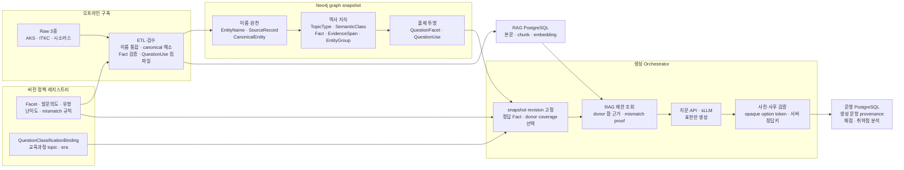
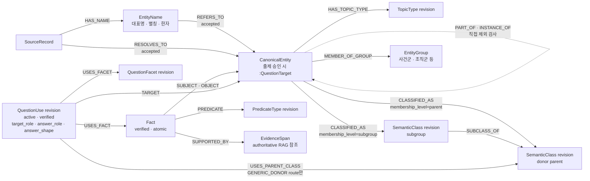

# 한국사 문제 생성용 Neo4j 설계 계약

> 계약 버전: `QG-GRAPH-V1-DRAFT`
> 기준일: 2026-07-16
> 구현 상태: 목표 설계. 현재 ETL·Neo4j·문제 생성 코드와 데이터에는 미적용.

## 1. 범위와 고정 원칙

이 디렉터리 자체가 문제 생성용 Neo4j의 설계 계약이다. 별도의 외부 계약 문서를
전제로 하지 않는다. 이 문서 갱신은 `docs/neo4j`만 대상으로 하며 코드, CSV, 라이브
Neo4j, RAG 또는 운영 DB를 변경하지 않는다.

1. 생성 요청은 키워드와 발문의도로 시작하지만, 이름 문자열은 곧바로 target ID가
   아니다.
2. 이름·한자·별칭과 원천 레코드는 엔터티 해소를 거쳐 하나의 `CanonicalEntity`에
   연결한다. 별칭은 별도 `QuestionTarget`이 아니다.
3. 질문의 기준 대상은 `question target`이다. 같은 donor parent에서 찾은 다른 대상은
   그 대상에게 참인 Fact를 빌려 주는 `donor target`이다. 둘 사이에 영구
   `DONOR_OF` 관계를 저장하지 않는다.
4. 정답은 모델이 생성하지 않는다. active·verified `QuestionUse`가 연결한 target,
   `QuestionFacet`, `Fact`를 먼저 고정한다. donor parent는
   `answer_route=GENERIC_DONOR`인 projection에서만 추가로 고정한다.
5. 일반 오답 donor 자격은 정확한 2홉
   `question target -> donor parent SemanticClass <- donor target`에서만 얻는다.
6. 같은 사건군·집단 membership과 직접 `PART_OF`·`INSTANCE_OF` 관계는 donor pool을
   넓히지 않는다. 2홉 자격 조회 후 중복·포함 관계를 제외하거나 순위를 조정하는 데
   쓴다.
7. 집단 구성원 자체를 묻는 문항은 별도의 관계형 Facet으로 출제한다. 일반
   같은-parent 오답 조회와 섞지 않는다.
8. RAG는 Graph가 고정한 Fact와 authoritative `EvidenceSpan` 범위를 벗어나 정답이나
   donor를 다시 고르지 않는다.
9. donor Fact는 donor에게 참이라는 근거와, question target 문맥으로 옮긴 최종 주장이
   거짓이라는 mismatch proof를 모두 가져야 한다. Graph에 관계가 없다는 사실만으로
   거짓이라고 판정하지 않는다.
10. sLLM은 고정 재료를 문장으로 표현할 뿐 option·Fact·정답 ID를 결정하지 않는다.
11. 취약점 분석의 교육과정 topic·era는 TopicType·SemanticClass와 별도 축이다.

v1 런타임은 positive single-answer `select_correct_statement`만 active로 둔다.
“옳지 않은 것”, 순서형, 보기 조합형은 별도 truth 분포 계약이 생길 때까지 draft다.
78회 문제지와 해설지는 문제 형태를 분석하는 표본이며 역사 Fact나 authoritative
근거의 원천이 아니다.

## 2. 실제 raw 원천

기본 원천 위치는 `etl/raw_data`이고, 아래 세 데이터군만 이 계약의 v1 Graph 입력이다.

| 데이터군 | v1 핵심 입력 | 사용 목적 |
|---|---|---|
| 한국민족문화대백과사전 | `한국민족문화대백과사전/articles_list.jsonl`, `articles_detail.jsonl` | 원천 EID, 대표명·별칭, 구조화 속성, RAG 본문 |
| 한국고전종합DB 관계망 | `한국고전종합DB_관계망/itkc_people.csv`, `itkc_events.csv`, `itkc_person_relations.csv`, `itkc_event_relations.csv` | 인물·사건 원천 ID와 관계 후보 |
| 한국역사용어시소러스 | `교육부 국사편찬위원회_한국역사용어시소러스 정보_20211028 (1).csv` | 원천 용어·분류 경로·시대·한자 후보 |

`articles_errors.jsonl`, `itkc_errors.csv`, `itkc_raw_responses.csv`는 core 입력으로
통칭하지 않는다. 오류·수집 감사 또는 보조 명세로 따로 취급한다. `etl/raw_data`의 다른
자료군도 이 v1 계약에 자동 포함되지 않는다.

raw는 `SourceRecord`, `EntityName`, canonical 후보, 분류 후보, `FactCandidate`, RAG
본문 후보를 제공한다. `SemanticClass`, `QuestionFacet`, `QuestionUse`, 검증 상태,
난이도와 mismatch 규칙은 raw에 없으므로 승인 정책과 검수로 만든다.

## 3. 책임 경계



Neo4j는 검증된 projection과 구조적 조회 재료를 저장한다. Neo4j 자체가 발문의도를
“판단”하거나 난이도·오답 여부를 최종 선고하는 것은 아니다. Orchestrator가 고정된
graph snapshot과 정책 버전 안에서 자격·제외·난이도·mismatch 규칙을 적용한다.

## 4. 핵심 Neo4j 구조



`QuestionUse`는 문제 패턴 노드가 아니다. “이 question target의 이 Fact를 이 Facet과
역할·응답 형태로 출제할 수 있다”는 검증된 투영이다. `Candidate`와 `DonorTarget`도
저장 라벨이 아니라 런타임 변수명이다.

## 5. 핵심 용어

| 용어 | 의미 |
|---|---|
| `CanonicalEntity` | 이름과 원천이 달라도 동일 실체라면 모이는 독립 역사 대상 |
| `canonical_id` | 표시명과 무관한 대상의 안정 논리 ID |
| `EntityName` | 대표명·별칭·자·호·한자명 등 이름 표현. 동일 문자열이 여러 canonical 대상에 연결될 수도 있음 |
| `SemanticClass parent` | 일반 donor 자격을 정하는 구체적 동료 집합. 예: 조선 국왕 |
| `SemanticClass subgroup` | 자격을 넓히지 않고 근접도에 쓰는 더 좁은 집합. 예: 조선 후기 국왕 |
| `QuestionFacet` | 대상의 어느 측면을 어떤 역할·응답 영역으로 물을 수 있는지 정의한 버전 계약 |
| `QuestionUse` | target·Facet·Fact와 역할·형태를 묶고, `GENERIC_DONOR` route에서만 donor parent를 추가로 고정한 출제 가능 투영 |
| `target_role` | question target이 Fact의 subject인지 object인지 |
| `answer_role` | subject, object, whole fact, time 중 무엇이 답인지 |
| `answer_shape` | 답 재료의 구조: `ENTITY`, `FACT_STATEMENT`, `TIME_POINT`, `TIME_RANGE` |
| `question target` | 현재 문항이 묻는 기준 대상. 예: 정조 |
| `donor target` | 같은 parent에서 찾아 자기 Fact를 오답 재료로 제공하는 다른 대상. 예: 영조 |
| `donor Fact` | donor target 문맥에서는 참인 Fact |
| `rendered claim` | donor Fact를 question target 문맥에 대입한 실제 선지 주장. 이 주장에 `FALSE` proof가 필요 |

## 6. 카탈로그와 교육과정 분류

기존의 “TopicType 9개, QuestionFacet 54개”는 고정 계약으로 사용하지 않는다. raw
coverage, 검증 Fact, 실제 생성 성공률을 기준으로 active revision을 늘린다.

- `TopicType`: canonical 대상의 기술적 종류다.
- `SemanticClass`: donor 검색과 근접도 계산을 위한 승인 분류다.
- `QuestionFacet`: 허용 Predicate signature, target/answer role, answer shape, answer domain,
  surface template와 mismatch 규칙을 묶는 출제축이다.
- `CurriculumTopic/Era`: 취약점 보고용이다. `QuestionClassificationBinding`이
  `question_use_revision_id`를 분류 taxonomy에 매핑하며 Neo4j v1에 전체 taxonomy를
  복제하지 않는다.

취약점 보고의 상위 값은 현재 요구사항상 각각 10개다.

```text
topic: 사건, 인물, 정치, 제도, 문화, 사회, 군사, 경제, 사상·종교, 외교
era: 조선, 고려, 삼국시대, 개항기, 현대, 일제강점기,
     남북국시대, 초기국가, 선사시대, 고조선
```

상위/세부 계층과 primary/secondary 분류는 다른 개념이다. 예를 들어 `수취 제도`는
`경제`의 세부 topic이면서, 한 QuestionUse에서 primary 또는 secondary로 지정될 수 있다.

## 7. 버전 원칙

모든 온라인 조회는 하나의 `graph_snapshot_id`를 고정한다. 논리 ID는 버전 간 대상을
가리키고, 실제 배포 노드는 immutable `*_revision_id`로 식별한다. 한 관계가 서로 다른
snapshot의 노드를 연결하면 배포 실패다. 생성 문항에는 graph snapshot, policy,
taxonomy, RAG corpus, 모델·프롬프트 버전과 선택한 모든 revision ID를 저장한다.

## 8. 문서 읽는 순서

| 순서 | 문서 | 내용 |
|---:|---|---|
| 1 | [01_raw_data_eda.md](./01_raw_data_eda.md) | raw 3종에서 추출 가능한 값과 한계 |
| 2 | [02_exam_pattern_analysis.md](./02_exam_pattern_analysis.md) | 78회 표본에서 출제 정책을 도출하는 방법 |
| 3 | [03_storage_and_material_contract.md](./03_storage_and_material_contract.md) | 저장소 책임과 DTO·proof·provenance 계약 |
| 4 | [04_etl_and_entity_resolution.md](./04_etl_and_entity_resolution.md) | raw에서 검증 Graph snapshot까지 ETL |
| 5 | [05_neo4j_generation_schema.md](./05_neo4j_generation_schema.md) | Neo4j 노드·관계·revision·불변식 |
| 6 | [06_distractor_and_difficulty.md](./06_distractor_and_difficulty.md) | 정확한 2홉 donor 조회·제외·난이도 |
| 7 | [07_runtime_generation_pipeline.md](./07_runtime_generation_pipeline.md) | 온라인 생성과 외부 저장소 경계 |
| 8 | [08_validation_and_roadmap.md](./08_validation_and_roadmap.md) | 검증 기준과 구현 순서 |

## 9. 현재 구현과의 차이

- 현재 Neo4j에는 이 목표 스키마와 snapshot/revision 계약이 적재돼 있지 않다.
- 현재 `app/question`은 저장된 문제를 조회·섞기·채점하며 신규 문제를 생성하지 않는다.
- 이 문서들은 목표 계약이며, QA를 통과한 새 snapshot이 배포되기 전까지 현재 Graph를
  문제 생성용 production Graph로 간주하지 않는다.
