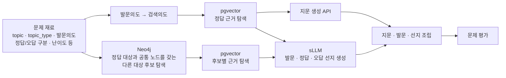

# 02. 문제 생성 흐름과 Neo4j 책임 경계

> 레거시 문서: 이전 문제 생성 경계 설계다. 현재 사실 그래프 기준으로 사용하지 않는다.
>
> 상태: `AGREED-SCOPE`
> 이 문서는 문제 유형을 설계하지 않는다. 전체 흐름에서 Neo4j의 입출력 위치만 고정한다.

## 1. 합의된 전체 흐름



- 재료와 정답 근거는 Neo4j 밖에서 준비한다.
- 문제 유형과 난이도는 다른 단계에서 정한다.
- 지문 생성 API는 지문을 생성하며 정답을 함께 생성하지 않는다.
- Neo4j는 정답 대상을 기준으로 오답에 사용할 다른 대상 후보를 찾는다.
- 후보의 실제 선지 근거는 pgvector/RAG에서 다시 찾는다.
- 정답·발문·선지의 자연어 생성과 최종 평가는 sLLM/평가 계층의 책임이다.

## 2. Neo4j가 받는 최소 입력

검색 서비스와의 정확한 필드명은 구현 시 합의하되 의미는 다음과 같다.

```json
{
  "correct_canonical_id": "정답 대상의 canonical ID",
  "correct_entity_type_id": "person | event | institution | ...",
  "question_intent_id": "재료에 포함된 발문의도 ID",
  "topic_ids": ["정치", "제도"],
  "era_ids": ["조선 후기"],
  "era_match_mode": "SELF_OR_DESCENDANT",
  "allowed_path_pattern_ids": [
    "SIBLING_DETAIL_CLASS",
    "SHARED_ROLE_ASSIGNMENT"
  ],
  "excluded_canonical_ids": []
}
```

`question_intent_id`는 Neo4j가 발문을 생성하기 위한 값이 아니다. 어떤 승인 경로 패턴을
허용할지 선택하는 입력이다. 예를 들어 국가와 왕의 관계를 묻는 재료라면
`SHARED_ROLE_ASSIGNMENT`로 `PersonRole + Polity` 맥락을 사용할 수 있다.

문제 생성/검색 계층은 결정된 난이도를 `allowed_path_pattern_ids`, `specificity_level`,
`taxonomy_distance` 조건으로 변환한다. 물리 hop 수는 요청하거나 난이도에 사용하지 않는다.
문제 생성 문서의 `SemanticClass`는 Graph의 `DetailClass`로 대응하며 별도 노드를 추가하지
않는다.

## 3. Neo4j가 반환하는 것

Neo4j는 선지 문장을 반환하지 않는다. 다음 단계가 RAG 근거를 찾을 수 있도록 후보와
검색 맥락을 반환한다.

```text
후보 canonical ID
대표명과 승인 별칭
entity type
정답과 공유한 anchor
사용한 path pattern ID
DetailClass 계층 패턴의 taxonomy distance
anchor 관계의 evidence ID
후보 RAG 검색어
검증 상태
```

공유 anchor는 후보 선정 이유를 재현할 수 있어야 한다.

```text
정조와 세종
  공통: PersonRole=왕, Polity=조선

정묘호란과 병자호란
  공통: EventType=전쟁, Topic=군사·외교, Polity=조선·후금/청
```

위 예시는 구조 설명이며 실제 연결은 각 원천 근거와 검수를 통과해야 한다.

## 4. 결정 주체

| 결정 | 담당 |
|---|---|
| top-level topic·era ID와 계층 | ETL/Graph 계약 |
| entity type·role·polity·region 카탈로그 | ETL/Graph 계약 |
| 동명이인 해소와 canonical ID | ETL/Graph |
| 관계 의미·방향·근거·검증 상태 | ETL/Graph |
| 검색 가능한 relation allowlist | ETL/Graph와 검색 팀 공동 계약 |
| 후보 점수와 공통 노드 가중치 | 검색 팀 |
| 승인된 path pattern 선택, 후보 개수, 랜덤성 | 검색 팀 |
| PageRank/PPR/Adamic-Adar 사용 여부 | 검색 팀 |
| 후보 근거 RAG query 작성 | 검색/RAG 팀 |
| 문제 유형·난이도·선지 생성 | 문제 생성 팀 |

NLI 또는 검증 LLM은 검색 알고리즘이 아니라 ETL의 사실 검증 수단이다. 어떤 모델을
쓸지는 구현 선택이지만, `VERIFIED` edge를 만들기 위한 검증 절차 자체는 필요하다.

## 5. 이 문서에서 다루지 않는 것

문제 유형별 출제 projection, 정답 token 고정, 오답 문장 판정 규칙, 난이도 공식은 현재
Neo4j 범위에 포함하지 않는다. 필요하면 문제 생성 팀의 별도 문서에서 정의한다.
