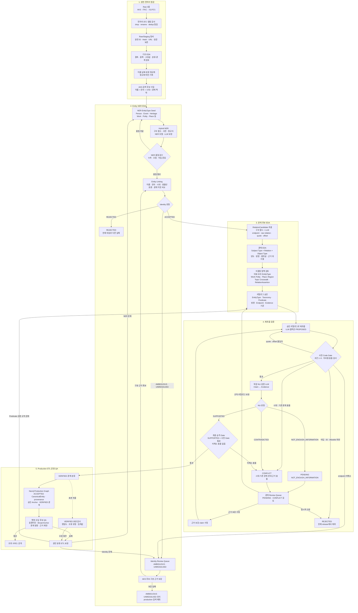

# 04. Raw 3종 분류·연결 ETL

> 레거시 문서: 이전 목표 ETL 설계다. 현재 사실 그래프 기준으로 사용하지 않는다.
>
> 상태: `TARGET-ETL`
> 기준일: 2026-07-17
> 구현 상태: 목표 설계. 현재 전처리 코드가 모두 구현했다는 뜻이 아니다.

## 1. 목표

시소러스의 `term_name`, ITKC의 인물·사건 식별자와 이름을 출발점으로
한국민족문화대백과사전을 찾아 다음 정보를 가능한 한 세밀하게 보강한다.

- 대상의 canonical identity와 승인 별칭
- entity type, topic, era와 세부 분류
- 인물의 역할과 역할을 수행한 국가·시대
- 사건의 종류, 발생 지역, 관련 국가·인물
- 인물과 문화재·제도·조직·사건 사이의 구체 관계
- 각 분류·관계를 지지하는 원문 근거

상세성보다 사실성이 우선이다.

> 원문 또는 승인된 결정 규칙이 명시적으로 뒷받침하는 가장 깊은 단계까지만 적재한다.

## 2. 전체 처리 순서

```mermaid
flowchart LR
    RAW["Raw 3종<br/>원천 ID · 구조 필드 · 본문"]
    STAGE["1. staging<br/>schema · hash · provenance"]
    NORM["2. 이름·날짜·분류 정규화"]
    RETRIEVE["3. AKS 검색 후보 수집"]
    NER["4. NER·사전·정규식<br/>mention 후보"]
    LINK["5. Entity Linking<br/>동일 실체/동명이인 판정"]
    ID_REVIEW0["5a. Identity Review<br/>AMBIGUOUS · UNRESOLVED"]
    ID_HOLD0["상태 유지 · 검색 제외"]
    EXTRACT["6. RelationCandidate 추출<br/>raw 표현 · endpoint · 근거"]
    PROFILE["7. 관계 EDA<br/>타입 조합 · 빈도 · 중의성 · coverage"]
    CONTRACT["8. EntityType·Predicate 계약 승인<br/>방향 · endpoint allowlist · version"]
    VERIFY["9. 사전 Gate · NLI<br/>최종 승격 Gate"]
    REL_REVIEW0["10. 관계 Review<br/>PENDING · CONFLICT"]
    PROD["11. ACCEPTED entity와<br/>VERIFIED 관계만 배포"]

    RAW --> STAGE --> NORM --> RETRIEVE --> NER --> LINK
    LINK -->|"ACCEPTED"| EXTRACT --> PROFILE --> CONTRACT --> VERIFY
    LINK -->|"AMBIGUOUS · UNRESOLVED"| ID_REVIEW0
    ID_REVIEW0 -->|"구분 근거 확보"| LINK
    ID_REVIEW0 -->|"보강 실패"| ID_HOLD0
    VERIFY -->|"VERIFIED"| PROD
    VERIFY -->|"PENDING · CONFLICT"| REL_REVIEW0
    REL_REVIEW0 -->|"보강 후 재검증"| VERIFY
```



NER만으로는 부족하다. NER은 문자열 span이 인물·사건·국가·지역인지 찾을 뿐, 그 span이
어느 canonical 대상인지 또는 어떤 관계인지는 결정하지 못한다.

```text
NER -> Entity Linking -> Relation Extraction -> Evidence Verification
```

위 축약 흐름의 `Relation Extraction`은 두 단계다. 먼저 자유로운 raw 관계 표현을
`RelationCandidate`로 staging한 뒤 EDA하고, EDA로 승인된 Predicate 카탈로그에 매핑한다.
EDA 전 후보 관계는 production Neo4j edge가 아니다.

### 2.1 EDA부터 Production까지의 권장 실행 순서

다음 도식은 위 선형 흐름에 누락된 정규화·AKS 후보 수집, 실패 유형별 재처리, 자동 승격과
수동 감사를 포함한 실제 권장 순서다.



실행 원칙은 다음과 같다.

1. production ETL 전체를 먼저 만들지 않고 raw 손실 여부와 기초 분포를 확인한 뒤 이름·날짜·
   분류를 정규화하고 AKS 검색 후보를 수집한다.
2. NER 모델과 LLM은 mention·분류·관계 후보를 제안하지만 identity와 `VERIFIED`를 확정하지
   않는다.
3. `AMBIGUOUS`와 `UNRESOLVED`는 review queue에서 근거를 보강하고 구분 근거가 확보된
   경우에만 Entity Linking을 다시 수행한다. 보강에 실패하면 기존 상태를 유지하고
   production 검색에서 제외해 무한 재시도하지 않는다. `REJECTED`는 현재 identity 후보의
   종착 상태다.
4. Entity Linking을 통과한 endpoint만 RelationCandidate 추출에 사용하고, 관계 EDA와 표본
   검수로 Predicate 계약을 승인한 뒤 승인 카탈로그로 재추출한다.
5. `04 §10`의 최종 code gate는 NLI 전 사전 Gate와 NLI 후 최종 승격 Gate로 나눈다. 사전
   Gate는 quote·offset·ID·타입·시대·allowlist 같은 저비용 조건을 먼저 검사하고, 최종 Gate는
   `SUPPORTED`와 미해소 충돌 여부를 함께 검사한다.
6. 사전 Gate 실패는 원인별로 처리한다. quote·offset 불일치는 재추출, endpoint 미해소는
   Entity Linking, 타입·ID·allowlist 위반은 현재 release에서 제외, 시대·기존 관계 충돌은
   `CONFLICT` 검토로 보낸다.
7. `SUPPORTED`는 최종 Gate를 통과하면 수동 전수 검수 없이 `VERIFIED`로 승격한다. 수동
   검수는 `PENDING/CONFLICT` review와 VERIFIED 표본 정밀도 감사라는 두 역할로 분리한다.
8. `PENDING`은 새 근거가 확보되면 claim을 보강해 재추출할 수 있고, 운영 QA나 표본 감사에서
   오류가 발견되면 원인에 따라 NER·Entity Linking·카탈로그 단계로 돌아간다.
9. production Graph에는 `ACCEPTED` CanonicalEntity뿐 아니라 SourceRecord·EntityName·
   EvidenceSpan provenance, 승인 Anchor와 `VERIFIED` 관계를 함께 적재한다.

권장 순서는 다음 한 줄로 요약된다.

```text
전처리 감사 → 기초 EDA → 정규화 → AKS 후보 수집 → NER → Entity Linking
→ LLM 관계 추출 → 관계 EDA → 카탈로그 확정 → 재추출 → 사전 Code Gate
→ NLI → 최종 승격 Gate → Production ETL → 운영 QA
```

## 3. 원천별 입력과 사용 한계

### 3.1 한국민족문화대백과사전

주요 키는 `eid`다.

| 필드 | 사용 |
|---|---|
| `headword`, `origin`, `articleAliases` | 대표명·한자·별칭 후보 |
| `field`, `primaryType*`, `contentsType` | entity type·topic 후보 |
| `era` | era·세부 시대 후보 |
| `definition`, `summary`, `body` | NER·관계 추출·근거 검증·RAG |
| `articleAttributes` | 구조화 관계 후보 |
| `relatedArticles` | 추가 검색 후보만 제공 |

`relatedArticles` 자체에는 관계 의미가 없으므로 `건설했다`, `창건했다`, `지휘했다` 같은
typed relation으로 바꾸지 않는다.

### 3.2 한국고전종합DB 관계망

```text
itkc_people.csv
  person_id, name, birth_year, death_year, bonkwan, ja, ho, father, ...

itkc_events.csv
  scope, event_id, event_name, subject_category, period, event_date, ...

itkc_person_relations.csv
  person_id, person_name, relation_type, related_person_id, ...

itkc_event_relations.csv
  event_id, event_name, relation_type, person_id, person_name, ...
```

`person_id`와 `event_id`는 AKS `eid` 또는 시소러스 `term_id`와 같은 ID가 아니다.
`itkc_people.csv`는 관계 endpoint에 나오지 않는 인물도 있으므로 독립적인 마스터
입력으로 사용한다.

ITKC 인물 관계는 방향·역관계 규칙이 확인된 범위에서 후보로 사용한다. 사건-인물 관계의
원천 `relation_type=사건인물`은 참여자·지휘관·명령자 등을 구분하지 못한다.

```text
ASSOCIATED_WITH_EVENT
relation_status = PENDING
search_anchor_eligible = false
```

AKS 본문 등에서 구체 역할이 확인된 후에만 `PARTICIPATED_IN`, `COMMANDED`, `ORDERED`로
승격한다.

### 3.3 한국역사용어시소러스

```text
term_id, topterm_id, term_name, term_kind, term_ch,
term_remark, term_attr, term_year, term_times,
term_lk, term_desc, ...
```

`term_lk`는 `>>`로 복수 경로를 나누고 각 경로를 `>`로 계층화한다. 원천 분류 경로는
세부 분류 후보를 만드는 강한 신호지만 목표 taxonomy와 같다고 가정하지 않는다.
`term_name`만 같은 행이 많으므로 이름만으로 AKS·ITKC와 병합하지 않는다.

## 4. AKS 검색 후보 생성

각 원천 레코드는 이름 하나만 검색하지 않고 구분 정보를 함께 사용한다.

### 4.1 인물 검색어

```text
이름 + 한자
이름 + 생몰년/시대
이름 + 본관
이름 + 자/호
이름 + 부친/관계 인물
이름 + 관련 사건
```

### 4.2 사건 검색어

```text
사건명 + 날짜/시대
사건명 + 참여 인물
사건명 + 관련 사건
사건명 + 지역
```

### 4.3 용어 검색어

```text
term_name + term_ch
term_name + term_remark
term_name + term_times/term_year
term_name + term_lk 상위 경로
```

검색 결과는 identity 후보일 뿐이다. 이름이 일치해도 바로 연결하지 않는다.

## 5. NER 설계

### 5.1 대상 entity

한국사 본문에 맞춘 최소 NER 유형은 다음과 같다.

```text
PERSON
EVENT
POLITY
PLACE / REGION
ORGANIZATION
INSTITUTION
HERITAGE
DOCUMENT / WORK
ROLE / TITLE
PERIOD / REIGN
DATE
RELIGION / THOUGHT
CONCEPT
```

### 5.2 hybrid 추출

1. AKS·ITKC·시소러스의 구조 필드를 우선한다.
2. 세 원천에서 만든 이름·별칭·한자 사전을 적용한다.
3. 연도, 왕대, 관직 표기 등은 정규식과 결정 규칙을 적용한다.
4. 사전에서 놓친 본문 span만 NER 모델로 보완한다.

일반 NER 모델은 역사 인명·관직·고유 사건을 놓칠 수 있다. 이미 `person_name`,
`event_name`, `term_name`으로 타입이 주어진 필드에 NER을 다시 적용하는 것보다 AKS
본문의 관계 endpoint를 찾는 데 사용한다.

NER 산출물은 아직 Graph edge가 아니다.

```json
{
  "mention": "정조",
  "mention_type": "PERSON",
  "start": 123,
  "end": 125,
  "source_record_id": "AKS_DETAIL:E..."
}
```

## 6. Entity Linking과 동명이인 방어

### 6.1 공통 규칙

이름 일치는 후보 생성에만 사용한다. 자동 승인에는 최소 두 종류 이상의 독립적인
구분 신호가 필요하며, 강한 충돌이 하나라도 있으면 승인하지 않는다.

### 6.2 인물 feature

```text
정규화 이름과 한자
생몰년과 활동 시대
본관, 자, 호
부친과 가족 관계
역할·관직
활동 국가
관련 인물·사건·저서·문화재
AKS definition/summary의 핵심 설명
```

생몰년이 양립하지 않거나 국가·시대가 명백히 다르면 이름이 같아도 별도 canonical
대상으로 둔다.

### 6.3 사건 feature

```text
정규화 사건명
발생 날짜·기간
시대와 관련 국가
참여 인물
발생 지역
상위 사건군·관련 사건
사건 종류
```

### 6.4 용어 feature

```text
term_name, term_ch, term_remark
term_times, term_year
term_lk 경로
term_desc의 정의
entity type 호환성
```

### 6.5 상태

```text
ACCEPTED   동일 실체임을 충분히 확인
AMBIGUOUS  복수 후보를 구분할 근거 부족
UNRESOLVED 대응 canonical 후보 없음
REJECTED   다른 실체 또는 타입·시대 충돌
```

`AMBIGUOUS`와 `UNRESOLVED`를 임의의 첫 검색 결과에 붙이지 않는다. 이 두 상태는
production 검색 anchor에서 제외하고 review queue로 보낸다.

## 7. 다축 분류

한 대상에 다음 축을 독립적으로 연결한다.

```text
EntityType
Topic
Era
Polity
PersonRole
Region
세부 분류(EventType, InstitutionType, HeritageType 등)
```

### 7.1 top-level topic

```text
사건, 인물, 정치, 제도, 문화, 사회, 군사, 경제, 사상·종교, 외교
```

topic은 다중값을 허용한다. topic label의 구두점 차이는 안정 ID로 정규화하며
`사상, 종교`, `사상·종교`를 별도 노드로 만들지 않는다.

### 7.2 top-level era

```text
조선, 고려, 삼국시대, 개항기, 현대, 일제강점기,
남북국시대, 초기국가, 선사시대, 고조선
```

era도 복수값을 허용할 수 있다. 시대 경계에 걸친 인물·사건을 하나로 강제하지 않는다.
연도나 왕대가 있으면 승인된 기간표로 세부 시대를 계산한다. 기간표가 없거나 경계 정책이
정해지지 않은 경우 LLM이 세부 시대를 결정하지 않는다.

### 7.3 시대와 국가 구분

- `조선 전기/후기`는 era 하위 분류다.
- `부여·옥저·동예·마한·진한·변한`은 polity다.
- polity는 `EXISTED_DURING`으로 era와 연결한다.
- 인물·사건·제도는 `ASSOCIATED_WITH_POLITY`와 `IN_ERA`를 각각 가질 수 있다.

### 7.4 역할 맥락

`Person-[:HAS_ROLE]->Role`만 만들면 어느 국가·시대의 역할인지 잃을 수 있다. 역할이
역사 맥락을 요구하면 `RoleAssignment`를 사용한다.

```text
Person -> RoleAssignment -> PersonRole
                         -> Polity
                         -> Era
                         -> EvidenceSpan
```

`왕-국가` 연결은 이 구조로 보존한다.

## 8. 관계 후보 EDA와 Predicate 확정

처음부터 전체 Predicate 카탈로그를 확정하지 않는다. 최소 seed는 extractor 출력 형식을
통제하는 용도로만 사용하고, 실제 원천에서 `RelationCandidate`를 수집한 뒤 카탈로그를
재정의한다.

각 후보는 최소한 다음 값을 보존한다.

```text
subject_canonical_id · subject_entity_type
raw_relation_text · normalized_relation_candidate
object_canonical_id · object_entity_type
source_record_id · evidence_quote · offsets
extractor_version · candidate_status=PENDING
```

EDA에서는 다음을 집계한다.

```text
subject EntityType × raw 관계 표현 × object EntityType
원천별 빈도와 coverage
EvidenceSpan 회수율
관계 방향·역관계·대칭성의 안정성
동일 표현의 다의성
시점·기간 문맥 보존 필요성
```

다음 표는 **EDA seed 예시**이며 production allowlist가 아니다.

| Predicate 예 | subject | object | 주의 |
|---|---|---|---|
| `HAS_ROLE_ASSIGNMENT` | Person | RoleAssignment | role·polity·era 근거 필요 |
| `RULED` | Person | Polity | 왕·군주였다는 명시 근거 필요 |
| `PARTICIPATED_IN` | Person | Event | 단순 관련 링크로 생성 금지 |
| `COMMANDED` | Person | MilitaryUnit/Event | 지휘의 명시 근거 필요 |
| `ORDERED_CONSTRUCTION` | Person | Heritage | 명령과 직접 건설 구분 |
| `PROMOTED_CONSTRUCTION` | Person | Heritage | 추진 표현에 사용 |
| `BUILT` | Person/Organization | Heritage | 직접 건설 주체 근거 필요 |
| `REBUILT` | Person/Organization | Heritage | 창건과 중건 구분 |
| `OCCURRED_IN` | Event | Region | 발생 장소 근거 필요 |
| `ASSOCIATED_WITH_POLITY` | Entity | Polity | 관계 맥락 근거 필요 |
| `FOUNDED` | Person/Organization | Institution/Organization | 설립·창건 의미 구분 |
| `PART_OF` | Event/Institution/Heritage/Work 후보 | CanonicalEntity | 포함·구성·사건군 의미 구분 |
| `PRECEDED`/`RESULTED_IN` | Event 후보 | Event 후보 | 시간 순서와 인과를 혼용하지 않음 |
| `DEPICTS`/`DOCUMENTS`/`DEDICATED_TO` | Heritage/Work 후보 | CanonicalEntity | 작품·문헌 EntityType 채택 여부와 함께 검토 |

EDA 종료 후에는 Predicate마다 이름·정의·방향·subject/object allowlist·역관계·대칭성·
시간 속성·근거 기준을 승인하고 `predicate_catalog_version`을 발급한다. 이후 LLM은 승인
카탈로그 밖의 새 관계명을 production 후보로 만들 수 없다. 의미가 맞는 Predicate가 없으면
`UNKNOWN_PREDICATE`로 남겨 다음 EDA와 검토 대상으로 보낸다.

`Work`·`Polity`의 EntityType 채택, Place–Region 연결, DetailClass–Topic 매핑,
Person–Person/Organization 관계도 이 EDA 결과와 표본 검수 후 확정한다.

## 9. LLM 분류·추출 계약

LLM은 identity를 최종 결정하지 않고, 제공된 canonical 후보와 허용 카탈로그 안에서
분류·관계 후보를 만든다.

시스템 프롬프트에는 최소한 다음을 넣는다.

```text
1. 제공된 원문 근거만 사용하고 외부 지식을 보충하지 않는다.
2. 원문이 명시하지 않은 분류와 관계는 UNKNOWN으로 반환한다.
3. 허용된 taxonomy ID와 predicate ID만 사용한다.
4. ID, 인물, 사건, 국가, 지역, 관계를 새로 만들어내지 않는다.
5. 동일 이름의 canonical 후보를 구분할 근거가 부족하면 AMBIGUOUS로 반환한다.
6. 관계를 원문의 표현보다 강하게 바꾸지 않는다.
7. 모든 판정에 원문의 정확한 인용 span과 offset을 반환한다.
8. 여러 해석이 가능하면 가장 구체적인 해석을 추측하지 않는다.
```

구조화 출력 예시는 다음과 같다.

```json
{
  "subject_mention": "정조",
  "subject_canonical_id": "canonical:person:...",
  "subject_link_status": "ACCEPTED",
  "predicate_id": "PROMOTED_CONSTRUCTION",
  "object_mention": "수원 화성",
  "object_canonical_id": "canonical:heritage:...",
  "object_link_status": "ACCEPTED",
  "topic_ids": ["topic:politics", "topic:culture"],
  "era_ids": ["era:joseon_late"],
  "polity_ids": ["polity:joseon"],
  "evidence_quote": "...원문에 실제 존재하는 짧은 구절...",
  "evidence_start": 100,
  "evidence_end": 120,
  "classification_status": "PROPOSED"
}
```

LLM 출력은 항상 `PROPOSED`다. 모델이 스스로 `VERIFIED`를 선언할 수 없다.

## 10. 방어 로직과 NLI

NLI는 Natural Language Inference다. 원문 근거와 Graph에 넣으려는 claim을 비교해 다음
중 하나를 판정한다.

```text
SUPPORTED
CONTRADICTED
NOT_ENOUGH_INFORMATION
```

예를 들어 근거가 `정조는 수원 화성 축조를 추진했다`인데 claim이 `정조가 수원 화성을
직접 건설했다`라면 `NOT_ENOUGH_INFORMATION`이어야 한다.

NLI 모델이 필수라는 뜻은 아니다. 규칙과 별도 검증 LLM으로 구현할 수도 있다. 다만
같은 생성 LLM의 confidence만 믿지 않고 claim-evidence 검증 단계를 둬야 한다.

검증은 `사전 Code Gate → NLI → 최종 승격 Gate`의 두 gate 구조로 수행한다. 사전 Code
Gate는 NLI를 호출하기 전에 다음 저비용·결정적 조건을 검사한다.

1. `evidence_quote`가 해당 원문에 정확히 존재하고 offset이 일치한다.
2. subject와 object의 link status가 모두 `ACCEPTED`다.
3. predicate가 allowlist에 있다.
4. subject/object entity type이 Predicate signature와 호환된다.
5. 구조화 생몰년·날짜·시대와 명백한 충돌이 없다.
6. 허용 taxonomy ID만 사용했다.

사전 Gate 실패는 하나의 `PENDING`으로 합치지 않는다.

```text
quote/offset 불일치         -> 재추출
endpoint 미해소             -> Entity Linking review
Predicate/타입/taxonomy 위반 -> 현재 release에서 REJECTED 또는 제외
구조화 시대 충돌            -> CONFLICT review
```

사전 Gate를 통과한 claim만 NLI 또는 독립 검증 LLM에 전달한다. NLI 판정 후 최종 승격
Gate는 다음 조건을 모두 검사한다.

1. 사전 Code Gate를 통과했다.
2. claim 검증 결과가 `SUPPORTED`다.
3. 충돌하는 기존 `VERIFIED` 관계가 없거나 검토가 끝났다.

최종 승격 Gate를 통과해야만 `VERIFIED`가 된다. `SUPPORTED` 결과 전체에 수동 전수 검수를
요구하지 않으며, `VERIFIED` 관계는 별도 표본 감사로 정밀도를 확인한다.

```text
사전 Gate 통과 + SUPPORTED + 충돌 없음 -> VERIFIED
NOT_ENOUGH_INFORMATION                -> PENDING
CONTRADICTED                          -> CONFLICT 또는 REJECTED
```

## 11. production 적재 경계

| 산출물 | production 검색 Graph |
|---|---:|
| `ACCEPTED` `SourceRecord`와 provenance | 적재 |
| `ACCEPTED` `EntityName -> CanonicalEntity` | 적재 |
| `AMBIGUOUS`/`UNRESOLVED` link | 검색 Graph에서 제외 |
| 승인된 taxonomy·role·polity·era 노드 | 적재 |
| proposed relation | 제외 |
| VERIFIED relation과 evidence 참조 | 적재 |
| 원문 전체와 embedding | pgvector/RAG에 저장 |
| 문제 유형·난이도·프롬프트 | 제외 |

## 12. 재실행과 감사

다음 버전이 바뀌면 영향받은 후보와 관계를 다시 계산한다.

```text
source file hash
name normalization version
AKS retrieval version
NER/gazetteer version
entity linking policy version
taxonomy and period rule version
relation extractor/predicate catalog version
verification policy/model/prompt version
```

각 production 관계에서 원천 레코드, extractor, prompt/model, 검증 결과, reviewer와
evidence ID를 역추적할 수 있어야 한다.
