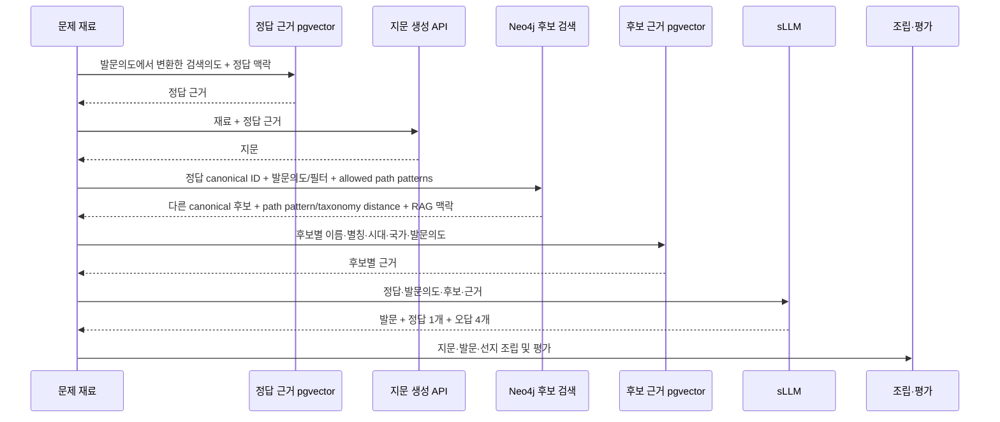

# 07. 런타임 문제 생성 연결 흐름

> 레거시 문서: 이전 런타임 연결 설계다. 현재 사실 그래프 기준으로 사용하지 않는다.
>
> 상태: `INTEGRATION-BOUNDARY`
> Neo4j 단계의 앞뒤 계약을 설명하며 문제 생성 전체를 Neo4j가 소유한다는 뜻이 아니다.

## 1. 전체 흐름



문제 유형과 난이도는 다른 단계에서 랜덤 결정된다. Neo4j는 이를 정하거나 저장하지 않는다.

## 2. Neo4j 호출 전 조건

호출자는 다음을 확인한다.

1. 정답 대상이 canonical ID로 해소됐다.
2. 발문의도와 재료의 topic/era 맥락이 있다.
3. 같은 문제에서 제외해야 할 canonical ID 목록이 있다면 전달한다.
4. 특정 Graph 배포본 재현이 필요하면 `graph_release_id`를 전달한다.
5. 난이도 정책에서 선택한 `allowed_path_pattern_ids`와 specificity·taxonomy distance 조건을 전달한다.

정답이 문자열만 있고 canonical ID가 없으면 검색 전에 entity resolution endpoint를 별도로
호출한다. 이름이 복수 canonical 대상에 매칭되면 임의의 첫 결과를 사용하지 않는다.

```text
1개 ACCEPTED -> 후보 검색 진행
복수 후보      -> AMBIGUOUS 오류/검토
0개            -> UNRESOLVED, 검색 중단
```

## 3. Neo4j 처리

Neo4j query layer는 다음 순서로 처리한다.

```text
정답 canonical/EntityType 검증
-> 요청 발문의도에 허용된 path pattern 선택
-> path pattern 카탈로그의 축·방향·검증 조건 적용
-> VERIFIED 공통 노드 경로 조회
-> 동일 대상·별칭·미승인 관계 제외
-> 후보별 shared anchor와 RAG search context 조립
-> 검색 팀의 랭킹/샘플링 계층으로 전달
```

후보가 부족해도 다음 fallback은 금지한다.

- `PENDING` 관계 사용
- 동명이인 후보 자동 병합
- `Person`, `조선`, `정치` 같은 broad node 하나만으로 전체 후보 확장
- 관계 type 또는 방향 무시

후보 부족은 데이터 coverage 또는 요청 조건 문제로 명시적으로 반환한다.

## 4. 후보별 RAG

각 후보의 근거 검색에는 다음을 넘긴다.

```json
{
  "graph_release_id": "graph:...",
  "candidate_canonical_id": "...",
  "canonical_name": "...",
  "aliases": ["..."],
  "entity_type_id": "...",
  "polity_names": ["..."],
  "era_names": ["..."],
  "role_or_detail_names": ["..."],
  "question_intent_id": "...",
  "shared_anchors": [
    {
      "axis": "role_context",
      "path_pattern_id": "SHARED_ROLE_ASSIGNMENT",
      "role_id": "role:king",
      "polity_id": "polity:joseon",
      "correct_assignment_id": "assignment:correct:...",
      "candidate_assignment_id": "assignment:candidate:...",
      "taxonomy_distance": null,
      "correct_evidence_ids": ["evidence:correct:..."],
      "candidate_evidence_ids": ["evidence:candidate:..."]
    }
  ]
}
```

`shared_anchors`는 Graph 결과 객체를 그대로 전달한다. `anchor_id`, `path_pattern_id`,
`taxonomy_distance`를 서로 다른 병렬 배열로 분해하지 않는다. 그래야 `role_context`와
`typed_relation`처럼 단일 `anchor_id`가 없는 복합 경로도 손실 없이 전달된다.

후보별 RAG는 후보의 선지 내용을 지지하는 근거를 찾아야 한다. Graph에서 같은 공통 노드를
탔다는 사실만으로 선지의 구체 문장을 생성하지 않는다.

RAG 결과가 없거나 동명이인을 구분하지 못하면 해당 후보를 탈락시키고 reserve 후보를
사용한다. reserve 후보 정책과 개수는 검색/생성 팀이 결정한다.

## 5. sLLM 전달 시 주의

sLLM에는 후보 이름만 주지 않고 후보별 canonical 맥락과 근거를 분리해 전달한다.

```text
correct evidence
candidate A evidence
candidate B evidence
...
```

후보의 Graph evidence와 RAG evidence도 구분한다.

- Graph evidence: 정답과 후보가 공통 anchor를 갖는 이유
- RAG evidence: 생성할 선지의 내용이 사실인 이유

sLLM이 새로운 인물·사건·국가를 만들거나 후보 canonical 대상을 바꾸지 못하게 한다.

## 6. 평가와 provenance

최종 문제에는 최소한 다음 provenance를 남기는 것이 좋다.

```text
correct_canonical_id
candidate_canonical_ids
graph_release_id
shared_anchors  # path pattern, relation/assignment ID, taxonomy distance, 양쪽 evidence 포함
candidate RAG document/chunk IDs
생성 모델·prompt version
평가 결과
```

이 저장 위치와 형태는 운영 DB 팀이 정한다. Neo4j에 생성 문제 전체를 저장할 필요는 없다.

## 7. 실패 코드 권장안

| 코드 | 의미 | 처리 |
|---|---|---|
| `CORRECT_ENTITY_UNRESOLVED` | 정답 canonical ID 없음 | 입력 보정/검토 |
| `CORRECT_ENTITY_AMBIGUOUS` | 정답이 동명이인 복수 후보 | 자동 진행 금지 |
| `NO_VERIFIED_ANCHOR` | 사용할 검증 anchor 없음 | ETL coverage 개선 |
| `INSUFFICIENT_CANDIDATES` | 조건을 만족하는 다른 대상 부족 | 검색 정책/재료 검토 |
| `CANDIDATE_RAG_NOT_FOUND` | 후보 근거 검색 실패 | reserve 후보 사용 |
| `GRAPH_RELEASE_MISMATCH` | 요청과 조회 배포본 불일치 | 재시도/설정 수정 |

실패를 감추기 위해 미검증 관계를 사용하는 것보다 문제 생성을 건너뛰는 편이 안전하다.

## 8. 검색 팀에 넘길 결정

다음은 이 문서에서 고정하지 않는다.

- 후보 점수식과 anchor 가중치
- PageRank/PPR/Adamic-Adar 사용 여부
- 승인된 path pattern 안의 선택과 후보 수
- 랜덤 sampling과 reserve 후보 순서
- 난이도별 유사도 조절
- latency 최적화와 cache 전략

단, 어떤 방식을 쓰더라도 `ACCEPTED` 대상과 `VERIFIED` 관계만 사용하고 후보별
`shared_anchors`를 반환해야 한다.
