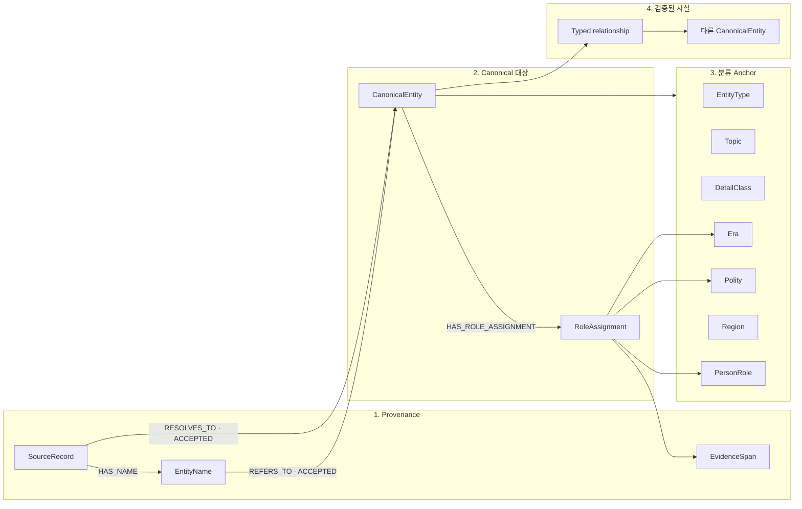

# 09. Graph 설계 근거와 조회 가이드

> 레거시 문서: 이전 범용 Graph 설명서다. 현재 사실 그래프 기준으로 사용하지 않는다.
>
> 상태: `TARGET-GUIDE`
> 기준일: 2026-07-18
> 범위: 범용 Neo4j 골격의 설계 이유, production 노드·관계의 의미, 챗봇·오답 후보 조회 방법과 안전수칙

이 문서는 새로운 스키마를 추가로 제안하는 문서가 아니다. `05_neo4j_generation_schema.md`의
확정 골격을 사람이 이해하고 query를 안전하게 작성할 수 있도록 설명한다. EntityType,
Predicate, Place–Region 매핑처럼 EDA 후 결정할 내용은 확정값처럼 설명하지 않는다.

## 1. 왜 이 구조가 필요한가

한국사 원천을 단순히 `Person`, `Event` 노드와 `RELATED_TO` 관계로 적재하면 다음 문제가
발생한다.

1. AKS `eid`, ITKC `person_id/event_id`, 시소러스 `term_id`가 서로 다른 ID 체계라 같은
   대상을 중복 생성하기 쉽다.
2. 이름 하나가 여러 동명이인을 가리키고 한 대상도 묘호·한자·자·호 등 여러 이름을 가진다.
3. `조선`, `정치`, `왕`, `조선 후기`는 각각 정치체·주제·역할·시대인데 한 분류 트리에
   넣으면 의미가 섞인다.
4. 인물의 역할은 국가·시대에 따라 달라지므로 `Person-[:HAS_ROLE]->왕`만으로는 사실의
   문맥을 보존할 수 없다.
5. `관련 있음`을 하나의 관계로 저장하면 참여·지휘·명령·건설·추진처럼 강도가 다른
   역사 사실을 구분할 수 없다.
6. 챗봇은 사실의 방향과 근거가 필요하고, 오답 후보 검색은 정답과 공유한 분류·맥락이
   필요하다.
7. LLM이 추출한 내용은 틀릴 수 있으므로 원문 span, 검증 상태, 정책 버전을 역추적해야 한다.

따라서 Graph를 다음 책임으로 분리한다.



핵심은 다음과 같다.

- `CanonicalEntity`는 검색 대상의 단일 진입점이다.
- Anchor는 대상의 분류·비교 기준이고 typed relationship는 대상 사이의 역사 사실이다.
- `RoleAssignment`는 역할·국가·시대가 함께 성립하는 문맥을 보존한다.
- 모든 production 연결은 provenance와 승인 버전으로 재현할 수 있어야 한다.

## 2. 노드의 의미와 조회 용도

### 2.1 Provenance와 identity

| 노드 | 의미 | 주요 조회 용도 | 주의사항 |
|---|---|---|---|
| `SourceRecord` | 특정 원천·release의 논리 레코드 | 사실과 이름의 출처 역추적 | AKS·ITKC·시소러스 ID를 서로 같은 ID로 취급하지 않는다. production에는 `ACCEPTED`만 투영한다. |
| `EntityName` | 대표명·별칭·한자·자·호 등 하나의 표기 occurrence | 이름 검색, 별칭 확장, 동명이인 후보 생성 | `normalized_name`은 UNIQUE가 아니다. 같은 이름이 여러 canonical 대상을 가리킬 수 있다. |
| `CanonicalEntity` | 원천이 달라도 같은 역사 실체를 나타내는 검색 대상 | 챗봇 사실 조회와 후보 검색의 시작점 | 이름 문자열로 직접 만들지 않는다. `resolution_status=ACCEPTED`만 production 조회에 사용한다. |
| `EvidenceSpan` | 원문의 짧은 quote와 document/chunk/offset 참조 | 관계 검증, 답변 근거와 감사 | 원문 전체나 embedding을 넣지 않는다. quote와 offset이 실제 원문과 일치해야 한다. |

`CanonicalEntity`는 현재 `Person`, `Event`, `Institution`, `Heritage`, `Place`,
`Organization`, `Concept`를 공통 대상으로 수용한다. `Work`, `Polity`를 독립 검색 대상으로
채택할지는 EDA 후 결정한다. 보조 label이 있더라도 모든 대상은 `CanonicalEntity` label과
안정된 `canonical_id`를 가져야 한다.

### 2.2 분류 Anchor

Anchor는 후보를 비교하고 대상을 필터링하는 분류 기준점이다. 모든 물리 Anchor는 공통
`:Anchor` label, `anchor_id`, `axis`, `specificity_level`, `search_eligible`, 검증 상태와
taxonomy 버전을 가진다.

| 노드 | 의미 | 예 | 검색 용도 | 주의사항 |
|---|---|---|---|---|
| `EntityType` | 대상의 기술적 종류 | Person, Event, Heritage | 다른 종류의 오답 혼입 방지 | 대표·보조 타입 정책은 EDA 후 확정한다. 현재 후보 검색은 동일 주 타입을 전제로 한다. |
| `Topic` | 내용상 넓은 주제, 복수 허용 | 정치, 제도, 문화, 군사 | 주제 필터와 취약점 분석 | `인물`, `사건`, `정치`, `조선`처럼 degree가 큰 값은 단독 후보 자격으로 쓰지 않는다. |
| `DetailClass` | 구체적인 의미 분류 | 정변, 조세 제도, 회화 | 직접·상하·형제 분류 후보 검색 | 원천 또는 승인 규칙이 지지하는 깊이까지만 연결한다. 다른 축과 `SUBCATEGORY_OF`로 섞지 않는다. |
| `Era` | 시간대·역사 시기 | 조선, 조선 후기 | 시대 필터와 계층 확장 | 세부 시대 근거가 없으면 상위 시대에서 하위 시대를 추측하지 않는다. |
| `Polity` | 국가·정치체 | 조선, 고려, 부여, 마한 | 국가 문맥 필터 | 같은 이름의 Era와 별도 노드다. `조선:Polity`와 `조선:Era`를 합치지 않는다. |
| `Region` | 위치·공간 분류 | 한성, 수원, 전라도 | 소재지·발생지 검색 | `LOCATED_IN`과 `OCCURRED_IN`의 의미를 혼용하지 않는다. Place–Region 매핑은 EDA 후 확정한다. |
| `PersonRole` | 사람이 수행한 역할 | 왕, 장군, 학자, 승려 | 역할 기반 인물 비교 | 국가·시대 문맥이 필요한 역할은 직접 연결하지 않고 `RoleAssignment`를 사용한다. |

`Topic`과 `DetailClass`는 모두 분류지만 같은 축이 아니다. `DetailClass-[:SUBCATEGORY_OF]
->DetailClass`는 허용되지만 `DetailClass-[:SUBCATEGORY_OF]->Topic`은 허용하지 않는다.
`ALIGNED_WITH_TOPIC`은 EDA 후 채택할 수 있는 taxonomy mapping 후보이며, 채택하더라도
production Topic 검색의 단일 진실원칙은 `CanonicalEntity-[:HAS_TOPIC]->Topic`이다.

### 2.3 문맥과 관계 감사 노드

| 노드 | 의미 | 검색 용도 | 주의사항 |
|---|---|---|---|
| `RoleAssignment` | 한 인물이 특정 역할을 특정 정치체·시대에서 수행했다는 묶음 | 같은 국가의 왕, 같은 시대의 역할 비교 | 역할만 확인됐으면 `ROLE`만 연결한다. 국가·시대를 추측해서 채우지 않는다. |
| `RelationAssertion` | 하나의 관계에 여러 근거·검토 이력을 연결하기 위한 선택적 감사 노드 | 관계 변경 이력과 다중 근거 감사 | direct edge와의 원본·projection 정책 및 승격 기준은 아직 결정 대상이다. |

`RelationCandidate`는 production 노드가 아니라 staging 중간 산출물이다. endpoint 관계뿐
아니라 생몰년·소재지처럼 검증 후 속성 또는 분류 관계로 투영될 구조화 사실 후보도 포함한다.

## 3. 관계의 의미

### 3.1 이름·실체 해소 관계

| 관계 | 시작 → 끝 | 의미 | 검색 조건 |
|---|---|---|---|
| `HAS_NAME` | SourceRecord → EntityName | 원천 레코드에 해당 표기가 존재 | provenance용이며 이름 문자열만으로 identity를 확정하지 않는다. |
| `REFERS_TO` | EntityName → CanonicalEntity | 표기가 해당 canonical 대상을 가리킴 | `match_status=ACCEPTED`만 사용한다. |
| `RESOLVES_TO` | SourceRecord → CanonicalEntity | 원천 레코드가 해당 실체로 해소됨 | `match_status=ACCEPTED`만 사용한다. |

이 구조 때문에 챗봇이 이름을 받았을 때 바로 `display_name` 하나를 선택하지 않고 승인 별칭과
동명이인 후보를 함께 확인할 수 있다. 이름 검색 결과가 여러 개면 임의로 첫 번째 대상을
사용하지 않고 시대·한자·관계 맥락으로 재질문하거나 entity resolution을 수행한다.

### 3.2 대상-분류 관계

| 관계 | 시작 → 끝 | 의미 | 검색 시 해석 |
|---|---|---|---|
| `HAS_ENTITY_TYPE` | CanonicalEntity → EntityType | 대상의 기술적 종류 | 오답 후보는 원칙적으로 정답과 같은 주 타입이어야 한다. |
| `HAS_TOPIC` | CanonicalEntity → Topic | 대상이 다루는 내용상 주제 | 복수 허용. broad Topic 단독으로 사실 관계를 추론하지 않는다. |
| `CLASSIFIED_AS` | CanonicalEntity → DetailClass | 승인된 구체 분류 | `ASSERTED` 분류를 기준으로 계층 거리와 후보 의미를 계산한다. |
| `IN_ERA` | CanonicalEntity/RoleAssignment → Era | 활동·발생 또는 역할 수행 시대 | endpoint 종류의 의미를 확인하고 세부 시대를 추측하지 않는다. |
| `ASSOCIATED_WITH_POLITY` | CanonicalEntity → Polity | 대상과 정치체의 검증된 일반 문맥 | `RULED`, `SERVED_UNDER` 같은 구체 사실과 같은 뜻이 아니다. |
| `LOCATED_IN` | Place/Heritage/Institution → Region | 대상의 소재지 | Person에 사용하지 않는다. 인물 위치 관계는 EDA 후 별도 Predicate로 정한다. |
| `OCCURRED_IN` | Event → Region | 사건의 발생지 | 소재지와 활동지를 대신하지 않는다. |

분류 관계는 typed historical Predicate 카탈로그의 대상이 아니다. `HAS_ENTITY_TYPE`은
`entity_type_catalog_version`, 나머지 Anchor 분류 관계는 대상 축의 `taxonomy_version`을
기록한다.

### 3.3 역할 문맥 관계

```text
(Person)-[:HAS_ROLE_ASSIGNMENT]->(RoleAssignment)
(RoleAssignment)-[:ROLE]->(PersonRole)
(RoleAssignment)-[:IN_POLITY]->(Polity)
(RoleAssignment)-[:IN_ERA]->(Era)
(RoleAssignment)-[:SUPPORTED_BY]->(EvidenceSpan)
```

이 구조는 `정조는 왕이다`를 단순 속성으로 저장하는 대신 `정조가 조선 후기의 조선에서
왕 역할을 수행했다`는 문맥을 보존한다. `왕+조선` 검색은 `ROLE`과 `IN_POLITY`가 같은
RoleAssignment에서 나와야 한다. 서로 다른 assignment의 값을 임의로 조합하면 안 된다.

### 3.4 Taxonomy 관계

| 관계 | 의미 | 주의사항 |
|---|---|---|
| `SUBCATEGORY_OF` | 같은 축 안에서 하위 분류가 상위 분류에 속함 | DetailClass·Era·Polity·Region 각 축 안에서만 사용한다. taxonomy는 순환이 없어야 한다. |
| `EXISTED_DURING` | 정치체가 특정 시대에 존재함 | Polity를 Era로 바꾸는 관계가 아니다. 이 관계만으로 모든 소속 대상의 세부 시대를 추측하지 않는다. |
| `ALIGNED_WITH_TOPIC` | DetailClass와 Topic 사이의 승인 mapping 후보 | EDA 후 채택 여부를 결정한다. production 대상 Topic 연결을 대신하지 않는다. |

상위 DetailClass를 검색 속도 때문에 직접 `CLASSIFIED_AS`로 materialize하는 방식은 첫
구현에서 사용하지 않는다. 향후 도입하더라도 `DERIVED_ANCESTOR`로 표시하고 의미 거리와
후보 판정은 `ASSERTED` 분류와 `SUBCATEGORY_OF` 경로로 계산한다.

### 3.5 Typed historical relationship

typed relationship는 두 canonical 대상 사이의 구체적인 역사 사실이다.

```text
(Person)-[:PARTICIPATED_IN]->(Event)
(Person)-[:COMMANDED]->(Event 또는 MilitaryUnit)
(Person)-[:PROMOTED_CONSTRUCTION]->(Heritage)
(Person 또는 Organization)-[:BUILT]->(Heritage)
(Person 또는 Organization)-[:FOUNDED]->(Institution 또는 Organization)
```

위 관계명은 EDA seed 예시이며 최종 allowlist가 아니다. 최종 Predicate마다 다음 계약이
필요하다.

- 정확한 의미와 방향
- 허용 subject/object EntityType
- 역관계·대칭성 여부
- 시간 qualifier
- 필요한 EvidenceSpan 기준
- `predicate_catalog_version`

`관련 문서`, `사건인물`, 같은 Topic 공유만으로 typed relationship를 만들지 않는다.
예를 들어 `건설을 추진했다`는 `PROMOTED_CONSTRUCTION`이고 직접 건설했다는 근거가 없으면
`BUILT`로 승격하지 않는다.

## 4. 버전의 책임

| 대상 | 참조 버전 | 목적 |
|---|---|---|
| `HAS_ENTITY_TYPE` | `entity_type_catalog_version` | EntityType 정의와 대표·보조 타입 정책 재현 |
| Topic·Era·Polity·Region·Role·DetailClass 분류 | `taxonomy_version` | Anchor ID·계층·mapping 재현 |
| typed relationship | `predicate_catalog_version` | 관계 의미·방향·endpoint 계약 재현 |
| 후보 경로 | `path_pattern_catalog_version` | 허용 축·방향·계층 탐색 의미 재현 |
| 전체 조회 | `graph_release_id` | 위 버전과 원천 snapshot의 일관된 묶음 재현 |

호출자가 `graph_release_id`를 생략하면 검색 서비스가 현재 활성 production release로
정규화한다. 한 query에서 서로 다른 release의 관계를 섞지 않는다.

## 5. 챗봇에서 검색하는 방법

### 5.1 이름을 canonical ID로 해소

```cypher
MATCH (name:EntityName)-[link:REFERS_TO]->(entity:CanonicalEntity)
WHERE name.normalized_name = $normalized_name
  AND link.match_status = 'ACCEPTED'
  AND entity.resolution_status = 'ACCEPTED'
RETURN entity.canonical_id,
       entity.display_name,
       name.display_name,
       name.name_kind
```

결과가 여러 개면 `LIMIT 1`로 임의 선택하지 않는다. 한자·시대·생몰년·본관·관련 사건을
추가해 동명이인을 구분한다.

### 5.2 두 대상의 관계 조회

`세종과 장영실의 관계는 무엇인가` 같은 질문은 두 이름을 canonical ID로 각각 해소한 뒤
승인 Predicate만 조회한다.

```cypher
MATCH (left:CanonicalEntity {canonical_id: $left_canonical_id})
      -[relation]-(right:CanonicalEntity {canonical_id: $right_canonical_id})
WHERE left.resolution_status = 'ACCEPTED'
  AND right.resolution_status = 'ACCEPTED'
  AND relation.status = 'VERIFIED'
  AND relation.graph_release_id = $graph_release_id
  AND type(relation) IN $approved_predicate_types
RETURN type(relation) AS predicate,
       startNode(relation).canonical_id AS subject_canonical_id,
       endNode(relation).canonical_id AS object_canonical_id,
       relation.evidence_ids AS evidence_ids,
       relation.source_record_ids AS source_record_ids
```

`$approved_predicate_types`는 사용자가 보내는 임의 문자열이 아니라 서버가 활성 Predicate
카탈로그와 질문 의도에서 해석한 allowlist다. 관계 방향은 반드시 `startNode/endNode`로
확인한다.

직접 VERIFIED 관계가 없는데 두 사람이 같은 조선·시대·Topic을 공유한다는 이유만으로
`스승`, `신하`, `협력자`라고 답하면 안 된다. 이 경우 Graph는 확인된 공통 문맥만 반환하고
직접 관계는 근거 부족으로 처리한다.

### 5.3 분류·시대·국가 검색

예를 들어 `조선의 조세 제도`는 다음 조건을 각각 검증된 관계로 조회한다.

```text
EntityType = Institution 또는 EDA 후 승인된 주 타입
DetailClass = 조세 제도 또는 승인된 하위 분류
Polity = 조선
필요하면 Era 필터
```

`조세 제도:DetailClass`가 `정치:Topic`과 가까워 보인다는 이유만으로 Topic 관계를 추측하지
않는다. 대상의 직접 `HAS_TOPIC`과 `ASSOCIATED_WITH_POLITY`를 각각 확인한다.

### 5.4 챗봇 답변에 포함할 근거

챗봇 조회 결과는 최소한 다음을 보존해야 한다.

```text
subject/object canonical ID와 대표명
Predicate와 방향
relation_id
evidence_ids
source_record_ids
graph_release_id
```

Neo4j의 EvidenceSpan은 사실 관계를 검증한 짧은 근거다. 최종 자연어 답변을 만들 때 필요한
넓은 문맥은 evidence ID와 canonical 맥락을 사용해 RAG에서 다시 조회한다.

## 6. 오답 후보를 검색하는 방법

오답 후보 검색은 정답을 찾는 과정이 아니다. 호출자는 이미 확정된
`correct_canonical_id`와 비어 있지 않은 `allowed_path_pattern_ids`를 전달한다.

### 6.1 공통 자격

모든 후보는 다음을 만족해야 한다.

1. 정답과 다른 canonical ID다.
2. `excluded_canonical_ids`에 없다.
3. 정답과 같은 승인 주 EntityType이다.
4. 정답·후보 모두 `ACCEPTED`다.
5. 양쪽 경로가 모두 `VERIFIED`다.
6. 같은 관계 의미와 방향을 사용한다.
7. 활성 path pattern과 Anchor/Predicate allowlist를 통과한다.
8. 같은 `graph_release_id`에 속한다.

### 6.2 승인 path pattern

| pattern ID | 의미 | 대표 사용 예 |
|---|---|---|
| `SHARED_ANCHOR_DIRECT` | 동일 분류 Anchor 직접 공유 | 같은 세부 사건 유형 |
| `ANCESTOR_DESCENDANT_DETAIL_CLASS` | 한쪽 DetailClass가 다른 쪽의 상위·하위 | 넓고 좁은 분류 비교 |
| `SIBLING_DETAIL_CLASS` | 서로 다른 DetailClass가 공통 조상을 공유 | 유사하지만 다른 세부 유형 |
| `SHARED_ROLE_ASSIGNMENT` | 같은 role+polity 문맥 | 조선의 다른 왕 |
| `SHARED_ROLE_ASSIGNMENT_ERA` | 같은 role+polity+세부 era 문맥 | 같은 세부 시대의 다른 왕 |
| `SHARED_TYPED_RELATION` | 같은 Predicate·방향으로 같은 대상을 공유 | 같은 사건의 다른 VERIFIED 참여자 |

난이도는 물리적인 Neo4j hop 수로 정하지 않는다. path pattern, Anchor의
`specificity_level`, DetailClass의 `taxonomy_distance`를 사용한다. 상위 분류 지름길 edge를
추가해도 난이도와 의미 거리가 바뀌면 안 된다.

### 6.3 결과의 의미

후보별 `shared_anchors`는 후보가 선택된 이유다.

```json
{
  "axis": "role_context",
  "path_pattern_id": "SHARED_ROLE_ASSIGNMENT",
  "role_id": "role:king",
  "polity_id": "polity:joseon",
  "correct_assignment_id": "assignment:correct:...",
  "candidate_assignment_id": "assignment:candidate:...",
  "taxonomy_distance": null,
  "correct_evidence_ids": ["evidence:correct:..."],
  "candidate_evidence_ids": ["evidence:candidate:..."]
}
```

직접 Anchor와 typed relation은 `correct_relation_id`, `candidate_relation_id`를 사용하고,
RoleAssignment 패턴은 양쪽 `assignment_id`를 사용한다. 양쪽 evidence를 하나의 배열로
합치지 않는다.

### 6.4 정조가 정답일 때 영조를 찾는 과정

```text
정조: CanonicalEntity
  주 EntityType = Person
  RoleAssignment = 왕 + 조선 + 조선 후기

영조: CanonicalEntity
  주 EntityType = Person
  RoleAssignment = 왕 + 조선 + 조선 후기
```

두 대상은 `SHARED_ROLE_ASSIGNMENT_ERA` 후보가 될 수 있다. 더 넓은 패턴을 허용하면
`왕+조선`만 공유하는 후보도 포함할 수 있다. 난이도 차이는 임의 hop 수가 아니라 호출자가
허용한 pattern과 의미 거리에서 나온다.

단, 문제 발문의 판별 조건을 영조도 전부 만족해 복수 정답이 되는지는 문제 생성·평가
계층에서 별도로 검사한다. Graph는 후보 유사성의 근거를 제공하지만 최종 오답성을
판정하지 않는다.

## 7. 검색할 때 반드시 지킬 사항

### 7.1 Identity

- 이름 문자열이나 `normalized_name`만으로 canonical 대상을 확정하지 않는다.
- `AMBIGUOUS`, `UNRESOLVED`, `REJECTED` entity는 production 조회에서 제외한다.
- 승인 별칭을 별도 후보로 반환하지 않는다.
- 원천 ID namespace를 제거하거나 서로 직접 비교하지 않는다.

### 7.2 관계와 방향

- `VERIFIED`가 아닌 관계를 사용하지 않는다.
- Predicate의 subject/object EntityType과 방향을 검사한다.
- `PARTICIPATED_IN`, `COMMANDED`, `LED`, `ORDERED`를 같은 의미로 취급하지 않는다.
- `ASSOCIATED_WITH_POLITY`를 `RULED`, `SERVED_UNDER`로 해석하지 않는다.
- ITKC `사건인물`과 AKS `relatedArticles`를 typed fact로 사용하지 않는다.

### 7.3 Anchor와 taxonomy

- `Person`, `사건`, `정치`, `조선` 같은 broad Anchor 하나만으로 후보를 확정하지 않는다.
- Era·Polity·Region·Topic·DetailClass를 하나의 taxonomy로 합치지 않는다.
- `SUBCATEGORY_OF`는 같은 축 안에서만 탐색한다.
- 세부 Era를 모르면 상위 Era에 연결하고 하위 Era를 추측하지 않는다.
- `SELF_OR_DESCENDANT`는 요청 Era에서 승인된 하위 Era로 내려가는 필터이며, 상위 Era만
  가진 대상을 세부 Era에 소급 분류하는 규칙이 아니다.

### 7.4 근거와 버전

- 정답·후보 양쪽 `correct_evidence_ids`, `candidate_evidence_ids`를 구분한다.
- quote와 offset이 원문에서 재검증되지 않으면 `VERIFIED`로 승격하지 않는다.
- 한 query에서 서로 다른 `graph_release_id`를 섞지 않는다.
- 사용한 taxonomy, EntityType, Predicate, path pattern 버전을 release에서 재현할 수 있어야 한다.
- Graph evidence와 최종 선지·챗봇 문장을 지지하는 RAG evidence를 구분한다.

### 7.5 Query 작성

- 사용자가 보낸 관계명으로 임의의 동적 relationship query를 만들지 않는다.
- 서버가 `question_intent_id`와 활성 카탈로그를 사용해 승인 pattern·Predicate를 선택한다.
- 임의의 `RELATED_TO*` 또는 무제한 관계 탐색으로 후보를 확장하지 않는다.
- 물리 hop 수를 후보 자격이나 난이도 계약으로 사용하지 않는다.
- 결과가 0건이어도 broad Anchor 또는 `PENDING` 관계로 fallback하지 않는다.

## 8. 아직 확정하지 않은 부분

다음은 골격의 오류가 아니라 EDA 후 결정할 카탈로그·projection 정책이다. 결정 상태의
단일 관리 대장은 `08_validation_and_roadmap.md`의 설계 결정 백로그다.

1. 대표 EntityType 하나와 보조 EntityType을 어떻게 함께 저장·검색할지
2. Topic의 `인물`, `사건`을 EntityType과 어떻게 crosswalk할지
3. `Work`, `Polity`를 독립 검색 대상 EntityType으로 채택할지
4. CanonicalEntity:Place와 Region Anchor의 매핑 방식
5. CanonicalEntity:Polity와 Polity Anchor를 함께 둘 경우의 1:1 매핑 규칙
6. Person–Person, Person–Organization 등 최종 Predicate 목록과 endpoint 계약
7. direct typed relationship와 `RelationAssertion` 중 provenance 원본을 무엇으로 둘지
8. 복합 의미 DetailClass와 RoleAssignment 축의 중복을 어떻게 통제할지(08 백로그 10번)

이 항목은 NER·Entity Linking·RelationCandidate 추출과 관계 EDA 결과를 검수한 뒤
카탈로그 버전과 함께 확정한다.

## 9. 구현·리뷰 체크리스트

### 적재 전

- [ ] 원천 ID, release, hash와 raw 상태가 staging에 보존됐는가
- [ ] 이름 외에 시대·한자·생몰년·관계 이웃으로 entity resolution을 수행했는가
- [ ] 모든 relation 후보에 endpoint, quote, offset, source record가 있는가
- [ ] Predicate와 endpoint 타입이 활성 카탈로그에 있는가
- [ ] code gate와 독립 NLI/검증 단계를 통과했는가

### 조회 전

- [ ] canonical ID와 `ACCEPTED` 상태를 확인했는가
- [ ] 활성 `graph_release_id`를 query에 전달했는가
- [ ] 승인 path pattern·Predicate allowlist만 사용하는가
- [ ] `excluded_canonical_ids`를 적용했는가
- [ ] 양쪽 상태·근거·관계 방향을 확인했는가

### 결과 반환

- [ ] 후보마다 `shared_anchors`와 `path_pattern_id`가 있는가
- [ ] 정답·후보 evidence가 분리돼 있는가
- [ ] relation/assignment ID와 taxonomy distance를 재현할 수 있는가
- [ ] RAG가 사용할 대표명·별칭·시대·국가·역할 맥락이 있는가
- [ ] 근거가 없을 때 `UNKNOWN` 또는 빈 결과로 안전하게 종료하는가

## 10. 관련 문서

- `01_raw_data_eda.md`: 원천 데이터의 실제 필드와 한계
- `03_storage_and_material_contract.md`: 요청·반환·버전 계약
- `04_etl_and_entity_resolution.md`: NER, Entity Linking, 관계 추출과 검증 흐름
- `05_neo4j_generation_schema.md`: authoritative 목표 노드·관계 스키마
- `06_distractor_and_difficulty.md`: path pattern과 후보 조회 규칙
- `07_runtime_generation_pipeline.md`: RAG·sLLM과의 연결 경계
- `08_validation_and_roadmap.md`: 불변식, EDA 결정 백로그와 구현 순서
