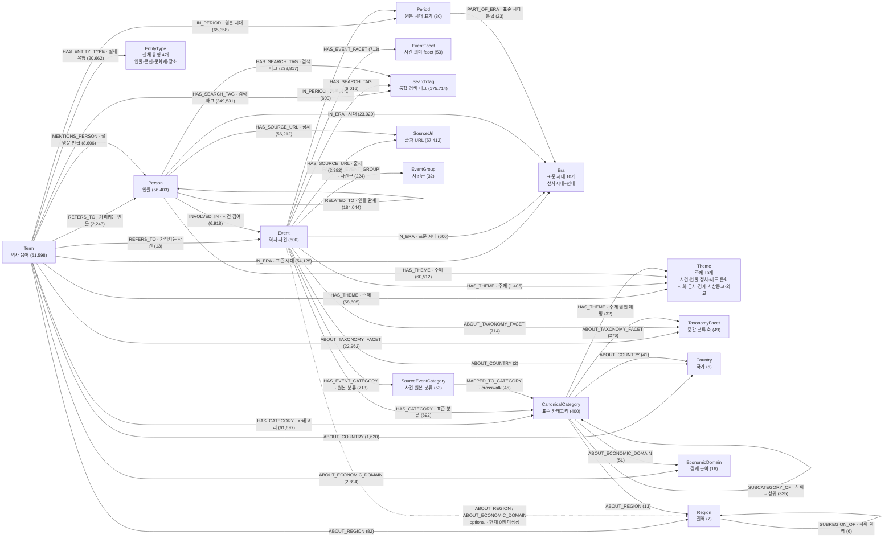

# Neo4j 구현 전체 흐름

이 문서는 한국사 Graph DB 구현에서 전처리, CSV 생성 규칙, seed 관리, Neo4j import CSV, Cypher 쿼리까지 전체 흐름을 한 번에 보기 위한 기준 문서다.

현재 기준은 다음과 같다.

- 전체 전처리 시작 파일은 `etl/preprocessing/neo4j/run_neo4j_preprocessing.py`다.
- 최종 Neo4j import CSV 위치는 `storage/neo4j/neo4j_import/nodes/`, `storage/neo4j/neo4j_import/relations/`다.
- `etl/preprocessing/neo4j/normalized`, `dictionary`, `mapping`, `staging`은 import 전 중간 산출물이다.
- `etl/preprocessing/neo4j/seed`는 사람이 관리하는 규칙표다. runner가 생성하지 않는다.
- Cypher 파일은 `storage/neo4j/schema/` 아래의 `history_graph_*.cypher`를 사용한다.
- 과거 `init.cypher`, `event.cypher`는 삭제했고 현재 import 흐름에서 사용하지 않는다.

행 수는 현재 생성된 CSV 기준이다. raw 데이터나 seed를 바꾸면 다시 생성될 수 있다.

---

## 1. 전체 파이프라인

```mermaid
flowchart LR
    raw["Raw CSV\nhistory terms / events / event relations / person relations"]
    normalized["normalized CSV\nEDA 기준 정리"]
    dictionary["dictionary CSV\n노드 후보 사전"]
    mapping["mapping CSV\n사전 간 crosswalk"]
    staging["staging CSV\n중간 관계/날짜 파싱"]
    graph["Neo4j import CSV\nnodes / relations"]
    cypher["Cypher import\nconstraints / nodes / relations / verify"]
    neo4j["Neo4j Graph DB"]

    raw --> normalized
    normalized --> dictionary
    normalized --> staging
    dictionary --> mapping
    mapping --> staging
    dictionary --> graph
    mapping --> graph
    staging --> graph
    graph --> cypher
    cypher --> neo4j
```

전체 CSV를 다시 만들 때는 하나만 실행한다.

```powershell
.\.venv\Scripts\python.exe etl/preprocessing/neo4j/run_neo4j_preprocessing.py
```

runner 실행 순서:

| 순서 | 스크립트 | 생성 대상 | 역할 |
|---:|---|---|---|
| 1 | `scripts/normalize_raw_data.py` | `normalized/` | raw CSV를 EDA 기준으로 정리 |
| 2 | `scripts/make_base_dictionaries.py` | `dictionary/`, `staging/` | 1차 사전, 날짜 파싱, URL 사전 생성 |
| 3 | `scripts/make_mapping_tables.py` | `dictionary/`, `mapping/`, `staging/` | 카테고리/이벤트/국가/지역/경제/중간 facet 매핑 생성 |
| 4 | `scripts/make_graph_csv.py` | `storage/neo4j/neo4j_import/nodes/`, `storage/neo4j/neo4j_import/relations/` | Neo4j import용 최종 CSV 생성 |
| 5 | `scripts/make_theme_era_csv.py` | `storage/neo4j/neo4j_import/nodes/`, `storage/neo4j/neo4j_import/relations/` | Theme/Era/EntityType 상위 레이어 노드/관계 CSV 생성 |

`make_graph_csv.py`를 단독 실행하면 기본 출력은 `etl/preprocessing/neo4j/graph/nodes/`, `etl/preprocessing/neo4j/graph/relations/`다. 다만 runner의 graph 생성 단계는 `--nodes-dir`, `--relations-dir`를 넘겨 `storage/neo4j/neo4j_import/` 아래로 바로 저장한다.
`make_term_person_review.py`는 기본 runner에 포함하지 않는다. 이 스크립트는 graph CSV 생성 이후 Term-Person 수동 검수 후보가 필요할 때 단독 실행한다.

노드/관계 설계 판단의 상세 근거는 `docs/neo4j/neo4j_design_decisions_detail.md`에 둔다.
이 문서는 구현 순서를 설명하고, 상세 설계 판단 문서는 각 노드와 관계가 왜 필요한지, 없으면 어떤 문제가 생기는지, 어떤 대안을 제외했는지 설명한다.

---

## 2. 폴더와 파일 역할

| 경로 | 성격 | 설명 |
|---|---|---|
| `etl/raw_data/` | raw 입력 | 원본 CSV가 있는 곳 |
| `etl/preprocessing/neo4j/run_neo4j_preprocessing.py` | 시작 파일 | 전처리 스크립트 6개를 순서대로 실행 |
| `etl/preprocessing/neo4j/scripts/` | 전처리 코드 | 정규화, 사전 생성, 매핑 생성, graph CSV 생성 로직 |
| `etl/preprocessing/neo4j/seed/` | 수동 규칙 | 사람이 관리하는 고정 규칙표 |
| `etl/preprocessing/neo4j/normalized/` | 중간 산출물 | raw를 EDA 기준으로 정리한 CSV |
| `etl/preprocessing/neo4j/dictionary/` | 중간 산출물 | 그래프 노드 후보가 되는 사전 CSV |
| `etl/preprocessing/neo4j/mapping/` | 중간 산출물 | 서로 다른 분류 체계를 잇는 crosswalk |
| `etl/preprocessing/neo4j/staging/` | 중간 산출물 | 최종 관계 CSV 전 단계 |
| `storage/neo4j/neo4j_import/nodes/` | 최종 산출물 | Neo4j node import CSV |
| `storage/neo4j/neo4j_import/relations/` | 최종 산출물 | Neo4j relationship import CSV |
| `storage/neo4j/schema/` | Cypher | 제약조건, import, 검증 쿼리 |
| `storage/neo4j/load_schema.py` | import runner | Cypher 파일을 순서대로 실행 |
| `storage/neo4j/docker-compose.yml` | Neo4j 실행 | import 폴더를 컨테이너 `/var/lib/neo4j/import`로 마운트 |

`storage/neo4j/neo4j_import` 아래의 import 대상은 `nodes/*.csv`, `relations/*.csv`다. 과거 루트에 있던 `event.csv`, `event_relation.csv`, `history_terms.csv`는 삭제되어 더 이상 존재하지 않는다.

---

## 3. Raw 데이터와 정규화 규칙

### 3.1 raw 입력

| 입력 | 기본 경로 | 의미 |
|---|---|---|
| history terms | `etl/raw_data/교육부 국사편찬위원회_한국역사용어시소러스 정보_20211028 (1).csv` | 한국역사용어 시소러스 |
| events | `etl/raw_data/한국고전종합DB_관계망/itkc_events.csv` | ITKC 사건 |
| event relations | `etl/raw_data/한국고전종합DB_관계망/itkc_event_relations.csv` | 사건-인물 관계 |
| person relations | `etl/raw_data/한국고전종합DB_관계망/itkc_person_relations.csv` | 인물-인물 관계 |

### 3.2 normalized CSV

| CSV | 행 수 | 생성 규칙 |
|---|---:|---|
| `normalized/terms.csv` | 61,598 | `term_kind=2`인 실제 용어만 남김. `term_id` 기준 중복 제거. `term_ch`는 `Term` 속성으로 보존. `term_user`, `term_created`, `term_reference`, `term_attr` 등 그래프 설계에 쓰지 않는 컬럼은 제외 |
| `normalized/events.csv` | 600 | `event_id` 기준 중복 제거. `scope`, `person_count`, `detail_url` 제거. `detail_url`은 event별 `source_urls`로 합침 |
| `normalized/event_relations.csv` | 6,918 | `event_id`, `person_id`, `relation_type`이 모두 같은 경우 중복 제거. `detail_url`은 `source_urls`로 합침. `scope`, 비어 있는 관련 사건/evidence 컬럼은 제외 |
| `normalized/person_relations.csv` | 206,507 | `person_id`, `related_person_id`, `relation_type` 기준 중복 제거. 인물 관계 검수에 필요한 `related_*`, `related_count`, `evidence_url`, `detail_url`은 보존 |

정규화 단계에서 URL을 바로 버리지 않는 이유는 이후 `SourceUrl` 노드로 분리해 Web RAG/Tavily 연계 후보로 쓸 수 있기 때문이다.

---

## 4. Seed 파일

seed는 자동 생성 결과가 아니라 사람이 관리하는 입력 규칙표다. 전처리 재실행 시 seed를 읽어서 사전과 매핑을 만든다.

| Seed CSV | 행 수 | 역할 |
|---|---:|---|
| `category_axis_seed.csv` | 2 | 표준 카테고리 경로에서 특정 의미 축을 어느 depth에서 뽑을지 정의. 현재 `country`, `economic_domain` 축 사용 |
| `country_seed.csv` | 5 | 국가/정치체 노드 후보와 연결될 표준 카테고리 경로 정의 |
| `region_seed.csv` | 7 | 기타지역, 동남아시아, 서남아시아, 아메리카, 아프리카, 유럽, 중앙아시아 같은 권역 정의 |
| `event_facet_seed.csv` | 53 | 원천 이벤트 분류를 사건 의미 facet으로 재분류 |
| `period_seed.csv` | 29 | 시대 순서, 범위 확장 후보, 연도 범위, 상위 시대 정보 정의 |
| `relation_type_seed.csv` | 16 | 인물 관계 원문 타입을 정규화 타입, 관계 그룹, 방향성 기준으로 매핑 |
| `taxonomy_crosswalk_seed.csv` | 42 | 이벤트 분류와 표준 카테고리 사이의 수동 매핑 |
| `theme_seed.csv` | 10 | 서비스 고정 주제 10개(사건/인물/정치/제도/문화/사회/군사/경제/사상·종교/외교). 계층 없는 평면 구조 |
| `category_theme_seed.csv` | 30 | 표준 카테고리 경로와 주제의 매핑. prefix 규칙으로 하위 경로까지 흡수. 정치·행정·법제는 depth 2에서 정치/제도로 분리 |
| `era_seed.csv` | 10 | 표준 시대(Era) 10개 정의. 선사시대~현대 |
| `period_era_seed.csv` | 23 | 기존 Period 표기 변형(고려/고려시대, 일제시기/일제시대, 영문명 등)을 표준 시대로 매핑 |
| `entity_type_seed.csv` | 4 | 실체 유형 카테고리(인명/서명/문화재/지명)를 유형 축(인물/문헌/문화재/장소)으로 정의 |
| `keyword_era_seed.csv` | 120 | 시험 빈출 키워드와 표준 시대의 매핑. `test/CJ/test_ML/ml_keyword_era_overrides.json`에서 변환 후 고조선/초기 국가 키워드 20건 확장 |
| `reign_seed.csv` | 8 | 왕대/연호 이름과 연도 범위. 연도 파서 보조용. 같은 왕 이름이 여러 시대에 있으면 자동 계산에서 제외 |
| `term_person_review_approved.csv` | 0 | 사람이 승인한 Term-Person 수동 연결 목록. 승인 행은 `term_refers_to_person.csv`에 `match_type=MANUAL`로 합류 |

seed가 필요한 이유:

- raw 분류명은 출처별로 다르다. `event.subject_category`와 `history_terms.term_lk`는 같은 체계가 아니다.
- 정확히 이름이 같은 카테고리만 자동 매핑하면 누락이 생기고, 의미 유사도만으로 자동 연결하면 그래프가 흐려진다.
- 국가, 지역, 경제 분야, 중간 taxonomy facet은 카테고리 경로 안에 섞여 있으므로 별도 노드로 뽑아야 쿼리가 단순해진다.
- 시대 범위는 단순 문자열이 아니라 순서와 범위 규칙이 있어야 `삼국시대-조선시대` 같은 표현을 중간 시대까지 펼칠 수 있다.
- 인물 관계는 `부`, `형`, `교유`처럼 방향성과 대칭성이 다르므로 raw 문자열 그대로 쓰면 쿼리 의미가 불안정해진다.

---

## 5. Dictionary CSV 생성 규칙

### 5.1 1차 dictionary

| Dictionary CSV | 행 수 | 생성 규칙 |
|---|---:|---|
| `canonical_category_dictionary.csv` | 400 | `terms.term_lk`를 `>>`로 복수 경로 분리, 각 경로를 `>`로 depth 분리. depth별 `category_path`를 모두 생성하고 부모 경로를 연결 |
| `source_event_category_dictionary.csv` | 53 | `events.subject_category`를 쉼표/줄바꿈 기준으로 분리해 원천 이벤트 분류 사전 생성 |
| `period_dictionary.csv` | 30 | `terms.term_times`, `events.period`의 시대명을 수집한 뒤 `period_seed.csv`로 순서/기간/범위 확장 가능 여부 보강 |
| `relation_type_dictionary.csv` | 16 | `person_relations.relation_type` 빈도에 `relation_type_seed.csv`를 merge해서 정규화 관계 사전 생성 |
| `source_url_dictionary.csv` | 57,412 | events, event_relations의 `source_urls`와 person_relations의 `detail_url`만 모아 중복 제거. RAG 후보 상태값 포함 |

### 5.2 2차 dictionary

| Dictionary CSV | 행 수 | 생성 규칙 |
|---|---:|---|
| `event_facet_dictionary.csv` | 53 | `event_facet_seed.csv`를 기준으로 이벤트 분류를 사건 의미 facet으로 그룹화 |
| `country_dictionary.csv` | 5 | `country_seed.csv` 기준으로 국가/정치체 노드 생성 |
| `region_dictionary.csv` | 7 | `region_seed.csv` 기준으로 권역 노드 생성. `parent_region_name`이 있으면 부모 region 연결 가능 |
| `economic_domain_dictionary.csv` | 16 | `category_axis_seed.csv`의 `economic_domain` 설정에 따라 `경제·산업` 하위 depth에서 경제 분야 추출 |
| `taxonomy_facet_dictionary.csv` | 49 | 표준 카테고리 중 하위 카테고리를 가진 중간 경로를 facet으로 추출. 국가/지역/경제 축으로 따로 뽑은 경로는 제외 |

---

## 6. Mapping과 Staging CSV 생성 규칙

### 6.1 staging CSV

| Staging CSV | 행 수 | 역할 |
|---|---:|---|
| `term_canonical_category_relation.csv` | 61,697 | 용어가 직접 속한 leaf 표준 카테고리 관계 후보 |
| `event_source_category_relation.csv` | 713 | 사건이 가진 원천 이벤트 분류 관계 후보 |
| `event_date_parse.csv` | 703 | `event_date`에서 시작/종료 연도, 월, 왕대 표현, 파싱 상태 추출 |
| `term_year_parse.csv` | 61,598 | `term_year`에서 시작/종료 연도, precision, 파싱 상태 추출. 최종 `nodes/terms.csv`에 병합 |
| `term_person_review.csv` | 206 | graph CSV 기준 Term-Person 수동 검수 후보. `review_type`으로 검수 유형을 구분하고, 승인 결과는 `seed/term_person_review_approved.csv`에 기록 |

### 6.2 mapping CSV

| Mapping CSV | 행 수 | 역할 |
|---|---:|---|
| `taxonomy_crosswalk.csv` | 53 | 원천 이벤트 분류를 표준 카테고리에 연결. 자동 `EXACT_NAME` 후 seed 수동 매핑으로 보강 |
| `source_event_category_facet_crosswalk.csv` | 53 | 원천 이벤트 분류를 `EventFacet`에 연결 |
| `canonical_category_country_crosswalk.csv` | 41 | `외교·국제관계>러시아>...`처럼 경로 2번째 depth가 국가명인 경우 국가 축 연결 |
| `canonical_category_region_crosswalk.csv` | 13 | region seed의 경로와 그 하위 경로를 권역 축에 연결 |
| `canonical_category_economic_domain_crosswalk.csv` | 51 | `경제·산업>수산업>...`처럼 지정 depth의 경제 분야와 하위 경로를 연결 |
| `canonical_category_taxonomy_facet_crosswalk.csv` | 276 | 표준 카테고리와 중간 taxonomy facet을 `SELF_PATH` 또는 `DESCENDANT_PATH`로 연결 |

### 6.3 주요 매핑 원칙

- `term_lk`는 `>>`를 먼저 분리하고, 각 경로 안에서 `>`를 분리한다.
- `정치·행정·법제>인사` 같은 경로는 `정치·행정·법제`, `정치·행정·법제>인사` 두 category path를 모두 만든다.
- 용어는 leaf category에 직접 연결한다. 상위 카테고리는 `SUBCATEGORY_OF`를 통해 따라간다.
- 이벤트는 원천 분류를 `SourceEventCategory`로 보존하고, 별도로 표준 카테고리 매핑이 있는 경우에만 `CanonicalCategory`와 직접 연결한다.
- `taxonomy_crosswalk_seed.csv`에 수동 매핑이 있으면 자동 exact 매핑보다 우선한다.
- 국가/지역/경제 분야는 카테고리 계층에 그대로 끼워 넣지 않고 별도 의미 축 노드로 분리한다.
- 국가와 지역은 서로 상하 개념으로 두지 않는다. `Country`는 국가/정치체, `Region`은 권역이다.
- `기타지역>동남아시아` 같은 값은 `Region - SUBREGION_OF - Region`으로 표현한다.
- `외교·국제관계>기타지역>동남아시아`의 `기타지역`과 `동남아시아`는 `외교·국제관계`의 단순 하위 카테고리가 아니라 지역 의미 축으로도 연결된다.

---

## 7. 최종 Node CSV

```mermaid
flowchart TD
    Term["Term"]
    Event["Event"]
    Person["Person"]
    Category["CanonicalCategory"]
    SourceCat["SourceEventCategory"]
    Period["Period"]
    Era["Era"]
    Url["SourceUrl"]
    EventGroup["EventGroup"]
    EventFacet["EventFacet"]
    Country["Country"]
    Region["Region"]
    Econ["EconomicDomain"]
    TaxFacet["TaxonomyFacet"]
    SearchTag["SearchTag"]
```



| Node CSV | Label | 행 수 | ID | 의미 |
|---|---|---:|---|---|
| `terms.csv` | `Term` | 61,598 | `term_id` | 역사 용어. 이름, 한자, 설명, 원문 시대/연도/카테고리 텍스트 보존 |
| `events.csv` | `Event` | 600 | `event_id` | 역사 사건. 원천 분류, 시대, 날짜 파싱 결과, 관련 사건명 포함 |
| `people.csv` | `Person` | 56,403 | `person_id` | 사건 참여자와 인물 관계 양쪽 인물을 합친 인물 노드 |
| `canonical_categories.csv` | `CanonicalCategory` | 400 | `category_id` | `history_terms.term_lk` 기반 표준 카테고리 |
| `source_event_categories.csv` | `SourceEventCategory` | 53 | `event_category_id` | ITKC 이벤트 원천 분류 |
| `periods.csv` | `Period` | 30 | `period_id` | 시대/기간 노드. 범위 확장 순서 정보 포함 |
| `source_urls.csv` | `SourceUrl` | 57,412 | `source_url_id` | 출처 URL. RAG 수집 후보 |
| `event_groups.csv` | `EventGroup` | 32 | `event_group_id` | `related_event`를 묶은 사건 그룹 |
| `event_facets.csv` | `EventFacet` | 53 | `event_facet_id` | 전쟁, 정치, 제도 등 이벤트 의미 facet |
| `countries.csv` | `Country` | 5 | `country_id` | 국가/정치체 의미 축 |
| `regions.csv` | `Region` | 7 | `region_id` | 권역/지역 의미 축 |
| `economic_domains.csv` | `EconomicDomain` | 16 | `economic_domain_id` | 경제·산업 내부의 수산업, 광공업 같은 경제 분야 축 |
| `taxonomy_facets.csv` | `TaxonomyFacet` | 49 | `taxonomy_facet_id` | 중간 카테고리 경로를 독립 검색/필터 축으로 분리한 노드 |
| `search_tags.csv` | `SearchTag` | 175,714 | `search_tag_id` | Term/Event/Person 검색 편의를 위해 여러 의미 축을 통합한 tag 노드. Person 별칭은 `PersonAlias` 태그로 분리 |
| `themes.csv` | `Theme` | 10 | `theme_id` | 문제 생성 서비스의 고정 주제 10개. 평면 구조 |
| `eras.csv` | `Era` | 10 | `era_id` | 표준 시대 축. 선사시대~현대 10개 |
| `entity_types.csv` | `EntityType` | 4 | `entity_type_id` | 용어의 실체 유형 축. 인물/문헌/문화재/장소 |

### 7.1 노드별 핵심 속성

| Label | 주요 속성 |
|---|---|
| `Term` | `name`, `hanja`, `remark`, `year_text`, `period_text`, `category_text`, `description`, `topterm_id`, `start_year`, `end_year`, `year_precision`, `year_parse_status`, `question_ready`, `source` |
| `Event` | `name`, `subject_category`, `period_text`, `event_date`, `related_event_name`, `source_urls`, `start_year`, `end_year`, `date_precision`, `parse_status` |
| `Person` | `name`, `name_candidates`, `birth_year`, `death_year`, `bonkwan`, `father_name`, `detail_urls`, `degree`, `source` |
| `CanonicalCategory` | `name`, `category_path`, `parent_category_id`, `depth`, `root_category_name`, `term_count`, `direct_term_count` |
| `Period` | `name`, `period_level`, `range_group`, `period_order`, `start_year`, `end_year`, `is_range_expansion_candidate` |
| `SourceUrl` | `url`, `source_tables`, `source_columns`, `source_types`, `source_count`, `use_for_rag`, `fetch_status` |

---

## 8. 최종 Relationship CSV



위쪽(Term/Event/Person -> Theme/Era/EntityType)이 서비스가 사용하는 직통 관계이고, 아래쪽(Category/Period 내부 관계)이 그 직통 엣지를 만들어낸 원천 매핑이다. 점선은 optional 관계로 현재 데이터가 0행이라 생성하지 않는다.

| Relationship CSV | Neo4j type | 행 수 | From -> To | 생성 규칙 |
|---|---|---:|---|---|
| `term_has_canonical_category.csv` | `HAS_CATEGORY` | 61,697 | `Term -> CanonicalCategory` | `term_canonical_category_relation.csv`에서 용어와 leaf category 연결 |
| `term_in_period.csv` | `IN_PERIOD` | 65,358 | `Term -> Period` | `term_times`를 period dictionary로 매칭. 범위 표현은 시작/중간/끝으로 확장 |
| `term_about_country.csv` | `ABOUT_COUNTRY` | 1,620 | `Term -> Country` | 용어의 category가 국가 crosswalk에 걸리면 연결 |
| `term_about_region.csv` | `ABOUT_REGION` | 82 | `Term -> Region` | 용어의 category가 region crosswalk에 걸리면 연결 |
| `term_about_economic_domain.csv` | `ABOUT_ECONOMIC_DOMAIN` | 2,894 | `Term -> EconomicDomain` | 용어의 category가 경제 분야 crosswalk에 걸리면 연결 |
| `term_about_taxonomy_facet.csv` | `ABOUT_TAXONOMY_FACET` | 22,962 | `Term -> TaxonomyFacet` | 용어의 category가 중간 taxonomy facet에 속하면 연결 |
| `term_refers_to_person.csv` | `REFERS_TO` | 2,243 | `Term -> Person` | Term 이름/한자와 Person 이름/한자가 같고 Term 연도와 Person 생몰년이 숫자로 완전히 같으며 해당 Term에서 그런 후보가 1명뿐이면 `EXACT_NAME_HANJA_LIFE_YEAR`로 자동 연결한다. 관계망 단서가 있는 기존 자동 연결과 승인 seed의 `MANUAL` 연결도 합류한다. |
| `term_mentions_person.csv` | `MENTIONS_PERSON` | 8,606 | `Term -> Person` | 용어 설명문에서 신뢰된 `REFERS_TO` 인물명이 언급된 경우 연결. `REFERS_TO`보다 약한 보조 맥락 관계 |
| `term_has_search_tag.csv` | `HAS_SEARCH_TAG` | 349,531 | `Term -> SearchTag` | 용어명, 표준 카테고리, 국가/지역/경제/taxonomy facet, 시대, 주제, 실체 유형을 검색 태그로 통합 연결 |
| `term_refers_to_event.csv` | `REFERS_TO` | 13 | `Term -> Event` | 용어명과 사건명이 양쪽에서 유일하게 일치하는 경우만 연결 |
| `event_has_source_category.csv` | `HAS_EVENT_CATEGORY` | 713 | `Event -> SourceEventCategory` | 이벤트 원천 분류를 원형 그대로 보존 |
| `event_has_canonical_category.csv` | `HAS_CATEGORY` | 692 | `Event -> CanonicalCategory` | `taxonomy_crosswalk.csv`에서 표준 카테고리 매핑이 있는 이벤트만 연결 |
| `event_has_facet.csv` | `HAS_EVENT_FACET` | 713 | `Event -> EventFacet` | source event category를 event facet seed 기준으로 연결 |
| `event_in_period.csv` | `IN_PERIOD` | 600 | `Event -> Period` | `events.period`를 period dictionary로 매칭 |
| `event_part_of_event_group.csv` | `PART_OF_EVENT_GROUP` | 224 | `Event -> EventGroup` | `related_event`가 있는 사건을 사건 그룹에 연결 |
| `event_has_source_url.csv` | `HAS_SOURCE_URL` | 2,382 | `Event -> SourceUrl` | events와 event_relations의 `source_urls`를 연결 |
| `event_has_search_tag.csv` | `HAS_SEARCH_TAG` | 6,016 | `Event -> SearchTag` | 사건명, source category, canonical category, facet, 시대, 주제, 국가/지역/경제/taxonomy facet을 검색 태그로 통합 연결 |
| `event_about_country.csv` | `ABOUT_COUNTRY` | 2 | `Event -> Country` | 이벤트 표준 카테고리가 국가 crosswalk에 걸리면 연결 |
| `event_about_taxonomy_facet.csv` | `ABOUT_TAXONOMY_FACET` | 714 | `Event -> TaxonomyFacet` | 이벤트 표준 카테고리가 taxonomy facet에 속하면 연결 |
| `person_involved_in_event.csv` | `INVOLVED_IN` | 6,918 | `Person -> Event` | event_relations의 사건-인물 관계. CSV 속성 `relation_type`도 Neo4j 관계 타입과 같은 `INVOLVED_IN`으로 맞춤 |
| `person_related_to_person.csv` | `RELATED_TO` | 184,044 | `Person -> Person` | person_relations의 인물 관계. raw/normalized relation type, 방향성, `evidence_url` 속성 보존. 대칭 관계(`is_symmetric=Y`)는 무방향 쌍 기준으로 한 방향만 저장. 인물 이름과 detail_url은 Person 노드에 있으므로 관계 속성에서 제외 |
| `person_has_source_url.csv` | `HAS_SOURCE_URL` | 56,212 | `Person -> SourceUrl` | person detail URL을 출처 URL 노드에 연결 |
| `person_has_search_tag.csv` | `HAS_SEARCH_TAG` | 238,817 | `Person -> SearchTag` | 인물명, 별칭, 참여 사건의 검색 태그, 지시 용어의 검색 태그, 주제, 시대를 검색 태그로 통합 연결 |
| `canonical_category_subcategory_of.csv` | `SUBCATEGORY_OF` | 335 | `CanonicalCategory -> CanonicalCategory` | 표준 카테고리 부모-자식 관계. 국가/지역 의미 축으로 분리한 경로는 계층 관계에서 제외 |
| `source_category_mapped_to_canonical_category.csv` | `MAPPED_TO_CATEGORY` | 45 | `SourceEventCategory -> CanonicalCategory` | 원천 이벤트 분류와 표준 카테고리 crosswalk |
| `canonical_category_about_country.csv` | `ABOUT_COUNTRY` | 41 | `CanonicalCategory -> Country` | 표준 카테고리와 국가 축 연결 |
| `canonical_category_about_region.csv` | `ABOUT_REGION` | 13 | `CanonicalCategory -> Region` | 표준 카테고리와 권역 축 연결 |
| `canonical_category_about_economic_domain.csv` | `ABOUT_ECONOMIC_DOMAIN` | 51 | `CanonicalCategory -> EconomicDomain` | 표준 카테고리와 경제 분야 축 연결 |
| `canonical_category_about_taxonomy_facet.csv` | `ABOUT_TAXONOMY_FACET` | 276 | `CanonicalCategory -> TaxonomyFacet` | 표준 카테고리와 중간 taxonomy facet 연결 |
| `region_subregion_of.csv` | `SUBREGION_OF` | 6 | `Region -> Region` | 동남아시아, 유럽 등이 기타지역의 하위 region이면 연결 |
| `canonical_category_has_theme.csv` | `HAS_THEME` | 32 | `CanonicalCategory -> Theme` | 표준 카테고리를 서비스 주제 10개에 연결. 인명 세부 카테고리는 인물 주제와 내용 주제를 함께 가질 수 있음 |
| `period_part_of_era.csv` | `PART_OF_ERA` | 23 | `Period -> Era` | 기존 시대 노드(표기 변형 포함)를 표준 시대 10개로 통합 연결 |
| `term_has_entity_type.csv` | `HAS_ENTITY_TYPE` | 20,662 | `Term -> EntityType` | 인명/서명/문화재/지명 카테고리 용어를 실체 유형 축으로 연결 |
| `term_in_era.csv` | `IN_ERA` | 54,125 | `Term -> Era` | 소스 3종: `IN_PERIOD -> PART_OF_ERA` 펼침(PERIOD), 키워드 override(KEYWORD_OVERRIDE), 설명문 기반 검수 통과분(DESC_KEYWORD) |
| `event_in_era.csv` | `IN_ERA` | 600 | `Event -> Era` | `event_in_period.csv`와 `period_part_of_era.csv`를 조인해 사건의 표준 Era 직접 관계 생성 |
| `person_in_era.csv` | `IN_ERA` | 23,029 | `Person -> Era` | 생몰년과 Era 연도 범위 겹침을 우선 적용하고, 생몰년이 없는 인물은 참여 사건 Era로 보조 추론. 더 좁은 Era가 같은 생애 겹침 구간을 완전히 설명하면 넓은 Era 중복은 제외 |
| `person_has_theme.csv` | `HAS_THEME` | 60,512 | `Person -> Theme` | 모든 Person은 인물 주제에 연결하고, 사건 참여/인명 세부 카테고리로 내용 주제를 보조 상속 |

### 8.1 비어 있는 optional 관계를 생성하지 않는 이유

`event_about_region.csv`, `event_about_economic_domain.csv`는 현재 최종 import CSV로 생성하지 않는다.

이 두 관계는 설계상 가능하다. 이벤트가 표준 카테고리에 매핑되고, 그 표준 카테고리가 다시 `Region` 또는 `EconomicDomain` 축과 연결되면 `Event - ABOUT_REGION - Region`, `Event - ABOUT_ECONOMIC_DOMAIN - EconomicDomain` 관계를 만들 수 있다. 하지만 현재 `taxonomy_crosswalk.csv`의 이벤트-표준 카테고리 매핑 결과에는 해당 축으로 이어지는 행이 없다.

0행 CSV를 그대로 만들지 않는 이유는 다음과 같다.

- 최종 import 폴더에 있는 CSV는 실제 그래프 적재 대상이어야 한다.
- 0행 CSV가 있으면 “이 관계가 존재하는데 데이터만 비어 있다”처럼 보인다.
- 검수자가 실제 누락인지, 의도된 빈 결과인지 매번 구분해야 한다.
- Neo4j import 문서와 파일 목록이 불필요하게 늘어난다.

그래서 현재 구현은 `make_graph_csv.py`에서 두 optional relation이 0행이면 CSV를 생성하지 않고, 예전에 남아 있던 같은 이름의 빈 CSV도 삭제한다. 다만 Cypher import 블록은 유지하고, `load_schema.py`가 해당 optional CSV가 없으면 그 LOAD 문장만 건너뛴다. 이렇게 한 이유는 나중에 `taxonomy_crosswalk_seed.csv`나 이벤트 분류 매핑을 보강해서 실제 행이 생겼을 때, 별도 구조 변경 없이 같은 관계를 다시 import할 수 있게 하기 위해서다.

### 8.2 시대 범위 확장 규칙

`term_in_period.csv`, `event_in_period.csv`는 단순 문자열 매칭만 하지 않는다.

| match_type | 의미 |
|---|---|
| `DIRECT` | 단일 시대 표현이 직접 매칭됨 |
| `RANGE_START` | 범위 표현의 시작 시대 |
| `RANGE_MIDDLE` | seed의 `range_group`, `period_order` 기준으로 사이에 있는 시대 |
| `RANGE_END` | 범위 표현의 끝 시대 |

예를 들어 `삼국시대-조선시대`가 들어오면 `period_seed.csv`에 같은 `range_group`과 순서가 잡힌 시대를 기준으로 시작, 중간, 끝 시대를 함께 연결한다. 이 처리를 import 쿼리에서 하지 않고 CSV 생성 단계에서 끝내는 이유는 Neo4j 쿼리를 단순하게 유지하기 위해서다.

### 8.3 인물 관계 규칙

인물 관계는 Neo4j type을 모두 `RELATED_TO`로 통일하고, 관계의 실제 의미는 속성으로 보존한다.

| 속성 | 의미 |
|---|---|
| `raw_relation_type` | 원본 관계명 |
| `normalized_relation_type` | seed 기준 정규화 관계명 |
| `relation_group` | 가족, 교유, 사제 등 관계 묶음 |
| `direction_rule` | 원본 행 방향을 어떻게 해석할지 |
| `is_symmetric` | 대칭 관계 여부 |
| `inverse_relation_type` | 반대 방향 관계 후보 |

관계 type을 `HAS_FATHER`, `SIBLING_OF`처럼 모두 쪼개지 않은 이유는 raw 관계명이 다양하고 검수 전 의미가 불안정하기 때문이다. type은 단순화하고 의미는 속성으로 두면 import가 안정적이고, 나중에 정제 규칙을 보강하기 쉽다.

대칭 관계(`is_symmetric=Y`, 예: `교유`, `형제`)는 원본에 A->B, B->A 양방향으로 들어 있으므로 CSV 생성 단계에서 무방향 쌍 기준으로 한 방향만 남긴다. 따라서 대칭 관계를 조회할 때는 방향 없는 패턴 `(a)-[r:RELATED_TO]-(b)`을 사용해야 한다.

---

## 9. Cypher 구현

### 9.1 Cypher 파일

| 파일 | 기본 실행 여부 | 역할 |
|---|---|---|
| `history_graph_constraints.cypher` | 예 | 17개 label의 ID unique constraint와 주요 name/path/url/연도 index 생성 |
| `history_graph_import_nodes.cypher` | 예 | `file:///nodes/*.csv`에서 모든 노드 import |
| `history_graph_import_relations.cypher` | 예 | `file:///relations/*.csv`에서 모든 관계 import |
| `history_graph_verify.cypher` | 예 | label별 노드 수, 관계 type별 수, 빈 label/type 이상 여부 확인 |

`load_schema.py` 기본 실행 순서:

```text
internal_graph_reset
history_graph_constraints.cypher
history_graph_import_nodes.cypher
history_graph_import_relations.cypher
history_graph_verify.cypher
```

reset은 Cypher 파일이 아니라 `load_schema.py` 내부 배치 루프로 항상 먼저 실행된다. 관계를 먼저 batch delete하고, 그 다음 노드를 batch delete한다. 기본 batch size는 `NEO4J_RESET_BATCH_SIZE` 환경변수로 조정할 수 있고, 기본값은 `10000`이다.

```powershell
.\.venv\Scripts\python.exe storage/neo4j/load_schema.py
```

`NEO4J_SCHEMA_FILES` 환경변수로 Cypher 파일 순서를 직접 지정하는 방식도 지원한다. 이 경우에도 internal reset은 Cypher 파일 목록과 별개로 항상 먼저 실행된다.

### 9.2 constraints와 indexes

`history_graph_constraints.cypher`는 다음 label의 ID uniqueness를 보장한다.

| Label | Unique key |
|---|---|
| `Term` | `term_id` |
| `Event` | `event_id` |
| `Person` | `person_id` |
| `CanonicalCategory` | `category_id` |
| `SourceEventCategory` | `event_category_id` |
| `Period` | `period_id` |
| `SourceUrl` | `source_url_id` |
| `EventGroup` | `event_group_id` |
| `EventFacet` | `event_facet_id` |
| `Country` | `country_id` |
| `Region` | `region_id` |
| `EconomicDomain` | `economic_domain_id` |
| `TaxonomyFacet` | `taxonomy_facet_id` |
| `SearchTag` | `search_tag_id` |
| `Theme` | `theme_id` |
| `Era` | `era_id` |
| `EntityType` | `entity_type_id` |

조회 편의를 위해 다음 index도 만든다.

| Label | Index property |
|---|---|
| `Term` | `name`, `start_year`, `end_year` |
| `Event` | `name` |
| `Person` | `name`, `degree` |
| `CanonicalCategory` | `category_path` |
| `SearchTag` | `tag_name`, `tag_value` |
| `SourceUrl` | `url` |
| `Theme` | `name` |
| `Era` | `name` |
| `EntityType` | `name` |

### 9.3 import 방식

노드 import는 공통적으로 다음 방식이다.

```cypher
LOAD CSV WITH HEADERS FROM 'file:///nodes/<file>.csv' AS row
MERGE (n:<Label> {id_property: row.id_property})
SET n += row
SET n.numeric_property = toIntegerOrNull(row.numeric_property)
```

`SET n += row`만 쓰면 CSV의 모든 값이 문자열로 들어간다. 그래서 연도, 월, 순서, 집계 수처럼 범위 검색이나 정렬에 쓰일 속성은 `toIntegerOrNull()`로 다시 세팅한다. 현재 명시 캐스팅 대상은 다음 계열이다.

- `Term.topterm_id`
- `Event.start_year`, `end_year`, `start_month`, `end_month`, `start_reign_year`, `end_reign_year`
- `Person.birth_year`, `death_year`
- `CanonicalCategory.depth`, `term_count`, `direct_term_count`
- `SourceEventCategory.event_count`
- `Period.period_order`, `start_year`, `end_year`, `term_count`, `event_count`
- `SourceUrl.source_count`
- `EventGroup.event_count`
- `EventFacet.source_event_category_count`, `event_count`
- `TaxonomyFacet.taxonomy_facet_depth`, `child_category_count`, `descendant_category_count`, `term_count`, `direct_term_count`

ID 값은 Neo4j lookup key로 안정적으로 쓰기 위해 문자열로 유지한다.

관계 import는 공통적으로 다음 방식이다.

```cypher
LOAD CSV WITH HEADERS FROM 'file:///relations/<file>.csv' AS row
MATCH (start:<StartLabel> {start_id: row.start_id})
MATCH (target:<EndLabel> {end_id: row.end_id})
MERGE (start)-[r:<TYPE>]->(target)
SET r += row
```

중복 collapse를 막아야 하는 관계는 `MERGE`에 추가 key 속성을 포함한다.

| 관계 파일 | MERGE key 보강 |
|---|---|
| `event_has_canonical_category.csv` | `event_category_id` |
| `event_has_facet.csv` | `source_event_category_id` |
| `event_has_source_url.csv` | `source_column` |
| `term_has_search_tag.csv` | `source_node_type`, `source_node_id`, `source_relation`, `source_detail` |
| `event_has_search_tag.csv` | `source_node_type`, `source_node_id`, `source_relation`, `source_detail` |
| `person_has_search_tag.csv` | `source_node_type`, `source_node_id`, `source_relation`, `source_detail` |
| `person_involved_in_event.csv` | `event_person_relation_id` |
| `person_related_to_person.csv` | `person_relation_id` |

`event_about_region.csv`, `event_about_economic_domain.csv`는 현재 0행이므로 최종 CSV도 만들지 않고 import Cypher에도 LOAD 블록을 두지 않는다. 따라서 `history_graph_import_relations.cypher`를 직접 실행해도 존재하지 않는 optional CSV 때문에 실패하지 않는다. `load_schema.py`의 optional skip 로직은 이후 해당 블록을 다시 추가할 경우를 대비한 방어 장치로 남아 있다.

`history_graph_verify.cypher`의 반환 결과는 `load_schema.py`가 콘솔에 출력한다. 따라서 label별 노드 수와 relationship type별 관계 수를 import 직후 바로 확인할 수 있다.

### 9.4 Docker import 경로

`docker-compose.yml`은 다음 mount를 사용한다.

```yaml
./neo4j_import:/var/lib/neo4j/import
```

그래서 Cypher에서는 로컬 경로를 직접 쓰지 않고 아래처럼 읽는다.

```text
file:///nodes/*.csv
file:///relations/*.csv
```

로컬 기준 실제 파일 위치는 다음이다.

```text
storage/neo4j/neo4j_import/nodes/*.csv
storage/neo4j/neo4j_import/relations/*.csv
```

---

## 10. 실행 순서

### 10.1 CSV 재생성

```powershell
.\.venv\Scripts\python.exe etl/preprocessing/neo4j/run_neo4j_preprocessing.py
```

생성 확인:

```powershell
Get-ChildItem storage/neo4j/neo4j_import/nodes -Filter *.csv
Get-ChildItem storage/neo4j/neo4j_import/relations -Filter *.csv
```

### 10.2 Neo4j 실행

```powershell
docker compose -f storage/neo4j/docker-compose.yml up -d
```

### 10.3 Cypher import

```powershell
.\.venv\Scripts\python.exe storage/neo4j/load_schema.py
```

실행하면 기존 노드와 관계를 전부 삭제한 뒤 다시 적재한다.

---

## 11. 쿼리 관점에서 보는 설계 의도

### 11.1 용어 탐색

용어에서 출발할 때는 다음 축을 바로 탈 수 있다.

- `Term - HAS_CATEGORY - CanonicalCategory`
- `Term - IN_PERIOD - Period`
- `Term - ABOUT_COUNTRY - Country`
- `Term - ABOUT_REGION - Region`
- `Term - ABOUT_ECONOMIC_DOMAIN - EconomicDomain`
- `Term - ABOUT_TAXONOMY_FACET - TaxonomyFacet`

상위 카테고리는 `CanonicalCategory - SUBCATEGORY_OF - CanonicalCategory`를 따라가면 된다.

### 11.2 사건 탐색

사건은 원천 분류와 표준 분류를 둘 다 가진다.

- 원형 보존: `Event - HAS_EVENT_CATEGORY - SourceEventCategory`
- 표준 검색: `Event - HAS_CATEGORY - CanonicalCategory`
- 의미 facet 검색: `Event - HAS_EVENT_FACET - EventFacet`
- 통합 태그 검색: `Term/Event/Person - HAS_SEARCH_TAG - SearchTag`

이렇게 나눈 이유는 원천 데이터를 잃지 않으면서도, 표준 카테고리와 의미 facet으로 검색할 수 있게 하기 위해서다.

### 11.3 인물 탐색

인물은 사건 참여와 인물 관계를 분리한다.

- `Person - INVOLVED_IN - Event`
- `Person - RELATED_TO - Person`
- `Person - HAS_SOURCE_URL - SourceUrl`
- 인물 관계 근거 URL은 `Person - RELATED_TO - Person`의 `evidence_url` 속성

인물 관계 방향과 의미는 관계 속성으로 확인한다.

### 11.4 RAG/Web RAG 연계

`SourceUrl`은 사건 URL과 인물 상세 URL의 출처 노드이면서 Web RAG 후보 목록이다.

- `use_for_rag=Y`: RAG 수집 후보
- `fetch_status=PENDING`: 아직 실제 fetch 여부 미정
- `source_tables`, `source_columns`, `source_types`: URL이 어느 데이터에서 왔는지 추적

Tavily 같은 Web RAG 도구를 붙일 경우, 그래프에서 관련 `SourceUrl`을 찾고 외부 fetch 결과를 별도 document/vector store에 연결하는 하이브리드 RAG 구조로 가는 것이 자연스럽다.

---

## 12. 검수 포인트

| 영역 | 확인 파일 | 봐야 할 것 |
|---|---|---|
| 용어 카테고리 분해 | `dictionary/canonical_category_dictionary.csv`, `staging/term_canonical_category_relation.csv` | `>`, `>>` 분리 결과와 leaf category 연결 |
| 이벤트-표준 카테고리 매핑 | `mapping/taxonomy_crosswalk.csv`, `seed/taxonomy_crosswalk_seed.csv` | `UNMAPPED`, 낮은 confidence, 수동 매핑 누락 |
| 국가/지역 분리 | `country_dictionary.csv`, `region_dictionary.csv`, 관련 crosswalk | 국가와 region이 잘못 상하관계로 붙지 않았는지 |
| 경제 분야 분리 | `economic_domain_dictionary.csv`, `canonical_category_economic_domain_crosswalk.csv` | 수산업, 광공업 같은 중간 경로 추출 |
| 중간 taxonomy facet | `taxonomy_facet_dictionary.csv` | 너무 넓거나 애매한 중간 카테고리 |
| 시대 범위 확장 | `period_seed.csv`, `term_in_period.csv`, `event_in_period.csv` | `RANGE_MIDDLE`이 의도대로 생성되는지 |
| 인물 관계 | `relation_type_seed.csv`, `person_related_to_person.csv` | raw 관계명, 정규화명, 방향성, 대칭성 |
| URL/RAG | `source_url_dictionary.csv`, `*_has_source_url.csv` | fetch 후보 URL, 중복 URL, 비정상 URL |
| import 검증 | `history_graph_verify.cypher` | label별 노드 수, 관계 type별 수, 빈 label/type 이상 여부 |

---

## 13. 현재 구현에서 중요한 결론

- 카테고리 계층은 `CanonicalCategory`로 유지한다.
- 원천 이벤트 분류는 `SourceEventCategory`로 보존한다.
- 이벤트 분류와 표준 카테고리의 연결은 `taxonomy_crosswalk.csv`로 명시한다.
- 국가, 지역, 경제 분야, 중간 taxonomy facet은 카테고리에서 의미 축으로 분리한다.
- 범위 시대 처리는 쿼리가 아니라 CSV 생성 단계에서 끝낸다.
- 인물 관계는 type을 과하게 쪼개지 않고 `RELATED_TO` 하나와 속성으로 의미를 표현한다.
- 최종 import 대상은 `storage/neo4j/neo4j_import/nodes`, `storage/neo4j/neo4j_import/relations`다.
- Neo4j import 쿼리는 `storage/neo4j/schema/history_graph_*.cypher`만 보면 된다.

---

## 14. 노드와 관계 의미 사전

노드와 관계의 상세 역할, 필요성, 제외한 대안은 `docs/neo4j/neo4j_design_decisions_detail.md`로 합쳤다.
이 구현 문서에서는 실제 실행과 산출물 위치를 기준으로 본다.

빠른 확인용 구조도는 다음 문서를 사용한다.

- 전체 구현 흐름 다이어그램: `docs/neo4j/neo4j_implementation_mermaid_flow.md`
- 최종 그래프 스키마 다이어그램: `docs/neo4j/neo4j_그래프_스키마_mermaid.md`

조회 규칙 중 구현에 직접 필요한 것만 남긴다.

- SearchTag 경유 조회는 같은 노드가 여러 출처로 잡힐 수 있으므로 `RETURN DISTINCT`를 사용한다.
- 인물 관계 근거 URL은 `SourceUrl` 노드가 아니라 `RELATED_TO.evidence_url` 속성에서 확인한다.
- 서비스의 시대·주제·유형 필터는 `IN_ERA`, `HAS_THEME`, `HAS_ENTITY_TYPE` 직통 관계를 우선 사용한다.

---

## 15. 2026-07-03 파생 컬럼과 누락 관계 보강

이번 보강은 기존 카테고리/시대 구조를 갈아엎지 않고, 조회와 출제에 필요한 파생 정보를 위에 얹는 방식으로 반영했다. 원천 데이터는 `Term`, `Period`, `Person`, `Event`, `SourceUrl`에 그대로 남기고, 서비스에서 자주 쓰는 필터와 RAG 경로만 미리 계산한다.

### 15.1 Term 연도 파싱

`terms.csv`에 다음 컬럼을 추가했다.

| 컬럼 | 의미 |
|---|---|
| `start_year` | `term_year`에서 추출한 시작 연도 |
| `end_year` | `term_year`에서 추출한 종료 연도 |
| `year_precision` | `EXACT_YEAR`, `YEAR_RANGE`, `PARTIAL`, `DECADE`, `MULTI`, `REIGN_YEAR`, `UNKNOWN` |
| `year_parse_status` | `PARSED` 또는 `UNKNOWN` |

이 값은 `make_base_dictionaries.py`가 `staging/term_year_parse.csv`로 먼저 생성하고, `make_graph_csv.py`가 최종 `nodes/terms.csv`에 병합한다. 파싱 결과를 staging에 따로 남기는 이유는 `?-?`, `B.C.33`, `1920년대`, `1495. 1530` 같은 애매한 표현을 검수할 수 있게 하기 위해서다.

현재 `term_year_parse.csv`는 61,598건이며 `PARSED` 33,458건, `UNKNOWN` 28,140건이다. `reign_seed.csv`는 왕대/연호 표현을 숫자 연도로 보강하는 seed인데, `고종`처럼 시대가 다른 동명이왕은 자동 계산에서 제외한다.

이 값을 만드는 이유는 문자열인 `1876년`, `1910년~1945년`, `?-1308` 그대로는 범위 검색과 오답 후보 생성이 어렵기 때문이다. 이제 Neo4j에서 `Term.start_year`, `Term.end_year`를 숫자로 import하므로 “1850~1910년 사이 용어”처럼 직접 필터링할 수 있다.

### 15.2 Term 출제 품질 플래그

`terms.csv`에는 출제 후보 선별용 컬럼도 추가했다.

| 컬럼 | 의미 |
|---|---|
| `description_length` | 설명문 길이 |
| `question_ready` | 설명문 50자 이상이면 `Y`, 아니면 `N` |
| `is_exam_keyword` | `keyword_era_seed.csv`에 있는 시험 키워드와 정규화 이름이 일치하면 `Y` |

설명문이 너무 짧으면 지문형 문제를 만들기 어렵고, 시험 빈출 키워드는 우선 출제 후보로 올릴 필요가 있다. 이 판단을 매번 애플리케이션 코드에서 반복하지 않고 CSV 생성 시점에 속성으로 고정한다.

### 15.3 Person 중요도

`people.csv`에 `degree` 컬럼을 추가했다. `event_relations.person_id`, `person_relations.person_id`, `person_relations.related_person_id`에 등장한 횟수를 합산해 인물의 연결 정도를 표시한다.

이 값은 “관계가 많은 중심 인물부터 문제로 낼지”, “그래프 탐색에서 중요한 인물을 먼저 보여줄지” 같은 우선순위 계산에 사용한다.

### 15.4 Person, Event, Term의 Era 직접 관계

기존에는 `Term/Event -> IN_PERIOD -> Period -> PART_OF_ERA -> Era`를 타야 했고, Person은 시대 축 연결이 없었다. 이번 보강으로 다음 CSV를 생성한다.

| CSV | 건수 | 생성 규칙 |
|---|---:|---|
| `term_in_era.csv` | 54,125 | `term_in_period.csv`와 `period_part_of_era.csv`를 조인하고, `keyword_era_seed.csv` override와 `staging/term_era_candidate.csv`의 검수 통과분(있는 경우)을 합류 |
| `event_in_era.csv` | 600 | `event_in_period.csv`와 `period_part_of_era.csv`를 조인 |
| `person_in_era.csv` | 23,029 | 1차는 생몰년(생년 또는 몰년 중 하나만 있어도 사용)과 `era_seed.csv` 연도 범위 겹침, 2차는 생몰년이 없는 인물은 참여 사건 Era로 보조 추론. 더 좁은 Era가 같은 생애 겹침 구간을 완전히 설명하면 넓은 Era 중복은 제외한다. `15??` 같은 부분 연도는 세기 해석이 애매해 사용하지 않음 |

`person_in_era.csv`의 `match_source`는 다음처럼 구분한다.

| match_source | 의미 |
|---|---|
| `BIRTH_YEAR` | 생몰년이 Era 범위와 겹쳐 연결 |
| `EVENT_INFERRED` | 생몰년 정보가 없어 참여 사건의 Era로 보조 추론 |

이 관계를 직접 만들어두는 이유는 import 후 조회 쿼리를 단순하게 만들기 위해서다. 예를 들어 “조선 시대 인물 문제”는 `Person - IN_ERA - Era`만 보면 되고, 상세 근거가 필요할 때만 `INVOLVED_IN`, `IN_PERIOD`, `PART_OF_ERA` 경로를 추가로 확인하면 된다.

### 15.5 Person 주제 상속

`person_has_theme.csv`를 추가했다. 현재 60,512건이며 중복 `Person-Theme` 키는 없다.

| match_source | 의미 |
|---|---|
| `PERSON_LABEL` | 모든 Person 노드를 서비스 고정 주제 `인물`에 연결 |
| `EVENT_INVOLVED` | 인물이 참여한 사건의 내용 주제를 상속. `사건`, `인물` 주제는 상속하지 않음 |
| `NAME_CATEGORY` | `Term - REFERS_TO - Person`으로 연결된 인명 용어의 세부 카테고리 주제를 상속 |

이렇게 한 이유는 “인물 문제”와 “군사 주제 인물 문제”가 서로 다른 요구이기 때문이다. `인물` 주제는 Person 라벨 자체로 확실하게 붙이고, 군사/정치/사상·종교 같은 내용 주제는 원천 근거가 있을 때만 보조로 붙인다. 따라서 주제가 없는 인물에게 억지로 정치/사회 같은 주제를 넣지 않는다.

### 15.6 인물 관계 evidence URL 처리 기준

`person_relations.evidence_url`은 `source_url_dictionary.csv`와 `source_urls.csv`에 넣지 않는다. 같은 문헌/목록 URL이 많은 인물 관계에 반복될 수 있어서 URL 노드로 승격하면 하나의 `SourceUrl`이 과도한 허브가 된다.

현재 기준은 다음과 같다.

| 대상 | 처리 |
|---|---|
| `events.source_urls` | `SourceUrl` 노드 + `Event - HAS_SOURCE_URL - SourceUrl` |
| `event_relations.source_urls` | `SourceUrl` 노드 + `Event - HAS_SOURCE_URL - SourceUrl` |
| `person_relations.detail_url` | `SourceUrl` 노드 + `Person - HAS_SOURCE_URL - SourceUrl` |
| `person_relations.evidence_url` | `Person - RELATED_TO - Person` 관계의 `evidence_url` 속성으로만 보존 |

따라서 `person_has_evidence_url.csv`와 `HAS_EVIDENCE_URL` import 블록은 생성하지 않는다. 인물 관계의 근거를 확인할 때는 `RELATED_TO.evidence_url`을 조회한다.

### 15.7 Term-Person 수동 검수 흐름

자동 `Term - REFERS_TO - Person`은 이름/한자와 생몰년이 모두 맞는 유일 후보를 우선 연결한다. Term 설명에서 Person 관계망 단서가 확인되는 기존 후보와 수동 승인 seed의 `MANUAL` 후보도 함께 합류한다.

Term-Person 검수의 상세 설계 판단은 `docs/neo4j/neo4j_design_decisions_detail.md`와 `etl/preprocessing/neo4j/docs/term_person_review_workflow.md`로 합쳤다.
이 문서에는 graph 반영 규칙과 별도 후보 생성 명령만 남긴다.

검수 후보는 기본 runner가 만들지 않는다.
후보가 필요할 때는 graph CSV 생성 후 아래 명령을 단독 실행한다.

```powershell
.\.venv\Scripts\python.exe etl/preprocessing/neo4j/scripts/make_term_person_review.py --save
```

현재 기준으로 이 스크립트는 `staging/term_person_review.csv` 후보 206건을 만든다.
검수 후보 파일은 이 파일 하나이며, `review_type`으로 `TERM_PERSON`과 `PERSON_DUPLICATE`를 구분한다.
이미 `seed/term_person_review_approved.csv`에 `APPROVED` 또는 `AUTO_APPROVED`로 기록된 `term_id`, `person_id` 조합은 후보 재생성 때 제외된다.
별도 `staging/person_duplicate_review.csv`는 공식 검수 후보 파일로 사용하지 않는다.
이 staging 파일이 과거 실행 결과로 남아 있어도 graph 생성은 읽지 않으며, 남아 있으면 삭제해도 된다.
이름과 한자가 같아도 그것만으로는 같은 인물로 보지 않는다.
Person 관계망의 관련 인물 이름/한자 단서가 Term 설명에 등장하고, Term 시대 범위와 Person 생몰년이 명백히 충돌하지 않는 후보만 `term_person_review.csv`에 `PENDING` 검토 후보로 남긴다.
Term의 `start_year`, `end_year`와 Person의 `birth_year`, `death_year`가 숫자로 완전히 같고 이름/한자도 같으며 해당 Term에서 그런 후보가 1명뿐이면, Term 설명에 관계망 단서가 없어도 자동 `REFERS_TO` 관계로 붙인다.
`birth_year`, `death_year`는 원천 Person 데이터의 연도 문자열을 그대로 표시한다.
원천이 비어 있으면 빈 값으로 두고, `14??`, `?`, `1745(1730)`처럼 부분/불확실 연도도 원천값이면 그대로 둔다.
Term 설명의 재위 연도에서 생몰년을 추론해 채우지 않는다.

승인 결과 seed는 목적별로 분리한다.
Term이 특정 Person을 가리킨다고 사람이 확정한 경우에는 `seed/term_person_review_approved.csv`에 `term_id`, `person_id`, `review_status`, `note`만 기록한다.
runner를 다시 실행하면 승인 행은 `term_refers_to_person.csv`에 `match_type=MANUAL`로 합류한다.
staging 파일의 `review_status`와 `note`를 수정해도 graph 반영 기준이 되지 않는다. 검수 결과는 seed 파일에 기록한다.

`PERSON_DUPLICATE`는 같은 Term 설명에 여러 Person 후보가 붙어 추가 선택이 필요하다는 표시이다.
공식 graph 생성 흐름에서는 Person ID 병합 seed를 사용하지 않는다.
따라서 `person_duplicate_review_approved.csv`를 만들거나 수정하지 않고, Term이 특정 Person을 가리킨다고 확정한 경우만 `term_person_review_approved.csv`에 기록한다.
`PERSON_DUPLICATE`에서 설명을 붙일 Person을 결정했을 때도 seed 작성 형식은 동일하다.
선택한 후보의 `term_id`, `person_id`, `APPROVED`, 판단 근거 `note`만 `term_person_review_approved.csv`에 1행으로 쓴다.
선택하지 않은 Person 후보는 쓰지 않는다.
`TERM_PERSON`인데 `person_id`만 다른 후보가 보이는 경우도 Person 병합으로 처리하지 않고, 해당 `term_id`가 가리키는 Person으로 확정한 `person_id`만 같은 형식으로 기록한다.
애매하거나 틀린 후보는 seed에 남기지 않는다.

### 15.8 Import 변경

`history_graph_import_nodes.cypher`는 다음 속성을 숫자로 캐스팅한다.

- `Term.start_year`, `Term.end_year`, `Term.description_length`
- `Person.degree`
- `Era.start_year`, `Era.end_year`

`history_graph_import_relations.cypher`는 다음 관계 CSV를 추가로 import한다.

- `person_has_theme.csv`
- `event_in_era.csv`
- `person_in_era.csv`
- `term_has_search_tag.csv`
- `event_has_search_tag.csv`
- `person_has_search_tag.csv`

`history_graph_constraints.cypher`에는 `Term.start_year`, `Term.end_year`, `Person.degree` 인덱스를 추가했다.
서비스에서 이름으로 바로 조회하는 `Theme.name`, `Era.name`, `EntityType.name`에도 인덱스를 둔다.
SearchTag 검색에는 `SearchTag.tag_name`, `SearchTag.tag_value` 인덱스를 사용한다.

`Theme`, `Era`, `EntityType` ID는 전처리 코드가 행 순서로 생성하지 않고 seed의 명시 ID를 그대로 사용한다. seed에 행을 추가하거나 정렬해도 기존 `THEME_0001`, `ERA_0007` 같은 ID가 밀리지 않게 하기 위해서다.

---

## 16. Category 표준화와 EventFacet/SearchTag 분리 이유

`terms.csv`의 `term_lk`와 `events.csv`의 `subject_category`는 둘 다 “분류”처럼 보이지만 성격이 다르다.

| 원천 | 컬럼 | 성격 |
|---|---|---|
| `terms.csv` | `term_lk` | `>` 계층과 `>>` 복수 경로를 가진 시소러스 기반 taxonomy |
| `events.csv` | `subject_category` | 사건 수집 과정에서 붙은 평면 분류. 쉼표/줄바꿈 복수값이 섞이고 계층이 없음 |

예를 들어 `term_lk`의 `국방·군사`와 `subject_category`의 `전쟁`은 의미상 연결될 수 있지만 문자열도 다르고 관리 체계도 다르다. 그래서 둘을 문자열 기준으로 바로 합치지 않는다.

현재 구조는 다음 3단으로 분리한다.

| 레이어 | 역할 |
|---|---|
| `SourceEventCategory` | 이벤트 원본 분류를 그대로 보존 |
| `CanonicalCategory` | `history_terms.term_lk`에서 만든 표준 카테고리 |
| `taxonomy_crosswalk.csv` | 이벤트 원본 분류와 표준 카테고리를 연결하는 수동/반자동 매핑표 |

이 구조의 장점은 원본 손실 없이 표준 축 검색이 가능하다는 점이다. 매핑이 틀리면 원본 CSV를 다시 고치지 않고 `taxonomy_crosswalk_seed.csv`만 수정한 뒤 전처리를 다시 돌리면 된다.

`EventFacet`과 `SearchTag`는 일부 값이 겹치지만 목적이 다르다.

| 노드 | 목적 | 예 |
|---|---|---|
| `EventFacet` | 사건 분류를 의미 축으로 정규화한 노드 | 전쟁, 정치, 제도 |
| `SearchTag` | 챗봇/검색용 비정규화 태그 노드 | 용어/사건/인물 이름, 원본 분류, 표준 카테고리, facet, 시대, 주제, 국가, taxonomy facet 등 |

`EventFacet`은 의미 모델의 일부다. “이 사건은 전쟁 성격이다”처럼 사건의 성격을 정규화해서 표현한다.

`SearchTag`는 조회 편의 레이어다. 검색어 하나로 Term/Event/Person을 찾으려면 이름, 원본 분류, 표준 카테고리, facet, 시대, 주제, 국가, 지역, 경제 분야, taxonomy facet을 모두 확인해야 한다. 이걸 매번 `OR` 조건으로 쓰면 쿼리가 길고 불안정해진다.

그래서 다음처럼 통합 검색 태그를 둔다.

```cypher
MATCH (n)-[:HAS_SEARCH_TAG]->(:SearchTag {tag_name: "전쟁"})
RETURN DISTINCT n;
```

대신 `HAS_SEARCH_TAG` 관계에는 `source_node_type`, `source_node_id`, `source_relation`, `source_detail`을 남긴다. 따라서 빠른 검색은 `SearchTag`로 하고, 정확한 의미 검증은 `EventFacet`, `CanonicalCategory`, `SourceEventCategory`, `Theme`, `Era`, `EntityType` 같은 원래 축으로 되돌아가 확인할 수 있다.
Person 별칭은 `source_node_type=PersonAlias`, `source_relation=person_alias`로 분리하고, Person이 Event/Term 태그를 상속받은 경우 `source_detail`에 원천 `event_id` 또는 `term_id` 묶음을 보존한다.
