# Neo4j 구현 Mermaid 전체 구조

이 문서는 Neo4j 구현 흐름을 Mermaid 구조도로만 따라갈 수 있게 정리한 문서다.

포함 범위:

- raw CSV 입력
- 전처리 runner와 4개 스크립트
- seed CSV 7개
- normalized CSV 4개
- dictionary CSV 10개
- mapping CSV 6개
- staging CSV 3개
- 최종 node CSV 14개
- 최종 relationship CSV 27개와 optional relation CSV 2개
- Cypher 5개
- Neo4j import 경로와 Docker mount
- 카테고리, 이벤트 분류, 시대 범위, 인물 관계 생성 규칙

---

## 1. 전체 실행 흐름

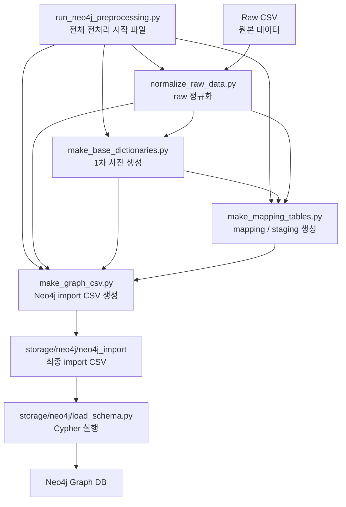

---

## 2. 폴더 구조

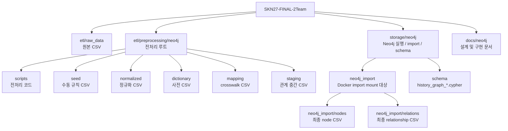

---

## 3. Raw에서 Normalized까지

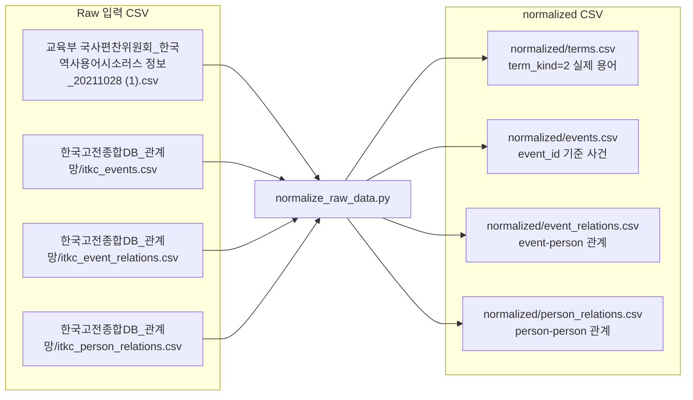

---

## 4. Seed 규칙 입력

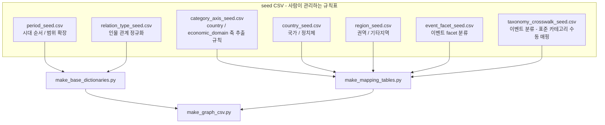

---

## 5. Dictionary 생성 구조

```mermaid
flowchart TB
    norm_terms["normalized/terms.csv"]
    norm_events["normalized/events.csv"]
    norm_event_rel["normalized/event_relations.csv"]
    norm_person_rel["normalized/person_relations.csv"]

    period_seed["seed/period_seed.csv"]
    relation_type_seed["seed/relation_type_seed.csv"]
    event_facet_seed["seed/event_facet_seed.csv"]
    country_seed["seed/country_seed.csv"]
    region_seed["seed/region_seed.csv"]
    category_axis_seed["seed/category_axis_seed.csv"]

    base_dict["make_base_dictionaries.py"]
    mapping_script["make_mapping_tables.py"]

    subgraph dictionary["dictionary CSV"]
        canonical_dict["canonical_category_dictionary.csv"]
        source_event_cat_dict["source_event_category_dictionary.csv"]
        period_dict["period_dictionary.csv"]
        relation_type_dict["relation_type_dictionary.csv"]
        source_url_dict["source_url_dictionary.csv"]
        event_facet_dict["event_facet_dictionary.csv"]
        country_dict["country_dictionary.csv"]
        region_dict["region_dictionary.csv"]
        economic_domain_dict["economic_domain_dictionary.csv"]
        taxonomy_facet_dict["taxonomy_facet_dictionary.csv"]
    end

    norm_terms --> base_dict
    norm_events --> base_dict
    norm_event_rel --> base_dict
    norm_person_rel --> base_dict
    period_seed --> base_dict
    relation_type_seed --> base_dict

    base_dict --> canonical_dict
    base_dict --> source_event_cat_dict
    base_dict --> period_dict
    base_dict --> relation_type_dict
    base_dict --> source_url_dict

    canonical_dict --> mapping_script
    source_event_cat_dict --> mapping_script
    event_facet_seed --> mapping_script
    country_seed --> mapping_script
    region_seed --> mapping_script
    category_axis_seed --> mapping_script

    mapping_script --> event_facet_dict
    mapping_script --> country_dict
    mapping_script --> region_dict
    mapping_script --> economic_domain_dict
    mapping_script --> taxonomy_facet_dict
```

---

## 6. Mapping과 Staging 생성 구조

```mermaid
flowchart TB
    norm_terms["normalized/terms.csv"]
    norm_events["normalized/events.csv"]

    canonical_dict["dictionary/canonical_category_dictionary.csv"]
    source_event_cat_dict["dictionary/source_event_category_dictionary.csv"]
    event_facet_dict["dictionary/event_facet_dictionary.csv"]
    country_dict["dictionary/country_dictionary.csv"]
    region_dict["dictionary/region_dictionary.csv"]
    economic_domain_dict["dictionary/economic_domain_dictionary.csv"]
    taxonomy_facet_dict["dictionary/taxonomy_facet_dictionary.csv"]

    taxonomy_crosswalk_seed["seed/taxonomy_crosswalk_seed.csv"]
    event_facet_seed["seed/event_facet_seed.csv"]

    mapping_script["make_mapping_tables.py"]

    subgraph staging["staging CSV"]
        term_cat_rel["term_canonical_category_relation.csv"]
        event_source_cat_rel["event_source_category_relation.csv"]
        event_date_parse["event_date_parse.csv"]
    end

    subgraph mapping["mapping CSV"]
        taxonomy_crosswalk["taxonomy_crosswalk.csv"]
        source_event_facet_crosswalk["source_event_category_facet_crosswalk.csv"]
        category_country_crosswalk["canonical_category_country_crosswalk.csv"]
        category_region_crosswalk["canonical_category_region_crosswalk.csv"]
        category_economic_crosswalk["canonical_category_economic_domain_crosswalk.csv"]
        category_taxonomy_facet_crosswalk["canonical_category_taxonomy_facet_crosswalk.csv"]
    end

    norm_terms --> mapping_script
    norm_events --> mapping_script
    canonical_dict --> mapping_script
    source_event_cat_dict --> mapping_script
    event_facet_dict --> mapping_script
    country_dict --> mapping_script
    region_dict --> mapping_script
    economic_domain_dict --> mapping_script
    taxonomy_facet_dict --> mapping_script
    taxonomy_crosswalk_seed --> mapping_script
    event_facet_seed --> mapping_script

    mapping_script --> term_cat_rel
    mapping_script --> event_source_cat_rel
    mapping_script --> taxonomy_crosswalk
    mapping_script --> source_event_facet_crosswalk
    mapping_script --> category_country_crosswalk
    mapping_script --> category_region_crosswalk
    mapping_script --> category_economic_crosswalk
    mapping_script --> category_taxonomy_facet_crosswalk

    norm_events --> event_date_parse
```

---

## 7. 최종 Node CSV 생성 구조

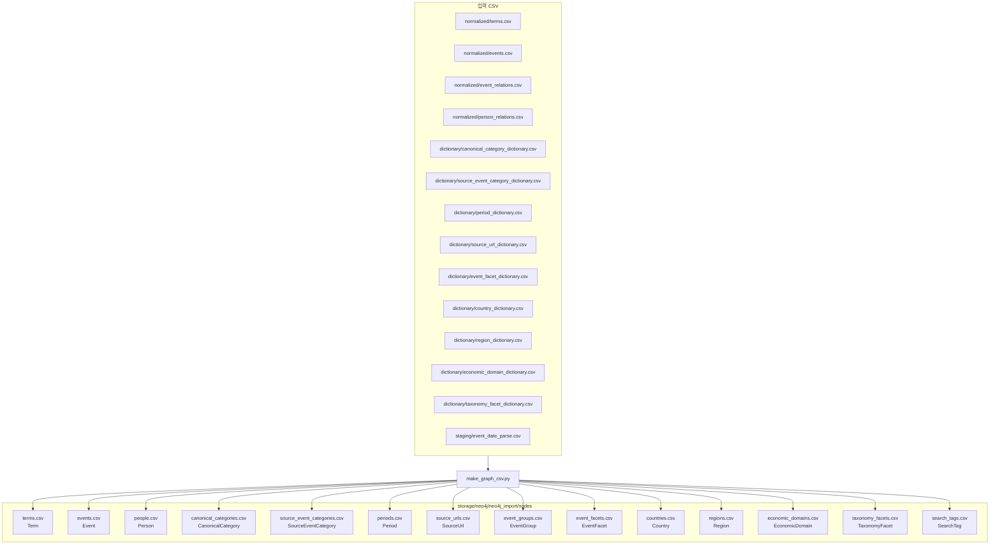

---

## 8. 최종 Relationship CSV 생성 구조

```mermaid
flowchart TB
    graph_script["make_graph_csv.py"]

    subgraph input_groups["입력 묶음"]
        normalized_group["normalized CSV<br/>terms / events / event_relations / person_relations"]
        dictionary_group["dictionary CSV<br/>10개 사전"]
        mapping_group["mapping CSV<br/>6개 crosswalk"]
        staging_group["staging CSV<br/>3개 중간 산출물"]
        node_group["node outputs<br/>EventGroup / SearchTag lookup 포함"]
    end

    subgraph relations["storage/neo4j/neo4j_import/relations"]
        r01["term_has_canonical_category.csv"]
        r02["term_in_period.csv"]
        r03["term_about_country.csv"]
        r04["term_about_region.csv"]
        r05["term_about_economic_domain.csv"]
        r06["term_about_taxonomy_facet.csv"]

        r07["event_has_source_category.csv"]
        r08["event_has_canonical_category.csv"]
        r09["event_has_facet.csv"]
        r10["event_in_period.csv"]
        r11["event_part_of_event_group.csv"]
        r12["event_has_source_url.csv"]
        r13["event_has_search_tag.csv"]
        r14["event_about_country.csv"]
        r15["event_about_taxonomy_facet.csv"]

        r16["person_involved_in_event.csv"]
        r17["person_related_to_person.csv"]
        r18["person_has_source_url.csv"]

        r19["canonical_category_subcategory_of.csv"]
        r20["source_category_mapped_to_canonical_category.csv"]
        r21["canonical_category_about_country.csv"]
        r22["canonical_category_about_region.csv"]
        r23["canonical_category_about_economic_domain.csv"]
        r24["canonical_category_about_taxonomy_facet.csv"]
        r25["region_subregion_of.csv"]
    end

    subgraph optional_relations["optional relation CSV - 0행이면 미생성"]
        opt_r01["event_about_region.csv"]
        opt_r02["event_about_economic_domain.csv"]
    end

    normalized_group --> graph_script
    dictionary_group --> graph_script
    mapping_group --> graph_script
    staging_group --> graph_script
    node_group --> graph_script

    graph_script --> r01
    graph_script --> r02
    graph_script --> r03
    graph_script --> r04
    graph_script --> r05
    graph_script --> r06
    graph_script --> r07
    graph_script --> r08
    graph_script --> r09
    graph_script --> r10
    graph_script --> r11
    graph_script --> r12
    graph_script --> r13
    graph_script --> r14
    graph_script --> r15
    graph_script --> r16
    graph_script --> r17
    graph_script --> r18
    graph_script --> r19
    graph_script --> r20
    graph_script --> r21
    graph_script --> r22
    graph_script --> r23
    graph_script --> r24
    graph_script --> r25
    graph_script -.-> opt_r01
    graph_script -.-> opt_r02
```

---

## 9. Neo4j 그래프 스키마

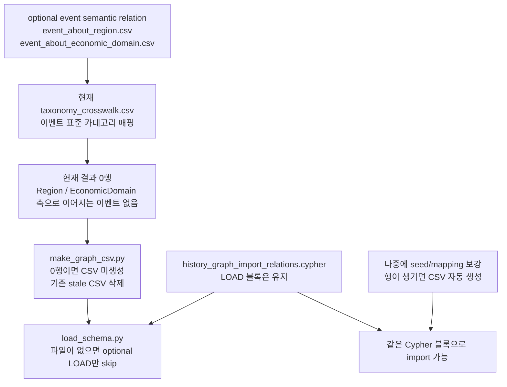

이렇게 구현한 이유는 최종 import 폴더를 실제 적재 대상만 남기는 곳으로 유지하기 위해서다. 0행 CSV를 남겨두면 실제 관계가 존재하는 것처럼 보이고, 검수 시 누락인지 의도된 빈 결과인지 계속 확인해야 한다. 반대로 Cypher 블록까지 완전히 삭제하면 나중에 매핑이 보강되어 행이 생겼을 때 import 구조를 다시 손봐야 한다. 그래서 현재 구현은 빈 CSV는 만들지 않고, `load_schema.py`에서 optional LOAD만 건너뛰는 절충 구조다.

---

## 10. Neo4j 그래프 스키마

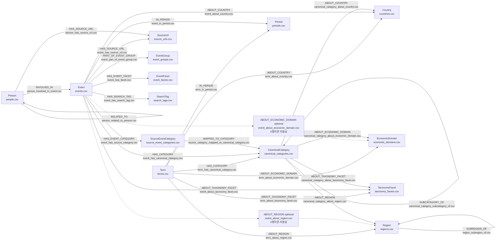

---

## 11. 카테고리 분해와 의미 축 분리

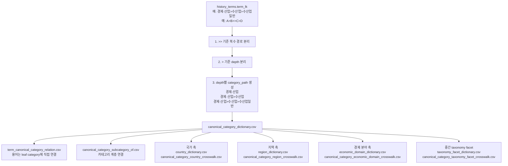

---

## 12. 이벤트 분류 표준화 흐름

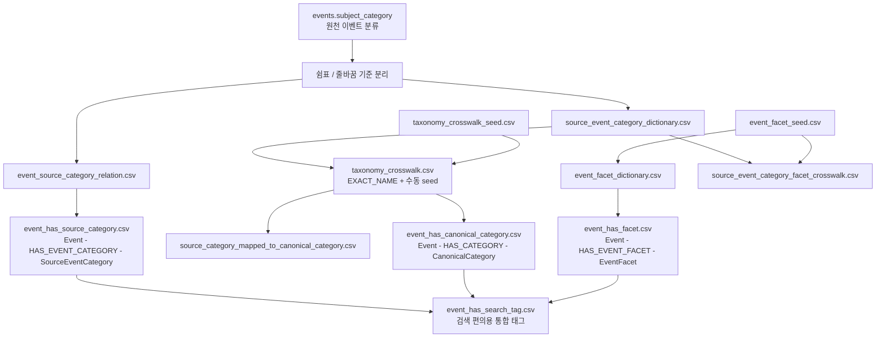

---

## 13. 시대 범위 확장 흐름

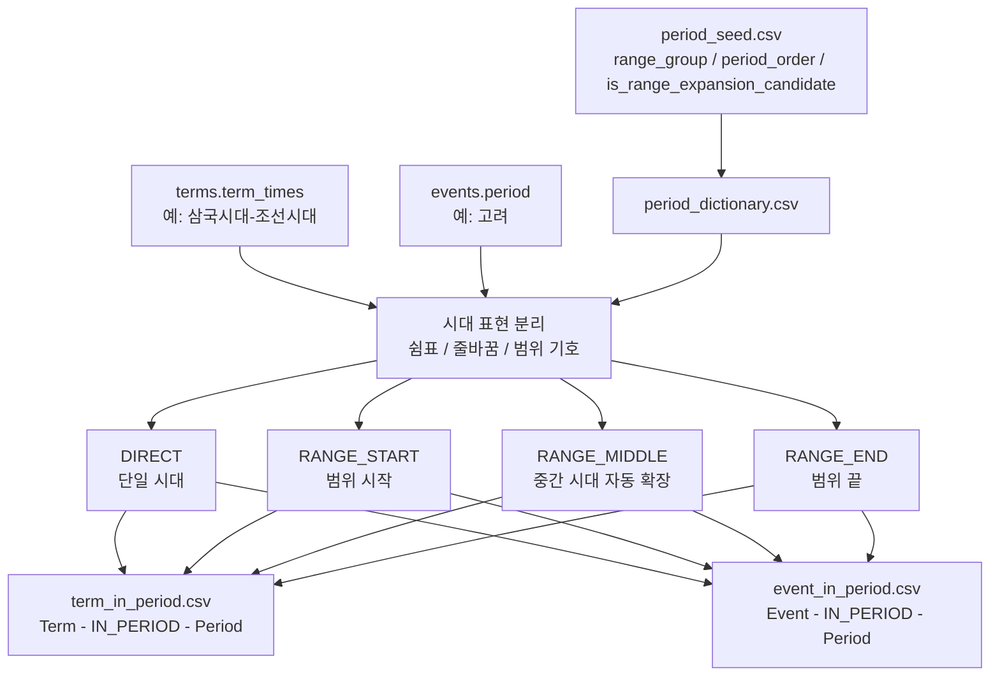

---

## 14. 인물 그래프 생성 흐름

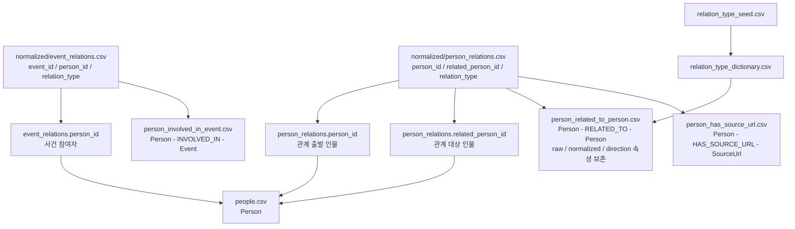

---

## 15. URL과 RAG 후보 흐름

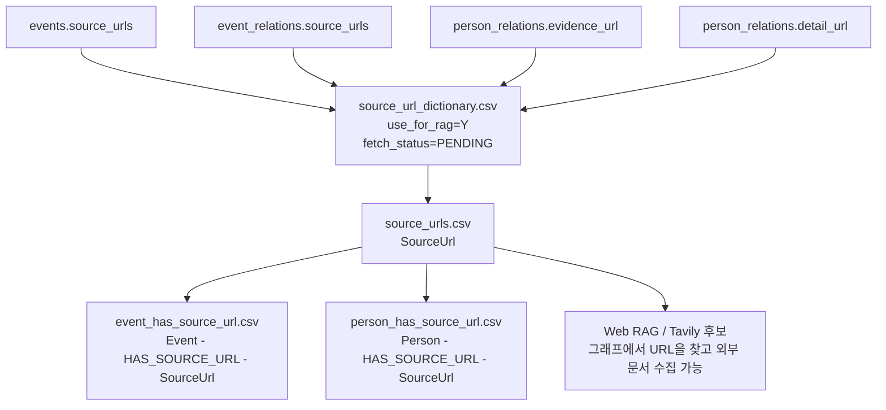

---

## 16. Neo4j import와 Cypher 실행 흐름

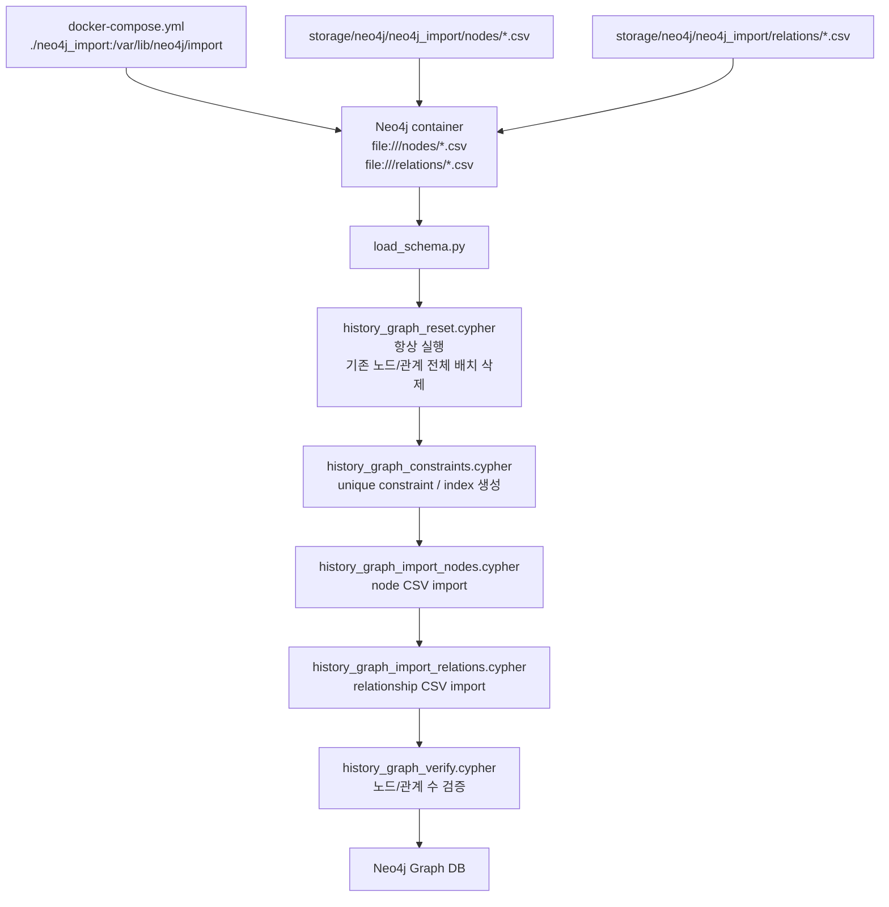

---

## 17. Constraint와 Index 구조

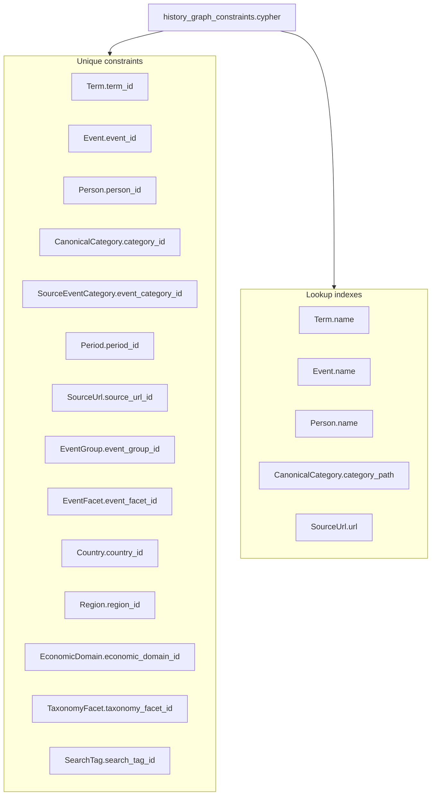

---

## 18. 최종 산출물에서 Neo4j까지 한눈에 보기

```mermaid
flowchart LR
    subgraph node_csv["Node CSV 14개"]
        n1["terms.csv"]
        n2["events.csv"]
        n3["people.csv"]
        n4["canonical_categories.csv"]
        n5["source_event_categories.csv"]
        n6["periods.csv"]
        n7["source_urls.csv"]
        n8["event_groups.csv"]
        n9["event_facets.csv"]
        n10["countries.csv"]
        n11["regions.csv"]
        n12["economic_domains.csv"]
        n13["taxonomy_facets.csv"]
        n14["search_tags.csv"]
    end

    subgraph relation_csv["Relationship CSV 25개"]
        e1["term_has_canonical_category.csv"]
        e2["term_in_period.csv"]
        e3["term_about_country.csv"]
        e4["term_about_region.csv"]
        e5["term_about_economic_domain.csv"]
        e6["term_about_taxonomy_facet.csv"]
        e7["event_has_source_category.csv"]
        e8["event_has_canonical_category.csv"]
        e9["event_has_facet.csv"]
        e10["event_in_period.csv"]
        e11["event_part_of_event_group.csv"]
        e12["event_has_source_url.csv"]
        e13["event_has_search_tag.csv"]
        e14["event_about_country.csv"]
        e15["event_about_taxonomy_facet.csv"]
        e16["person_involved_in_event.csv"]
        e17["person_related_to_person.csv"]
        e18["person_has_source_url.csv"]
        e19["canonical_category_subcategory_of.csv"]
        e20["source_category_mapped_to_canonical_category.csv"]
        e21["canonical_category_about_country.csv"]
        e22["canonical_category_about_region.csv"]
        e23["canonical_category_about_economic_domain.csv"]
        e24["canonical_category_about_taxonomy_facet.csv"]
        e25["region_subregion_of.csv"]
    end

    subgraph optional_relation_csv["Optional relationship CSV 2개"]
        opt_e01["event_about_region.csv<br/>현재 0행이라 미생성"]
        opt_e02["event_about_economic_domain.csv<br/>현재 0행이라 미생성"]
    end

    import_nodes["history_graph_import_nodes.cypher"]
    import_relations["history_graph_import_relations.cypher"]
    graph["Neo4j Graph DB"]

    node_csv --> import_nodes --> graph
    relation_csv --> import_relations --> graph
    optional_relation_csv -.-> import_relations
```
