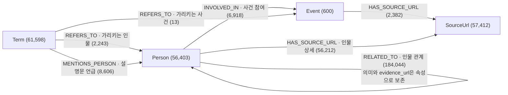
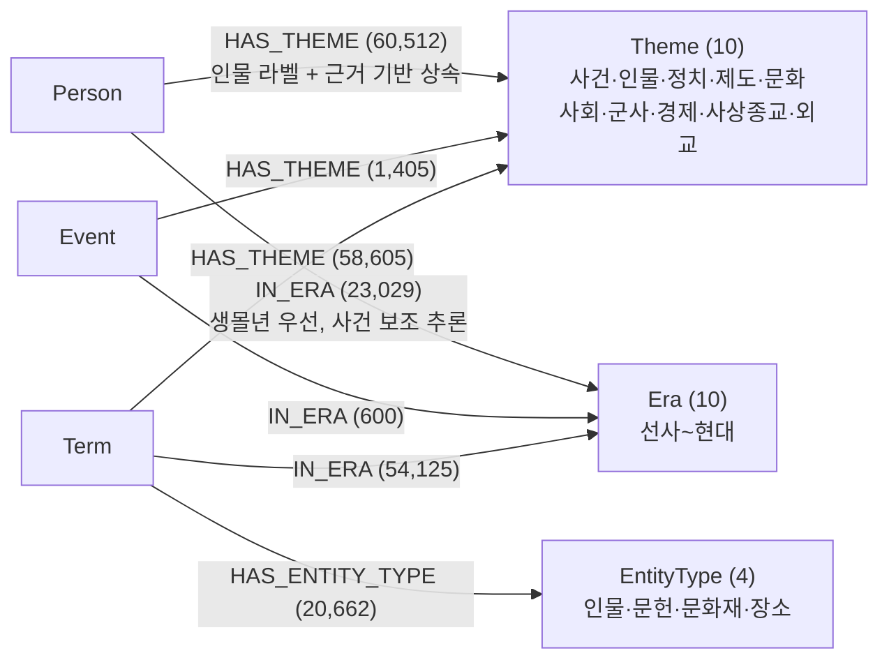
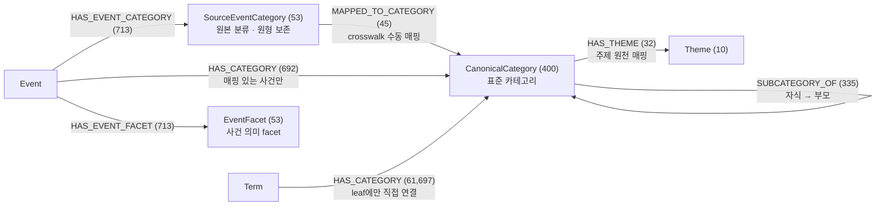
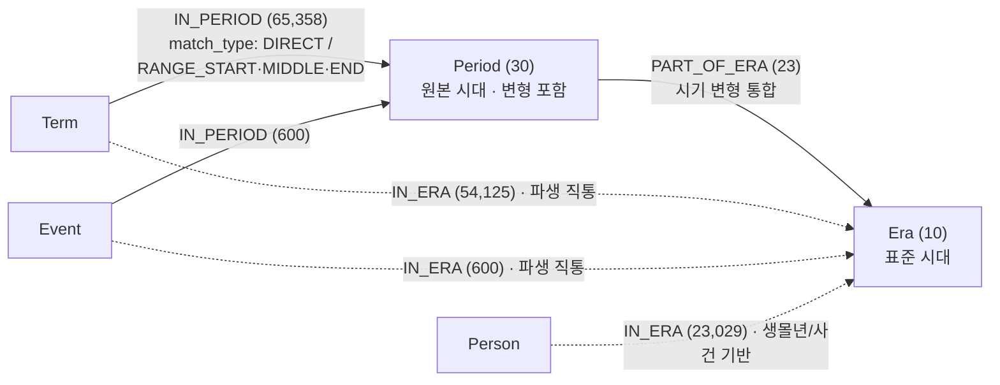
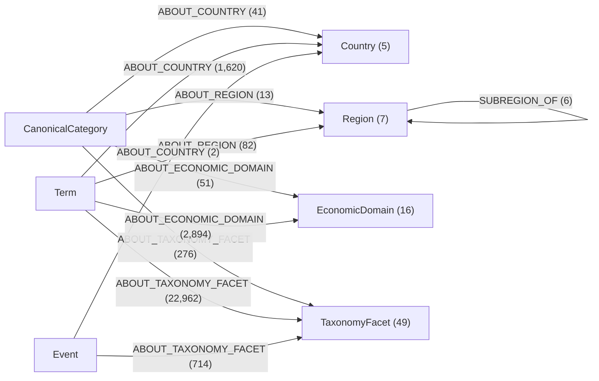
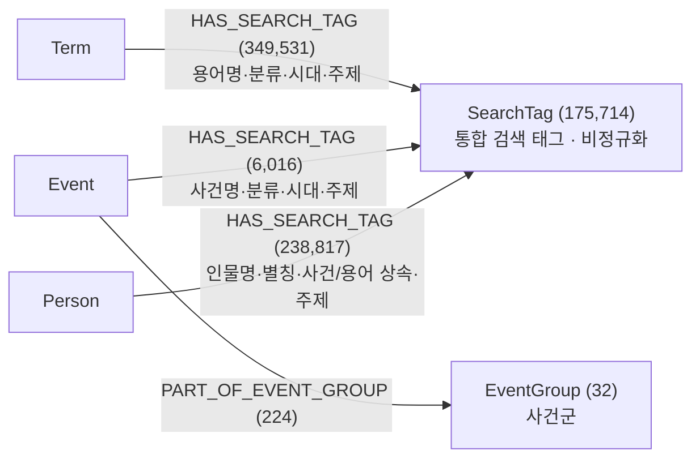

# Neo4j 그래프 스키마 (노드·엣지 연결도)

현재 `storage/neo4j/neo4j_import` 기준 그래프의 노드 17종과 관계 타입 22종을 정리한 문서다. 괄호 안 숫자는 최종 import CSV의 실제 행 수다.

---

## 1. 전체 스키마 한눈에 보기

```mermaid
flowchart TB
    %% ===== 핵심 노드 =====
    Term["Term<br/>역사 용어 (61,598)"]
    Event["Event<br/>역사 사건 (600)"]
    Person["Person<br/>인물 (56,403)"]

    %% ===== 서비스 3축 =====
    Theme["Theme<br/>주제 (10)"]
    Era["Era<br/>표준 시대 (10)"]
    EntityType["EntityType<br/>실체 유형 (4)"]

    %% ===== 분류 체계 =====
    Category["CanonicalCategory<br/>표준 카테고리 (400)"]
    SourceCat["SourceEventCategory<br/>사건 원본 분류 (53)"]
    EventFacet["EventFacet<br/>사건 facet (53)"]
    TaxFacet["TaxonomyFacet<br/>중간 분류 축 (49)"]
    SearchTag["SearchTag<br/>검색 태그 (175,714)"]

    %% ===== 시대/의미 축 =====
    Period["Period<br/>원본 시대 (30)"]
    Country["Country<br/>국가 (5)"]
    Region["Region<br/>권역 (7)"]
    Econ["EconomicDomain<br/>경제 분야 (16)"]

    %% ===== 출처/그룹 =====
    Url["SourceUrl<br/>출처 URL (57,412)"]
    EventGroup["EventGroup<br/>사건군 (32)"]

    %% ----- Term -----
    Term -->|"HAS_CATEGORY (61,697)"| Category
    Term -->|"IN_PERIOD (65,358)"| Period
    Term -->|"IN_ERA (54,125)"| Era
    Term -->|"HAS_THEME (58,605)"| Theme
    Term -->|"HAS_ENTITY_TYPE (20,662)"| EntityType
    Term -->|"REFERS_TO Person (2,243)"| Person
    Term -->|"REFERS_TO Event (13)"| Event
    Term -->|"MENTIONS_PERSON (8,606)"| Person
    Term -->|"HAS_SEARCH_TAG (349,531)"| SearchTag
    Term -->|"ABOUT_COUNTRY (1,620)"| Country
    Term -->|"ABOUT_REGION (82)"| Region
    Term -->|"ABOUT_ECONOMIC_DOMAIN (2,894)"| Econ
    Term -->|"ABOUT_TAXONOMY_FACET (22,962)"| TaxFacet

    %% ----- Event -----
    Event -->|"HAS_EVENT_CATEGORY (713)"| SourceCat
    Event -->|"HAS_CATEGORY (692)"| Category
    Event -->|"HAS_EVENT_FACET (713)"| EventFacet
    Event -->|"IN_PERIOD (600)"| Period
    Event -->|"IN_ERA (600)"| Era
    Event -->|"HAS_THEME (1,405)"| Theme
    Event -->|"PART_OF_EVENT_GROUP (224)"| EventGroup
    Event -->|"HAS_SOURCE_URL (2,382)"| Url
    Event -->|"HAS_SEARCH_TAG (6,016)"| SearchTag
    Event -->|"ABOUT_COUNTRY (2)"| Country
    Event -->|"ABOUT_TAXONOMY_FACET (714)"| TaxFacet

    %% ----- Person -----
    Person -->|"INVOLVED_IN (6,918)"| Event
    Person -->|"RELATED_TO (184,044)<br/>evidence_url은 관계 속성"| Person
    Person -->|"IN_ERA (23,029)"| Era
    Person -->|"HAS_THEME (60,512)"| Theme
    Person -->|"HAS_SOURCE_URL (56,212)"| Url
    Person -->|"HAS_SEARCH_TAG (238,817)"| SearchTag

    %% ----- 구조 관계 -----
    Category -->|"SUBCATEGORY_OF (335)"| Category
    Category -->|"HAS_THEME (32)"| Theme
    Category -->|"ABOUT_COUNTRY (41)"| Country
    Category -->|"ABOUT_REGION (13)"| Region
    Category -->|"ABOUT_ECONOMIC_DOMAIN (51)"| Econ
    Category -->|"ABOUT_TAXONOMY_FACET (276)"| TaxFacet
    SourceCat -->|"MAPPED_TO_CATEGORY (45)"| Category
    Period -->|"PART_OF_ERA (23)"| Era
    Region -->|"SUBREGION_OF (6)"| Region
```

`person_relations.evidence_url`은 `SourceUrl` 노드로 만들지 않는다. 현재 설계에서는 `Person -[:RELATED_TO]- Person` 관계의 `evidence_url` 속성으로만 보존한다.

---

## 2. 핵심 데이터 관계 (용어·사건·인물)

인물 관계 근거 URL은 `HAS_EVIDENCE_URL` 관계가 아니라 `RELATED_TO.evidence_url` 속성이다. 관계의 출처를 볼 때는 관계 속성을 확인하고, URL 노드 기반 RAG 후보는 사건 URL과 인물 상세 URL만 사용한다.

---

## 3. 서비스 3축 (주제·시대·유형) — 직통 관계

문제 생성·검색 서비스는 이 직통 관계만 타면 시대·주제·유형 필터를 대부분 1-hop으로 처리할 수 있다.

---

## 4. 분류 체계 (원본 보존 + 표준화 + 계층)

---

## 5. 시대 축 (원본 표기 → 표준 시대)

점선은 원천 경로(`IN_PERIOD → PART_OF_ERA`)를 전처리에서 미리 펼친 파생 직통 관계다.

---

## 6. 의미 축 (카테고리에서 분리한 국가·권역·경제·중간 분류)

국가와 권역은 상하 관계로 두지 않는다. `Event → ABOUT_REGION / ABOUT_ECONOMIC_DOMAIN`은 설계상 가능하나 현재 매핑 결과 0행이라 생성하지 않는다.

---

## 7. 검색·묶음 레이어

`SearchTag`는 검색 편의를 위한 보조 노드다. Term/Event/Person에서 공통으로 1-hop 검색 진입점을 제공하지만, 원천 의미 축은 각 관계의 `source_node_type`, `source_node_id`, `source_relation`, `source_detail` 속성으로 따로 보존한다. Person은 줄바꿈 별칭을 `PersonAlias` 태그로도 분리해 대표명과 별칭 검색을 모두 지원한다. 기본 graph view에서는 중복처럼 보일 수 있으므로 필요할 때만 포함하고, 일반 탐색 쿼리에서는 제외하는 것이 좋다.

---

노드·엣지별 상세 의미와 설계 이유는 `docs/neo4j/neo4j_설계_근거.md`를 참고한다.
