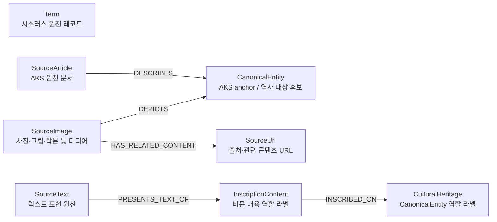
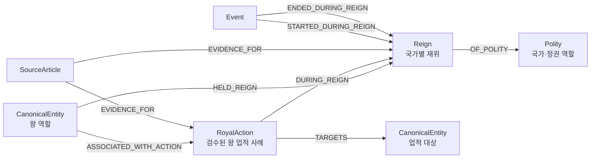
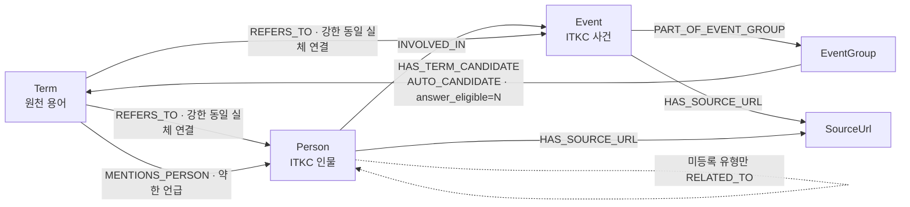
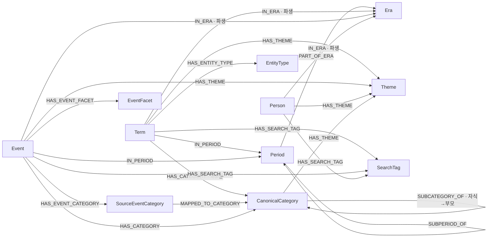
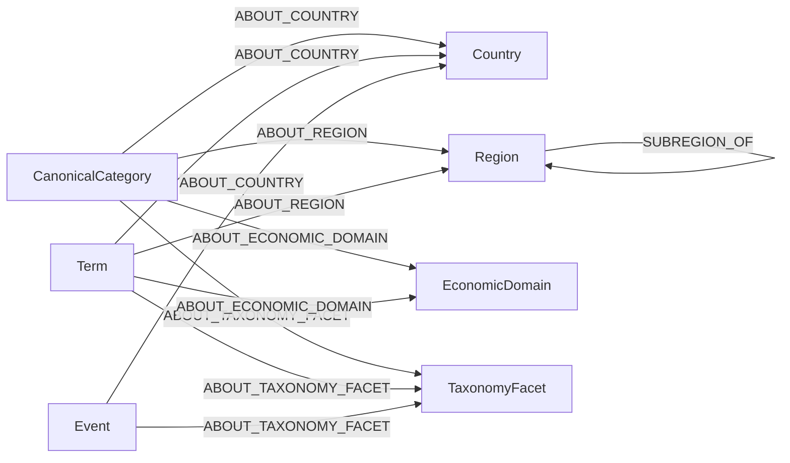

# Neo4j 그래프 스키마

> 문서 상태: `CURRENT-SOURCE`
> 확인일: 2026-07-14
> 코드 기준: commit `44fd60e` + working tree
> 기준 파일: `history_graph_constraints.cypher`, `history_graph_import_nodes.cypher`,
> `history_graph_import_relations.cypher`
> 주의: SOURCE 스키마와 LIVE 적재 상태는 다르다.

이 문서는 최신 **SOURCE가 선언한 현행 스키마**를 보여준다. 목표 온톨로지인
`Fact`, `EvidenceSpan`, `TopicType`, `QuestionFacet`, `SemanticClass`는 아직 이 스키마에
포함되지 않으며 [neo4j_지식그래프_재설계안.md](./neo4j_지식그래프_재설계안.md)에서 다룬다.

## 1. 상태 요약

| 항목 | 최신 SOURCE 계약 | GENERATED | LIVE |
|---|---:|---:|---:|
| 전처리 단계 | 12 | 12단계 완료·QA 135/135 PASS | 해당 없음 |
| node CSV | 26 | 26 | 물리 노드 505,121 |
| relationship CSV | 55 | 55 | 관계 1,308,298 |
| `SourceUrl` | 57,239 | 57,239 | 변경 전 상태 |
| label | 27 | 27 | 27 |
| 관계 타입 | 53 선언 | `RELATED_TO` 0건, 52종 생성 | 32 |

최신 SOURCE로 전체 실행해 preload 계약 114개와 golden case 21개, 총 135/135 QA가
통과했다. 55개 relation CSV의 Cypher `MERGE` identity 중복도 0건이다.
`.preprocessing_complete.json`은 2026-07-14 18:14:27 KST에 생성됐고 후보 디렉터리도
final import 폴더로 승격했다. 위 GENERATED 수치는 승격된 CSV 실측값이며, 이 파일 승격은
LIVE 적재와 별도다.

## 2. 라벨 구조

SOURCE가 제약조건 또는 적재에서 사용하는 라벨은 다음 27종이다.

| 계층 | 라벨 |
|---|---|
| 원천 | `SourceRecord`, `SourceArticle`, `SourceImage`, `SourceText`, `Term` |
| 역사 대상 | `CanonicalEntity`, `Person`, `Event`, `Polity`, `Reign`, `RoyalAction`, `CulturalHeritage`, `InscriptionContent` |
| 분류 | `CanonicalCategory`, `SourceEventCategory`, `EventFacet`, `EventGroup`, `EntityType`, `Theme`, `TaxonomyFacet` |
| 시간·공간·경제 | `Period`, `Era`, `Country`, `Region`, `EconomicDomain` |
| 검색·출처 | `SearchTag`, `SourceUrl` |

라벨 수와 물리 노드 수는 같지 않다. 다음은 의도된 multi-label이다.

- `Term`, `SourceArticle`, `SourceImage`, `SourceText`는 원천 계보를 위해 `SourceRecord` 역할도 가진다.
- `Polity`와 `CulturalHeritage`는 별도 복제 노드가 아니라 기존 `CanonicalEntity`에 역할 라벨을 추가한다.
- 현재 `InscriptionContent` 1건은 기존 `Term`에 역할 라벨을 추가한다.

## 3. 원천·canonical·문화유산·미디어

문화유산 실물과 그것을 보여주는 이미지는 다른 노드다. 예를 들어 광개토대왕릉비
실물은 `CulturalHeritage`, 비문 내용은 `InscriptionContent`, 비석 사진·탁본은
`SourceImage`로 분리한다. 이미지에서 개념으로 가는 `DEPICTS`를 개념 자체로 취급하지 않는다.

`SourceImage.related_content`는 이미지 자신의 설명이 아니라 다른 콘텐츠의 구조화된
제목·콘텐츠군·URL 참조이므로 노드 속성에서 제거한다. GENERATED에서 고유 URL 427개를
`SourceUrl`에 통합하고 1,720개 `HAS_RELATED_CONTENT`로 연결했다. 이 관계는
`SourceImage-[:DEPICTS]->CanonicalEntity`와 목적·endpoint가 다르며 서로 대체하지 않는다.

`CanonicalEntity`는 현재 AKS EID anchor에 가깝다. 아직 `Term`, ITKC `Person`, ITKC
`Event`가 모두 정렬되는 통합 canonical 허브는 아니며, 이는 목표 재설계 범위다.

## 4. 왕·국가·재위·왕 업적과 사건 시점

`STARTED_DURING_REIGN`과 `ENDED_DURING_REIGN`은 왕호가 유일하거나 사건 연도로
동명 왕호가 하나로 해소될 때만 만든다. `match_method`로 유일 왕호/연도 해소 근거를
보존한다. 왕 업적 전체가 `RoyalAction` 9건뿐이라는 뜻은 아니며, 현행 노드는 검수된
구조 사례다. 일반 인물·단체·국가 업적은 목표 `Fact` 모델로 일반화한다.

최신 GENERATED는 `STARTED_DURING_REIGN` 444건, `ENDED_DURING_REIGN` 445건이다.
사건 날짜의 왕호와 연도가 실제 재위 범위를 벗어난 1개 Event는 관계를 만들지 않고
`event_reign_mapping_review.csv`에 시작·종료 각각 1행, 총 2행을
`YEAR_OUT_OF_RANGE`로 남겼다.

## 5. Term·Event·Person 핵심 연결

typed 인물 관계 16종은 다음과 같다.

`HAS_FATHER`, `HAS_MOTHER`, `HAS_BIOLOGICAL_FATHER`, `HAS_BIOLOGICAL_MOTHER`,
`HAS_CHILD`, `HAS_GRANDFATHER`, `HAS_GREAT_GRANDFATHER`, `HAS_FATHER_IN_LAW`,
`HAS_SON_IN_LAW`, `HAS_HUSBAND`, `HAS_WIFE`, `SIBLING_OF`, `LINEAGE_RELATED`,
`HAS_TEACHER`, `HAS_STUDENT`, `ASSOCIATED_WITH`.

인물 관계 CSV의 `relation_type`은 `relation_type_seed.csv.neo4j_rel_type`에서 생성하고,
Neo4j 5.26 dynamic relationship type load로 위 16종을 적재한다. 미등록 유형만
`RELATED_TO`로 보존하며 QA 기대값은 0이다. 대칭 관계는 endpoint를 canonical 순서로
합치되 양방향 원천의 서로 다른 evidence URL을 모두 보존한다. 관계의 `related_count`는
제거하고, `Person.core_relation_degree`는 최종 Person↔Person 관계와 `INVOLVED_IN`의
incident edge 수로 계산한다. 최신 GENERATED의 인물 관계는 184,044건이며 계약 QA를
통과했다.

원천 `related_event_name`은 Event별 직접 Term 링크로 복제하지 않는다. Event가 공유하는
EventGroup을 먼저 거치고, EventGroup 이름이 Term과 exact unique 일치할 때만
18개의 `HAS_TERM_CANDIDATE`를 만든다. 이 관계는 `AUTO_CANDIDATE`이며
`answer_eligible=N`이므로 승인 전 정답 사실로 사용할 수 없다.

## 6. 분류·시대·서비스 조회 축

`HAS_ENTITY_TYPE`은 현행에서 `Term → EntityType`에만 존재한다. 따라서
`CanonicalEntity.entity_type`·`entity_subtype`과 동일한 관계라고 쓰면 안 된다.

`topterm_id`는 Term→Term 계층이 아니라 17개 원천 최상위 분류 코드다. 정규화 원천에는
남지만 최신 `Term` node CSV 속성은 아니다. 실제 계층은 `term_lk`에서 만든
`HAS_CATEGORY` leaf 연결과 `SUBCATEGORY_OF`가 담당한다. 루트 정합 QA에 활용할 수는
있지만 현행 검증기에는 구현되어 있지 않다.

## 7. 의미 축

위 그림은 의미를 압축해 보여준다. `Term-[:ABOUT_REGION]->Region`은 별도로 존재하며,
국가와 권역을 같은 계층으로 합치지 않는다.

최신 GENERATED 실측은 `Term-[:ABOUT_COUNTRY]` 1,619건,
`Term-[:ABOUT_ECONOMIC_DOMAIN]` 2,893건,
`Term-[:ABOUT_TAXONOMY_FACET]` 22,894건,
`Event-[:ABOUT_TAXONOMY_FACET]` 691건이다.

파생 `ABOUT_*` CSV는 `canonical_category_id`, `canonical_category_path`, `match_type`을
동일한 원본 매핑 tuple 순서로 pipe 집계한다. QA는 세 열의 arity를 확인하고, 각
Term/Event의 `HAS_CATEGORY` × `CanonicalCategory-[:ABOUT_*]` 매핑으로 source-target별
기대 tuple set을 만든 뒤 실제 집계 set과 exact equality를 검사한다.

## 8. 전체 SOURCE 관계 타입 사전

| 그룹 | 관계 타입 |
|---|---|
| 원천·근거·미디어 | `DESCRIBES`, `EVIDENCE_FOR`, `HAS_SOURCE_URL`, `HAS_RELATED_CONTENT`, `DEPICTS`, `PRESENTS_TEXT_OF`, `INSCRIBED_ON` |
| 동일 실체·언급·참여 | `REFERS_TO`, `MENTIONS_PERSON`, `INVOLVED_IN`, `HAS_TERM_CANDIDATE` |
| 왕·국가·재위·행위 | `HELD_REIGN`, `OF_POLITY`, `ASSOCIATED_WITH_ACTION`, `TARGETS`, `DURING_REIGN`, `STARTED_DURING_REIGN`, `ENDED_DURING_REIGN` |
| 분류·검색 | `HAS_CATEGORY`, `SUBCATEGORY_OF`, `HAS_EVENT_CATEGORY`, `MAPPED_TO_CATEGORY`, `HAS_EVENT_FACET`, `HAS_THEME`, `HAS_ENTITY_TYPE`, `HAS_SEARCH_TAG`, `PART_OF_EVENT_GROUP` |
| 시간 | `IN_PERIOD`, `SUBPERIOD_OF`, `PART_OF_ERA`, `IN_ERA` |
| 의미 축 | `ABOUT_COUNTRY`, `ABOUT_REGION`, `ABOUT_ECONOMIC_DOMAIN`, `ABOUT_TAXONOMY_FACET`, `SUBREGION_OF` |
| 인물 typed edge | 위 16종 |
| 안전망 | `RELATED_TO` — 승인 목록 밖 인물 관계만, 기대 0 |

중복을 제거하면 SOURCE가 선언하는 관계 타입은 53개다. 미등록 인물 유형의 fallback인
`RELATED_TO`는 선언에는 포함되지만 정상 GENERATED의 기대 건수는 0이다.

## 9. LIVE와의 차이

현재 LIVE에는 기존 인물 `RELATED_TO` 184,044건이 있고 typed 인물 관계는 없다.
`SUBPERIOD_OF`, `HAS_TERM_CANDIDATE`, `HAS_RELATED_CONTENT`,
`STARTED_DURING_REIGN`, `ENDED_DURING_REIGN`도 아직 0건이다. LIVE에는 폐기 대상인
`HAS_RELATED_EVENT` 신규 구현도 적용된 적이 없다. 따라서 최신 SOURCE 전용 관계를
사용하는 조회는 완료된 GENERATED 검증과 별도로 LIVE 적용이 끝난 뒤 활성화해야 한다.

전처리의 원자적 보호 대상은 최종 `nodes/relations`다. 이 파일들만
`.neo4j_import.building` 후보에서 만들고 completion manifest가 있는 검증 성공 결과를
최종 import 디렉터리로 승격한다. `normalized`, `dictionary`, `mapping`, `staging`은 기존
위치에서 재생성되는 비원자적 중간 산출물이다. 완료 후보는 승격 실패 시 보존되며, Windows
bind mount가 rename을 막으면 Neo4j 컨테이너를 중지한 뒤 runner를 `--promote-existing`으로
실행한다. runner가 LIVE DB를 자동 변경하지 않는다.

정규화 상태와 안전한 재적재 주의사항은
[neo4j_관계_정규화_점검.md](./neo4j_관계_정규화_점검.md)를 따른다.
