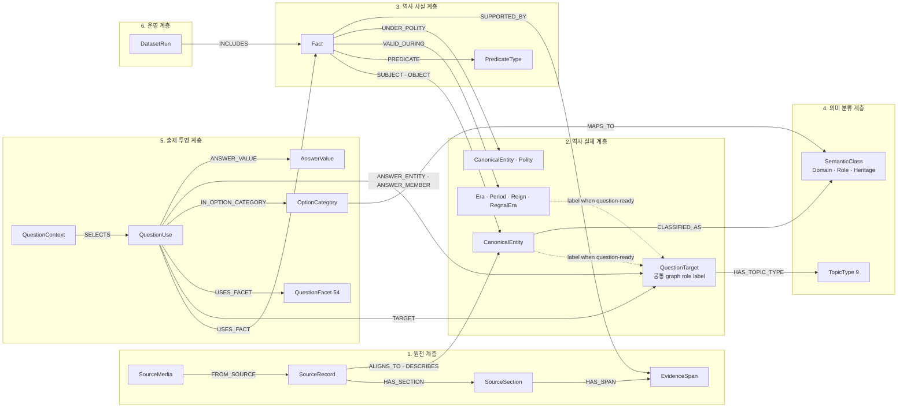
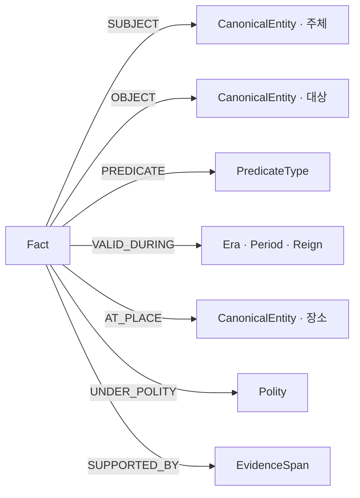
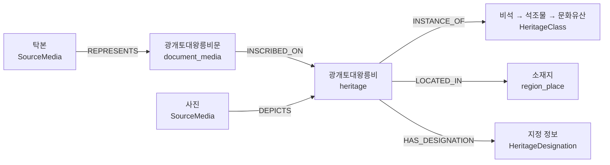

# 한국사 문제 생성용 Neo4j 지식그래프 재설계안

> 문서 상태: `TARGET-DRAFT` v0.2<br>
> 작성 기준일: 2026-07-14<br>
> 적용 범위: `etl/preprocessing/neo4j`, `storage/neo4j`, `docs/neo4j`<br>
> 제외 범위: `graph_service`, 문제 생성 애플리케이션 구현, 기존 운영 DB 변경<br>
> 현행 상태: [README.md](./README.md), 정규화 진행: [neo4j_관계_정규화_점검.md](./neo4j_관계_정규화_점검.md)

## 1. 문서 목적

이 문서는 한국사 문제 생성에 사용할 Neo4j 그래프의 목표 구조와 구현 순서를 확정하기 위한 설계 초안이다.

현재 그래프는 한국역사용어시소러스의 `Term`, ITKC의 `Person`·`Event`, 한국민족문화대백과사전의 `CanonicalEntity`를 각각 적재하고 있다. 원천 데이터 보존과 검색용 분류는 잘 구축되어 있지만, 서로 다른 원천의 동일 역사 개체를 공유하는 canonical 정렬, 일반화된 역사 사실, 문제 출제용 9개 대상·54개 질문 관점, 오답 후보가 공유할 세부분류 계층은 아직 연결되어 있지 않다.

이 문서의 목표는 다음과 같다.

1. 원천 문서, 역사 실체, 역사 사실, 출제 투영을 분리한다.
2. 출제 대상 9개와 QuestionFacet 54개를 변하지 않는 계약으로 고정한다.
3. 왕뿐 아니라 일반 인물·국가·사건·제도·단체·시대·지역·문화유산·문헌의 관계를 같은 원칙으로 표현한다.
4. 문화유산 실물, 비문·문헌 내용, 사진·그림·탁본을 구분한다.
5. 오답 후보가 의미 있는 중간 분류를 공유하도록 구성하되 임의 가변 hop은 사용하지 않는다.
6. 시대별 대표 인물 파일럿을 비파괴적으로 반복한 후 동일 파이프라인으로 전체 데이터에 확장한다.
7. LLM이 자유롭게 그래프를 생성하지 않고, 통제된 후보 추출기로만 동작하게 한다.

이 문서는 목표 설계다. 현재 구현을 설명하는 기존 문서는 이 설계가 승인되고 구현이 진행될 때 별도로 현행화한다.

---

## 2. 확정 원칙

다음 항목은 구현 전에 바꾸지 않는 계약으로 취급한다.

1. 문제 출제 대상 `topic_type`은 정확히 9개를 유지한다.
2. `QuestionFacet`은 정확히 54개, topic별 6개를 유지한다.
3. 기존 `EntityType` 4개, `Theme` 10개, `EventFacet` 53개는 9개/54개의 대체물이 아니다.
4. 엔티티 노드에는 그 엔티티 자체의 정보만 둔다.
5. 다른 엔티티가 필요한 사실은 typed edge 또는 `Fact`로 표현한다.
6. 단순 이항 관계와 시기·지역·역할·단계가 필요한 복합 명제를 구분한다.
7. 모든 LLM 추출 Fact는 정확한 원문 근거에 연결한다.
8. `SearchTag`, URL, 원천 레코드는 오답 생성을 위한 의미 hop으로 사용하지 않는다.
9. 파일럿은 시대별 대표 인물 2~3명과 명시적으로 연결된 주변 대상만 적재한다.
10. 파일럿과 전체 적재는 같은 코드·스키마·프롬프트·검증기를 사용하고 범위만 다르게 한다.
11. loader 기본 동작으로 전체 그래프를 삭제하지 않는다.
12. 분류·predicate·stage·role·품질 임계값은 코드 하드코딩이 아니라 버전이 있는 seed/config로 관리한다.

---

## 3. 현재 상태와 문제

아래 수치는 2026-07-14 점검 당시 **LIVE 스냅샷**의 주요 규모다. 최신 SOURCE에는
seed 기반 typed 인물 관계, EventGroup→Term 후보, SourceImage 관련 콘텐츠 관계,
기간·사건·재위 관계가 추가됐지만 아직 LIVE에 재적재되지 않았다. 최신 SOURCE의 전체
실행 결과는 node CSV 26개, relationship CSV 55개, `SourceUrl` 57,239건, 인물 관계
184,044건이다. preload 114개와 golden 21개, 총 QA 135/135가 통과했고 55개 relation
CSV의 Cypher `MERGE` identity 중복은 0건이다. manifest는 2026-07-14 18:14:27 KST에
생성됐고 final import 승격도 완료했다.

| 영역 | 현재 규모 | 현재 역할 | 문제 |
|---|---:|---|---|
| `CanonicalEntity` | 75,835 | AKS EID 기반 역사 대상 후보 | `Term`·ITKC `Person/Event`와 canonical 정렬이 없음 |
| `Term` | 61,598 | 시소러스 용어·설명·분류 | 원천 용어와 실제 역사 실체의 구분이 일부만 연결됨 |
| `Person` | 56,403 | ITKC 인물 관계망 | AKS 인물과 별도 세계. SOURCE는 typed 관계를 구현했지만 LIVE는 `RELATED_TO` 상태 |
| `Event` | 600 | ITKC 사건 | AKS 사건과 정렬되지 않음. SOURCE의 재위·EventGroup→Term 후보는 canonical 정렬이 아님 |
| `RoyalAction` | 9 | 검수된 왕 업적 사례 | 왕에게만 특수화되어 일반 인물·단체·국가 업적으로 확장하기 어려움 |
| `CulturalHeritage` | 18,511 | 규칙 기반 문화유산 후보 | 본질 유형·법적 지정·문헌·실물 구분이 평면적임 |
| `SourceImage` | 1,417 | 이미지 원천 | `DEPICTS`와 관련 콘텐츠 URL을 분리했으나 미디어 유형과 다중 대상 모델은 부족함 |
| `InscriptionContent` | 1 | 비문 내용 사례 | `Term` 추가 라벨을 사용한 one-off 구조임 |

현재 구조에서 유지할 부분은 다음과 같다.

- `SourceArticle`과 `CanonicalEntity`를 분리하고 `DESCRIBES`로 연결한 원칙
- 원천 분류와 표준 분류를 합치지 않고 crosswalk로 연결한 원칙
- `Period` 원천 표기와 `Era` 표준 시대를 분리한 원칙
- `REFERS_TO`와 단순 설명문 언급인 `MENTIONS_PERSON`을 분리한 원칙
- `SourceImage`를 역사 실체와 다른 원천 노드로 분리한 원칙
- EID, 원천 ID, `review_status`를 보존하는 원칙

수정이 필요한 핵심은 다음과 같다.

### 3.1 CanonicalEntity가 source 간 canonical 허브가 아님

현재 AKS 문서 하나가 AKS EID 기반 `CanonicalEntity` 하나를 만든다. 이 구조는 안정적인 AKS anchor로는 유용하지만, 시소러스 `Term`, ITKC `Person`, ITKC `Event`가 같은 실체를 가리켜도 공유 노드로 모이지 않는다.

따라서 `CanonicalEntity`는 AKS 전용 노드가 아니라 여러 원천 레코드가 정렬되는 역사 실체가 되어야 한다.

### 3.2 출제 온톨로지가 없음

현재 repo에는 고정 9개 `TopicType`, 고정 54개 `QuestionFacet`, 실행 가능한 answer shape 계약이 없다. 기존 `Theme`, `EntityType`, `EventFacet`, `CanonicalCategory`, `TaxonomyFacet`은 목적이 다르므로 이름만 바꿔 재사용하지 않는다.

### 3.3 관계가 노드 속성과 generic edge에 중복됨

발견 당시 인물의 `father_name`은 Person 속성과 Person 관계 CSV에 중복됐고,
`RoyalAction.monarch_name`, `target_name`도 실제 관계와 중복됐다. 최신 SOURCE는 확정된
중복 속성을 노드 CSV에서 제거했다.

인물 관계 CSV의 `relation_type`은 `relation_type_seed.csv.neo4j_rel_type`을 단일 기준으로
삼고 Neo4j 5.26 dynamic typed load로 적재한다. `RELATED_TO`는 미등록 원천 유형의
fallback이며 QA 기대값은 0이다. 대칭 관계는 canonical endpoint 한 쌍으로 합치되 양방향
evidence URL을 모두 보존하고, 관계 의미와 무관한 `related_count`는 제거한다.
`Person.core_relation_degree`는 최종 Person↔Person 관계와 `INVOLVED_IN` incident edge의
합으로 계산한다.

기존 `Event-[:HAS_RELATED_EVENT]->Term` 140건은 Event마다 같은 집단명을 복제하므로
폐기했다. 최신 SOURCE는
`Event-[:PART_OF_EVENT_GROUP]->EventGroup-[:HAS_TERM_CANDIDATE]->Term`을 사용한다.
exact unique 이름 일치 후보만 만들며 GENERATED에서 18건을 확인했다. 모든 후보는
`review_status=AUTO_CANDIDATE`, `answer_eligible=N`이므로 source–canonical 승인 전 정답
근거나 canonical 사실로 사용하지 않는다.

### 3.4 역사 사실 모델이 왕 업적에 특수화됨

현재 `RoyalAction`은 검수 사례를 확인하는 데는 유효하지만, 이순신의 전투·저술, 독립운동가의 활동, 단체의 설립·해체, 제도의 시행 단계, 문헌의 편찬·반포를 같은 방식으로 표현하지 못한다.

### 3.5 문화유산 분류가 속성 문자열 중심임

현재 문화유산 분류는 주로 AKS `primaryTypePartA/B` 규칙과 override로 만든다. 공유 `HeritageClass` 계층이 없기 때문에 비석끼리, 불상끼리, 회화끼리 비교하는 경로가 약하다. 또한 문화유산 실물과 그 실물을 나타내는 이미지, 실물에 새겨진 비문 내용을 분명하게 분리해야 한다.

최신 SOURCE에서는 `SourceImage.related_content`를 이미지 자신의 속성으로 보지 않는다.
구조화된 제목·콘텐츠군·URL 참조를 파싱해 GENERATED에서 고유 URL 427개를 `SourceUrl`에
통합하고 1,720개 `HAS_RELATED_CONTENT`로 연결했다. 이는 이미지가 역사 대상을 묘사한다는
`DEPICTS`와 별개이며, 두 관계를 섞어 문화유산 실물·이미지·관련 문서를 오인하지 않는다.

### 3.6 최종 import 승격은 안전화됐지만 중간 산출물과 loader는 비원자적임

발견 당시 전처리 runner는 실행 시작 시 기존 최종 import CSV를 삭제해 중단되면 정상
산출물까지 잃었다. 최신 SOURCE는 최종 `nodes/relations`만 `.neo4j_import.building`에
만들고 completion manifest가 있는 성공 결과를 최종 import로 atomic promotion한다.
`normalized`, `dictionary`, `mapping`, `staging`은 기존 위치에서 삭제·재생성되는 비원자적
중간 산출물이므로 실패 시 부분 상태가 남을 수 있다. 완료 marker가 있는 후보는 승격 실패
후 보존하며, Windows bind mount가 rename을 막으면 컨테이너를 중지한 뒤
`--promote-existing`으로 재승격한다.

다만 현재 loader의 전체 reset은 별도 문제로 남아 있다. 전처리 파일 promotion은 LIVE
적재가 아니며, loader 안전화·백업·대상 DB 확인·명시 승인 없이 LIVE를 변경하지 않는다.

---

## 4. 목표 계층 구조

목표 그래프는 원천, 실체, 사실, 분류, 출제, 운영의 여섯 계층으로 나눈다.



### 4.1 계층별 책임

| 노드 | 책임 | 허용 정보 | 두지 않는 정보 |
|---|---|---|---|
| `SourceRecord` | 원천 한 건과 출처 보존 | 원천 ID, URL, 원문 메타, source hash | canonical 사실 확정 |
| `SourceSection` | LLM·검색에 사용할 문서 구간 | section ID, 제목, 본문, offset | 역사 관계 확정 |
| `EvidenceSpan` | Fact의 정확한 원문 근거 | exact span, offset, hash, 추출 버전 | 엔티티 이름 복사, 자유 요약 |
| `CanonicalEntity` | 하나의 역사적 의미·대상 | 안정 ID, 이름, 한자, 별칭, 상태 | 부·스승·업적·정책 등 타 엔티티가 필요한 서술 |
| `QuestionTarget` | 9개 topic으로 출제 가능한 노드의 공통 role label | 정확히 하나의 TopicType 관계, question-ready 상태 | 별도 역사 실체 복제 |
| `Fact` | 주체·대상·문맥을 가진 원자 명제 | predicate, stage, certainty, 상태, 버전 | subject/object 이름 복사, 원문 전체 |
| `PredicateType` | 허용 관계 어휘 | predicate ID, family, 타입 계약 | LLM 자유 생성 값 |
| `TopicType` | 고정 출제 대상 9개 | ID, label, version | 세부분류·질문 의도 |
| `QuestionFacet` | 고정 질문 관점 54개 | facet ID, topic ID, intent | 역사 개체 분류 |
| `SemanticClass` | 오답 후보가 공유하는 의미 분류의 공통 상위 label | class ID, subtype, 상하위 관계 | 원천 분류 문자열 |
| `DomainClass` | 정책·사건·문헌·지역 기능 등의 세부분류 | domain ID, 상하위 관계 | 인물 역할·문화유산 본질 유형 |
| `RoleClass` | 왕·장군·학자·승려 등 역할 | 역할 ID, 상하위 관계 | 특정 인물의 활동 문장 |
| `HeritageClass` | 비석·불상·탑·회화 등 문화유산 본질 유형 | 유형 ID, 상하위 관계 | 법적 지정·이미지 유형 |
| `QuestionUse` | Fact를 target·facet·answer 관점으로 사용하는 방식 | target role, answer role, answer shape | 역사적 진실 자체, 문항 polarity |
| `QuestionContext` | 문항 요청의 task·polarity·clue·시간 경계 | task, polarity, clue roles, requested shape | 새로운 역사 사실 |
| `AnswerValue` | 연도·날짜·시간 범위 등 typed answer | value type, normalized value/range | 자유 서술 문장 |
| `OptionCategory` | facet별 후보 버킷 | facet, answer shape, domain mapping | 도메인 온톨로지의 원본 진실 |
| `SourceMedia` | 사진·그림·탁본·지도·스캔 | media kind, URL, 권리, 파일 정보 | 문화유산 실물 라벨 |
| `Reign` | 한 통치자의 재위 구간 | monarch, polity, 시작·종료, 계승 순서 | 왕 업적·정책 문자열 |
| `RegnalEra` | 연호와 유효 기간 | 연호명, 한자, 시작·종료, 사용 국가 | 왕 이름이나 재위 기간과의 합병 |
| `DatasetRun` | 실행·버전·소유권 추적 | run ID, profile, hashes, 상태 | 역사 콘텐츠 |

---

## 5. 원천 레코드와 CanonicalEntity 정렬

### 5.1 Term과 Event는 검색 seed이지 전체 엔티티 whitelist가 아님

시소러스 `Term`과 ITKC `Event`의 용어는 백과사전 문서를 찾는 고정밀 seed로 사용한다. 그러나 이 목록에 없는 AKS 인물·사건·제도·문화유산을 제외해서는 안 된다.

초기 범위는 다음을 합친다.

1. `Term`의 실제 용어와 명시적인 실체 후보
2. ITKC `Event` 이름과 관련 인물
3. AKS 자체 분류로 9개 대상 중 하나에 직접 분류 가능한 항목
4. AKS `relatedArticles`나 본문에 명시된 EID 링크

추후 NLP/NER 확장에서는 본문 이름을 찾되, 즉시 새 `CanonicalEntity`를 만들지 않는다. 먼저 기존 후보에 entity linking하고 해결되지 않은 이름은 `unresolved_mentions`로 보낸다.

### 5.2 정렬 순서

source 간 정렬은 다음 순서로 수행한다.

1. 원천 URL에 AKS EID가 명시된 경우 `EXPLICIT_EID`
2. 이름·한자·대상 유형·시대가 모두 일치하는 유일 후보 `EXACT_TYPED`
3. 검수된 별칭과 문맥을 사용한 유일 후보 `ALIAS_CONTEXT`
4. 사람이 승인한 연결 `MANUAL`
5. 후보가 복수이거나 문맥이 부족하면 `REVIEW_REQUIRED`

정렬 관계에는 최소한 다음을 보존한다.

```text
match_method
confidence
review_status
source_record_id
evidence_id
resolver_version
```

이름만 같은 경우 자동 병합하지 않는다. `REFERS_TO`는 동일 실체를 가리키는 강한 연결이며, 설명에 이름이 등장한 것뿐인 `MENTIONS`와 구분한다.

### 5.3 canonical ID

- AKS EID는 초기 canonical anchor로 우선 사용할 수 있다.
- source 간 통합은 EID를 삭제하거나 source ID를 덮어쓰지 않고 정렬 관계로 남긴다.
- 동명이인·동명 사건은 별도 `CanonicalEntity`를 유지한다.
- 같은 표제어가 실물·내용·개념을 함께 뜻하면 의미별 엔티티를 분리한다.
- `QuestionTarget` label을 가진 노드는 하나의 primary `TopicType`만 가진다.
- 다른 의미 축은 `DomainClass`, `RoleClass`, Fact 관계로 보완한다.

`QuestionTarget`은 별도 복제 노드가 아니라 출제 가능한 노드에 붙는 공통 label이다. 일반 역사 대상은 `CanonicalEntity:QuestionTarget`, 국가·왕조는 `CanonicalEntity:Polity:QuestionTarget`으로 표현한다. `Era`, `Period`, `Reign`도 실제 출제 대상으로 승인된 경우 `QuestionTarget` label과 `period_society` TopicType을 가질 수 있다. 따라서 `period_society.*`가 다른 topic과 동일한 QuestionUse 계약을 사용한다.

---

## 6. 출제 대상 9개와 QuestionFacet 54개

9개 topic은 역사 실체의 문제용 1차 분류다. 그래프의 기준 표현은 `(:QuestionTarget)-[:HAS_TOPIC_TYPE]->(:TopicType)` 관계다. `topic_type` 문자열은 필요하면 export/DTO에서 projection하되 대상 속성과 분류 관계에 중복 저장하지 않는다. `SourceRecord`, `EvidenceSpan`, `Fact`, `DatasetRun` 같은 인프라 노드는 9개로 분류하지 않는다.

| `topic_type` | 출제 대상 | 고정 6개 intent |
|---|---|---|
| `person` | 인물 | `activity_achievement` 활동·업적, `policy_system` 정책·제도, `active_period` 활동 시기, `related_event` 관련 사건, `writing_thought` 저술·사상, `affiliation_relation` 소속·관계 |
| `state_government` | 국가·왕조·정부 | `political_system` 정치 제도, `foreign_relation` 대외 관계, `society_economy` 사회·경제, `culture` 문화, `territory_capital` 영토·수도, `formation_change` 성립·변화 |
| `event_movement` | 사건·전쟁·운동 | `background_cause` 배경·원인, `participants` 참여 세력, `development` 전개 과정, `claim_content` 주장·내용, `result_effect` 결과·영향, `before_after` 전후 사건 |
| `policy_system` | 제도·법령·정책 | `implementer_period` 시행 주체·시기, `background` 시행 배경, `purpose` 목적, `main_content` 주요 내용, `target_operation` 운영 대상, `effect_comparison` 영향·비교 |
| `organization` | 기관·단체·조직 | `foundation_background` 설립 배경, `founder_members` 설립자·구성원, `purpose_ideology` 목적·이념, `main_activity` 주요 활동, `active_period_region` 활동 시기·지역, `change_dissolution` 변화·해체 |
| `period_society` | 시대·시기·사회상 | `politics` 정치, `economy` 경제, `society_life` 사회·생활, `culture_education` 문화·교육, `foreign_relation` 대외 관계, `before_after` 전후 시기 |
| `region_place` | 지역·장소 | `related_event` 발생 사건, `related_organization` 활동 단체, `related_person` 관련 인물, `administrative_capital` 행정·수도 기능, `economy_industry` 경제·산업, `battle_movement` 전투·민족운동 |
| `heritage` | 문화유산·유물·건축물 | `creation_period_state` 제작 시대·국가, `creator` 제작자, `style_feature` 양식·특징, `location` 위치, `use_religion` 용도·종교, `historical_value` 역사적 가치 |
| `document_media` | 문헌·조약·선언·매체 | `author_signatory` 작성·체결 주체, `publication_period` 발표 시기, `background` 배경, `main_content` 주요 내용, `purpose_claim` 목적·주장, `result_related_event` 결과·관련 사건 |

facet ID는 반드시 다음 형식을 사용한다.

```text
{topic_type}.{intent_code}
```

예시는 `person.policy_system`, `policy_system.main_content`, `heritage.style_feature`, `document_media.author_signatory`다.

### 6.1 9/54 불변 검증

전처리와 적재 전후에 다음을 gate로 검사한다.

- topic ID 집합이 정확히 9개인지
- facet ID 집합이 정확히 54개인지
- 각 topic이 정확히 6개 facet을 가지는지
- 기준 버전 대비 ID 추가·삭제·rename이 없는지
- `EventFacet` 53개를 `QuestionFacet`으로 잘못 적재하지 않았는지
- `QuestionTarget`이 primary topic을 정확히 하나 가지는지

### 6.2 9개로 강제 분류하지 않는 대상

백과사전의 모든 source 문서가 문제 출제 대상은 아니다. 일반 동물·식물·현대 자연과학 항목처럼 한국사 출제 대상이 아닌 자료는 원천 레코드로 보존하되 `question_ready=false`로 둔다.

표제어만 보고 분류하지 않는다. 예를 들어 식물명과 비슷한 관직·제도·별칭은 정의, 시대, 상위 분류를 확인해 다른 의미로 분리해야 한다.

### 6.3 54개 facet ID 기준 스냅샷

아래 목록은 구현 seed와 QA가 비교할 기준 ID다.

```text
person.activity_achievement
person.policy_system
person.active_period
person.related_event
person.writing_thought
person.affiliation_relation

state_government.political_system
state_government.foreign_relation
state_government.society_economy
state_government.culture
state_government.territory_capital
state_government.formation_change

event_movement.background_cause
event_movement.participants
event_movement.development
event_movement.claim_content
event_movement.result_effect
event_movement.before_after

policy_system.implementer_period
policy_system.background
policy_system.purpose
policy_system.main_content
policy_system.target_operation
policy_system.effect_comparison

organization.foundation_background
organization.founder_members
organization.purpose_ideology
organization.main_activity
organization.active_period_region
organization.change_dissolution

period_society.politics
period_society.economy
period_society.society_life
period_society.culture_education
period_society.foreign_relation
period_society.before_after

region_place.related_event
region_place.related_organization
region_place.related_person
region_place.administrative_capital
region_place.economy_industry
region_place.battle_movement

heritage.creation_period_state
heritage.creator
heritage.style_feature
heritage.location
heritage.use_religion
heritage.historical_value

document_media.author_signatory
document_media.publication_period
document_media.background
document_media.main_content
document_media.purpose_claim
document_media.result_related_event
```

---

## 7. 엔티티 속성과 관계의 경계

### 7.1 CanonicalEntity에 둘 수 있는 값

- canonical ID
- 대표 이름
- 한자
- 검수된 별칭
- 출제 대상일 경우 `QuestionTarget` label과 정확히 하나의 `HAS_TOPIC_TYPE` 관계
- 생몰년처럼 대상 자체의 안정된 값
- lifecycle/review 상태

관계 해석이 필요한 긴 설명문은 `CanonicalEntity`에 넣지 않고 `SourceRecord`와 `SourceSection`에 둔다. 표시용 요약이 필요하면 원천과 생성 버전을 추적할 수 있는 별도 projection으로 관리한다.

### 7.2 CanonicalEntity에 두지 않는 값

- `father_name`, `teacher_name`, `spouse_name`
- `implemented_policies`, `achievements`
- `related_event_name`
- `monarch_name`, `target_name`
- 다른 엔티티 이름을 포함한 관계 문장 배열

### 7.3 direct typed edge와 Fact 선택 기준

| 조건 | 표현 | 예시 |
|---|---|---|
| 문맥이 없어도 의미가 완결되는 안정 이항 관계 | direct typed edge | `PARENT_OF`, `SPOUSE_OF`, `SUBCLASS_OF`, `ALIGNS_TO`, `DESCRIBES`, `DEPICTS`, `INSCRIBED_ON` |
| 시기·지역·국가·역할·시행 단계·근거가 필요한 명제 | `Fact` | 정책 시행, 전투 참여, 편찬·반포, 단체 설립·해체, 사건 원인·결과 |
| 단순 설명문에 이름이 등장 | 약한 `MENTIONS` | 제도 설명에 특정 인물이 언급됨 |
| 동일 실체를 가리킴 | 강한 `ALIGNS_TO`/`REFERS_TO` | 인물 Term과 canonical 인물 연결 |

가족 관계처럼 역방향 의미가 다른 경우 predicate 방향을 고정한다. 대칭 관계는 안정 ID 순서 등 정해진 규칙으로 한 번만 저장하고 조회에서 양방향 의미를 처리한다.

### 7.4 왕·국가·재위·연호

왕, 국가, 재위, 연호는 서로 다른 개념이므로 한 노드의 문자열 속성으로 합치지 않는다.

```text
(Monarch:CanonicalEntity)-[:HELD_REIGN]->(Reign)
(Reign)-[:OF_POLITY]->(Polity:CanonicalEntity)
(Reign)-[:USED_REGNAL_ERA]->(RegnalEra)
(RegnalEra)-[:USED_BY]->(Polity:CanonicalEntity)
```

- `Monarch`는 `person` topic을 가진 역사 인물이다.
- `Polity`는 `state_government` topic을 가진 국가·왕조·정부 실체다.
- `Reign`은 왕과 정치체가 결합된 재위 구간이다.
- `RegnalEra`는 연호명과 실제 사용 기간이다.
- 한 재위에 연호가 여러 개일 수 있고, 동일 연호가 다른 지역 자료에 인용될 수 있으므로 재위와 연호를 같은 노드로 만들지 않는다.
- 왕의 정책·건립·편찬·전쟁 수행은 monarch node 속성이 아니라 `Fact`가 `DURING_REIGN`으로 Reign에 연결되게 한다.
- 왕끼리 묶는 공통 경로는 이름 문자열이 아니라 `RoleClass:Monarch`, `Polity`, 시대 구간을 사용한다.

---

## 8. 일반 Fact 모델

### 8.1 Fact 구조



Fact는 가능한 한 하나의 검증 가능한 명제만 담는다. “세조가 경국대전 편찬을 시작하고 성종이 완성·반포했다”는 하나의 Fact가 아니라 주체와 단계가 다른 여러 Fact다.

object는 재사용 가능한 역사 대상이면 `CanonicalEntity`로 연결한다. 연도·수량처럼 엔티티가 아닌 값이 필요한 경우에는 타입이 지정된 literal 또는 별도 Value 계약을 사용하고, 자유로운 관계 문장을 object 속성에 넣지 않는다. `RoleClass`의 일반 분류는 `CLASSIFIED_AS_ROLE`로 연결하되, 특정 시기의 관직·역할 수행은 `HELD_ROLE` Fact로 표현한다.

### 8.2 Fact의 안정 ID

`fact_id`는 순번이 아니라 다음 정규화 값으로 만든다.

```text
hash(
  key_version
  + subject_id
  + predicate_id
  + object_id 또는 literal_object
  + normalized_time
  + normalized_place
  + polity_id
  + stage_id
  + argument_roles
)
```

근거는 Fact ID에 포함하지 않는다. 같은 명제를 여러 출처가 지지할 수 있으므로 하나의 Fact에 여러 `EvidenceSpan`을 연결한다. 시기·지역·시행 단계가 달라지면 다른 Fact다.

hash 입력은 UTF-8 canonical JSON, key 정렬, 배열 정렬 규칙, null과 빈 문자열 구분을 고정하고 SHA-256과 ID prefix를 사용한다. `key_version`이 바뀌면 기존 ID를 덮어쓰지 않고 migration mapping을 남기며, 충돌 검사는 pre-load gate에서 수행한다.

### 8.3 predicate와 qualifier 분리

`PILOTED_PRECURSOR`, `REIMPLEMENTED_AND_EXPANDED`, `COMPLETED_AND_PROMULGATED`처럼 여러 의미를 action type 한 문자열에 합치지 않는다.

초기 predicate registry는 다음 family를 기준으로 파일럿에서 확정한다.

| family | predicate 예시 | 주요 대상 |
|---|---|---|
| 역할 | `HELD_ROLE` | 인물–역할 |
| 활동·업적 | `PERFORMED_ACTION`, `CREATED`, `BUILT` | 인물/단체/국가–대상 |
| 정책 | `IMPLEMENTED`, `EXPANDED`, `ABOLISHED` | 인물/정부–제도 |
| 사건 참여 | `PARTICIPATED_IN`, `LED` | 인물/단체/국가–사건 |
| 소속·설립 | `AFFILIATED_WITH`, `FOUNDED` | 인물–단체, 인물/단체–조직 |
| 문헌 | `AUTHORED`, `COMPILED`, `PROMULGATED`, `SIGNED`, `PUBLISHED` | 인물/정부/단체–문헌 |
| 인과 | `CAUSED`, `RESULTED_IN` | 사건/정책–사건/변화 |
| 의미 | `HAS_PURPOSE`, `HAS_CONTENT`, `TARGETED` | 제도/문헌/단체–개념/대상 |

이 표는 코드 enum이 아니라 versioned seed의 초기 후보 목록이다. 최종 ID, 허용 subject/object 타입, 역관계, 대칭 여부, 필수 qualifier는 파일럿 전 registry에서 확정한다.

단계는 predicate와 분리한다.

```text
INITIATION
PILOT
EXPANSION
COMPLETION
PROMULGATION
ABOLITION
```

행위자 역할, 대상 역할, 확실성도 qualifier로 관리한다.

### 8.4 기존 사례를 일반 Fact로 표현하는 방법

| 사례 | subject | predicate | object | stage/맥락 |
|---|---|---|---|---|
| 광해군과 대동법 | 광해군 | `IMPLEMENTED` | 대동법 | `PILOT`, 조선, 해당 재위 |
| 효종과 대동법 | 효종 | `EXPANDED` | 대동법 | 재시행·확대 시점과 지역을 별도 qualifier로 보존 |
| 세조와 경국대전 | 세조 | `COMPILED` | 경국대전 | `INITIATION` |
| 성종과 경국대전 | 성종 | `PROMULGATED` | 경국대전 | `COMPLETION`과 반포 사실을 필요하면 별도 Fact로 분리 |
| 세종과 훈민정음 | 세종 | `CREATED` 또는 `PROMULGATED` | 훈민정음 | 창제와 반포를 별도 Fact로 분리 |
| 장수왕과 광개토대왕릉비 | 장수왕 | `BUILT` | 광개토대왕릉비 | 건립 시기와 국가 연결 |

현재 `RoyalAction`은 이 일반 Fact 모델의 검수된 초기 입력 또는 조회 projection으로 전환한다. 왕 전용 역사 사실 계층으로 유지하지 않는다.

---

## 9. EvidenceSpan과 LLM 근거

### 9.1 근거 단위

문서 URL 전체나 요약문 전체를 Fact의 유일한 근거로 사용하지 않는다. 최소한 다음 정보가 필요하다.

```text
evidence_id
source_record_id
source_version 또는 source_hash
section_id
span_start
span_end
exact_text
span_hash
extractor_version
prompt_version
schema_version
confidence
review_status
```

`evidence_id`는 원천 hash, section, offset, span hash를 사용해 안정적으로 만든다.

### 9.2 근거와 명제의 관계

- 하나의 Fact는 여러 근거를 가질 수 있다.
- 하나의 EvidenceSpan은 여러 Fact를 직접 뒷받침할 수 있다.
- 같은 subject/predicate/object지만 시기나 단계가 충돌하면 자동 병합하지 않는다.
- 충돌 후보는 conflict queue에서 비교한다.
- 원문에 없는 인용문을 LLM이 생성하면 즉시 INVALID 처리한다.

---

## 10. 문화유산·문헌·미디어 구조

문화유산을 분리하는 목적은 실물 개체와 표현 자료를 구분해 문제 생성이 정확한 answer shape를 사용하게 하는 것이다.



### 10.1 역할 분리

| 대상 | 모델 | 예시 |
|---|---|---|
| 물리적 역사 유산 | `CanonicalEntity` + `heritage` | 첨성대, 광개토대왕릉비, 불상, 탑 |
| 추상적 문헌·비문·조약·선언 | `CanonicalEntity` + `document_media` | 비문 내용, 경국대전, 독립선언서 |
| 특정 판본·인쇄본·유물로 지정된 실물 | `heritage` item | 특정 해례본 판본, 지정 필사본 |
| 사진·그림·탁본·지도·스캔 파일 | `SourceMedia` | 첨성대 사진, 비문 탁본 |
| 문화유산 본질 유형 | `HeritageClass` | 건축물, 탑, 비석, 불상, 회화, 도자 |
| 국보·보물·사적 등의 법적 정보 | `HeritageDesignation` | 지정 종류, 번호, 지정 기간 |

### 10.2 분류 원칙

1. AKS의 공식 분류 속성과 계층 경로를 고신뢰 `HeritageClass` seed로 우선한다.
2. `secondaryType`과 법적 지정은 본질 유형과 분리한다.
3. 고서·문헌이라는 이유만으로 자동으로 문화유산 실물로 승격하지 않는다.
4. 하나의 이미지가 여러 대상을 나타낼 수 있으므로 `DEPICTS` 다중 연결을 허용한다.
5. 이미지 제목 일치만으로 역사 관계를 만들지 않고 media–entity 후보 연결 근거로만 사용한다.
6. 검색 결과는 대상 종류를 명시해야 한다. `광개토대왕릉비` 검색에서 실물, 비문, 사진·탁본을 한 노드처럼 반환하지 않는다.

---

## 11. SemanticClass와 오답 후보 경로

### 11.1 공유 중간 노드의 역할

사용자가 원하는 “중간 노드는 비슷하게 타지만 마지막 대상은 다른 오답”을 만들기 위해서는 공유 역사 분류가 필요하다.

예시는 다음과 같다.

```text
대동법 → 공납 제도 → 수취 제도 → 경제 제도
영정법 → 전세 제도 → 수취 제도 → 경제 제도
균역법 → 군역 제도 → 수취 제도 → 경제 제도
```

```text
광해군 → 조선의 군주 → 군주 → 통치자
영조   → 조선의 군주 → 군주 → 통치자
세종   → 조선의 군주 → 군주 → 통치자
```

`SemanticClass`는 공유 계층을 위한 공통 label이며 `DomainClass`, `RoleClass`, `HeritageClass`가 subtype label로 참여한다. 인물 역할을 DomainClass에도 중복 넣거나 문화유산 유형을 별도 문자열로 복사하지 않는다. `OptionCategory`는 특정 facet·answer role·answer shape에 맞는 후보 버킷이며 세 종류의 SemanticClass 어디에도 매핑할 수 있다. 역사 분류와 출제 버킷의 역할을 합치지 않는다.

계층 관계는 자식에서 부모 방향의 `SUBCLASS_OF`로 고정한다. multiple inheritance는 승인 seed에 명시된 경우만 허용하며, 후보 거리는 최소 ancestor distance로 계산한다. 하나의 answer endpoint가 여러 class에 속해도 candidate ID로 중복 제거하고 가장 가까운 경로 하나만 점수에 사용한다.

OptionCategory의 안정 ID는 facet, answer role, answer shape, primary SemanticClass, contract version으로 만든다. 한 QuestionUse는 primary OptionCategory 하나를 가지며 보조 class는 scoring에만 사용한다.

### 11.2 허용 의미 경로

오답 후보 검색에 사용할 수 있는 공유 축은 다음과 같다.

- 같은 `QuestionFacet`
- 같은 `answer_shape`와 `answer_role`
- 같은 predicate family 또는 action stage
- 정답 answer endpoint와 같은 leaf `SemanticClass`
- 정답 answer endpoint와 같은 부모·조부모 `SemanticClass`
- 같은 `RoleClass`
- 같은 `Polity`, `Era`, `Reign`
- 같은 역사적 지역 계층

사용하지 않는 축은 다음과 같다.

- `SearchTag`
- `SourceURL`
- `SourceRecord`
- `EvidenceSpan`
- 단순 문자열 유사도만 있는 관계
- 의미 타입 제한이 없는 `RELATED_TO`

### 11.3 후보 확장 단계

후보 수가 부족하다고 가변 길이 경로를 무제한 탐색하지 않는다. versioned strategy 설정에 따라 다음 단계로 확장한다.

1. 동일 facet + 동일 answer shape + 동일 leaf class
2. 동일 facet + 동일 answer shape + 부모 class 공유
3. 동일 facet + 동일 answer shape + 조부모 class 공유
4. target의 시대·국가·역할과 predicate family로 점수 보정
5. 인접 시대 후보는 별도 fallback 단계에서만 허용
6. 의미 임베딩은 구조 후보 안에서 rerank 용도로만 사용

최대 class depth, 후보 수, 시대 허용 범위, 점수는 코드에 직접 쓰지 않고 전략 config로 관리한다.

### 11.4 hard filter

최종 후보는 최소한 다음 조건을 통과해야 한다.

- 후보 Fact가 active·verified이고 해당 QuestionUse/strategy가 distractor eligible일 것
- 정답과 후보의 facet, answer shape, answer role이 같을 것
- 후보의 동일 `target_role` endpoint가 target과 다르고, 동일 `answer_role` endpoint가 정답 answer와 다를 것
- 지문 단서로 사용한 Fact가 아닐 것
- target role을 제거한 `option_claim_signature(predicate + answer + time/place/polity/stage)`를 target에 재대입했을 때 후보 명제가 실제로 성립하지 않을 것
- 공동 주체·공동 시행·장기 지속·시행 단계 차이 때문에 복수정답이 되지 않을 것
- `distractor_eligible`은 Fact 전역 값이 아니라 QuestionUse 또는 strategy decision 기준으로 통과할 것
- positive/negative 문항의 극성이 정확할 것

---

## 12. QuestionUse와 answer shape

하나의 Fact는 여러 문항 관점에서 재사용할 수 있다. Fact에 facet을 직접 고정하면 target과 answer 역할이 달라질 때 표현하기 어렵다. 이를 위해 `QuestionUse`를 둔다.

예를 들어 `광해군 — IMPLEMENTED/PILOT → 대동법` Fact는 다음처럼 투영할 수 있다.

| target | facet | answer role | answer shape |
|---|---|---|---|
| 광해군 | `person.policy_system` | object | `ENTITY` |
| 광해군 | `person.policy_system` | fact | `FACT_STATEMENT` |
| 대동법 | `policy_system.implementer_period` | subject | `ENTITY` |
| 대동법 | `policy_system.implementer_period` | time | `TIME_POINT` 또는 `TIME_RANGE` |

### 12.1 cardinality와 정답 endpoint

모든 QuestionUse는 다음 cardinality를 만족해야 한다.

- `USES_FACT`: 정확히 1개
- `TARGET`: 정확히 1개 `QuestionTarget`
- `USES_FACET`: 정확히 1개
- `answer_role`: 정확히 1개
- `answer_shape`: 정확히 1개
- primary `IN_OPTION_CATEGORY`: 정확히 1개
- `TARGET`의 TopicType과 QuestionFacet의 TopicType이 같을 것

answer endpoint는 shape에 따라 달라진다.

| answer shape | endpoint 계약 |
|---|---|
| `ENTITY` | `ANSWER_ENTITY` 정확히 1개. 장소 답도 `ENTITY`를 사용하고 endpoint topic을 `region_place`, render hint를 location으로 둔다. |
| `ENTITY_SET` | `ANSWER_MEMBER` 2개 이상. member ID를 정렬·중복 제거한 집합 자체를 정답으로 검증한다. |
| `FACT_STATEMENT` | 별도 answer endpoint 없이 `USES_FACT`의 원자 명제를 versioned surface renderer로 문장화한다. |
| `TIME_POINT` | `ANSWER_VALUE` 정확히 1개. 정규화된 날짜·연도와 precision을 가진다. |
| `TIME_RANGE` | `ANSWER_VALUE` 정확히 1개. 시작·종료·precision을 가지며 필요하면 Era/Period/Reign을 참조한다. |

`FACT_STATEMENT` 문장은 Fact 노드의 자유 텍스트를 정답으로 삼지 않는다. predicate와 argument role별 `surface_template_id`, `renderer_version`으로 생성하고, 정규화한 claim signature와 의미 유사도를 함께 검사해 패러프레이즈 중복을 막는다.

### 12.2 facet–answer 계약

QuestionUse는 다음 versioned registry를 통과한 조합만 생성한다.

```text
QuestionFacet
+ target_topic_type
+ answer_role
+ answer_shape
+ answer_endpoint_topic 또는 value_type
+ allowed_question_task
```

이를 `question_facet_answer_contract`로 관리한다. 예를 들어 `person.policy_system`은 object `ENTITY:policy_system`과 fact `FACT_STATEMENT`를 각각 허용할 수 있지만, 한 QuestionUse에서는 하나만 선택한다.

초기 answer shape enum은 다음을 제안한다.

| answer shape | 의미 |
|---|---|
| `ENTITY` | 인물·국가·사건·제도·단체·문헌 등 하나의 엔티티 |
| `ENTITY_SET` | 참여 세력처럼 검증된 복수 엔티티 묶음 |
| `FACT_STATEMENT` | 하나의 원자 사실 문장 |
| `TIME_POINT` | 특정 연도·시점 |
| `TIME_RANGE` | 활동 기간·시대 범위 |

facet 하나가 여러 answer shape를 허용할 수는 있지만, 실제 QuestionUse와 문항 요청은 정확히 하나의 answer shape와 answer role을 선택해야 한다.

### 12.3 QuestionContext와 문항 polarity

QuestionUse는 target에 대해 참인 역사 Fact의 재사용 방법만 표현하며 positive/negative task를 소유하지 않는다. `standard_select`, `negative_select`, `period_between`, `timeline_position`은 요청 단위 `QuestionContext`가 관리한다.

- `standard_select`: target에 참인 QuestionUse 1개가 정답이고, 다른 대상에서 가져온 false-transplant 후보 4개를 런타임에 구성한다.
- `negative_select`: target에 참인 QuestionUse 4개와, target에는 거짓인 false-transplant 후보 1개를 구성하며 거짓 후보가 정답이다.
- false-transplant는 target의 QuestionUse나 역사 Fact로 저장하지 않는다. 런타임 `OptionCandidate`로 만들고 target에 대한 진릿값을 검증한다.
- `period_between`은 left/right clue Fact를 구분해 가진 QuestionContext를 사용한다.
- `timeline_position`은 기준 Fact와 시간 precision을 가진 QuestionContext를 사용한다.

모든 선지는 동일 facet, answer shape, answer role, 문장 수준을 유지해야 한다.

---

## 13. LLM 관계 추출 계약

### 13.1 LLM을 사용하는 범위

LLM은 다음 작업에만 사용한다.

- 후보 엔티티 사이의 관계 유형 선택
- 문장 안의 주체·대상·시기·장소·국가·단계·역할 추출
- 정확한 근거 span 반환
- 관계가 불충분할 때 abstain

LLM이 하지 않는 작업은 다음과 같다.

- 새로운 canonical ID 생성
- 허용 목록에 없는 predicate 생성
- 이름만 보고 서로 다른 인물을 병합
- 원문에 없는 근거 문장 작성
- 검증 없이 Neo4j에 직접 적재
- QuestionFacet을 자유 선택

QuestionFacet과 QuestionUse는 검증된 Fact의 predicate, argument role, target topic을 사용해 deterministic rule로 만든다.

### 13.2 LLM 입력

전체 백과사전 문서를 매번 보내지 않는다. section-aware evidence window와 이미 확인된 후보만 전달한다.

```text
source_record_id
section_id
source_text
candidate_entities[id, name, topic_type, aliases]
allowed_predicates
allowed_type_signatures
required_qualifiers
relation_schema_version
prompt_version
```

### 13.3 LLM 출력

출력은 strict JSON schema를 사용한다.

```json
{
  "subject_id": "AKS_ENTITY:E...",
  "predicate_id": "IMPLEMENTED",
  "object_id": "AKS_ENTITY:E...",
  "qualifiers": {
    "time_id": null,
    "place_id": null,
    "polity_id": null,
    "stage_id": "PILOT",
    "actor_role_id": "MONARCH"
  },
  "evidence_text": "원문에 실제 존재하는 구간",
  "confidence": 0.0,
  "abstain_reason": null
}
```

### 13.4 후보 상태 흐름

```text
PENDING
→ AUTO_APPROVED 또는 REVIEW_REQUIRED
→ APPROVED 또는 REJECTED
→ 필요 시 SUPERSEDED
```

LLM 원본 응답은 immutable `llm_candidates.jsonl`로 보존한다. 검수 결정은 후보 파일을 덮어쓰지 않고 별도 `review_decisions.csv`에 남긴다. 적재 대상은 `AUTO_APPROVED` 또는 `APPROVED`뿐이다.

### 13.5 cache와 재현성

cache key에는 다음이 포함되어야 한다.

```text
source_hash
section/span hash
sorted candidate IDs
relation schema version
prompt version
model snapshot
model parameters
```

API key는 `.env`에서만 읽고 로그·manifest·cache에 기록하지 않는다. 실제 호출 전 dry-run으로 예상 요청 수·토큰·비용을 출력하고, 실행은 명시적인 LLM 실행 옵션이 있을 때만 허용한다.

각 호출은 `request_id`, cache hit 여부, retry/error, raw response hash, parse 상태, token·cost를 request ledger에 남긴다. cache와 ledger는 요청 단위 임시 파일에 쓴 뒤 atomic rename하며, 성공한 요청은 resume 시 재호출하지 않는다. versioned budget 또는 오류율 임계값을 넘으면 circuit breaker로 후속 호출을 중단한다.

응답 cache는 위에 정의한 완전한 cache key가 모두 동일할 때만 재사용한다. 승인 결정까지 재사용하려면 validator, review policy, TopicType, QuestionFacet, predicate registry 버전도 동일해야 한다.

---

## 14. 파일럿에서 전체 적재까지

### 14.1 파일럿 범위

파일럿 seed는 이름이 아니라 AKS EID를 사용한다.

- 각 시대 구간의 대표 인물 2~3명
- 대표 인물과 명시적 EID로 연결된 1-hop 역사 대상
- 관계 Fact에 필요한 시대·국가·지역·역할·분류 노드
- 알려진 EID 후보 사이의 관계만 추출
- v1 파일럿에서는 본문 NLP로 신규 이름을 생성하지 않음

범위 계산 규칙, 관계별 최대 후보 수, 허용 대상 타입은 `pilot_profile` seed/config로 관리한다.

대표 인물 선정만으로 파일럿을 끝내지 않는다. pilot test matrix가 9개 topic, predicate family, answer shape, 문화유산–문헌–미디어 경계, positive/negative task를 모두 덮어야 한다. 54개 facet은 각 ID별로 “projection 생성 가능” 또는 “현재 source fact 부족” 상태가 명시되어야 하며, 미검증 cell은 full 승격 전에 보완하거나 승인된 waiver를 남긴다.

### 14.2 원천 접근

대형 AKS JSONL을 스크립트마다 전체 순차 스캔하지 않는다. 최초 한 번 다음 인덱스를 만든다.

```text
eid
byte_offset
byte_length
source_hash
```

파일럿은 필요한 EID 문서만 읽는다.

### 14.3 실행 흐름


### 14.4 실행 산출물

모든 실행은 새 디렉터리에 쓴다.

```text
build/neo4j/{dataset_version}/{run_id}/
```

목표 versioned run 구조로 이행하기 전의 현행 안전장치도 같은 원칙을 따른다. 현재
전처리 runner는 최종 `neo4j_import`를 직접 비우지 않고 sibling
`.neo4j_import.building`에서 최종 `nodes/relations`와 QA를 완성한다. 성공 manifest를 쓴
뒤 기존 최종 디렉터리를 `.neo4j_import.previous`로 옮기고 후보를 atomic promotion하며,
실패 시 기존 최종 결과를 복구·보존한다. 중간 `normalized/dictionary/mapping/staging`은
아직 versioned run 디렉터리 밖에서 비원자적으로 재생성된다. 이 단계는 CSV publish일 뿐
LIVE DB publish가 아니다.

기존 정상 run을 실행 시작 시 삭제하지 않는다. 각 run manifest에는 다음을 남긴다.

- run ID, profile `pilot|full`, parent run, 상태
- git SHA, branch, dirty 여부, 이전 active dataset ID
- OS·locale·encoding, Python과 dependency/lockfile 버전
- Neo4j image tag·digest와 loader/import contract 버전
- raw/seed/EID index/schema/prompt/topic/facet/predicate/quality config 파일의 hash·크기·행 수
- LLM model·prompt·schema 버전과 요청·cache·token·cost 집계
- 출력 파일별 hash·행 수·고유키 수
- rejected·conflict·unresolved 수
- 모든 QA 결과

상태는 다음 순서로 관리한다.

```text
CREATED → BUILDING → VALIDATED → LOADED → PUBLISHED
                                   ↘ FAILED
```

실패한 run도 보존하고 마지막 `PUBLISHED` run은 그대로 유지한다.

`DatasetRun`은 Fact를 독점 소유하지 않고 `INCLUDES_FACT`, `INCLUDES_EVIDENCE`, `INCLUDES_PROJECTION` membership으로 참조한다. 같은 stable Fact나 Evidence를 pilot과 full run이 공유할 수 있다. 정리할 때는 published run의 참조가 없는 pilot-only 산출물만 garbage collection하며 `CanonicalEntity`와 승인된 공통 SemanticClass는 파일럿 종료 시 삭제하지 않는다.

모든 파일은 run 디렉터리의 임시 경로에서 완성한 뒤 rename한다. manifest가 `sealed` 상태가 된 뒤에는 수정하지 않는다. `FAILED`는 어느 실행 단계에서든 전이할 수 있다.

### 14.5 loader 안전 원칙

- 기본 모드는 `validate-only` 또는 non-destructive merge다.
- `pilot|full`, run ID, dataset version, database를 명시한다.
- 파일럿 정리는 다른 published run이 참조하지 않는 해당 `run_id`의 Fact·Evidence·projection membership만 선택 정리한다.
- `MATCH (n) DELETE n` 형태의 전역 초기화를 기본 경로에서 사용하지 않는다.
- reset은 별도 명령, 대상 DB 확인, 명시적 opt-in, 백업 또는 snapshot이 있을 때만 수행한다.
- reset 전 URI·database·현재 node/relationship 수·active manifest를 표시하고 host/database allowlist, typed confirmation, snapshot 생성·복원 가능성 검사를 통과해야 한다. CI의 무인 승인도 별도 destructive allow flag 없이는 금지한다.
- v1은 pilot과 full을 별도 Docker project·port·volume으로 격리하는 방식을 기본으로 한다. 같은 DB에서 run ID를 병행하는 방식은 모든 조회가 active dataset을 필터링하는 계약을 지원한 뒤에만 허용한다.
- shared node는 immutable identity만 MERGE하고, mutable 분류·Fact·projection은 dataset membership 단위로 reconcile한다. 새 입력에서 사라진 항목은 이전 노드를 방치하지 않고 해당 dataset에서 비활성화한다.
- full은 별도 staging graph에 적재·검증한 뒤 ActiveDataset 포인터 또는 접속 URI를 단일 전환한다. rollback은 이전 포인터로 되돌리고 publish 전 staging 데이터가 운영 조회에 노출되지 않게 한다.

### 14.6 full 승격 조건

- pilot과 full은 scope profile만 다르고 나머지 코드는 같아야 한다.
- 파일럿 golden case와 시대/topic/predicate별 검수 표본이 통과하기 전 전체 LLM 호출을 금지한다.
- 완전한 cache key와 validator·review policy 버전이 같은 파일럿 응답·승인 결과만 full에서 재사용한다.
- 전체 실행 전 예상 API 비용·시간·디스크를 manifest preview로 확인한다.
- full 실패 시 현재 운영 그래프를 삭제하지 않는다.

---

## 15. 품질 검증 기준

### 15.1 pre-load gate

- raw parse error 0
- duplicate source ID 0
- 필수 seed 누락 0
- `expected_scope_eids = processed + explicitly_excluded`이고 scope coverage 100%
- 필수 section/task별 terminal status가 존재하며 pending·failed·unprocessed batch 0
- skip·exclude 항목마다 versioned reason ledger가 존재함
- full output의 entity·Fact·Evidence 급감·급증이 versioned tolerance 이내
- topic 정확히 9개, facet 정확히 54개, topic당 facet 6개
- `QuestionTarget`의 primary topic 정확히 1개
- 승인 Fact의 subject/object endpoint 누락 0
- 모든 Fact의 SUBJECT 정확히 1개, PREDICATE 정확히 1개, OBJECT·필수 qualifier cardinality가 predicate registry와 일치
- 허용되지 않은 subject/predicate/object 타입 조합 0
- 승인 Fact 중 EvidenceSpan 없는 항목 0
- evidence exact span 불일치 0
- 미승인·거절 후보 import 포함 0
- 중복 `fact_id`, `evidence_id` 0
- `father_name`, `implemented_policies`, `achievements` 같은 금지 관계 속성 0
- `SourceMedia`가 `heritage` 실물로 분류된 사례 0
- 모든 QuestionUse가 TARGET·USES_FACT·USES_FACET·answer role·answer shape·primary OptionCategory를 각각 정확히 1개 가짐
- QuestionUse의 answer endpoint cardinality가 answer shape 계약과 일치
- required artifact 파일·header·schema version·고유키·FK·hash가 import contract와 일치
- Cypher `LOAD CSV` 목록과 실제 artifact 목록이 정확히 일치
- conflict·unresolved·abstain 비율과 시대/topic/predicate별 검수 precision·recall이 `quality_gate.yaml` 임계값을 통과

현행 정규화 bridge에서는 위 목표 gate와 함께 다음 계약을 검증했다. 최신 전체 실행에서
아래 계약과 golden case가 모두 통과했으며, 건수는 승격된 GENERATED 실측값이다.

- Cypher가 선언한 node/relationship CSV와 실제 artifact 집합이 정확히 일치: node 26개,
  relationship 55개
- `SourceUrl` 57,239건, endpoint orphan·고유키 중복 0
- `person_related_to_person.csv.relation_type`이 seed의 `neo4j_rel_type` 허용 집합과 일치,
  `RELATED_TO` 기대 0
- 대칭 Person pair 중복 0, 양방향의 서로 다른 evidence URL 유실 0,
  관계 `related_count` 컬럼 0
- 모든 `Person.core_relation_degree`가 최종 Person↔Person + `INVOLVED_IN` incident edge와 일치
- `EventGroup-[:HAS_TERM_CANDIDATE]->Term`은 exact unique 18건,
  전부 `AUTO_CANDIDATE`와 `answer_eligible=N`
- `SourceImage.related_content` 노드 속성 잔존 0,
  `HAS_RELATED_CONTENT` 1,720건, `DEPICTS`와 endpoint·의미 혼합 0
- 사건 재위 관계는 시작 444건·종료 445건, 재위 연도 범위 밖 후보는
  `event_reign_mapping_review.csv`의 `YEAR_OUT_OF_RANGE` 2행으로 격리
- 의미 축 관계는 Term→Country 1,619건, Term→EconomicDomain 2,893건,
  Term→TaxonomyFacet 22,894건, Event→TaxonomyFacet 691건
- 파생 `ABOUT_*`의 category ID·path·match type pipe 집계는 동일 tuple 순서를 유지하고,
  Term/Event `HAS_CATEGORY` × `CanonicalCategory-[:ABOUT_*]`로 만든 source-target별 기대
  tuple set과 실제 집계 set의 exact equality(누락·초과 0)를 QA로 확인
- 55개 relation CSV의 Cypher `MERGE` identity 빈 값·중복 0
- preload 계약 114개와 현행 golden case 21개가 모두 통과해 135/135 PASS
- `.preprocessing_complete.json` 2026-07-14 18:14:27 KST 생성과 final import 승격 완료

### 15.2 post-load gate

- uniqueness constraint와 index가 모두 ONLINE
- 실제 constraint/index 집합이 schema version의 required set과 정확히 일치
- import artifact 수와 DB 적재 수가 run ID 기준 일치
- orphan Fact·EvidenceSpan·SourceSection 0
- 9/54, DomainClass, HeritageClass 계층 cycle 0
- 허용된 최대 depth 계약 통과
- 하나의 endpoint 관계에 여러 시기·단계·근거가 덮어써져 유실된 사례 0
- critical verify count가 0이 아니면 loader 실패
- 핵심 후보 조회의 p95, 후보 수, 경로 길이가 versioned quality gate를 통과

### 15.3 golden case

| 사례 | 반드시 확인할 것 |
|---|---|
| 광해군–대동법 | 시범 시행과 후대 확대를 같은 `IMPLEMENTED` 사실로 뭉개지 않음 |
| 효종–대동법 | 재시행·확대의 시기·지역·단계를 보존함 |
| 세조/성종–경국대전 | 편찬 착수와 완성·반포 주체를 구분함 |
| 문종–경국대전 | 완성 주체로 잘못 연결되지 않음 |
| 세종–훈민정음 | 창제·반포·서문 저술처럼 다른 행위를 분리함 |
| 장수왕–광개토대왕릉비 | 건립 주체와 비의 명칭 대상인 광개토대왕을 혼동하지 않음 |
| 광개토대왕릉비 검색 | 비석 실물, 비문 내용, 사진·탁본을 서로 다른 shape로 반환함 |
| 첨성대 검색 | 문화유산 실물과 사진을 구분하고 올바른 국가·시대·유형을 탐색함 |
| 왕–재위–국가–연호 | 인물, Reign, Polity, RegnalEra를 분리하고 한 재위의 복수 연호와 같은 국가의 왕을 올바르게 탐색함 |
| negative select | 1개 false + 4개 true의 극성을 별도로 검증함 |
| `period_society` target | Era·Period·Reign의 QuestionTarget과 6개 facet projection이 생성됨 |
| `ENTITY_SET` | 참여 세력의 exact membership·중복·부분집합을 검증함 |
| 시간 answer | exact-year `TIME_POINT`와 Reign `TIME_RANGE`를 구분함 |
| Fact 재사용 | 한 Fact에서 subject·object·time answer의 서로 다른 QuestionUse가 안전하게 생성됨 |
| 다중 SemanticClass | 여러 class 경로가 있어도 같은 후보가 중복 반환되지 않음 |

### 15.4 오답 후보 검증

- 같은 중간 분류를 공유하지만 마지막 대상은 다른 후보가 생성되는지
- 정답 대상에도 성립하는 후보가 제외되는지
- 최초 시행·확대·완성·반포 단계가 다른 후보를 복수정답으로 섞지 않는지
- 공동 저술·공동 시행·복수 단체 가입을 단독 사실로 오인하지 않는지
- 동일 문장의 패러프레이즈가 중복 선지로 나오지 않는지
- leaf 후보 부족 시 parent, grandparent 순서로만 fallback되는지

---

## 16. 구현 단계

코드 변경은 다음 순서로 진행한다.

### 단계 0. 계약 확정

- 9개 TopicType seed
- 54개 QuestionFacet seed
- answer shape·answer role·question task registry
- facet–target–answer contract
- predicate·type signature·stage·role registry
- DomainClass와 HeritageClass 초기 범위
- 파일럿 EID 목록

### 단계 1. 비파괴 파일럿 기반

- 현행 최종 import의 후보 디렉터리·manifest·atomic promotion 안전장치 유지
- 아직 비원자적인 `normalized/dictionary/mapping/staging`도 versioned run 디렉터리로 이동
- AKS EID offset index
- versioned run directory와 manifest
- pilot scope builder
- reset 없는 pilot loader
- pre/post-load gate

### 단계 2. source–canonical 정렬

- Term/Person/Event → CanonicalEntity 후보 생성
- 명시 EID·이름·한자·시대·타입 검증
- ambiguous/unresolved review queue
- 승인 정렬 관계 적재

### 단계 3. 의미 분류

- 9개 primary topic 분류
- CanonicalEntity·Era·Period·Reign의 QuestionTarget 승인
- DomainClass·RoleClass 계층
- HeritageClass·HeritageDesignation 분리
- 일반 동식물·비역사 항목의 question-ready 제외

### 단계 4. Fact와 EvidenceSpan

- 규칙 기반 사실 우선 생성
- LLM 후보·cache·strict output
- deterministic validator
- review decision
- 승인 Fact/Evidence 적재

### 단계 5. 출제 projection

- QuestionUse 생성 규칙
- OptionCategory와 SemanticClass mapping
- exact leaf → parent → grandparent 후보 조회
- positive/negative, timeline, period-between 검증

### 단계 6. 전체 승격

- 파일럿과 동일한 코드로 full scope 실행
- staging graph 적재
- 모든 gate 통과
- active dataset 전환과 rollback 보존

`graph_service` 조회 변경은 이 문서 범위 밖이다. Neo4j 쪽에서는 최종 노드·관계·ID·조회 계약을 먼저 제공하고, 서비스 담당자가 그 계약에 맞게 bounded query를 구현하도록 협조 요청한다.

---

## 17. 예상 신규 산출물

아래 파일명은 구현 단계에서 확정할 제안이며, 이 문서를 작성한 시점에는 생성하지 않는다.

### 17.1 seed/config

```text
topic_type_seed.csv
question_facet_seed.csv
answer_shape_seed.csv
answer_role_seed.csv
question_task_seed.csv
question_facet_answer_contract.csv
predicate_type_seed.csv
predicate_signature_seed.csv
action_stage_seed.csv
role_class_seed.csv
regnal_era_seed.csv
semantic_class_seed.csv
domain_class_seed.csv
heritage_class_seed.csv
pilot_scope_seed.csv
quality_gate.yaml
```

### 17.2 중간 산출물

```text
entity_alignment_candidates.csv
entity_alignment_decisions.csv
llm_candidates.jsonl
review_decisions.csv
fact_validation_report.csv
unresolved_mentions.csv
conflicting_facts.csv
```

### 17.3 Neo4j import 산출물

```text
canonical_entity_topic_type.csv
semantic_classes.csv
semantic_class_subclass_of.csv
canonical_entity_classified_as.csv
option_categories.csv
option_category_maps_to_class.csv
facts.csv
evidence_spans.csv
answer_values.csv
fact_subject.csv
fact_object.csv
fact_supported_by.csv
question_uses.csv
question_use_fact.csv
question_use_target.csv
question_use_facet.csv
question_use_option_category.csv
question_use_answer_entity.csv
question_use_answer_member.csv
question_use_answer_value.csv
dataset_run_includes_fact.csv
dataset_run_includes_evidence.csv
dataset_run_includes_projection.csv
```

---

## 18. 구현 전 확정이 필요한 항목

다음 항목은 설계 원칙을 바꾸는 문제가 아니라 v1 값을 확정해야 하는 항목이다.

1. 시대별 파일럿 대표 인물의 정확한 EID 목록
2. predicate registry v1의 구체 ID와 타입 signature
3. action stage와 actor/object role의 초기 목록
4. DomainClass 초기 계층의 범위와 최대 깊이
5. 문화유산 공식 분류를 HeritageClass로 변환하는 crosswalk
6. 별도 pilot DB/volume과 동일 DB `run_id` 격리 중 실제 실행 방식
7. AUTO_APPROVED 기준과 사람 검수 표본 비율
8. API 비용·시간 budget과 중단 조건
9. `graph_service`에 전달할 최종 조회 계약

이 값들은 seed/config로 확정하며 코드 조건문에 직접 넣지 않는다.

---

## 19. 현행 구현 근거

- AKS `SourceArticle`·`CanonicalEntity`: `etl/preprocessing/neo4j/scripts/make_aks_graph_csv.py`
- 문화유산 규칙: `etl/preprocessing/neo4j/scripts/make_aks_heritage_csv.py`
- 왕 업적 사례: `etl/preprocessing/neo4j/scripts/make_aks_royal_action_csv.py`
- 전처리 전체 실행, 후보 디렉터리 검증과 atomic promotion: `etl/preprocessing/neo4j/run_neo4j_preprocessing.py`
- 인물 typed 관계·대칭 evidence·core degree와 EventGroup 후보: `etl/preprocessing/neo4j/scripts/make_graph_csv.py`
- 이미지 관련 콘텐츠 URL 분리: `etl/preprocessing/neo4j/scripts/make_source_image_csv.py`
- Neo4j 전체 reset과 schema 적재: `storage/neo4j/load_schema.py`
- 현재 노드 import: `storage/neo4j/schema/history_graph_import_nodes.cypher`
- 현재 관계 import: `storage/neo4j/schema/history_graph_import_relations.cypher`
- 현재 검증: `storage/neo4j/schema/history_graph_verify.cypher`
- 기존 설계 설명: `docs/neo4j/neo4j_설계_근거.md`
- 기존 구현 흐름: `docs/neo4j/neo4j_implementation_mermaid_flow.md`

---

## 20. 변경 이력

| 버전 | 날짜 | 내용 |
|---|---|---|
| v0.1 | 2026-07-14 | 현행 감사 결과, 9/54 계약, canonical 정렬, Fact/Evidence, 문화유산·미디어 분리, 파일럿/전체 적재 방향을 최초 통합 |
| v0.2 | 2026-07-14 | seed 기반 dynamic 인물 관계, EventGroup→Term 후보, SourceImage 관련 콘텐츠 URL 분리, 실패 안전 전처리와 현행 QA 계약 반영 |
