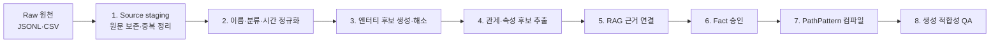

# 04. Raw 데이터에서 생성 가능 그래프까지의 ETL

## 1. 전체 단계



각 단계는 이전 단계 산출물을 수정하지 않고 새 산출물을 만든다. 원본 값과 정규화 값을 동시에 보존해 재현과 검토가 가능해야 한다.

## 2. 0단계: 원천 등록

`SourceDataset`에 다음 메타데이터를 기록한다.

```text
dataset_id
source_name
file_path
file_format
encoding
sha256
schema_version
collected_at
authority_grade
license_or_terms
```

원천 해시가 달라지면 이전 검토 결과를 무조건 재사용하지 않는다. 변경 행을 비교하고 영향받은 엔터티·Fact·PathInstance만 다시 계산한다.

## 3. 1단계: Source staging

### 3.1 대백과사전

- `articles_detail.jsonl`의 고유 `eid`를 기준으로 한 행을 만든다.
- 목록 파일의 중복 행은 감사 로그에만 남긴다.
- 별칭, 구조화 속성, 관련 문서, 미디어는 중첩 배열을 별도 staging 행으로 펼친다.
- 본문은 정제 후 RAG 파이프라인으로 보내고, 그래프 staging에는 원문 해시와 문서 ID만 남긴다.

### 3.2 고전종합DB

- 인물은 `person_id` 기준으로 중복 행을 합친다.
- 사건은 `event_id` 기준으로 `event_subject`, `event_period` 중복을 합친다.
- 인물 이름 75건에 포함된 CRLF 다값은 공백으로 먼저 뭉개지 않고 개인명·왕호 등의 별도 `NameVariant` 후보로 분리한다.
- 사건 600개 중 113개의 `subject_category`는 쉼표와 CRLF가 함께 쓰인 다값이므로 Category 생성 전에 값별로 분리한다.
- 중복 행에서 발견한 여러 상세 URL은 버리지 않고 출처 목록으로 모은다.
- 인물 관계는 `(person_id, raw_relation_type, related_person_id)`로 중복을 제거한다.
- 사건 관계는 `(event_id, person_id)`로 중복을 제거하되 원래 scope를 provenance로 보존한다.
- 중복 제거 뒤에도 남는 인물 관계 self-loop 12건은 production Fact로 자동 승격하지 않고 검토 격리한다.
- 관계 행의 표시 이름이 endpoint 레코드 이름과 다른 인물 관계 2,146행과 사건 관계 878행은 ID 연결을 유지하되 이름 불일치 감사 항목으로 기록한다. 두 관계 파일의 ID endpoint 누락은 0건이다.
- 원천 `related_count`는 실제 고유 관계 이웃 수와 352명에서 다르고, 사건 `person_count`는 실제 고유 사건-인물 간선 수와 10개 사건에서 다르다. 두 필드는 원천 감사값으로만 보존하고 그래프 degree의 진실값으로 사용하지 않는다.

### 3.3 시소러스

- `term_id`를 기준으로 한 행을 유지한다.
- `term_kind=0`은 분류 루트 후보, `term_kind=1`은 분류·색인 후보, `term_kind=2`는 실제 용어 후보로 구분한다.
- `term_lk`는 먼저 `>>`로 복수 경로를 나눈 뒤 각 경로를 `>`로 계층 분해한다.
- `topterm_id`는 직접 부모로 사용하지 않는다.

## 4. 2단계: 이름 정규화

정규화 문자열은 검색 후보 생성에만 사용한다. canonical ID나 자동 병합 키가 아니다.

보존해야 하는 이름 유형은 다음과 같다.

| 원천 | NameVariant 종류 |
|---|---|
| 대백과사전 | 표제어, 한자 원어, 일반 이칭, 자, 호, 시호 등 `aliasType` |
| 고전종합DB | 이름, 괄호 안 한자, 자, 호 |
| 시소러스 | `term_name`, `term_ch`, `term_remark`의 동명이인 구분 표현 |

권장 정규화는 Unicode NFKC, 공백·구두점 표준화, 괄호 한자 분리, 한글·한자 병행 검색 키 생성까지다. CRLF가 실제 다값 경계인 원천 필드는 값별 NameVariant로 분리한 뒤 각 값을 정규화한다. 원문 이름은 절대 덮어쓰지 않는다.

```text
display_name = 김정희(金正喜)
normalized_hangul = 김정희
hanja = 金正喜
variant_kind = SOURCE_PRIMARY_NAME
```

## 5. 3단계: 엔터티 타입 후보

타입은 원천 분류를 그대로 Neo4j 라벨로 폭발시키지 않는다. 원천 타입을 `Concept` 계층에 매핑한다.

| 원천 필드 | 예 | canonical 타입 후보 |
|---|---|---|
| AKS `primaryType` | `인물/전통 인물` | `Person` |
| AKS `primaryType` | `사건/전쟁` | `Event` |
| AKS `primaryType` | `문헌/고서` | `Document` 또는 `Work` |
| AKS `primaryType` | `제도/관청` | `Institution` |
| AKS `primaryType` | `유적/건물` | `CulturalAsset` |
| 시소러스 `term_lk` | `역사일반>국가` | `Polity` |
| 시소러스 `term_lk` | `정치·행정·법제>인사` | `Office` 또는 `InstitutionConcept` |
| ITKC 파일 종류 | 인물·사건 | `Person`, `Event` |

매핑 사전은 버전 있는 데이터로 관리한다. 새로운 원천 타입이 나오면 `UNMAPPED`로 보내고 코드에서 임의 기본 타입을 정하지 않는다.

## 6. 4단계: 엔터티 해소

### 6.1 SourceRecord와 Entity를 분리하는 이유

각 원천의 ID는 그 원천 안에서만 고유하다. 다음 구조로 출처 레코드와 역사적 실체를 분리한다.

```text
(SourceRecord {source, source_record_id})
    -[:RESOLVES_TO {status, method, policy_version}]->
(Entity {entity_id, canonical_name})
```

하나의 김정희 Entity에 AKS 문서, 시소러스 용어, ITKC 인물 레코드가 각각 연결될 수 있다. 매칭이 불확실하면 SourceRecord는 그대로 남고 canonical Entity에 연결하지 않는다.

### 6.2 해소 특징

후보 점수에는 다음 특징을 사용한다.

- 정규화 한글명 일치
- 한자명 일치
- canonical 타입 호환
- 시대·생몰년 구간 교집합
- 본관·자·호 일치
- 출생지·활동 장소 일치
- 이미 해소된 관계 이웃의 일치
- 설명문 핵심 속성 일치
- 동명이인 그룹 크기

점수 가중치와 자동 승인 경계는 코드에 넣지 않는다. `EntityResolutionPolicy` 버전별 데이터로 둔다.

### 6.3 상태

```text
AUTO_ACCEPTED
REVIEW_ACCEPTED
CANDIDATE
REJECTED
CONFLICT
```

`CANDIDATE`, `CONFLICT`는 문제 생성에서 제외한다. 이름이 1대1로 보이더라도 타입과 시대 검증을 통과해야 `AUTO_ACCEPTED`가 될 수 있다.

## 7. 5단계: 시간 정규화

원천 시간 표현은 다음처럼 다양하다.

```text
1466-1894
?-1308
1218년(고종 5) 12월 ~ 1219년(고종 6) 1월
조선 후기
고려시대-조선시대
```

단일 `year` 속성으로 축소하지 않고 다음 구조로 파싱한다.

```text
TimeSpan
  earliest_start
  latest_start
  earliest_end
  latest_end
  precision
  certainty
  original_text
  parse_status = PARSED | UNKNOWN
  review_status = ACCEPTED | REJECTED | PENDING
  parser_version
```

`?`가 포함되거나 넓은 시대만 있는 경우 가능한 범위를 보존한다. 시간 선후는 다음 조건일 때만 확정한다.

```text
A.latest_end < B.earliest_start
```

범위가 겹치면 `FALSE`가 아니라 `UNKNOWN`이다. 모든 사건 쌍의 `BEFORE` 관계를 저장하지 않고 TimeSpan에서 계산하거나 재생성 가능한 projection으로 만든다.

## 8. 6단계: 관계와 FactCandidate 추출

관계 추출은 신뢰 수준에 따라 나눈다.

### 8.1 결정론적 변환

다음은 원천 구조와 사전 매핑이 충분하면 규칙 기반으로 변환한다.

- ITKC 인물 관계 16종의 방향·역관계
- ITKC 사건과 인물의 낮은 수준 `ASSOCIATED_WITH_EVENT`
- 시소러스 분류 경로. 시대·연도 표현은 원문을 보존한 채 파싱 후보로 만들고 `parse_status=PARSED AND review_status=ACCEPTED`인 결과만 Era·TimeSpan으로 변환
- AKS 구조화 속성의 출생·사망·좌표·제작 시기

### 8.2 엔터티 해소가 필요한 속성

AKS의 `저자`, `관련 인물`, `관련 사건`, `관련 국가`, `소재지`, `설립지` 등은 문자열을 대상 Entity로 해소한 뒤 관계 후보를 만든다.

```text
AKS attrName=저자, attrValue=정선
  -> subject article Entity 해소
  -> object Person 후보 해소
  -> FactCandidate(CREATED_BY 또는 AUTHORED_BY)
```

`저자`가 문헌인지 회화인지에 따라 술어가 다를 수 있으므로 subject 타입을 함께 검사한다.

### 8.3 본문 기반 추출

구조화 속성에 없는 `인물-정책`, `사건-결과`, `조약-조항`은 대백과사전 본문에서 추출할 수 있다. LLM 추출 결과는 바로 Fact가 아니다.

```text
본문 청크
  -> entity mention linking
  -> predicate/role 후보 추출
  -> FactCandidate
  -> 근거 span 검증
  -> 중복·충돌 검사
  -> 승인 검토
```

추출기는 반드시 `subject_text`, `predicate_id`, 역할별 `object_text`, `chunk_id`, `start_offset`, `end_offset`, `confidence`, `model_version`을 남긴다.

## 9. 7단계: Predicate와 역할 검증

`RELATED_TO` 하나로 모든 관계를 표현하지 않는다. Predicate마다 허용 역할과 검증 방식을 선언한다.

```text
Predicate: CREATED
  roles: creator, work
  allowed_types: Person -> Work
  inverse: CREATED_BY
  validation_mode: TARGET_CREATOR_REVIEWED

Predicate: RESULTED_IN
  roles: cause_event, result
  allowed_types: Event -> Event|Document|StateChange
  validation_mode: EXPLICIT_CAUSAL_EVIDENCE
```

ITKC의 `사건인물`을 근거 없이 `LED`나 `PARTICIPATED_IN`으로 바꾸지 않는다. 의미가 부족하면 낮은 수준 술어로 남기고 `answer_eligible=false`로 둔다.

## 10. 8단계: RAG 근거 연결과 Fact 승인

staging의 FactCandidate마다 다음을 수행한다.

1. subject·object·시간·Predicate로 구조화된 RAG 쿼리를 만든다.
2. 권위 있는 원천의 근거 청크를 검색한다.
3. 근거 문장에서 각 역할이 실제로 지지되는지 검사한다.
4. 같은 canonical 명제를 중복 제거한다.
5. 상충 Fact와 시간 충돌을 검사한다.
6. 승인된 사실만 production Neo4j의 `Fact`로 적재한다.

Fact 식별용 `canonical_hash`는 문장 문자열이 아니라 다음 튜플로 만든다.

```text
predicate_id
+ polarity
+ 정렬된 (role_id, entity_id 또는 normalized_value)
+ time_scope
+ place_scope
```

## 11. 9단계: PathInstance 컴파일

승인 Fact를 `PathPattern`에 대입해 생성 가능한 경로 인스턴스를 만든다.

```text
PathPattern PERSON_CREATED_WORK
  slot anchor: Person
  slot answer: Work
  step CREATED(creator=anchor, work=answer)

Accepted Fact
  김정희 CREATED 세한도

PathInstance
  anchor=김정희
  answer=세한도
  uses_fact=<fact_id>
```

PathInstance는 Fact에서 다시 만들 수 있는 검색 캐시다. 역사적 진실의 원본으로 사용하지 않는다.

## 12. 10단계: 생성 적합성 계산

먼저 각 PathInstance의 required slot·step·Fact 구조를 검증해 `structural_status=COMPILED`를 부여한다. 실제 생성 가능성은 PathInstance 전역 boolean이 아니라 `correct PathInstance + QuestionBlueprint + QuestionType + DifficultyBand + choice_count + CandidatePolicy/DifficultyPolicy + graph snapshot` 조합별 `EligibilityProfile`로 계산한다.

각 profile은 다음을 검증한다.

- required slot이 모두 결합되었는가
- answer Entity가 모호하지 않은가
- 승인 EvidenceRef가 존재하는가
- 동일 패턴의 다른 바인딩이 최소 개수 이상 존재하는가
- correct anchor와 후보 answer의 관계가 거짓 또는 불일치로 검증 가능한가
- 유형별 필수 시간·이미지·역할 정보가 있는가
- 가능한 DifficultyBand가 무엇인가

모든 조건을 통과한 조합만 `EligibilityProfile.status=ELIGIBLE`이 된다. 검증 후보 ID, mismatch proof 버전과 후보 세트 해시를 함께 남기며 graph snapshot이나 정책이 바뀌면 STALE로 전환해 재계산한다.

## 13. 단계별 산출물

| 단계 | 산출물 예 | production Neo4j 적재 |
|---|---|---:|
| Source staging | `source_records`, `source_relations` | SourceRecord만 선택적 적재 |
| 이름·타입·시간 | `name_variants`, `type_candidates`, `time_parse_review` | 승인 결과만 |
| 엔터티 해소 | `entity_resolution_candidates`, `entity_resolution_review` | ACCEPTED만 |
| 관계 추출 | `fact_candidates` | 적재하지 않음 |
| 근거 검증 | `fact_evidence_review` | 승인 EvidenceRef |
| Fact 승인 | `accepted_facts` | 적재 |
| 패턴 컴파일 | `path_instances` | 적재 |
| 생성 QA | `generation_eligibility_report` | EligibilityProfile 파생 인덱스 |

중간 산출물은 검토와 재실행을 위해 보존하되, production 쿼리가 후보·거절 데이터를 실수로 탐색하지 않도록 적재 경로를 분리한다.
