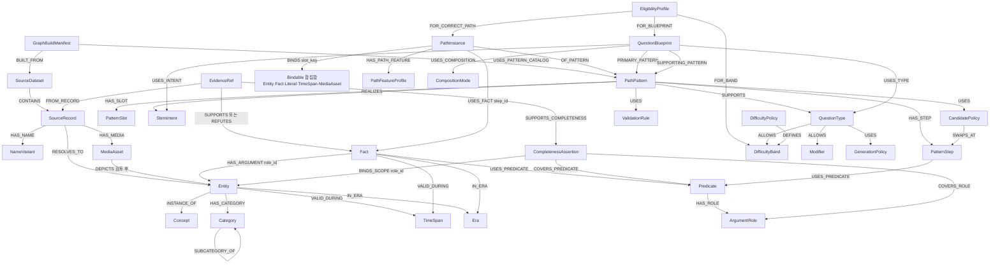

# 05. 문제 생성 중심 Neo4j 스키마

## 1. 설계 원칙

스키마는 다음 네 계층으로 나눈다.

```text
빌드·출처 계층 GraphBuildManifest / SourceDataset / SourceRecord / NameVariant / EvidenceRef / MediaAsset
역사 지식 계층 Entity / Concept / Category / Era / TimeSpan / Predicate / Fact / LiteralValue / CompletenessAssertion
생성 인덱스 계층 PathPattern / PatternSlot / PatternStep / PathInstance / PathFeatureProfile / EligibilityProfile
생성 정책 계층 QuestionBlueprint / QuestionType / CompositionMode / StemIntent / Modifier / CandidatePolicy / DifficultyPolicy / DifficultyBand / ValidationRule / GenerationPolicy
```

`SourceRecord`와 `Entity`, `Fact`와 `PathInstance`를 분리하는 것이 핵심이다.

- `SourceRecord`: 특정 원천에 존재하는 레코드
- `Entity`: 여러 원천이 가리키는 동일한 역사적 실체
- `Fact`: 근거가 있는 역사 명제
- `PathInstance`: Fact를 생성 패턴에 맞춰 미리 결합한 검색 인덱스

## 2. 전체 그래프



## 3. 출처 계층 노드

### 3.0 `GraphBuildManifest`

배포된 graph snapshot의 불변 빌드 계약이다. Neo4j에는 현재 snapshot을 식별하는 노드를 두고, 운영 배포 레지스트리에도 같은 manifest를 보존한다.

| 속성 | 의미 |
|---|---|
| `build_basis_id` | canonical 지식·정책을 먼저 고정한 1단계 빌드 ID |
| `snapshot_id` | build basis와 파생 산출물 해시로 만든 최종 snapshot ID |
| `database_or_namespace` | 실제 배포 위치 |
| `source_manifest_hash` | 입력 SourceDataset ID·SHA-256 목록 해시 |
| `graph_content_manifest_hash` | 정렬된 SourceRecord hash·승인 RESOLVES_TO·canonical 지식·모든 정책·Pattern·관계의 내용 해시 또는 Merkle root |
| `derived_artifact_hash` | PathInstance·PathFeatureProfile·EligibilityProfile 파생 산출물 해시 |
| `schema_version` | 그래프 스키마 버전 |
| `entity_resolution_policy_version` | Entity 해소 정책 |
| `fact_review_policy_version` | Fact 승인 정책 |
| `compiler_version` | PathInstance 컴파일러 버전 |
| `pattern_catalog_hash` | 활성 Pattern·Blueprint 정의 해시 |
| `built_at`, `status` | 빌드 시각과 BUILDING, VALIDATED, ACTIVE, RETIRED 상태 |

해시는 두 단계로 계산한다.

1. canonical payload에서 `snapshot_id`, `graph_snapshot_id`, `built_at`, 배포 `status` 같은 provenance를 제외하고, 승인 지식과 모든 정책·Pattern 노드·관계를 정렬해 `graph_content_manifest_hash`를 만든다. `build_basis_id`는 이 값과 source·schema·정책·compiler·pattern catalog 버전의 해시다.
2. `build_basis_id`로 PathInstance·PathFeatureProfile·EligibilityProfile을 컴파일하고, 동일한 provenance 필드를 제외해 `derived_artifact_hash`를 만든다. 최종 `snapshot_id = hash(build_basis_id + derived_artifact_hash)`를 계산한 뒤 각 파생 노드에 `graph_snapshot_id`를 stamp한다.

이 순서로 snapshot ID가 자기 자신을 포함하는 순환을 피한다. 수동 검수나 파생 산출물이 달라지면 다른 snapshot이 되며, 같은 ID가 다른 database 내용을 가리키지 못하게 배포 검증에서 manifest와 실제 count/hash를 대조한다.

### 3.1 `SourceDataset`

원천 파일 또는 논리 데이터셋의 버전을 나타낸다.

| 속성 | 의미 |
|---|---|
| `dataset_id` | 내부 고유 ID |
| `source_name` | 원천명 |
| `schema_version` | 원천 스키마 버전 |
| `sha256` | 입력 파일 fingerprint |
| `authority_grade` | 출처 신뢰 등급 |
| `collected_at` | 수집 시점 |
| `status` | ACTIVE, SUPERSEDED 등 |

### 3.2 `SourceRecord`

원천 내부의 한 레코드다. 필요하면 다음 보조 라벨을 붙인다.

```text
:SourceRecord:AKSArticle
:SourceRecord:ITKCPersonRecord
:SourceRecord:ITKCEventRecord
:SourceRecord:HistoryTermRecord
```

| 속성 | 의미 |
|---|---|
| `source_record_key` | `source_id:record_id` 합성 키 |
| `source_record_id` | `eid`, `person_id`, `event_id`, `term_id` |
| `record_type` | 원천 레코드 종류 |
| `display_name` | 원문 표기 |
| `record_hash` | 정규화 전 레코드 해시 |
| `source_url` | 상세 원문 URL |
| `resolution_status` | 해소 상태 |

SourceRecord의 모든 raw 컬럼을 Neo4j 속성으로 복사하지 않는다. 중첩 본문과 배열은 staging/RAG에 두고 탐색에 필요한 메타데이터만 둔다.

### 3.3 `NameVariant`

별칭과 동명이인을 안전하게 처리한다.

| 속성 | 의미 |
|---|---|
| `name_id` | 고유 ID |
| `text` | 원문 이름 |
| `normalized` | 검색 정규화 값 |
| `hanja` | 한자 표현 |
| `kind` | PRIMARY, ALIAS, JA, HO, POSTHUMOUS 등 |
| `language` | 언어 코드 |
| `valid_from`, `valid_to` | 이름 사용 시점이 있을 때 |

이름을 Entity ID로 사용하지 않는다. `태조`, `수`, `정조`처럼 서로 다른 실체가 같은 이름을 가질 수 있다.

### 3.4 `EvidenceRef`

RAG 저장소의 청크와 Fact를 연결한다.

| 속성 | 의미 |
|---|---|
| `evidence_id` | 고유 ID |
| `chunk_id` | RAG 청크 ID |
| `document_id` | RAG 문서 ID |
| `chunk_content_hash` | 승인 당시 청크 본문 해시 |
| `corpus_version` | 승인 당시 RAG corpus 버전 |
| `chunker_version` | 승인 당시 청킹 규칙 버전 |
| `rag_manifest_id` | 선택적 불변 RAG corpus manifest ID |
| `source_grade` | 출처 등급 |
| `review_status` | PENDING, ACCEPTED, REJECTED, STALE |
| `excerpt_hash` | 사용 근거 부분 해시 |
| `extractor_version` | 추출기 버전 |

본문 자체를 넣지 않으며, 운영 화면에 필요한 짧은 미리보기만 별도 정책에 따라 둘 수 있다. 현재 RAG 행의 hash·corpus·chunker 버전이 승인 당시 값과 다르면 EvidenceRef를 STALE로 처리한다. 근거 방향의 단일 권위는 속성이 아니라 `SUPPORTS`, `REFUTES`, `SUPPORTS_COMPLETENESS` 관계 타입이다.

### 3.5 `MediaAsset`

이미지·지도·유물 사진의 외부 저장소 참조다.

| 속성 | 의미 |
|---|---|
| `media_id` | 고유 ID 또는 원천 `mid` |
| `uri` | 원본 또는 객체 저장소 URI |
| `sha256` | 파일 동일성 확인 |
| `media_type` | 사진, 지도, 회화 등 |
| `rights_code` | KOGL 등 이용 조건 |
| `copyright_display` | 출처 표시 문구 |
| `caption`, `alt_text` | 표시·접근성 메타데이터 |
| `answer_leak_status` | 캡션·문자 영역의 답 노출 검토 상태 |

`DEPICTS`는 이미지가 역사 Entity를 실제로 묘사한다는 검토가 끝난 경우만 만든다. 단순히 같은 문서에 포함되었다는 이유로 생성하지 않는다. 이미지 바이너리는 Neo4j에 저장하지 않는다.

## 4. 역사 지식 계층 노드

### 4.1 `Entity`

고유한 역사 대상을 나타낸다. 공통 라벨 `Entity`와 제한된 보조 라벨을 함께 사용한다.

```text
Person
Event
Polity
Administration
Institution
Document
Work
CulturalAsset
Place
SocialGroup
Policy
```

| 속성 | 의미 |
|---|---|
| `entity_id` | 내부 고유 ID |
| `canonical_name` | 대표 표시명 |
| `normalized_name` | 검색 보조명 |
| `entity_status` | ACTIVE, MERGED, DISPUTED |
| `resolution_policy_version` | 엔터티 해소 정책 버전 |
| `source_count` | 연결된 승인 SourceRecord 수, 파생 캐시 |

`entity_id`는 원천 ID나 이름 문자열이 아닌 안정적인 내부 ID를 사용한다. 문서의 사람이 읽기 쉬운 예시 ID는 설명용이며, 실제 키는 UUID·ULID 등 이름 변경과 원천 병합에 영향받지 않는 형식이 적합하다.

왕, 대통령, 관직자와 같은 역할은 사람의 영구 라벨로만 표현하지 않는다. 재위·재임은 시간과 역할을 가진 Fact로 표현한다.

### 4.2 `Concept`와 `Category`

- `Concept`: Person, Battle, Treaty, Painting처럼 의미 타입 계층
- `Category`: 시소러스의 분류 경로처럼 검색·주제 분류 계층

같은 Entity가 여러 Category에 속할 수 있다. `term_lk`의 복수 경로도 각각 유지한다.

### 4.3 `Era`와 `TimeSpan`

`Era`는 조선 후기, 일제강점기와 같은 명명된 기간이다. `TimeSpan`은 특정 Fact 또는 Entity의 가능한 시간 범위다.

| TimeSpan 속성 | 의미 |
|---|---|
| `time_span_id` | 고유 ID |
| `earliest_start` | 가능한 가장 이른 시작 |
| `latest_start` | 가능한 가장 늦은 시작 |
| `earliest_end` | 가능한 가장 이른 종료 |
| `latest_end` | 가능한 가장 늦은 종료 |
| `precision` | DAY, MONTH, YEAR, REIGN, ERA, APPROXIMATE |
| `certainty` | EXACT, ESTIMATED, DISPUTED |
| `original_text` | 원문 시간 표현 |
| `parse_status` | PARSED 또는 UNKNOWN |
| `review_status` | ACCEPTED, REJECTED, PENDING |
| `parse_version` | 파서 버전 |

### 4.4 `Predicate`와 `ArgumentRole`

`Predicate`는 관계 의미를 사전으로 관리한다.

| 속성 | 의미 |
|---|---|
| `predicate_id` | `CREATED`, `PARTICIPATED_IN`, `RESULTED_IN` 등 |
| `predicate_family` | 활동, 인과, 시간, 공간 등 |
| `inverse_predicate_id` | 역관계 |
| `is_symmetric` | 대칭 여부 |
| `validation_mode` | 열린 세계·기능적 관계 등 검증 방식 |
| `distractor_safe` | 오답 교체에 사용할 수 있는지 |
| `status` | 승인 상태 |

`ArgumentRole`은 술어가 요구하는 역할과 타입을 선언한다.

```text
GRANTS_RIGHT
  basis       : Treaty
  grantor     : Polity
  beneficiary : Polity
  right       : Right
  scope       : Place|Territory
```

역할은 임의 문자열로 무제한 입력하지 않는다. Predicate별 최소·최대 개수와 허용 Concept를 검증한다.

### 4.5 `Fact`

근거와 시간·역할을 가진 역사 명제다.

| 속성 | 의미 |
|---|---|
| `fact_id` | 고유 ID |
| `canonical_hash` | 술어·역할·대상·시간 기반 중복 키 |
| `status` | ACCEPTED, DISPUTED, RETIRED |
| `polarity` | POSITIVE 또는 NEGATIVE |
| `confidence` | 승인 과정의 신뢰도 |
| `argument_completeness` | 이 Fact 한 건의 필수 역할이 모두 채워졌는지 |
| `review_policy_version` | 승인 정책 버전 |
| `valid_from`, `valid_to` | Fact 버전 유효 시점 |

예를 들어 강화도 조약의 해안 측량권은 단순 이진 관계가 아니다.

```text
Fact: GRANTS_RIGHT
  basis        = 강화도 조약
  grantor      = 조선
  beneficiary  = 일본
  right        = 해안 측량권
  scope        = 조선 해안
  time         = 1876년
```

이를 `(강화도조약)-[:GRANTED]->(해안측량권)`으로 축소하면 수혜자와 범위가 사라져 조항형 오답을 검증할 수 없다.

`argument_completeness`는 해당 subject·predicate에 가능한 모든 값을 알고 있다는 뜻이 아니다. 현재 문맥에서 관계 부재를 FALSE로 판정할 수 있는 폐쇄성은 별도 `CompletenessAssertion`으로만 표현한다.

직접 반박 근거는 오답을 위해 만든 임시 거짓 노드가 아니다. exact Predicate·역할·시간·장소 binding에 대해 `polarity=NEGATIVE`, `status=ACCEPTED`인 Fact를 만들고 승인 EvidenceRef가 `SUPPORTS`로 연결된 경우만 `EXPLICIT_REFUTATION` proof로 사용한다. `EvidenceRef-[:REFUTES]->(positive Fact)`는 검토·충돌 감사 신호이며, 대응하는 ACCEPTED NEGATIVE Fact 없이는 런타임 FALSE proof가 아니다.

### 4.6 `CompletenessAssertion`

특정 Predicate의 특정 역할이 정해진 문맥에서 단일 값이거나 완전 목록임을 근거와 함께 선언한다.

| 속성 | 의미 |
|---|---|
| `assertion_id` | 고유 ID |
| `mode` | `FUNCTIONAL` 또는 `CLOSED_SET` |
| `scope_hash` | Predicate ID·COVERS_ROLE ID·정렬된 고정 역할 binding·TimeSpan·Place 범위의 정규화 해시 |
| `status` | ACCEPTED, DISPUTED, RETIRED |
| `review_policy_version` | 폐쇄성 검토 정책 버전 |
| `valid_from`, `valid_to` | assertion 버전 유효 시점 |

관계는 다음처럼 역할 범위를 명시한다.

```text
(closure:CompletenessAssertion)-[:COVERS_PREDICATE]->(CREATED)
(closure)-[:COVERS_ROLE]->(creatorRole)
(closure)-[:BINDS_SCOPE {role_id:"work"}]->(인왕제색도)
(evidence:EvidenceRef)-[:SUPPORTS_COMPLETENESS]->(closure)
```

이 예시는 `work=인왕제색도`라는 범위에서 creator 역할이 완전함을 뜻한다. `정선 CREATED 인왕제색도`라는 다른 문맥의 참인 Fact만으로 closure를 만들 수는 없다. 시간·장소가 범위에 포함되면 `VALID_DURING`, `IN_PLACE`도 함께 연결한다.

### 4.7 `LiteralValue`

Entity로 만들 필요가 없는 수치·문자 값을 Fact 역할에 연결할 때 사용한다. `value_id`, `value_type`, 정규화 값, 단위를 갖는다. 인물·사건·기관·권리처럼 재사용·관계 탐색이 필요한 대상은 LiteralValue로 축소하지 않는다.

PatternSlot에 결합할 수 있는 논리적 `Bindable`은 `Entity | Fact | LiteralValue | TimeSpan | MediaAsset`의 합집합이다. Neo4j에서 별도 상속 노드를 만드는 대신 각 노드의 고유 ID와 `binding_kind`를 사용한다. Entity형 후보 쿼리는 Entity만 허용하고, 주장·시간·이미지형 패턴은 해당 binding kind를 명시한다.

## 5. 생성 인덱스 계층

### 5.1 `PathPattern`

문제 생성 시 유지할 추상 의미 경로다.

| 속성 | 의미 |
|---|---|
| `pattern_id` | 버전 포함 고유 ID |
| `name` | 사람이 읽는 패턴명 |
| `answer_slot_key` | 정답이 결합되는 슬롯 |
| `version` | 패턴 버전 |
| `status` | DRAFT, ACTIVE, RETIRED |
| `validation_rule_id` | 검증 규칙 참조 |

### 5.2 `PatternSlot`

| 속성 | 의미 |
|---|---|
| `slot_id` | `pattern_id:slot_key` 형식의 전역 고유 ID |
| `slot_key` | 패턴 안에서만 고유한 anchor_person, answer_work 등 |
| `slot_role` | ANCHOR, ANSWER, CLUE, CONTEXT |
| `required` | 필수 여부 |
| `allowed_binding_kind` | ENTITY, FACT, LITERAL, TIME_SPAN, MEDIA_ASSET |
| `allowed_concept_id` | ENTITY일 때 허용 Concept |
| `swap_allowed` | 오답 생성 시 교체 가능한지 |

`ANSWER`는 Entity 타입이 아니다. 같은 Entity가 한 문제에서는 정답이고 다른 문제에서는 단서가 될 수 있다.

### 5.3 `PatternStep`

PathPattern의 각 Fact 조건을 표현한다.

```text
PERSON_CREATED_WORK_V1
  slot anchor_person : Person
  slot answer_work   : Work
  step 1:
    predicate = CREATED
    expected_polarity = POSITIVE
    role creator -> anchor_person
    role work    -> answer_work
```

각 PatternStep은 전역 고유 `step_id`, 패턴 로컬 `step_key`, `expected_polarity`, Predicate와 role-slot 대응을 가진다. `step_id`는 `pattern_id:step_key`로 namespacing한다. `expected_polarity`는 생략하지 않고 보통 `POSITIVE`로 선언하며, `NEGATIVE` Fact를 참 후보로 잘못 사용하는 일을 컴파일 단계에서 차단한다.

그래프에서는 역할과 슬롯의 대응을 생략하지 않는다.

```text
(PathPattern)-[:HAS_STEP]->(PatternStep {step_id:"PERSON_CREATED_WORK_V1:step-1", step_key:"step-1"})
(PatternStep)-[:BINDS_ROLE {role_id:"creator"}]->(PatternSlot {slot_key:"anchor_person"})
(PatternStep)-[:BINDS_ROLE {role_id:"work"}]->(PatternSlot {slot_key:"answer_work"})
```

### 5.4 `PathInstance`

승인 Fact가 PathPattern을 만족하는 실제 바인딩이다.

| 속성 | 의미 |
|---|---|
| `path_instance_id` | 고유 ID |
| `pattern_id` | 조회 보조용 파생 키 |
| `compiler_version` | 생성기 버전 |
| `review_status` | 승인 상태 |
| `structural_status` | COMPILED, INVALID, STALE |
| `graph_snapshot_id` | 생성된 snapshot |

관계는 다음 형태다.

```text
(PathInstance)-[:OF_PATTERN]->(PathPattern)
(PathInstance)-[:BINDS {slot_key:"anchor_person", binding_kind:"ENTITY"}]->(김정희)
(PathInstance)-[:BINDS {slot_key:"answer_work", binding_kind:"ENTITY"}]->(세한도)
(PathInstance)-[:USES_FACT {step_id:"PERSON_CREATED_WORK_V1:step-1"}]->(김정희_CREATED_세한도_Fact)
```

`USES_FACT.step_id`가 없으면 다단계 경로에서 어떤 Fact가 어느 PatternStep을 충족했는지 알 수 없어 오답의 교체 역할을 검증할 수 없다. PathInstance는 삭제 후 다시 만들 수 있는 파생 캐시이며 수정은 원본 Fact에서 시작한다.

`path_instance_id`는 임의 실행 순서가 아니라 `pattern_id + 정렬된 (slot_key, binding_kind, binding_id) + 정렬된 (step_id, fact_id) + compiler_version`의 정규화 해시로 만든다. 같은 snapshot에서 삭제·재컴파일해도 동일 ID가 나와야 한다.

### 5.5 `PathFeatureProfile`

PathInstance만으로 결정되는 정적 특징의 버전 스냅샷이다. `path_length`, Fact 수, 시간 정밀도, source grade, answer obscurity처럼 지문이나 후보 조합과 무관한 값만 저장한다. `anchor_visibility`, `clue_indirectness`, 후보 간 유사도, 시각 복잡도, 부정형 비용은 여기에 넣지 않는다.

필수 속성은 `profile_id`, `graph_snapshot_id`, `feature_policy_version`, `compiler_version`, `status`다. 같은 PathInstance와 이 버전 튜플에는 `ACTIVE` profile이 정확히 하나여야 한다.

### 5.6 `EligibilityProfile`

무작위 추첨 전에 특정 조합이 실제 선지 수를 채울 수 있는지 나타내는 재생성 가능한 파생 인덱스다.

| 속성 | 의미 |
|---|---|
| `eligibility_profile_id` | 고유 ID |
| `combination_hash` | correct path·Blueprint·type·band·choice count·selection rule·polarity·answer mode·modifier·모든 정책·validator·build basis 조합 해시 |
| `question_type_id`, `difficulty_band_id` | 평가한 유형·band |
| `choice_count` | 요구 선지 수 |
| `selection_rule`, `polarity`, `answer_mode` | 선택 truth와 option 구조 |
| `modifier_fingerprint` | 후보 구성에 영향을 주는 축별 modifier 해시 |
| `target_true_count`, `target_false_count` | 요구 TRUE/FALSE 개수 |
| `validated_candidate_count` | 구조·폐쇄성 mismatch 검증을 통과한 후보 수 |
| `candidate_set_hash` | 검증 후보 ID와 proof 버전의 해시 |
| `candidate_policy_version` | 후보 정책 버전 |
| `difficulty_policy_version` | 난이도 정책 버전 |
| `feature_policy_version` | PathFeature·CandidateFit 특징 정책 버전 |
| `validation_rule_version`, `validator_version` | mismatch 규칙·실행기 버전 |
| `build_basis_id`, `graph_snapshot_id`, `compiler_version` | 재생성·무효화와 배포 provenance |
| `status` | ELIGIBLE, INELIGIBLE, STALE |

`combination_hash`에는 위 정책·validator 버전을 모두 포함한다. 어느 하나라도 바뀌면 기존 profile은 STALE이다. `FOR_CORRECT_PATH`, `FOR_BLUEPRINT`, `FOR_BAND`로 평가 범위를 연결한다. 모든 후보 RAG 검색 성공까지 미리 보장하는 값은 아니며, 승인 Fact와 CompletenessAssertion으로 결정 가능한 mismatch와 후보 세트 난이도만 preflight한다. profile이 없거나 STALE이면 해당 조합을 런타임 후보에서 제외하고 오프라인 컴파일 큐로 보낸다. 읽기 전용 런타임이 임시 profile을 Neo4j에 쓰지 않는다.

통과한 후보는 `(EligibilityProfile)-[:HAS_VALIDATED_CANDIDATE {truth_in_correct_context, option_role, validation_result_id, candidate_fit_score, proof_version}]->(PathInstance)`로 연결한다. `option_role`은 `SELECTED_TARGET`, `TRUE_COMPANION`, `FALSE_ALTERNATIVE` 중 하나다. 후보 검색은 donor PathInstance의 전역 boolean이 아니라 선택된 profile의 이 관계만 사용한다.

## 6. 생성 정책 계층

### 6.1 `QuestionBlueprint`, `QuestionType`, `CompositionMode`, `StemIntent`, `Modifier`

이 노드는 실제 시험 문항을 저장하지 않는다. 생성 가능한 조합과 제약을 나타낸다.

```text
(QuestionBlueprint)-[:PRIMARY_PATTERN]->(PathPattern)
(QuestionBlueprint)-[:SUPPORTING_PATTERN {purpose, order}]->(PathPattern)
(QuestionBlueprint)-[:USES_TYPE]->(QuestionType)
(QuestionBlueprint)-[:USES_INTENT]->(StemIntent)
(QuestionBlueprint)-[:USES_COMPOSITION]->(CompositionMode)
(PathPattern)-[:REALIZES]->(StemIntent)
(PathPattern)-[:SUPPORTS]->(QuestionType)
(QuestionType)-[:ALLOWS {weight, min_candidate_count}]->(Modifier)
```

`QuestionBlueprint`는 주 답 경로 하나와 보조 단서 경로 0개 이상을 조립하는 재사용 정책이다. 실제 문제, 지문, 정답 위치는 저장하지 않는다. `QuestionType`은 주 답 구조, `CompositionMode`는 `SINGLE_PATH`, `MULTI_ANCHOR_COMPARE`, `MAPPING_MATCH` 같은 경로 조립 방식이다. 이 분리로 하나의 문항이 여러 분석 경로를 사용해도 런타임의 primary type은 하나로 유지된다.

### 6.2 `DifficultyPolicy`, `DifficultyBand`와 런타임 난이도 객체

- `DifficultyPolicy`: 특징 가중치와 band 경계의 버전
- `DifficultyBand`: EASY, MEDIUM, HARD의 정책상 범위
- `PathFeatureProfile`: Neo4j에 저장하는 경로 자체의 정적 특징
- `CandidateFit`: 정답 경로와 한 후보 경로 사이의 taxonomy·시대·역할·이름 유사도를 계산한 런타임 값
- `QuestionDifficultySnapshot`: 지문·발문·전체 후보 세트가 확정된 뒤의 단서 수, 노출도, 시각·시간·부정 비용과 최종 예측 점수

`CandidateFit`과 `QuestionDifficultySnapshot`은 운영·생성 저장소에 기록하며 그래프에 모든 후보 쌍을 영구 노드로 만들지 않는다. 가중치와 경계를 애플리케이션 상수로 두지 않는다.

### 6.3 `CandidatePolicy`, `ValidationRule`, `GenerationPolicy`

| 노드 | 의미 |
|---|---|
| `CandidatePolicy` | selection rule별 target truth 분포, TRUE companion/FALSE alternative 수집 전략, 후보 풀 크기, 허용 출처, ranking 특징, fallback 순서 |
| `ValidationRule` | Predicate·PathPattern별 mismatch 및 정답 유일성 validator 선언 |
| `GenerationPolicy` | 유형 추첨 weight, 세트 중복 제한, 재시도·실패 전환 정책 |

정책 노드에는 버전과 상태를 두고 PathPattern·QuestionType과 연결한다.

```text
(PathPattern)-[:USES_CANDIDATE_POLICY]->(CandidatePolicy)
(CandidatePolicy)-[:SWAPS_AT {swap_slot_key, fixed_slot_keys, allowed_proof_directions}]->(PatternStep)
(PathPattern)-[:USES_VALIDATION_RULE]->(ValidationRule)
(QuestionType)-[:USES_GENERATION_POLICY]->(GenerationPolicy)
```

정책에 임의 Cypher나 실행 코드를 저장하지 않는다. 서비스가 지원하는 validator key와 특징 ID만 저장하고, weight는 `HAS_FEATURE_WEIGHT` 관계 속성 또는 검토 가능한 정책 테이블로 관리한다.

`SWAPS_AT`은 다단계 패턴에서 어느 step과 answer slot을 교체하고 어떤 고정 슬롯들을 correct context로 비교할지 명시한다. `allowed_proof_directions`는 assertion이 answer 역할을 덮는 경우와 fixed 역할을 덮는 경우 중 허용 방향을 제한한다. 런타임이 answer slot이 등장하는 여러 step 중 하나를 임의 선택하지 않는다.

## 7. 핵심 관계 목록

| 관계 | 시작 → 끝 | 의미 |
|---|---|---|
| `CONTAINS` | SourceDataset → SourceRecord | 원천에 레코드 포함 |
| `BUILT_FROM`, `USES_PATTERN_CATALOG` | GraphBuildManifest → SourceDataset/PathPattern | snapshot 불변 입력 |
| `HAS_NAME` | SourceRecord/Entity → NameVariant | 이름·별칭 |
| `RESOLVES_TO` | SourceRecord → Entity | 출처 레코드의 canonical 해소 |
| `INSTANCE_OF` | Entity → Concept | 의미 타입 |
| `HAS_CATEGORY` | Entity/SourceRecord → Category | 분류 경로 |
| `SUBCATEGORY_OF` | Category → Category | 분류 계층 |
| `USES_PREDICATE` | Fact/PatternStep → Predicate | 술어 사용 |
| `HAS_ARGUMENT` | Fact → Entity/LiteralValue | 역할별 Fact 인자 |
| `VALID_DURING` | Entity/Fact → TimeSpan | 시간 범위 |
| `IN_ERA` | Entity/Fact → Era | 정규화된 명명 시대 |
| `VALID_DURING`, `IN_PLACE` | CompletenessAssertion → TimeSpan/Place | 폐쇄성 assertion의 시간·장소 범위 |
| `SUPPORTS`, `REFUTES` | EvidenceRef → Fact | 근거 방향 |
| `SUPPORTS_COMPLETENESS` | EvidenceRef → CompletenessAssertion | 폐쇄성 근거 |
| `FROM_RECORD` | EvidenceRef → SourceRecord | 근거 출처 |
| `HAS_MEDIA` | SourceRecord → MediaAsset | 원천 레코드의 미디어 |
| `DEPICTS` | MediaAsset → Entity | 검토된 묘사 대상 |
| `HAS_SLOT`, `HAS_STEP` | PathPattern → Slot/Step | 패턴 구성 |
| `BINDS_ROLE` | PatternStep → PatternSlot | Predicate 역할과 슬롯 대응 |
| `OF_PATTERN` | PathInstance → PathPattern | 패턴 인스턴스 |
| `BINDS` | PathInstance → Bindable 합집합 | 슬롯별 바인딩 |
| `USES_FACT` | PathInstance → Fact | `step_id`별 인스턴스 근거 Fact |
| `COVERS_PREDICATE`, `COVERS_ROLE`, `BINDS_SCOPE` | CompletenessAssertion → Predicate/Role/Bindable | 폐쇄성의 의미 범위 |
| `PRIMARY_PATTERN`, `SUPPORTING_PATTERN` | QuestionBlueprint → PathPattern | 주 답·보조 단서 경로 |
| `SWAPS_AT` | CandidatePolicy → PatternStep | 교체 step·slot·고정 문맥 계약 |
| `USES_TYPE`, `USES_INTENT`, `USES_COMPOSITION` | QuestionBlueprint → 정책 노드 | 문항 조립 계약 |
| `HAS_PATH_FEATURE` | PathInstance → PathFeatureProfile | 정적 경로 특징 |
| `FOR_CORRECT_PATH`, `FOR_BLUEPRINT`, `FOR_BAND` | EligibilityProfile → 경로·Blueprint·band | 추첨 전 생성 가능성 범위 |
| `HAS_VALIDATED_CANDIDATE` | EligibilityProfile → PathInstance | 해당 조합에서 mismatch·난이도 preflight를 통과한 후보 |

## 8. Neo4j 제약과 인덱스 초안

실제 적용 전 Neo4j 버전과 라이선스에서 지원하는 제약을 확인한다.

```cypher
CREATE CONSTRAINT source_dataset_id IF NOT EXISTS
FOR (n:SourceDataset) REQUIRE n.dataset_id IS UNIQUE;

CREATE CONSTRAINT graph_snapshot_id IF NOT EXISTS
FOR (n:GraphBuildManifest) REQUIRE n.snapshot_id IS UNIQUE;

CREATE CONSTRAINT source_record_key IF NOT EXISTS
FOR (n:SourceRecord) REQUIRE n.source_record_key IS UNIQUE;

CREATE CONSTRAINT entity_id IF NOT EXISTS
FOR (n:Entity) REQUIRE n.entity_id IS UNIQUE;

CREATE CONSTRAINT name_variant_id IF NOT EXISTS
FOR (n:NameVariant) REQUIRE n.name_id IS UNIQUE;

CREATE CONSTRAINT concept_id IF NOT EXISTS
FOR (n:Concept) REQUIRE n.concept_id IS UNIQUE;

CREATE CONSTRAINT category_id IF NOT EXISTS
FOR (n:Category) REQUIRE n.category_id IS UNIQUE;

CREATE CONSTRAINT time_span_id IF NOT EXISTS
FOR (n:TimeSpan) REQUIRE n.time_span_id IS UNIQUE;

CREATE CONSTRAINT predicate_id IF NOT EXISTS
FOR (n:Predicate) REQUIRE n.predicate_id IS UNIQUE;

CREATE CONSTRAINT argument_role_id IF NOT EXISTS
FOR (n:ArgumentRole) REQUIRE n.role_id IS UNIQUE;

CREATE CONSTRAINT fact_id IF NOT EXISTS
FOR (n:Fact) REQUIRE n.fact_id IS UNIQUE;

CREATE CONSTRAINT fact_hash IF NOT EXISTS
FOR (n:Fact) REQUIRE n.canonical_hash IS UNIQUE;

CREATE CONSTRAINT evidence_id IF NOT EXISTS
FOR (n:EvidenceRef) REQUIRE n.evidence_id IS UNIQUE;

CREATE CONSTRAINT completeness_assertion_id IF NOT EXISTS
FOR (n:CompletenessAssertion) REQUIRE n.assertion_id IS UNIQUE;

CREATE CONSTRAINT media_id IF NOT EXISTS
FOR (n:MediaAsset) REQUIRE n.media_id IS UNIQUE;

CREATE CONSTRAINT path_pattern_id IF NOT EXISTS
FOR (n:PathPattern) REQUIRE n.pattern_id IS UNIQUE;

CREATE CONSTRAINT pattern_slot_id IF NOT EXISTS
FOR (n:PatternSlot) REQUIRE n.slot_id IS UNIQUE;

CREATE CONSTRAINT pattern_step_id IF NOT EXISTS
FOR (n:PatternStep) REQUIRE n.step_id IS UNIQUE;

CREATE CONSTRAINT path_instance_id IF NOT EXISTS
FOR (n:PathInstance) REQUIRE n.path_instance_id IS UNIQUE;

CREATE CONSTRAINT path_feature_profile_id IF NOT EXISTS
FOR (n:PathFeatureProfile) REQUIRE n.profile_id IS UNIQUE;

CREATE CONSTRAINT eligibility_profile_id IF NOT EXISTS
FOR (n:EligibilityProfile) REQUIRE n.eligibility_profile_id IS UNIQUE;

CREATE CONSTRAINT question_blueprint_id IF NOT EXISTS
FOR (n:QuestionBlueprint) REQUIRE n.blueprint_id IS UNIQUE;

CREATE CONSTRAINT composition_mode_id IF NOT EXISTS
FOR (n:CompositionMode) REQUIRE n.composition_mode_id IS UNIQUE;

CREATE CONSTRAINT question_type_id IF NOT EXISTS
FOR (n:QuestionType) REQUIRE n.question_type_id IS UNIQUE;

CREATE CONSTRAINT stem_intent_id IF NOT EXISTS
FOR (n:StemIntent) REQUIRE n.stem_intent_id IS UNIQUE;

CREATE CONSTRAINT modifier_id IF NOT EXISTS
FOR (n:Modifier) REQUIRE n.modifier_id IS UNIQUE;

CREATE CONSTRAINT difficulty_band_id IF NOT EXISTS
FOR (n:DifficultyBand) REQUIRE n.band_id IS UNIQUE;

CREATE CONSTRAINT candidate_policy_id IF NOT EXISTS
FOR (n:CandidatePolicy) REQUIRE n.policy_id IS UNIQUE;

CREATE CONSTRAINT difficulty_policy_id IF NOT EXISTS
FOR (n:DifficultyPolicy) REQUIRE n.policy_id IS UNIQUE;

CREATE CONSTRAINT validation_rule_id IF NOT EXISTS
FOR (n:ValidationRule) REQUIRE n.rule_id IS UNIQUE;

CREATE CONSTRAINT generation_policy_id IF NOT EXISTS
FOR (n:GenerationPolicy) REQUIRE n.policy_id IS UNIQUE;

CREATE INDEX entity_normalized_name IF NOT EXISTS
FOR (n:Entity) ON (n.normalized_name);

CREATE INDEX fact_status IF NOT EXISTS
FOR (n:Fact) ON (n.status);

CREATE INDEX path_instance_lookup IF NOT EXISTS
FOR (n:PathInstance) ON (n.pattern_id, n.structural_status);

CREATE INDEX timespan_bounds IF NOT EXISTS
FOR (n:TimeSpan)
ON (n.earliest_start, n.latest_end);
```

이름 검색은 Entity의 대표명만 검색하지 않고 NameVariant까지 포함하는 full-text index를 별도 구성한다.

## 9. 적재 금지 항목

- 대백과사전 전체 `body`와 임베딩
- API가 생성한 지문 전문
- sLLM 최종 문항과 선택지 전문
- 이미지 바이너리 또는 base64
- 원문 `relatedArticles`를 의미가 확정된 역사 Fact로 승격한 관계
- 이름 문자열만으로 병합된 `SAME_AS`
- 검증되지 않은 LLM 추출 관계
- 근거 없이 오답용으로 만든 거짓 Fact. 권위 근거가 지지하는 `ACCEPTED NEGATIVE Fact`는 예외
- 그래프에 없다는 이유만으로 만든 부정 관계
- `Question.is_correct`처럼 역사적 참과 시험 정답을 혼합한 값

## 10. 선택적 projection

성능 측정 후 필요하면 승인 Fact에서 직접 typed edge를 재생성할 수 있다.

```text
(김정희)-[:CREATED {fact_id, projection_version}]->(세한도)
```

이 edge는 조회 가속용 projection일 뿐이며 근거와 시간의 원본은 Fact다. PathInstance 조회가 충분히 빠르면 projection을 추가하지 않는다.
