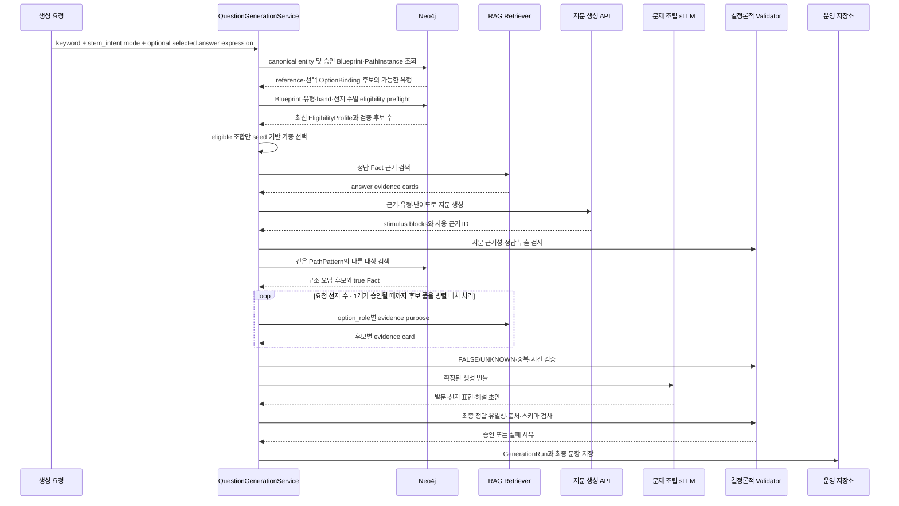

# 07. RAG·외부 API·sLLM 런타임 생성 파이프라인

## 1. 전체 흐름



## 2. 1단계: 생성 요청과 MaterialSeed

최소 입력은 다음과 같다.

```json
{
  "keyword": "김정희",
  "stem_intent_mode": "EXPLICIT",
  "stem_intent_id": "SELECT_ASSOCIATED",
  "scope_filters": {
    "era_ids": ["era:late-joseon"],
    "category_ids": ["category:culture"],
    "concept_ids": [],
    "display_labels": ["조선 후기", "문화"]
  },
  "optional_selected_answer_expression": null,
  "requested_choice_count": 5,
  "set_context": {
    "set_id": "set-uuid",
    "used_anchor_ids": [],
    "used_question_type_ids": [],
    "used_modifier_values": {},
    "answer_position_counts": {},
    "set_policy_version": "set-policy-v1"
  },
  "random_seed": 184027
}
```

`stem_intent_mode=EXPLICIT`이면 입력 intent를 필수 조건으로 사용한다. `AUTO`이면 `stem_intent_id`를 비우고 Blueprint와 호환되는 intent만 정책 추첨한다. `requested_choice_count`의 유형별 최소·최대값과 세트 중복·분포 제한도 정책에서 검증한다.

선택 답 표현이 입력되면 그래프의 승인 Blueprint·PathInstance, selection rule의 truth와 모든 하위 binding이 일치하는지 검증한다. 입력되지 않으면 keyword와 StemIntent 조건을 만족하는 승인 binding 또는 mismatch-proven binding 중 하나를 정책에 따라 선택한다. 어느 경우에도 LLM이 정답을 작성하지 않는다.

## 3. 2단계: keyword 해소와 정답 경로 확정

1. keyword를 Entity와 NameVariant full-text index에서 검색한다.
2. 타입과 `era_ids`·`category_ids`·`concept_ids`로 후보를 좁힌다. 표시명은 검색 조건으로 사용하지 않는다.
3. 하나의 canonical Entity로 확정되지 않으면 중단한다.
4. 해당 Entity가 anchor 또는 answer 슬롯으로 결합된 PathInstance와 QuestionBlueprint를 찾는다.
5. StemIntent 입력 모드와 호환되는 Blueprint만 남긴다.
6. 승인 Fact와 EvidenceRef가 있는 인스턴스만 남긴다.

이 단계의 결과는 단순 정답 문자열이 아니라 다음 묶음이다.

```text
anchor binding
reference OptionBinding과 selected binding 후보
accepted Fact IDs
QuestionBlueprint ID
primary/supporting PathPattern IDs
primary/supporting PathInstance IDs
time context
source provenance
```

## 4. 3단계: 유형·난이도·modifier의 제약된 랜덤 선택

완전 랜덤보다 eligibility-first가 먼저다.

```text
QuestionBlueprint + primary PathInstance
  -> 호환 QuestionType
  -> 호환 CompositionMode
  -> 호환 StemIntent
  -> 필수 후보 수 충족
  -> 필요한 시간·이미지·근거 존재
  -> 가능한 DifficultyBand
  -> 가능한 Modifier
  -> 가중 난수 선택
```

지문 API가 표현 형식과 난이도를 알아야 하므로 이 선택은 지문 생성 전에 완료한다. 선택 가능한 조합이 없으면 정답 경로를 바꾸거나 생성 실패로 종료한다.

이 단계의 `필수 후보 수 충족`은 단순 PathInstance 수가 아니다. `correct_path_instance + QuestionBlueprint + QuestionType + DifficultyBand + choice_count + CandidatePolicy 버전`별 `EligibilityProfile`에서 승인 Fact, 폐쇄성 mismatch proof, 후보 세트 난이도까지 preflight한 수치다. profile이 없거나 graph snapshot·정책이 달라 STALE이면 조합에서 제외하고 오프라인 재컴파일 큐에 기록한다. 후보별 RAG가 런타임에 실패하면 같은 profile의 다음 후보를 쓰고, 그래도 부족하면 eligible 조합을 다시 선택한다.

### 지문 API를 먼저 호출하는 구성

API 호출을 유형·난이도 선택보다 먼저 유지할 수도 있다. 이 경우 API 결과를 최종 지문으로 취급하면 안 되고, `유형·난이도 중립적인 근거 요약`으로 정의해야 한다. 이후 sLLM이 선택된 유형과 난이도에 맞춰 최종 지문으로 변환한다.

```text
권장 모드
  유형·난이도 선택 -> API가 최종 지문 생성 -> sLLM은 문항 조립

중립 재료 모드
  API가 근거 요약 생성 -> 유형·난이도 선택 -> sLLM이 지문과 문항 조립
```

부정형·연표형·비교형은 지문 구조 자체가 달라지므로, API 산출물을 최종 지문으로 사용할 계획이라면 권장 모드를 사용한다.

## 5. 4단계: 정답 근거 RAG

RAG 쿼리는 answer Fact의 역할을 명시한다.

```text
purpose=REFERENCE_EVIDENCE
Fact ID와 Predicate ID
모든 role별 Entity/Literal binding
TimeSpan ID와 명시적 경계
required source grades
```

먼저 Fact에 연결된 승인 `EvidenceRef.chunk_id`를 정확 조회한다. 청크가 유효하지 않거나 유형에 맞는 근거 span이 부족할 때만 같은 문서 검색과 구조화된 하이브리드 검색으로 확장한다.

검색 결과는 다음 gate를 통과해야 한다.

- 지정 Fact의 모든 필수 role binding이 근거에 존재
- Predicate 의미와 역할 방향이 근거 문장에서 확인됨
- 시간·장소 조건이 충돌하지 않음
- 허용 출처 등급 이상
- 서로 다른 청크가 상충하지 않음
- chunk ID와 document ID가 유효함
- 청크 hash·corpus·chunker 버전이 승인 당시 EvidenceRef와 일치

RAG가 근거를 찾지 못하면 외부 API가 상식으로 채우게 하지 않는다. 해당 PathInstance의 생성을 중단한다.

## 6. 5단계: 외부 API의 지문 생성

### 입력

```json
{
  "task": "GENERATE_STIMULUS_ONLY",
  "question_blueprint_id": "blueprint:actor-created-work:v1",
  "question_type": "ACTOR_ACTIVITY",
  "composition_mode": "SINGLE_PATH",
  "stem_intent": "SELECT_ASSOCIATED",
  "difficulty_band": "MEDIUM",
  "modifiers": {
    "source_mode": "PRIMARY_TEXT",
    "anchor_visibility": "IMPLICIT",
    "temporal_mode": "NONE",
    "answer_mode": "ENTITY",
    "polarity": "POSITIVE",
    "anchor_count": 1
  },
  "anchor_card": {},
  "answer_fact_card": {},
  "evidence_cards": [],
  "forbidden_outputs": ["ANSWER", "CHOICES", "RATIONALE", "NEW_FACT"]
}
```

### 출력

```json
{
  "stimulus_blocks": [
    {
      "block_id": "stimulus-block:1",
      "block_type": "TEXT",
      "text": "...",
      "clue_spans": []
    }
  ],
  "used_chunk_ids": [],
  "generation_model": "model-id",
  "prompt_version": "stimulus-v1"
}
```

후속 확장에서는 `block_type`에 `MEDIA_REF`, `TABLE`, `MAP`, `TIMELINE`을 허용한다. `MEDIA_REF`는 media ID, 권리 코드, 캡션·OCR, `answer_leak_status`를 포함하고, 모델이 URI나 묘사 대상을 새로 만들 수 없다. MVP는 `TEXT`만 eligibility를 통과시킨다.

### 지문 검증

- 정답 표준명·고유 별칭·정답 번호가 노출되지 않음
- 모든 역사 명제가 입력 EvidenceRef로 추적됨
- 선택된 난이도에 맞는 단서 수와 직접성
- QuestionType에 맞는 자료 형식
- 발문이나 선택지를 미리 포함하지 않음
- 입력 근거의 의미를 바꾸지 않음

실패 시 재시도 가능 횟수와 대체 모델은 `GenerationPolicy`에 둔다. 코드에 재시도 횟수를 직접 넣지 않는다.

## 7. 6단계: Neo4j 오답 구조 후보 검색

후보 생성기는 `answer_mode`와 selection rule로 분기한다.

| answer mode | 후보 조립 방식 | 결정론적 검증 |
|---|---|---|
| `ENTITY` | reference와 같은 PathPattern의 다른 binding 또는 correct anchor의 TRUE companion | canonical 중복, Fact, mismatch proof |
| `STATEMENT` | CandidatePolicy가 허용한 claim slot 하나를 승인 Fact binding으로 교체 | 모든 하위 claim Verdict |
| `IMAGE` | `DEPICTS`와 권리 검토가 끝난 MediaAsset binding 교체 | media ID·묘사 Entity·OCR/캡션 누출 |
| `SEQUENCE` | 승인 TimeSpan을 가진 동일 operand 집합의 순열 | 필요한 모든 사건 쌍의 확정 선후와 유일 순서 |
| `MATCH_SET` | 승인 pair 집합에서 허용 slot 하나 교체 | 모든 pair Verdict와 유일 selection |

아래 결과 계약은 `ENTITY`의 FALSE alternative 경로다. reference PathInstance와 동일한 PathPattern을 사용하는 다른 PathInstance를 조회한다.

결과에는 반드시 다음이 포함된다.

```text
candidate answer Entity
candidate true anchor Entity
candidate true Fact
swap step ID
swap slot
answer role ID와 fixed role ID
PathFeatureProfile과 CandidateFit 입력 특징
EvidenceRef 또는 evidence query
```

필수 오답 수보다 넉넉한 구조 후보를 가져온 뒤 근거 검증 실패 후보를 제거한다. 후보 풀 크기는 `CandidatePolicy`에서 받는다.

`SELECT_TRUE`는 TRUE reference 1개와 FALSE alternatives를, `SELECT_FALSE`는 FALSE selected target 1개와 correct anchor의 TRUE companions를 조립한다. EligibilityProfile의 `target_truth_distribution`을 만족하지 못하면 해당 조합을 선택하지 않는다.

## 8. 7단계: 후보별 오답 근거 RAG

각 Entity·claim·media·sequence operand·pair 후보는 독립된 구조화 쿼리로 병렬 검색할 수 있다.

```text
purpose=FALSE_OPTION_TRUE_CONTEXT
option_role=FALSE_ALTERNATIVE 또는 SELECTED_TARGET
candidate true anchor
candidate answer
candidate predicate and roles
candidate true Fact ID
```

TRUE companion은 `purpose=TRUE_COMPANION_EVIDENCE`, `option_role=TRUE_COMPANION`으로 correct anchor 문맥의 Fact를 검증한다. FALSE option의 현재 문맥 부정은 `purpose=MISMATCH_PROOF_EVIDENCE`로 CompletenessAssertion·시간·장소 제약·ACCEPTED NEGATIVE Fact에 이미 연결된 exact EvidenceRef를 조회한다. purpose와 option_role이 맞지 않으면 검색 점수와 무관하게 거절한다.

RAG 결과는 후보가 다른 문맥에서 참임을 증명해야 한다. “현재 문제에서 틀린 이유”는 다음 단계에서 correct context와 true context를 비교해 만든다.

후보 근거가 약하거나 서로 충돌하면 해당 후보만 폐기하고 후보 풀에서 다음 항목을 검증한다. 필요한 수를 채우지 못하면 유형 또는 난이도를 다시 선택한다.

## 9. 8단계: 최종 생성 번들

```json
{
  "generation_run_id": "run-uuid",
  "question_blueprint_id": "blueprint:actor-created-work:v1",
  "eligibility_profile_id": "eligibility:uuid",
  "question_type": "ACTOR_ACTIVITY",
  "composition_mode": "SINGLE_PATH",
  "stem_intent": "SELECT_ASSOCIATED",
  "selection_rule": "SELECT_TRUE",
  "target_truth_distribution": {"TRUE": 1, "FALSE": 4},
  "reference_binding_id": "option-binding:reference",
  "selected_binding_id": "option-binding:reference",
  "answer_mode": "ENTITY",
  "modifiers": {
    "source_mode": "PRIMARY_TEXT",
    "anchor_visibility": "IMPLICIT",
    "temporal_mode": "NONE",
    "answer_mode": "ENTITY",
    "polarity": "POSITIVE",
    "anchor_count": 1
  },
  "difficulty": {
    "requested_band": "MEDIUM",
    "path_feature_profile_id": "path-feature:uuid",
    "selected_predicted_score": 0.52,
    "selected_feature_values": {},
    "realized_snapshot": {
      "clue_count": 2,
      "anchor_visibility": "IMPLICIT",
      "visual_complexity": 0,
      "predicted_score": 0.55
    }
  },
  "stimulus": {
    "blocks": [
      {"block_id": "stimulus-block:1", "block_type": "TEXT", "text": "..."}
    ],
    "used_chunk_ids": ["chunk:answer:1"]
  },
  "options": [
    {
      "option_binding": {
        "binding_id": "option-binding:reference",
        "answer_mode": "ENTITY",
        "entity_ids": ["entity:work:sehando"],
        "fact_ids": ["fact:reference"]
      },
      "option_role": "SELECTED_TARGET",
      "truth_in_question_context": "TRUE",
      "child_verdicts": [],
      "evidence_chunk_ids": ["chunk:answer:1"]
    },
    {
      "option_binding": {
        "binding_id": "option-binding:false:1",
        "answer_mode": "ENTITY",
        "entity_ids": ["entity:work:inwangjesaekdo"],
        "fact_ids": ["fact:false-option:1:true-context"]
      },
      "option_role": "FALSE_ALTERNATIVE",
      "truth_in_question_context": "FALSE",
      "child_verdicts": [],
      "candidate_fit": {},
      "mismatch_proof_id": "validation-result:false:1",
      "evidence_chunk_ids": ["chunk:distractor:1"]
    },
    {
      "option_binding": {
        "binding_id": "option-binding:false:2",
        "answer_mode": "ENTITY",
        "entity_ids": ["entity:work:candidate-2"],
        "fact_ids": ["fact:false-option:2:true-context"]
      },
      "option_role": "FALSE_ALTERNATIVE",
      "truth_in_question_context": "FALSE",
      "child_verdicts": [],
      "candidate_fit": {},
      "mismatch_proof_id": "validation-result:false:2",
      "evidence_chunk_ids": ["chunk:distractor:2"]
    },
    {
      "option_binding": {
        "binding_id": "option-binding:false:3",
        "answer_mode": "ENTITY",
        "entity_ids": ["entity:work:candidate-3"],
        "fact_ids": ["fact:false-option:3:true-context"]
      },
      "option_role": "FALSE_ALTERNATIVE",
      "truth_in_question_context": "FALSE",
      "child_verdicts": [],
      "candidate_fit": {},
      "mismatch_proof_id": "validation-result:false:3",
      "evidence_chunk_ids": ["chunk:distractor:3"]
    },
    {
      "option_binding": {
        "binding_id": "option-binding:false:4",
        "answer_mode": "ENTITY",
        "entity_ids": ["entity:work:candidate-4"],
        "fact_ids": ["fact:false-option:4:true-context"]
      },
      "option_role": "FALSE_ALTERNATIVE",
      "truth_in_question_context": "FALSE",
      "child_verdicts": [],
      "candidate_fit": {},
      "mismatch_proof_id": "validation-result:false:4",
      "evidence_chunk_ids": ["chunk:distractor:4"]
    }
  ],
  "set_context_snapshot": {},
  "policy_versions": {},
  "graph_snapshot_id": "graph-snapshot-id"
}
```

`mismatch_proof_id`는 06 문서의 전체 ValidationResult를 가리키며 GenerationRun과 함께 불변 보존한다. `SELECT_TRUE`는 위 예시처럼 TRUE 1개와 FALSE 4개다. `SELECT_FALSE`는 배열을 TRUE companions 4개와 FALSE selected target 1개로 구성하고 `selected_binding_id`가 그 유일한 FALSE를 가리킨다. 따라서 역사적 truth와 시험 selection은 별도 필드다. `STATEMENT`, `SEQUENCE`, `MATCH_SET`은 `child_verdicts`에 하위 claim·operand pair의 판정을 모두 넣으며, OptionBinding 전체 판정은 정책의 조합 규칙으로 계산한다.

## 10. 9단계: sLLM 문제 조립

sLLM은 확정된 bundle을 다음 출력 스키마로 표현한다.

```json
{
  "stem": "다음 자료에 해당하는 인물의 작품으로 옳은 것은?",
  "option_renderings": [
    {
      "binding_id": "option-binding:reference",
      "blocks": [{"block_type": "TEXT", "text": "세한도"}]
    },
    {
      "binding_id": "option-binding:false:1",
      "blocks": [{"block_type": "TEXT", "text": "인왕제색도"}]
    },
    {
      "binding_id": "option-binding:false:2",
      "blocks": [{"block_type": "TEXT", "text": "후보 작품 2"}]
    },
    {
      "binding_id": "option-binding:false:3",
      "blocks": [{"block_type": "TEXT", "text": "후보 작품 3"}]
    },
    {
      "binding_id": "option-binding:false:4",
      "blocks": [{"block_type": "TEXT", "text": "후보 작품 4"}]
    }
  ],
  "rationale_drafts": [
    {
      "binding_id": "option-binding:false:1",
      "text": "인왕제색도는 정선의 작품이다.",
      "used_chunk_ids": ["chunk:distractor:1"]
    }
  ]
}
```

sLLM은 다음을 할 수 없다.

- OptionBinding이나 하위 claim·operand·pair 추가·삭제
- 정답 binding 변경
- 근거에 없는 Fact 추가
- option의 truth value 변경
- 출처 ID 생성
- 정답 위치 결정

서버가 `binding_id`를 유지한 채 선택지 순서를 섞고 selection rule로 정답 위치를 계산한다.

IMAGE option의 `MEDIA_REF` 블록은 sLLM이 만들지 않는다. 서버가 OptionBinding의 `media_ids`로 직접 렌더링하고, 텍스트 캡션·대체 텍스트만 승인 메타데이터에서 가져온다. 생성 모델 출력을 거치는 구성이 필요하면 출력 media ID가 입력 OptionBinding과 완전히 같은지 결정론적으로 대조한다.

## 11. 10단계: 결정론적 최종 검증

| 검증 | 통과 조건 |
|---|---|
| 스키마 | 필수 필드와 binding ID가 모두 존재 |
| 후보 보존 | 입력 OptionBinding ID와 모든 하위 claim·operand·pair ID가 출력과 동일 |
| 정답 유일성 | selection rule 적용 결과 정확히 하나 |
| truth 분포 | TRUE/FALSE 수가 EligibilityProfile의 target truth distribution과 정확히 일치 |
| truth 완전성 | TRUE/FALSE가 모두 승인되고 UNKNOWN 없음 |
| 출처 | 모든 역사 설명에 유효한 chunk ID 존재 |
| 근거 충실성 | 설명이 연결된 Fact 역할과 일치 |
| 정답 누출 | 지문에 정답명·고유 별칭·번호가 없음 |
| 중복 | 별칭·동일 Entity·동일 의미 선지 없음 |
| 시간 | BEFORE/AFTER/DURING 경계가 확정됨 |
| 표현 균형 | 특정 선지만 길이·문체로 두드러지지 않음 |
| 미디어 | media ID 불변, 허용 권리, 검토된 DEPICTS, OCR·캡션 답 누출 없음, 승인 대체 텍스트 존재 |
| 실현 난이도 | QuestionDifficultySnapshot 점수가 선택 band의 정책 경계와 허용 오차 안에 있음 |
| 안전성 | RAG 본문의 지시문을 실행하지 않음 |

최종 검증 실패 문항은 저장하지 않는다. sLLM이 작성한 문장을 신뢰해 validator를 생략하면 안 된다.

## 12. 실패 처리

| 실패 지점 | 처리 |
|---|---|
| keyword 해소 실패 | 생성 중단, 후보 ID와 사유 기록 |
| 승인 PathInstance 없음 | 생성 중단 또는 다른 keyword 선택 |
| EligibilityProfile 누락·STALE | 해당 조합 제외, 오프라인 재컴파일 큐 기록 |
| 유형·난이도 조합 없음 | eligible 조합에서 재선택 |
| reference·선택 답 RAG 근거 없음 | 해당 경로 또는 option 폐기 |
| 지문 정답 누출 | 정책 한도 내 지문 재생성 |
| target truth 분포를 채울 option 부족 | 후보 추가 검증 후 유형·난이도 재선택. 조합이 바뀌면 기존 지문을 폐기하고 지문 생성부터 다시 실행 |
| 후보 RAG 근거 없음 | 해당 후보 폐기 |
| 실현 난이도 band 불일치 | 정책 한도 내 지문 또는 후보 세트를 재구성하고, 계속 벗어나면 다른 eligible 조합을 선택 |
| sLLM 스키마 오류 | 정책 한도 내 같은 bundle로 재조립 |
| 정답 유일성 실패 | 문항 폐기, truth를 임의 수정하지 않음 |

## 13. 서비스와 파일 책임

코드 구현 시 view와 서비스의 역할은 다음처럼 분리한다.

| 구성 요소 | 책임 |
|---|---|
| `QuestionGenerationView` | 요청 검증 후 오케스트레이션 서비스 한 번 호출, 응답 변환 |
| `QuestionGenerationService` | 단계 호출 순서와 실패 전환 |
| `MaterialService` | MaterialSeed와 QuestionMaterial 구성 |
| `GraphKnowledgeService` | Entity·Fact·PathInstance 조회 |
| `GenerationPolicyService` | Blueprint·유형·난이도·modifier eligibility preflight와 추첨 |
| `EvidenceRetrievalService` | 정답·오답 RAG 쿼리와 결과 검증 |
| `PassageGenerationService` | 지문 전용 API 호출 |
| `DistractorCandidateService` | 구조 후보 조회와 mismatch 검증 |
| `QuestionCompositionService` | sLLM 최종 조립 |
| `QuestionValidationService` | 결정론적 최종 검증 |
| `GenerationRepository` | run·material·문항·버전 이력 저장 |
| `Neo4jRepository` | 파라미터화된 Cypher 실행만 담당 |

view에 Cypher, 난이도 계산, RAG 쿼리 구성, 선택지 검증을 넣지 않는다. 함수는 위 기능 단위로 나누고 단순 한 줄 helper를 불필요하게 늘리지 않는다.

## 14. 재현성과 관측성

`GenerationRun`에는 다음을 기록한다.

```text
generation_run_id
material_seed_id
random_seed
graph_snapshot_id
selected_question_blueprint_id
selected_primary/supporting_path_instance_ids
candidate_path_instance_ids
option_binding_ids and child binding IDs
reference_binding_id, selected_binding_id, target_truth_distribution
selected_question_type/difficulty/modifiers
eligibility_profile_id
selected and realized difficulty snapshots
set_context snapshot and set policy version
source dataset hashes
RAG query IDs and chunk IDs
RAG index/corpus/chunker/embedding versions
API/sLLM model IDs
pipeline mode and fallback route
prompt versions and request/response hashes
model seed/temperature/top_p when supported
policy versions
validator versions
completeness assertion IDs and mismatch proof IDs
stage timings
failure code
```

API key, 전체 내부 프롬프트, 불필요한 원문 전문은 로그에 남기지 않는다.

동일 graph snapshot·정책·seed에서 Blueprint와 후보 선택 같은 결정론적 단계는 재실행 가능해야 한다. 외부 생성 모델의 출력은 제공자가 결정론을 보장하지 않으면 바이트 단위 동일성을 약속하지 않고, 요청·응답 해시와 모든 버전·파라미터로 감사와 재생을 가능하게 한다.
