# history_terms Neo4j Mermaid 설계

이 문서는 `history_terms.csv`의 Neo4j 전처리와 적재 설계를 Mermaid 다이어그램 중심으로 정리한 문서다.  
현재 1차 목표는 `term_kind`, `topterm_id`, `term_lk` 구조를 해석하고, `Term`, `Category`, `TopCategory` 중심의 MVP 그래프를 만드는 것이다.

## 1. 전체 구축 흐름

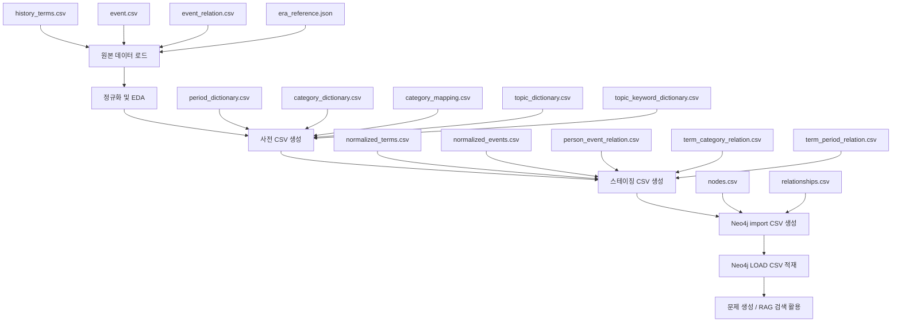

## 2. 원본 데이터 역할

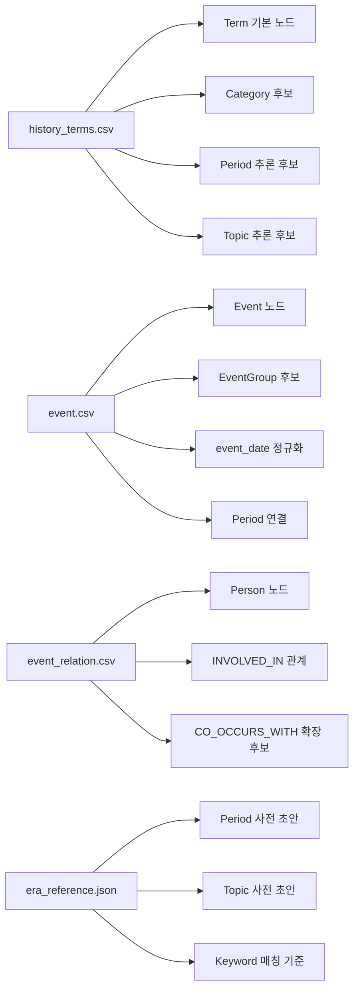

## 3. `term_kind`, `topterm_id`, `term_lk` 해석

`term_kind`는 행의 역할을 나타낸다.

| 값 | 의미 | 전처리 역할 |
|---|---|---|
| `0` | 원본 최상위 대분류 | `TopCategory` 또는 원본 대분류 기준 |
| `1` | 하위 분류/태그/색인어 후보 | `Category` 후보 검증/보강 |
| `2` | 실제 역사 용어 | `Term` 노드 생성 대상 |

`topterm_id`는 직접 부모가 아니라 최상위 대분류 ID로 본다.  
실제 상세 분류 연결은 `term_lk`의 경로 문자열을 분해해서 만든다.

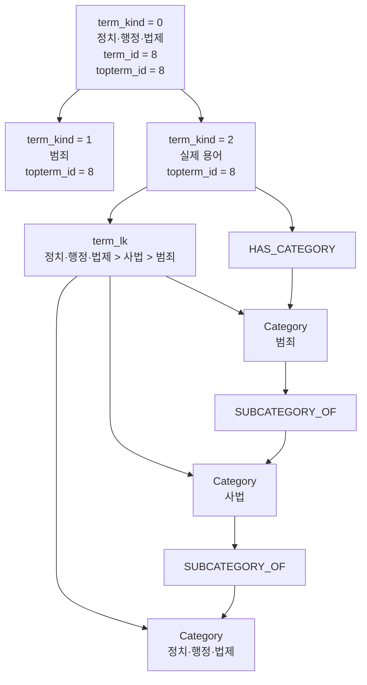

## 4. `term_lk` 분류 경로 분해

`term_lk`는 실제 용어가 속한 분류 경로다.  
`>>`는 복수 경로 구분자, `>`는 계층 구분자로 처리한다.

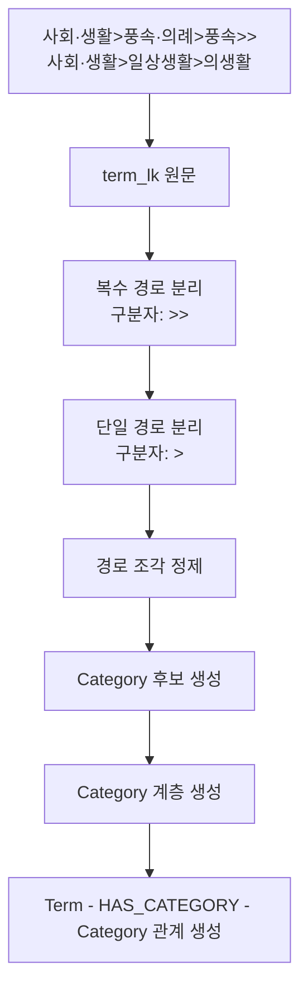

## 5. 최상위 카테고리 9개

설계본의 서비스용 최상위 카테고리는 9개로 둔다. 원본 대분류 17개는 보존하되, 서비스 그래프에서는 아래 기준으로 매핑한다.

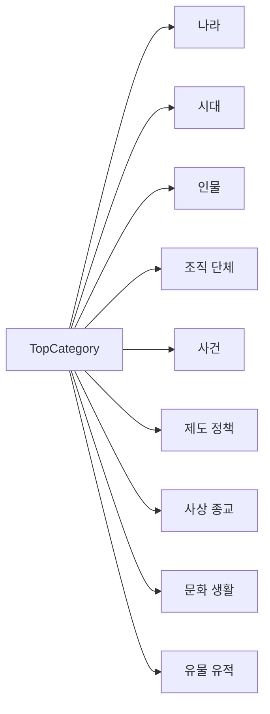

## 6. MVP 노드 설계

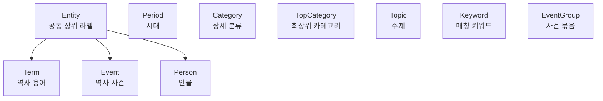

## 7. MVP 관계 설계

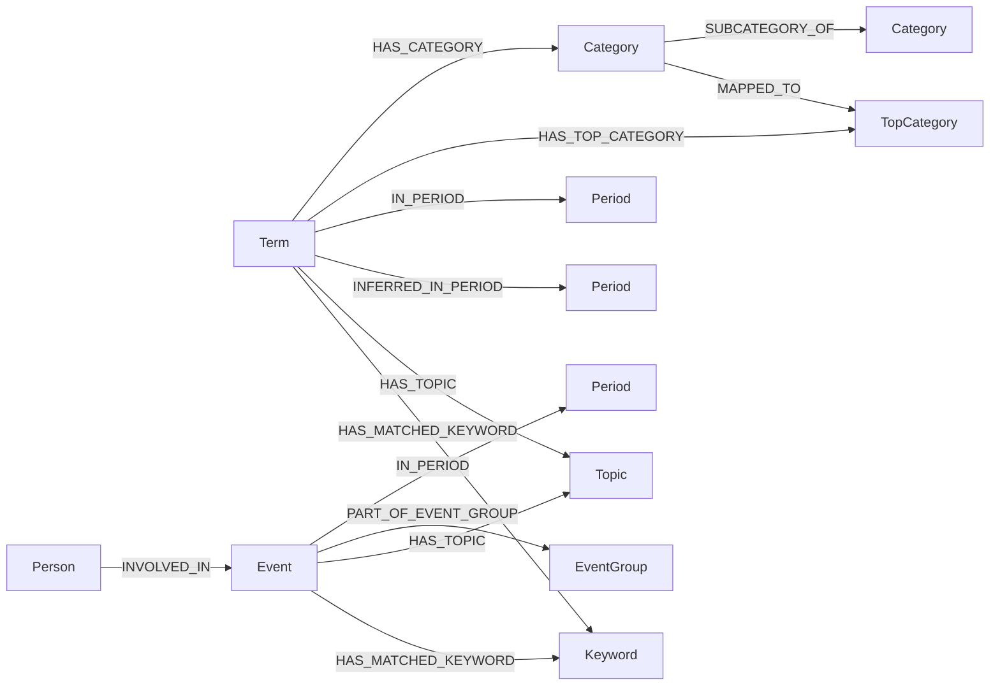

## 8. 원본 관계와 추론 관계 분리

원본 CSV에 직접 들어 있는 관계와 전처리로 추론한 관계는 분리한다.  
이렇게 해야 검수, 삭제, 신뢰도 기반 검색이 쉬워진다.

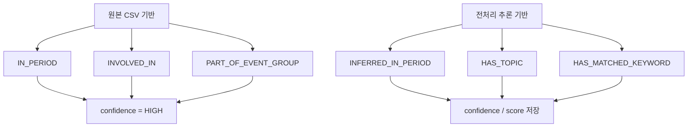

## 9. 전처리 산출물 구조

```mermaid
flowchart TD
    RAW["data/raw"] --> R1["history_terms.csv"]
    RAW --> R2["event.csv"]
    RAW --> R3["event_relation.csv"]
    RAW --> R4["era_reference.json"]

    DICT["data/dictionary"] --> D1["period_dictionary.csv"]
    DICT --> D2["category_dictionary.csv"]
    DICT --> D3["category_mapping.csv"]
    DICT --> D4["topic_dictionary.csv"]
    DICT --> D5["topic_keyword_dictionary.csv"]

    STG["data/staging"] --> S1["normalized_terms.csv"]
    STG --> S2["normalized_events.csv"]
    STG --> S3["person_event_relation.csv"]
    STG --> S4["term_period_relation.csv"]
    STG --> S5["term_category_relation.csv"]
    STG --> S6["review_candidates.csv"]

    IMP["data/neo4j_import"] --> N1["nodes.csv"]
    IMP --> N2["relationships.csv"]
```

## 10. 1차 구현 순서

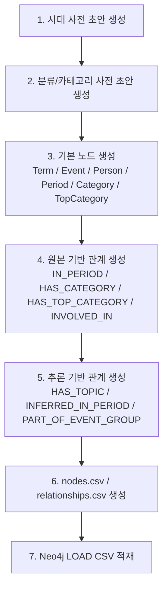

## 11. 2차 확장 후보

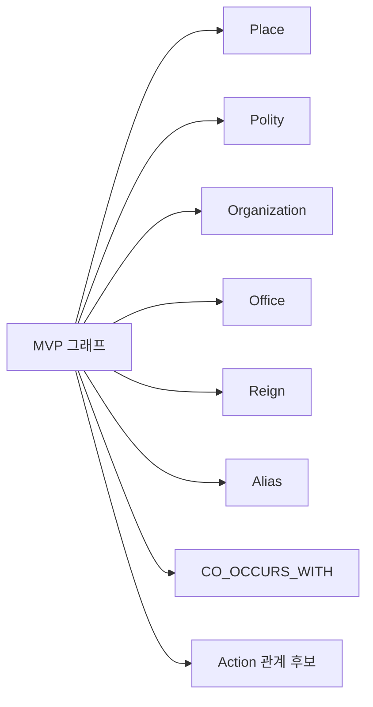

## 12. 정리

1차 전처리의 핵심은 `history_terms.csv`를 단순 용어 목록으로만 보지 않고, `term_kind`, `topterm_id`, `term_lk`를 분리해서 해석하는 것이다.

- `term_kind = 0`은 원본 대분류 기준이다.
- `term_kind = 1`은 하위 분류/태그 후보이며, 직접 부모 관계로 확정하지 않는다.
- `term_kind = 2`는 실제 `Term` 노드 생성 대상이다.
- 상세 분류 연결은 `term_lk` 경로 분해 결과를 우선한다.
- 원본 관계와 추론 관계는 별도 관계 타입과 속성으로 분리한다.
