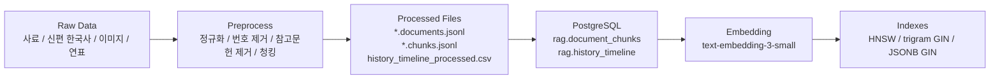
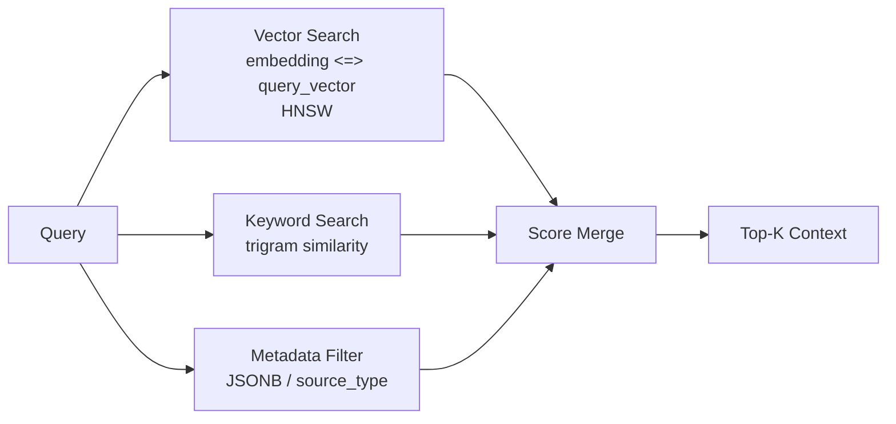

# PostgreSQL RAG Mermaid 흐름도

## 1. 전처리와 적재 흐름



## 2. 챗봇 검색 흐름

```mermaid
flowchart TD
    q["User Question"]
    route["Intent Routing\nconcept / image / problem / chat"]
    image["Image Search\nmetadata title/url only"]
    graph["Neo4j Context\nrelation keywords"]
    pg["PostgreSQL Hybrid Search\nvector + keyword + metadata"]
    llm["Answer Generator"]
    ui["Chatbot UI"]

    q --> route
    route -->|image request| image
    route -->|concept/problem| graph
    graph --> pg
    route -->|concept/problem| pg
    pg --> llm
    image --> llm
    llm --> ui
```

## 3. 검색 인덱스 사용 흐름



