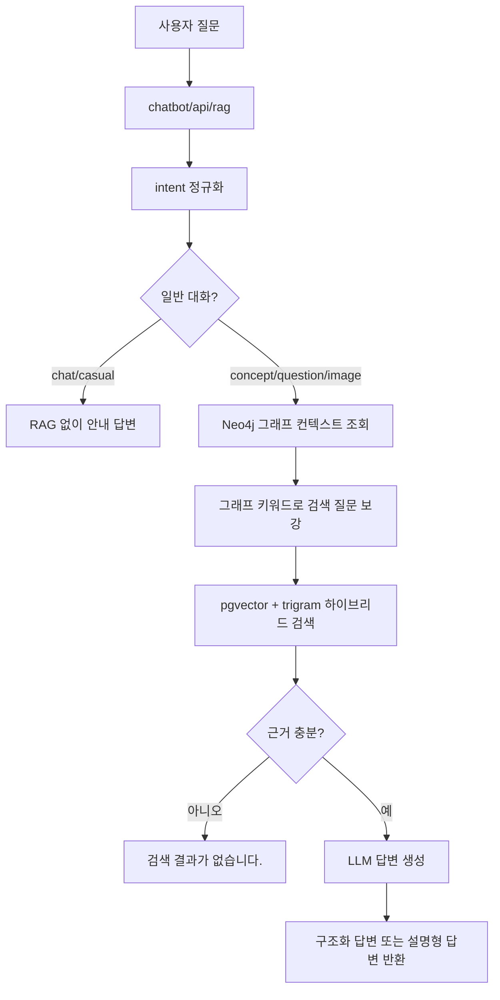

# 챗봇 RAG 구축 및 운영 문서

## 1. 목적

이 문서는 한국사 챗봇에서 사용하는 현재 RAG 구조를 정리한다.

챗봇은 한국사 개념 질문, 문제 관련 질문, 이미지 자료 조회를 지원한다. 답변은 PostgreSQL pgvector에 적재된 한국사 chunk를 검색하고, 필요하면 Neo4j 그래프 컨텍스트를 보강한 뒤 LLM으로 생성한다.

## 2. 현재 구성

### 주요 코드 위치

| 구분 | 파일 |
|---|---|
| 챗봇 페이지/API | `app/chatbot/views.py` |
| RAG 진입 서비스 | `app/chatbot/rag_service.py` |
| pgvector 하이브리드 검색 | `app/chatbot/rag/pgvector_retriever.py` |
| LLM 답변 생성 | `app/chatbot/rag/llm_answer_generator.py` |
| Neo4j 그래프 컨텍스트 | `app/chatbot/graph_service.py` |
| 임베딩/적재 스크립트 | `etl/preprocessing/history/embedding/embed_chunks_to_pgvector.py` |
| RAG 실험 스크립트 | `test/HS/run_pgvector_rag.py` |

### 데이터 저장 위치

| 구분 | 위치 |
|---|---|
| 전처리 chunk JSONL | `etl/preprocessing/history/processed/` |
| 사료로 본 한국사 chunk | `historical_sources.chunks.jsonl` |
| 신편 한국사 chunk | `new_history.chunks.jsonl` |
| 한국사 이미지 자료 chunk | `image_materials.chunks.jsonl` |
| PostgreSQL 테이블 | `rag.document_chunks` |
| Neo4j 그래프 | `TermName`, `TermTimes`, `TermLink` 중심 |

## 3. RAG 처리 흐름



## 4. Intent별 동작

| intent | 용도 | 답변 형식 |
|---|---|---|
| `concept` | 한국사 개념 질문 | 구조화 JSON 기반 카드/노트형 답변 |
| `question` | 문제 관련 질문, 오답 설명 | 일반 설명형 Markdown |
| `image` | 사진/이미지 자료 조회 | 이미지 자료 검색 및 URL 반환 |
| `chat`, `casual` | 가벼운 일반 대화 | RAG 검색 없이 안내 답변 |

현재 프론트에서는 통합 챗봇 화면을 사용하므로, 사용자가 직접 질문 유형을 고르지 않아도 서버에서 intent를 받아 처리한다.

## 5. PostgreSQL pgvector 검색 구조

### 테이블

`rag.document_chunks`

| 컬럼 | 의미 |
|---|---|
| `chunk_id` | chunk 고유 ID |
| `document_id` | 원문 문서 ID |
| `source_type` | `historical_source`, `historical_overview`, `image_material` |
| `source_name` | 사료로 본 한국사, 신편 한국사, 한국사 이미지 자료 |
| `title` | 문서 또는 이미지 제목 |
| `chunk_text` | 검색 대상 본문 |
| `metadata` | 출처 URL, 시기, 분류, 키워드 등 JSONB |
| `embedding` | pgvector 임베딩 |
| `embedding_model` | 임베딩 모델명 |
| `embedded_at` | 임베딩 생성 시각 |

### 검색 방식

`PgVectorHybridRetriever.search()`에서 다음 점수를 조합한다.

| 점수 | 기준 |
|---|---|
| vector score | `embedding <=> query_embedding` cosine 거리 |
| keyword score | `title`, `chunk_text`, `metadata`의 trigram similarity |
| source boost | 이미지 질문이면 `image_material` 가중, 개념 질문이면 `historical_overview` 가중 |
| focus boost | `알려줘`, `업적`, `정리` 같은 개요형 질문에서 핵심 토큰이 들어간 chunk 가중 |

특정 인물명이나 주제명을 코드에 하드코딩하지 않는다. 질문에서 토큰을 뽑고, 그 토큰으로 검색 범위를 좁힌다.

## 6. Neo4j 그래프 보강

`build_graph_context()`는 질문에서 토큰을 뽑아 Neo4j에서 관련 용어와 관계를 조회한다.

현재 목적은 다음과 같다.

- 인물/사건/개념 관계 키워드 보강
- RDB 검색 질문에 관련 키워드 추가
- LLM이 참고할 관계 요약 제공

Neo4j 비밀번호가 `.env`에 없거나 서버 연결이 실패하면 RAG는 그래프 없이 pgvector 검색만 수행한다.

## 7. LLM 답변 생성

`LLMAnswerGenerator`는 `.env` 설정에 따라 OpenAI 또는 Ollama를 사용한다.

| 설정값 | 설명 | 기본값 |
|---|---|---|
| `CHAT_LLM_PROVIDER` | `openai` 또는 `ollama` | `openai` |
| `OPENAI_CHAT_MODEL` | OpenAI 답변 모델 | `gpt-5.4-mini` |
| `OLLAMA_CHAT_MODEL` | Ollama 모델 | `gemma4:2b` |
| `OLLAMA_BASE_URL` | Ollama API 주소 | `http://localhost:11434` |
| `CHAT_TEMPERATURE` | 생성 온도 | `0.2` |

개념 질문은 JSON 구조화 답변을 생성한다. 문제 질문과 후속 질문은 설명형 답변을 생성한다.

LLM 프롬프트 원칙:

- 검색 근거 안에서만 답변
- 근거 부족 시 부족하다고 처리
- 한능검 포인트는 실제 암기/출제 포인트만 작성
- 불확실성, 가족관계 단정 주의, 출처 반복 문장은 시험 포인트에서 제외

## 8. 결과 없음 처리

검색 결과가 없거나 점수가 낮으면 LLM을 호출하지 않고 아래 문장만 반환한다.

```text
검색 결과가 없습니다.
```

이 처리는 `rag_service.py`의 `has_enough_evidence()`와 `not_found_answer()`에서 담당한다.

## 9. 이미지 자료 조회

이미지 자료는 사용자가 `사진`, `이미지`, `그림`, `유물`, `유적`, `보여줘`, `조회` 같은 표현을 쓸 때만 우선 조회한다.

이미지 파일 자체를 서버에 저장하지 않고, metadata의 이미지 URL을 사용한다.

보안상 프론트에서 이미지를 직접 불러오지 못할 수 있으므로 `app/chatbot/views.py`의 `image_proxy()`를 통해 `https://contents.history.go.kr/data/img/` 경로만 프록시한다.

## 10. 임베딩 및 적재 방법

### 소량 테스트

```powershell
.\.venv\Scripts\python.exe etl\preprocessing\history\embedding\embed_chunks_to_pgvector.py --limit 10
```

### 전체 적재/임베딩

```powershell
.\.venv\Scripts\python.exe etl\preprocessing\history\embedding\embed_chunks_to_pgvector.py --limit 40000 --batch-size 10 --sleep 2 --create-index
```

### 이미 chunk는 적재했고 임베딩만 이어서 할 때

```powershell
.\.venv\Scripts\python.exe etl\preprocessing\history\embedding\embed_chunks_to_pgvector.py --skip-upsert --limit 40000 --batch-size 10 --sleep 2
```

스크립트는 `embedding IS NULL`이거나 `embedding_model`이 다른 row부터 이어서 처리한다. 중간에 rate limit이 발생하면 자동 대기 후 배치 크기를 줄여 재시도한다.

## 11. RAG 실험 방법

### 일반 RAG 테스트

```powershell
.\.venv\Scripts\python.exe test\HS\run_pgvector_rag.py "장영실 알려줘"
```

### 구조화 답변 테스트

```powershell
.\.venv\Scripts\python.exe test\HS\run_pgvector_rag.py "조선 전기 정치 정리해줘" --answer-format structured
```

### OpenAI LLM 연결 테스트

```powershell
.\.venv\Scripts\python.exe test\HS\run_pgvector_rag.py "세종대왕 업적 알려줘" --llm openai
```

### Ollama 연결 테스트

```powershell
.\.venv\Scripts\python.exe test\HS\run_pgvector_rag.py "6조 직계제 설명해줘" --llm ollama --llm-model gemma4:2b
```

### 이미지 자료 테스트

```powershell
.\.venv\Scripts\python.exe test\HS\run_pgvector_rag.py "첨성대 사진 보여줘" --raw
```

## 12. DBeaver 확인 쿼리

### 전체 chunk 수

```sql
SELECT COUNT(*)
FROM rag.document_chunks;
```

### source_type별 개수

```sql
SELECT source_type, source_name, COUNT(*) AS cnt
FROM rag.document_chunks
GROUP BY source_type, source_name
ORDER BY source_type, source_name;
```

### 이미지 자료만 확인

```sql
SELECT
    chunk_id,
    title,
    source_name,
    metadata ->> 'source_url' AS source_url,
    metadata ->> 'thumbnail_url' AS thumbnail_url,
    metadata ->> 'original_image_url' AS original_image_url
FROM rag.document_chunks
WHERE source_type = 'image_material'
ORDER BY id
LIMIT 50;
```

### 임베딩 완료 여부

```sql
SELECT
    COUNT(*) AS total,
    COUNT(embedding) AS embedded,
    COUNT(*) - COUNT(embedding) AS missing_embedding
FROM rag.document_chunks;
```

### 인덱스 확인

```sql
SELECT indexname
FROM pg_indexes
WHERE schemaname = 'rag'
  AND tablename = 'document_chunks'
ORDER BY indexname;
```

## 13. 운영 체크리스트

- `.env`에 PostgreSQL 접속 정보가 맞는지 확인한다.
- `.env`에 `OPENAI_API_KEY` 또는 Ollama 설정이 있는지 확인한다.
- `rag.document_chunks`에 chunk가 적재되어 있는지 확인한다.
- `embedding`이 대부분 채워져 있는지 확인한다.
- `document_chunks_embedding_cosine_idx` 인덱스가 생성되어 있는지 확인한다.
- 챗봇에서 결과가 없으면 먼저 DBeaver에서 해당 키워드가 chunk에 있는지 확인한다.
- 검색어가 데이터에 없으면 답변을 만들지 않고 `검색 결과가 없습니다.`를 반환하는 것이 정상이다.

## 14. 하드코딩 정책

현재 RAG 검색에서는 특정 인물명, 왕명, 사건명을 코드에 직접 박아 넣지 않는다.

허용되는 것은 다음 정도다.

- intent 분류를 위한 일반 표현: `사진`, `이미지`, `알려`, `정리`, `업적`
- source_type 기반 처리: `image_material`, `historical_overview`, `historical_source`
- 점수 기준과 top_k 같은 검색 파라미터

새로운 인물이나 사건을 더 잘 검색하고 싶으면 코드에 이름을 추가하지 말고, 전처리 metadata, chunk 텍스트, Neo4j 관계 데이터, 동의어 사전 데이터처럼 데이터 레벨에서 보강한다.
