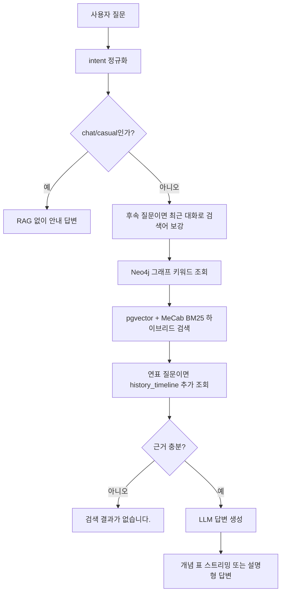

# 챗봇 RAG 구축 및 운영 문서

이 문서는 v1, v2, v3 운영 문서를 시간순으로 병합한 단일 기준 문서입니다. 데이터 구축은 [PostgreSQL RAG 구축 실행 순서](../postgresql/postgresql_rag_구축_실행순서.md), 저장·검색 구조는 [RAG 데이터·검색 설계](RAG_데이터_검색_설계.md)를 따릅니다.

## 1. 버전 변경 이력

### v1: 기본 RAG 구축

- PostgreSQL `rag.document_chunks`에 사료·신편 한국사·이미지 자료 청크를 저장하고 pgvector 검색을 도입했습니다.
- 개념, 문제, 이미지, 일반 대화 intent를 분리했습니다.
- Neo4j 그래프 컨텍스트로 관계 키워드를 보강하고, 근거가 부족하면 LLM 호출 없이 `검색 결과가 없습니다.`를 반환하도록 했습니다.
- 구조화 개념 답변과 이미지 프록시, 적재·임베딩·DBeaver 점검 절차를 마련했습니다.
- 초기 데이터 범위는 사료로 본 한국사, 신편 한국사, 이미지 자료였으며, 이미지 파일은 저장하지 않고 URL 메타데이터만 유지했습니다.

### v2: 검색 보정과 대화 맥락 확장

- 최근 5턴의 대화를 후속 질문 해석에 사용하도록 했습니다.
- 개요형 질문의 핵심어 우선, 불필요 토큰 제거, `대왕` 호칭 처리, 결과 제목 다양화를 추가했습니다.
- 그래프 키워드의 한자·연도·시대명·질문 기능어를 걸러 검색어 잡음을 줄였습니다.
- 인물 업적 질문에는 창제·설치·정비·편찬·제작·반포·개혁·발명·시행 같은 일반 서술어 보정 가능성을 검토했고, 인물별 하드코딩은 금지했습니다.
- 인물 관계 질문의 한계를 명시하고, 관계 데이터와 Neo4j 우선 조회를 개선 방향으로 기록했습니다.
- 특정 인물·사건을 코드에 하드코딩하지 않고 전처리 metadata·관계 데이터·사전 데이터로 보강하는 원칙을 확립했습니다.

### v3: 연표·평가·근거 기준 보강

- `rag.history_timeline`을 추가해 연대·순서·흐름 질문의 보조 근거로 사용하도록 했습니다.
- 검색 근거 판정은 RRF 순위 점수가 아닌 `keyword_score`와 `vector_score`를 사용하도록 정리했습니다.
- 서비스 평가와 RAGAS Faithfulness 평가, LangSmith 추적 절차를 운영 기준에 포함했습니다.
- 문제 카드, 후속 문제 질문, 답변 형식 일관성 기준을 문서화했습니다.
- 당시 목표 지표는 검색 적합성 0.80 이상, Graph 연결성 95% 이상, 평균 응답 시간 2초 이내, RAGAS Faithfulness 0.80 이상으로 기록했습니다.

## 2. 현재 구성

| 구분 | 파일 또는 저장소 |
|---|---|
| 챗봇 화면·API | `app/chatbot/views.py`, `templates/chatbot/chat.html` |
| RAG 오케스트레이션 | `app/chatbot/rag_service.py` |
| 하이브리드 검색 | `app/chatbot/rag/pgvector_retriever.py` |
| LLM 답변·스트리밍 | `app/chatbot/rag/llm_answer_generator.py` |
| 그래프 컨텍스트 | `app/chatbot/graph_service.py` |
| 청크 적재·임베딩 | `etl/preprocessing/history/embedding/embed_chunks_to_pgvector.py` |
| 연표 적재 | `etl/preprocessing/history/load_history_timeline_to_postgres.py` |
| 서비스 평가 | `scripts/evaluate_service_metrics.py` |

검색 본문은 `rag.document_chunks`, 연표는 `rag.history_timeline`, 관계 보강은 Neo4j에 저장합니다. 한국민족문화대백과사전의 `articleAliases`는 metadata와 청크 검색 텍스트에 함께 넣어 별칭 검색이 가능하도록 합니다.

## 3. 현재 처리 흐름



## 4. Intent별 정책

| intent | 용도 | 응답 |
|---|---|---|
| `concept` | 개념·인물·제도·비교 질문 | 구조화 표 답변, 섹션·행 단위 스트리밍 |
| `question` | 문제·오답·선지 질문 | 설명형 Markdown |
| `image` | 사진·이미지·유물·유적 조회 | 이미지 자료와 URL |
| `chat`, `casual` | 일반 대화 | RAG 없이 안내 |

개념 답변은 검색 근거만 사용합니다. 인물 단독 질문은 `개요 → 주요 업적 → 역사적 역할` 순서를 기본으로 하고, 비교·관계 질문은 각 질문 전용 형식을 우선합니다.

## 5. 검색과 근거 판정

검색기는 질문 정규화 후 핵심어를 추출하고, 벡터 후보와 MeCab BM25 후보를 RRF로 합칩니다. 개요형 질문은 핵심어가 제목·본문에 있는 결과를 우선하고 같은 제목의 반복을 줄입니다. 설정된 경우 CrossEncoder 리랭커로 최종 순서를 조정합니다.

| 값 | 현재 기준 |
|---|---|
| `MIN_KEYWORD_SCORE` | `0.12` |
| `MIN_VECTOR_SCORE` | `0.35` |
| 근거 충분 | 상위 결과 중 하나가 두 기준 중 하나 이상 충족 |
| 이미지 성공 | `image_material`이며 이미지 URL이 존재 |

연표는 답변 근거를 보완하지만 일반 벡터 검색의 근거 판정 자체를 통과시키지는 않습니다. 기준에 미달하면 LLM의 일반 지식으로 보완하지 않고 fallback을 반환합니다.

## 6. 대화·그래프·이미지 처리

- 최근 대화는 후속 질문일 때만 검색어와 생성 프롬프트에 반영합니다.
- 그래프 컨텍스트는 인물·관계·복수 비교 대상처럼 연결 정보가 유용한 질문에 사용합니다. 그래프 연결이 실패해도 pgvector 검색은 계속됩니다.
- 이미지 질문은 벡터 검색 대신 제목·메타데이터 중심으로 조회합니다. `image_proxy()`는 허용된 한국사 콘텐츠 이미지 경로만 프록시합니다.
- 문제 선택은 문제 카드로 표시하며, 전체 문제 컨텍스트를 매 후속 질문에 반복하지 않습니다.

## 7. 답변 생성과 일관성

LLM은 OpenAI 또는 Ollama를 사용하며, 제공된 검색 근거 밖의 내용을 만들지 않습니다. 개념 답변은 JSON 구조를 표 카드로 렌더링하고, 실제 스트리밍에서는 `meta → section → row → done` 순서로 전송합니다.

운영 시에는 `CHAT_TEMPERATURE=0`을 권장합니다. 근거 부족 안내 문구를 답변 본문에 노출하지 않고 fallback 처리하며, 출처는 최종 카드에 표시합니다.

## 8. 평가와 운영 점검

빠른 서비스 평가는 다음 명령으로 실행합니다.

```powershell
.\.venv\Scripts\python.exe scripts\evaluate_service_metrics.py
```

RAGAS Faithfulness를 함께 평가할 때는 다음을 사용합니다.

```powershell
.\.venv\Scripts\python.exe scripts\evaluate_service_metrics.py --ragas
```

운영 점검 항목:

- PostgreSQL과 Neo4j 연결 상태
- `rag.document_chunks`, `rag.history_timeline` 적재 상태
- 비이미지 청크의 임베딩 누락 여부와 HNSW 인덱스 존재
- 이미지 자료의 URL 존재 여부
- 별칭이 `metadata.aliases`와 `chunk_text`에 포함되는지
- 근거 미달 시 fallback이 동작하는지
- 개념·비교·인물·연표·이미지·문제 질문의 결과

## 9. 데이터 보강 원칙

검색 품질을 높이기 위해 특정 인물·사건·업적을 코드에 직접 넣지 않습니다. 대표 업적, 이칭, 관계는 원천 데이터의 별칭·metadata·청크 텍스트와 Neo4j 관계 데이터로 관리합니다. 데이터가 검색되지 않으면 먼저 원천 수집, 전처리, 청크 텍스트, 적재·임베딩 순서로 확인합니다.
