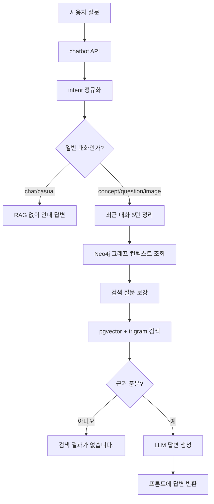

# 챗봇 RAG 구축 및 운영 문서 v2

## 1. 목적

이 문서는 현재 `himate` 챗봇의 하이브리드 RAG 구조와 운영 기준을 정리한다.

챗봇은 한국사 개념 질문, 문제 질문, 이미지 자료 조회, 가벼운 학습 대화를 하나의 통합 입력창에서 처리한다. 검색은 PostgreSQL pgvector와 trigram 기반 키워드 검색을 함께 사용하고, Neo4j 그래프 컨텍스트가 있으면 검색 질문을 보강한다.

## 2. 주요 코드 위치

| 구분 | 파일 |
|---|---|
| 챗봇 화면/API | `app/chatbot/views.py` |
| RAG 오케스트레이션 | `app/chatbot/rag_service.py` |
| pgvector 하이브리드 검색 | `app/chatbot/rag/pgvector_retriever.py` |
| LLM 답변 생성 | `app/chatbot/rag/llm_answer_generator.py` |
| Neo4j 그래프 컨텍스트 | `app/chatbot/graph_service.py` |
| 임베딩 적재 | `etl/preprocessing/history/embedding/embed_chunks_to_pgvector.py` |
| RAG CLI 실험 | `test/HS/run_pgvector_rag.py` |

## 3. 데이터 구성

| 데이터 | 저장 위치 |
|---|---|
| 전처리 chunk JSONL | `etl/preprocessing/history/processed/` |
| 사료로 본 한국사 | `historical_sources.chunks.jsonl` |
| 신편 한국사 | `new_history.chunks.jsonl` |
| 한국사 이미지 자료 | `image_materials.chunks.jsonl` |
| RAG 검색 테이블 | `rag.document_chunks` |
| 그래프 DB | Neo4j `TermName`, `TermTimes`, `TermLink` |

`rag.document_chunks`에는 본문, 제목, metadata, embedding이 함께 저장된다. 이미지 자료는 파일을 저장하지 않고 metadata에 원본 URL과 썸네일 URL만 남긴다.

## 4. 전체 처리 흐름



## 5. Intent별 응답 정책

| intent | 설명 | 답변 형식 |
|---|---|---|
| `concept` | 한국사 개념 질문 | 구조화 답변 |
| `question` | 문제 풀이, 오답, 선택지 질문 | 일반 대화형 설명 |
| `image` | 사진/이미지 자료 조회 | 이미지 URL 포함 답변 |
| `chat`, `casual` | 한국사 외 가벼운 대화 | RAG 없이 안내 답변 |

프론트에서는 질문 유형 버튼을 따로 고르지 않는다. 서버가 질문 내용과 요청 형식에 따라 처리한다.

## 6. 검색 보정 로직

### 6.1 개요형 질문

다음 표현이 있으면 개요형 질문으로 본다.

- `정리`
- `요약`
- `흐름`
- `개념`
- `설명`
- `알려`
- `누구`
- `업적`
- `정책`

개요형 질문은 단순 벡터 검색만 하면 넓은 문서가 섞이기 쉽다. 그래서 핵심 토큰을 뽑아 제목, 본문, metadata에 포함되는 문서를 우선한다.

### 6.2 불필요 토큰 제거

검색 핵심어에서 다음 표현은 제거한다.

- `정리`
- `요약`
- `설명`
- `알려줘`
- `업적`
- `정책`
- `대해`
- `대한`

예를 들어 `세종대왕 업적은?`에서 `업적은`은 조사 제거 후 `업적`이 되므로 검색 핵심어에서 제외된다.

### 6.3 왕/인물 호칭 처리

`세종대왕`처럼 `대왕`이 붙은 표현은 기본 인물명도 같이 검색한다.

예시:

```text
세종대왕 -> 세종대왕, 세종
```

특정 인물명을 코드에 넣은 것이 아니라, `대왕` 호칭이 붙은 일반 패턴을 처리한다.

### 6.4 업적 질문 보정

`업적`, `정책`, `활동`이 들어간 질문은 다음 일반 서술어를 보조 검색어로 붙인다.

- `창제`
- `설치`
- `정비`
- `편찬`
- `제작`
- `반포`
- `개혁`
- `발명`
- `시행`

이 보정은 세종 전용이 아니다. 모든 인물 업적 질문에 동일하게 적용된다.

### 6.5 그래프 키워드 필터링

Neo4j에서 가져온 키워드는 그대로 검색어에 붙이지 않는다. 다음 값은 제외한다.

- 2글자 미만
- 한자가 포함된 값
- 연도
- `조선전기` 같은 시대명 단독 값
- `업적`, `정책`, `정리`, `설명` 같은 질문 기능어
- 이미 선택된 짧은 키워드를 포함하는 긴 잡음 키워드

예를 들어 `세종대왕 업적은?`에서 `세종대왕신도비`, `世宗大王神道碑`, `1452`, `조선전기` 같은 값은 검색 확장어에서 제외한다.

## 7. 검색 점수 구조

`PgVectorHybridRetriever.search()`는 다음 요소를 조합한다.

| 요소 | 설명 |
|---|---|
| vector score | query embedding과 chunk embedding의 cosine 유사도 |
| keyword score | title, chunk_text, metadata의 trigram 유사도 |
| source boost | 개념 질문은 `historical_overview`, 이미지 질문은 `image_material` 가중 |
| focus boost | 핵심 토큰이 title, chunk_text, metadata에 있으면 가중 |
| diversity | 개요형 질문에서 같은 제목이 반복 노출되지 않도록 결과 다양화 |

## 8. 결과 없음 처리

검색 결과가 없거나 근거 점수가 낮으면 LLM을 호출하지 않는다.

반환 문구:

```text
검색 결과가 없습니다.
```

근거가 부족한데 LLM이 억지로 답을 만들면 사용자가 잘못된 내용을 학습할 수 있으므로, 결과 없음 처리는 의도된 안전장치다.

## 9. 이미지 조회 정책

이미지는 사용자가 명시적으로 이미지나 사진을 요청할 때만 조회한다.

이미지 intent로 보는 표현:

- `이미지`
- `사진`
- `그림`
- `유물`
- `유적`
- `자료`
- `보여줘`
- `조회`

이미지 조회 시에는 `source_type = 'image_material'`로 제한하고, 질문 키워드가 이미지 제목에 포함되는 자료를 우선한다.

## 10. 대화 기억

챗봇은 최근 5턴을 슬라이딩 윈도우로 사용한다.

프론트는 최근 사용자/챗봇 메시지 10개를 서버로 전달하고, 서버는 최대 5턴만 정리해 LLM 프롬프트에 넣는다.

후속 질문으로 판단되는 표현:

- `그거`
- `이거`
- `그럼`
- `좀더`
- `자세히`
- `왜`
- `어떻게`
- `차이`
- `비교`

후속 질문일 때만 최근 대화 내용을 검색 질문에 보강한다.

## 11. 현재 한계

### 11.1 넓은 인물 질문

`훈민정음 알려줘`처럼 정확한 개념 질문은 검색 품질이 좋다. 반면 `세종대왕 업적은?`처럼 넓은 인물 요약 질문은 여러 문서가 섞일 수 있다.

이유:

- 현재 DB는 인물별 대표 업적 요약 테이블이 아니다.
- 원문과 개설서 chunk가 기준이라 업적이 여러 문서에 흩어져 있다.
- `세종`처럼 넓은 키워드는 `세종실록지리지`, `세종대 음악`, `세종대 제도` 등 다양한 문서를 동시에 끌어온다.

현재 보정으로 검색 잡음은 줄였지만, 완전히 안정적인 인물 요약을 위해서는 데이터 보강이 필요하다.

### 11.2 인물 관계 질문

`신사임당과 율곡 이이`, `세종대왕과 장영실`처럼 관계를 묻는 질문은 현재 chunk 검색만으로는 불안정하다.

개선 방향:

- 인물 관계 데이터를 수집한다.
- Neo4j에 인물, 사건, 관계 edge를 적재한다.
- RAG 검색 전에 그래프 DB에서 관계를 먼저 조회한다.
- 관계 근거가 있으면 RDB chunk 검색과 함께 LLM에 전달한다.

## 12. 개선 우선순위

1. 인물 관계망 수집 완료
2. Neo4j에 인물 관계 적재
3. 질문에서 인물 2명 이상 감지
4. 그래프 관계 우선 조회
5. 관계 결과와 pgvector 근거를 함께 LLM에 전달
6. 인물별 대표 업적/키워드 metadata 보강

## 13. 실험 명령어

### 기본 질문

```powershell
.\.venv\Scripts\python.exe test\HS\run_pgvector_rag.py "세종대왕 업적은?"
```

### 구조화 답변

```powershell
.\.venv\Scripts\python.exe test\HS\run_pgvector_rag.py "조선 전기 정치 정리해줘" --answer-format structured
```

### 이미지 조회

```powershell
.\.venv\Scripts\python.exe test\HS\run_pgvector_rag.py "첨성대 사진 보여줘" --raw
```

### 검색 결과 디버깅

```powershell
.\.venv\Scripts\python.exe -c "from app.chatbot.rag.pgvector_retriever import PgVectorHybridRetriever; [print(r.title, r.score, r.keyword_score) for r in PgVectorHybridRetriever().search('세종대왕 업적은?', top_k=8)]"
```

## 14. DBeaver 확인 쿼리

### 전체 chunk 수

```sql
SELECT COUNT(*)
FROM rag.document_chunks;
```

### source별 개수

```sql
SELECT source_type, source_name, COUNT(*) AS cnt
FROM rag.document_chunks
GROUP BY source_type, source_name
ORDER BY source_type, source_name;
```

### 특정 키워드 포함 문서 확인

```sql
SELECT source_type, source_name, title, LEFT(chunk_text, 200) AS snippet
FROM rag.document_chunks
WHERE title ILIKE '%세종%'
   OR chunk_text ILIKE '%세종%'
ORDER BY source_type, title
LIMIT 50;
```

### 이미지 자료 확인

```sql
SELECT
    chunk_id,
    title,
    source_name,
    metadata ->> 'source_url' AS source_url,
    metadata ->> 'thumbnail_url' AS thumbnail_url,
    metadata ->> 'original_image_url' AS original_image_url
FROM rag.document_chunks
WHERE source_type = 'image_material'
ORDER BY id
LIMIT 50;
```

### 임베딩 상태 확인

```sql
SELECT
    COUNT(*) AS total,
    COUNT(embedding) AS embedded,
    COUNT(*) - COUNT(embedding) AS missing_embedding
FROM rag.document_chunks;
```

## 15. 하드코딩 금지 기준

RAG 검색 품질을 올리기 위해 특정 인물명, 사건명, 업적명을 코드에 직접 박지 않는다.

허용:

- 일반 질문 표현 처리: `업적`, `정책`, `사진`, `이미지`
- 일반 서술어 보정: `창제`, `설치`, `편찬`, `제작`
- 일반 호칭 처리: `대왕` 제거 후 기본명 추가

비허용:

- `세종대왕이면 훈민정음 추가`
- `장영실이면 자격루 추가`
- `신사임당이면 율곡 이이 추가`

이런 정보는 코드가 아니라 전처리 metadata, Neo4j 관계 데이터, 별도 사전 데이터로 관리한다.

## 16. 운영 체크리스트

- `.env`의 PostgreSQL 접속 정보 확인
- `.env`의 OpenAI 또는 Ollama LLM 설정 확인
- `rag.document_chunks` 적재 여부 확인
- `embedding` 누락 여부 확인
- pgvector 인덱스 생성 여부 확인
- Neo4j 연결 여부 확인
- 질문에 대한 키워드가 실제 chunk에 있는지 DBeaver로 확인
- 검색 결과가 없을 때 LLM이 억지 답변을 만들지 않는지 확인

