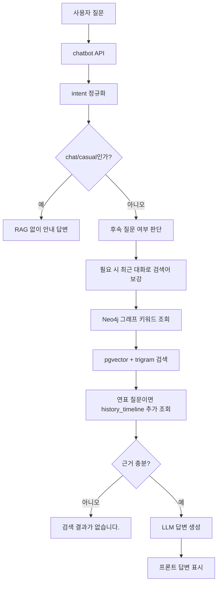

# 챗봇 RAG 구축 및 운영 문서 v3

## 1. 목적

이 문서는 현재 `himate` 챗봇의 RAG 검색, 답변 생성, fallback, 평가 기준을 정리한다.

챗봇은 한국사 개념 질문, 문제 질문, 이미지 자료 조회, 가벼운 학습 대화를 하나의 입력창에서 처리한다. 검색은 PostgreSQL `pgvector`와 trigram 기반 키워드 검색을 함께 사용하며, Neo4j 그래프 컨텍스트와 연표 테이블을 보조 검색원으로 활용한다.

## 2. 주요 코드 위치

| 구분 | 파일 |
|---|---|
| 챗봇 화면/API | `app/chatbot/views.py` |
| RAG 오케스트레이션 | `app/chatbot/rag_service.py` |
| pgvector 하이브리드 검색 | `app/chatbot/rag/pgvector_retriever.py` |
| LLM 답변 생성 | `app/chatbot/rag/llm_answer_generator.py` |
| Neo4j 그래프 컨텍스트 | `app/chatbot/graph_service.py` |
| 연표 적재 | `etl/preprocessing/history/load_history_timeline_to_postgres.py` |
| 서비스 평가 | `scripts/evaluate_service_metrics.py` |

## 3. 데이터 구성

| 데이터 유형 | 저장 위치 | 활용 |
|---|---|---|
| 사료로 본 한국사 | `rag.document_chunks` | 사료 기반 RAG 검색 |
| 신편 한국사 | `rag.document_chunks` | 개념 설명, 시대 흐름 설명 |
| 이미지 메타데이터 | `rag.document_chunks` | 이미지 설명 기반 의미 검색 및 URL 제공 |
| 연표 데이터 | `rag.history_timeline` | 연도순 사건 조회, 시대·분야 필터 |
| 그래프 데이터 | Neo4j | 용어·시대·관계 키워드 보강 |

이미지 파일 자체는 임베딩하지 않는다. 이미지 제목, 설명, 시대, 분야, 유형 등 텍스트 메타데이터만 임베딩한다.

## 4. 전체 처리 흐름



## 5. Intent별 응답 정책

| intent | 설명 | 답변 형식 |
|---|---|---|
| `concept` | 한국사 개념 질문 | 구조화 JSON 답변 |
| `question` | 문제 풀이, 오답, 선택지 질문 | Markdown 설명 |
| `image` | 사진/이미지 자료 조회 | 이미지 URL 포함 답변 |
| `chat`, `casual` | 한국사 외 가벼운 대화 | RAG 없이 안내 답변 |

## 6. 검색 점수 및 근거 충분 기준

`PgVectorHybridRetriever.search()`는 다음 점수를 조합한다.

| 요소 | 설명 |
|---|---|
| `vector_score` | query embedding과 chunk embedding의 cosine 유사도 |
| `keyword_score` | title, chunk_text, metadata의 trigram 유사도 |
| `score` | vector, keyword, source boost, focus boost를 합친 통합 점수 |

현재 fallback 기준은 다음과 같다.

```python
MIN_KEYWORD_SCORE = 0.12
MIN_COMBINED_SCORE = 0.70
FOLLOW_UP_MIN_COMBINED_SCORE = 0.50
```

상위 검색 결과가 `keyword_score >= 0.12`이고 `score >= 0.70`일 때만 충분한 근거로 판단한다. 기준에 미달하면 LLM을 호출하지 않고 `"검색 결과가 없습니다."`를 반환한다.

단, `조금 더`, `자세히`, `왜`, `어떻게`처럼 직전 대화 맥락을 확장하는 후속 질문은 이전 사용자 질문을 함께 검색하고, 통합 점수 기준을 `0.50`으로 완화한다.

이미지 검색은 점수 외에도 `source_type = 'image_material'`이며 `thumbnail_url` 또는 `original_image_url`이 있어야 성공으로 본다.

## 7. 검색 실패 시 대응 전략

- 검색 신뢰도 기준 미달: 상위 검색 결과의 `keyword_score`가 `0.12` 미만이거나 통합 점수(`score`)가 `0.70` 미만이면 충분한 근거가 없다고 판단한다.
- 근거 부족 응답 처리: 기준 미달 시 기본 LLM 지식으로 답변하지 않고 `"검색 결과가 없습니다."`를 반환한다.
- 이미지 검색 실패 처리: 이미지 요청에서 이미지 URL이 포함된 `image_material` 결과가 없으면 실패로 처리한다.
- Graph 보조 검색: 질문에서 핵심 키워드를 추출하고 Neo4j에서 관련 용어를 조회해 검색어를 보강한다.
- 연표 보조 검색: `연표`, `연대`, `흐름`, `언제`, `시기` 등 시간 흐름 질문은 `rag.history_timeline`을 추가 조회한다.
- 대화 맥락 보강: `그거`, `이거`, `조금 더`, `자세히`, `왜`, `어떻게`, `차이`, `비교` 등 후속 질문일 때만 최근 대화 이력을 검색 질문에 결합한다.
- Safe Mode 전환: 보조 검색 이후에도 근거가 부족하면 안전 응답으로 전환한다.

## 8. 답변 일관성 기준

같은 개념 질문에 대한 답변 흔들림을 줄이기 위해 다음 기준을 적용한다.

| 항목 | 기준 |
|---|---|
| LLM temperature | `CHAT_TEMPERATURE=0` |
| 개념 답변 형식 | 기본 3개 섹션 |
| 섹션 구성 | 섹션당 2개 항목 |
| 대화 이력 사용 | 후속 질문일 때만 생성 프롬프트에 포함 |
| 근거 부족 문장 | 화면에 노출하지 않음 |

개념 답변은 JSON 구조로 생성하고, 프론트에서 제목, 요약, 섹션 표, 출처 목록으로 렌더링한다.

## 9. LLM 답변 생성 정책

LLM은 제공된 검색 근거 안에서만 답변한다. 다만 사용자 화면에는 다음 문장을 노출하지 않는다.

- `근거가 부족합니다`
- `충분한 근거가 없습니다`
- `전체 생애를 설명할 만큼의 근거는 부족합니다`
- `확인 불가`

근거 부족 상태는 답변 본문에 설명하지 않고 fallback 로직에서 `"검색 결과가 없습니다."`로 처리한다.

## 10. 문제 질문 처리

문제 선택 시 입력창에 긴 문제 컨텍스트를 넣지 않고, 챗봇 말풍선 안에 문제 카드로 표시한다.

문제 카드에는 다음 정보를 보여준다.

- 지문
- 문제
- 선지
- 내 답
- 정답
- `문제 풀이보기`
- `다른 질문하기`

`문제 풀이보기`는 고정 형식으로 답변한다.

```markdown
## 정답
## 핵심 풀이
## 선지별 해설
```

`다른 질문하기`는 문제 정보를 참고 컨텍스트로만 사용하고, 사용자가 입력한 질문에 대해서만 답변한다. 문제 전체 풀이와 선지별 해설 표를 반복하지 않는다.

## 11. 연표 검색

연표 데이터는 `rag.history_timeline`에 저장한다.

| 컬럼 | 설명 |
|---|---|
| `year` | 연도 |
| `title` | 사건/항목명 |
| `age` | 원천 시대명 |
| `period` | 시기 |
| `era` | 정규화 시대 |
| `field` | 정규화 분야 |

`content_type` 원천 코드는 전처리 단계에서 `era`, `field`로 변환하고, `content_type`, `level_id`, `source_url`은 제거한 뒤 적재한다.

## 12. 평가 및 모니터링

서비스 평가는 다음 스크립트로 수행한다.

```powershell
.\.venv\Scripts\python.exe scripts\evaluate_service_metrics.py
```

RAGAS Faithfulness 평가까지 포함할 경우:

```powershell
.\.venv\Scripts\python.exe scripts\evaluate_service_metrics.py --ragas
```

LangSmith 추적을 사용할 경우 `.env`에서 다음 값을 설정한다.

```env
LANGSMITH_TRACING=true
LANGSMITH_API_KEY=본인키
LANGSMITH_PROJECT=history-rag-evaluation
```

평가 항목은 다음과 같다.

| 평가 항목 | 지표 정의 | 통과 기준 | 검증 방법 |
|---|---|---|---|
| 검색 정확도 | Similarity Score 기반 적합성 | 0.80 이상 | Golden Question 기반 RAG 검색 검증 |
| 연결성(Graph) | 노드 간 탐색 성공률 | 95% 이상 | Cypher Query 성능 테스트 및 접속 조사 |
| 응답 속도 | 쿼리 당 평균 소요 시간 | 2.0s 이내 | LangSmith 또는 로컬 지연시간 측정 |
| MCP/API 연동 성공률 | 외부 도구 호출 및 데이터 수신 | 90% 이상 | API 성공/실패 로그 분석 |
| RAGAS Faithfulness | 답변이 검색 근거에 충실한지 평가 | 0.80 이상 | RAGAS Framework |

## 13. 환경 변수

```env
CHAT_TEMPERATURE=0
LANGSMITH_TRACING=false
LANGSMITH_API_KEY=
LANGSMITH_PROJECT=history-rag-evaluation
```

`RAGAS`는 별도 환경변수보다 `OPENAI_API_KEY` 설정을 사용한다.

## 14. 운영 체크리스트

- PostgreSQL 접속 정보 확인
- `rag.document_chunks` 적재 여부 확인
- `rag.history_timeline` 적재 여부 확인
- `embedding` 누락 여부 확인
- pgvector 인덱스 생성 여부 확인
- Neo4j 연결 여부 확인
- `CHAT_TEMPERATURE=0` 확인
- 검색 기준 `MIN_KEYWORD_SCORE=0.12`, `MIN_COMBINED_SCORE=0.70`, `FOLLOW_UP_MIN_COMBINED_SCORE=0.50` 확인
- 기준 미달 시 `"검색 결과가 없습니다."`로 fallback 되는지 확인
- 같은 개념 질문을 반복했을 때 답변 형식이 유지되는지 확인
