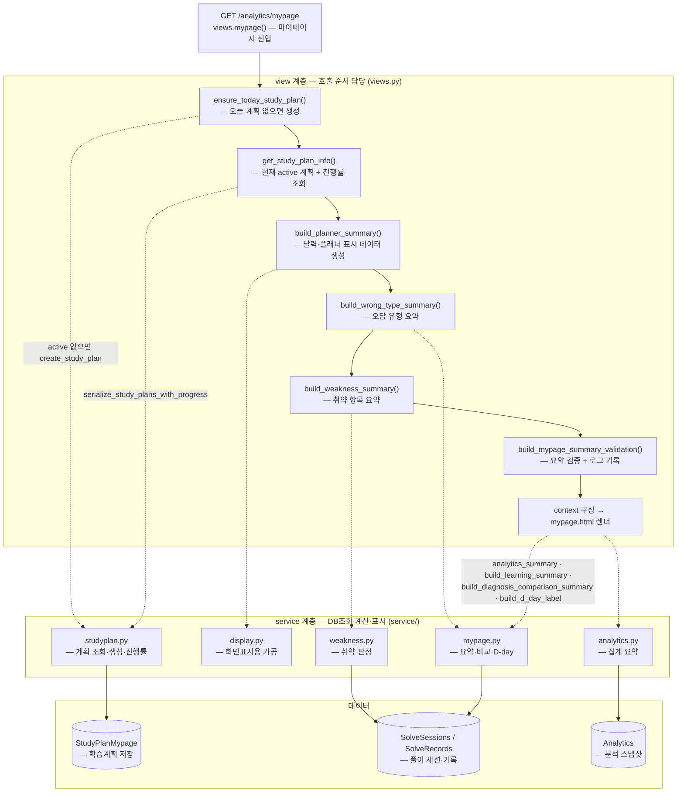
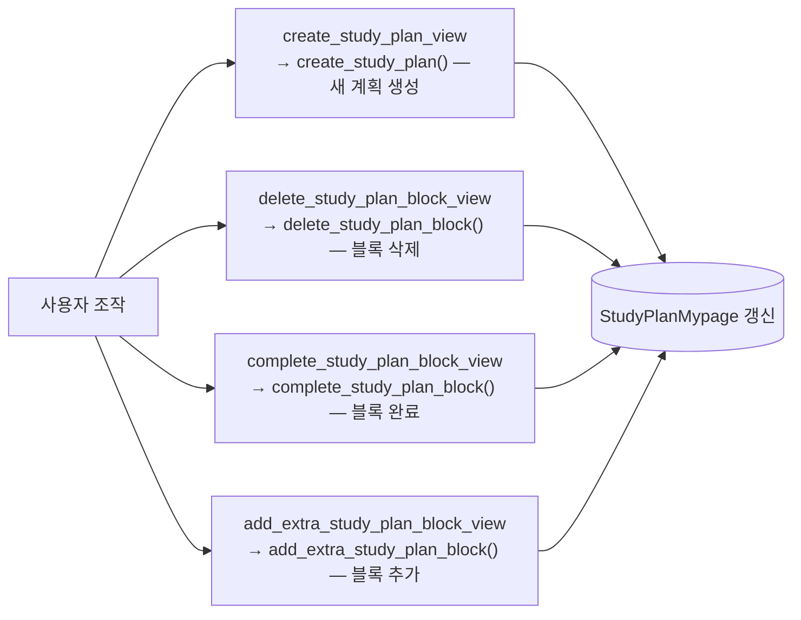

# 마이페이지 서비스 흐름도

`GET /analytics/mypage` 요청에서 view가 서비스 함수를 어떤 순서로 호출하고 각 파일이 어떤 역할을 맡는지 정리한 흐름도다. view(`views.mypage`)는 **호출 순서만** 담당하고, 실제 DB 조회·계산·표시 가공은 service 계층이 맡는다. (근거: `app/analytics/views.py:53`)

각 노드는 `함수명 — 한글 설명` 형식으로 표기했다.

## 전체 흐름

## context에 담기는 표시 데이터

| context 키 | 생성 함수 | 한글 설명 | 파일 |
|---|---|---|---|
| `study_plan` | `get_study_plan_info` | 현재 active 학습계획 + 진행률 | studyplan.py |
| `planner_summary` / `planner_data` | `build_planner_summary` | 달력·플래너 표시 데이터 | display.py |
| `weakness_summary` | `build_weakness_summary` | 취약 항목 요약 | mypage.py → weakness.py |
| `wrong_type_summary` | `build_wrong_type_summary` | 오답 유형 요약 | mypage.py |
| `learning_summary` | `build_learning_summary` | 학습 현황(연속 학습일 등) | mypage.py |
| `diagnosis_comparison` | `build_diagnosis_comparison_summary` | 진단평가 전/후 비교 | mypage.py |
| `d_day_label` | `build_d_day_label` | 시험 D-day 라벨 | mypage.py |
| `analytics` | `analytics_summary` | 전체 집계 요약 | analytics.py |

## 마이페이지에서 발생하는 학습계획 액션 (POST)

마이페이지 화면에서 사용자가 계획을 조작하면 별도 view가 각 서비스 함수를 호출한다.

세부 학습계획 생성·진행률·블록 조작 로직은 `study_plan_flow.md`를 참조한다.
