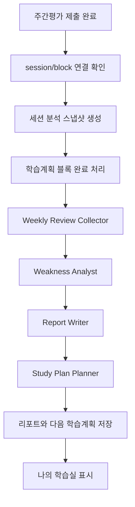

# 주간평가 완료 후 AI 주간 리포트 및 학습계획 생성 설계

## 목적

주간평가는 단순히 점수를 보여 주는 종료 화면이 아니라, 한 주 동안의 학습 결과를 요약하고 다음 주 학습계획을 만드는 트리거가 되어야 한다.

현재 학습계획은 `analytics` 앱의 `study_plan_mypage.study_plan_items` JSON과 `analytics` 집계 결과를 중심으로 동작한다. 따라서 주간평가 완료 후 흐름도 `analytics` 앱이 오케스트레이션을 담당하고, 문제 풀이/진단평가 앱은 완료 이벤트와 연결 식별자를 정확히 넘기는 역할로 제한하는 것이 좋다.

## 목표 동작

1. 사용자가 학습플래너의 주간평가 블록을 시작한다.
2. 진단평가 API가 주간평가 세션을 생성한다.
3. 사용자가 주간평가를 제출한다.
4. 제출 완료 시 해당 세션의 `solve_records`에 `studyplan_id`, `study_plan_block_id`가 남는다.
5. `analytics` 앱이 주간평가 블록을 완료 처리한다.
6. `analytics` 앱이 주간평가 결과와 최근 학습 기록을 바탕으로 AI 주간 리포트를 생성한다.
7. 리포트에서 추출한 취약점/개선점/우선순위를 바탕으로 다음 학습계획을 생성한다.
8. 나의 학습실에는 진단평가 대비 주간평가 비교, 주간 리포트 요약, 새 학습계획이 함께 보인다.

## 멀티에이전트 역할 분리

### 1. Weekly Review Collector

주간평가 완료 세션을 수집한다.

- 입력: `user_id`, `session_id`, `studyplan_id`, `study_plan_block_id`
- 조회 대상:
  - `solve_sessions`
  - `solve_records`
  - `analytics`
  - `study_plan_mypage`
- 산출:
  - 주간평가 총 문항 수
  - 정답률/오답률
  - 평균 풀이 시간
  - 시대/주제/유형별 오답률
  - 기존 진단평가 대비 변화량

### 2. Weakness Analyst

취약점을 판단한다.

- 취약 기준: 오답률 30% 이상
- 단일 분류뿐 아니라 `era + topic + q_type` 복합 취약점을 우선 사용한다.
- 표본 수가 너무 적은 항목은 리포트에서 "관찰 필요"로 낮은 확신도를 붙인다.
- 산출:
  - 핵심 취약 3개
  - 개선된 항목 3개
  - 다음 주 우선 학습 대상
  - 근거 수치

### 3. Report Writer

학생에게 보여 줄 주간 리포트 문장을 생성한다.

- 입력: Collector/Weakness Analyst 산출물
- 출력 형식:
  - 이번 주 요약
  - 진단평가 대비 변화
  - 가장 취약한 영역
  - 가장 개선된 영역
  - 다음 주 학습 전략
- 주의:
  - 점수만 말하지 않고 원인과 행동 제안을 함께 적는다.
  - 데이터가 부족하면 단정하지 않고 "추가 풀이 필요"라고 표시한다.

### 4. Study Plan Planner

리포트 결과를 다음 학습계획으로 변환한다.

- 입력:
  - 취약점 목록
  - 출제 예상 목록
  - 사용자 남은 시험일
  - 하루 학습 가능 시간
  - 최근 미완료 학습 블록
- 출력:
  - 6일 학습 + 1일 주간평가 구조
  - 각 일자별 학습 블록
  - 블록별 `era`, `topic`, `qType`, `questionCount`, `reason`

### 5. Orchestrator

전체 흐름을 조율한다.

- 주간평가 완료 이벤트를 받는다.
- Collector, Weakness Analyst, Report Writer, Planner를 순서대로 실행한다.
- 실패 시 중간 산출물을 저장하고 재시도 가능하게 한다.
- 새 학습계획 생성 전 기존 active 계획을 archived 처리한다.

## analytics 앱 내 구현 범위

analytics 앱에서 직접 구현 가능한 일:

- 주간평가 완료 후 비교 데이터 조회
- 주간평가 블록 완료 처리
- AI 리포트 저장 모델 또는 JSON 저장 정책 설계
- 다음 학습계획 생성
- 나의 학습실 표시
- 취약 기준 30% 적용
- 오늘 학습계획 자동 보정
- 전날 미완료 블록 오늘 이월

analytics 앱에서 직접 하기 어려운 일:

- 진단평가 시작 API가 `studyplan_id`, `study_plan_block_id`를 세션/레코드에 저장하는 것
- 진단평가 제출 API가 주간평가 완료 이벤트를 직접 호출하는 것
- 문제풀이 앱의 세션 생성/제출 payload 변경

이 부분은 아래 "외부 앱 변경 요청서"로 분리한다.

## 저장 구조 제안

### 주간 리포트 저장

새 테이블을 추가할 수 있다면 다음 구조를 권장한다.

```sql
weekly_ai_reports (
    report_id BIGSERIAL PRIMARY KEY,
    user_id BIGINT NOT NULL,
    studyplan_id BIGINT NULL,
    session_id BIGINT NULL,
    report_status VARCHAR(20) NOT NULL DEFAULT 'completed',
    summary TEXT NOT NULL,
    strengths JSONB NOT NULL DEFAULT '[]',
    weaknesses JSONB NOT NULL DEFAULT '[]',
    recommendations JSONB NOT NULL DEFAULT '[]',
    source_metrics JSONB NOT NULL DEFAULT '{}',
    created_at TIMESTAMP NOT NULL,
    modified_at TIMESTAMP NOT NULL
);
```

DB 변경이 당장 어렵다면 `analytics` 앱 내부 서비스가 JSON 파일이나 기존 확장 가능한 테이블을 임시 저장소로 쓰되, 운영 반영 전에는 별도 테이블로 분리해야 한다.

### 학습계획 생성 입력

AI 리포트가 Planner에 넘기는 최소 입력:

```json
{
  "userId": 1,
  "studyPlanId": 10,
  "weeklyReviewSessionId": 100,
  "weakTargets": [
    {
      "era": "조선",
      "topic": "정치",
      "qType": "사료 해석",
      "wrongRate": 42,
      "wrongCount": 5,
      "totalCount": 12,
      "reason": "최근 주간평가에서 오답률이 높음"
    }
  ],
  "improvedTargets": [],
  "availableMinutesPerDay": 60,
  "remainingDays": 14
}
```

## 주간평가 완료 이벤트 처리 순서



## 실패 처리

- 주간평가 세션은 완료됐지만 `study_plan_block_id`가 없으면:
  - 첫 진단평가 이후 완료된 diagnostic 세션을 fallback 비교 대상으로 사용한다.
  - 단, 학습계획 블록 자동 완료는 하지 않는다.
- AI 리포트 생성 실패:
  - 학습계획은 기존 규칙 기반 생성으로 fallback한다.
  - 리포트 상태를 `failed` 또는 `pending_retry`로 남긴다.
- 다음 학습계획 생성 실패:
  - 기존 계획을 archived 처리하지 않는다.
  - 사용자에게 "리포트는 생성됐지만 새 계획 생성이 필요합니다" 상태를 보여 준다.

## 외부 앱 변경 요청서

### diagnosis 앱 요청

주간평가 시작 요청에서 `studyplan_id`, `study_plan_block_id`를 받아야 한다.

현재 나의 학습실은 주간평가 시작 시 `/diagnosis/api/start/`로 다음 값을 보낸다.

```json
{
  "studyplan_id": 1,
  "study_plan_block_id": "block-uuid"
}
```

요청사항:

- `DiagnosisStartRequestSerializer`에 두 필드를 추가한다.
- `diagnosis_start`에서 세션 생성 후 생성되는 `SolveRecords`에 두 값을 저장한다.
- 주간평가 세션임을 식별할 수 있도록 기존 `session_type='diagnostic'`을 유지하되, 레코드의 study plan 연결값으로 일반 진단평가와 구분한다.

### diagnosis 제출 API 요청

요청사항:

- `diagnosis_submit` 완료 후 `analytics.service.studyplan.complete_study_plan_block_by_id()`를 호출한다.
- 호출 조건:
  - 해당 세션의 record 중 `studyplan_id`, `study_plan_block_id`가 존재함
  - 세션 상태가 `completed`
- 이후 AI 리포트 생성은 analytics 오케스트레이터가 담당한다.

### question 앱 요청

일반 학습계획 문제풀이 쪽은 이미 `studyplan_id`, `study_plan_block_id`를 저장하는 흐름이 있으므로 유지한다.

추가 요청:

- 학습계획 문제풀이 완료 후 analytics 이벤트 훅을 하나로 정리한다.
- 주간평가와 일반 학습 블록 완료 처리 로직이 같은 서비스 함수를 타도록 맞춘다.

## 현재 analytics 내부 보완 정책

외부 앱 변경 전까지는 analytics에서 다음 fallback을 유지한다.

- 첫 진단평가 이후 완료된 주간평가 연결 record가 있으면 그것을 비교 대상으로 사용한다.
- 연결 record가 없더라도 첫 진단평가 이후 완료된 diagnostic 세션이 있으면 비교 대상으로 사용한다.
- 과거 미완료 학습계획 블록은 나의 학습실 진입 시 오늘 날짜로 이월한다.
- 오늘 학습계획이 없고 같은 날 이미 생성/수정된 빈 계획이 아니라면 새 학습계획을 자동 생성한다.
